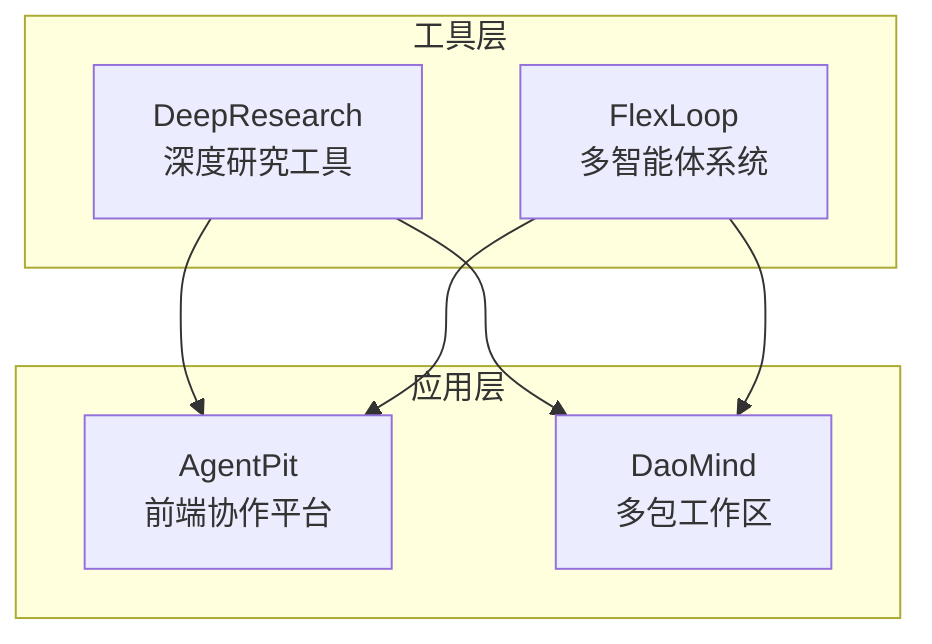
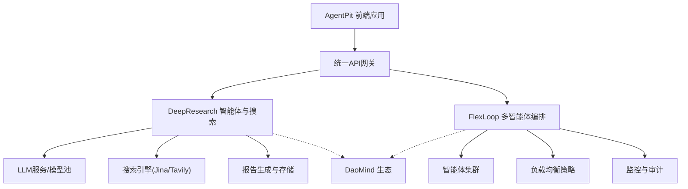
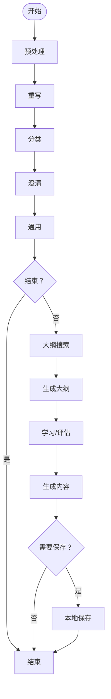
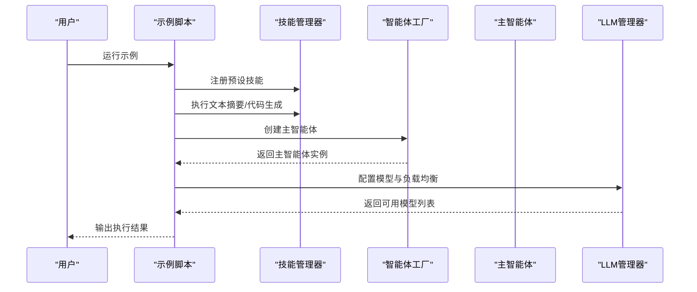
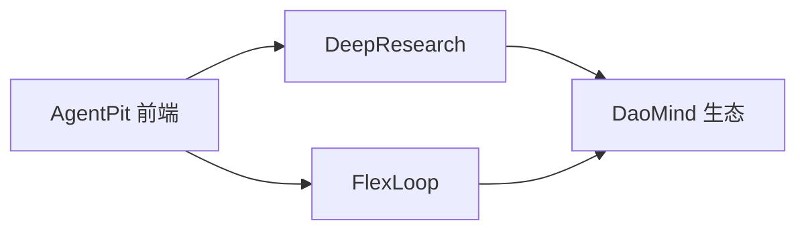
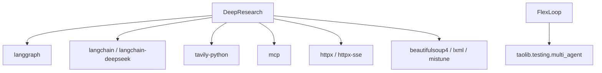

# AI工具平台

<cite>
**本文引用的文件**
- [DeepResearch 项目说明](file://tools/DeepResearch/README.md)
- [DeepResearch 包入口](file://tools/DeepResearch/src/deepresearch/__init__.py)
- [DeepResearch 图形化智能体构建](file://tools/DeepResearch/src/deepresearch/agent/agent.py)
- [DeepResearch CLI 入口](file://tools/DeepResearch/src/deepresearch/cli/__main__.py)
- [DeepResearch 配置基类](file://tools/DeepResearch/src/deepresearch/config/base.py)
- [DeepResearch 搜索客户端](file://tools/DeepResearch/src/deepresearch/tools/search.py)
- [DeepResearch 构建配置](file://tools/DeepResearch/pyproject.toml)
- [FlexLoop 项目说明](file://tools/flexloop/README.md)
- [FlexLoop 示例：多智能体使用](file://tools/flexloop/examples/multi_agent_example.py)
- [FlexLoop 包入口](file://tools/flexloop/src/taolib/__init__.py)
- [AgentPit 项目说明](file://apps/AgentPit/README.md)
</cite>

## 目录
1. [简介](#简介)
2. [项目结构](#项目结构)
3. [核心组件](#核心组件)
4. [架构总览](#架构总览)
5. [详细组件分析](#详细组件分析)
6. [依赖关系分析](#依赖关系分析)
7. [性能考虑](#性能考虑)
8. [故障排查指南](#故障排查指南)
9. [结论](#结论)
10. [附录](#附录)

## 简介
本技术文档面向AI工具平台，聚焦两大核心能力：
- DeepResearch 深度研究工具：基于多模态搜索与跨评估的渐进式研究框架，支持任务规划、工具调用、评估迭代与可视化报告生成。
- FlexLoop 多智能体系统：提供多智能体工作流、任务编排、负载均衡与监控调试能力，便于在统一平台上进行智能体生命周期管理与扩展。

同时，文档解释AI工具与AgentPit平台的协作关系、与DaoMind框架的集成方式，并给出集成指南、API接口说明、性能优化建议与扩展开发指南。

## 项目结构
该仓库采用多应用与多工具并行的组织方式：
- tools/DeepResearch：Python包形式的深度研究框架，包含CLI、配置管理、搜索工具、LLM集成与报告生成等模块。
- tools/flexloop：Python包形式的多智能体系统，包含示例、测试与taolib子包。
- apps/AgentPit：前端应用，作为AgentPit平台的界面与协作入口。
- apps/DaoMind：多包工作区，包含多个子包（如daoAgents、daoNexus等），用于支撑AI工具生态与协作。

**章节来源**
- [DeepResearch 项目说明:1-69](file://tools/DeepResearch/README.md#L1-L69)
- [FlexLoop 项目说明:1-100](file://tools/flexloop/README.md#L1-L100)
- [AgentPit 项目说明:1-6](file://apps/AgentPit/README.md#L1-L6)

## 核心组件
- DeepResearch
  - 多模态搜索与跨评估：通过可插拔搜索引擎（Jina/Tavily）与LLM协同，实现高质量检索与交叉验证。
  - 图形化智能体：基于LangGraph的状态图编排，涵盖预处理、重写、分类、澄清、通用节点、大纲搜索与生成、保存等阶段。
  - 配置管理：统一的BaseConfig与ConfigManager，支持文件、环境变量与代码注入的多源合并与校验。
  - 报告生成：生成节点输出并支持本地保存流程。
- FlexLoop
  - 多智能体工作流：示例展示了技能管理、智能体创建、主智能体编排与LLM负载均衡。
  - 调试与监控：通过测试套件与日志配置，支持可观测性与稳定性保障。
  - 包结构：taolib作为核心库，提供测试与多智能体相关模块。

**章节来源**
- [DeepResearch 图形化智能体构建:1-45](file://tools/DeepResearch/src/deepresearch/agent/agent.py#L1-L45)
- [DeepResearch 配置基类:190-590](file://tools/DeepResearch/src/deepresearch/config/base.py#L190-L590)
- [DeepResearch 搜索客户端:1-46](file://tools/DeepResearch/src/deepresearch/tools/search.py#L1-L46)
- [FlexLoop 示例：多智能体使用:1-196](file://tools/flexloop/examples/multi_agent_example.py#L1-L196)

## 架构总览
下图展示AI工具平台的整体架构：前端AgentPit负责用户交互与任务下发；DeepResearch与FlexLoop分别承担“研究分析”和“多智能体编排”的核心能力；DaoMind提供生态与协作支撑。

**图表来源**
- [DeepResearch 图形化智能体构建:19-45](file://tools/DeepResearch/src/deepresearch/agent/agent.py#L19-L45)
- [DeepResearch 搜索客户端:12-37](file://tools/DeepResearch/src/deepresearch/tools/search.py#L12-L37)
- [FlexLoop 示例：多智能体使用:14-33](file://tools/flexloop/examples/multi_agent_example.py#L14-L33)

## 详细组件分析

### DeepResearch：多模态搜索与报告生成
- 图形化智能体编排
  - 节点包括：预处理、重写、分类、澄清、通用、大纲搜索、大纲生成、学习、生成、本地保存。
  - 边缘连接体现条件分支与顺序控制，最终生成报告并可选择保存。
- 搜索客户端
  - 支持按配置选择Jina或Tavily引擎，封装统一的查询接口。
- 配置管理
  - BaseConfig提供字段级验证、环境变量映射、文件加载与合并策略。
  - ConfigManager支持多源配置加载与缓存清理，便于运行时热更新。
- 报告生成
  - 生成节点输出后进入保存判断逻辑，支持本地落盘。

**图表来源**
- [DeepResearch 图形化智能体构建:19-45](file://tools/DeepResearch/src/deepresearch/agent/agent.py#L19-L45)

**章节来源**
- [DeepResearch 图形化智能体构建:1-45](file://tools/DeepResearch/src/deepresearch/agent/agent.py#L1-L45)
- [DeepResearch 配置基类:190-590](file://tools/DeepResearch/src/deepresearch/config/base.py#L190-L590)
- [DeepResearch 搜索客户端:12-37](file://tools/DeepResearch/src/deepresearch/tools/search.py#L12-L37)

### FlexLoop：多智能体工作流与负载均衡
- 示例演示
  - 技能管理：注册与执行文本摘要、代码生成等技能。
  - 智能体创建：从模板创建主智能体与子智能体，支持自定义能力与标签。
  - LLM管理：配置模型提供方与权重，支持轮询等负载均衡策略。
- 结构要点
  - 通过工厂模式创建智能体，统一管理生命周期。
  - 通过LLMManager集中管理模型实例与可用模型列表。
  - 测试与示例驱动开发，便于扩展与回归验证。

**图表来源**
- [FlexLoop 示例：多智能体使用:36-196](file://tools/flexloop/examples/multi_agent_example.py#L36-L196)

**章节来源**
- [FlexLoop 示例：多智能体使用:1-196](file://tools/flexloop/examples/multi_agent_example.py#L1-L196)

### AgentPit 平台与 DaoMind 集成
- AgentPit作为前端协作平台，负责用户交互与任务下发，可对接DeepResearch与FlexLoop的能力。
- DaoMind提供多包工作区与生态能力，支持AgentPit与AI工具的协同与扩展。

**图表来源**
- [AgentPit 项目说明:1-6](file://apps/AgentPit/README.md#L1-L6)
- [DeepResearch 项目说明:1-69](file://tools/DeepResearch/README.md#L1-L69)
- [FlexLoop 项目说明:1-100](file://tools/flexloop/README.md#L1-L100)

**章节来源**
- [AgentPit 项目说明:1-6](file://apps/AgentPit/README.md#L1-L6)
- [DeepResearch 项目说明:1-69](file://tools/DeepResearch/README.md#L1-L69)
- [FlexLoop 项目说明:1-100](file://tools/flexloop/README.md#L1-L100)

## 依赖关系分析
- DeepResearch
  - 依赖LangGraph进行状态图编排，依赖LangChain/LangChain-DeepSeek进行LLM集成，依赖Tavily/Jina等搜索工具，以及HTTPX、BeautifulSoup、lxml、mistune等工具链。
  - CLI入口通过脚本映射到命令行工具函数。
- FlexLoop
  - 示例依赖taolib.testing.multi_agent中的工厂、智能体、技能与LLM管理模块，展示多智能体工作流与负载均衡。

**图表来源**
- [DeepResearch 构建配置:12-26](file://tools/DeepResearch/pyproject.toml#L12-L26)
- [DeepResearch CLI 入口:1-7](file://tools/DeepResearch/src/deepresearch/cli/__main__.py#L1-L7)
- [FlexLoop 示例：多智能体使用:14-33](file://tools/flexloop/examples/multi_agent_example.py#L14-L33)

**章节来源**
- [DeepResearch 构建配置:1-93](file://tools/DeepResearch/pyproject.toml#L1-L93)
- [DeepResearch CLI 入口:1-7](file://tools/DeepResearch/src/deepresearch/cli/__main__.py#L1-L7)
- [FlexLoop 示例：多智能体使用:1-196](file://tools/flexloop/examples/multi_agent_example.py#L1-L196)

## 性能考虑
- 搜索与LLM调用
  - 通过配置管理与环境变量控制超时、并发与重试策略，避免阻塞与资源浪费。
  - 使用缓存与LRU缓存减少重复读取配置与网络请求。
- 多智能体编排
  - 负载均衡策略（如轮询）结合权重分配，提升吞吐与稳定性。
  - 通过测试与监控体系，持续评估延迟、错误率与资源占用。
- 报告生成
  - 分步生成与条件保存，避免一次性大对象内存压力。

[本节为通用指导，无需特定文件引用]

## 故障排查指南
- 配置加载失败
  - 检查配置文件格式与路径，确认环境变量前缀与键名一致。
  - 使用配置管理器提供的合并与脱敏能力定位冲突项。
- 搜索引擎异常
  - 切换至备用引擎，核对API密钥与配额。
  - 查看搜索客户端的异常处理与回退逻辑。
- 多智能体执行失败
  - 通过示例脚本逐项验证技能注册与执行流程。
  - 检查LLM管理器的模型实例与可用模型列表。
- 日志与可观测性
  - 使用taolib的日志配置与测试模块，定位异常堆栈与性能瓶颈。

**章节来源**
- [DeepResearch 配置基类:278-471](file://tools/DeepResearch/src/deepresearch/config/base.py#L278-L471)
- [DeepResearch 搜索客户端:12-37](file://tools/DeepResearch/src/deepresearch/tools/search.py#L12-L37)
- [FlexLoop 示例：多智能体使用:173-196](file://tools/flexloop/examples/multi_agent_example.py#L173-L196)

## 结论
AI工具平台以DeepResearch与FlexLoop为核心，结合AgentPit与DaoMind，形成“前端协作—智能体编排—研究分析—生态集成”的完整闭环。通过模块化的配置管理、可插拔的搜索与LLM集成、以及完善的测试与监控体系，平台具备良好的扩展性与稳定性，适合在复杂业务场景中落地应用。

[本节为总结，无需特定文件引用]

## 附录

### 集成指南
- 与AgentPit协作
  - 在AgentPit中配置DeepResearch与FlexLoop的访问凭据与参数，通过统一API网关下发任务。
- 与DaoMind集成
  - 将taolib与DeepResearch作为依赖引入，复用其配置与日志体系，确保版本一致性。

[本节为通用指导，无需特定文件引用]

### API接口文档（概要）
- DeepResearch
  - CLI命令：通过脚本映射到命令行工具函数，支持参数化运行与日志配置。
  - 搜索接口：统一的SearchClient封装，支持Jina/Tavily引擎切换。
  - 配置接口：BaseConfig与ConfigManager提供从文件、环境变量与代码注入的多源加载与合并。
- FlexLoop
  - 示例脚本展示了技能管理、智能体创建、主智能体编排与LLM管理的典型调用路径。

**章节来源**
- [DeepResearch CLI 入口:1-7](file://tools/DeepResearch/src/deepresearch/cli/__main__.py#L1-L7)
- [DeepResearch 搜索客户端:12-37](file://tools/DeepResearch/src/deepresearch/tools/search.py#L12-L37)
- [DeepResearch 配置基类:224-291](file://tools/DeepResearch/src/deepresearch/config/base.py#L224-L291)
- [FlexLoop 示例：多智能体使用:36-196](file://tools/flexloop/examples/multi_agent_example.py#L36-L196)

### 使用教程与扩展开发指南
- 使用教程
  - DeepResearch：参考项目说明与示例，快速上手CLI与图形化智能体。
  - FlexLoop：参考示例脚本，掌握技能、智能体与LLM管理的基本用法。
- 扩展开发
  - 新增搜索引擎：在搜索客户端中新增分支并注册配置。
  - 新增智能体模板：在工厂中注册新模板，扩展能力与标签。
  - 新增LLM提供方：在LLM管理器中注册新提供方与权重。

**章节来源**
- [DeepResearch 项目说明:39-56](file://tools/DeepResearch/README.md#L39-L56)
- [FlexLoop 项目说明:68-80](file://tools/flexloop/README.md#L68-L80)
- [FlexLoop 示例：多智能体使用:80-172](file://tools/flexloop/examples/multi_agent_example.py#L80-L172)