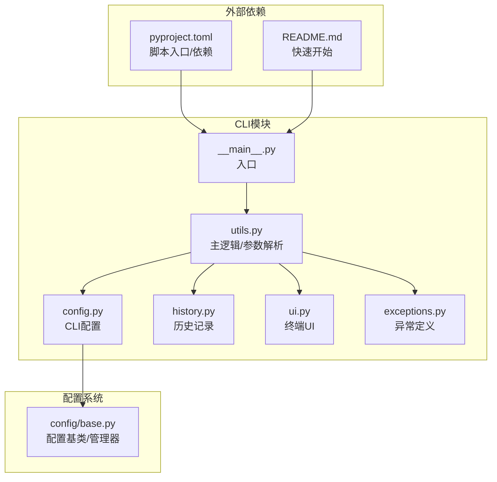
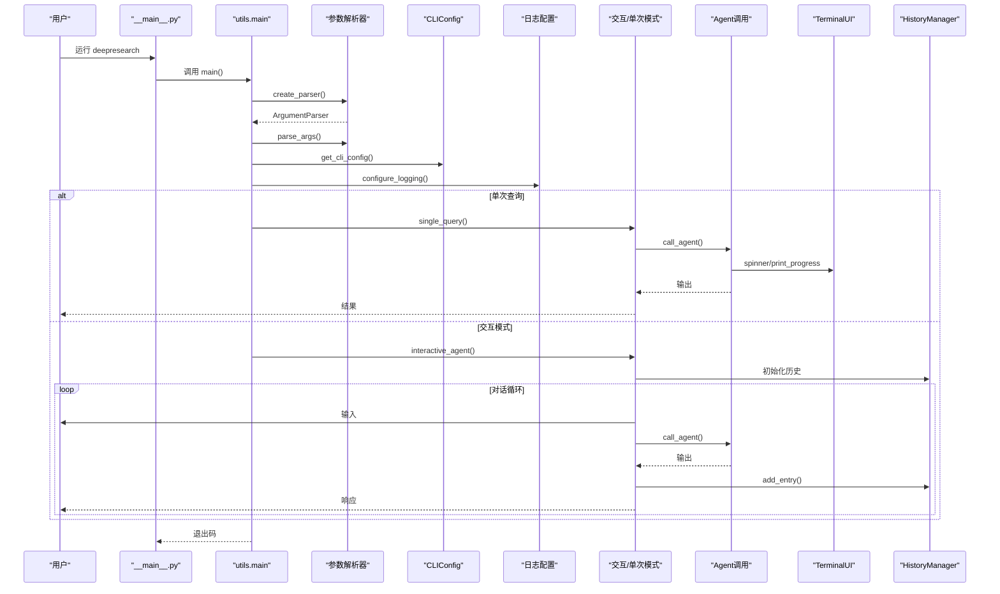
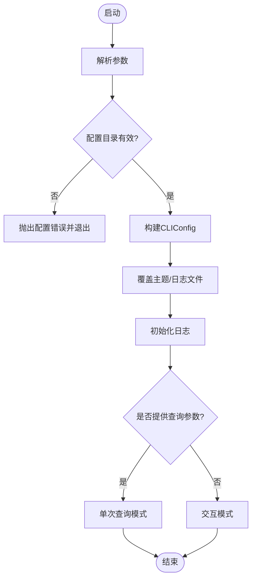
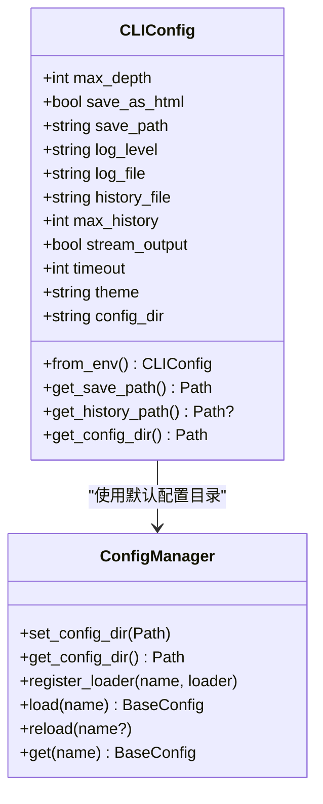
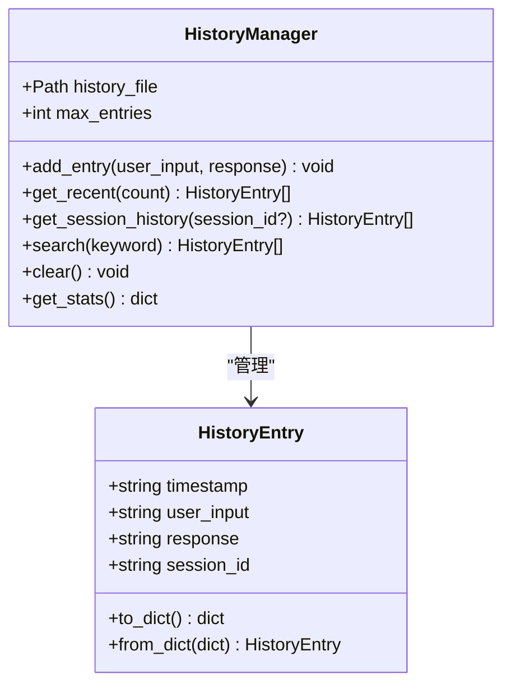
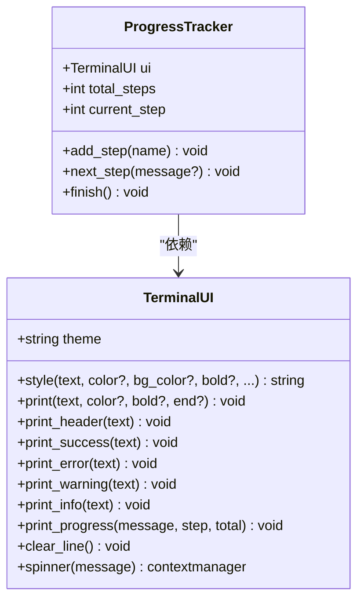
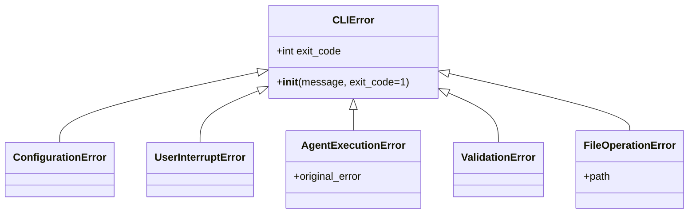
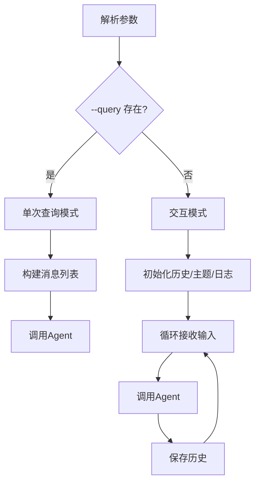
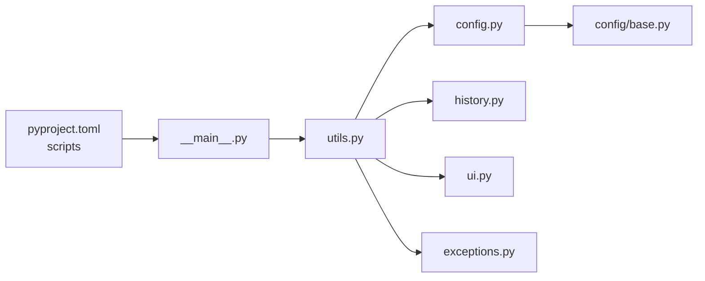

# CLI命令行接口

<cite>
**本文档引用的文件**
- [__main__.py](file://tools/DeepResearch/src/deepresearch/cli/__main__.py)
- [utils.py](file://tools/DeepResearch/src/deepresearch/cli/utils.py)
- [config.py](file://tools/DeepResearch/src/deepresearch/cli/config.py)
- [history.py](file://tools/DeepResearch/src/deepresearch/cli/history.py)
- [ui.py](file://tools/DeepResearch/src/deepresearch/cli/ui.py)
- [exceptions.py](file://tools/DeepResearch/src/deepresearch/cli/exceptions.py)
- [base.py](file://tools/DeepResearch/src/deepresearch/config/base.py)
- [pyproject.toml](file://tools/DeepResearch/pyproject.toml)
- [README.md](file://tools/DeepResearch/README.md)
- [test_ui.py](file://tools/DeepResearch/tests/unit/cli/test_ui.py)
- [test_config.py](file://tools/DeepResearch/tests/unit/cli/test_config.py)
- [test_history.py](file://tools/DeepResearch/tests/unit/cli/test_history.py)
</cite>

## 目录
1. [简介](#简介)
2. [项目结构](#项目结构)
3. [核心组件](#核心组件)
4. [架构总览](#架构总览)
5. [详细组件分析](#详细组件分析)
6. [依赖分析](#依赖分析)
7. [性能考虑](#性能考虑)
8. [故障排除指南](#故障排除指南)
9. [结论](#结论)
10. [附录](#附录)

## 简介
本文件为 DeepResearch CLI 命令行接口的详细技术文档，面向开发者与高级用户，系统阐述命令行工具的架构设计、配置管理、历史记录、用户界面、工具函数等核心模块；深入说明命令解析机制、参数验证、错误处理、进度显示等交互功能；解释用户体验设计、历史记录管理、配置持久化与异常处理策略；并提供所有 CLI 命令的功能说明、参数选项、使用示例与最佳实践，以及扩展开发指南与自定义命令添加方法。

## 项目结构
DeepResearch CLI 位于 tools/DeepResearch/src/deepresearch/cli 目录下，采用模块化组织：
- 入口模块负责脚本分发与主流程调度
- 配置模块负责 CLI 参数与环境变量解析、合并与校验
- 历史模块负责对话历史的增删改查与持久化
- UI 模块负责终端输出格式化、进度条与旋转指示器
- 异常模块提供统一的错误类型与退出码
- 配置基类模块提供通用配置加载、合并与缓存能力

**图表来源**
- [__main__.py:1-7](file://tools/DeepResearch/src/deepresearch/cli/__main__.py#L1-L7)
- [utils.py:1-575](file://tools/DeepResearch/src/deepresearch/cli/utils.py#L1-L575)
- [config.py:1-101](file://tools/DeepResearch/src/deepresearch/cli/config.py#L1-L101)
- [history.py:1-166](file://tools/DeepResearch/src/deepresearch/cli/history.py#L1-L166)
- [ui.py:1-382](file://tools/DeepResearch/src/deepresearch/cli/ui.py#L1-L382)
- [exceptions.py:1-58](file://tools/DeepResearch/src/deepresearch/cli/exceptions.py#L1-L58)
- [base.py:1-590](file://tools/DeepResearch/src/deepresearch/config/base.py#L1-L590)
- [pyproject.toml:79-81](file://tools/DeepResearch/pyproject.toml#L79-L81)
- [README.md:39-56](file://tools/DeepResearch/README.md#L39-L56)

**章节来源**
- [pyproject.toml:79-81](file://tools/DeepResearch/pyproject.toml#L79-L81)
- [README.md:39-56](file://tools/DeepResearch/README.md#L39-L56)

## 核心组件
- 入口与主流程
  - 入口模块通过脚本分发器调用 utils.main，实现命令行启动与退出码控制
  - 主流程负责参数解析、配置构建、日志初始化、模式选择（交互式/单次查询）、异常捕获与优雅退出
- 配置管理
  - CLIConfig 数据类封装 CLI 相关配置项，支持环境变量覆盖与参数覆盖合并
  - 配置目录可通过参数或环境变量指定，并与全局配置管理器协同工作
- 历史记录
  - HistoryEntry 表示单条历史，HistoryManager 提供增删查统计与持久化
  - 默认历史文件位置按平台规则自动确定，支持会话隔离与关键字检索
- 用户界面
  - TerminalUI 提供主题化输出、进度条、旋转指示器与消息样式
  - ProgressTracker 与 UI 协作，实现多步骤任务的可视化进度
- 异常体系
  - CLIError 及其子类提供统一的错误类型与退出码，便于上层处理

**章节来源**
- [__main__.py:1-7](file://tools/DeepResearch/src/deepresearch/cli/__main__.py#L1-L7)
- [utils.py:485-575](file://tools/DeepResearch/src/deepresearch/cli/utils.py#L485-L575)
- [config.py:15-101](file://tools/DeepResearch/src/deepresearch/cli/config.py#L15-L101)
- [history.py:18-166](file://tools/DeepResearch/src/deepresearch/cli/history.py#L18-L166)
- [ui.py:66-382](file://tools/DeepResearch/src/deepresearch/cli/ui.py#L66-L382)
- [exceptions.py:13-58](file://tools/DeepResearch/src/deepresearch/cli/exceptions.py#L13-L58)

## 架构总览
CLI 架构围绕“参数解析—配置构建—日志初始化—模式执行—异常处理”展开，各模块职责清晰、耦合度低，便于扩展与维护。

**图表来源**
- [__main__.py:1-7](file://tools/DeepResearch/src/deepresearch/cli/__main__.py#L1-L7)
- [utils.py:386-575](file://tools/DeepResearch/src/deepresearch/cli/utils.py#L386-L575)
- [config.py:66-101](file://tools/DeepResearch/src/deepresearch/cli/config.py#L66-L101)
- [history.py:38-166](file://tools/DeepResearch/src/deepresearch/cli/history.py#L38-L166)
- [ui.py:66-382](file://tools/DeepResearch/src/deepresearch/cli/ui.py#L66-L382)

## 详细组件分析

### 命令行入口与主流程
- 入口模块通过脚本分发器将命令映射到 utils.main，保证统一的生命周期管理
- 主流程负责：
  - 参数解析与校验
  - 配置目录参数校验与全局配置管理器联动
  - CLIConfig 构建与主题/日志文件覆盖
  - 日志初始化
  - 模式选择与异常捕获，返回标准化退出码

**图表来源**
- [utils.py:485-575](file://tools/DeepResearch/src/deepresearch/cli/utils.py#L485-L575)
- [config.py:66-101](file://tools/DeepResearch/src/deepresearch/cli/config.py#L66-L101)

**章节来源**
- [__main__.py:1-7](file://tools/DeepResearch/src/deepresearch/cli/__main__.py#L1-L7)
- [utils.py:485-575](file://tools/DeepResearch/src/deepresearch/cli/utils.py#L485-L575)

### 配置管理
- CLIConfig
  - 内置默认值与范围约束（深度、历史条数、超时等）
  - 支持从环境变量加载与参数覆盖合并
  - 提供路径解析与默认配置目录推导
- 配置目录与全局配置管理器
  - 支持通过参数或环境变量指定自定义配置目录
  - 与全局配置管理器协同，支持重新加载与缓存清理

**图表来源**
- [config.py:15-101](file://tools/DeepResearch/src/deepresearch/cli/config.py#L15-L101)
- [base.py:373-456](file://tools/DeepResearch/src/deepresearch/config/base.py#L373-L456)

**章节来源**
- [config.py:15-101](file://tools/DeepResearch/src/deepresearch/cli/config.py#L15-L101)
- [base.py:373-456](file://tools/DeepResearch/src/deepresearch/config/base.py#L373-L456)

### 历史记录管理
- HistoryEntry
  - 记录时间戳、用户输入、模型响应与会话 ID
  - 支持字典序列化与反序列化
- HistoryManager
  - 初始化时可加载历史文件（自动创建目录）
  - 提供新增、截断、检索、清空、统计等能力
  - 默认历史文件路径按平台规则自动确定

**图表来源**
- [history.py:18-166](file://tools/DeepResearch/src/deepresearch/cli/history.py#L18-L166)

**章节来源**
- [history.py:18-166](file://tools/DeepResearch/src/deepresearch/cli/history.py#L18-L166)

### 用户界面与进度显示
- TerminalUI
  - 自动检测终端颜色支持与宽度
  - 提供主题化标题、消息样式与进度条
  - 支持旋转指示器（spinner），适合长时间等待场景
- ProgressTracker
  - 与 UI 协作，追踪多步骤任务进度，自动显示步骤名称

**图表来源**
- [ui.py:66-382](file://tools/DeepResearch/src/deepresearch/cli/ui.py#L66-L382)

**章节来源**
- [ui.py:66-382](file://tools/DeepResearch/src/deepresearch/cli/ui.py#L66-L382)

### 异常处理与错误类型
- CLIError 及子类
  - ConfigurationError：配置错误（含退出码）
  - UserInterruptError：用户中断（含退出码）
  - AgentExecutionError：Agent 执行失败（含退出码与原始异常）
  - ValidationError：输入验证失败（含退出码）
  - FileOperationError：文件操作失败（含退出码与路径）
- 主流程捕获并统一返回退出码，保证用户友好的错误反馈

**图表来源**
- [exceptions.py:13-58](file://tools/DeepResearch/src/deepresearch/cli/exceptions.py#L13-L58)

**章节来源**
- [exceptions.py:13-58](file://tools/DeepResearch/src/deepresearch/cli/exceptions.py#L13-L58)
- [utils.py:563-575](file://tools/DeepResearch/src/deepresearch/cli/utils.py#L563-L575)

### 参数解析与命令说明
- 支持的命令行参数
  - -q/--query：单次查询模式
  - -d/--depth：搜索深度（1-10）
  - --no-html：不保存 HTML 报告
  - -o/--output：报告输出路径
  - --log-level：日志级别
  - --log-file：日志文件路径
  - --theme：界面主题（default/minimal/colorful）
  - -c/--config-dir：配置目录路径
  - -v/--version：显示版本
- 环境变量覆盖
  - DEEPRESEARCH_MAX_DEPTH、DEEPRESEARCH_SAVE_AS_HTML、DEEPRESEARCH_SAVE_PATH、DEEPRESEARCH_LOG_LEVEL、DEEPRESEARCH_THEME、DEEPRESEARCH_CONFIG_DIR 等

**图表来源**
- [utils.py:386-483](file://tools/DeepResearch/src/deepresearch/cli/utils.py#L386-L483)

**章节来源**
- [utils.py:386-483](file://tools/DeepResearch/src/deepresearch/cli/utils.py#L386-L483)

## 依赖分析
- 脚本入口
  - pyproject.toml 中将 deepresearch 映射到 utils:main，确保 pip 安装后可直接运行
- 外部依赖
  - CLI 依赖 LangChain/LangGraph 进行智能 Agent 工作流，依赖 HTTP 客户端与搜索工具
- 模块间依赖
  - utils 依赖 config、history、ui、exceptions 与全局配置管理器
  - config 依赖 logging 配置与基础配置管理器
  - history 依赖 exceptions 与 logging
  - ui 依赖 logging

**图表来源**
- [pyproject.toml:79-81](file://tools/DeepResearch/pyproject.toml#L79-L81)
- [__main__.py:1-7](file://tools/DeepResearch/src/deepresearch/cli/__main__.py#L1-L7)
- [utils.py:1-36](file://tools/DeepResearch/src/deepresearch/cli/utils.py#L1-L36)
- [config.py:1-12](file://tools/DeepResearch/src/deepresearch/cli/config.py#L1-L12)
- [history.py:1-13](file://tools/DeepResearch/src/deepresearch/cli/history.py#L1-L13)
- [ui.py:1-19](file://tools/DeepResearch/src/deepresearch/cli/ui.py#L1-L19)
- [exceptions.py:1-11](file://tools/DeepResearch/src/deepresearch/cli/exceptions.py#L1-L11)
- [base.py:1-13](file://tools/DeepResearch/src/deepresearch/config/base.py#L1-L13)

**章节来源**
- [pyproject.toml:79-81](file://tools/DeepResearch/pyproject.toml#L79-L81)

## 性能考虑
- I/O 与持久化
  - 历史文件采用增量写入与截断策略，避免大文件增长导致的性能问题
  - JSON 写入使用缩进与 UTF-8 编码，兼顾可读性与兼容性
- 并发与阻塞
  - Agent 调用采用异步流式处理，结合 spinner 与进度条提升感知性能
  - 信号处理支持中断，避免长时间阻塞
- 配置缓存
  - 配置系统提供缓存清理与重新加载能力，减少重复 I/O

[本节为通用指导，无需特定文件来源]

## 故障排除指南
- 常见错误与处理
  - 配置目录无效：检查路径存在性、可读性，必要时使用绝对路径
  - Agent 执行失败：查看日志文件定位具体异常，确认网络与工具可用性
  - 历史文件写入失败：检查目标路径权限与磁盘空间
  - 用户中断：使用 Ctrl+C 中断当前操作，程序将优雅退出
- 日志与调试
  - 通过 --log-level 与 --log-file 控制日志级别与输出位置
  - 使用 --config-dir 指定配置目录，结合重新加载机制验证配置生效

**章节来源**
- [utils.py:538-575](file://tools/DeepResearch/src/deepresearch/cli/utils.py#L538-L575)
- [exceptions.py:21-58](file://tools/DeepResearch/src/deepresearch/cli/exceptions.py#L21-L58)
- [history.py:72-108](file://tools/DeepResearch/src/deepresearch/cli/history.py#L72-L108)

## 结论
DeepResearch CLI 通过清晰的模块划分与完善的异常处理机制，实现了稳定、易用且可扩展的命令行体验。其配置管理、历史记录与终端 UI 设计充分考虑了实际使用场景，既满足日常交互需求，也为二次开发与定制提供了良好基础。

[本节为总结性内容，无需特定文件来源]

## 附录

### CLI 命令与参数速查
- 基本用法
  - 启动交互模式：deepresearch
  - 单次查询：deepresearch -q "你的问题"
- 关键参数
  - -q/--query：直接输入问题
  - -d/--depth：搜索深度（1-10）
  - --no-html：禁用 HTML 报告
  - -o/--output：报告输出路径
  - --log-level：日志级别
  - --log-file：日志文件路径
  - --theme：界面主题（default/minimal/colorful）
  - -c/--config-dir：配置目录路径
  - -v/--version：显示版本

**章节来源**
- [utils.py:386-483](file://tools/DeepResearch/src/deepresearch/cli/utils.py#L386-L483)

### 使用示例与最佳实践
- 示例
  - 交互式探索：deepresearch
  - 固定深度与输出：deepresearch -d 5 -o ./reports --no-html
  - 指定配置目录：deepresearch -c /etc/deepresearch
- 最佳实践
  - 使用 --log-level DEBUG 排查问题
  - 在 CI 环境中使用 --log-file 持久化日志
  - 合理设置 --depth 与 --timeout 平衡质量与性能

**章节来源**
- [utils.py:392-409](file://tools/DeepResearch/src/deepresearch/cli/utils.py#L392-L409)

### 扩展开发指南与自定义命令添加方法
- 扩展点
  - 新增命令：在 utils.create_parser 中添加新参数与动作
  - 新增模式：在 utils.main 中增加分支逻辑并绑定处理函数
  - 新增 UI 组件：在 ui.py 中扩展 TerminalUI 或 ProgressTracker
  - 新增配置项：在 CLIConfig 中添加字段并在 get_cli_config 合并
  - 新增历史行为：在 history.py 中扩展 HistoryManager 方法
- 注意事项
  - 保持异常类型一致，使用 CLIError 及其子类
  - 为新功能提供日志与错误信息
  - 遵循现有主题与输出风格，确保一致性

**章节来源**
- [utils.py:386-483](file://tools/DeepResearch/src/deepresearch/cli/utils.py#L386-L483)
- [ui.py:66-382](file://tools/DeepResearch/src/deepresearch/cli/ui.py#L66-L382)
- [config.py:15-101](file://tools/DeepResearch/src/deepresearch/cli/config.py#L15-L101)
- [history.py:18-166](file://tools/DeepResearch/src/deepresearch/cli/history.py#L18-L166)
- [exceptions.py:13-58](file://tools/DeepResearch/src/deepresearch/cli/exceptions.py#L13-L58)

### 测试参考
- UI 模块测试覆盖 TerminalUI、ProgressTracker 与主题行为
- 配置模块测试覆盖默认值、范围约束、环境变量合并与不可变性
- 历史模块测试覆盖增删改查、持久化与边界条件

**章节来源**
- [test_ui.py:1-320](file://tools/DeepResearch/tests/unit/cli/test_ui.py#L1-L320)
- [test_config.py:1-175](file://tools/DeepResearch/tests/unit/cli/test_config.py#L1-L175)
- [test_history.py:1-333](file://tools/DeepResearch/tests/unit/cli/test_history.py#L1-L333)