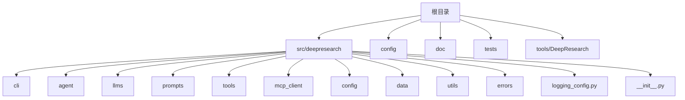
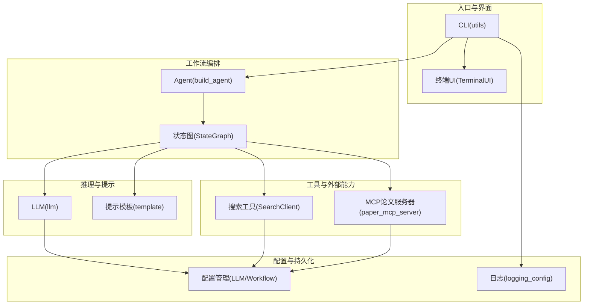
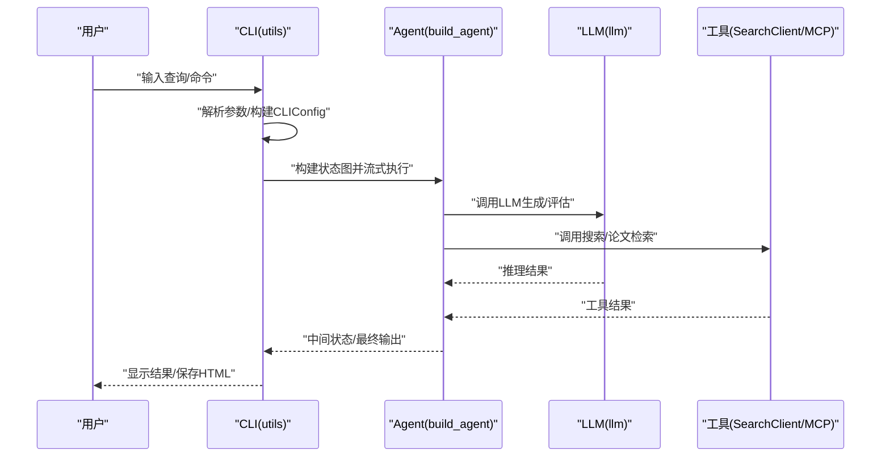
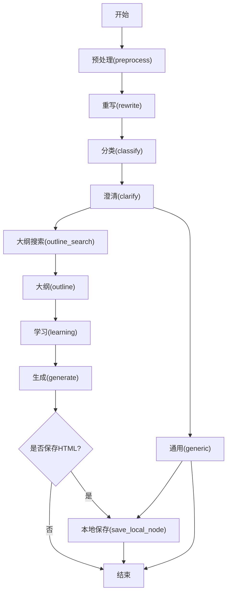
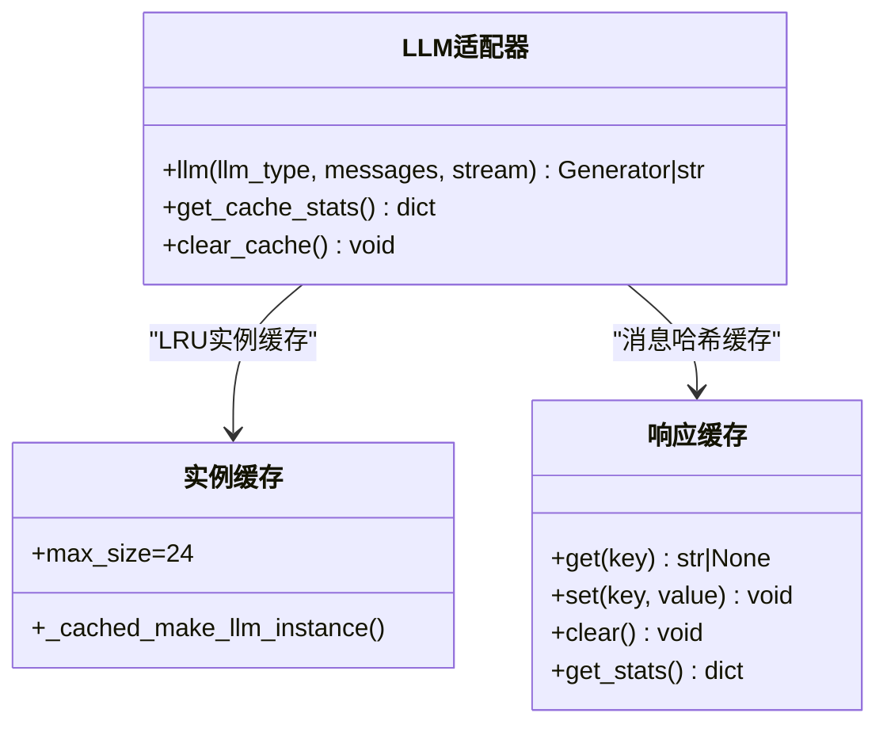
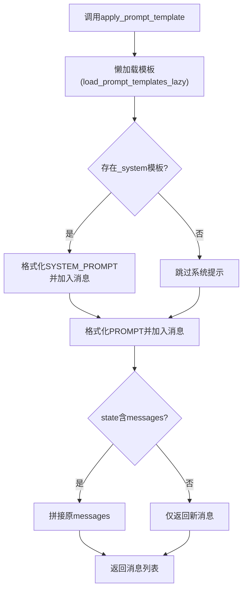
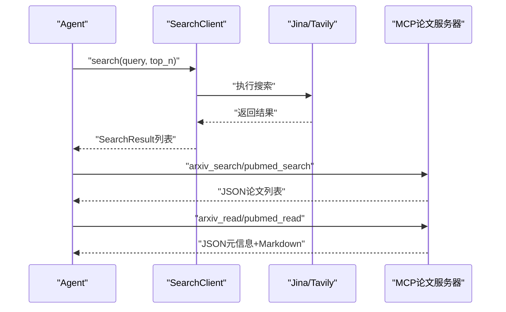
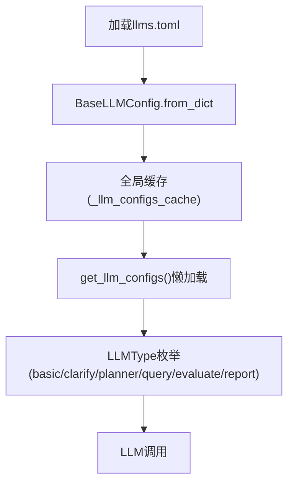
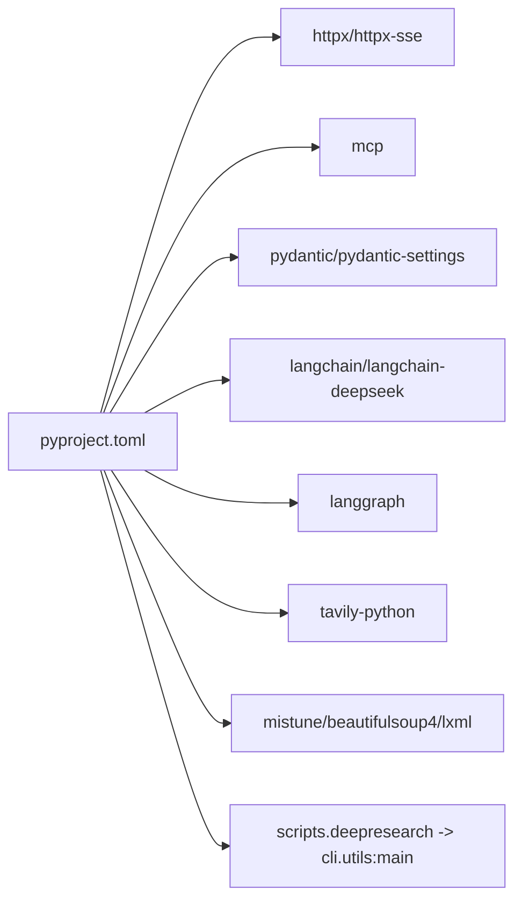

# DeepResearch深度研究工具

<cite>
**本文引用的文件**
- [README.md](file://tools/DeepResearch/README.md)
- [pyproject.toml](file://tools/DeepResearch/pyproject.toml)
- [架构设计文档](file://tools/DeepResearch/doc/architecture/architecture.md)
- [用户手册](file://tools/DeepResearch/doc/user_guide/user_guide.md)
- [__init__.py](file://tools/DeepResearch/src/deepresearch/__init__.py)
- [utils.py](file://tools/DeepResearch/src/deepresearch/cli/utils.py)
- [agent.py](file://tools/DeepResearch/src/deepresearch/agent/agent.py)
- [llm.py](file://tools/DeepResearch/src/deepresearch/llms/llm.py)
- [llms_config.py](file://tools/DeepResearch/src/deepresearch/config/llms_config.py)
- [search.py](file://tools/DeepResearch/src/deepresearch/tools/search.py)
- [template.py](file://tools/DeepResearch/src/deepresearch/prompts/template.py)
- [paper_mcp_server.py](file://tools/DeepResearch/src/deepresearch/mcp_client/paper_mcp_server.py)
- [workflow.toml](file://tools/DeepResearch/config/workflow.toml)
</cite>

## 目录
1. [简介](#简介)
2. [项目结构](#项目结构)
3. [核心组件](#核心组件)
4. [架构总览](#架构总览)
5. [详细组件分析](#详细组件分析)
6. [依赖关系分析](#依赖关系分析)
7. [性能考量](#性能考量)
8. [故障排查指南](#故障排查指南)
9. [结论](#结论)
10. [附录](#附录)

## 简介
DeepResearch是一个基于渐进式搜索与交叉评估的轻量级深度研究框架，支持多LLM协作、搜索工具集成、可视化报告生成与智能工作流“任务规划→工具调用→评估与迭代”。系统通过模块化设计与LangGraph状态图编排，实现从输入查询到最终HTML报告的完整闭环。

- 快速开始与在线体验参见项目自述文件与在线演示链接
- 详细文档与API参见doc目录下的架构、用户手册与API文档

**章节来源**
- [README.md:15-69](file://tools/DeepResearch/README.md#L15-L69)
- [用户手册:1-208](file://tools/DeepResearch/doc/user_guide/user_guide.md#L1-L208)

## 项目结构
项目采用多包分层组织，核心源码位于src/deepresearch下，包含CLI、Agent工作流、LLM适配、提示词模板、工具与MCP客户端等模块；配置位于config目录，文档位于doc目录。

**图表来源**
- [架构设计文档:19-27](file://tools/DeepResearch/doc/architecture/architecture.md#L19-L27)

**章节来源**
- [架构设计文档:5-27](file://tools/DeepResearch/doc/architecture/architecture.md#L5-L27)

## 核心组件
- CLI与运行入口：提供命令行交互、单次查询、配置覆盖与信号处理
- Agent工作流：基于LangGraph的状态图，串联预处理、重写、分类、澄清、通用处理、大纲搜索与生成、保存等节点
- LLM适配器：封装DeepSeek聊天模型，提供实例缓存、响应缓存、流式/非流式输出
- 提示词模板系统：动态加载多类模板，支持系统提示与用户提示注入
- 搜索工具：统一工厂封装Jina与Tavily搜索引擎
- MCP论文检索服务器：提供arXiv/PubMed搜索与阅读能力，支持PDF转Markdown
- 配置管理：LLM/TOML配置加载与懒加载缓存

**章节来源**
- [utils.py:106-193](file://tools/DeepResearch/src/deepresearch/cli/utils.py#L106-L193)
- [agent.py:19-45](file://tools/DeepResearch/src/deepresearch/agent/agent.py#L19-L45)
- [llm.py:146-256](file://tools/DeepResearch/src/deepresearch/llms/llm.py#L146-L256)
- [template.py:25-129](file://tools/DeepResearch/src/deepresearch/prompts/template.py#L25-L129)
- [search.py:12-37](file://tools/DeepResearch/src/deepresearch/tools/search.py#L12-L37)
- [paper_mcp_server.py:445-463](file://tools/DeepResearch/src/deepresearch/mcp_client/paper_mcp_server.py#L445-L463)
- [llms_config.py:46-86](file://tools/DeepResearch/src/deepresearch/config/llms_config.py#L46-L86)

## 架构总览
系统采用“模块解耦、职责清晰”的分层架构：CLI负责输入与输出、Agent负责流程编排、LLM负责推理、Prompt模板负责消息构造、Tools负责外部能力接入、MCP提供论文检索增强、配置模块提供集中化配置。

**图表来源**
- [架构设计文档:19-27](file://tools/DeepResearch/doc/architecture/architecture.md#L19-L27)
- [agent.py:19-45](file://tools/DeepResearch/src/deepresearch/agent/agent.py#L19-L45)
- [llm.py:146-256](file://tools/DeepResearch/src/deepresearch/llms/llm.py#L146-L256)
- [template.py:25-129](file://tools/DeepResearch/src/deepresearch/prompts/template.py#L25-L129)
- [search.py:12-37](file://tools/DeepResearch/src/deepresearch/tools/search.py#L12-L37)
- [paper_mcp_server.py:445-463](file://tools/DeepResearch/src/deepresearch/mcp_client/paper_mcp_server.py#L445-L463)

## 详细组件分析

### CLI与运行流程
- 支持交互式对话与单次查询两种模式，具备历史记录、帮助、中断处理与信号响应
- 命令行参数覆盖配置，支持深度、HTML报告开关、输出路径、日志级别、主题、配置目录等
- 通过build_agent构建状态图并流式执行，实时输出中间结果

**图表来源**
- [utils.py:106-193](file://tools/DeepResearch/src/deepresearch/cli/utils.py#L106-L193)
- [agent.py:19-45](file://tools/DeepResearch/src/deepresearch/agent/agent.py#L19-L45)
- [llm.py:146-256](file://tools/DeepResearch/src/deepresearch/llms/llm.py#L146-L256)
- [search.py:12-37](file://tools/DeepResearch/src/deepresearch/tools/search.py#L12-L37)
- [paper_mcp_server.py:445-463](file://tools/DeepResearch/src/deepresearch/mcp_client/paper_mcp_server.py#L445-L463)

**章节来源**
- [utils.py:386-575](file://tools/DeepResearch/src/deepresearch/cli/utils.py#L386-L575)
- [用户手册:29-121](file://tools/DeepResearch/doc/user_guide/user_guide.md#L29-L121)

### Agent工作流与状态图
- 状态图节点包括：预处理、重写、分类、澄清、通用、大纲搜索、大纲生成、学习、生成、本地保存
- 条件边控制生成后是否保存本地并结束
- 通过可配置的depth、save_as_html、save_path控制行为

**图表来源**
- [agent.py:19-45](file://tools/DeepResearch/src/deepresearch/agent/agent.py#L19-L45)

**章节来源**
- [agent.py:19-45](file://tools/DeepResearch/src/deepresearch/agent/agent.py#L19-L45)
- [架构设计文档:78-98](file://tools/DeepResearch/doc/architecture/architecture.md#L78-L98)

### LLM适配器与缓存策略
- LLM实例缓存：LRU缓存最多24个实例，按类型/流式/最大token组合键缓存
- 响应缓存：基于消息哈希的线程安全LRU缓存，命中直接返回，提升重复查询性能
- 流式/非流式统一接口，支持reasoning_content与content分离输出
- 提供缓存统计与清理接口，便于监控与维护

**图表来源**
- [llm.py:44-121](file://tools/DeepResearch/src/deepresearch/llms/llm.py#L44-L121)
- [llm.py:126-266](file://tools/DeepResearch/src/deepresearch/llms/llm.py#L126-L266)

**章节来源**
- [llm.py:146-256](file://tools/DeepResearch/src/deepresearch/llms/llm.py#L146-L256)
- [llms_config.py:46-115](file://tools/DeepResearch/src/deepresearch/config/llms_config.py#L46-L115)

### 提示词模板系统
- 动态扫描generate/learning/outline/prep四类目录，按模块名加载PROMPT与SYSTEM_PROMPT
- 支持系统提示与用户提示分别注入，缺失变量时抛出明确错误
- 首次使用懒加载，后续复用全局缓存

**图表来源**
- [template.py:78-129](file://tools/DeepResearch/src/deepresearch/prompts/template.py#L78-L129)

**章节来源**
- [template.py:25-129](file://tools/DeepResearch/src/deepresearch/prompts/template.py#L25-L129)

### 搜索工具与MCP论文检索
- SearchClient根据配置选择Jina或Tavily引擎，统一search接口
- MCP论文服务器提供arXiv与PubMed的搜索与阅读能力，支持PDF下载与pymupdf4llm转Markdown
- 结果持久化至paper_cache目录，便于复用与离线分析

**图表来源**
- [search.py:12-37](file://tools/DeepResearch/src/deepresearch/tools/search.py#L12-L37)
- [paper_mcp_server.py:445-463](file://tools/DeepResearch/src/deepresearch/mcp_client/paper_mcp_server.py#L445-L463)

**章节来源**
- [search.py:12-37](file://tools/DeepResearch/src/deepresearch/tools/search.py#L12-L37)
- [paper_mcp_server.py:445-463](file://tools/DeepResearch/src/deepresearch/mcp_client/paper_mcp_server.py#L445-L463)

### 配置管理与工作流参数
- LLM配置：llms.toml按名称映射到BaseLLMConfig，支持懒加载与重新加载
- 工作流配置：workflow.toml提供搜索topN等参数
- CLI配置：支持环境变量覆盖与命令行参数优先级

**图表来源**
- [llms_config.py:46-115](file://tools/DeepResearch/src/deepresearch/config/llms_config.py#L46-L115)
- [workflow.toml:1-3](file://tools/DeepResearch/config/workflow.toml#L1-L3)

**章节来源**
- [llms_config.py:46-115](file://tools/DeepResearch/src/deepresearch/config/llms_config.py#L46-L115)
- [workflow.toml:1-3](file://tools/DeepResearch/config/workflow.toml#L1-L3)

## 依赖关系分析
- 依赖清单与脚本入口由pyproject.toml定义，包含httpx、mcp、pydantic、langchain/langgraph、tavily、mistune等
- CLI入口指向deepresearch.cli.utils:main，提供命令行运行能力
- LangGraph用于状态图编排，LangChain用于LLM与工具集成

**图表来源**
- [pyproject.toml:12-26](file://tools/DeepResearch/pyproject.toml#L12-L26)
- [pyproject.toml:79-80](file://tools/DeepResearch/pyproject.toml#L79-L80)

**章节来源**
- [pyproject.toml:12-26](file://tools/DeepResearch/pyproject.toml#L12-L26)
- [pyproject.toml:79-80](file://tools/DeepResearch/pyproject.toml#L79-L80)

## 性能考量
- LLM实例与响应双重缓存，降低重复调用成本
- 提示模板懒加载，减少启动开销
- 并行处理能力（工具层可并行）与流式输出优化用户体验
- 建议：合理设置max_depth、topN与缓存统计监控，避免过度请求

**章节来源**
- [架构设计文档:122-130](file://tools/DeepResearch/doc/architecture/architecture.md#L122-L130)
- [llm.py:258-266](file://tools/DeepResearch/src/deepresearch/llms/llm.py#L258-L266)

## 故障排查指南
- CLI启动失败：检查依赖安装、配置路径与环境变量
- LLM调用失败：核对API密钥、服务连通性与网络代理
- 搜索工具失败：确认引擎配置与API密钥有效性
- HTML报告生成失败：检查保存路径权限与依赖库
- 交互中断：Ctrl+C触发UserInterruptError，系统会清理失败消息并继续

**章节来源**
- [用户手册:168-196](file://tools/DeepResearch/doc/user_guide/user_guide.md#L168-L196)
- [utils.py:181-192](file://tools/DeepResearch/src/deepresearch/cli/utils.py#L181-L192)

## 结论
DeepResearch通过模块化与状态图编排，实现了“任务规划→工具调用→评估与迭代”的智能研究闭环；结合多LLM协作、搜索工具与MCP论文检索，以及提示词模板与缓存优化，形成轻量、高效、可扩展的深度研究框架。建议在生产环境中配合缓存监控、配置热加载与日志审计，持续优化研究深度与稳定性。

## 附录

### 安装与部署
- 克隆仓库后使用可编辑安装，注册CLI入口为deepresearch
- 运行前需配置LLM与搜索工具的API密钥，参考用户手册与配置文件

**章节来源**
- [README.md:39-56](file://tools/DeepResearch/README.md#L39-L56)
- [用户手册:31-36](file://tools/DeepResearch/doc/user_guide/user_guide.md#L31-L36)

### CLI接口与参数
- 支持单次查询(-q)、深度(--depth)、关闭HTML(--no-html)、输出路径(-o)、日志级别(--log-level)、日志文件(--log-file)、主题(--theme)、配置目录(-c)、版本(--version)
- 环境变量覆盖默认行为，便于容器化与CI/CD集成

**章节来源**
- [utils.py:386-483](file://tools/DeepResearch/src/deepresearch/cli/utils.py#L386-L483)

### 配置选项说明
- llms.toml：定义LLM类型与认证信息
- search.toml：定义搜索引擎与参数
- workflow.toml：定义工作流参数（如topN）

**章节来源**
- [llms_config.py:46-86](file://tools/DeepResearch/src/deepresearch/config/llms_config.py#L46-L86)
- [workflow.toml:1-3](file://tools/DeepResearch/config/workflow.toml#L1-L3)

### 使用示例与最佳实践
- 命令行示例与模块导入示例参见用户手册
- 建议明确研究目标、合理配置深度、验证结果并定期更新配置

**章节来源**
- [用户手册:74-121](file://tools/DeepResearch/doc/user_guide/user_guide.md#L74-L121)
- [用户手册:150-167](file://tools/DeepResearch/doc/user_guide/user_guide.md#L150-L167)

### 扩展开发指南
- 新增LLM：在llms.toml中新增条目并通过LLMType引用
- 新增工具：实现工具接口并注册到SearchClient或MCP服务器
- 新增提示模板：在对应目录添加模板文件，遵循PROMPT/SYSTEM_PROMPT命名
- 扩展工作流：修改agent.py中的状态图节点与条件边

**章节来源**
- [架构设计文档:131-139](file://tools/DeepResearch/doc/architecture/architecture.md#L131-L139)
- [agent.py:19-45](file://tools/DeepResearch/src/deepresearch/agent/agent.py#L19-L45)
- [template.py:25-71](file://tools/DeepResearch/src/deepresearch/prompts/template.py#L25-L71)