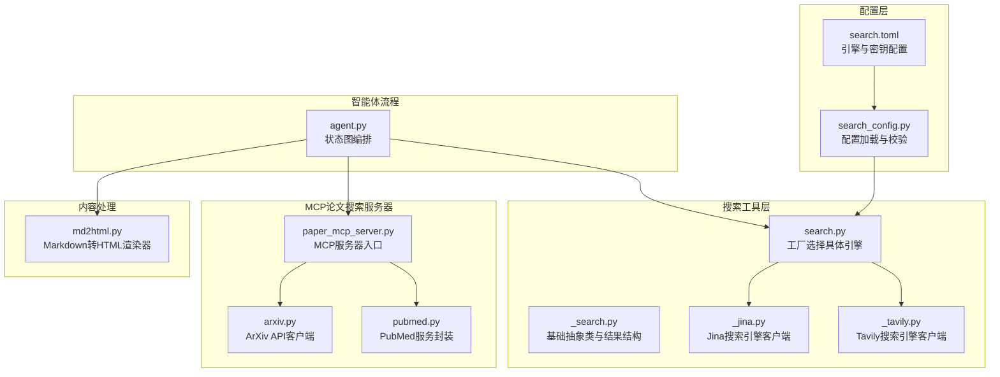
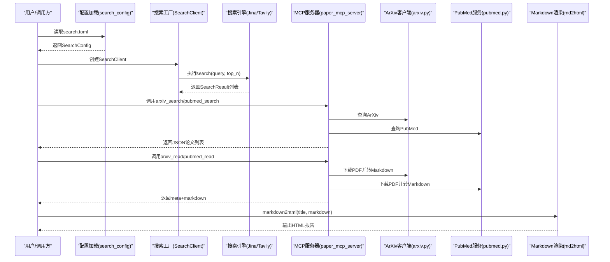
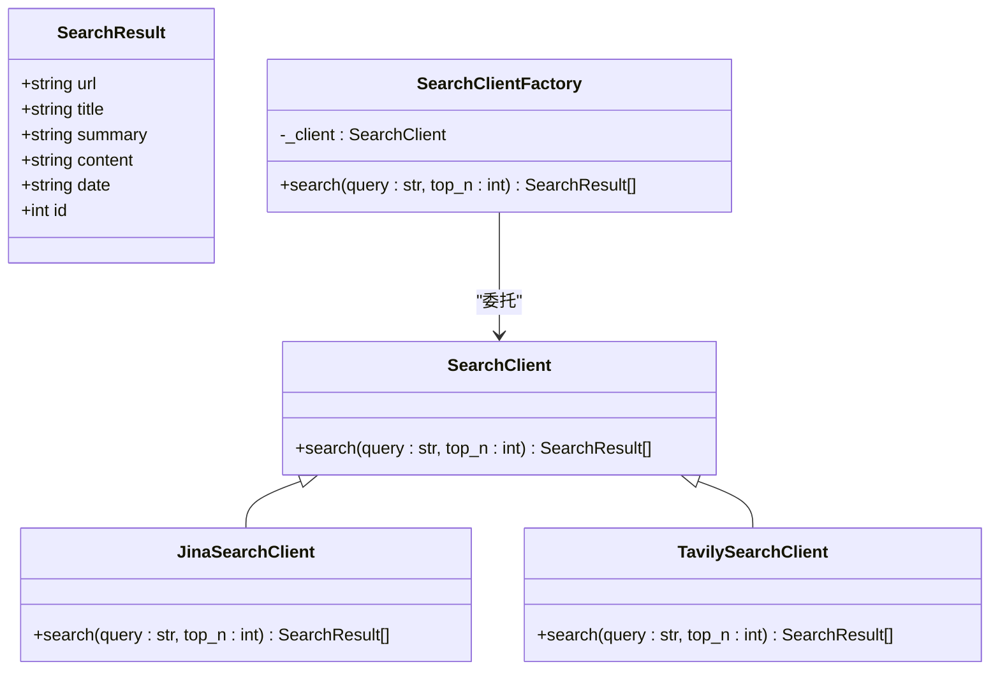
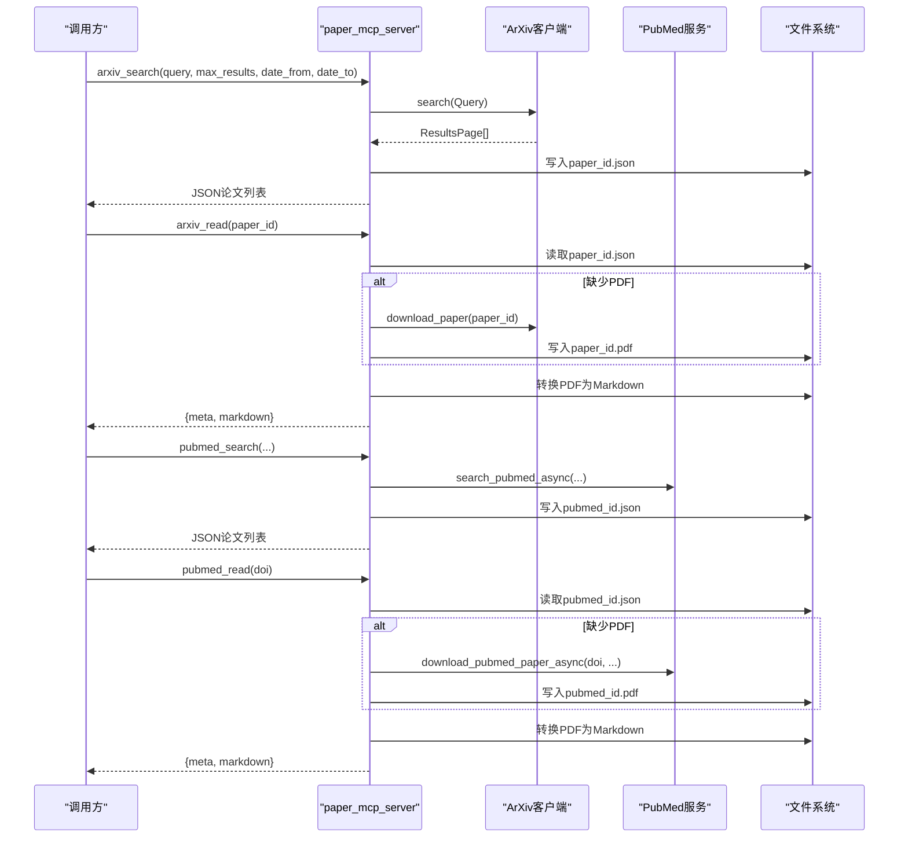
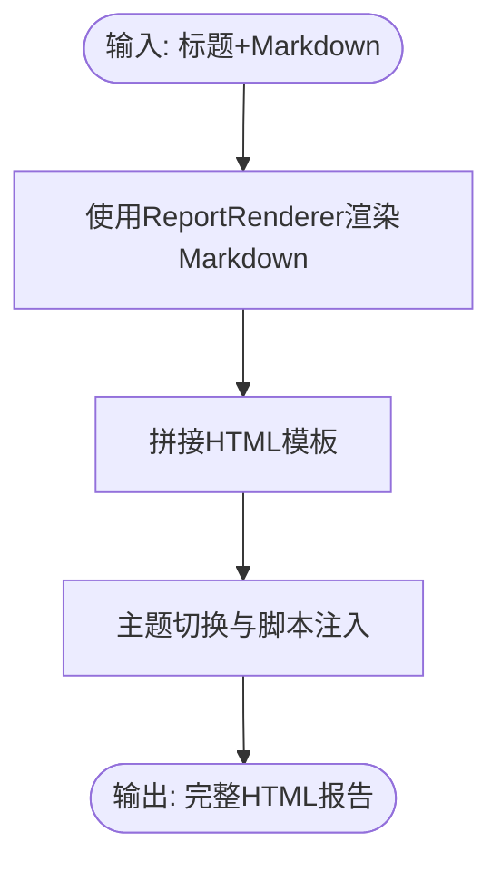
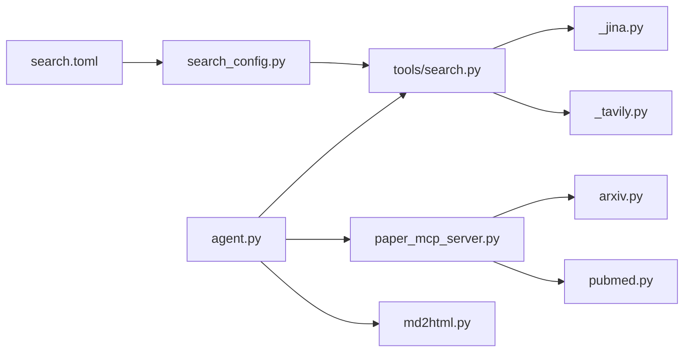

# 工具集成与搜索

<cite>
**本文引用的文件**
- [tools/search.py](file://tools/DeepResearch/src/deepresearch/tools/search.py)
- [_search.py](file://tools/DeepResearch/src/deepresearch/tools/_search.py)
- [_jina.py](file://tools/DeepResearch/src/deepresearch/tools/_jina.py)
- [_tavily.py](file://tools/DeepResearch/src/deepresearch/tools/_tavily.py)
- [search_config.py](file://tools/DeepResearch/src/deepresearch/config/search_config.py)
- [search.toml](file://tools/DeepResearch/config/search.toml)
- [paper_mcp_server.py](file://tools/DeepResearch/src/deepresearch/mcp_client/paper_mcp_server.py)
- [arxiv.py](file://tools/DeepResearch/src/deepresearch/mcp_client/arxiv.py)
- [pubmed.py](file://tools/DeepResearch/src/deepresearch/mcp_client/pubmed.py)
- [md2html.py](file://tools/DeepResearch/src/deepresearch/tools/md2html.py)
- [agent.py](file://tools/DeepResearch/src/deepresearch/agent/agent.py)
</cite>

## 目录
1. [简介](#简介)
2. [项目结构](#项目结构)
3. [核心组件](#核心组件)
4. [架构总览](#架构总览)
5. [详细组件分析](#详细组件分析)
6. [依赖关系分析](#依赖关系分析)
7. [性能考量](#性能考量)
8. [故障排查指南](#故障排查指南)
9. [结论](#结论)
10. [附录](#附录)

## 简介
本技术文档面向DeepResearch工具集成与搜索系统，聚焦多源搜索工具的统一抽象与集成、学术资源（ArXiv、PubMed）的MCP论文搜索服务器、内容提取与HTML转换机制、以及质量评估与去重策略。文档同时提供工具扩展开发指南与自定义搜索源集成方法，帮助开发者快速理解并扩展系统能力。

## 项目结构
DeepResearch位于tools/DeepResearch目录下，核心模块包括：
- 搜索工具层：统一抽象接口与具体实现（Jina、Tavily）
- 配置层：搜索配置加载与校验
- MCP客户端：ArXiv与PubMed论文搜索与阅读服务
- 内容处理：Markdown到HTML的渲染与模板
- 智能体流程：报告生成与保存的编排

**图表来源**
- [tools/search.py:1-46](file://tools/DeepResearch/src/deepresearch/tools/search.py#L1-L46)
- [_search.py:1-35](file://tools/DeepResearch/src/deepresearch/tools/_search.py#L1-L35)
- [_jina.py:1-92](file://tools/DeepResearch/src/deepresearch/tools/_jina.py#L1-L92)
- [_tavily.py:1-72](file://tools/DeepResearch/src/deepresearch/tools/_tavily.py#L1-L72)
- [search_config.py:1-82](file://tools/DeepResearch/src/deepresearch/config/search_config.py#L1-L82)
- [search.toml:1-6](file://tools/DeepResearch/config/search.toml#L1-L6)
- [paper_mcp_server.py:1-463](file://tools/DeepResearch/src/deepresearch/mcp_client/paper_mcp_server.py#L1-L463)
- [arxiv.py:1-456](file://tools/DeepResearch/src/deepresearch/mcp_client/arxiv.py#L1-L456)
- [pubmed.py:1-480](file://tools/DeepResearch/src/deepresearch/mcp_client/pubmed.py#L1-L480)
- [md2html.py:1-1267](file://tools/DeepResearch/src/deepresearch/tools/md2html.py#L1-L1267)
- [agent.py:1-45](file://tools/DeepResearch/src/deepresearch/agent/agent.py#L1-L45)

**章节来源**
- [tools/search.py:1-46](file://tools/DeepResearch/src/deepresearch/tools/search.py#L1-L46)
- [search_config.py:1-82](file://tools/DeepResearch/src/deepresearch/config/search_config.py#L1-L82)
- [search.toml:1-6](file://tools/DeepResearch/config/search.toml#L1-L6)
- [paper_mcp_server.py:1-463](file://tools/DeepResearch/src/deepresearch/mcp_client/paper_mcp_server.py#L1-L463)
- [md2html.py:1-1267](file://tools/DeepResearch/src/deepresearch/tools/md2html.py#L1-L1267)
- [agent.py:1-45](file://tools/DeepResearch/src/deepresearch/agent/agent.py#L1-L45)

## 核心组件
- 统一搜索抽象与工厂
  - 抽象基类提供标准接口，确保不同搜索引擎实现的一致性
  - 工厂根据配置动态选择具体搜索引擎（Jina或Tavily）
- 学术资源MCP服务器
  - 提供arxiv_search、arxiv_read、pubmed_search、pubmed_read四个工具
  - 支持异步下载PDF并转换为Markdown，缓存元数据与内容
- 内容提取与HTML转换
  - Markdown渲染器与HTML模板，支持图表、表格、脚注等增强
- 配置管理
  - TOML配置文件与类型安全的加载与校验逻辑

**章节来源**
- [_search.py:1-35](file://tools/DeepResearch/src/deepresearch/tools/_search.py#L1-L35)
- [tools/search.py:1-46](file://tools/DeepResearch/src/deepresearch/tools/search.py#L1-L46)
- [_jina.py:1-92](file://tools/DeepResearch/src/deepresearch/tools/_jina.py#L1-L92)
- [_tavily.py:1-72](file://tools/DeepResearch/src/deepresearch/tools/_tavily.py#L1-L72)
- [paper_mcp_server.py:1-463](file://tools/DeepResearch/src/deepresearch/mcp_client/paper_mcp_server.py#L1-L463)
- [md2html.py:1-1267](file://tools/DeepResearch/src/deepresearch/tools/md2html.py#L1-L1267)
- [search_config.py:1-82](file://tools/DeepResearch/src/deepresearch/config/search_config.py#L1-L82)
- [search.toml:1-6](file://tools/DeepResearch/config/search.toml#L1-L6)

## 架构总览
系统采用“配置驱动 + 统一抽象 + 多源集成”的架构：
- 配置层负责加载引擎与密钥，提供运行时参数
- 搜索层通过抽象接口屏蔽差异，支持Jina/Tavily切换
- MCP层提供学术论文检索与阅读能力，包含缓存与内容转换
- 内容层将结构化内容渲染为HTML报告
- 智能体编排节点串联预处理、大纲、学习、生成与保存

**图表来源**
- [search_config.py:56-82](file://tools/DeepResearch/src/deepresearch/config/search_config.py#L56-L82)
- [search.toml:1-6](file://tools/DeepResearch/config/search.toml#L1-L6)
- [tools/search.py:12-36](file://tools/DeepResearch/src/deepresearch/tools/search.py#L12-L36)
- [_jina.py:28-79](file://tools/DeepResearch/src/deepresearch/tools/_jina.py#L28-L79)
- [_tavily.py:21-60](file://tools/DeepResearch/src/deepresearch/tools/_tavily.py#L21-L60)
- [paper_mcp_server.py:45-104](file://tools/DeepResearch/src/deepresearch/mcp_client/paper_mcp_server.py#L45-L104)
- [arxiv.py:330-392](file://tools/DeepResearch/src/deepresearch/mcp_client/arxiv.py#L330-L392)
- [pubmed.py:107-139](file://tools/DeepResearch/src/deepresearch/mcp_client/pubmed.py#L107-L139)
- [md2html.py:1044-1054](file://tools/DeepResearch/src/deepresearch/tools/md2html.py#L1044-L1054)

## 详细组件分析

### 统一搜索抽象与工厂
- 抽象类SearchClient定义标准search方法，派生类负责具体实现
- SearchResult作为统一的数据载体，包含url、title、summary、content、date、id等字段
- SearchClient工厂根据配置选择Jina或Tavily客户端；不支持的引擎抛出异常

**图表来源**
- [_search.py:20-35](file://tools/DeepResearch/src/deepresearch/tools/_search.py#L20-L35)
- [_jina.py:15-80](file://tools/DeepResearch/src/deepresearch/tools/_jina.py#L15-L80)
- [_tavily.py:15-61](file://tools/DeepResearch/src/deepresearch/tools/_tavily.py#L15-L61)
- [tools/search.py:12-36](file://tools/DeepResearch/src/deepresearch/tools/search.py#L12-L36)

**章节来源**
- [_search.py:1-35](file://tools/DeepResearch/src/deepresearch/tools/_search.py#L1-L35)
- [tools/search.py:1-46](file://tools/DeepResearch/src/deepresearch/tools/search.py#L1-L46)
- [_jina.py:1-92](file://tools/DeepResearch/src/deepresearch/tools/_jina.py#L1-L92)
- [_tavily.py:1-72](file://tools/DeepResearch/src/deepresearch/tools/_tavily.py#L1-L72)

### Jina搜索引擎客户端
- 使用HTTP API进行搜索，支持超时、鉴权头、图片保留策略等参数
- 对空查询进行防御式处理，捕获超时、HTTP错误与请求异常
- 将返回的JSON解析为SearchResult列表

**章节来源**
- [_jina.py:1-92](file://tools/DeepResearch/src/deepresearch/tools/_jina.py#L1-L92)

### Tavily搜索引擎客户端
- 使用SDK进行搜索，支持最大结果数限制与原始内容抽取
- 对空查询进行防御式处理，捕获异常并记录日志
- 将返回的JSON解析为SearchResult列表

**章节来源**
- [_tavily.py:1-72](file://tools/DeepResearch/src/deepresearch/tools/_tavily.py#L1-L72)

### 搜索配置与加载
- 支持engine、jina_api_key、tavily_api_key、timeout等字段
- 加载search.toml中的[search]段，进行必填字段与数值范围校验
- 提供脱敏配置输出用于日志与调试

**章节来源**
- [search_config.py:1-82](file://tools/DeepResearch/src/deepresearch/config/search_config.py#L1-L82)
- [search.toml:1-6](file://tools/DeepResearch/config/search.toml#L1-L6)

### MCP论文搜索服务器
- 提供四个工具：arxiv_search、arxiv_read、pubmed_search、pubmed_read
- 异步HTTP客户端复用，避免重复创建
- 结果缓存：以论文ID命名的JSON缓存元数据，PDF与Markdown缓存于本地存储
- ArXiv：构建查询条件、分页遍历、日期过滤、PDF下载与Markdown转换
- PubMed：生成搜索URL、解析XML、提取PMID/DOI、异步下载PDF并转换

**图表来源**
- [paper_mcp_server.py:45-104](file://tools/DeepResearch/src/deepresearch/mcp_client/paper_mcp_server.py#L45-L104)
- [paper_mcp_server.py:107-175](file://tools/DeepResearch/src/deepresearch/mcp_client/paper_mcp_server.py#L107-L175)
- [paper_mcp_server.py:178-249](file://tools/DeepResearch/src/deepresearch/mcp_client/paper_mcp_server.py#L178-L249)
- [paper_mcp_server.py:252-337](file://tools/DeepResearch/src/deepresearch/mcp_client/paper_mcp_server.py#L252-L337)
- [arxiv.py:330-392](file://tools/DeepResearch/src/deepresearch/mcp_client/arxiv.py#L330-L392)
- [pubmed.py:343-375](file://tools/DeepResearch/src/deepresearch/mcp_client/pubmed.py#L343-L375)
- [pubmed.py:285-341](file://tools/DeepResearch/src/deepresearch/mcp_client/pubmed.py#L285-L341)

**章节来源**
- [paper_mcp_server.py:1-463](file://tools/DeepResearch/src/deepresearch/mcp_client/paper_mcp_server.py#L1-L463)
- [arxiv.py:1-456](file://tools/DeepResearch/src/deepresearch/mcp_client/arxiv.py#L1-L456)
- [pubmed.py:1-480](file://tools/DeepResearch/src/deepresearch/mcp_client/pubmed.py#L1-L480)

### 内容提取与HTML转换
- Markdown渲染器：自定义ReportRenderer，支持脚注、代码块（仅允许合法HTML）等
- HTML模板：内置主题切换、图表容器、样式与脚本，支持ECharts与Mermaid
- 转换流程：mistune渲染Markdown为HTML片段，拼接模板输出完整页面

**图表来源**
- [md2html.py:1044-1054](file://tools/DeepResearch/src/deepresearch/tools/md2html.py#L1044-L1054)
- [md2html.py:34-1041](file://tools/DeepResearch/src/deepresearch/tools/md2html.py#L34-L1041)

**章节来源**
- [md2html.py:1-1267](file://tools/DeepResearch/src/deepresearch/tools/md2html.py#L1-L1267)

### 智能体流程与节点编排
- StateGraph定义从预处理到生成再到保存的完整流程
- 条件边：生成完成后判断是否保存本地并结束
- 节点职责：预处理、改写、分类、澄清、通用处理、大纲搜索与生成、学习与报告保存

**章节来源**
- [agent.py:1-45](file://tools/DeepResearch/src/deepresearch/agent/agent.py#L1-L45)

## 依赖关系分析
- 搜索工厂依赖配置模块与具体搜索引擎实现
- MCP服务器依赖ArXiv与PubMed客户端，使用异步HTTP客户端
- 内容处理依赖Markdown渲染库与HTML模板
- 智能体流程依赖搜索与MCP服务，以及HTML渲染

**图表来源**
- [search_config.py:56-82](file://tools/DeepResearch/src/deepresearch/config/search_config.py#L56-L82)
- [search.toml:1-6](file://tools/DeepResearch/config/search.toml#L1-L6)
- [tools/search.py:1-46](file://tools/DeepResearch/src/deepresearch/tools/search.py#L1-L46)
- [_jina.py:1-92](file://tools/DeepResearch/src/deepresearch/tools/_jina.py#L1-L92)
- [_tavily.py:1-72](file://tools/DeepResearch/src/deepresearch/tools/_tavily.py#L1-L72)
- [paper_mcp_server.py:1-463](file://tools/DeepResearch/src/deepresearch/mcp_client/paper_mcp_server.py#L1-L463)
- [arxiv.py:1-456](file://tools/DeepResearch/src/deepresearch/mcp_client/arxiv.py#L1-L456)
- [pubmed.py:1-480](file://tools/DeepResearch/src/deepresearch/mcp_client/pubmed.py#L1-L480)
- [agent.py:1-45](file://tools/DeepResearch/src/deepresearch/agent/agent.py#L1-L45)
- [md2html.py:1-1267](file://tools/DeepResearch/src/deepresearch/tools/md2html.py#L1-L1267)

**章节来源**
- 同上

## 性能考量
- 引擎选择
  - Jina：支持超时与头部控制，适合需要严格超时与隐私控制的场景
  - Tavily：SDK直连，支持原始内容抽取，适合需要高质量正文的场景
- MCP服务器
  - 异步HTTP客户端复用，减少连接开销
  - 分页与退避策略，避免API限流
  - 缓存策略：元数据、PDF、Markdown三段缓存，减少重复下载与转换
- 渲染性能
  - HTML模板内联脚本与CDN加载，图表懒初始化，窗口尺寸变化时批量重绘
- 配置优化
  - 合理设置timeout，避免长尾请求阻塞
  - 在search.toml中按需调整引擎与密钥

[本节为通用指导，无需特定文件引用]

## 故障排查指南
- 配置问题
  - 缺失必要字段或数值越界会触发配置异常
  - 使用脱敏配置输出定位敏感信息
- 搜索异常
  - Jina：超时、HTTP状态码、请求异常均有日志记录
  - Tavily：异常捕获并记录，检查API密钥与配额
- MCP异常
  - ArXiv：解析失败、下载错误、缺少PDF时提示
  - PubMed：DOI为空、下载失败、网络异常均有明确提示
- 渲染问题
  - 自定义代码块仅允许合法HTML，非法内容会被忽略
  - 图表容器需正确标识，否则不会初始化

**章节来源**
- [search_config.py:21-53](file://tools/DeepResearch/src/deepresearch/config/search_config.py#L21-L53)
- [_jina.py:71-78](file://tools/DeepResearch/src/deepresearch/tools/_jina.py#L71-L78)
- [_tavily.py:57-58](file://tools/DeepResearch/src/deepresearch/tools/_tavily.py#L57-L58)
- [paper_mcp_server.py:92-93](file://tools/DeepResearch/src/deepresearch/mcp_client/paper_mcp_server.py#L92-L93)
- [paper_mcp_server.py:149-153](file://tools/DeepResearch/src/deepresearch/mcp_client/paper_mcp_server.py#L149-L153)
- [paper_mcp_server.py:290-306](file://tools/DeepResearch/src/deepresearch/mcp_client/paper_mcp_server.py#L290-L306)
- [md2html.py:20-31](file://tools/DeepResearch/src/deepresearch/tools/md2html.py#L20-L31)

## 结论
DeepResearch通过统一抽象与配置驱动实现了多源搜索的无缝集成，并以MCP服务器提供学术论文的检索与阅读能力。结合内容提取与HTML渲染，系统能够高效产出结构化报告。建议在生产环境中合理设置超时与缓存策略，完善异常监控与日志脱敏，持续优化搜索与渲染性能。

[本节为总结，无需特定文件引用]

## 附录

### 工具扩展开发指南
- 新增搜索引擎
  - 实现SearchClient抽象类，完成search方法
  - 在工厂中增加分支并注册到配置
  - 补充单元测试与异常处理
- 新增MCP工具
  - 在paper_mcp_server中注册工具描述与调用函数
  - 实现同步/异步处理逻辑，注意缓存与错误返回
  - 补充输入参数校验与异常捕获
- 内容渲染增强
  - 在ReportRenderer中扩展渲染规则
  - 在HTML模板中添加样式与脚本，确保兼容性

[本节为通用指导，无需特定文件引用]

### 自定义搜索源集成方法
- 配置层面
  - 在search.toml中新增引擎与密钥字段
  - 在search_config.py中扩展校验逻辑
- 代码层面
  - 参照Jina/Tavily实现新的SearchClient
  - 在工厂中接入新引擎
  - 在智能体流程中替换或并行使用新引擎

[本节为通用指导，无需特定文件引用]