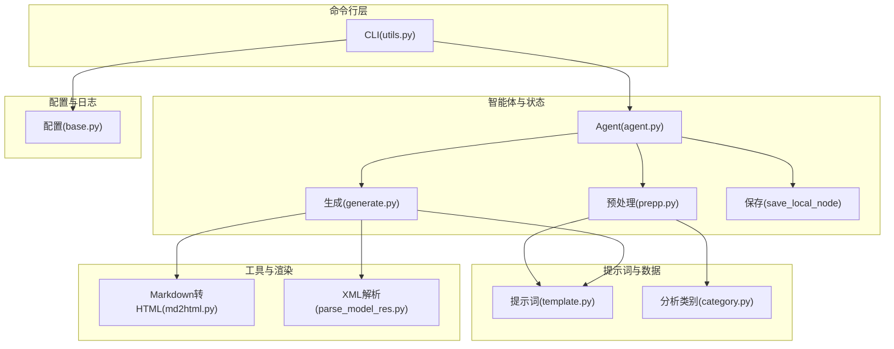
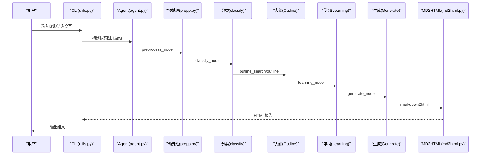
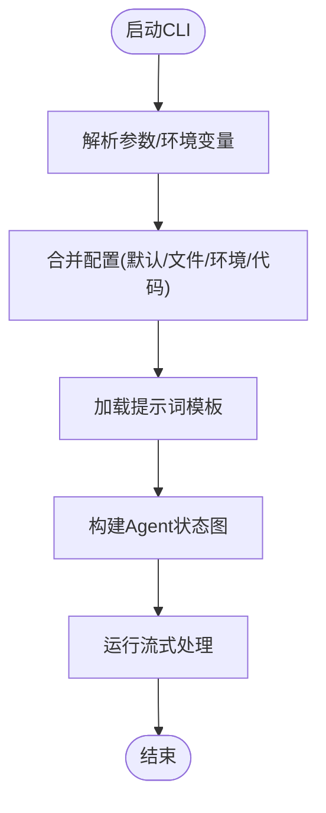
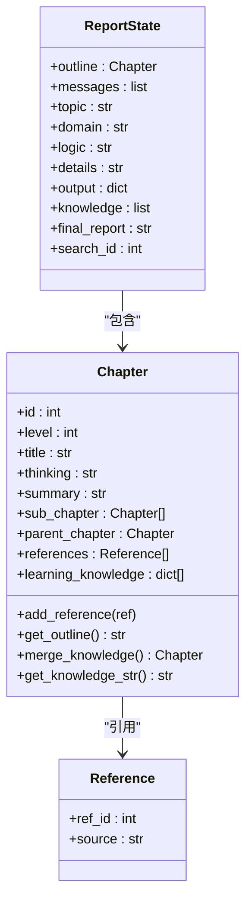
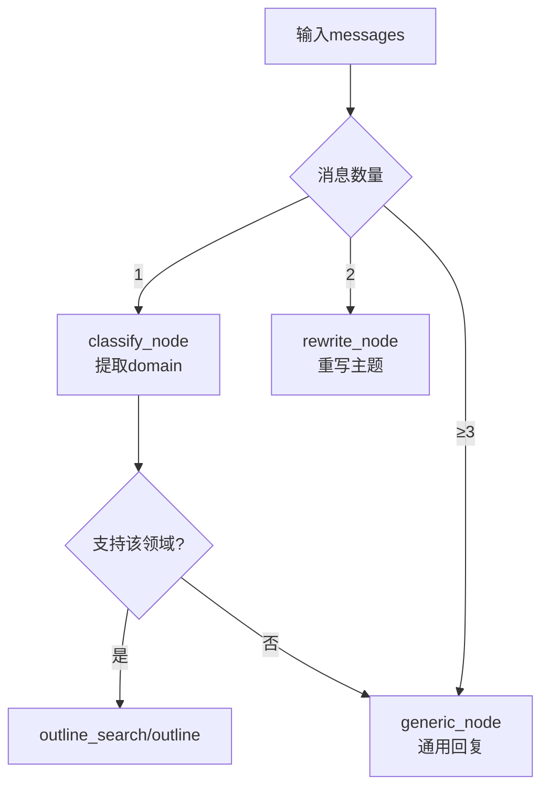
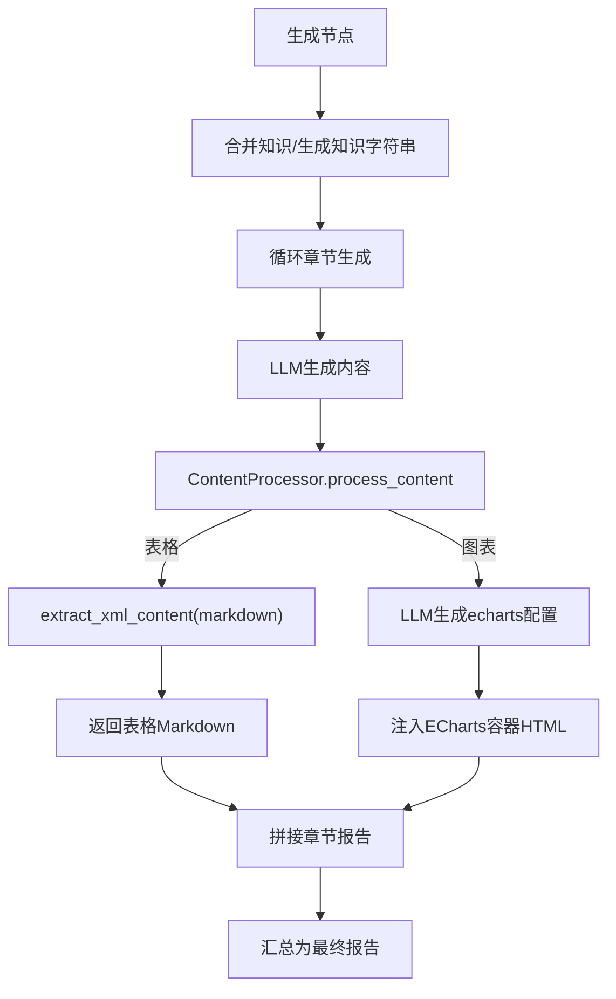
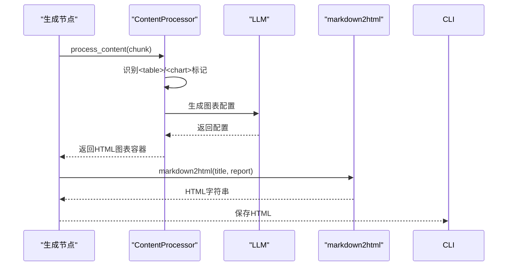
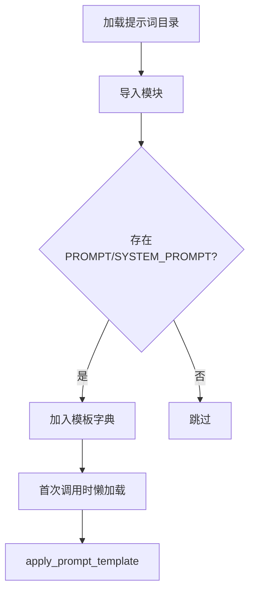
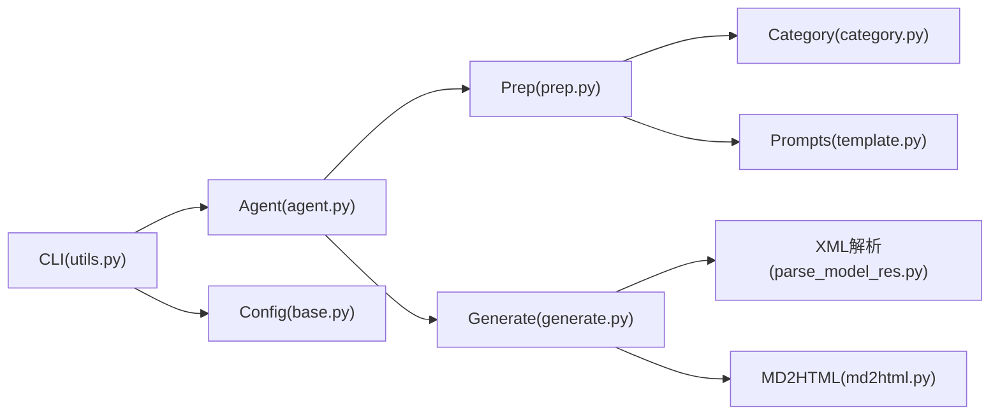

# 报告生成系统

<cite>
**本文引用的文件**
- [README.md](file://tools/DeepResearch/README.md)
- [pyproject.toml](file://tools/DeepResearch/pyproject.toml)
- [__init__.py](file://tools/DeepResearch/src/deepresearch/__init__.py)
- [agent.py](file://tools/DeepResearch/src/deepresearch/agent/agent.py)
- [utils.py](file://tools/DeepResearch/src/deepresearch/cli/utils.py)
- [base.py](file://tools/DeepResearch/src/deepresearch/config/base.py)
- [generate.py](file://tools/DeepResearch/src/deepresearch/agent/generate.py)
- [prep.py](file://tools/DeepResearch/src/deepresearch/agent/prep.py)
- [md2html.py](file://tools/DeepResearch/src/deepresearch/tools/md2html.py)
- [parse_model_res.py](file://tools/DeepResearch/src/deepresearch/utils/parse_model_res.py)
- [template.py](file://tools/DeepResearch/src/deepresearch/prompts/template.py)
- [message.py](file://tools/DeepResearch/src/deepresearch/agent/message.py)
- [category.py](file://tools/DeepResearch/src/deepresearch/data/category.py)
</cite>

## 目录
1. [简介](#简介)
2. [项目结构](#项目结构)
3. [核心组件](#核心组件)
4. [架构总览](#架构总览)
5. [详细组件分析](#详细组件分析)
6. [依赖分析](#依赖分析)
7. [性能考虑](#性能考虑)
8. [故障排查指南](#故障排查指南)
9. [结论](#结论)
10. [附录](#附录)

## 简介
本文件面向DeepResearch报告生成系统，系统通过多智能体协作与检索增强，实现从问题理解、知识抽取、大纲生成、章节撰写到图表绘制与HTML报告导出的完整自动化流程。系统强调“任务规划→工具调用→评估与迭代”的智能工作流，具备高质量、低成本、低幻觉的报告生成能力，并支持灵活的配置与扩展。

## 项目结构
- 核心包：tools/DeepResearch/src/deepresearch
  - agent：状态图与各节点（预处理、重写、分类、澄清、大纲搜索、大纲生成、学习、生成、保存）
  - cli：命令行入口、配置、历史与UI
  - config：配置管理与加载（含BaseConfig、ConfigManager）
  - data：分析类别与逻辑模板
  - llms：大模型封装
  - prompts：提示词模板加载与应用
  - tools：工具集（Markdown转HTML、搜索等）
  - utils：解析模型输出、打印工具
  - 错误与日志配置
- 文档与配置：tools/DeepResearch/doc、config
- 测试与性能：tests、性能分析脚本

**图示来源**
- [agent.py:19-45](file://tools/DeepResearch/src/deepresearch/agent/agent.py#L19-L45)
- [utils.py:106-193](file://tools/DeepResearch/src/deepresearch/cli/utils.py#L106-L193)
- [generate.py:26-112](file://tools/DeepResearch/src/deepresearch/agent/generate.py#L26-L112)
- [md2html.py:34-701](file://tools/DeepResearch/src/deepresearch/tools/md2html.py#L34-L701)
- [parse_model_res.py:13-27](file://tools/DeepResearch/src/deepresearch/utils/parse_model_res.py#L13-L27)
- [template.py:90-129](file://tools/DeepResearch/src/deepresearch/prompts/template.py#L90-L129)
- [category.py:74-104](file://tools/DeepResearch/src/deepresearch/data/category.py#L74-L104)
- [base.py:536-590](file://tools/DeepResearch/src/deepresearch/config/base.py#L536-L590)

**章节来源**
- [README.md:15-32](file://tools/DeepResearch/README.md#L15-L32)
- [pyproject.toml:1-93](file://tools/DeepResearch/pyproject.toml#L1-L93)

## 核心组件
- 命令行入口与交互
  - 支持交互式对话与单次查询；参数覆盖配置、日志级别、主题、配置目录等
  - 通过LangGraph编排状态图，流式输出中间态
- 智能体与节点
  - 预处理：消息归一化、回合判断、跳转不同节点
  - 重写：基于历史重写用户需求，提取主题
  - 分类：根据领域标签选择分析逻辑与细节
  - 澄清：一次澄清确认后直接进入大纲搜索
  - 大纲搜索/生成：生成章节大纲与子章节
  - 学习：抽取知识并聚合
  - 生成：逐章生成正文，内嵌表格与图表工具
  - 保存：本地保存Markdown与HTML报告
- 提示词系统
  - 动态加载提示词模板，支持系统提示与用户提示拼装
- 工具与渲染
  - Markdown转HTML：自定义渲染器，支持内嵌图表容器与引用样式
  - XML解析：从模型输出中提取结构化片段
- 配置管理
  - 多源配置合并（默认、文件、环境变量、代码），支持敏感字段脱敏与缓存

**章节来源**
- [utils.py:386-575](file://tools/DeepResearch/src/deepresearch/cli/utils.py#L386-L575)
- [agent.py:19-45](file://tools/DeepResearch/src/deepresearch/agent/agent.py#L19-L45)
- [prep.py:21-202](file://tools/DeepResearch/src/deepresearch/agent/prep.py#L21-L202)
- [generate.py:26-112](file://tools/DeepResearch/src/deepresearch/agent/generate.py#L26-L112)
- [md2html.py:19-701](file://tools/DeepResearch/src/deepresearch/tools/md2html.py#L19-L701)
- [parse_model_res.py:13-27](file://tools/DeepResearch/src/deepresearch/utils/parse_model_res.py#L13-L27)
- [template.py:90-129](file://tools/DeepResearch/src/deepresearch/prompts/template.py#L90-L129)
- [base.py:536-590](file://tools/DeepResearch/src/deepresearch/config/base.py#L536-L590)

## 架构总览
系统采用“命令行→智能体状态图→节点链路→提示词/工具→持久化”的分层架构。LangGraph驱动的状态机串联多个节点，每个节点负责特定阶段的任务；提示词模板与数据类别驱动内容生成；生成过程中的表格与图表通过XML标记与模型二次调用生成；最终由Markdown转HTML工具输出美观的HTML报告。

**图示来源**
- [utils.py:106-193](file://tools/DeepResearch/src/deepresearch/cli/utils.py#L106-L193)
- [agent.py:19-45](file://tools/DeepResearch/src/deepresearch/agent/agent.py#L19-L45)
- [prep.py:105-151](file://tools/DeepResearch/src/deepresearch/agent/prep.py#L105-L151)
- [generate.py:26-112](file://tools/DeepResearch/src/deepresearch/agent/generate.py#L26-L112)
- [md2html.py:34-701](file://tools/DeepResearch/src/deepresearch/tools/md2html.py#L34-L701)

## 详细组件分析

### 命令行与配置
- CLI参数与环境变量
  - 支持查询模式、深度、是否保存HTML、输出路径、日志级别、主题、配置目录、版本等
  - 环境变量前缀统一为DEEPRESEARCH_，便于CI/CD与容器部署
- 配置加载与合并
  - 默认值→文件→环境变量→代码参数的优先级链路
  - 支持敏感字段脱敏、缓存清理、动态更新配置目录

**图示来源**
- [utils.py:386-575](file://tools/DeepResearch/src/deepresearch/cli/utils.py#L386-L575)
- [base.py:536-590](file://tools/DeepResearch/src/deepresearch/config/base.py#L536-L590)
- [template.py:90-129](file://tools/DeepResearch/src/deepresearch/prompts/template.py#L90-L129)

**章节来源**
- [utils.py:386-575](file://tools/DeepResearch/src/deepresearch/cli/utils.py#L386-L575)
- [base.py:536-590](file://tools/DeepResearch/src/deepresearch/config/base.py#L536-L590)

### 智能体与状态图
- 节点关系
  - START→preprocess→rewrite/classify/outline_search→outline→learning→generate→save_local_node/END
  - 条件边：generate节点根据配置决定是否保存本地
- 状态结构
  - ReportState包含messages、topic、domain、logic、details、outline、knowledge、final_report等字段

**图示来源**
- [message.py:101-112](file://tools/DeepResearch/src/deepresearch/agent/message.py#L101-L112)
- [message.py:18-99](file://tools/DeepResearch/src/deepresearch/agent/message.py#L18-L99)

**章节来源**
- [agent.py:19-45](file://tools/DeepResearch/src/deepresearch/agent/agent.py#L19-L45)
- [message.py:101-112](file://tools/DeepResearch/src/deepresearch/agent/message.py#L101-L112)

### 预处理与主题抽取
- 消息归一化：支持多种消息类型与字符串输入
- 回合判断：根据消息轮次决定跳转至重写、分类或通用节点
- 重写与分类：基于提示词模板与XML解析提取主题与领域
- 澄清：一次澄清后直接进入大纲搜索

**图示来源**
- [prep.py:21-80](file://tools/DeepResearch/src/deepresearch/agent/prep.py#L21-L80)
- [prep.py:82-151](file://tools/DeepResearch/src/deepresearch/agent/prep.py#L82-L151)
- [category.py:74-104](file://tools/DeepResearch/src/deepresearch/data/category.py#L74-L104)
- [parse_model_res.py:13-27](file://tools/DeepResearch/src/deepresearch/utils/parse_model_res.py#L13-L27)

**章节来源**
- [prep.py:21-151](file://tools/DeepResearch/src/deepresearch/agent/prep.py#L21-L151)
- [category.py:74-104](file://tools/DeepResearch/src/deepresearch/data/category.py#L74-L104)

### 章节生成与内容组织
- 逐章生成：根据大纲与知识库生成章节正文
- 内容处理器：识别表格与图表标记，分别进行Markdown表格渲染与ECharts图表生成
- 引用替换：将占位引用映射为真实参考编号，保证引用一致性

**图示来源**
- [generate.py:26-112](file://tools/DeepResearch/src/deepresearch/agent/generate.py#L26-L112)
- [generate.py:169-295](file://tools/DeepResearch/src/deepresearch/agent/generate.py#L169-L295)
- [parse_model_res.py:13-27](file://tools/DeepResearch/src/deepresearch/utils/parse_model_res.py#L13-L27)

**章节来源**
- [generate.py:26-112](file://tools/DeepResearch/src/deepresearch/agent/generate.py#L26-L112)
- [generate.py:169-295](file://tools/DeepResearch/src/deepresearch/agent/generate.py#L169-L295)

### 图表绘制与HTML报告导出
- 表格：从XML中提取Markdown表格文本
- 图表：从XML中提取描述或输入schema，调用LLM生成ECharts配置，注入HTML容器
- HTML：自定义渲染器与样式，支持现代与粗野主义两种主题，内置引用弹窗与Mermaid支持

**图示来源**
- [generate.py:242-295](file://tools/DeepResearch/src/deepresearch/agent/generate.py#L242-L295)
- [md2html.py:19-701](file://tools/DeepResearch/src/deepresearch/tools/md2html.py#L19-L701)

**章节来源**
- [generate.py:242-295](file://tools/DeepResearch/src/deepresearch/agent/generate.py#L242-L295)
- [md2html.py:34-701](file://tools/DeepResearch/src/deepresearch/tools/md2html.py#L34-L701)

### 提示词模板系统
- 动态加载：扫描generate、learning、outline、prep四个目录下的Python模块，提取PROMPT与SYSTEM_PROMPT
- 应用：format_map注入state变量，支持系统消息与用户消息组合

**图示来源**
- [template.py:25-87](file://tools/DeepResearch/src/deepresearch/prompts/template.py#L25-L87)
- [template.py:90-129](file://tools/DeepResearch/src/deepresearch/prompts/template.py#L90-L129)

**章节来源**
- [template.py:25-129](file://tools/DeepResearch/src/deepresearch/prompts/template.py#L25-L129)

### 配置系统与质量控制
- 配置来源与优先级：默认值→文件→环境变量→代码参数
- 验证器：范围、选项、类型校验，支持敏感字段脱敏
- 缓存与热更新：TOML读取缓存、配置目录变更触发缓存清理
- 质量控制：XML标签解析、引用完整性检查、流式输出与异常捕获

**章节来源**
- [base.py:152-183](file://tools/DeepResearch/src/deepresearch/config/base.py#L152-L183)
- [base.py:536-590](file://tools/DeepResearch/src/deepresearch/config/base.py#L536-L590)
- [parse_model_res.py:13-27](file://tools/DeepResearch/src/deepresearch/utils/parse_model_res.py#L13-L27)
- [generate.py:297-313](file://tools/DeepResearch/src/deepresearch/agent/generate.py#L297-L313)

## 依赖分析
- 外部依赖：httpx、mcp、pydantic、langchain/langgraph、mistune、beautifulsoup4/lxml、tavily-python等
- 内部模块：agent、cli、config、prompts、tools、utils、data
- 关系耦合：CLI依赖Agent与配置；Agent依赖提示词与工具；生成节点依赖XML解析与HTML渲染

**图示来源**
- [utils.py:20-34](file://tools/DeepResearch/src/deepresearch/cli/utils.py#L20-L34)
- [agent.py:4-16](file://tools/DeepResearch/src/deepresearch/agent/agent.py#L4-L16)
- [generate.py:10-18](file://tools/DeepResearch/src/deepresearch/agent/generate.py#L10-L18)
- [md2html.py:4-8](file://tools/DeepResearch/src/deepresearch/tools/md2html.py#L4-L8)
- [parse_model_res.py:3-5](file://tools/DeepResearch/src/deepresearch/utils/parse_model_res.py#L3-L5)
- [template.py:9-17](file://tools/DeepResearch/src/deepresearch/prompts/template.py#L9-L17)
- [category.py:4-5](file://tools/DeepResearch/src/deepresearch/data/category.py#L4-L5)
- [base.py:4-12](file://tools/DeepResearch/src/deepresearch/config/base.py#L4-L12)

**章节来源**
- [pyproject.toml:12-26](file://tools/DeepResearch/pyproject.toml#L12-L26)

## 性能考虑
- 流式输出：LLM生成与CLI流式展示，降低首屏等待时间
- 缓存与懒加载：提示词模板与TOML读取缓存减少重复开销
- 内容处理器：预编译正则与缓冲区管理，避免频繁正则编译与字符串拼接
- 并发与稳定性：测试套件包含并发与稳定性测试，建议在生产环境启用日志与监控

## 故障排查指南
- 配置错误
  - 症状：启动失败或参数不生效
  - 排查：检查配置目录权限、文件格式、环境变量命名与值
- 模板缺失
  - 症状：提示词应用时报错
  - 排查：确认模板文件存在且包含PROMPT/SYSTEM_PROMPT变量
- 模型输出异常
  - 症状：XML标签缺失或格式错误
  - 排查：使用XML解析工具验证输出，必要时调整提示词
- 报告导出失败
  - 症状：HTML保存失败或样式异常
  - 排查：检查输出目录权限、网络资源加载（ECharts/Mermaid CDN）、HTML渲染器

**章节来源**
- [base.py:15-25](file://tools/DeepResearch/src/deepresearch/config/base.py#L15-L25)
- [template.py:117-127](file://tools/DeepResearch/src/deepresearch/prompts/template.py#L117-L127)
- [parse_model_res.py:13-27](file://tools/DeepResearch/src/deepresearch/utils/parse_model_res.py#L13-L27)
- [md2html.py:10-17](file://tools/DeepResearch/src/deepresearch/tools/md2html.py#L10-L17)

## 结论
DeepResearch通过模块化设计与可插拔的提示词模板，实现了从问题理解到报告导出的全链路自动化。其配置系统与质量控制机制保障了在多场景下的稳定性与可维护性。建议在实际部署中结合业务需求定制提示词与样式，充分利用缓存与流式输出提升用户体验。

## 附录
- 配置选项与环境变量
  - DEEPRESEARCH_MAX_DEPTH、DEEPRESEARCH_SAVE_AS_HTML、DEEPRESEARCH_SAVE_PATH、DEEPRESEARCH_LOG_LEVEL、DEEPRESEARCH_LOG_FILE、DEEPRESEARCH_THEME、DEEPRESEARCH_CONFIG_DIR
- 输出格式
  - Markdown与HTML双格式，默认保存HTML；支持关闭HTML保存
- 扩展开发
  - 新增提示词：在对应目录新增Python文件并导出PROMPT/SYSTEM_PROMPT
  - 自定义样式：修改md2html模板中的CSS与主题切换逻辑
  - 新增节点：在agent.py中添加节点与条件边，更新状态结构

**章节来源**
- [utils.py:400-408](file://tools/DeepResearch/src/deepresearch/cli/utils.py#L400-L408)
- [generate.py:114-160](file://tools/DeepResearch/src/deepresearch/agent/generate.py#L114-L160)
- [md2html.py:34-701](file://tools/DeepResearch/src/deepresearch/tools/md2html.py#L34-L701)