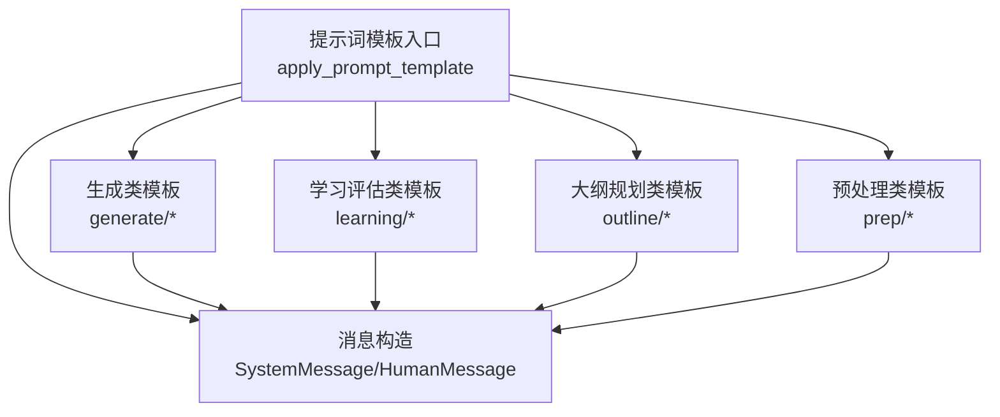
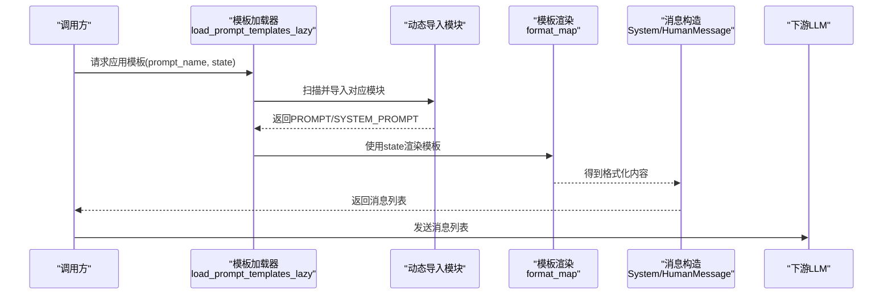
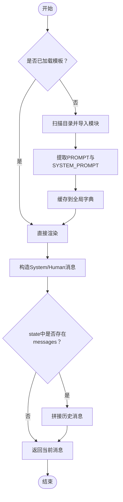
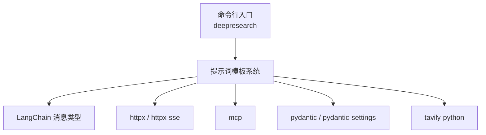

# 提示词工程系统

<cite>
**本文引用的文件**
- [README.md](file://tools/DeepResearch/README.md)
- [pyproject.toml](file://tools/DeepResearch/pyproject.toml)
- [template.py](file://tools/DeepResearch/src/deepresearch/prompts/template.py)
- [generate.py](file://tools/DeepResearch/src/deepresearch/prompts/generate/generate.py)
- [chart.py](file://tools/DeepResearch/src/deepresearch/prompts/generate/chart.py)
- [draft.py](file://tools/DeepResearch/src/deepresearch/prompts/learning/draft.py)
- [evaluate_completeness.py](file://tools/DeepResearch/src/deepresearch/prompts/learning/evaluate_completeness.py)
- [evaluate_freshness.py](file://tools/DeepResearch/src/deepresearch/prompts/learning/evaluate_freshness.py)
- [evaluate_plurality.py](file://tools/DeepResearch/src/deepresearch/prompts/learning/evaluate_plurality.py)
- [extract_knowledge.py](file://tools/DeepResearch/src/deepresearch/prompts/learning/extract_knowledge.py)
- [judge.py](file://tools/DeepResearch/src/deepresearch/prompts/learning/judge.py)
- [research_query.py](file://tools/DeepResearch/src/deepresearch/prompts/learning/research_query.py)
- [search_query.py](file://tools/DeepResearch/src/deepresearch/prompts/learning/search_query.py)
</cite>

## 目录
1. [简介](#简介)
2. [项目结构](#项目结构)
3. [核心组件](#核心组件)
4. [架构总览](#架构总览)
5. [详细组件分析](#详细组件分析)
6. [依赖关系分析](#依赖关系分析)
7. [性能与可维护性](#性能与可维护性)
8. [故障排查指南](#故障排查指南)
9. [结论](#结论)
10. [附录：提示词模板清单与使用指引](#附录提示词模板清单与使用指引)

## 简介
本文件面向DeepResearch提示词工程系统，系统性阐述多层次提示词模板体系的设计理念、实现机制与工程实践。该系统围绕“学习评估类”“生成类”“大纲规划类”“预处理类”四大类别构建提示词模板，支持参数化注入、上下文合并、动态内容生成与多轮对话管理；并提供版本化、效果评估与A/B测试的保障机制。本文将从架构、数据流、处理逻辑、集成点、错误处理与性能特征等方面进行深入解析，并给出扩展开发与自定义模板的实操指南。

## 项目结构
DeepResearch位于仓库tools/DeepResearch目录下，采用Python包结构组织，提示词工程相关代码集中在src/deepresearch/prompts目录中，按功能域划分为generate、learning、outline、prep四个子包。模板加载与应用通过template.py统一入口，其他模块以“PROMPT/ SYSTEM_PROMPT”变量形式提供模板内容。

图表来源
- [template.py:90-129](file://tools/DeepResearch/src/deepresearch/prompts/template.py#L90-L129)
- [generate.py:14-103](file://tools/DeepResearch/src/deepresearch/prompts/generate/generate.py#L14-L103)
- [chart.py:10-37](file://tools/DeepResearch/src/deepresearch/prompts/generate/chart.py#L10-L37)
- [draft.py:9-40](file://tools/DeepResearch/src/deepresearch/prompts/learning/draft.py#L9-L40)
- [evaluate_completeness.py:9-82](file://tools/DeepResearch/src/deepresearch/prompts/learning/evaluate_completeness.py#L9-L82)
- [evaluate_freshness.py:9-61](file://tools/DeepResearch/src/deepresearch/prompts/learning/evaluate_freshness.py#L9-L61)
- [evaluate_plurality.py:9-55](file://tools/DeepResearch/src/deepresearch/prompts/learning/evaluate_plurality.py#L9-L55)
- [extract_knowledge.py:9-51](file://tools/DeepResearch/src/deepresearch/prompts/learning/extract_knowledge.py#L9-L51)
- [judge.py:9-65](file://tools/DeepResearch/src/deepresearch/prompts/learning/judge.py#L9-L65)
- [research_query.py:12-57](file://tools/DeepResearch/src/deepresearch/prompts/learning/research_query.py#L12-L57)
- [search_query.py:9-44](file://tools/DeepResearch/src/deepresearch/prompts/learning/search_query.py#L9-L44)

章节来源
- [README.md:15-33](file://tools/DeepResearch/README.md#L15-L33)
- [pyproject.toml:1-93](file://tools/DeepResearch/pyproject.toml#L1-L93)

## 核心组件
- 模板加载器与应用器
  - 动态扫描与导入：在首次调用时扫描generate、learning、outline、prep四类目录，导入每个Python文件并提取PROMPT与SYSTEM_PROMPT变量，形成键值映射。
  - 参数化渲染：基于state字典进行format_map渲染，支持缺失变量抛出明确异常。
  - 上下文注入：若state包含messages字段，则将其拼接在最终消息列表之后，实现多轮对话与历史上下文保留。
- 消息构造器
  - 将SYSTEM_PROMPT包装为SystemMessage，将PROMPT包装为HumanMessage，确保与下游LLM框架的消息协议一致。
- 模板类型与职责
  - 生成类：面向报告生成与可视化工具调用，强调事实性、引用标注与图表生成规范。
  - 学习评估类：面向草稿完整性、时效性、多样性等维度的评估，支撑迭代优化。
  - 大纲规划类：面向章节/段落的大纲生成与结构化输出。
  - 预处理类：面向意图澄清、分类、重写等前置处理，提升后续流程质量。

章节来源
- [template.py:25-87](file://tools/DeepResearch/src/deepresearch/prompts/template.py#L25-L87)
- [template.py:90-129](file://tools/DeepResearch/src/deepresearch/prompts/template.py#L90-L129)

## 架构总览
提示词工程系统以“模板即代码”的方式组织，通过统一入口实现跨域模板的动态加载与参数化渲染，结合LangChain消息类型实现与LLM的稳定交互。

图表来源
- [template.py:25-87](file://tools/DeepResearch/src/deepresearch/prompts/template.py#L25-L87)
- [template.py:90-129](file://tools/DeepResearch/src/deepresearch/prompts/template.py#L90-L129)

## 详细组件分析

### 组件A：模板加载与应用（template.py）
- 设计要点
  - PROMPTS_DIRS集中定义四类模板目录，便于扩展新类别。
  - 延迟加载避免启动开销，仅在首次调用时扫描与导入。
  - 支持同时存在PROMPT与SYSTEM_PROMPT，分别构造SystemMessage与HumanMessage。
  - state中的messages字段用于多轮对话的历史拼接。
- 关键流程图

图表来源
- [template.py:25-87](file://tools/DeepResearch/src/deepresearch/prompts/template.py#L25-L87)
- [template.py:90-129](file://tools/DeepResearch/src/deepresearch/prompts/template.py#L90-L129)

章节来源
- [template.py:11-17](file://tools/DeepResearch/src/deepresearch/prompts/template.py#L11-L17)
- [template.py:25-87](file://tools/DeepResearch/src/deepresearch/prompts/template.py#L25-L87)
- [template.py:90-129](file://tools/DeepResearch/src/deepresearch/prompts/template.py#L90-L129)

### 组件B：生成类模板（generate/*）
- generate/generate.py
  - 角色定位：报告撰写专家，严格遵循事实性、引用标注与写作标准。
  - 参数化：支持domain、now、query、chapter_outline、above、outline、reference等变量。
  - 输出约束：强调图表与表格生成规范，要求XML格式工具调用。
- generate/chart.py
  - 角色定位：ECharts配置生成器，要求严格依据参考材料。
  - 参数化：支持above、description、reference等变量。
  - 工具调用：通过XML格式声明工具调用参数。

章节来源
- [generate.py:4-13](file://tools/DeepResearch/src/deepresearch/prompts/generate/generate.py#L4-L13)
- [generate.py:14-65](file://tools/DeepResearch/src/deepresearch/prompts/generate/generate.py#L14-L65)
- [generate.py:67-103](file://tools/DeepResearch/src/deepresearch/prompts/generate/generate.py#L67-L103)
- [chart.py:4-9](file://tools/DeepResearch/src/deepresearch/prompts/generate/chart.py#L4-L9)
- [chart.py:10-27](file://tools/DeepResearch/src/deepresearch/prompts/generate/chart.py#L10-L27)
- [chart.py:29-37](file://tools/DeepResearch/src/deepresearch/prompts/generate/chart.py#L29-L37)

### 组件C：学习评估类模板（learning/*）
- learning/draft.py
  - 角色定位：信息分析师，强调来源可追溯与结构化输出。
  - 参数化：支持chapter_outline与knowledge。
  - 输出格式：JSON结构，包含answer与quote_ids。
- learning/evaluate_completeness.py
  - 角色定位：完整性评估专家，关注覆盖度、证据充分性、准确性与逻辑一致性。
  - 参数化：支持chapter_outline与draft。
  - 输出格式：JSON结构，包含analysis.think与analysis.pass。
- learning/evaluate_freshness.py
  - 角色定位：时效性评估专家，依据主题更新频率设定阈值。
  - 参数化：支持now、chapter_outline与draft。
  - 输出格式：JSON结构，包含analysis.think、analysis.type与analysis.pass。
- learning/evaluate_plurality.py
  - 角色定位：多样性评估专家，依据章节意图类型判断覆盖广度。
  - 参数化：支持chapter_outline与draft。
  - 输出格式：JSON结构，包含analysis.think与analysis.pass。
- learning/extract_knowledge.py
  - 角色定位：信息抽取专家，严格限定来源边界与事实完整性。
  - 参数化：支持search与chapter_outline。
  - 输出格式：JSON结构，包含knowledge数组。
- learning/judge.py
  - 角色定位：查询类型判定专家，输出freshness、plurality、completeness三类布尔结果。
  - 参数化：支持now与chapter_outline。
  - 输出格式：JSON结构，包含三个布尔字段。
- learning/research_query.py
  - 角色定位：搜索查询优化专家，基于评估结果补充与优化查询。
  - 参数化：支持now、search_query、chapter_outline、draft、evaluation。
  - 输出格式：JSON结构，包含search_query_list数组。
- learning/search_query.py
  - 角色定位：搜索查询生成专家，强调抽象性、覆盖面与简洁性。
  - 参数化：支持now与chapter_outline。
  - 输出格式：Markdown片段，包含若干(sq)条目。

章节来源
- [draft.py:4-8](file://tools/DeepResearch/src/deepresearch/prompts/learning/draft.py#L4-L8)
- [draft.py:9-40](file://tools/DeepResearch/src/deepresearch/prompts/learning/draft.py#L9-L40)
- [evaluate_completeness.py:4-8](file://tools/DeepResearch/src/deepresearch/prompts/learning/evaluate_completeness.py#L4-L8)
- [evaluate_completeness.py:9-82](file://tools/DeepResearch/src/deepresearch/prompts/learning/evaluate_completeness.py#L9-L82)
- [evaluate_freshness.py:4-9](file://tools/DeepResearch/src/deepresearch/prompts/learning/evaluate_freshness.py#L4-L9)
- [evaluate_freshness.py:9-61](file://tools/DeepResearch/src/deepresearch/prompts/learning/evaluate_freshness.py#L9-L61)
- [evaluate_plurality.py:4-8](file://tools/DeepResearch/src/deepresearch/prompts/learning/evaluate_plurality.py#L4-L8)
- [evaluate_plurality.py:9-55](file://tools/DeepResearch/src/deepresearch/prompts/learning/evaluate_plurality.py#L9-L55)
- [extract_knowledge.py:4-8](file://tools/DeepResearch/src/deepresearch/prompts/learning/extract_knowledge.py#L4-L8)
- [extract_knowledge.py:9-51](file://tools/DeepResearch/src/deepresearch/prompts/learning/extract_knowledge.py#L9-L51)
- [judge.py:4-8](file://tools/DeepResearch/src/deepresearch/prompts/learning/judge.py#L4-L8)
- [judge.py:9-65](file://tools/DeepResearch/src/deepresearch/prompts/learning/judge.py#L9-L65)
- [research_query.py:4-11](file://tools/DeepResearch/src/deepresearch/prompts/learning/research_query.py#L4-L11)
- [research_query.py:12-57](file://tools/DeepResearch/src/deepresearch/prompts/learning/research_query.py#L12-L57)
- [search_query.py:4-8](file://tools/DeepResearch/src/deepresearch/prompts/learning/search_query.py#L4-L8)
- [search_query.py:9-44](file://tools/DeepResearch/src/deepresearch/prompts/learning/search_query.py#L9-L44)

### 组件D：大纲规划类与预处理类模板（outline/* 与 prep/*）
- outline/outline.py 与 outline/outline_sq.py
  - 角色定位：章节/段落大纲生成与结构化输出，强调层级与维度覆盖。
  - 参数化：通常包含chapter_outline或类似结构化输入。
- prep/clarify.py 与 prep/classify.py 与 prep/rewrite.py
  - 角色定位：意图澄清、分类与重写，提升后续流程的输入质量。
  - 参数化：根据具体模板包含query、messages等上下文。

章节来源
- [outline/outline.py:13-13](file://tools/DeepResearch/src/deepresearch/prompts/outline/outline.py#L13-L13)
- [outline/outline_sq.py:10-10](file://tools/DeepResearch/src/deepresearch/prompts/outline/outline_sq.py#L10-L10)
- [prep/clarify.py:9-9](file://tools/DeepResearch/src/deepresearch/prompts/prep/clarify.py#L9-L9)
- [prep/clarify.py:51-51](file://tools/DeepResearch/src/deepresearch/prompts/prep/clarify.py#L51-L51)
- [prep/classify.py:8-8](file://tools/DeepResearch/src/deepresearch/prompts/prep/classify.py#L8-L8)
- [prep/rewrite.py:8-8](file://tools/DeepResearch/src/deepresearch/prompts/prep/rewrite.py#L8-L8)

## 依赖关系分析
- 运行时依赖
  - LangChain消息类型：SystemMessage、HumanMessage，用于标准化消息结构。
  - 其他第三方库：httpx、tavily-python、mcp、pydantic等，支撑网络请求、搜索与工具调用。
- 包管理与脚手架
  - 通过pyproject.toml定义依赖与脚本入口，便于安装与运行。

图表来源
- [pyproject.toml:12-26](file://tools/DeepResearch/pyproject.toml#L12-L26)
- [pyproject.toml:79-80](file://tools/DeepResearch/pyproject.toml#L79-L80)

章节来源
- [pyproject.toml:12-26](file://tools/DeepResearch/pyproject.toml#L12-L26)
- [pyproject.toml:79-80](file://tools/DeepResearch/pyproject.toml#L79-L80)

## 性能与可维护性
- 加载策略
  - 延迟加载：首次调用才扫描与导入，降低启动成本。
  - 缓存：全局字典缓存模板内容，避免重复导入。
- 渲染效率
  - 使用format_map进行变量替换，避免正则或复杂模板引擎带来的额外开销。
- 可维护性
  - 模块化目录结构清晰，新增模板只需在对应子目录添加Python文件并导出PROMPT/ SYSTEM_PROMPT。
  - 统一的异常提示，缺失变量时快速定位问题。

章节来源
- [template.py:78-87](file://tools/DeepResearch/src/deepresearch/prompts/template.py#L78-L87)
- [template.py:114-126](file://tools/DeepResearch/src/deepresearch/prompts/template.py#L114-L126)

## 故障排查指南
- 常见问题
  - 模板未找到：确认prompt_name路径与实际目录一致，例如generate/generate。
  - 缺失变量：当state缺少模板所需变量时会抛出明确异常，需补齐变量或调整模板。
  - 目录不存在：若某类模板目录不存在，系统会打印警告并跳过该目录。
- 排查步骤
  - 检查PROMPTS_DIRS中对应目录是否存在。
  - 核对state字典是否包含模板所需的键。
  - 若涉及多轮对话，确认state["messages"]是否为合法的消息列表。
- 相关实现位置
  - 模板扫描与导入、异常处理与警告打印。
  - 消息构造与拼接逻辑。

章节来源
- [template.py:37-41](file://tools/DeepResearch/src/deepresearch/prompts/template.py#L37-L41)
- [template.py:67-69](file://tools/DeepResearch/src/deepresearch/prompts/template.py#L67-L69)
- [template.py:114-126](file://tools/DeepResearch/src/deepresearch/prompts/template.py#L114-L126)
- [template.py:127-129](file://tools/DeepResearch/src/deepresearch/prompts/template.py#L127-L129)

## 结论
DeepResearch提示词工程系统通过“模板即代码”的设计，实现了跨域模板的统一加载、参数化渲染与消息构造，配合学习评估与搜索查询优化，形成闭环的质量保障。其延迟加载与缓存策略兼顾性能与可维护性；清晰的目录结构与统一的变量约定便于扩展与团队协作。建议在生产环境中结合版本控制与A/B测试机制，持续迭代模板质量与效果。

## 附录：提示词模板清单与使用指引

### 生成类
- generate/generate
  - 用途：报告章节生成，强调事实性、引用标注与图表/表格生成规范。
  - 关键参数：domain、now、query、chapter_outline、above、outline、reference。
  - 调用示例：通过apply_prompt_template(prompt_name="generate/generate", state=...)获取消息列表。
  - 优化技巧：确保reference与outline匹配，必要时先执行extract_knowledge与search_query。
- generate/chart
  - 用途：基于参考材料生成ECharts配置与HTML图表页面。
  - 关键参数：above、description、reference。
  - 调用示例：通过apply_prompt_template(prompt_name="generate/chart", state=...)获取消息列表。
  - 优化技巧：在description中明确图表目标与维度，减少工具调用失败。

章节来源
- [generate.py:4-13](file://tools/DeepResearch/src/deepresearch/prompts/generate/generate.py#L4-L13)
- [generate.py:67-103](file://tools/DeepResearch/src/deepresearch/prompts/generate/generate.py#L67-L103)
- [chart.py:4-9](file://tools/DeepResearch/src/deepresearch/prompts/generate/chart.py#L4-L9)
- [chart.py:29-37](file://tools/DeepResearch/src/deepresearch/prompts/generate/chart.py#L29-L37)

### 学习评估类
- learning/draft
  - 用途：将知识片段整合为结构化回答，支持来源追踪。
  - 关键参数：chapter_outline、knowledge。
  - 输出格式：JSON，包含answer与quote_ids。
- learning/evaluate_completeness
  - 用途：评估草稿完整性与逻辑一致性。
  - 关键参数：chapter_outline、draft。
  - 输出格式：JSON，包含analysis.think与analysis.pass。
- learning/evaluate_freshness
  - 用途：评估内容时效性，依据主题更新周期设定阈值。
  - 关键参数：now、chapter_outline、draft。
  - 输出格式：JSON，包含analysis.think、analysis.type与analysis.pass。
- learning/evaluate_plurality
  - 用途：评估内容多样性与覆盖广度。
  - 关键参数：chapter_outline、draft。
  - 输出格式：JSON，包含analysis.think与analysis.pass。
- learning/extract_knowledge
  - 用途：从参考材料中抽取结构化知识点。
  - 关键参数：search、chapter_outline。
  - 输出格式：JSON，包含knowledge数组。
- learning/judge
  - 用途：判定查询类型（freshness、plurality、completeness）。
  - 关键参数：now、chapter_outline。
  - 输出格式：JSON，包含三个布尔字段。
- learning/research_query
  - 用途：基于评估结果生成补充搜索查询。
  - 关键参数：now、search_query、chapter_outline、draft、evaluation。
  - 输出格式：JSON，包含search_query_list数组。
- learning/search_query
  - 用途：生成高质量搜索查询，强调抽象性与覆盖面。
  - 关键参数：now、chapter_outline。
  - 输出格式：Markdown片段，包含若干(sq)条目。

章节来源
- [draft.py:4-8](file://tools/DeepResearch/src/deepresearch/prompts/learning/draft.py#L4-L8)
- [draft.py:31-38](file://tools/DeepResearch/src/deepresearch/prompts/learning/draft.py#L31-L38)
- [evaluate_completeness.py:4-8](file://tools/DeepResearch/src/deepresearch/prompts/learning/evaluate_completeness.py#L4-L8)
- [evaluate_completeness.py:64-74](file://tools/DeepResearch/src/deepresearch/prompts/learning/evaluate_completeness.py#L64-L74)
- [evaluate_freshness.py:4-9](file://tools/DeepResearch/src/deepresearch/prompts/learning/evaluate_freshness.py#L4-L9)
- [evaluate_freshness.py:42-53](file://tools/DeepResearch/src/deepresearch/prompts/learning/evaluate_freshness.py#L42-L53)
- [evaluate_plurality.py:4-8](file://tools/DeepResearch/src/deepresearch/prompts/learning/evaluate_plurality.py#L4-L8)
- [evaluate_plurality.py:37-47](file://tools/DeepResearch/src/deepresearch/prompts/learning/evaluate_plurality.py#L37-L47)
- [extract_knowledge.py:4-8](file://tools/DeepResearch/src/deepresearch/prompts/learning/extract_knowledge.py#L4-L8)
- [extract_knowledge.py:32-45](file://tools/DeepResearch/src/deepresearch/prompts/learning/extract_knowledge.py#L32-L45)
- [judge.py:4-8](file://tools/DeepResearch/src/deepresearch/prompts/learning/judge.py#L4-L8)
- [judge.py:55-61](file://tools/DeepResearch/src/deepresearch/prompts/learning/judge.py#L55-L61)
- [research_query.py:4-11](file://tools/DeepResearch/src/deepresearch/prompts/learning/research_query.py#L4-L11)
- [research_query.py:50-56](file://tools/DeepResearch/src/deepresearch/prompts/learning/research_query.py#L50-L56)
- [search_query.py:4-8](file://tools/DeepResearch/src/deepresearch/prompts/learning/search_query.py#L4-L8)
- [search_query.py:30-36](file://tools/DeepResearch/src/deepresearch/prompts/learning/search_query.py#L30-L36)

### 大纲规划类与预处理类
- outline/outline 与 outline/outline_sq
  - 用途：生成章节/段落大纲，强调结构化与维度覆盖。
  - 参数化：通常包含chapter_outline或结构化输入。
- prep/clarify 与 prep/classify 与 prep/rewrite
  - 用途：意图澄清、分类与重写，提升输入质量。
  - 参数化：根据具体模板包含query、messages等上下文。

章节来源
- [outline/outline.py:13-13](file://tools/DeepResearch/src/deepresearch/prompts/outline/outline.py#L13-L13)
- [outline/outline_sq.py:10-10](file://tools/DeepResearch/src/deepresearch/prompts/outline/outline_sq.py#L10-L10)
- [prep/clarify.py:9-9](file://tools/DeepResearch/src/deepresearch/prompts/prep/clarify.py#L9-L9)
- [prep/clarify.py:51-51](file://tools/DeepResearch/src/deepresearch/prompts/prep/clarify.py#L51-L51)
- [prep/classify.py:8-8](file://tools/DeepResearch/src/deepresearch/prompts/prep/classify.py#L8-L8)
- [prep/rewrite.py:8-8](file://tools/DeepResearch/src/deepresearch/prompts/prep/rewrite.py#L8-L8)

### 版本控制、效果评估与A/B测试建议
- 版本控制
  - 以目录命名+文件名的方式记录模板版本，如generate/v1/generate.py、generate/v2/generate.py。
  - 在state中加入version字段，便于追踪模板版本与行为差异。
- 效果评估
  - 对生成类输出引入人工评分指标（准确性、完整性、可读性），结合学习评估类模板的自动化指标（completeness/freshness/plurality）。
- A/B测试
  - 同一任务场景下并行运行不同版本模板，对比输出质量与用户反馈，逐步收敛到最优版本。

[本节为通用实践建议，不直接分析具体文件，故无章节来源]

### 扩展开发指南与自定义模板创建方法
- 新增模板步骤
  - 在对应子目录（generate/learning/outline/prep）新增Python文件，导出PROMPT与可选的SYSTEM_PROMPT。
  - 确保模板变量与state键一致，避免format_map抛错。
  - 如需多轮对话，将历史消息放入state["messages"]。
- 最佳实践
  - 明确角色定位与输出格式，保持模板职责单一。
  - 在模板注释中列出所有支持的变量，便于调用方理解。
  - 对复杂模板提供简短示例与调用路径，便于集成测试。

章节来源
- [template.py:11-17](file://tools/DeepResearch/src/deepresearch/prompts/template.py#L11-L17)
- [template.py:54-66](file://tools/DeepResearch/src/deepresearch/prompts/template.py#L54-L66)
- [template.py:127-129](file://tools/DeepResearch/src/deepresearch/prompts/template.py#L127-L129)