# 智能体系统架构

<cite>
**本文档引用的文件**
- [README.md](file://tools/DeepResearch/README.md)
- [architecture.md](file://tools/DeepResearch/doc/architecture/architecture.md)
- [agent.py](file://tools/DeepResearch/src/deepresearch/agent/agent.py)
- [deepsearch.py](file://tools/DeepResearch/src/deepresearch/agent/deepsearch.py)
- [generate.py](file://tools/DeepResearch/src/deepresearch/agent/generate.py)
- [learning.py](file://tools/DeepResearch/src/deepresearch/agent/learning.py)
- [message.py](file://tools/DeepResearch/src/deepresearch/agent/message.py)
- [prep.py](file://tools/DeepResearch/src/deepresearch/agent/prep.py)
- [outline.py](file://tools/DeepResearch/src/deepresearch/agent/outline.py)
- [search.py](file://tools/DeepResearch/src/deepresearch/tools/search.py)
- [llm.py](file://tools/DeepResearch/src/deepresearch/llms/llm.py)
- [workflow.toml](file://tools/DeepResearch/config/workflow.toml)
- [workflow_config.py](file://tools/DeepResearch/src/deepresearch/config/workflow_config.py)
- [pyproject.toml](file://tools/DeepResearch/pyproject.toml)
</cite>

## 目录
1. [简介](#简介)
2. [项目结构](#项目结构)
3. [核心组件](#核心组件)
4. [架构总览](#架构总览)
5. [详细组件分析](#详细组件分析)
6. [依赖关系分析](#依赖关系分析)
7. [性能考量](#性能考量)
8. [故障排查指南](#故障排查指南)
9. [结论](#结论)
10. [附录](#附录)

## 简介
本文件面向DeepResearch智能体系统，聚焦多智能体协作机制与工作流编排，围绕主智能体Agent、深度搜索智能体DeepSearch、生成智能体Generate、学习智能体Learning等核心组件，系统阐述状态管理、消息传递、任务分配、结果聚合、评估与迭代循环、配置参数、性能优化与错误处理，并提供扩展开发与自定义智能体实现指南。

## 项目结构
DeepResearch采用模块化分层组织，核心位于tools/DeepResearch/src/deepresearch目录，包含agent（智能体工作流）、llms（大模型交互）、tools（外部工具）、prompts（提示词模板）、config（配置）等子模块；顶层README与doc/architecture提供总体架构说明与流程图。

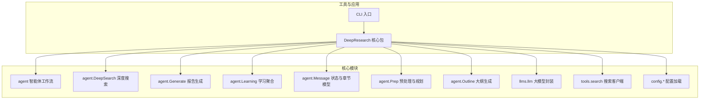

图表来源
- [agent.py:19-45](file://tools/DeepResearch/src/deepresearch/agent/agent.py#L19-L45)
- [deepsearch.py:55-81](file://tools/DeepResearch/src/deepresearch/agent/deepsearch.py#L55-L81)
- [generate.py:26-112](file://tools/DeepResearch/src/deepresearch/agent/generate.py#L26-L112)
- [learning.py:15-94](file://tools/DeepResearch/src/deepresearch/agent/learning.py#L15-L94)
- [message.py:18-112](file://tools/DeepResearch/src/deepresearch/agent/message.py#L18-L112)
- [prep.py:21-80](file://tools/DeepResearch/src/deepresearch/agent/prep.py#L21-L80)
- [outline.py:22-118](file://tools/DeepResearch/src/deepresearch/agent/outline.py#L22-L118)
- [llm.py:146-185](file://tools/DeepResearch/src/deepresearch/llms/llm.py#L146-L185)
- [search.py:12-37](file://tools/DeepResearch/src/deepresearch/tools/search.py#L12-L37)
- [workflow_config.py:7-28](file://tools/DeepResearch/src/deepresearch/config/workflow_config.py#L7-L28)

章节来源
- [README.md:15-69](file://tools/DeepResearch/README.md#L15-L69)
- [architecture.md:5-163](file://tools/DeepResearch/doc/architecture/architecture.md#L5-L163)

## 核心组件
- 主智能体Agent：基于LangGraph构建状态图，串联预处理、重写、分类、澄清、大纲检索与生成、学习、保存等节点，形成“任务规划→工具调用→评估与迭代”的闭环。
- 深度搜索智能体DeepSearch：对章节主题进行递归深度搜索、知识抽取、答案生成与评估，支持多轮迭代直至满足质量判定。
- 生成智能体Generate：按章节流式生成报告内容，支持表格与图表工具渲染，输出Markdown与HTML。
- 学习智能体Learning：并发调度DeepSearch，聚合搜索结果与引用ID，填充章节学习知识并建立引用映射。
- 状态与消息Message：定义章节树、引用、报告状态等数据结构，支撑跨节点状态传递与合并。
- 预处理与规划Prep：将用户消息标准化、重写需求、分类领域、一次澄清后进入大纲生成。
- 大纲生成Outline：基于领域逻辑与参考知识生成章节大纲，解析为章节树。
- 大模型封装LLM：统一LLM实例工厂、响应缓存、线程安全与流式/非流式调用。
- 搜索工具Search：工厂封装不同搜索引擎（Jina/Tavily），屏蔽底层差异。

章节来源
- [agent.py:19-45](file://tools/DeepResearch/src/deepresearch/agent/agent.py#L19-L45)
- [deepsearch.py:55-81](file://tools/DeepResearch/src/deepresearch/agent/deepsearch.py#L55-L81)
- [generate.py:26-112](file://tools/DeepResearch/src/deepresearch/agent/generate.py#L26-L112)
- [learning.py:15-94](file://tools/DeepResearch/src/deepresearch/agent/learning.py#L15-L94)
- [message.py:18-112](file://tools/DeepResearch/src/deepresearch/agent/message.py#L18-L112)
- [prep.py:21-80](file://tools/DeepResearch/src/deepresearch/agent/prep.py#L21-L80)
- [outline.py:22-118](file://tools/DeepResearch/src/deepresearch/agent/outline.py#L22-L118)
- [llm.py:146-185](file://tools/DeepResearch/src/deepresearch/llms/llm.py#L146-L185)
- [search.py:12-37](file://tools/DeepResearch/src/deepresearch/tools/search.py#L12-L37)

## 架构总览
系统采用“主智能体编排 + 深度搜索 + 生成 + 学习聚合”的协作模式，LLM、Prompt模板、工具与配置模块相互解耦，通过状态图与消息传递实现端到端工作流。

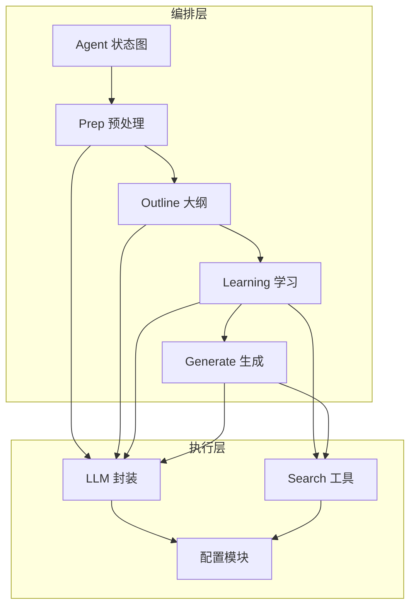

图表来源
- [architecture.md:17-27](file://tools/DeepResearch/doc/architecture/architecture.md#L17-L27)
- [agent.py:19-45](file://tools/DeepResearch/src/deepresearch/agent/agent.py#L19-L45)
- [llm.py:146-185](file://tools/DeepResearch/src/deepresearch/llms/llm.py#L146-L185)
- [search.py:12-37](file://tools/DeepResearch/src/deepresearch/tools/search.py#L12-L37)
- [workflow_config.py:7-28](file://tools/DeepResearch/src/deepresearch/config/workflow_config.py#L7-L28)

## 详细组件分析

### 主智能体Agent（状态图）
- 节点与边：从START开始，依次经预处理、重写、分类、澄清、通用节点；大纲检索与生成之间有条件分支；学习完成后进入生成与保存。
- 条件保存：根据可配置项决定是否保存为本地文件或结束流程。
- 状态图构建：使用LangGraph StateGraph，节点间通过add_edge/add_conditional_edges连接。

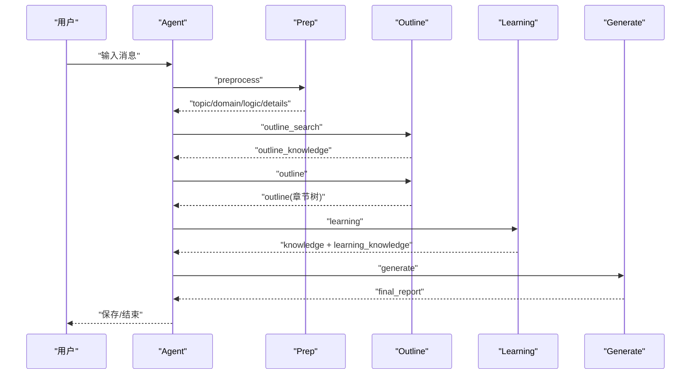

图表来源
- [agent.py:19-45](file://tools/DeepResearch/src/deepresearch/agent/agent.py#L19-L45)
- [prep.py:21-80](file://tools/DeepResearch/src/deepresearch/agent/prep.py#L21-L80)
- [outline.py:22-118](file://tools/DeepResearch/src/deepresearch/agent/outline.py#L22-L118)
- [learning.py:15-94](file://tools/DeepResearch/src/deepresearch/agent/learning.py#L15-L94)
- [generate.py:26-112](file://tools/DeepResearch/src/deepresearch/agent/generate.py#L26-L112)

章节来源
- [agent.py:19-45](file://tools/DeepResearch/src/deepresearch/agent/agent.py#L19-L45)

### 预处理与规划（Prep）
- preprocess_node：将输入消息标准化为LangChain消息类型，单轮转重写，两轮转通用，三轮及以上直接通用回复。
- rewrite_node：基于历史对话重写用户需求，提取主题。
- classify_node：分类领域并加载对应逻辑与细节，若不支持则回退通用。
- clarify_node：一次澄清确认后进入大纲检索，否则通用回复。
- generic_node：通用LLM对话处理。

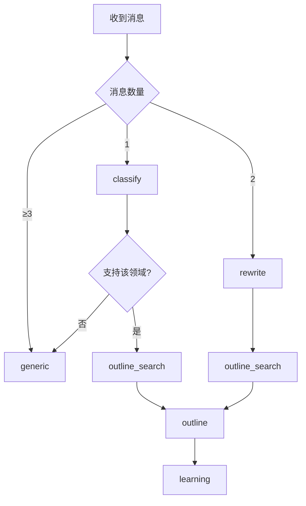

图表来源
- [prep.py:21-80](file://tools/DeepResearch/src/deepresearch/agent/prep.py#L21-L80)
- [prep.py:82-182](file://tools/DeepResearch/src/deepresearch/agent/prep.py#L82-L182)

章节来源
- [prep.py:21-182](file://tools/DeepResearch/src/deepresearch/agent/prep.py#L21-L182)

### 大纲生成（Outline）
- outline_search_node：生成搜索查询，多线程并行搜索，收集知识并维护全局search_id。
- outline_node：基于领域、逻辑、参考知识生成章节大纲，解析为章节树，流式输出思考与内容。
- 解析器：正则提取markdown代码块与标题层级，构造章节树并清理根节点父指针。

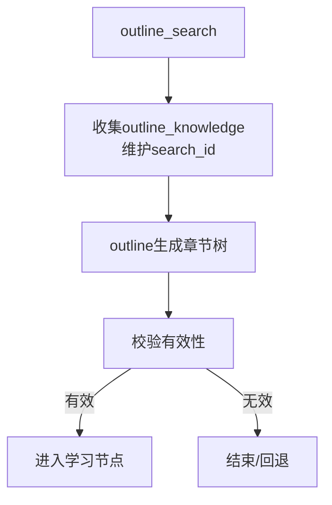

图表来源
- [outline.py:22-86](file://tools/DeepResearch/src/deepresearch/agent/outline.py#L22-L86)
- [outline.py:88-118](file://tools/DeepResearch/src/deepresearch/agent/outline.py#L88-L118)
- [outline.py:158-221](file://tools/DeepResearch/src/deepresearch/agent/outline.py#L158-L221)

章节来源
- [outline.py:22-221](file://tools/DeepResearch/src/deepresearch/agent/outline.py#L22-L221)

### 学习智能体（Learning）
- 并发处理：对每个二级章节并行执行DeepSearch，限制最大并发，避免LLM调用过载。
- 引用映射：先分配局部search_id区间，再回填真实引用ID，确保引用稳定有序。
- 结果聚合：将DeepSearch结果中的re_knowledge与章节学习知识合并，生成引用去重后的知识条目。

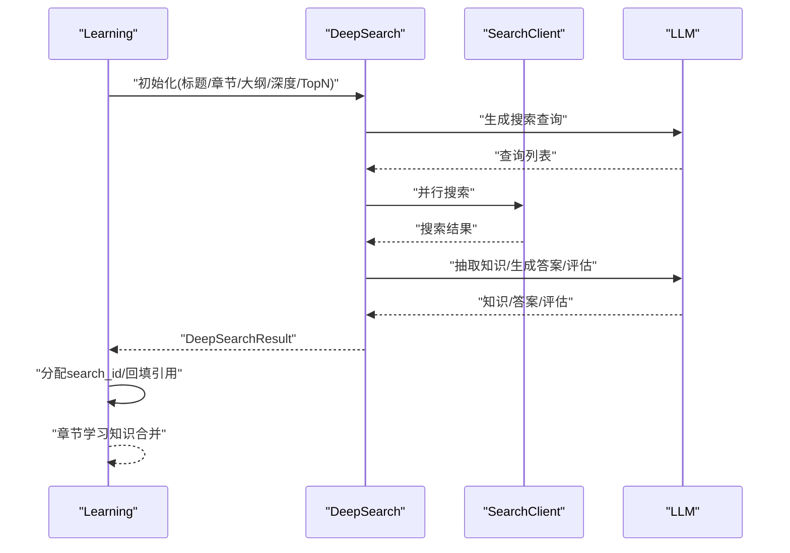

图表来源
- [learning.py:15-94](file://tools/DeepResearch/src/deepresearch/agent/learning.py#L15-L94)
- [deepsearch.py:74-150](file://tools/DeepResearch/src/deepresearch/agent/deepsearch.py#L74-L150)
- [search.py:25-37](file://tools/DeepResearch/src/deepresearch/tools/search.py#L25-L37)

章节来源
- [learning.py:15-129](file://tools/DeepResearch/src/deepresearch/agent/learning.py#L15-L129)

### 深度搜索智能体（DeepSearch）
- 递归搜索：根据章节大纲生成查询，执行搜索，抽取知识，生成答案，评估是否达标。
- 迭代机制：对未通过评估的维度生成新查询，递归加深搜索，直至满足条件或达到最大深度。
- 知识管理：记录all_knowledge/used_knowledge/re_knowledge，支持后续引用与报告生成。

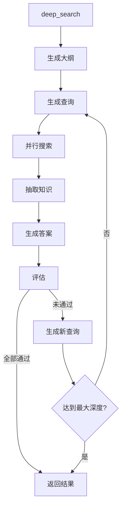

图表来源
- [deepsearch.py:74-150](file://tools/DeepResearch/src/deepresearch/agent/deepsearch.py#L74-L150)

章节来源
- [deepsearch.py:55-489](file://tools/DeepResearch/src/deepresearch/agent/deepsearch.py#L55-L489)

### 生成智能体（Generate）
- 流式生成：逐段接收LLM输出，实时渲染章节内容，支持表格与图表工具。
- 引用替换：将占位引用标记替换为实际引用ID序列，保证引用一致性。
- 保存策略：根据可配置项决定是否保存为HTML；同时输出Markdown与HTML文件。

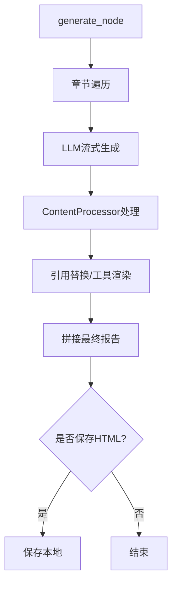

图表来源
- [generate.py:26-112](file://tools/DeepResearch/src/deepresearch/agent/generate.py#L26-L112)
- [generate.py:114-160](file://tools/DeepResearch/src/deepresearch/agent/generate.py#L114-L160)
- [generate.py:169-295](file://tools/DeepResearch/src/deepresearch/agent/generate.py#L169-L295)

章节来源
- [generate.py:26-343](file://tools/DeepResearch/src/deepresearch/agent/generate.py#L26-L343)

### 状态与消息（Message）
- ReportState：承载章节树、主题、领域、逻辑、细节、消息、知识、最终报告、搜索ID等。
- Chapter：章节树节点，支持添加引用、生成大纲文本、合并学习知识、序列化为JSON字符串。
- 合并策略：按引用ID集合分组，合并相同来源的知识片段，去重并保留上下文。

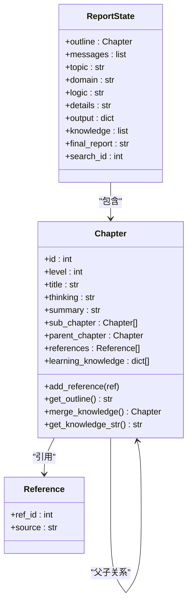

图表来源
- [message.py:18-112](file://tools/DeepResearch/src/deepresearch/agent/message.py#L18-L112)

章节来源
- [message.py:18-112](file://tools/DeepResearch/src/deepresearch/agent/message.py#L18-L112)

### 大模型封装（LLM）
- 实例工厂：按LLM类型创建实例，LRU缓存最多24个实例，避免频繁初始化。
- 响应缓存：非流式响应基于消息哈希缓存，命中即返回，提升重复请求性能。
- 流式/非流式：支持两种模式，非流式自动拼接reasoning_content与content。
- 监控统计：提供缓存命中率与容量统计，便于性能观测。

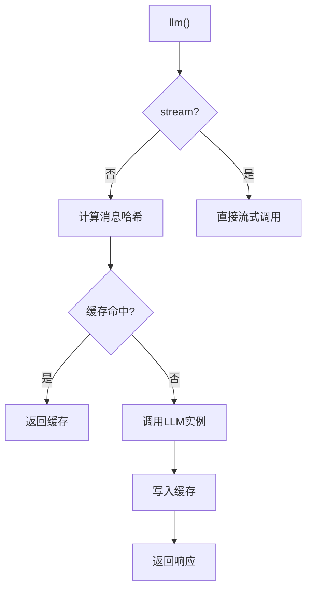

图表来源
- [llm.py:146-185](file://tools/DeepResearch/src/deepresearch/llms/llm.py#L146-L185)
- [llm.py:187-256](file://tools/DeepResearch/src/deepresearch/llms/llm.py#L187-L256)

章节来源
- [llm.py:1-308](file://tools/DeepResearch/src/deepresearch/llms/llm.py#L1-L308)

### 搜索工具（Search）
- 工厂模式：根据配置选择Jina或Tavily搜索引擎，统一对外接口。
- 并发搜索：在大纲生成与学习阶段并行执行，控制最大并发避免超限。

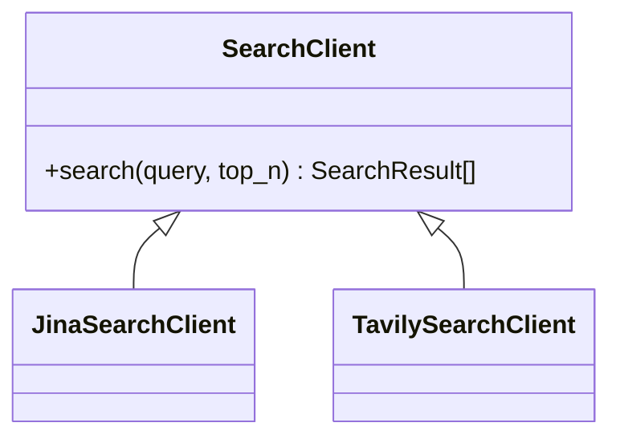

图表来源
- [search.py:12-37](file://tools/DeepResearch/src/deepresearch/tools/search.py#L12-L37)

章节来源
- [search.py:1-46](file://tools/DeepResearch/src/deepresearch/tools/search.py#L1-L46)

## 依赖关系分析
- 组件耦合：Agent依赖Prep/Outline/Learning/Generate；Learning依赖DeepSearch与Search；Generate依赖LLM与工具；DeepSearch依赖LLM与Search；LLM与Search依赖配置模块。
- 外部依赖：LangChain/LangGraph、DeepSeek、Tavily、json-repair、BeautifulSoup、lxml、mistune等。
- 配置依赖：workflow.toml提供搜索topN等参数，workflow_config.py加载并脱敏。

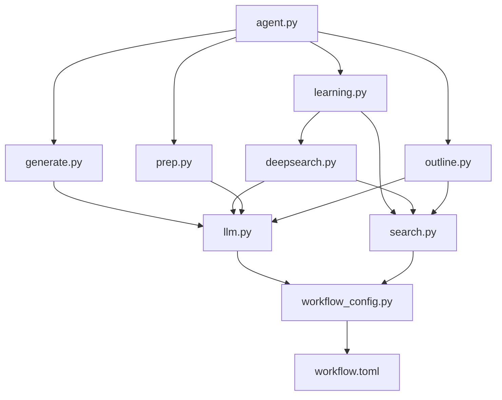

图表来源
- [agent.py:19-45](file://tools/DeepResearch/src/deepresearch/agent/agent.py#L19-L45)
- [learning.py:15-94](file://tools/DeepResearch/src/deepresearch/agent/learning.py#L15-L94)
- [generate.py:26-112](file://tools/DeepResearch/src/deepresearch/agent/generate.py#L26-L112)
- [deepsearch.py:74-150](file://tools/DeepResearch/src/deepresearch/agent/deepsearch.py#L74-L150)
- [prep.py:21-80](file://tools/DeepResearch/src/deepresearch/agent/prep.py#L21-L80)
- [outline.py:22-118](file://tools/DeepResearch/src/deepresearch/agent/outline.py#L22-L118)
- [llm.py:146-185](file://tools/DeepResearch/src/deepresearch/llms/llm.py#L146-L185)
- [search.py:12-37](file://tools/DeepResearch/src/deepresearch/tools/search.py#L12-L37)
- [workflow_config.py:7-28](file://tools/DeepResearch/src/deepresearch/config/workflow_config.py#L7-L28)
- [workflow.toml:1-3](file://tools/DeepResearch/config/workflow.toml#L1-L3)

章节来源
- [pyproject.toml:12-26](file://tools/DeepResearch/pyproject.toml#L12-L26)
- [workflow.toml:1-3](file://tools/DeepResearch/config/workflow.toml#L1-L3)
- [workflow_config.py:7-28](file://tools/DeepResearch/src/deepresearch/config/workflow_config.py#L7-L28)

## 性能考量
- LLM实例缓存：LRU缓存最多24个实例，降低初始化开销。
- LLM响应缓存：基于消息哈希的线程安全LRU缓存，命中率高时显著减少调用成本。
- 并行搜索与学习：大纲与学习阶段均采用有界线程池，控制并发上限，避免资源争用。
- 流式输出：生成阶段采用流式LLM输出，边生成边渲染，改善用户体验。
- 参考替换优化：预编译正则表达式，避免每块内容重复编译。

章节来源
- [llm.py:21-121](file://tools/DeepResearch/src/deepresearch/llms/llm.py#L21-L121)
- [outline.py:42-78](file://tools/DeepResearch/src/deepresearch/agent/outline.py#L42-L78)
- [learning.py:63-66](file://tools/DeepResearch/src/deepresearch/agent/learning.py#L63-L66)
- [generate.py:22-24](file://tools/DeepResearch/src/deepresearch/agent/generate.py#L22-L24)

## 故障排查指南
- LLM调用异常：捕获异常并记录错误日志，非流式返回空字符串，流式返回空生成器。
- 搜索失败：单查询失败不影响整体流程，记录错误并跳过该查询。
- 评估失败：记录未通过原因，生成新查询继续迭代，避免阻塞。
- 配置缺失：当指定LLM类型无配置或未知搜索引擎时抛出异常，需检查配置文件。
- 输出解析：使用json-repair容错解析，避免因模型输出格式问题中断流程。

章节来源
- [llm.py:216-240](file://tools/DeepResearch/src/deepresearch/llms/llm.py#L216-L240)
- [outline.py:46-54](file://tools/DeepResearch/src/deepresearch/agent/outline.py#L46-L54)
- [deepsearch.py:225-238](file://tools/DeepResearch/src/deepresearch/agent/deepsearch.py#L225-L238)
- [search.py:22-24](file://tools/DeepResearch/src/deepresearch/tools/search.py#L22-L24)

## 结论
DeepResearch通过清晰的模块划分与状态图编排，实现了“规划—工具—评估—迭代—生成—保存”的完整闭环。主智能体Agent作为中枢，协调Prep、Outline、Learning与Generate四大子智能体，结合LLM与外部搜索工具，形成高效、可扩展、可监控的智能体协作体系。通过实例与响应缓存、并行执行与流式输出等策略，系统在性能与稳定性上具备良好表现。

## 附录

### 配置参数与可调项
- 工作流配置（workflow.toml）
  - search.topN：默认5，控制每次搜索返回结果数量。
- 可配置运行参数（通过RunnableConfig传入）
  - depth：学习深度，默认由workflow配置提供。
  - save_as_html：是否保存为HTML。
  - save_path：保存路径。

章节来源
- [workflow.toml:1-3](file://tools/DeepResearch/config/workflow.toml#L1-L3)
- [workflow_config.py:7-28](file://tools/DeepResearch/src/deepresearch/config/workflow_config.py#L7-L28)
- [generate.py:114-160](file://tools/DeepResearch/src/deepresearch/agent/generate.py#L114-L160)
- [learning.py:31-33](file://tools/DeepResearch/src/deepresearch/agent/learning.py#L31-L33)

### 扩展开发指南
- 新增LLM类型：在LLM配置中新增类型定义，LLM工厂将自动创建实例。
- 新增工具：实现工具接口并注册至SearchClient工厂，即可在Outline与Learning中使用。
- 新增提示词模板：在prompts模板目录添加模板文件，通过apply_prompt_template调用。
- 自定义智能体：在agent.py中新增节点与边，遵循ReportState约定，保持与现有工作流兼容。

章节来源
- [llm.py:24-66](file://tools/DeepResearch/src/deepresearch/llms/llm.py#L24-L66)
- [search.py:12-37](file://tools/DeepResearch/src/deepresearch/tools/search.py#L12-L37)
- [agent.py:19-45](file://tools/DeepResearch/src/deepresearch/agent/agent.py#L19-L45)