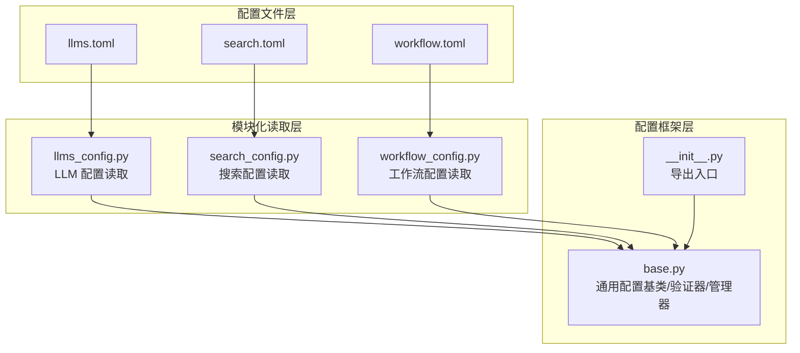
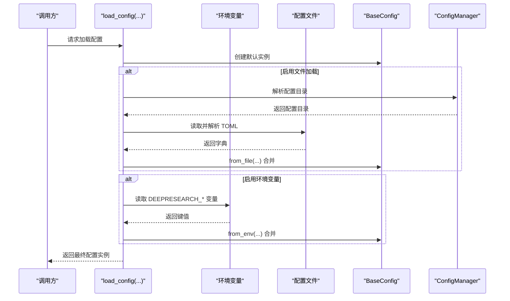
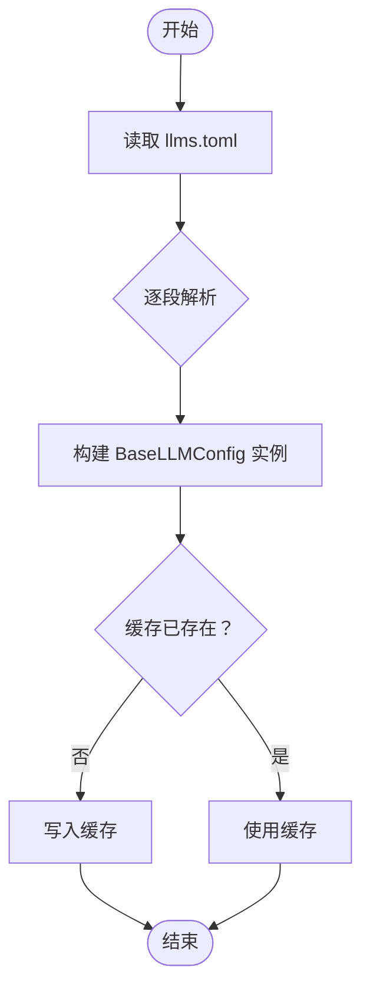
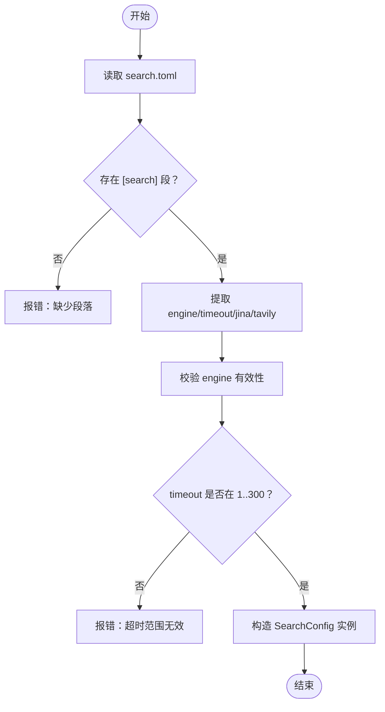
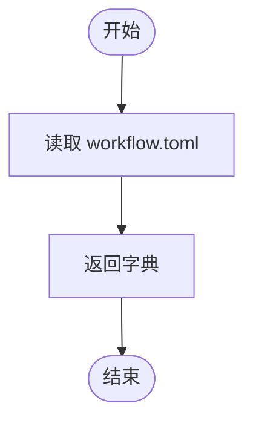
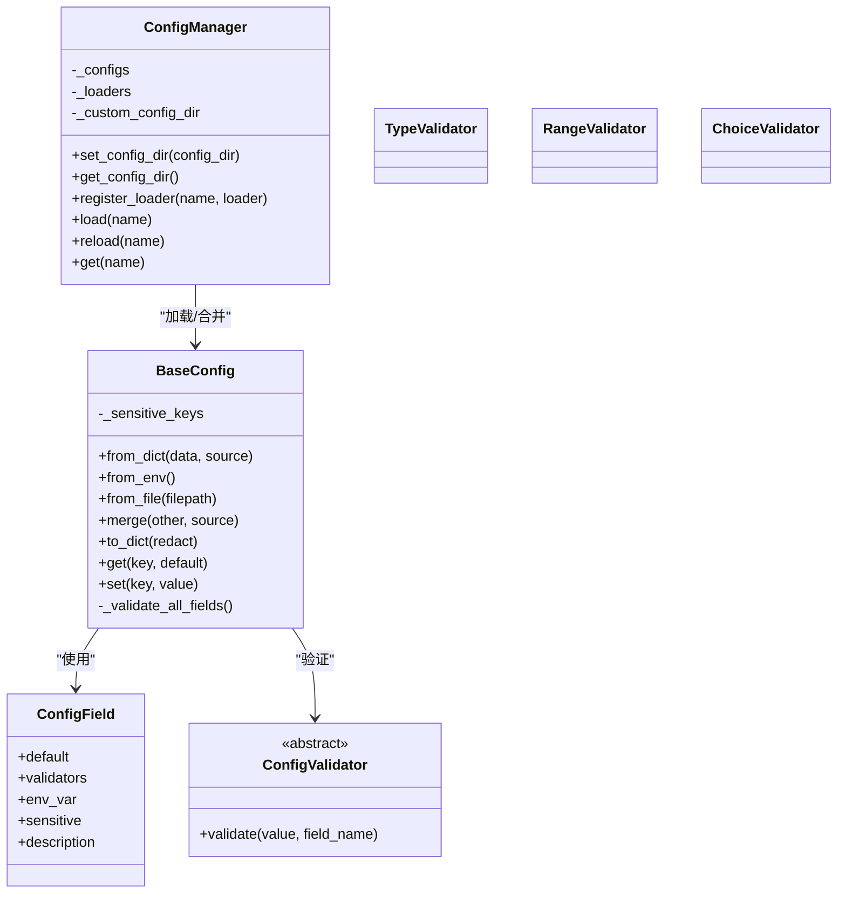
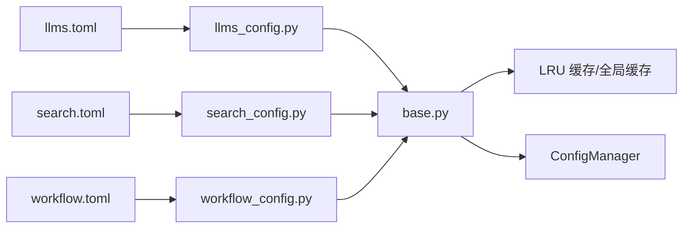

# 配置管理系统

<cite>
**本文引用的文件**
- [llms.toml](file://tools/DeepResearch/config/llms.toml)
- [search.toml](file://tools/DeepResearch/config/search.toml)
- [workflow.toml](file://tools/DeepResearch/config/workflow.toml)
- [__init__.py](file://tools/DeepResearch/src/deepresearch/config/__init__.py)
- [base.py](file://tools/DeepResearch/src/deepresearch/config/base.py)
- [llms_config.py](file://tools/DeepResearch/src/deepresearch/config/llms_config.py)
- [search_config.py](file://tools/DeepResearch/src/deepresearch/config/search_config.py)
- [workflow_config.py](file://tools/DeepResearch/src/deepresearch/config/workflow_config.py)
- [config.py](file://tools/DeepResearch/src/deepresearch/cli/config.py)
</cite>

## 目录
1. [简介](#简介)
2. [项目结构](#项目结构)
3. [核心组件](#核心组件)
4. [架构总览](#架构总览)
5. [详细组件分析](#详细组件分析)
6. [依赖关系分析](#依赖关系分析)
7. [性能考量](#性能考量)
8. [故障排查指南](#故障排查指南)
9. [结论](#结论)
10. [附录](#附录)

## 简介
本文件系统性阐述 DeepResearch 的配置管理系统，围绕基于 TOML 的配置文件与 Python 配置框架，覆盖 LLM 配置、搜索配置、工作流配置三大核心模块。内容包括：
- 配置文件结构定义与参数语义
- 参数验证机制、默认值处理与环境变量覆盖策略
- 配置作用域管理、动态更新与热重载机制
- 各模块功能特性、参数说明、配置示例与最佳实践
- 扩展开发指南与自定义配置项添加方法

## 项目结构
配置系统由“配置文件 + 配置加载与验证框架 + 模块化配置读取器”三层组成：
- 配置文件层：位于 tools/DeepResearch/config 下的 llms.toml、search.toml、workflow.toml
- 配置框架层：tools/DeepResearch/src/deepresearch/config 提供通用配置基类、验证器、管理器与便捷函数
- 模块化读取层：针对不同业务域的配置读取器，分别负责 LLM、搜索、工作流配置的解析与封装

图表来源
- [llms.toml:1-29](file://tools/DeepResearch/config/llms.toml#L1-L29)
- [search.toml:1-6](file://tools/DeepResearch/config/search.toml#L1-L6)
- [workflow.toml:1-3](file://tools/DeepResearch/config/workflow.toml#L1-L3)
- [base.py:1-590](file://tools/DeepResearch/src/deepresearch/config/base.py#L1-L590)
- [__init__.py:1-75](file://tools/DeepResearch/src/deepresearch/config/__init__.py#L1-L75)
- [llms_config.py:1-115](file://tools/DeepResearch/src/deepresearch/config/llms_config.py#L1-L115)
- [search_config.py:1-82](file://tools/DeepResearch/src/deepresearch/config/search_config.py#L1-L82)
- [workflow_config.py:1-28](file://tools/DeepResearch/src/deepresearch/config/workflow_config.py#L1-L28)

章节来源
- [llms.toml:1-29](file://tools/DeepResearch/config/llms.toml#L1-L29)
- [search.toml:1-6](file://tools/DeepResearch/config/search.toml#L1-L6)
- [workflow.toml:1-3](file://tools/DeepResearch/config/workflow.toml#L1-L3)
- [base.py:1-590](file://tools/DeepResearch/src/deepresearch/config/base.py#L1-L590)
- [__init__.py:1-75](file://tools/DeepResearch/src/deepresearch/config/__init__.py#L1-L75)

## 核心组件
- 通用配置基类与验证体系
  - 支持字段级验证器（类型、范围、选择）、环境变量映射、敏感字段脱敏、默认值与合并策略
  - 提供 from_dict/from_env/from_file/merge 等标准接口，统一配置来源与覆盖顺序
- 配置管理器
  - 统一配置目录解析（自定义 > 环境变量 > 默认），支持按需注册加载器与全局热重载
- 模块化配置读取器
  - LLM 配置：按 TOML 段落生成多个 LLM 实例，提供按角色访问的便捷函数
  - 搜索配置：校验引擎类型与超时范围，封装 Jina/Tavily 密钥
  - 工作流配置：简单键值读取，支持脱敏输出

章节来源
- [base.py:190-371](file://tools/DeepResearch/src/deepresearch/config/base.py#L190-L371)
- [base.py:373-456](file://tools/DeepResearch/src/deepresearch/config/base.py#L373-L456)
- [llms_config.py:12-61](file://tools/DeepResearch/src/deepresearch/config/llms_config.py#L12-L61)
- [search_config.py:12-53](file://tools/DeepResearch/src/deepresearch/config/search_config.py#L12-L53)
- [workflow_config.py:7-18](file://tools/DeepResearch/src/deepresearch/config/workflow_config.py#L7-L18)

## 架构总览
配置加载采用“代码默认值 → 环境变量 → 配置文件 → 默认值”的多层覆盖策略，并在运行期通过管理器与便捷函数实现动态目录与热重载。

图表来源
- [base.py:536-589](file://tools/DeepResearch/src/deepresearch/config/base.py#L536-L589)
- [base.py:242-276](file://tools/DeepResearch/src/deepresearch/config/base.py#L242-L276)
- [base.py:278-290](file://tools/DeepResearch/src/deepresearch/config/base.py#L278-L290)
- [base.py:373-456](file://tools/DeepResearch/src/deepresearch/config/base.py#L373-L456)

## 详细组件分析

### LLM 配置模块
- 结构与用途
  - 以 TOML 段落组织，每个段落代表一个 LLM 角色（如 basic、clarify、planner 等）
  - 每个 LLM 实例包含基础地址、API 基础地址、模型名与密钥等关键字段
- 关键流程
  - 读取 llms.toml 并逐段解析为 BaseLLMConfig 实例
  - 提供按角色访问的便捷函数，便于在工作流中按需获取对应 LLM
  - 支持脱敏输出与缓存控制（LRU 缓存 + 全局缓存清理）
- 参数说明
  - base_url：服务基础 URL
  - api_base：API 基础地址
  - model：模型标识
  - api_key：访问密钥
- 最佳实践
  - 将密钥置于环境变量或安全存储，避免硬编码
  - 不同角色使用独立段落，便于职责分离与权限控制
  - 定期清理配置缓存以支持热重载

图表来源
- [llms_config.py:46-85](file://tools/DeepResearch/src/deepresearch/config/llms_config.py#L46-L85)
- [llms.toml:1-29](file://tools/DeepResearch/config/llms.toml#L1-L29)

章节来源
- [llms.toml:1-29](file://tools/DeepResearch/config/llms.toml#L1-L29)
- [llms_config.py:12-115](file://tools/DeepResearch/src/deepresearch/config/llms_config.py#L12-L115)

### 搜索配置模块
- 结构与用途
  - 单一 [search] 段落，包含搜索引擎类型、超时时间以及各引擎的 API 密钥
  - 支持 Jina 与 Tavily 两种引擎，超时范围校验确保稳定性
- 关键流程
  - 读取 search.toml，定位 [search] 段落并进行字段校验
  - 对超时参数执行范围校验（1–300 秒）
- 参数说明
  - engine：搜索引擎类型（支持值见验证器）
  - timeout：请求超时（秒）
  - jina_api_key：Jina 引擎密钥
  - tavily_api_key：Tavily 引擎密钥
- 最佳实践
  - 在生产环境为不同引擎配置独立密钥，避免混用
  - 根据网络状况调整超时阈值，兼顾响应速度与成功率

图表来源
- [search_config.py:56-72](file://tools/DeepResearch/src/deepresearch/config/search_config.py#L56-L72)
- [search.toml:1-6](file://tools/DeepResearch/config/search.toml#L1-L6)

章节来源
- [search.toml:1-6](file://tools/DeepResearch/config/search.toml#L1-L6)
- [search_config.py:12-82](file://tools/DeepResearch/src/deepresearch/config/search_config.py#L12-L82)

### 工作流配置模块
- 结构与用途
  - 顶层键值对形式，当前包含 topN 等参数，用于控制检索结果数量等行为
- 关键流程
  - 直接读取并返回 TOML 字典，便于上层按需访问
- 参数说明
  - topN：检索返回条目数量
- 最佳实践
  - 保持键名简洁明确，配合注释说明用途
  - 与搜索配置协同，平衡召回率与性能

图表来源
- [workflow_config.py:7-18](file://tools/DeepResearch/src/deepresearch/config/workflow_config.py#L7-L18)
- [workflow.toml:1-3](file://tools/DeepResearch/config/workflow.toml#L1-L3)

章节来源
- [workflow.toml:1-3](file://tools/DeepResearch/config/workflow.toml#L1-L3)
- [workflow_config.py:1-28](file://tools/DeepResearch/src/deepresearch/config/workflow_config.py#L1-L28)

### 配置加载与验证框架
- 配置来源与覆盖顺序
  - 代码默认值（最弱）
  - 环境变量（强于文件）
  - 配置文件（强于默认）
  - 默认值（最强）
- 验证器与字段元数据
  - 类型验证、范围验证、选择验证
  - 字段元数据支持：环境变量名映射、敏感字段标记、描述信息
- 敏感信息处理
  - 默认敏感键集合包含常见密钥词，支持动态增删
  - 提供脱敏输出与缓存清理能力
- 动态配置目录与热重载
  - 支持通过环境变量或管理器设置自定义配置目录
  - 提供全局缓存清理与按名称重载

图表来源
- [base.py:190-371](file://tools/DeepResearch/src/deepresearch/config/base.py#L190-L371)
- [base.py:373-456](file://tools/DeepResearch/src/deepresearch/config/base.py#L373-L456)
- [base.py:85-150](file://tools/DeepResearch/src/deepresearch/config/base.py#L85-L150)

章节来源
- [base.py:1-590](file://tools/DeepResearch/src/deepresearch/config/base.py#L1-L590)
- [__init__.py:1-75](file://tools/DeepResearch/src/deepresearch/config/__init__.py#L1-L75)

### CLI 配置与作用域
- CLI 配置对象封装了命令行相关的行为参数，支持从环境变量加载并进行范围约束
- 作用域管理
  - CLI 层面的配置与业务配置解耦，通过独立的数据类与环境变量映射实现
  - CLI 配置可显式覆盖默认值，便于本地调试与快速切换

章节来源
- [config.py:15-101](file://tools/DeepResearch/src/deepresearch/cli/config.py#L15-L101)

## 依赖关系分析
- 配置文件到读取器
  - llms.toml → llms_config.py
  - search.toml → search_config.py
  - workflow.toml → workflow_config.py
- 读取器到框架
  - 三个读取器均依赖 base.py 中的通用加载与脱敏工具
- 管理器与缓存
  - ConfigManager 统一解析配置目录，load_toml_config 使用 LRU 缓存提升性能
  - clear_config_cache 用于热重载场景

图表来源
- [llms_config.py:1-115](file://tools/DeepResearch/src/deepresearch/config/llms_config.py#L1-L115)
- [search_config.py:1-82](file://tools/DeepResearch/src/deepresearch/config/search_config.py#L1-L82)
- [workflow_config.py:1-28](file://tools/DeepResearch/src/deepresearch/config/workflow_config.py#L1-L28)
- [base.py:459-516](file://tools/DeepResearch/src/deepresearch/config/base.py#L459-L516)

章节来源
- [base.py:459-516](file://tools/DeepResearch/src/deepresearch/config/base.py#L459-L516)
- [llms_config.py:1-115](file://tools/DeepResearch/src/deepresearch/config/llms_config.py#L1-L115)
- [search_config.py:1-82](file://tools/DeepResearch/src/deepresearch/config/search_config.py#L1-L82)
- [workflow_config.py:1-28](file://tools/DeepResearch/src/deepresearch/config/workflow_config.py#L1-L28)

## 性能考量
- 缓存策略
  - TOML 文件读取使用 LRU 缓存，减少重复 IO；全局缓存可通过 clear_config_cache 清理
- 合并与验证
  - merge 采用浅层字段遍历与值比较，避免深度拷贝开销
  - 验证器在初始化后一次性执行，后续访问不重复验证
- I/O 优化
  - 配置目录解析优先使用自定义或环境变量，避免多次路径拼接

## 故障排查指南
- 常见问题与定位
  - 配置文件解析失败：检查 TOML 语法与段落命名，确认文件可读
  - 字段缺失或类型错误：根据验证器提示修正字段类型或范围
  - 环境变量未生效：确认环境变量前缀与字段名匹配，布尔值大小写
  - 热重载不生效：调用 clear_config_cache 或 ConfigManager.reload 刷新缓存
- 建议操作
  - 使用脱敏输出查看当前配置，确认敏感字段已被隐藏
  - 在开发阶段启用更宽松的超时与日志级别，便于定位问题

章节来源
- [base.py:459-516](file://tools/DeepResearch/src/deepresearch/config/base.py#L459-L516)
- [base.py:536-589](file://tools/DeepResearch/src/deepresearch/config/base.py#L536-L589)

## 结论
DeepResearch 的配置系统以 TOML 为统一格式，结合通用配置框架实现了清晰的层次化覆盖、严格的参数验证与灵活的动态更新能力。通过模块化读取器，LLM、搜索与工作流配置得以独立维护与演进，同时共享统一的加载、验证与脱敏机制。该设计既满足了工程化部署的稳定性需求，也为扩展与定制提供了良好基础。

## 附录

### 配置文件结构与参数说明

- LLM 配置（llms.toml）
  - 结构：每个段落代表一个角色（如 basic、clarify、planner 等）
  - 字段：base_url、api_base、model、api_key
  - 示例参考：[llms.toml:1-29](file://tools/DeepResearch/config/llms.toml#L1-L29)

- 搜索配置（search.toml）
  - 结构：[search] 段落
  - 字段：engine（引擎类型）、timeout（秒）、jina_api_key、tavily_api_key
  - 示例参考：[search.toml:1-6](file://tools/DeepResearch/config/search.toml#L1-L6)

- 工作流配置（workflow.toml）
  - 结构：顶层键值对
  - 字段：topN（检索条目数）
  - 示例参考：[workflow.toml:1-3](file://tools/DeepResearch/config/workflow.toml#L1-L3)

### 配置加载策略与最佳实践
- 加载顺序
  - 代码默认值 → 环境变量 → 配置文件 → 默认值
- 环境变量覆盖
  - 默认前缀为 DEEPRESEARCH_，可通过 env_var 元数据或自定义前缀覆盖
- 默认值与范围约束
  - 使用 TypeValidator/RangeValidator/ChoiceValidator 明确约束
- 敏感信息
  - 默认敏感键集合可动态增删；输出时建议启用脱敏
- 热重载
  - 通过 clear_config_cache 或 ConfigManager.reload 触发

章节来源
- [base.py:536-589](file://tools/DeepResearch/src/deepresearch/config/base.py#L536-L589)
- [base.py:487-510](file://tools/DeepResearch/src/deepresearch/config/base.py#L487-L510)
- [base.py:513-534](file://tools/DeepResearch/src/deepresearch/config/base.py#L513-L534)

### 扩展开发指南与自定义配置项添加方法
- 新增配置模块步骤
  - 在 config 目录新增 TOML 文件（如 mymodule.toml）
  - 在 src/deepresearch/config 下新增读取器模块（如 mymodule_config.py），实现：
    - 数据类定义（字段与默认值）
    - from_dict/from_env/from_file 等解析方法
    - load_* 与 get_redacted_* 函数
  - 在 __init__.py 中导出新模块接口
- 添加验证器
  - 继承 ConfigValidator 并实现 validate 方法
  - 在字段元数据中注册 validators 列表
- 环境变量映射
  - 通过 config_field(env_var="...") 或字段元数据 env_var 指定
- 敏感字段
  - 在字段元数据中设置 sensitive=true，或使用 add_sensitive_key/remove_sensitive_key 动态维护
- 热重载
  - 在读取器中暴露 reload_* 函数，内部调用 clear_config_cache 并刷新缓存变量

章节来源
- [__init__.py:44-74](file://tools/DeepResearch/src/deepresearch/config/__init__.py#L44-L74)
- [base.py:152-182](file://tools/DeepResearch/src/deepresearch/config/base.py#L152-L182)
- [base.py:513-534](file://tools/DeepResearch/src/deepresearch/config/base.py#L513-L534)