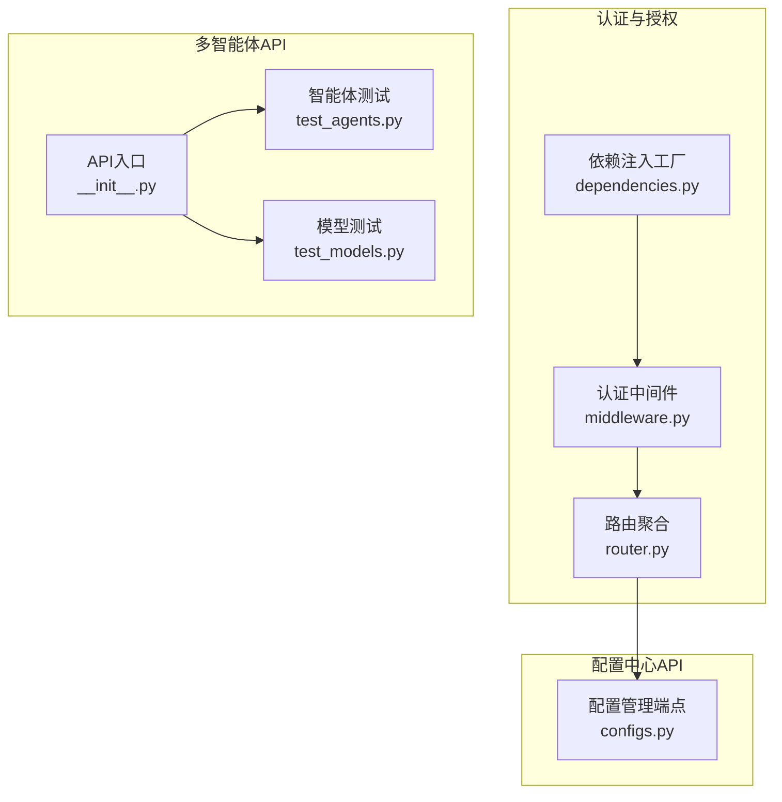
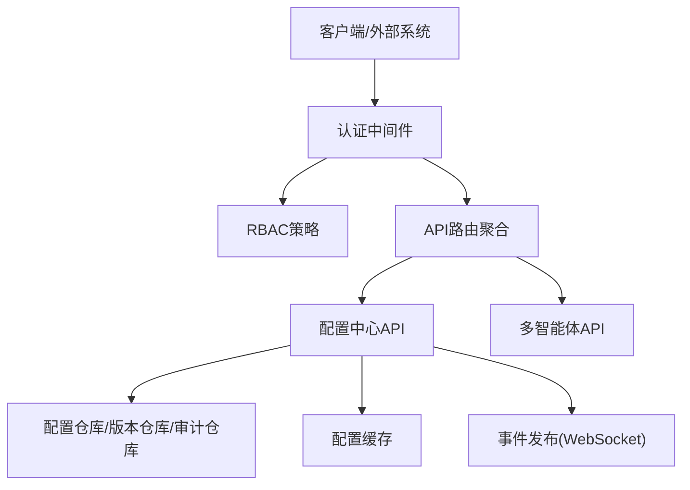
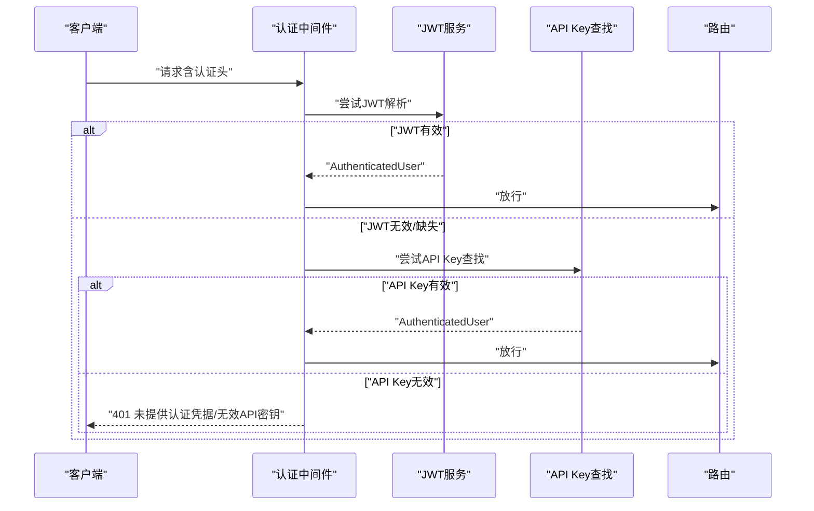
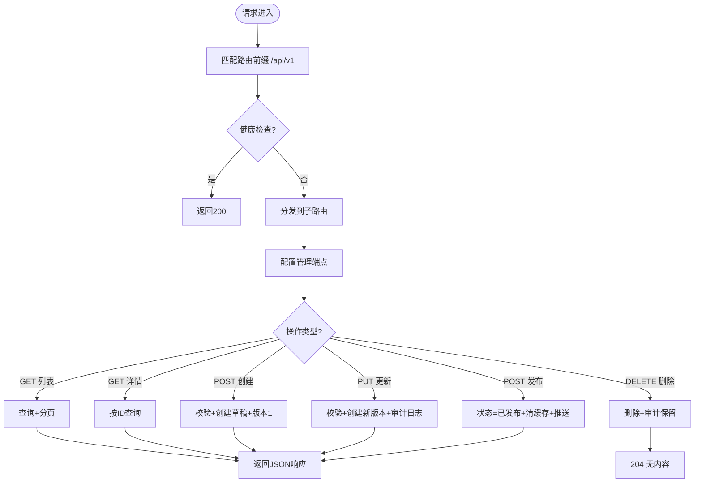
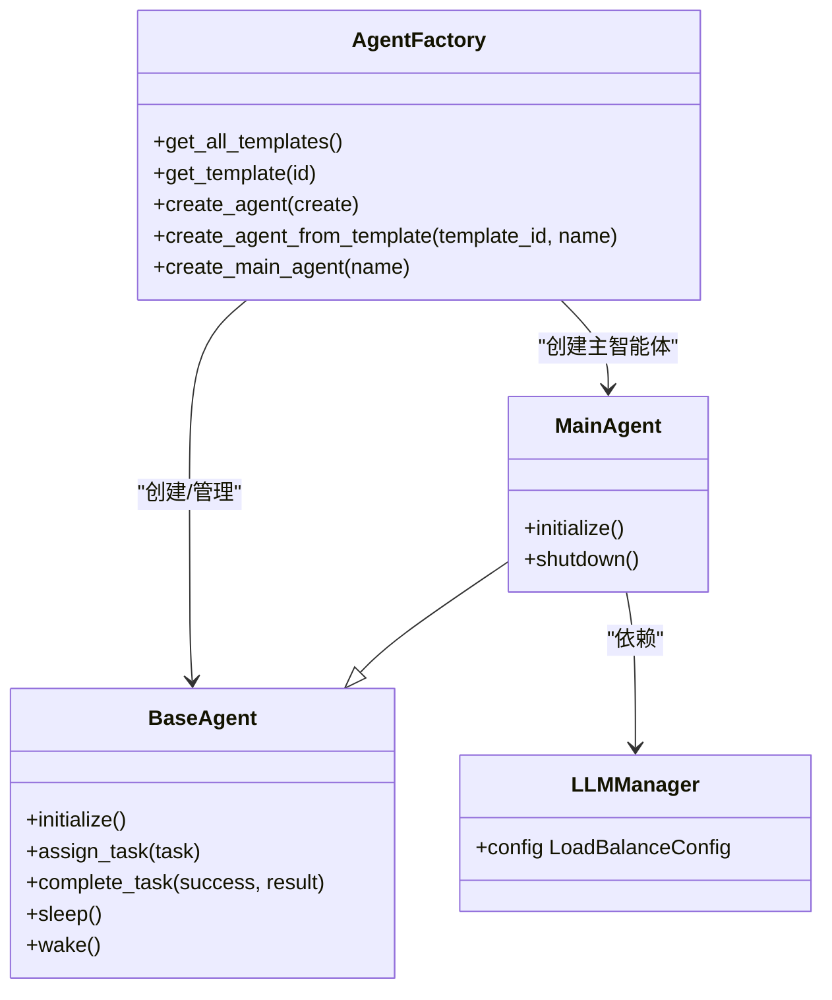
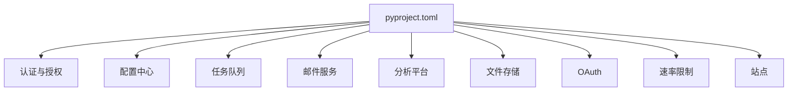

# API接口与集成

<cite>
**本文引用的文件**   
- [pyproject.toml](file://tools/flexloop/pyproject.toml)
- [README.md](file://tools/flexloop/README.md)
- [router.py](file://src/taolib/testing/oauth/server/api/router.py)
- [dependencies.py](file://src/taolib/testing/auth/fastapi/dependencies.py)
- [middleware.py](file://src/taolib/testing/auth/fastapi/middleware.py)
- [configs.py](file://src/taolib/testing/config_center/server/api/configs.py)
- [test_agents.py](file://tests/testing/test_multi_agent/test_agents.py)
- [test_models.py](file://tests/testing/test_multi_agent/test_models.py)
- [__init__.py](file://src/taolib/testing/multi_agent/api/__init__.py)
</cite>

## 目录
1. [简介](#简介)
2. [项目结构](#项目结构)
3. [核心组件](#核心组件)
4. [架构总览](#架构总览)
5. [详细组件分析](#详细组件分析)
6. [依赖分析](#依赖分析)
7. [性能考虑](#性能考虑)
8. [故障排查指南](#故障排查指南)
9. [结论](#结论)
10. [附录](#附录)

## 简介
本文件面向FlexLoop多智能体系统的API接口与集成场景，系统性梳理taolib中的认证与授权、配置中心、多智能体API等模块的对外接口设计与集成方法。内容覆盖API路由配置、请求处理机制、响应格式规范、错误处理策略；同时给出与AgentPit平台协作、配置中心对接、监控系统集成的实践路径，并提供API测试方法、性能基准测试与安全考虑。

## 项目结构
taolib作为多智能体基础设施库，采用按功能域划分的模块化组织方式，核心API服务基于FastAPI构建，配合认证中间件、依赖注入与RBAC策略，形成可扩展的微服务式API体系。多智能体API位于testing子包内，提供智能体生命周期、任务编排与技能调用的REST接口；配置中心API提供配置的全生命周期管理；认证中间件支持JWT与API Key双通道认证。

**图表来源**
- [router.py:1-24](file://src/taolib/testing/oauth/server/api/router.py#L1-L24)
- [dependencies.py:1-41](file://src/taolib/testing/auth/fastapi/dependencies.py#L1-L41)
- [middleware.py:144-172](file://src/taolib/testing/auth/fastapi/middleware.py#L144-L172)
- [configs.py:1-385](file://src/taolib/testing/config_center/server/api/configs.py#L1-L385)
- [__init__.py:1-8](file://src/taolib/testing/multi_agent/api/__init__.py#L1-L8)
- [test_agents.py:1-267](file://tests/testing/test_multi_agent/test_agents.py#L1-L267)
- [test_models.py:1-392](file://tests/testing/test_multi_agent/test_models.py#L1-L392)

**章节来源**
- [pyproject.toml:1-318](file://tools/flexloop/pyproject.toml#L1-L318)
- [README.md:1-100](file://tools/flexloop/README.md#L1-L100)

## 核心组件
- 认证中间件与依赖注入：提供JWT与API Key双通道认证，支持健康检查端点免认证，支持黑名单拦截与角色访问控制（RBAC）。
- 配置中心API：提供配置的CRUD、版本管理、审计日志与实时推送能力，支持按环境与服务过滤。
- 多智能体API：提供智能体创建、状态查询、任务分发与完成上报、模板化创建等能力，配套测试用例验证核心模型与行为。

**章节来源**
- [dependencies.py:1-41](file://src/taolib/testing/auth/fastapi/dependencies.py#L1-L41)
- [middleware.py:144-172](file://src/taolib/testing/auth/fastapi/middleware.py#L144-L172)
- [configs.py:1-385](file://src/taolib/testing/config_center/server/api/configs.py#L1-L385)
- [test_agents.py:1-267](file://tests/testing/test_multi_agent/test_agents.py#L1-L267)
- [test_models.py:1-392](file://tests/testing/test_multi_agent/test_models.py#L1-L392)

## 架构总览
下图展示taolib中认证中间件、路由聚合与配置中心API之间的交互关系，以及多智能体API的入口位置。

**图表来源**
- [router.py:1-24](file://src/taolib/testing/oauth/server/api/router.py#L1-L24)
- [middleware.py:144-172](file://src/taolib/testing/auth/fastapi/middleware.py#L144-L172)
- [configs.py:1-385](file://src/taolib/testing/config_center/server/api/configs.py#L1-L385)

## 详细组件分析

### 认证与授权组件
- 双通道认证：支持Bearer Token（JWT）与API Key两种认证方式，API Key可通过请求头或Authorization头携带。
- 中间件逻辑：优先尝试JWT解析，失败则尝试API Key查找用户身份；均失败时返回401并设置WWW-Authenticate头；健康检查端点豁免认证。
- 依赖注入：通过工厂函数创建认证依赖，支持黑名单校验、RBAC策略与OAuth2密码流方案。

**图表来源**
- [middleware.py:144-172](file://src/taolib/testing/auth/fastapi/middleware.py#L144-L172)
- [dependencies.py:1-41](file://src/taolib/testing/auth/fastapi/dependencies.py#L1-L41)

**章节来源**
- [middleware.py:144-172](file://src/taolib/testing/auth/fastapi/middleware.py#L144-L172)
- [dependencies.py:1-41](file://src/taolib/testing/auth/fastapi/dependencies.py#L1-L41)

### 配置中心API组件
- 路由前缀与聚合：统一在/api/v1前缀下注册健康检查、流程、账户、会话、引导与管理等子路由。
- 主要端点：
  - GET /configs：分页列出配置，支持按环境与服务过滤。
  - GET /configs/{config_id}：获取配置详情。
  - POST /configs：创建配置，初始状态为草稿并生成版本1。
  - PUT /configs/{config_id}：更新配置，自动创建新版本并记录审计日志。
  - DELETE /configs/{config_id}：删除配置（不可恢复），推送删除事件。
  - POST /configs/{config_id}/publish：发布配置，清缓存并推送变更。
- 响应与错误：遵循标准HTTP状态码，401/403/404等典型错误场景明确。
- 版本与审计：每次变更生成版本记录，支持回滚；审计日志持久化；发布后通过事件发布器推送至客户端。

**图表来源**
- [router.py:1-24](file://src/taolib/testing/oauth/server/api/router.py#L1-L24)
- [configs.py:1-385](file://src/taolib/testing/config_center/server/api/configs.py#L1-L385)

**章节来源**
- [router.py:1-24](file://src/taolib/testing/oauth/server/api/router.py#L1-L24)
- [configs.py:1-385](file://src/taolib/testing/config_center/server/api/configs.py#L1-L385)

### 多智能体API组件
- API入口：多智能体API模块通过入口导出FastAPI应用对象，便于独立部署或嵌入其他系统。
- 关键能力（基于测试用例抽象）：
  - 智能体生命周期：初始化、休眠、唤醒、销毁。
  - 任务管理：分配任务、完成任务、状态流转。
  - 工厂模式：模板化创建智能体、主智能体调度子智能体。
  - 数据模型：智能体、任务、技能、消息、LLM配置与负载均衡策略等。
- 测试覆盖：对智能体基类、主智能体、工厂、模型序列化与枚举进行单元测试，确保行为一致性。

**图表来源**
- [test_agents.py:1-267](file://tests/testing/test_multi_agent/test_agents.py#L1-L267)
- [test_models.py:1-392](file://tests/testing/test_multi_agent/test_models.py#L1-L392)

**章节来源**
- [__init__.py:1-8](file://src/taolib/testing/multi_agent/api/__init__.py#L1-L8)
- [test_agents.py:1-267](file://tests/testing/test_multi_agent/test_agents.py#L1-L267)
- [test_models.py:1-392](file://tests/testing/test_multi_agent/test_models.py#L1-L392)

## 依赖分析
- 项目依赖与可选组件：通过pyproject.toml定义了认证、配置中心、任务队列、邮件服务、分析平台、文件存储、OAuth、速率限制、站点等模块的可选依赖集，便于按需启用不同API服务。
- FastAPI生态：多模块基于FastAPI构建，结合Uvicorn运行，具备良好的异步与并发能力。
- 数据与缓存：多数服务依赖MongoDB（motor）、Redis（hiredis）与Pydantic模型，保证数据一致性与高性能。

**图表来源**
- [pyproject.toml:1-318](file://tools/flexloop/pyproject.toml#L1-L318)

**章节来源**
- [pyproject.toml:1-318](file://tools/flexloop/pyproject.toml#L1-L318)

## 性能考虑
- 异步与并发：基于FastAPI与异步运行时，适合高并发请求场景；建议在生产环境中使用Uvicorn多进程/多线程部署。
- 缓存策略：配置中心与任务队列等模块提供缓存与事件推送，降低数据库压力并提升实时性。
- 依赖优化：按需安装可选依赖，避免不必要的第三方库引入带来的启动与运行开销。
- 监控与可观测性：建议接入日志平台与指标采集，结合审计日志与版本管理，实现全链路追踪。

## 故障排查指南
- 认证失败
  - 现象：返回401未提供认证凭据或无效API密钥。
  - 排查：确认请求头是否包含有效的Bearer Token或X-API-Key；检查中间件是否正确识别API Key前缀；核对黑名单与RBAC权限。
- 健康检查异常
  - 现象：/health返回非200。
  - 排查：确认中间件对健康检查端点的豁免配置；检查服务启动状态与依赖可用性。
- 配置中心操作失败
  - 现象：创建/更新/删除/发布返回4xx。
  - 排查：核对权限（config:read/write/delete/publish）；检查键唯一性与状态流转；确认版本仓库与审计仓库正常；查看事件发布器状态。
- 多智能体行为异常
  - 现象：任务分配/完成失败或状态不一致。
  - 排查：参考测试用例中的状态机与异常场景，定位智能体基类与工厂的实现边界；检查LLM管理器与负载均衡配置。

**章节来源**
- [middleware.py:144-172](file://src/taolib/testing/auth/fastapi/middleware.py#L144-L172)
- [configs.py:1-385](file://src/taolib/testing/config_center/server/api/configs.py#L1-L385)
- [test_agents.py:1-267](file://tests/testing/test_multi_agent/test_agents.py#L1-L267)

## 结论
taolib围绕FastAPI提供了可插拔的认证授权、配置中心与多智能体API能力，具备清晰的路由聚合、依赖注入与RBAC策略，能够满足FlexLoop多智能体系统的对外接口与集成需求。通过版本管理、审计日志与事件推送，系统实现了配置的全生命周期治理；通过工厂模式与模板化创建，简化了智能体与任务的编排流程。建议在生产环境中结合缓存、监控与速率限制，进一步提升稳定性与安全性。

## 附录
- 快速开始与安装：参见项目README，了解taolib的安装与文档构建方式。
- API使用示例（基于测试用例抽象）
  - 智能体创建：通过工厂创建智能体或从模板创建，随后initialize进入空闲状态。
  - 技能调用：通过任务分配与完成上报流程，结合智能体能力与LLM配置进行推理与输出。
  - 状态查询：通过配置中心API查询配置状态与版本，或通过多智能体API查询智能体与任务状态。
  - 任务管理：支持任务创建、分配、完成与失败回退，配合审计日志与事件推送实现可观测性。

**章节来源**
- [README.md:1-100](file://tools/flexloop/README.md#L1-L100)
- [test_agents.py:1-267](file://tests/testing/test_multi_agent/test_agents.py#L1-L267)
- [test_models.py:1-392](file://tests/testing/test_multi_agent/test_models.py#L1-L392)
- [configs.py:1-385](file://src/taolib/testing/config_center/server/api/configs.py#L1-L385)