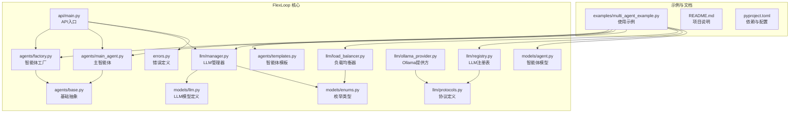
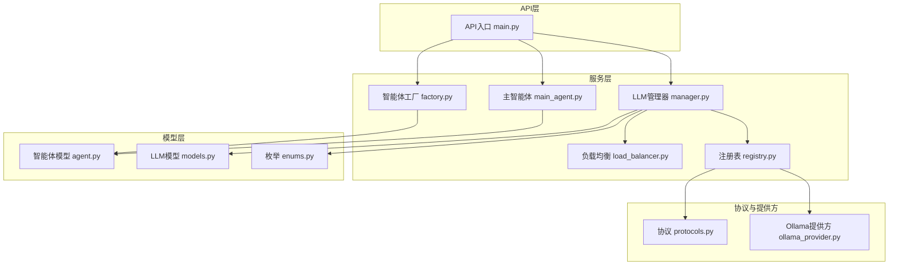
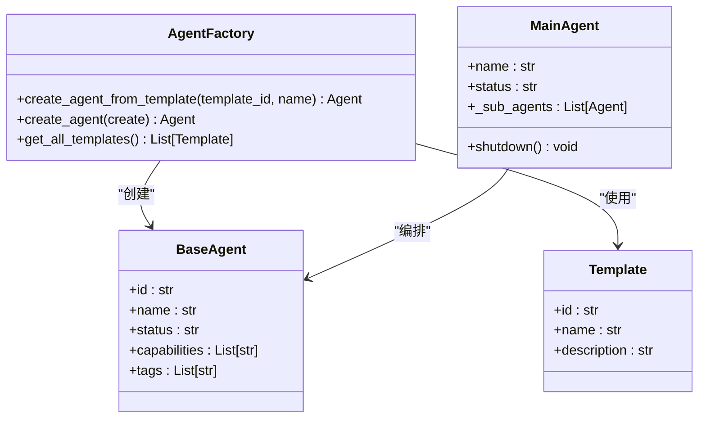
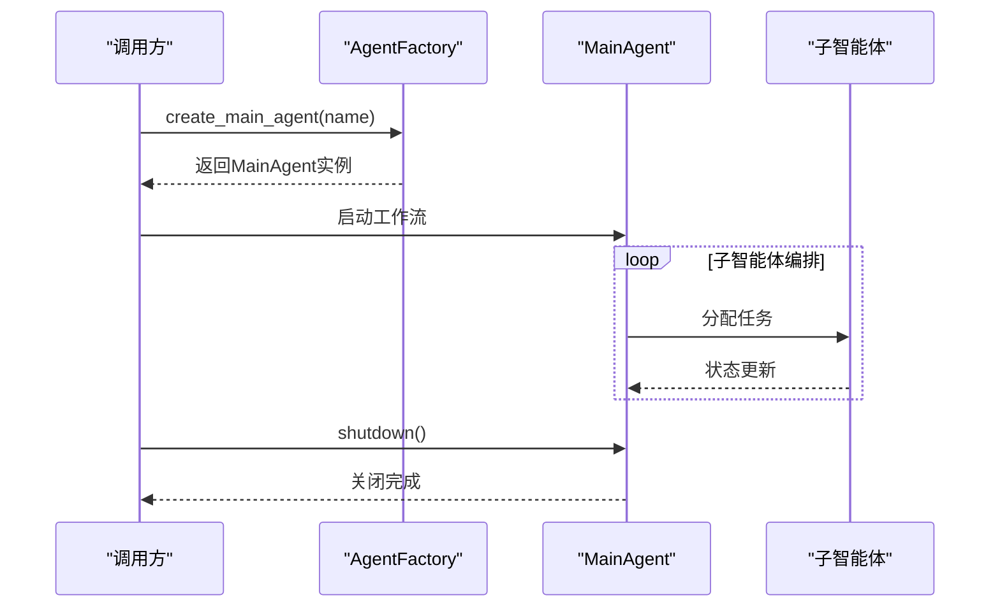
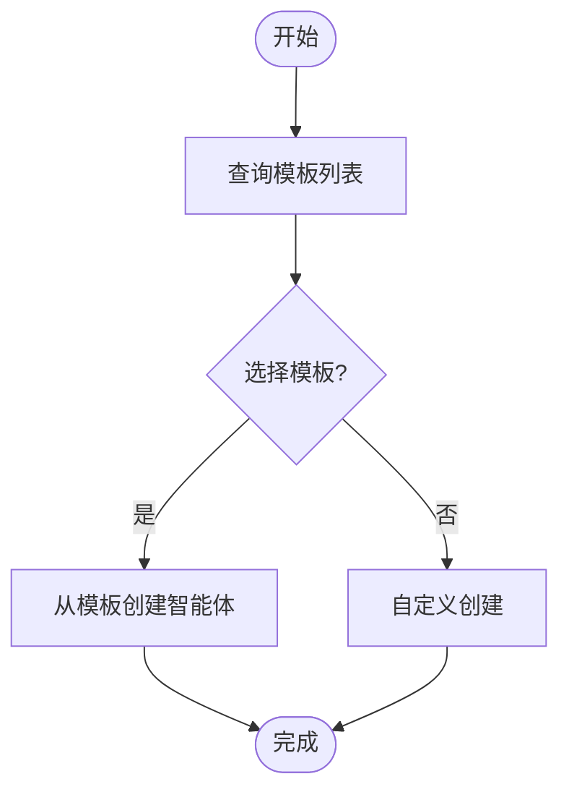
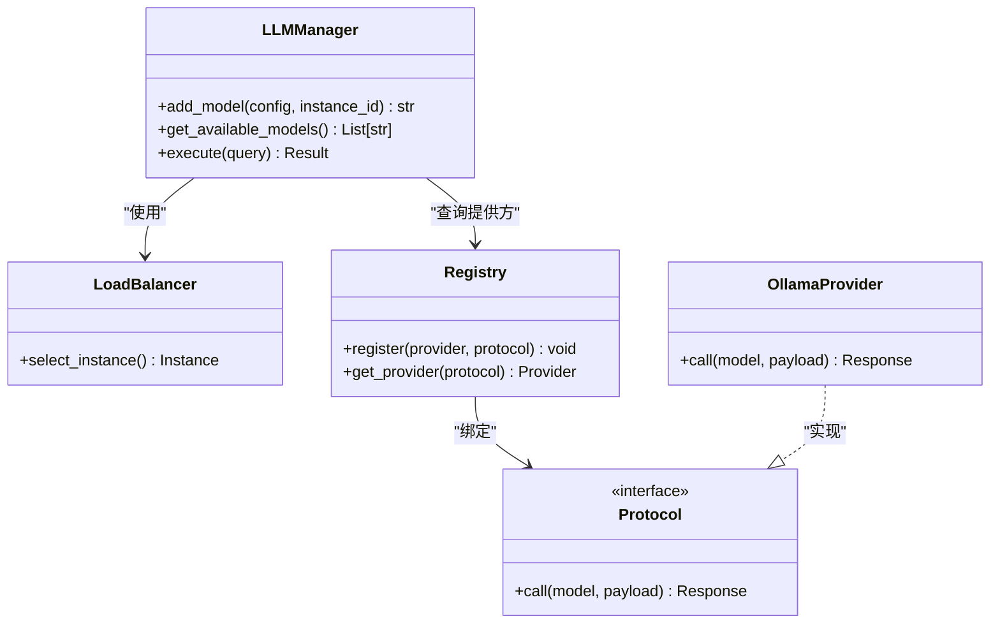
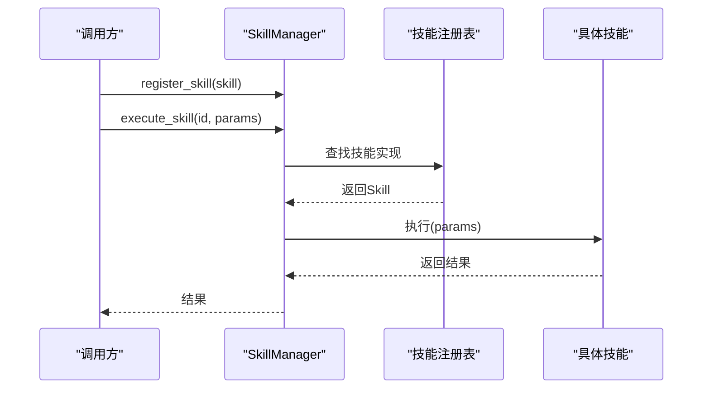
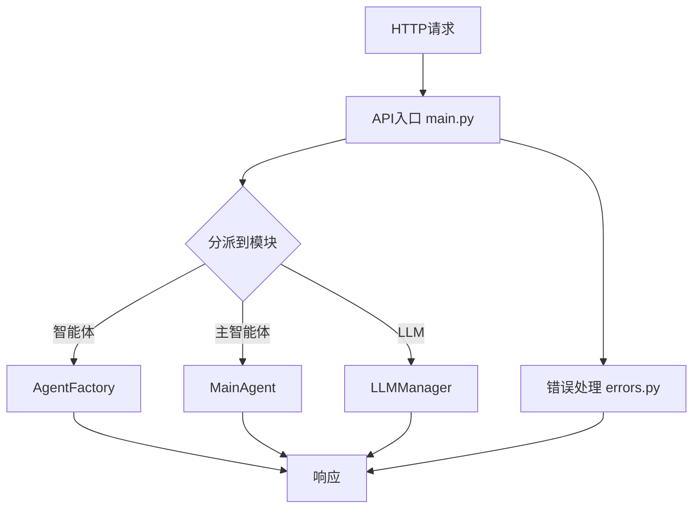
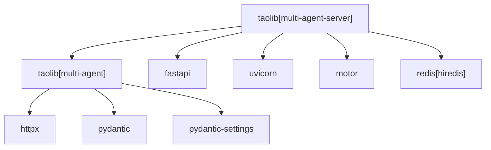

# FlexLoop多智能体系统

<cite>
**本文引用的文件**
- [README.md](file://tools/flexloop/README.md)
- [pyproject.toml](file://tools/flexloop/pyproject.toml)
- [multi_agent_example.py](file://tools/flexloop/examples/multi_agent_example.py)
- [factory.py](file://tools/flexloop/src/taolib/testing/multi_agent/agents/factory.py)
- [main_agent.py](file://tools/flexloop/src/taolib/testing/multi_agent/agents/main_agent.py)
- [templates.py](file://tools/flexloop/src/taolib/testing/multi_agent/agents/templates.py)
- [base.py](file://tools/flexloop/src/taolib/testing/multi_agent/agents/base.py)
- [models.py](file://tools/flexloop/src/taolib/testing/multi_agent/models/llm.py)
- [enums.py](file://tools/flexloop/src/taolib/testing/multi_agent/models/enums.py)
- [manager.py](file://tools/flexloop/src/taolib/testing/multi_agent/llm/manager.py)
- [load_balancer.py](file://tools/flexloop/src/taolib/testing/multi_agent/llm/load_balancer.py)
- [registry.py](file://tools/flexloop/src/taolib/testing/multi_agent/llm/registry.py)
- [protocols.py](file://tools/flexloop/src/taolib/testing/multi_agent/llm/protocols.py)
- [ollama_provider.py](file://tools/flexloop/src/taolib/testing/multi_agent/llm/ollama_provider.py)
- [main.py](file://tools/flexloop/src/taolib/testing/multi_agent/api/main.py)
- [errors.py](file://tools/flexloop/src/taolib/testing/multi_agent/errors.py)
- [agent.py](file://tools/flexloop/src/taolib/testing/multi_agent/models/agent.py)
- [AgentPit README.md](file://apps/AgentPit/README.md)
</cite>

## 目录
1. [简介](#简介)
2. [项目结构](#项目结构)
3. [核心组件](#核心组件)
4. [架构总览](#架构总览)
5. [详细组件分析](#详细组件分析)
6. [依赖分析](#依赖分析)
7. [性能考虑](#性能考虑)
8. [故障排查指南](#故障排查指南)
9. [结论](#结论)
10. [附录](#附录)

## 简介
FlexLoop多智能体系统是一个基于Python的模块化多智能体工作流引擎，旨在支持智能体工厂模式、主智能体协调机制、智能体模板系统、LLM负载均衡策略与技能注册表管理。该系统通过清晰的模块划分与可扩展的API，为DAO生态与AgentPit平台提供统一的多智能体编排能力。

系统特性包括：
- 智能体工厂与模板系统：快速创建与复制智能体，支持预置模板与自定义配置。
- 主智能体协调：集中式控制与生命周期管理，支持子智能体编排与状态同步。
- 技能注册与执行：统一技能接口与注册表，支持动态技能扩展与调用。
- LLM管理与负载均衡：统一LLM接入、实例管理与多策略负载均衡。
- 通信与API：提供REST风格API与错误处理规范，便于集成到上层应用。

## 项目结构
FlexLoop位于tools/flexloop目录，采用Python包结构组织，核心模块集中在src/taolib/testing/multi_agent下，示例位于examples目录，项目元信息与依赖在pyproject.toml中定义。

图表来源
- [factory.py](file://tools/flexloop/src/taolib/testing/multi_agent/agents/factory.py)
- [main_agent.py](file://tools/flexloop/src/taolib/testing/multi_agent/agents/main_agent.py)
- [templates.py](file://tools/flexloop/src/taolib/testing/multi_agent/agents/templates.py)
- [base.py](file://tools/flexloop/src/taolib/testing/multi_agent/agents/base.py)
- [models.py](file://tools/flexloop/src/taolib/testing/multi_agent/models/llm.py)
- [enums.py](file://tools/flexloop/src/taolib/testing/multi_agent/models/enums.py)
- [manager.py](file://tools/flexloop/src/taolib/testing/multi_agent/llm/manager.py)
- [load_balancer.py](file://tools/flexloop/src/taolib/testing/multi_agent/llm/load_balancer.py)
- [registry.py](file://tools/flexloop/src/taolib/testing/multi_agent/llm/registry.py)
- [protocols.py](file://tools/flexloop/src/taolib/testing/multi_agent/llm/protocols.py)
- [ollama_provider.py](file://tools/flexloop/src/taolib/testing/multi_agent/llm/ollama_provider.py)
- [main.py](file://tools/flexloop/src/taolib/testing/multi_agent/api/main.py)
- [errors.py](file://tools/flexloop/src/taolib/testing/multi_agent/errors.py)
- [agent.py](file://tools/flexloop/src/taolib/testing/multi_agent/models/agent.py)
- [multi_agent_example.py](file://tools/flexloop/examples/multi_agent_example.py)
- [README.md](file://tools/flexloop/README.md)
- [pyproject.toml](file://tools/flexloop/pyproject.toml)

章节来源
- [README.md](file://tools/flexloop/README.md)
- [pyproject.toml](file://tools/flexloop/pyproject.toml)

## 核心组件
- 智能体工厂与模板系统：负责智能体的创建、复制与生命周期管理，支持从模板创建与自定义创建两种方式。
- 主智能体协调：提供主智能体的创建、子智能体编排、状态同步与关闭流程。
- 技能注册与执行：统一技能接口，支持预设技能注册与动态执行。
- LLM管理与负载均衡：统一LLM接入、实例管理与多策略负载均衡，支持多种提供方协议。
- API与错误处理：提供REST风格API入口与统一错误定义，便于上层集成。

章节来源
- [factory.py](file://tools/flexloop/src/taolib/testing/multi_agent/agents/factory.py)
- [main_agent.py](file://tools/flexloop/src/taolib/testing/multi_agent/agents/main_agent.py)
- [templates.py](file://tools/flexloop/src/taolib/testing/multi_agent/agents/templates.py)
- [base.py](file://tools/flexloop/src/taolib/testing/multi_agent/agents/base.py)
- [manager.py](file://tools/flexloop/src/taolib/testing/multi_agent/llm/manager.py)
- [load_balancer.py](file://tools/flexloop/src/taolib/testing/multi_agent/llm/load_balancer.py)
- [registry.py](file://tools/flexloop/src/taolib/testing/multi_agent/llm/registry.py)
- [protocols.py](file://tools/flexloop/src/taolib/testing/multi_agent/llm/protocols.py)
- [ollama_provider.py](file://tools/flexloop/src/taolib/testing/multi_agent/llm/ollama_provider.py)
- [main.py](file://tools/flexloop/src/taolib/testing/multi_agent/api/main.py)
- [errors.py](file://tools/flexloop/src/taolib/testing/multi_agent/errors.py)
- [agent.py](file://tools/flexloop/src/taolib/testing/multi_agent/models/agent.py)

## 架构总览
FlexLoop采用分层架构：模型层（LLM与智能体）、服务层（工厂、主智能体、LLM管理器）、API层（REST入口），并通过协议与注册表实现插件化扩展。

图表来源
- [main.py](file://tools/flexloop/src/taolib/testing/multi_agent/api/main.py)
- [factory.py](file://tools/flexloop/src/taolib/testing/multi_agent/agents/factory.py)
- [main_agent.py](file://tools/flexloop/src/taolib/testing/multi_agent/agents/main_agent.py)
- [manager.py](file://tools/flexloop/src/taolib/testing/multi_agent/llm/manager.py)
- [load_balancer.py](file://tools/flexloop/src/taolib/testing/multi_agent/llm/load_balancer.py)
- [registry.py](file://tools/flexloop/src/taolib/testing/multi_agent/llm/registry.py)
- [models.py](file://tools/flexloop/src/taolib/testing/multi_agent/models/llm.py)
- [enums.py](file://tools/flexloop/src/taolib/testing/multi_agent/models/enums.py)
- [agent.py](file://tools/flexloop/src/taolib/testing/multi_agent/models/agent.py)
- [protocols.py](file://tools/flexloop/src/taolib/testing/multi_agent/llm/protocols.py)
- [ollama_provider.py](file://tools/flexloop/src/taolib/testing/multi_agent/llm/ollama_provider.py)

## 详细组件分析

### 智能体工厂与模板系统
- 工厂职责：提供智能体创建接口，支持从模板创建与自定义创建；维护智能体生命周期与状态。
- 模板系统：内置预置模板，支持查询与选择；允许扩展新模板。
- 基础抽象：定义智能体通用属性与行为接口，确保不同智能体的一致性。

图表来源
- [factory.py](file://tools/flexloop/src/taolib/testing/multi_agent/agents/factory.py)
- [main_agent.py](file://tools/flexloop/src/taolib/testing/multi_agent/agents/main_agent.py)
- [templates.py](file://tools/flexloop/src/taolib/testing/multi_agent/agents/templates.py)
- [base.py](file://tools/flexloop/src/taolib/testing/multi_agent/agents/base.py)

章节来源
- [factory.py](file://tools/flexloop/src/taolib/testing/multi_agent/agents/factory.py)
- [main_agent.py](file://tools/flexloop/src/taolib/testing/multi_agent/agents/main_agent.py)
- [templates.py](file://tools/flexloop/src/taolib/testing/multi_agent/agents/templates.py)
- [base.py](file://tools/flexloop/src/taolib/testing/multi_agent/agents/base.py)

### 主智能体协调机制
- 生命周期管理：创建主智能体，初始化子智能体集合，提供关闭与清理流程。
- 协调与同步：集中管理子智能体状态，确保工作流一致性与可观测性。
- 错误处理：在关闭过程中捕获异常并记录，保证系统稳定性。

图表来源
- [main_agent.py](file://tools/flexloop/src/taolib/testing/multi_agent/agents/main_agent.py)
- [factory.py](file://tools/flexloop/src/taolib/testing/multi_agent/agents/factory.py)

章节来源
- [main_agent.py](file://tools/flexloop/src/taolib/testing/multi_agent/agents/main_agent.py)

### 智能体模板系统
- 模板定义：模板包含标识、名称、描述等元信息，用于标准化智能体创建。
- 查询与选择：提供模板列表查询接口，支持按需选择模板进行创建。
- 扩展机制：允许新增模板，保持与工厂与主智能体的解耦。

图表来源
- [templates.py](file://tools/flexloop/src/taolib/testing/multi_agent/agents/templates.py)
- [factory.py](file://tools/flexloop/src/taolib/testing/multi_agent/agents/factory.py)

章节来源
- [templates.py](file://tools/flexloop/src/taolib/testing/multi_agent/agents/templates.py)
- [factory.py](file://tools/flexloop/src/taolib/testing/multi_agent/agents/factory.py)

### LLM管理与负载均衡
- 管理器职责：统一管理LLM实例，支持添加、查询与删除模型实例；根据配置选择负载均衡策略。
- 负载均衡：支持轮询等策略，动态分配请求至可用实例，提升吞吐与容错。
- 注册表与协议：通过注册表管理提供方与协议，确保扩展性与兼容性。
- 提供方：内置Ollama提供方示例，展示如何接入外部LLM服务。

图表来源
- [manager.py](file://tools/flexloop/src/taolib/testing/multi_agent/llm/manager.py)
- [load_balancer.py](file://tools/flexloop/src/taolib/testing/multi_agent/llm/load_balancer.py)
- [registry.py](file://tools/flexloop/src/taolib/testing/multi_agent/llm/registry.py)
- [ollama_provider.py](file://tools/flexloop/src/taolib/testing/multi_agent/llm/ollama_provider.py)
- [protocols.py](file://tools/flexloop/src/taolib/testing/multi_agent/llm/protocols.py)

章节来源
- [manager.py](file://tools/flexloop/src/taolib/testing/multi_agent/llm/manager.py)
- [load_balancer.py](file://tools/flexloop/src/taolib/testing/multi_agent/llm/load_balancer.py)
- [registry.py](file://tools/flexloop/src/taolib/testing/multi_agent/llm/registry.py)
- [ollama_provider.py](file://tools/flexloop/src/taolib/testing/multi_agent/llm/ollama_provider.py)
- [protocols.py](file://tools/flexloop/src/taolib/testing/multi_agent/llm/protocols.py)

### 技能注册与执行
- 注册表：统一管理技能，支持预设技能注册与动态扩展。
- 执行流程：根据技能ID路由到具体实现，传入参数并返回结果。
- 示例：文本摘要与代码生成技能演示了技能的注册与调用过程。

图表来源
- [multi_agent_example.py](file://tools/flexloop/examples/multi_agent_example.py)

章节来源
- [multi_agent_example.py](file://tools/flexloop/examples/multi_agent_example.py)

### API与错误处理
- API入口：提供REST风格API，封装工厂、主智能体与LLM管理器的调用。
- 错误处理：定义统一错误类型与异常，便于上层捕获与处理。

图表来源
- [main.py](file://tools/flexloop/src/taolib/testing/multi_agent/api/main.py)
- [errors.py](file://tools/flexloop/src/taolib/testing/multi_agent/errors.py)

章节来源
- [main.py](file://tools/flexloop/src/taolib/testing/multi_agent/api/main.py)
- [errors.py](file://tools/flexloop/src/taolib/testing/multi_agent/errors.py)

## 依赖分析
- 多智能体模块：依赖HTTP客户端、Pydantic模型与设置库，支持配置与序列化。
- 服务器组合：可选FastAPI、Uvicorn、Redis与MongoDB，满足认证、配置中心、数据同步、日志平台、限流、任务队列、邮件服务、分析、文件存储、OAuth、二维码与审计等场景。
- LLM相关：支持Ollama提供方与协议抽象，便于扩展其他提供方。

图表来源
- [pyproject.toml](file://tools/flexloop/pyproject.toml)

章节来源
- [pyproject.toml](file://tools/flexloop/pyproject.toml)

## 性能考虑
- 负载均衡策略：在高并发场景下，建议使用轮询或加权轮询策略，结合健康检查与熔断机制，避免热点实例过载。
- 缓存与重试：对LLM调用结果进行缓存，减少重复计算；对网络波动采用指数退避重试。
- 异步化：充分利用异步IO与事件循环，提高I/O密集型任务的吞吐量。
- 监控与告警：集成指标采集与日志聚合，建立延迟、错误率与资源使用率的监控体系。

## 故障排查指南
- 常见错误类型：统一在错误模块中定义，便于定位与恢复。
- 排查步骤：
  - 检查LLM实例可用性与连接配置。
  - 验证技能注册是否成功与参数格式是否正确。
  - 查看API日志与错误堆栈，确认异常来源。
  - 对主智能体的子智能体状态进行巡检，确保工作流正常推进。

章节来源
- [errors.py](file://tools/flexloop/src/taolib/testing/multi_agent/errors.py)

## 结论
FlexLoop多智能体系统通过模块化的架构设计，提供了从智能体创建、模板管理、主智能体协调到LLM负载均衡与技能注册的完整能力。其REST API与错误处理机制便于与AgentPit平台及DAO生态进行深度集成，为复杂工作流的自动化与智能化提供了坚实基础。

## 附录
- 使用示例：参考示例脚本，了解技能使用、智能体创建、主智能体操作与LLM管理器的基本用法。
- 与AgentPit协作：AgentPit作为前端与协作平台，可直接调用FlexLoop提供的API进行多智能体编排与可视化管理。
- 最佳实践：
  - 优先使用模板创建标准智能体，减少重复配置。
  - 为关键技能与LLM实例建立监控与告警。
  - 在生产环境中启用配置中心与版本管理，确保变更可追溯。

章节来源
- [multi_agent_example.py](file://tools/flexloop/examples/multi_agent_example.py)
- [AgentPit README.md](file://apps/AgentPit/README.md)