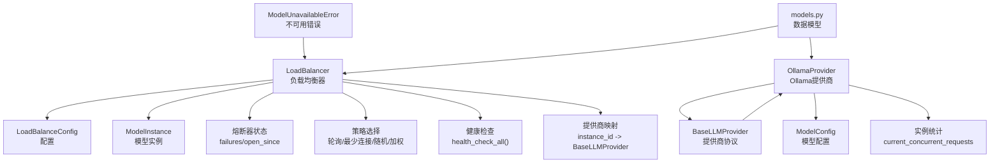
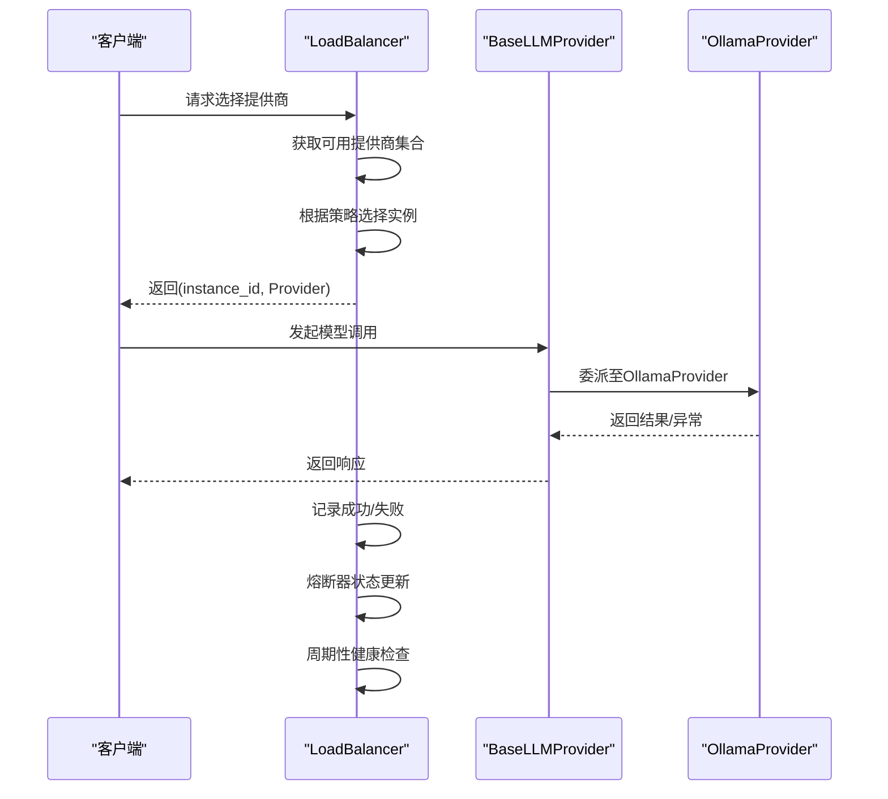
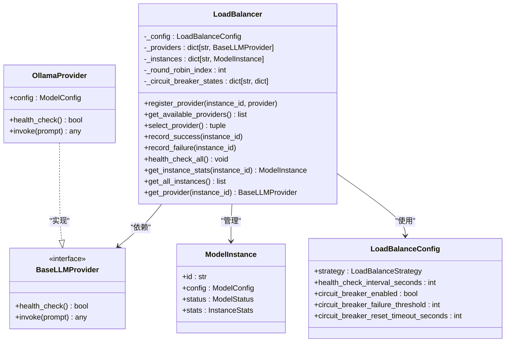
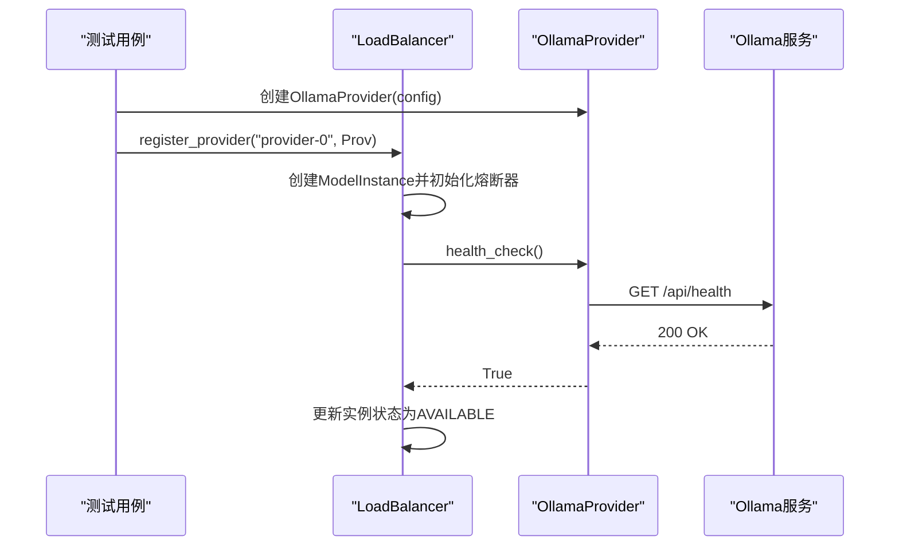
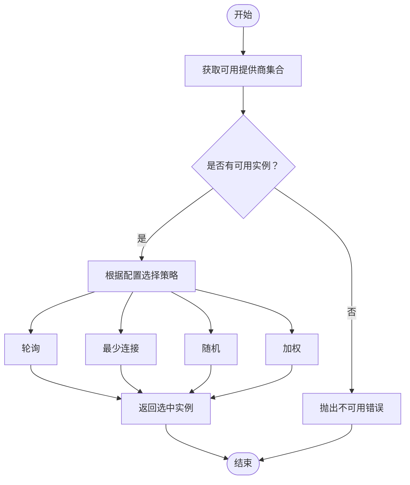
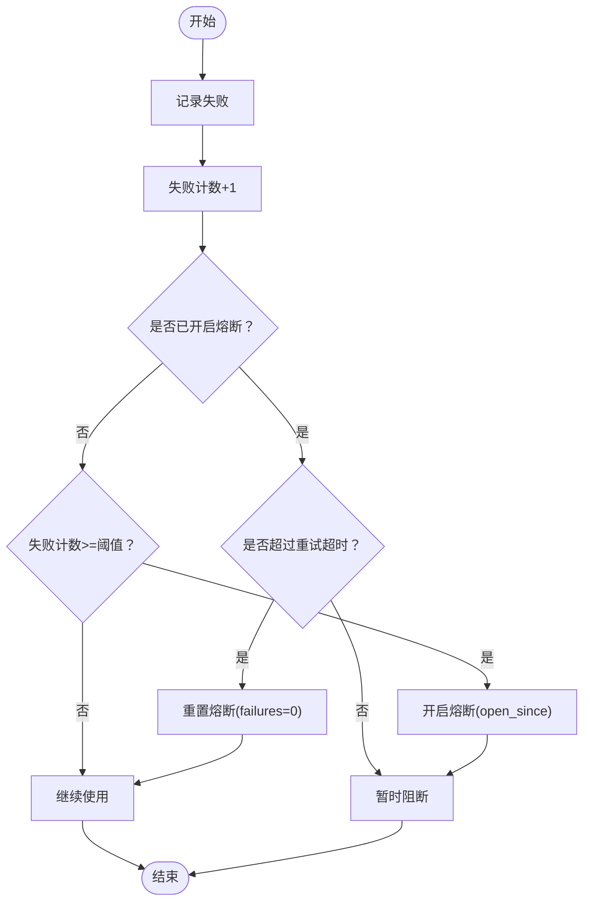
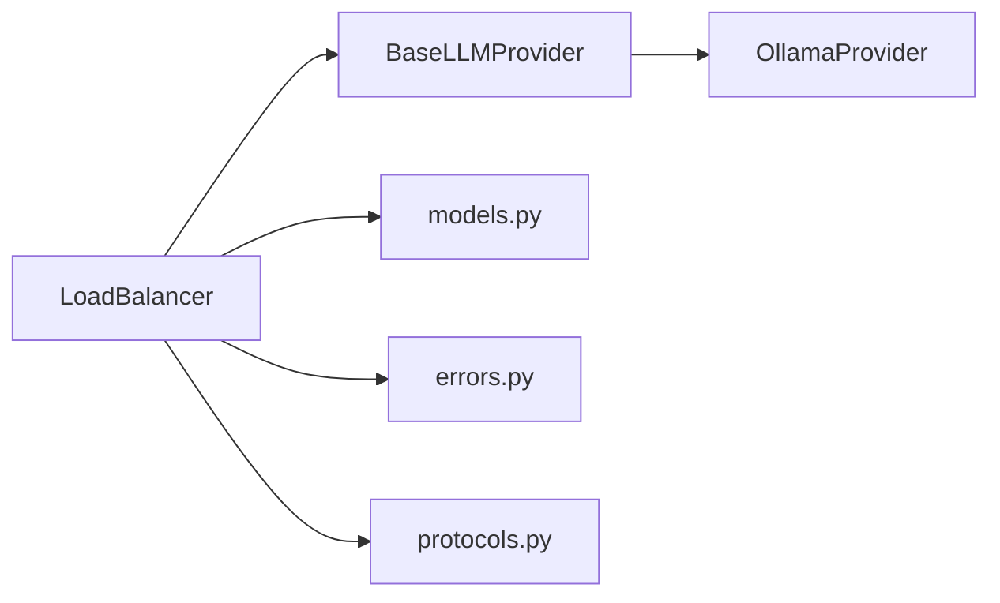

# LLM负载均衡与调度

<cite>
**本文档引用的文件**
- [load_balancer.py](file://tools/flexloop/src/taolib/testing/multi_agent/llm/load_balancer.py)
- [test_load_balancer.py](file://tools/flexloop/tests/testing/test_multi_agent/test_load_balancer.py)
- [ollama_provider.py](file://tools/flexloop/src/taolib/testing/multi_agent/llm/ollama_provider.py)
- [models.py](file://tools/flexloop/src/taolib/testing/multi_agent/models.py)
- [errors.py](file://tools/flexloop/src/taolib/testing/multi_agent/errors.py)
- [protocols.py](file://tools/flexloop/src/taolib/testing/multi_agent/llm/protocols.py)
</cite>

## 目录
1. [简介](#简介)
2. [项目结构](#项目结构)
3. [核心组件](#核心组件)
4. [架构总览](#架构总览)
5. [详细组件分析](#详细组件分析)
6. [依赖关系分析](#依赖关系分析)
7. [性能考虑](#性能考虑)
8. [故障排除指南](#故障排除指南)
9. [结论](#结论)
10. [附录](#附录)

## 简介
本项目为多智能体系统中的大型语言模型（LLM）负载均衡与调度系统，提供统一的模型提供商管理、实例注册、负载均衡策略选择、熔断与健康检查、统计与可观测性等能力。系统以可插拔的提供商协议为基础，支持多种模型提供商（如Ollama），并通过多种负载均衡策略（轮询、最少连接、随机、加权）实现流量分发与容错。

## 项目结构
系统主要位于工具包 `tools/flexloop` 中，核心逻辑集中在多智能体LLM模块，包括：
- 负载均衡器：负责提供商选择、熔断控制、健康检查与统计查询
- 模型提供商：抽象协议与具体实现（如Ollama）
- 数据模型：负载均衡配置、模型实例、状态枚举等
- 错误定义：统一异常类型
- 测试：覆盖负载均衡策略、熔断器行为、模型管理等场景

**图表来源**
- [load_balancer.py:21-246](file://tools/flexloop/src/taolib/testing/multi_agent/llm/load_balancer.py#L21-L246)
- [ollama_provider.py](file://tools/flexloop/src/taolib/testing/multi_agent/llm/ollama_provider.py)
- [models.py](file://tools/flexloop/src/taolib/testing/multi_agent/models.py)
- [errors.py](file://tools/flexloop/src/taolib/testing/multi_agent/errors.py)
- [protocols.py](file://tools/flexloop/src/taolib/testing/multi_agent/llm/protocols.py)

**章节来源**
- [load_balancer.py:1-246](file://tools/flexloop/src/taolib/testing/multi_agent/llm/load_balancer.py#L1-L246)
- [test_load_balancer.py:1-233](file://tools/flexloop/tests/testing/test_multi_agent/test_load_balancer.py#L1-L233)

## 核心组件
- 负载均衡器（LoadBalancer）
  - 提供提供商注册、可用性筛选、策略选择、熔断控制、健康检查与统计查询
  - 支持轮询、最少连接、随机、加权四种策略，默认回退到轮询
- 模型提供商（BaseLLMProvider/OllamaProvider）
  - 抽象协议定义统一接口，OllamaProvider实现本地或远程Ollama服务对接
- 数据模型（LoadBalanceConfig/ModelInstance/ModelStatus等）
  - 定义配置项、实例状态、权重与并发统计等
- 错误处理（ModelUnavailableError）
  - 统一在无可用提供商时抛出的异常类型

**章节来源**
- [load_balancer.py:21-246](file://tools/flexloop/src/taolib/testing/multi_agent/llm/load_balancer.py#L21-L246)
- [models.py](file://tools/flexloop/src/taolib/testing/multi_agent/models.py)
- [errors.py](file://tools/flexloop/src/taolib/testing/multi_agent/errors.py)

## 架构总览
系统采用“配置驱动 + 策略选择 + 熔断与健康检查”的架构模式：
- 配置层：LoadBalanceConfig定义策略、健康检查间隔、熔断阈值与超时
- 选择层：根据策略从可用提供商集合中选择实例
- 控制层：熔断器在连续失败后临时隔离实例，超时后自动恢复
- 观测层：实例统计（并发请求数、总请求数等）用于策略决策与运维监控

**图表来源**
- [load_balancer.py:155-216](file://tools/flexloop/src/taolib/testing/multi_agent/llm/load_balancer.py#L155-L216)
- [ollama_provider.py](file://tools/flexloop/src/taolib/testing/multi_agent/llm/ollama_provider.py)

## 详细组件分析

### 负载均衡器（LoadBalancer）
- 注册与实例管理
  - register_provider：注册提供商并创建对应ModelInstance，初始化熔断器状态
  - get_all_instances/get_instance_stats/get_provider：查询实例信息与提供商
- 可用性筛选
  - get_available_providers：过滤熔断中的实例，支持按熔断重试窗口动态恢复
- 策略选择
  - 轮询（ROUND_ROBIN）：顺序遍历可用提供商
  - 最少连接（LEAST_CONNECTIONS）：选择当前并发请求数最少的提供商
  - 随机（RANDOM）：从可用集合中随机选择
  - 加权（WEIGHTED）：基于权重进行加权随机选择；权重为非正时回退随机
- 熔断与健康检查
  - record_failure/record_success：维护失败次数与熔断开启时间
  - health_check_all：异步调用各提供商健康检查，更新实例状态
- 统计与可观测性
  - 通过ModelInstance.stats暴露并发请求数等指标，便于策略与监控

**图表来源**
- [load_balancer.py:21-246](file://tools/flexloop/src/taolib/testing/multi_agent/llm/load_balancer.py#L21-L246)
- [ollama_provider.py](file://tools/flexloop/src/taolib/testing/multi_agent/llm/ollama_provider.py)
- [models.py](file://tools/flexloop/src/taolib/testing/multi_agent/models.py)
- [protocols.py](file://tools/flexloop/src/taolib/testing/multi_agent/llm/protocols.py)

**章节来源**
- [load_balancer.py:21-246](file://tools/flexloop/src/taolib/testing/multi_agent/llm/load_balancer.py#L21-L246)

### 模型提供商与Ollama集成
- 协议层（BaseLLMProvider）
  - 定义health_check与invoke等统一接口，确保不同提供商可互换
- OllamaProvider
  - 读取ModelConfig中的提供商类型、模型名称与基础URL
  - 实现health_check与invoke，向Ollama服务发起请求
- 使用方式
  - 在测试中通过OllamaProvider(config)创建实例，再注册到LoadBalancer

**图表来源**
- [test_load_balancer.py:51-70](file://tools/flexloop/tests/testing/test_multi_agent/test_load_balancer.py#L51-L70)
- [load_balancer.py:206-216](file://tools/flexloop/src/taolib/testing/multi_agent/llm/load_balancer.py#L206-L216)
- [ollama_provider.py](file://tools/flexloop/src/taolib/testing/multi_agent/llm/ollama_provider.py)

**章节来源**
- [test_load_balancer.py:51-70](file://tools/flexloop/tests/testing/test_multi_agent/test_load_balancer.py#L51-L70)
- [ollama_provider.py](file://tools/flexloop/src/taolib/testing/multi_agent/llm/ollama_provider.py)

### 负载均衡策略流程
- 轮询：基于内部索引顺序选择，适合均等分发
- 最少连接：优先选择当前并发较低的实例，提升吞吐
- 随机：简单易实现，适合无状态场景
- 加权：根据权重比例分配流量，权重来源于ModelConfig

**图表来源**
- [load_balancer.py:155-180](file://tools/flexloop/src/taolib/testing/multi_agent/llm/load_balancer.py#L155-L180)

**章节来源**
- [load_balancer.py:155-180](file://tools/flexloop/src/taolib/testing/multi_agent/llm/load_balancer.py#L155-L180)

### 熔断器与健康检查
- 熔断触发条件：失败次数达到阈值即开启熔断，记录open_since
- 自动恢复：超过重试超时后清空失败计数并允许再次选择
- 健康检查：周期性调用提供商health_check，更新实例状态

**图表来源**
- [load_balancer.py:191-205](file://tools/flexloop/src/taolib/testing/multi_agent/llm/load_balancer.py#L191-L205)

**章节来源**
- [load_balancer.py:191-205](file://tools/flexloop/src/taolib/testing/multi_agent/llm/load_balancer.py#L191-L205)

## 依赖关系分析
- 组件耦合
  - LoadBalancer依赖BaseLLMProvider协议，通过实例ID管理多个提供商
  - OllamaProvider实现BaseLLMProvider，持有ModelConfig
  - 模型状态与统计由ModelInstance承载，供策略与观测使用
- 外部依赖
  - 异步健康检查依赖提供商实现的health_check
  - 时间计算依赖UTC与时钟，熔断重试窗口基于秒级阈值

**图表来源**
- [load_balancer.py:11-18](file://tools/flexloop/src/taolib/testing/multi_agent/llm/load_balancer.py#L11-L18)
- [models.py](file://tools/flexloop/src/taolib/testing/multi_agent/models.py)
- [errors.py](file://tools/flexloop/src/taolib/testing/multi_agent/errors.py)
- [protocols.py](file://tools/flexloop/src/taolib/testing/multi_agent/llm/protocols.py)

**章节来源**
- [load_balancer.py:11-18](file://tools/flexloop/src/taolib/testing/multi_agent/llm/load_balancer.py#L11-L18)

## 性能考虑
- 策略选择复杂度
  - 轮询与随机为O(n)遍历可用集合
  - 最少连接需遍历并比较并发数，适合并发统计准确的场景
  - 加权随机构建累计权重，期望O(n)，n为可用实例数
- 熔断与健康检查
  - 建议合理设置熔断阈值与重试超时，避免频繁抖动
  - 健康检查间隔应平衡实时性与开销
- 并发与统计
  - 利用ModelInstance.stats的并发指标指导最少连接策略
  - 对高并发场景建议结合最少连接或加权策略

[本节为通用性能建议，不直接分析特定文件]

## 故障排除指南
- 无可用提供商
  - 现象：选择策略抛出不可用错误
  - 排查：确认提供商已注册、健康检查通过、熔断未开启
  - 参考路径：[load_balancer.py:86-87](file://tools/flexloop/src/taolib/testing/multi_agent/llm/load_balancer.py#L86-L87)
- 熔断导致流量全部失败
  - 现象：可用提供商数量减少或为0
  - 排查：检查失败计数与熔断重试超时，等待自动恢复或手动重置
  - 参考路径：[load_balancer.py:191-205](file://tools/flexloop/src/taolib/testing/multi_agent/llm/load_balancer.py#L191-L205)
- 健康检查异常
  - 现象：实例状态持续不可用
  - 排查：检查Ollama服务可达性、端口与网络策略
  - 参考路径：[load_balancer.py:206-216](file://tools/flexloop/src/taolib/testing/multi_agent/llm/load_balancer.py#L206-L216)
- 权重无效导致随机行为
  - 现象：加权策略表现如同随机
  - 排查：确认权重为正数且总和大于0
  - 参考路径：[load_balancer.py:142-144](file://tools/flexloop/src/taolib/testing/multi_agent/llm/load_balancer.py#L142-L144)

**章节来源**
- [load_balancer.py:86-87](file://tools/flexloop/src/taolib/testing/multi_agent/llm/load_balancer.py#L86-L87)
- [load_balancer.py:191-205](file://tools/flexloop/src/taolib/testing/multi_agent/llm/load_balancer.py#L191-L205)
- [load_balancer.py:206-216](file://tools/flexloop/src/taolib/testing/multi_agent/llm/load_balancer.py#L206-L216)
- [load_balancer.py:142-144](file://tools/flexloop/src/taolib/testing/multi_agent/llm/load_balancer.py#L142-L144)

## 结论
本系统通过可插拔的提供商协议与灵活的负载均衡策略，实现了对多智能体场景下LLM资源的统一管理与调度。结合熔断与健康检查机制，系统具备良好的容错与自愈能力；通过实例统计与配置参数，可进一步优化策略与性能。建议在生产环境中根据实际并发与延迟特征调整策略与阈值，并完善监控与告警体系。

[本节为总结性内容，不直接分析特定文件]

## 附录

### 配置示例与使用指南
- 添加新的模型提供商
  - 实现BaseLLMProvider接口，提供health_check与invoke
  - 通过ModelConfig配置提供商类型、模型名与基础URL
  - 使用register_provider注册到LoadBalancer
  - 参考路径：[protocols.py](file://tools/flexloop/src/taolib/testing/multi_agent/llm/protocols.py)、[models.py](file://tools/flexloop/src/taolib/testing/multi_agent/models.py)、[load_balancer.py:36-48](file://tools/flexloop/src/taolib/testing/multi_agent/llm/load_balancer.py#L36-L48)
- 调整负载均衡策略
  - 修改LoadBalanceConfig.strategy，支持轮询、最少连接、随机、加权
  - 参考路径：[test_load_balancer.py:25-29](file://tools/flexloop/tests/testing/test_multi_agent/test_load_balancer.py#L25-L29)、[load_balancer.py:169-180](file://tools/flexloop/src/taolib/testing/multi_agent/llm/load_balancer.py#L169-L180)
- 监控模型性能
  - 通过get_all_instances与get_instance_stats获取并发与总数统计
  - 参考路径：[load_balancer.py:228-234](file://tools/flexloop/src/taolib/testing/multi_agent/llm/load_balancer.py#L228-L234)
- 故障转移机制
  - 熔断器在失败阈值触发后阻断实例，超时后自动恢复
  - 参考路径：[load_balancer.py:191-205](file://tools/flexloop/src/taolib/testing/multi_agent/llm/load_balancer.py#L191-L205)

**章节来源**
- [protocols.py](file://tools/flexloop/src/taolib/testing/multi_agent/llm/protocols.py)
- [models.py](file://tools/flexloop/src/taolib/testing/multi_agent/models.py)
- [load_balancer.py:36-48](file://tools/flexloop/src/taolib/testing/multi_agent/llm/load_balancer.py#L36-L48)
- [test_load_balancer.py:25-29](file://tools/flexloop/tests/testing/test_multi_agent/test_load_balancer.py#L25-L29)
- [load_balancer.py:191-205](file://tools/flexloop/src/taolib/testing/multi_agent/llm/load_balancer.py#L191-L205)