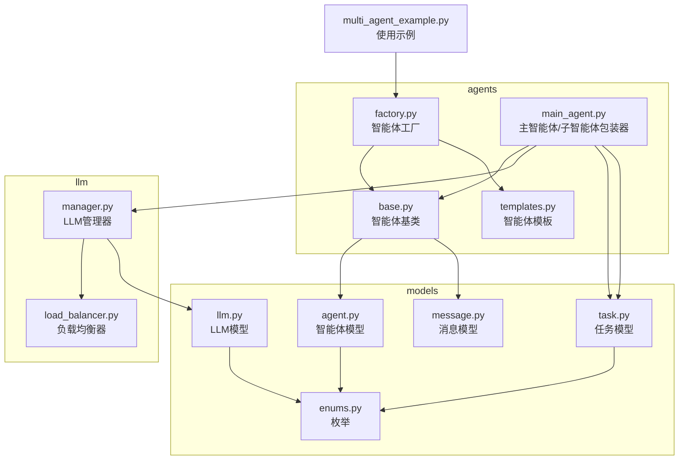
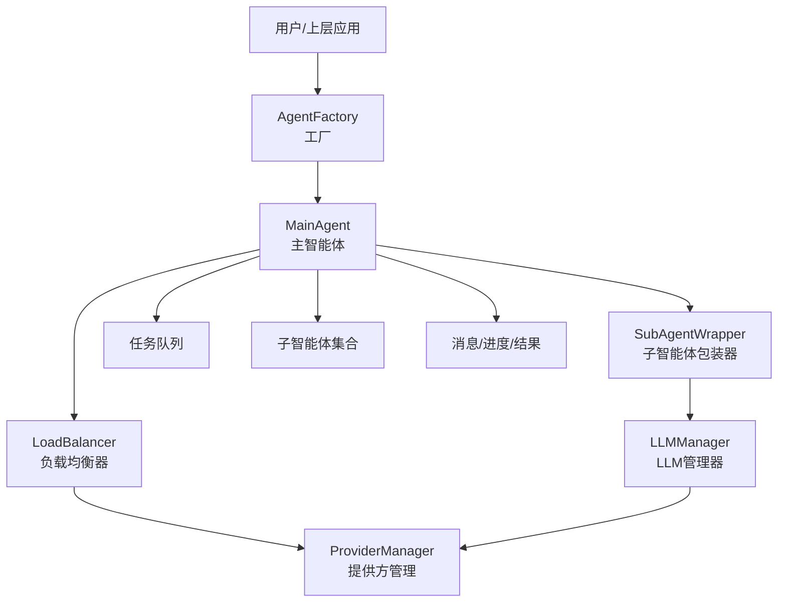
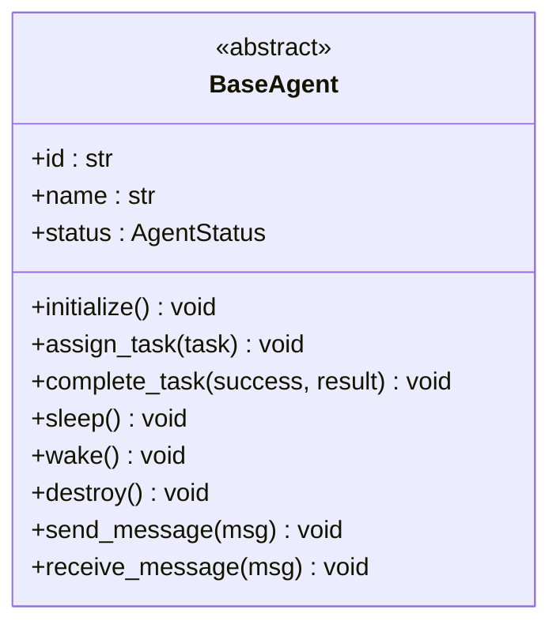
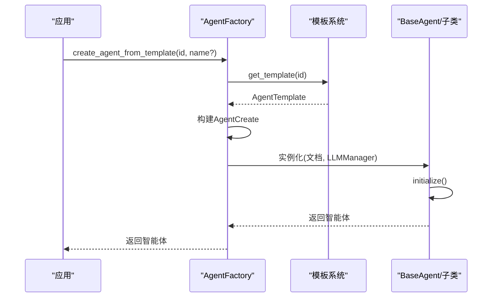
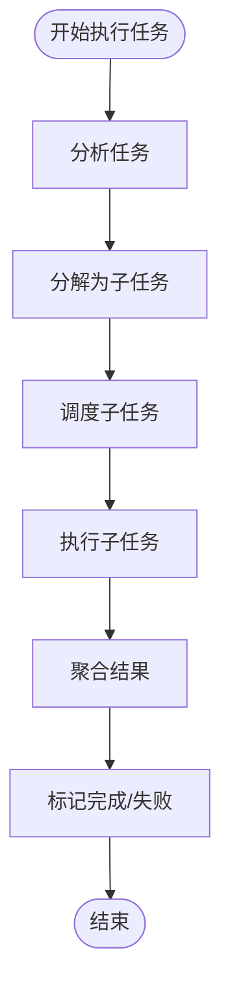
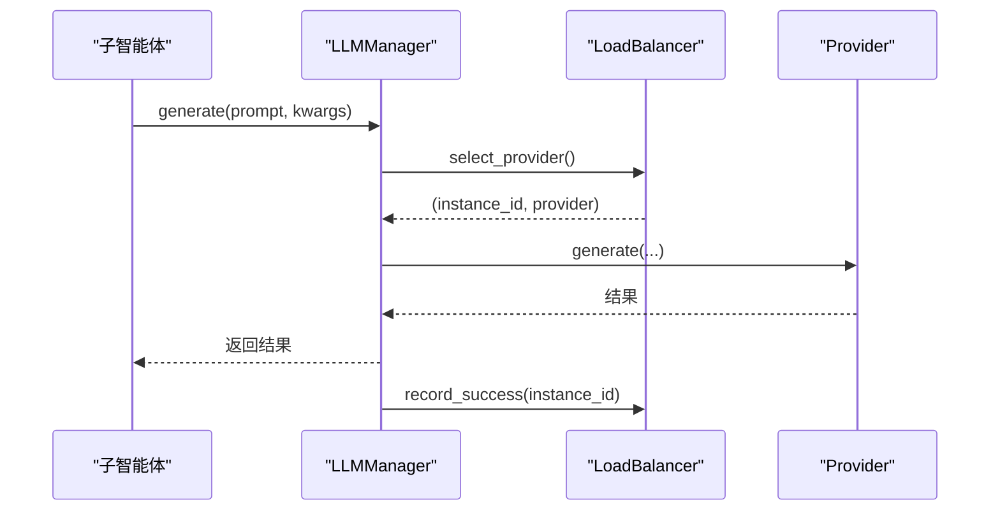
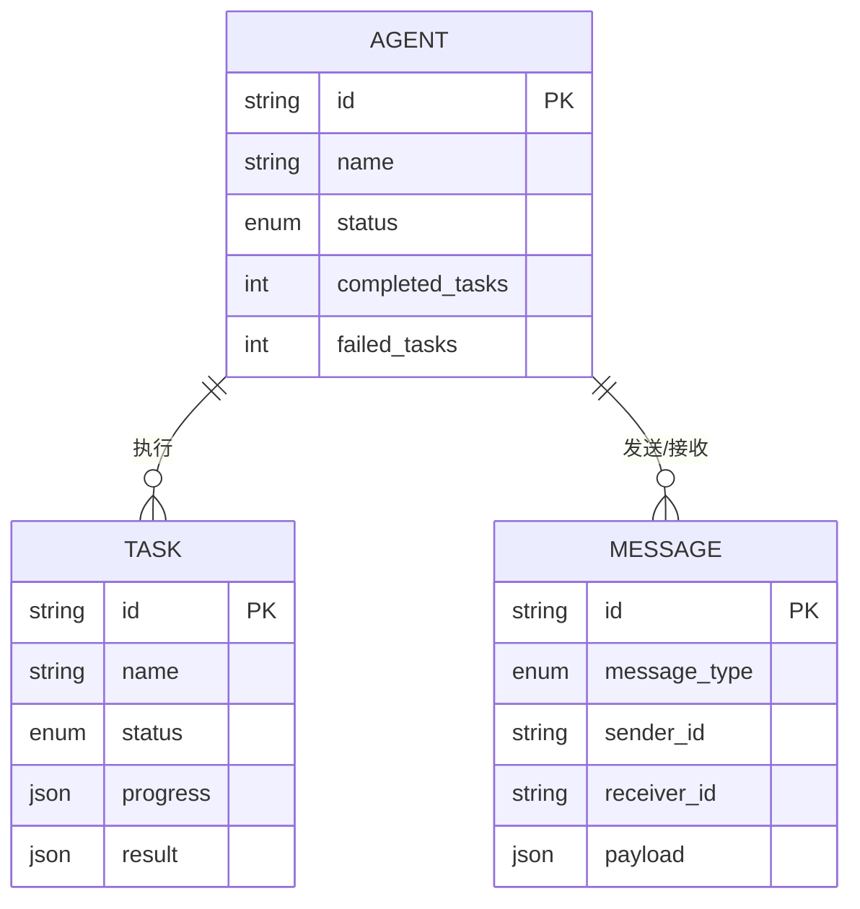
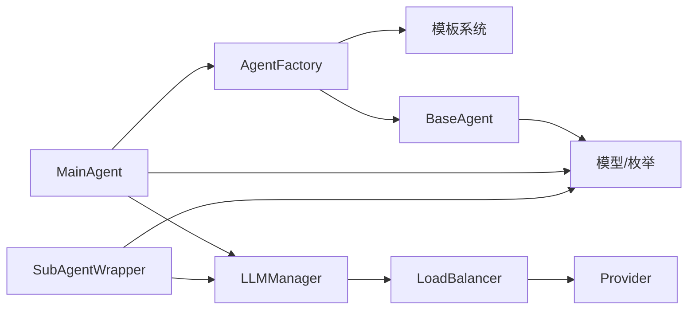

# 多智能体架构设计

<cite>
**本文引用的文件**
- [multi_agent_example.py](file://tools/flexloop/examples/multi_agent_example.py)
- [factory.py](file://tools/flexloop/src/taolib/testing/multi_agent/agents/factory.py)
- [main_agent.py](file://tools/flexloop/src/taolib/testing/multi_agent/agents/main_agent.py)
- [templates.py](file://tools/flexloop/src/taolib/testing/multi_agent/agents/templates.py)
- [base.py](file://tools/flexloop/src/taolib/testing/multi_agent/agents/base.py)
- [manager.py](file://tools/flexloop/src/taolib/testing/multi_agent/llm/manager.py)
- [load_balancer.py](file://tools/flexloop/src/taolib/testing/multi_agent/llm/load_balancer.py)
- [agent.py](file://tools/flexloop/src/taolib/testing/multi_agent/models/agent.py)
- [llm.py](file://tools/flexloop/src/taolib/testing/multi_agent/models/llm.py)
- [enums.py](file://tools/flexloop/src/taolib/testing/multi_agent/models/enums.py)
- [task.py](file://tools/flexloop/src/taolib/testing/multi_agent/models/task.py)
- [message.py](file://tools/flexloop/src/taolib/testing/multi_agent/models/message.py)
</cite>

## 目录
1. [简介](#简介)
2. [项目结构](#项目结构)
3. [核心组件](#核心组件)
4. [架构总览](#架构总览)
5. [详细组件分析](#详细组件分析)
6. [依赖关系分析](#依赖关系分析)
7. [性能考量](#性能考量)
8. [故障排查指南](#故障排查指南)
9. [结论](#结论)
10. [附录](#附录)

## 简介
本文件面向FlexLoop多智能体系统，系统性阐述其整体架构设计理念与实现细节，重点覆盖：
- 智能体工厂模式：统一创建入口、模板注册与实例化流程
- 主智能体协调机制：任务分析、子任务分解、子智能体调度与结果聚合
- 智能体模板系统：预设模板、能力配置、系统提示词与温度参数
- 生命周期管理：初始化、运行、休眠/唤醒、销毁与状态流转
- 通信协议与状态同步：消息模型、任务进度与结果传播
- 任务分发策略：简单轮询与未来可扩展的负载均衡
- 扩展性与性能优化：模块化设计、可插拔LLM提供方、熔断与重试

## 项目结构
FlexLoop多智能体系统位于tools/flexloop目录下，采用“按功能域分层”的组织方式：
- agents：智能体基类、工厂、主智能体与模板
- llm：LLM管理器、负载均衡器与提供方注册
- models：Pydantic四层模型（Base/Create/Response/Document）与枚举
- examples：使用示例脚本

**图示来源**
- [factory.py:27-220](file://tools/flexloop/src/taolib/testing/multi_agent/agents/factory.py#L27-L220)
- [main_agent.py:104-472](file://tools/flexloop/src/taolib/testing/multi_agent/agents/main_agent.py#L104-L472)
- [templates.py:1-309](file://tools/flexloop/src/taolib/testing/multi_agent/agents/templates.py#L1-L309)
- [base.py:21-204](file://tools/flexloop/src/taolib/testing/multi_agent/agents/base.py#L21-L204)
- [manager.py:22-229](file://tools/flexloop/src/taolib/testing/multi_agent/llm/manager.py#L22-L229)
- [load_balancer.py:21-246](file://tools/flexloop/src/taolib/testing/multi_agent/llm/load_balancer.py#L21-L246)
- [agent.py:15-129](file://tools/flexloop/src/taolib/testing/multi_agent/models/agent.py#L15-L129)
- [task.py:15-143](file://tools/flexloop/src/taolib/testing/multi_agent/models/task.py#L15-L143)
- [llm.py:14-68](file://tools/flexloop/src/taolib/testing/multi_agent/models/llm.py#L14-L68)
- [enums.py:9-96](file://tools/flexloop/src/taolib/testing/multi_agent/models/enums.py#L9-L96)
- [message.py:14-36](file://tools/flexloop/src/taolib/testing/multi_agent/models/message.py#L14-L36)
- [multi_agent_example.py:14-196](file://tools/flexloop/examples/multi_agent_example.py#L14-L196)

**章节来源**
- [multi_agent_example.py:14-196](file://tools/flexloop/examples/multi_agent_example.py#L14-L196)
- [factory.py:27-220](file://tools/flexloop/src/taolib/testing/multi_agent/agents/factory.py#L27-L220)
- [main_agent.py:104-472](file://tools/flexloop/src/taolib/testing/multi_agent/agents/main_agent.py#L104-L472)
- [templates.py:1-309](file://tools/flexloop/src/taolib/testing/multi_agent/agents/templates.py#L1-L309)
- [base.py:21-204](file://tools/flexloop/src/taolib/testing/multi_agent/agents/base.py#L21-L204)
- [manager.py:22-229](file://tools/flexloop/src/taolib/testing/multi_agent/llm/manager.py#L22-L229)
- [load_balancer.py:21-246](file://tools/flexloop/src/taolib/testing/multi_agent/llm/load_balancer.py#L21-L246)
- [agent.py:15-129](file://tools/flexloop/src/taolib/testing/multi_agent/models/agent.py#L15-L129)
- [task.py:15-143](file://tools/flexloop/src/taolib/testing/multi_agent/models/task.py#L15-L143)
- [llm.py:14-68](file://tools/flexloop/src/taolib/testing/multi_agent/models/llm.py#L14-L68)
- [enums.py:9-96](file://tools/flexloop/src/taolib/testing/multi_agent/models/enums.py#L9-L96)
- [message.py:14-36](file://tools/flexloop/src/taolib/testing/multi_agent/models/message.py#L14-L36)

## 核心组件
- 智能体基类：定义统一接口与生命周期方法（初始化、任务分配/完成、休眠/唤醒、销毁）
- 智能体工厂：集中创建逻辑，支持模板注册与按类型映射
- 主智能体：负责任务分析、分解、子任务调度、结果聚合与主循环
- 子智能体包装器：封装具体执行逻辑，对接LLM管理器
- 模板系统：预设模板，包含能力、配置与标签
- LLM管理器与负载均衡器：统一接入不同模型提供方，支持轮询/最少连接/随机/加权等策略
- 数据模型：四层模型（Base/Create/Response/Document）与枚举，涵盖智能体、任务、LLM与消息

**章节来源**
- [base.py:21-204](file://tools/flexloop/src/taolib/testing/multi_agent/agents/base.py#L21-L204)
- [factory.py:27-220](file://tools/flexloop/src/taolib/testing/multi_agent/agents/factory.py#L27-L220)
- [main_agent.py:104-472](file://tools/flexloop/src/taolib/testing/multi_agent/agents/main_agent.py#L104-L472)
- [templates.py:1-309](file://tools/flexloop/src/taolib/testing/multi_agent/agents/templates.py#L1-L309)
- [manager.py:22-229](file://tools/flexloop/src/taolib/testing/multi_agent/llm/manager.py#L22-L229)
- [load_balancer.py:21-246](file://tools/flexloop/src/taolib/testing/multi_agent/llm/load_balancer.py#L21-L246)
- [agent.py:15-129](file://tools/flexloop/src/taolib/testing/multi_agent/models/agent.py#L15-L129)
- [task.py:15-143](file://tools/flexloop/src/taolib/testing/multi_agent/models/task.py#L15-L143)
- [llm.py:14-68](file://tools/flexloop/src/taolib/testing/multi_agent/models/llm.py#L14-L68)
- [enums.py:9-96](file://tools/flexloop/src/taolib/testing/multi_agent/models/enums.py#L9-L96)
- [message.py:14-36](file://tools/flexloop/src/taolib/testing/multi_agent/models/message.py#L14-L36)

## 架构总览
系统采用“主-子”两级智能体架构：
- 主智能体负责任务全生命周期编排与协调
- 子智能体专注于具体任务执行，通过LLM管理器进行推理
- 模板系统提供标准化配置与能力集合
- LLM管理器抽象底层模型提供方差异，负载均衡器实现多实例调度

**图示来源**
- [factory.py:27-220](file://tools/flexloop/src/taolib/testing/multi_agent/agents/factory.py#L27-L220)
- [main_agent.py:104-472](file://tools/flexloop/src/taolib/testing/multi_agent/agents/main_agent.py#L104-L472)
- [load_balancer.py:21-246](file://tools/flexloop/src/taolib/testing/multi_agent/llm/load_balancer.py#L21-L246)
- [manager.py:22-229](file://tools/flexloop/src/taolib/testing/multi_agent/llm/manager.py#L22-L229)

## 详细组件分析

### 智能体基类设计
- 统一接口：initialize、assign_task、complete_task、sleep、wake、destroy、send/receive消息
- 状态机：CREATED → IDLE → BUSY → IDLE/ERROR/DESTROYED
- 任务追踪：current_task、completed_tasks、failed_tasks、last_active_at
- 回调钩子：便于子类在关键节点插入行为（如消息发送后、任务分配后、任务完成后、销毁前）

**图示来源**
- [base.py:21-204](file://tools/flexloop/src/taolib/testing/multi_agent/agents/base.py#L21-L204)
- [enums.py:9-18](file://tools/flexloop/src/taolib/testing/multi_agent/models/enums.py#L9-L18)

**章节来源**
- [base.py:21-204](file://tools/flexloop/src/taolib/testing/multi_agent/agents/base.py#L21-L204)
- [enums.py:9-18](file://tools/flexloop/src/taolib/testing/multi_agent/models/enums.py#L9-L18)

### 智能体工厂模式
- 职责：集中创建智能体、注册模板、按类型映射到具体类
- 类型映射：MAIN → MainAgent；SUB → SubAgentWrapper
- 模板注册：内置模板加载，支持动态注册
- 创建流程：生成ID、构建AgentDocument、选择类、初始化并返回

**图示来源**
- [factory.py:120-194](file://tools/flexloop/src/taolib/testing/multi_agent/agents/factory.py#L120-L194)
- [templates.py:264-295](file://tools/flexloop/src/taolib/testing/multi_agent/agents/templates.py#L264-L295)

**章节来源**
- [factory.py:27-220](file://tools/flexloop/src/taolib/testing/multi_agent/agents/factory.py#L27-L220)
- [templates.py:1-309](file://tools/flexloop/src/taolib/testing/multi_agent/agents/templates.py#L1-L309)

### 主智能体协调机制
- 初始化：创建默认子智能体、启动主循环
- 主循环：处理任务队列、检查已完成任务、周期性休眠
- 任务执行：分析任务 → 分解子任务 → 调度执行 → 聚合结果 → 完成任务
- 调度策略：当前为“首个空闲智能体”，具备扩展空间
- 错误处理：捕获异常、标记失败、记录日志

**图示来源**
- [main_agent.py:211-282](file://tools/flexloop/src/taolib/testing/multi_agent/agents/main_agent.py#L211-L282)
- [main_agent.py:355-405](file://tools/flexloop/src/taolib/testing/multi_agent/agents/main_agent.py#L355-L405)

**章节来源**
- [main_agent.py:104-472](file://tools/flexloop/src/taolib/testing/multi_agent/agents/main_agent.py#L104-L472)

### 子智能体包装器
- 作用：封装具体执行逻辑，对接LLM管理器
- 执行流程：设置任务状态、调用LLM生成、回传结果、完成任务
- 异常处理：模型不可用、其他异常分别处理并标记失败

**章节来源**
- [main_agent.py:35-102](file://tools/flexloop/src/taolib/testing/multi_agent/agents/main_agent.py#L35-L102)

### 智能体模板系统
- 预设模板：代码助手、写作助手、数据分析、研究助手、通用助手
- 模板字段：id/name/description/agent_type/capabilities/config/skills/tags
- 配置项：max_concurrent_tasks、timeout_seconds、system_prompt、temperature
- 使用场景：快速创建专用子智能体或主智能体

**章节来源**
- [templates.py:1-309](file://tools/flexloop/src/taolib/testing/multi_agent/agents/templates.py#L1-L309)
- [agent.py:34-44](file://tools/flexloop/src/taolib/testing/multi_agent/models/agent.py#L34-L44)

### LLM管理器与负载均衡器
- LLMManager：统一生成接口（同步/流式）、健康检查、统计查询、实例管理
- LoadBalancer：轮询/最少连接/随机/加权策略；熔断器（失败阈值与重置超时）
- Provider注册：通过ModelRegistry创建具体提供方实例并登记

**图示来源**
- [manager.py:57-107](file://tools/flexloop/src/taolib/testing/multi_agent/llm/manager.py#L57-L107)
- [load_balancer.py:155-181](file://tools/flexloop/src/taolib/testing/multi_agent/llm/load_balancer.py#L155-L181)

**章节来源**
- [manager.py:22-229](file://tools/flexloop/src/taolib/testing/multi_agent/llm/manager.py#L22-L229)
- [load_balancer.py:21-246](file://tools/flexloop/src/taolib/testing/multi_agent/llm/load_balancer.py#L21-L246)

### 数据模型与通信协议
- 智能体模型：能力、配置、模板、响应/文档四层
- 任务模型：约束、进度、结果、子任务、响应/文档四层
- 消息模型：消息类型、载荷、优先级、响应链路
- 枚举：AgentStatus/AgentType/TaskStatus/MessageType/ModelProvider/LoadBalanceStrategy

**图示来源**
- [agent.py:95-129](file://tools/flexloop/src/taolib/testing/multi_agent/models/agent.py#L95-L129)
- [task.py:110-143](file://tools/flexloop/src/taolib/testing/multi_agent/models/task.py#L110-L143)
- [message.py:24-36](file://tools/flexloop/src/taolib/testing/multi_agent/models/message.py#L24-L36)
- [enums.py:9-96](file://tools/flexloop/src/taolib/testing/multi_agent/models/enums.py#L9-L96)

**章节来源**
- [agent.py:15-129](file://tools/flexloop/src/taolib/testing/multi_agent/models/agent.py#L15-L129)
- [task.py:15-143](file://tools/flexloop/src/taolib/testing/multi_agent/models/task.py#L15-L143)
- [message.py:14-36](file://tools/flexloop/src/taolib/testing/multi_agent/models/message.py#L14-L36)
- [enums.py:9-96](file://tools/flexloop/src/taolib/testing/multi_agent/models/enums.py#L9-L96)

## 依赖关系分析
- 组件耦合
  - MainAgent依赖AgentFactory、LLMManager、模板系统与任务模型
  - SubAgentWrapper依赖LLMManager与任务模型
  - LLMManager依赖LoadBalancer与ProviderRegistry
  - 所有模型共享枚举定义
- 外部集成点
  - LLM提供方抽象（Ollama/HuggingFace/Gemini），通过注册表创建实例
- 循环依赖
  - 未见直接循环依赖；工厂与模板相互配合，但无反向依赖

**图示来源**
- [factory.py:27-220](file://tools/flexloop/src/taolib/testing/multi_agent/agents/factory.py#L27-L220)
- [main_agent.py:104-472](file://tools/flexloop/src/taolib/testing/multi_agent/agents/main_agent.py#L104-L472)
- [templates.py:1-309](file://tools/flexloop/src/taolib/testing/multi_agent/agents/templates.py#L1-L309)
- [manager.py:22-229](file://tools/flexloop/src/taolib/testing/multi_agent/llm/manager.py#L22-L229)
- [load_balancer.py:21-246](file://tools/flexloop/src/taolib/testing/multi_agent/llm/load_balancer.py#L21-L246)
- [agent.py:15-129](file://tools/flexloop/src/taolib/testing/multi_agent/models/agent.py#L15-L129)
- [task.py:15-143](file://tools/flexloop/src/taolib/testing/multi_agent/models/task.py#L15-L143)

**章节来源**
- [factory.py:27-220](file://tools/flexloop/src/taolib/testing/multi_agent/agents/factory.py#L27-L220)
- [main_agent.py:104-472](file://tools/flexloop/src/taolib/testing/multi_agent/agents/main_agent.py#L104-L472)
- [templates.py:1-309](file://tools/flexloop/src/taolib/testing/multi_agent/agents/templates.py#L1-L309)
- [manager.py:22-229](file://tools/flexloop/src/taolib/testing/multi_agent/llm/manager.py#L22-L229)
- [load_balancer.py:21-246](file://tools/flexloop/src/taolib/testing/multi_agent/llm/load_balancer.py#L21-L246)
- [agent.py:15-129](file://tools/flexloop/src/taolib/testing/multi_agent/models/agent.py#L15-L129)
- [task.py:15-143](file://tools/flexloop/src/taolib/testing/multi_agent/models/task.py#L15-L143)

## 性能考量
- 并发与调度
  - 子智能体最大并发由AgentConfig控制
  - 主循环采用短睡眠避免忙等，适合事件驱动
- LLM侧
  - 负载均衡策略可选轮询/最少连接/加权，结合熔断器提升稳定性
  - 流式生成接口支持渐进式输出，改善用户体验
- 内存与状态
  - 任务队列与运行中任务字典需关注内存占用，建议结合持久化与清理策略
- 可观测性
  - 任务进度与结果结构化存储，便于审计与回放

[本节为通用指导，不直接分析具体文件]

## 故障排查指南
- 模型不可用
  - 现象：子任务执行失败，结果标记失败
  - 排查：检查LLMManager健康检查、实例ID是否存在、负载均衡器可用列表
- 任务卡死
  - 现象：任务长时间处于IN_PROGRESS
  - 排查：确认主循环是否正常运行、子智能体是否被正确调度与完成
- 模板缺失
  - 现象：创建智能体时报模板不存在
  - 排查：确认模板ID正确、工厂是否已注册模板
- 状态不一致
  - 现象：智能体状态与文档状态不一致
  - 排查：检查initialize/complete_task等关键流程是否正确更新

**章节来源**
- [main_agent.py:84-102](file://tools/flexloop/src/taolib/testing/multi_agent/agents/main_agent.py#L84-L102)
- [manager.py:159-176](file://tools/flexloop/src/taolib/testing/multi_agent/llm/manager.py#L159-L176)
- [factory.py:136-139](file://tools/flexloop/src/taolib/testing/multi_agent/agents/factory.py#L136-L139)

## 结论
FlexLoop多智能体系统通过“工厂+模板+主-子智能体”的架构实现了高内聚、低耦合的可扩展设计。智能体生命周期管理完善，任务编排清晰，LLM接入抽象良好，具备良好的扩展性与工程落地价值。后续可在调度策略、可观测性与持久化方面进一步增强。

[本节为总结性内容，不直接分析具体文件]

## 附录
- 使用示例要点
  - 技能管理器注册与执行
  - 智能体工厂创建与模板使用
  - 主智能体创建与关闭
  - LLM管理器模型注册与查询

**章节来源**
- [multi_agent_example.py:36-196](file://tools/flexloop/examples/multi_agent_example.py#L36-L196)