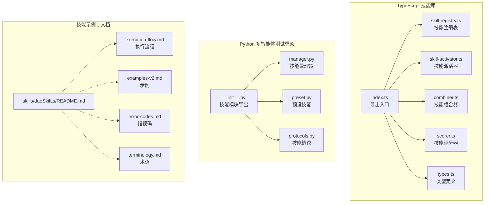
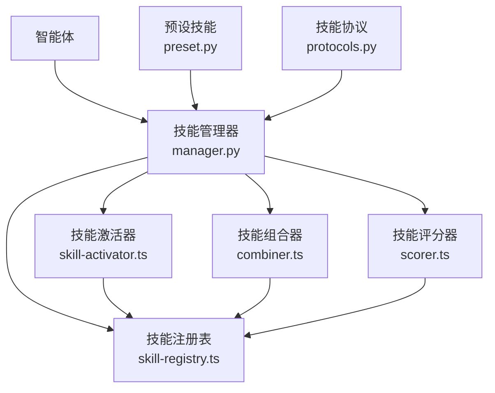
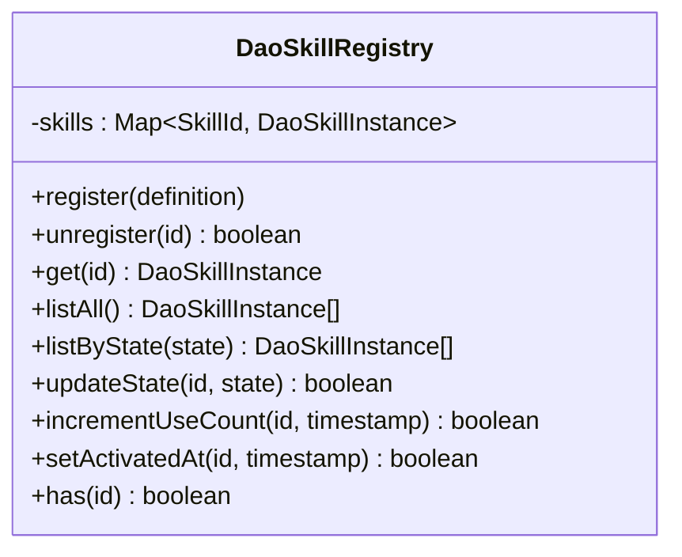
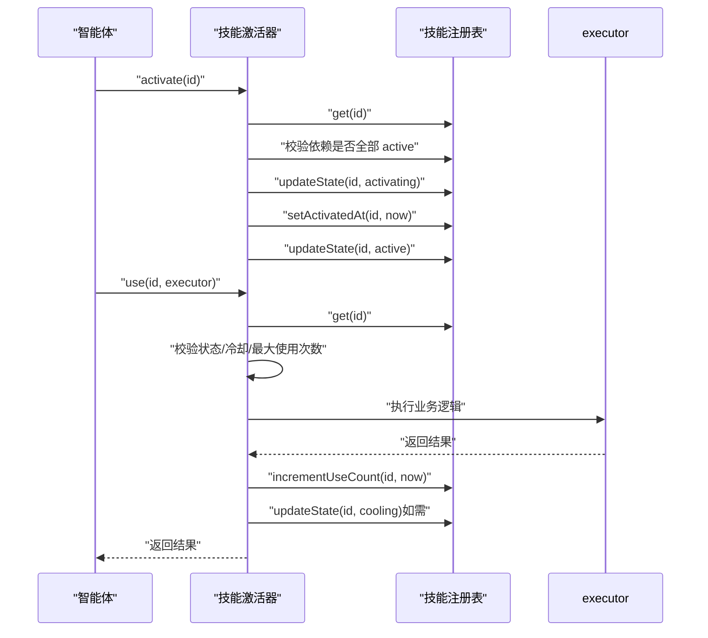
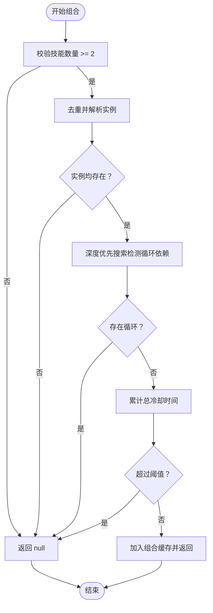
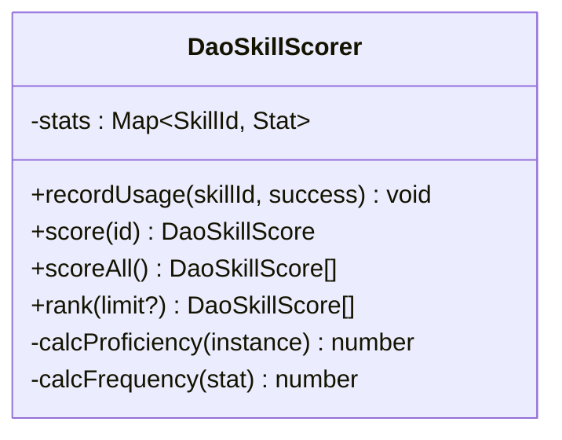
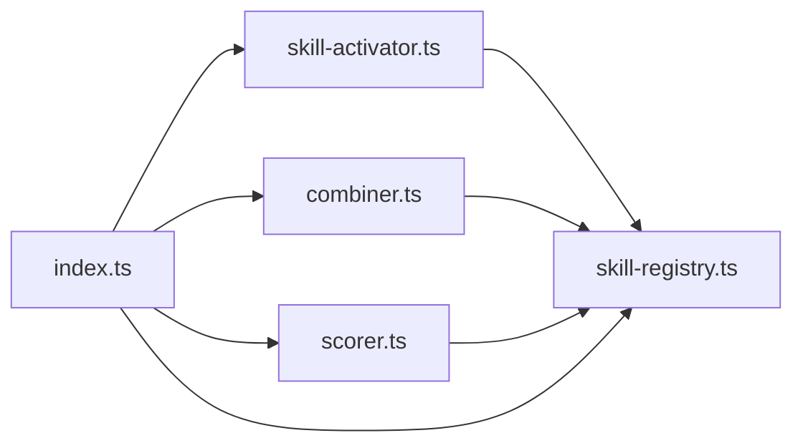

# 技能系统与扩展

<cite>
**本文引用的文件**
- [skill-registry.ts](file://apps/DaoMind/packages/daoSkilLs/src/skill-registry.ts)
- [skill-activator.ts](file://apps/DaoMind/packages/daoSkilLs/src/skill-activator.ts)
- [types.ts](file://apps/DaoMind/packages/daoSkilLs/src/types.ts)
- [index.ts](file://apps/DaoMind/packages/daoSkilLs/src/index.ts)
- [combiner.ts](file://apps/DaoMind/packages/daoSkilLs/src/combiner.ts)
- [scorer.ts](file://apps/DaoMind/packages/daoSkilLs/src/scorer.ts)
- [skill-registry.test.ts](file://apps/DaoMind/packages/daoSkilLs/src/__tests__/skill-registry.test.ts)
- [__init__.py](file://tools/flexloop/src/taolib/testing/multi_agent/skills/__init__.py)
- [manager.py](file://tools/flexloop/src/taolib/testing/multi_agent/skills/manager.py)
- [preset.py](file://tools/flexloop/src/taolib/testing/multi_agent/skills/preset.py)
- [protocols.py](file://tools/flexloop/src/taolib/testing/multi_agent/skills/protocols.py)
- [README.md](file://skills/daoSkilLs/README.md)
- [task-execution-summary/execution-flow.md](file://skills/daoSkilLs/skills/task-execution-summary/references/execution-flow.md)
- [task-execution-summary/examples-v2.md](file://skills/daoSkilLs/skills/task-execution-summary/references/examples-v2.md)
- [task-execution-summary/error-codes.md](file://skills/daoSkilLs/skills/task-execution-summary/references/error-codes.md)
- [task-execution-summary/terminology.md](file://skills/daoSkilLs/skills/task-execution-summary/references/terminology.md)
</cite>

## 目录
1. [引言](#引言)
2. [项目结构](#项目结构)
3. [核心组件](#核心组件)
4. [架构总览](#架构总览)
5. [详细组件分析](#详细组件分析)
6. [依赖分析](#依赖分析)
7. [性能考虑](#性能考虑)
8. [故障排查指南](#故障排查指南)
9. [结论](#结论)
10. [附录](#附录)

## 引言
本技术文档面向多智能体系统中的“技能系统与扩展”主题，系统性阐述技能管理的核心架构、扩展机制与工程实践。内容覆盖技能管理器工作原理、预设技能库设计、技能注册表实现、任务执行流程；同时给出技能定义规范、加载机制、调用协议、状态管理、开发指南、测试方法、性能监控、错误处理与调试技巧，并解释技能与智能体的绑定关系与执行上下文。

## 项目结构
daoSkilLs 是一个独立的 TypeScript 技能库包，位于 apps/DaoMind/packages/daoSkilLs，提供技能注册、激活、评分与组合等能力。同时，仓库内还包含一个 Python 多智能体测试框架（tools/flexloop），其中也实现了技能协议、注册表、管理器与预设技能，可作为参考扩展实现。

图表来源
- [index.ts:1-15](file://apps/DaoMind/packages/daoSkilLs/src/index.ts#L1-L15)
- [skill-registry.ts:1-73](file://apps/DaoMind/packages/daoSkilLs/src/skill-registry.ts#L1-L73)
- [skill-activator.ts:1-83](file://apps/DaoMind/packages/daoSkilLs/src/skill-activator.ts#L1-L83)
- [combiner.ts:1-84](file://apps/DaoMind/packages/daoSkilLs/src/combiner.ts#L1-L84)
- [scorer.ts:1-81](file://apps/DaoMind/packages/daoSkilLs/src/scorer.ts#L1-L81)
- [types.ts:1-44](file://apps/DaoMind/packages/daoSkilLs/src/types.ts#L1-L44)
- [__init__.py:1-48](file://tools/flexloop/src/taolib/testing/multi_agent/skills/__init__.py#L1-L48)
- [manager.py](file://tools/flexloop/src/taolib/testing/multi_agent/skills/manager.py)
- [preset.py](file://tools/flexloop/src/taolib/testing/multi_agent/skills/preset.py)
- [protocols.py](file://tools/flexloop/src/taolib/testing/multi_agent/skills/protocols.py)
- [README.md:1-1](file://skills/daoSkilLs/README.md#L1-L1)
- [task-execution-summary/execution-flow.md](file://skills/daoSkilLs/skills/task-execution-summary/references/execution-flow.md)
- [task-execution-summary/examples-v2.md](file://skills/daoSkilLs/skills/task-execution-summary/references/examples-v2.md)
- [task-execution-summary/error-codes.md](file://skills/daoSkilLs/skills/task-execution-summary/references/error-codes.md)
- [task-execution-summary/terminology.md](file://skills/daoSkilLs/skills/task-execution-summary/references/terminology.md)

章节来源
- [index.ts:1-15](file://apps/DaoMind/packages/daoSkilLs/src/index.ts#L1-L15)
- [README.md:1-1](file://skills/daoSkilLs/README.md#L1-L1)

## 核心组件
- 技能注册表（DaoSkillRegistry）：负责技能的注册、查询、状态更新、使用统计与存在性检查。
- 技能激活器（DaoSkillActivator）：负责技能的激活、停用与使用调用，内置依赖校验、冷却与耗尽判定。
- 类型系统（types.ts）：定义技能标识、状态枚举、技能定义、实例与评分的数据结构。
- 技能组合器（DaoSkillCombiner）：将多个技能组合为协同能力，进行循环依赖检测与总冷却阈值控制。
- 技能评分器（DaoSkillScorer）：基于使用统计计算熟练度、频率与成功率，并生成综合评分。
- 导出入口（index.ts）：统一导出类型、注册表、激活器、评分器与组合器。
- Python 扩展参考：tools/flexloop 提供了技能协议、管理器、预设技能与导出入口，便于跨语言扩展。

章节来源
- [skill-registry.ts:1-73](file://apps/DaoMind/packages/daoSkilLs/src/skill-registry.ts#L1-L73)
- [skill-activator.ts:1-83](file://apps/DaoMind/packages/daoSkilLs/src/skill-activator.ts#L1-L83)
- [types.ts:1-44](file://apps/DaoMind/packages/daoSkilLs/src/types.ts#L1-L44)
- [combiner.ts:1-84](file://apps/DaoMind/packages/daoSkilLs/src/combiner.ts#L1-L84)
- [scorer.ts:1-81](file://apps/DaoMind/packages/daoSkilLs/src/scorer.ts#L1-L81)
- [index.ts:1-15](file://apps/DaoMind/packages/daoSkilLs/src/index.ts#L1-L15)
- [__init__.py:1-48](file://tools/flexloop/src/taolib/testing/multi_agent/skills/__init__.py#L1-L48)

## 架构总览
下图展示了技能系统在多智能体环境中的关键交互：智能体通过技能管理器获取技能定义，使用技能激活器进行激活与调用，注册表维护技能状态与使用统计，组合器用于协同能力构建，评分器用于评估技能表现。

图表来源
- [manager.py](file://tools/flexloop/src/taolib/testing/multi_agent/skills/manager.py)
- [skill-registry.ts:1-73](file://apps/DaoMind/packages/daoSkilLs/src/skill-registry.ts#L1-L73)
- [skill-activator.ts:1-83](file://apps/DaoMind/packages/daoSkilLs/src/skill-activator.ts#L1-L83)
- [combiner.ts:1-84](file://apps/DaoMind/packages/daoSkilLs/src/combiner.ts#L1-L84)
- [scorer.ts:1-81](file://apps/DaoMind/packages/daoSkilLs/src/scorer.ts#L1-L81)
- [preset.py](file://tools/flexloop/src/taolib/testing/multi_agent/skills/preset.py)
- [protocols.py](file://tools/flexloop/src/taolib/testing/multi_agent/skills/protocols.py)

## 详细组件分析

### 技能注册表（DaoSkillRegistry）
职责与特性
- 注册新技能：若重复注册则抛出错误；新技能初始状态为“latent”（潜能态）。
- 查询与遍历：支持按 ID 获取、列出全部、按状态过滤。
- 状态管理：更新技能状态（如 active、cooling、depleted）。
- 使用统计：记录 useCount、lastUsedAt、activatedAt。
- 存在性检查：判断技能是否存在。

图表来源
- [skill-registry.ts:7-69](file://apps/DaoMind/packages/daoSkilLs/src/skill-registry.ts#L7-L69)

章节来源
- [skill-registry.ts:10-20](file://apps/DaoMind/packages/daoSkilLs/src/skill-registry.ts#L10-L20)
- [skill-registry.ts:26-28](file://apps/DaoMind/packages/daoSkilLs/src/skill-registry.ts#L26-L28)
- [skill-registry.ts:34-42](file://apps/DaoMind/packages/daoSkilLs/src/skill-registry.ts#L34-L42)
- [skill-registry.ts:44-49](file://apps/DaoMind/packages/daoSkilLs/src/skill-registry.ts#L44-L49)
- [skill-registry.ts:51-64](file://apps/DaoMind/packages/daoSkilLs/src/skill-activator.ts#L51-L64)
- [skill-registry.ts:66-68](file://apps/DaoMind/packages/daoSkilLs/src/skill-registry.ts#L66-L68)

### 技能激活器（DaoSkillActivator）
职责与特性
- 激活流程：校验前置依赖是否全部为 active；设置激活中与激活时间；最终进入 active。
- 停用流程：将状态回退至 latent。
- 使用流程：校验技能状态与冷却时间、最大使用次数；执行回调后更新 useCount 与状态；冷却结束后恢复 active。

图表来源
- [skill-activator.ts:10-30](file://apps/DaoMind/packages/daoSkilLs/src/skill-activator.ts#L10-L30)
- [skill-activator.ts:38-78](file://apps/DaoMind/packages/daoSkilLs/src/skill-activator.ts#L38-L78)
- [skill-registry.ts:44-49](file://apps/DaoMind/packages/daoSkilLs/src/skill-registry.ts#L44-L49)
- [skill-registry.ts:59-64](file://apps/DaoMind/packages/daoSkilLs/src/skill-registry.ts#L59-L64)
- [skill-registry.ts:51-57](file://apps/DaoMind/packages/daoSkilLs/src/skill-registry.ts#L51-L57)

章节来源
- [skill-activator.ts:10-30](file://apps/DaoMind/packages/daoSkilLs/src/skill-activator.ts#L10-L30)
- [skill-activator.ts:32-36](file://apps/DaoMind/packages/daoSkilLs/src/skill-activator.ts#L32-L36)
- [skill-activator.ts:38-78](file://apps/DaoMind/packages/daoSkilLs/src/skill-activator.ts#L38-L78)

### 技能组合器（DaoSkillCombiner）
职责与特性
- 组合策略：对多个技能进行去重、依赖合法性检查与总冷却阈值控制。
- 循环依赖检测：使用 DFS 对依赖图进行检测，避免循环组合。
- 组合缓存：记录已组合的技能集合作为去重依据。

图表来源
- [combiner.ts:18-40](file://apps/DaoMind/packages/daoSkilLs/src/combiner.ts#L18-L40)
- [combiner.ts:50-79](file://apps/DaoMind/packages/daoSkilLs/src/combiner.ts#L50-L79)

章节来源
- [combiner.ts:14-16](file://apps/DaoMind/packages/daoSkilLs/src/combiner.ts#L14-L16)
- [combiner.ts:18-40](file://apps/DaoMind/packages/daoSkilLs/src/combiner.ts#L18-L40)
- [combiner.ts:50-79](file://apps/DaoMind/packages/daoSkilLs/src/combiner.ts#L50-L79)

### 技能评分器（DaoSkillScorer）
职责与特性
- 使用统计：记录总使用次数、成功次数、首次与末次使用时间。
- 评分维度：熟练度（useCount/maxUses）、使用频率（次/小时）、成功率（successCount/totalUses）。
- 综合评分：加权合成，便于排序与推荐。

图表来源
- [scorer.ts:15-79](file://apps/DaoMind/packages/daoSkilLs/src/scorer.ts#L15-L79)

章节来源
- [scorer.ts:18-28](file://apps/DaoMind/packages/daoSkilLs/src/scorer.ts#L18-L28)
- [scorer.ts:30-49](file://apps/DaoMind/packages/daoSkilLs/src/scorer.ts#L30-L49)
- [scorer.ts:56-62](file://apps/DaoMind/packages/daoSkilLs/src/scorer.ts#L56-L62)
- [scorer.ts:64-76](file://apps/DaoMind/packages/daoSkilLs/src/scorer.ts#L64-L76)

### 类型系统（types.ts）
- SkillId：字符串标识。
- SkillState：latent/activating/active/cooling/depleted。
- DaoSkillDefinition：包含 id/name/version/description/cooldown/maxUses/dependencies。
- DaoSkillInstance：封装 definition、state、useCount、lastUsedAt、activatedAt。
- DaoSkillScore：包含熟练度、频率、成功率与综合评分。

章节来源
- [types.ts:5-14](file://apps/DaoMind/packages/daoSkilLs/src/types.ts#L5-L14)
- [types.ts:16-25](file://apps/DaoMind/packages/daoSkilLs/src/types.ts#L16-L25)
- [types.ts:27-34](file://apps/DaoMind/packages/daoSkilLs/src/types.ts#L27-L34)
- [types.ts:36-43](file://apps/DaoMind/packages/daoSkilLs/src/types.ts#L36-L43)

### 导出入口（index.ts）
- 统一导出类型、注册表、激活器、评分器与组合器，便于上层应用集成。

章节来源
- [index.ts:5-9](file://apps/DaoMind/packages/daoSkilLs/src/index.ts#L5-L9)

### Python 技能模块参考（tools/flexloop）
- __init__.py：导出技能协议、注册表、管理器、预设技能与工具。
- manager.py：技能管理器实现（与 TypeScript 的 DaoSkillRegistry/Activator 协同）。
- preset.py：TextSummarizationSkill、CodeGenerationSkill、TranslationSkill、DataAnalysisSkill 等预设技能。
- protocols.py：BaseSkill、Skill、SkillExecutionContext 等协议定义。

章节来源
- [__init__.py:1-48](file://tools/flexloop/src/taolib/testing/multi_agent/skills/__init__.py#L1-L48)
- [manager.py](file://tools/flexloop/src/taolib/testing/multi_agent/skills/manager.py)
- [preset.py](file://tools/flexloop/src/taolib/testing/multi_agent/skills/preset.py)
- [protocols.py](file://tools/flexloop/src/taolib/testing/multi_agent/skills/protocols.py)

## 依赖分析
- 组件耦合
  - DaoSkillActivator 依赖 DaoSkillRegistry 进行状态与使用统计读写。
  - DaoSkillCombiner 依赖 DaoSkillRegistry 进行实例查询与依赖合法性检查。
  - DaoSkillScorer 依赖 DaoSkillRegistry 进行实例与使用统计读取。
- 外部依赖
  - Python 参考模块通过 __init__.py 汇聚导出，便于多语言协作。
- 潜在风险
  - 循环依赖检测仅在组合阶段生效，应在设计阶段避免技能间循环依赖。
  - 冷却时间与最大使用次数的配置需与业务场景匹配，防止误判。

图表来源
- [skill-activator.ts:5-6](file://apps/DaoMind/packages/daoSkilLs/src/skill-activator.ts#L5-L6)
- [combiner.ts:5-6](file://apps/DaoMind/packages/daoSkilLs/src/combiner.ts#L5-L6)
- [scorer.ts:5-6](file://apps/DaoMind/packages/daoSkilLs/src/scorer.ts#L5-L6)
- [index.ts:6-9](file://apps/DaoMind/packages/daoSkilLs/src/index.ts#L6-L9)

章节来源
- [skill-activator.ts:5-6](file://apps/DaoMind/packages/daoSkilLs/src/skill-activator.ts#L5-L6)
- [combiner.ts:5-6](file://apps/DaoMind/packages/daoSkilLs/src/combiner.ts#L5-L6)
- [scorer.ts:5-6](file://apps/DaoMind/packages/daoSkilLs/src/scorer.ts#L5-L6)
- [index.ts:6-9](file://apps/DaoMind/packages/daoSkilLs/src/index.ts#L6-L9)

## 性能考虑
- 时间复杂度
  - 注册/查询/状态更新/使用统计均为 O(1)（基于 Map）。
  - 列表按状态过滤为 O(n)。
  - 组合器的循环依赖检测为 O(V+E)，其中 V 为技能数，E 为依赖边数。
- 内存占用
  - 注册表以 Map 存储技能实例，实例字段较少，内存开销可控。
- 并发与异步
  - 使用流程采用异步 executor，冷却定时器使用 setTimeout，注意在高并发场景下的定时器清理与状态一致性。
- 建议
  - 合理设置冷却阈值与最大使用次数，避免频繁切换状态导致的抖动。
  - 对高频使用的技能，建议在上层引入轻量缓存或批量统计以降低注册表访问压力。

## 故障排查指南
常见问题与定位
- 技能已注册
  - 现象：重复注册抛错。
  - 排查：确认技能 ID 是否唯一；检查注册前是否已存在。
  - 参考路径：[skill-registry.ts:10-20](file://apps/DaoMind/packages/daoSkilLs/src/skill-registry.ts#L10-L20)
- 技能不存在
  - 现象：激活/使用时报“技能不存在”。
  - 排查：确认是否已注册；检查 ID 是否正确。
  - 参考路径：[skill-activator.ts:40-45](file://apps/DaoMind/packages/daoSkilLs/src/skill-activator.ts#L40-L45)
- 技能不可用
  - 现象：状态非 active 时调用失败。
  - 排查：检查前置依赖是否全部 active；查看状态流转日志。
  - 参考路径：[skill-activator.ts:43-45](file://apps/DaoMind/packages/daoSkilLs/src/skill-activator.ts#L43-L45)
- 冷却中
  - 现象：冷却时间未过报错。
  - 排查：核对定义的 cooldown；观察 lastUsedAt 与当前时间差。
  - 参考路径：[skill-activator.ts:49-54](file://apps/DaoMind/packages/daoSkilLs/src/skill-activator.ts#L49-L54)
- 已耗尽
  - 现象：达到最大使用次数后状态变为 depleted。
  - 排查：调整 maxUses 或在上层进行状态恢复策略。
  - 参考路径：[skill-activator.ts:57-60](file://apps/DaoMind/packages/daoSkilLs/src/skill-activator.ts#L57-L60)
- 循环依赖
  - 现象：组合返回 null。
  - 排查：检查依赖链路，消除循环；必要时拆分技能。
  - 参考路径：[combiner.ts:50-79](file://apps/DaoMind/packages/daoSkilLs/src/combiner.ts#L50-L79)

章节来源
- [skill-registry.test.ts:29-38](file://apps/DaoMind/packages/daoSkilLs/src/__tests__/skill-registry.test.ts#L29-L38)
- [skill-activator.ts:40-60](file://apps/DaoMind/packages/daoSkilLs/src/skill-activator.ts#L40-L60)
- [combiner.ts:50-79](file://apps/DaoMind/packages/daoSkilLs/src/combiner.ts#L50-L79)

## 结论
该技能系统以“藏器于身，待时而动”的理念为核心，通过注册表、激活器、组合器与评分器形成闭环：从技能定义、注册与状态管理，到激活与使用、组合协同与效果评估，覆盖了多智能体系统中技能管理的关键环节。配合 Python 参考实现，可在不同语言环境下快速扩展与落地。建议在实际工程中结合业务场景优化冷却与使用策略，并完善监控与告警体系以保障稳定性。

## 附录

### 技能定义规范
- 必填字段：id、name、version。
- 可选字段：description、cooldown、maxUses、dependencies。
- 约束：cooldown 为毫秒；maxUses 为数字或 Infinity；dependencies 为已注册技能 ID 列表。

章节来源
- [types.ts:16-25](file://apps/DaoMind/packages/daoSkilLs/src/types.ts#L16-L25)

### 技能加载机制
- TypeScript：通过 index.ts 统一导出，上层应用直接导入注册表与激活器。
- Python：通过 __init__.py 导出技能模块，便于在多智能体框架中集成。

章节来源
- [index.ts:5-9](file://apps/DaoMind/packages/daoSkilLs/src/index.ts#L5-L9)
- [__init__.py:1-48](file://tools/flexloop/src/taolib/testing/multi_agent/skills/__init__.py#L1-L48)

### 技能调用协议
- 使用前必须确保技能处于 active 状态且未在冷却。
- 调用期间若发生异常，保持状态不变，由上层决定是否降级或重试。
- 建议在上层封装统一的调用门面，集中处理错误与重试。

章节来源
- [skill-activator.ts:38-78](file://apps/DaoMind/packages/daoSkilLs/src/skill-activator.ts#L38-L78)

### 技能状态管理
- 状态机：latent → activating → active → cooling → active（冷却后）或 depleted（耗尽）。
- 状态变更由注册表与激活器共同维护，组合器与评分器只读访问。

章节来源
- [types.ts:8-14](file://apps/DaoMind/packages/daoSkilLs/src/types.ts#L8-L14)
- [skill-registry.ts:44-49](file://apps/DaoMind/packages/daoSkilLs/src/skill-registry.ts#L44-L49)
- [skill-activator.ts:26-29](file://apps/DaoMind/packages/daoSkilLs/src/skill-activator.ts#L26-L29)

### 开发指南：创建自定义技能
- 定义技能：构造符合 DaoSkillDefinition 的对象，设置依赖与冷却策略。
- 注册技能：使用 daoSkillRegistry.register 完成注册。
- 激活技能：使用 daoSkillActivator.activate 确保前置依赖满足。
- 调用技能：使用 daoSkillActivator.use 包裹业务逻辑。
- 评分与组合：通过 daoSkillScorer.recordUsage 与 daoSkillCombiner.combine 收敛效果。

章节来源
- [skill-registry.ts:10-20](file://apps/DaoMind/packages/daoSkilLs/src/skill-registry.ts#L10-L20)
- [skill-activator.ts:10-30](file://apps/DaoMind/packages/daoSkilLs/src/skill-activator.ts#L10-L30)
- [scorer.ts:18-28](file://apps/DaoMind/packages/daoSkilLs/src/scorer.ts#L18-L28)
- [combiner.ts:18-40](file://apps/DaoMind/packages/daoSkilLs/src/combiner.ts#L18-L40)

### 测试方法
- 单元测试：覆盖注册、注销、状态更新、使用计数、激活与停用、组合与评分等场景。
- 示例参考：skills/daoSkilLs/skills/task-execution-summary/references/examples-v2.md 提供使用示例。
- 错误码参考：skills/daoSkilLs/skills/task-execution-summary/references/error-codes.md 提供错误码说明。

章节来源
- [skill-registry.test.ts:1-199](file://apps/DaoMind/packages/daoSkilLs/src/__tests__/skill-registry.test.ts#L1-L199)
- [task-execution-summary/examples-v2.md](file://skills/daoSkilLs/skills/task-execution-summary/references/examples-v2.md)
- [task-execution-summary/error-codes.md](file://skills/daoSkilLs/skills/task-execution-summary/references/error-codes.md)

### 性能监控
- 关键指标：技能使用频率、成功率、平均冷却时间、组合数量与总冷却占比。
- 建议埋点：在 daoSkillScorer.recordUsage 与 daoSkillActivator.use 中埋点上报。

章节来源
- [scorer.ts:18-28](file://apps/DaoMind/packages/daoSkilLs/src/scorer.ts#L18-L28)
- [scorer.ts:30-49](file://apps/DaoMind/packages/daoSkilLs/src/scorer.ts#L30-L49)
- [skill-activator.ts:62-74](file://apps/DaoMind/packages/daoSkilLs/src/skill-activator.ts#L62-L74)

### 调试技巧
- 日志：在注册、激活、使用、组合与评分关键节点输出日志，记录状态与时间戳。
- 断点：在 daoSkillRegistry.updateState 与 daoSkillActivator.activate/deactivate/use 设置断点。
- 可视化：绘制技能状态机与依赖图，辅助定位循环依赖与状态异常。

章节来源
- [skill-registry.ts:44-49](file://apps/DaoMind/packages/daoSkilLs/src/skill-registry.ts#L44-L49)
- [combiner.ts:50-79](file://apps/DaoMind/packages/daoSkilLs/src/combiner.ts#L50-L79)

### 技能与智能体的绑定关系与执行上下文
- 绑定关系：智能体通过技能管理器（manager.py）持有技能实例引用，注册表与激活器提供运行时能力。
- 执行上下文：技能协议（protocols.py）定义了执行上下文接口，确保在不同智能体中的一致性。
- 扩展方式：新增技能时，遵循协议定义并在管理器中注册，保证与现有系统的兼容性。

章节来源
- [manager.py](file://tools/flexloop/src/taolib/testing/multi_agent/skills/manager.py)
- [protocols.py](file://tools/flexloop/src/taolib/testing/multi_agent/skills/protocols.py)