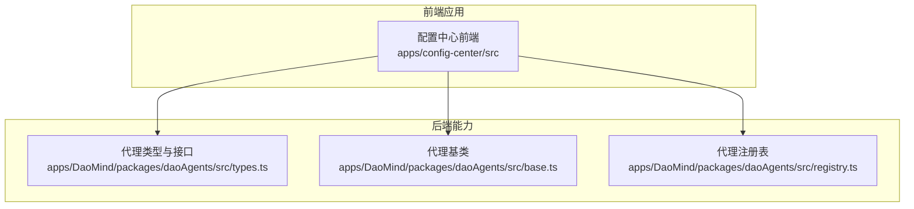
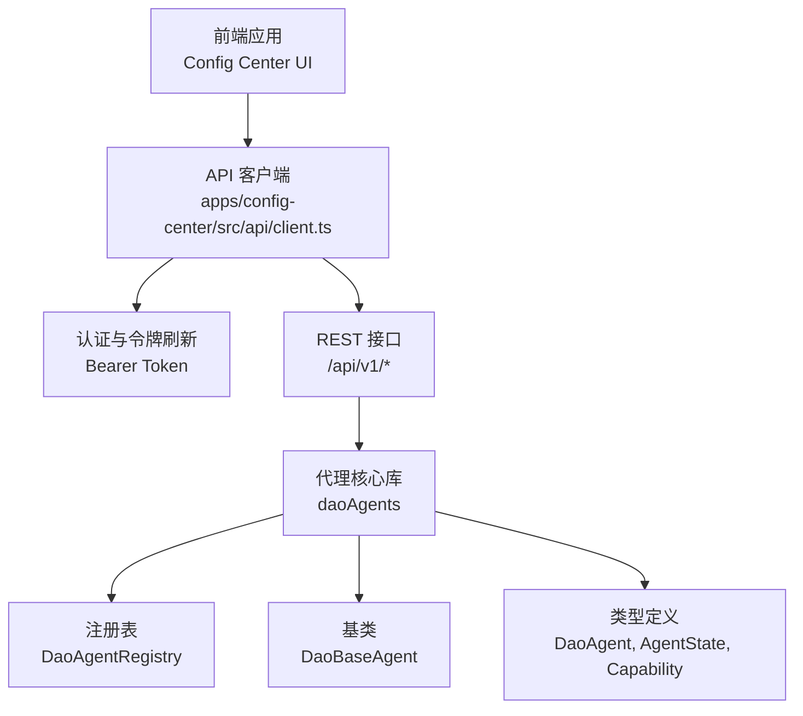
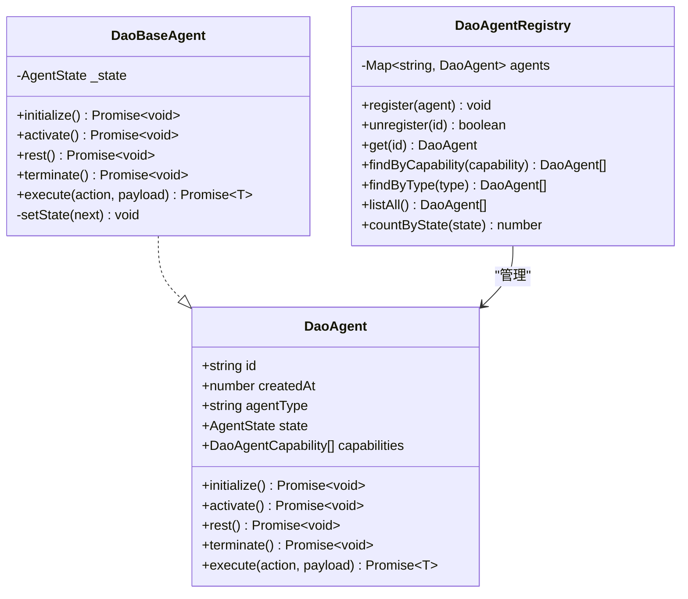
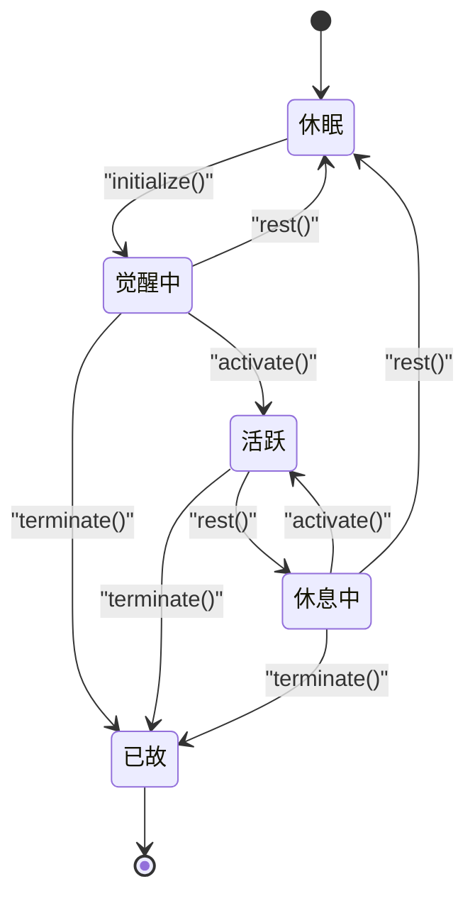
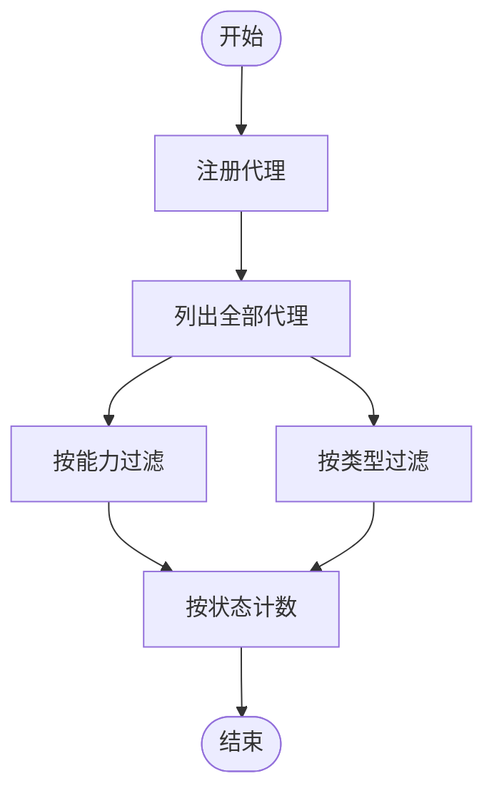
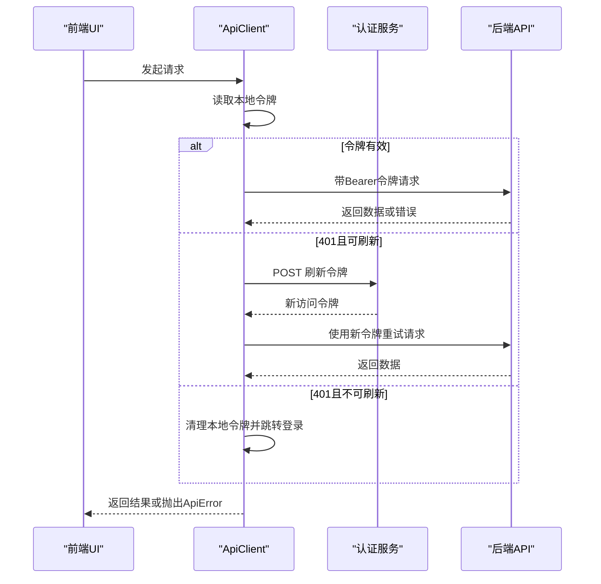
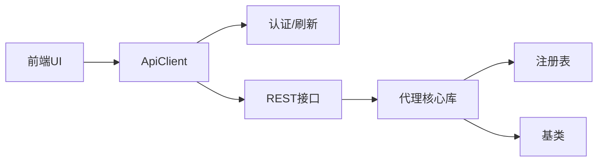

# AI代理管理API

<cite>
**本文引用的文件**
- [apps/DaoMind/packages/daoAgents/src/types.ts](file://apps/DaoMind/packages/daoAgents/src/types.ts)
- [apps/DaoMind/packages/daoAgents/src/base.ts](file://apps/DaoMind/packages/daoAgents/src/base.ts)
- [apps/DaoMind/packages/daoAgents/src/registry.ts](file://apps/DaoMind/packages/daoAgents/src/registry.ts)
- [apps/DaoMind/packages/daoAgents/src/index.ts](file://apps/DaoMind/packages/daoAgents/src/index.ts)
- [apps/config-center/src/api/client.ts](file://apps/config-center/src/api/client.ts)
- [apps/config-center/src/api/configs.ts](file://apps/config-center/src/api/configs.ts)
- [apps/config-center/src/api/users.ts](file://apps/config-center/src/api/users.ts)
- [apps/config-center/src/api/roles.ts](file://apps/config-center/src/api/roles.ts)
</cite>

## 目录
1. [简介](#简介)
2. [项目结构](#项目结构)
3. [核心组件](#核心组件)
4. [架构总览](#架构总览)
5. [详细组件分析](#详细组件分析)
6. [依赖关系分析](#依赖关系分析)
7. [性能考虑](#性能考虑)
8. [故障排查指南](#故障排查指南)
9. [结论](#结论)
10. [附录](#附录)

## 简介
本文件为“AI代理管理系统”的API文档，聚焦于代理的注册、配置、启动、停止与删除等全生命周期管理；涵盖任务调度、代理状态查询、性能监控与负载均衡相关接口；以及代理间通信、消息传递与协作机制的接口规范。同时提供代理生命周期管理、资源分配与故障恢复的API示例，并记录任务队列管理、优先级设置与执行监控的接口，最后包含多代理协作、冲突解决与状态同步的实现细节。

## 项目结构
该系统由前端应用与后端服务两部分组成：
- 前端应用：配置中心（Config Center）提供代理配置、用户与角色管理的REST API客户端封装。
- 后端能力：代理核心库（daoAgents）定义代理类型、基类与注册表，用于在运行时管理代理实例。

图表来源
- [apps/config-center/src/api/client.ts:14-172](file://apps/config-center/src/api/client.ts#L14-L172)
- [apps/DaoMind/packages/daoAgents/src/types.ts:1-26](file://apps/DaoMind/packages/daoAgents/src/types.ts#L1-L26)
- [apps/DaoMind/packages/daoAgents/src/base.ts:1-59](file://apps/DaoMind/packages/daoAgents/src/base.ts#L1-L59)
- [apps/DaoMind/packages/daoAgents/src/registry.ts:1-56](file://apps/DaoMind/packages/daoAgents/src/registry.ts#L1-L56)

章节来源
- [apps/config-center/src/api/client.ts:14-172](file://apps/config-center/src/api/client.ts#L14-L172)
- [apps/DaoMind/packages/daoAgents/src/types.ts:1-26](file://apps/DaoMind/packages/daoAgents/src/types.ts#L1-L26)
- [apps/DaoMind/packages/daoAgents/src/base.ts:1-59](file://apps/DaoMind/packages/daoAgents/src/base.ts#L1-L59)
- [apps/DaoMind/packages/daoAgents/src/registry.ts:1-56](file://apps/DaoMind/packages/daoAgents/src/registry.ts#L1-L56)

## 核心组件
- 代理类型与接口：定义代理能力、状态与生命周期方法。
- 代理基类：实现状态机与通用生命周期控制。
- 代理注册表：提供代理注册、注销、查询与统计功能。
- 配置中心API客户端：封装认证、请求重试与错误处理，统一调用后端REST接口。

章节来源
- [apps/DaoMind/packages/daoAgents/src/types.ts:3-25](file://apps/DaoMind/packages/daoAgents/src/types.ts#L3-L25)
- [apps/DaoMind/packages/daoAgents/src/base.ts:11-56](file://apps/DaoMind/packages/daoAgents/src/base.ts#L11-L56)
- [apps/DaoMind/packages/daoAgents/src/registry.ts:3-52](file://apps/DaoMind/packages/daoAgents/src/registry.ts#L3-L52)
- [apps/DaoMind/packages/daoAgents/src/index.ts:1-9](file://apps/DaoMind/packages/daoAgents/src/index.ts#L1-L9)

## 架构总览
系统采用“前端API客户端 + 后端代理核心库”的分层设计。前端通过配置中心API客户端访问后端服务；后端代理核心库负责代理实例的生命周期与状态管理。

图表来源
- [apps/config-center/src/api/client.ts:14-172](file://apps/config-center/src/api/client.ts#L14-L172)
- [apps/DaoMind/packages/daoAgents/src/types.ts:3-25](file://apps/DaoMind/packages/daoAgents/src/types.ts#L3-L25)
- [apps/DaoMind/packages/daoAgents/src/base.ts:11-56](file://apps/DaoMind/packages/daoAgents/src/base.ts#L11-L56)
- [apps/DaoMind/packages/daoAgents/src/registry.ts:3-52](file://apps/DaoMind/packages/daoAgents/src/registry.ts#L3-L52)

## 详细组件分析

### 代理类型与状态模型
- 代理能力（Capability）：包含名称、版本与描述。
- 代理状态（AgentState）：休眠、觉醒中、活跃、休息中、已故。
- 代理接口（DaoAgent）：定义初始化、激活、休息、终止与动作执行方法。
- 代理基类（DaoBaseAgent）：实现状态机与状态转换校验，确保合法流转。

图表来源
- [apps/DaoMind/packages/daoAgents/src/types.ts:3-25](file://apps/DaoMind/packages/daoAgents/src/types.ts#L3-L25)
- [apps/DaoMind/packages/daoAgents/src/base.ts:11-56](file://apps/DaoMind/packages/daoAgents/src/base.ts#L11-L56)
- [apps/DaoMind/packages/daoAgents/src/registry.ts:3-52](file://apps/DaoMind/packages/daoAgents/src/registry.ts#L3-L52)

章节来源
- [apps/DaoMind/packages/daoAgents/src/types.ts:3-25](file://apps/DaoMind/packages/daoAgents/src/types.ts#L3-L25)
- [apps/DaoMind/packages/daoAgents/src/base.ts:3-56](file://apps/DaoMind/packages/daoAgents/src/base.ts#L3-L56)
- [apps/DaoMind/packages/daoAgents/src/registry.ts:3-52](file://apps/DaoMind/packages/daoAgents/src/registry.ts#L3-L52)

### 代理生命周期与状态机
- 状态转换规则：严格限制状态变更路径，防止非法状态跳转。
- 生命周期方法：初始化 → 觉醒 → 活跃 → 休息/终止；终止后不可逆。

图表来源
- [apps/DaoMind/packages/daoAgents/src/base.ts:3-9](file://apps/DaoMind/packages/daoAgents/src/base.ts#L3-L9)

章节来源
- [apps/DaoMind/packages/daoAgents/src/base.ts:3-56](file://apps/DaoMind/packages/daoAgents/src/base.ts#L3-L56)

### 注册表与查询接口
- 注册/注销：按ID注册或移除代理实例。
- 查询：按能力或类型筛选代理；列出全部；按状态计数。
- 使用场景：任务调度器选择具备特定能力的代理；监控面板按状态统计。

图表来源
- [apps/DaoMind/packages/daoAgents/src/registry.ts:6-51](file://apps/DaoMind/packages/daoAgents/src/registry.ts#L6-L51)

章节来源
- [apps/DaoMind/packages/daoAgents/src/registry.ts:6-51](file://apps/DaoMind/packages/daoAgents/src/registry.ts#L6-L51)

### 配置中心API客户端与认证流程
- 统一请求封装：支持GET/POST/PUT/DELETE；自动附加Authorization头。
- 认证与刷新：本地存储包含访问令牌与刷新令牌；401时自动刷新并重试。
- 错误处理：抛出带状态码与详情的ApiError。

图表来源
- [apps/config-center/src/api/client.ts:14-172](file://apps/config-center/src/api/client.ts#L14-L172)

章节来源
- [apps/config-center/src/api/client.ts:14-172](file://apps/config-center/src/api/client.ts#L14-L172)

### 配置、用户与角色API
- 配置管理：列表、详情、创建、更新、删除、发布。
- 用户管理：列表、详情、创建、更新、删除。
- 角色管理：列表、详情、创建、更新、删除。

```mermaid
flowchart TD
A["配置管理"] --> A1["列表 /api/v1/configs"]
A --> A2["详情 /api/v1/configs/{id}"]
A --> A3["创建 /api/v1/configs"]
A --> A4["更新 /api/v1/configs/{id}"]
A --> A5["删除 /api/v1/configs/{id}"]
A --> A6["发布 /api/v1/configs/{id}/publish"]
B["用户管理"] --> B1["列表 /api/v1/users"]
B --> B2["详情 /api/v1/users/{id}"]
B --> B3["创建 /api/v1/users"]
B --> B4["更新 /api/v1/users/{id}"]
B --> B5["删除 /api/v1/users/{id}"]
C["角色管理"] --> C1["列表 /api/v1/roles"]
C --> C2["详情 /api/v1/roles/{id}"]
C --> C3["创建 /api/v1/roles"]
C --> C4["更新 /api/v1/roles/{id}"]
C --> C5["删除 /api/v1/roles/{id}"]
```

图表来源
- [apps/config-center/src/api/configs.ts:4-32](file://apps/config-center/src/api/configs.ts#L4-L32)
- [apps/config-center/src/api/users.ts:4-25](file://apps/config-center/src/api/users.ts#L4-L25)
- [apps/config-center/src/api/roles.ts:4-25](file://apps/config-center/src/api/roles.ts#L4-L25)

章节来源
- [apps/config-center/src/api/configs.ts:4-32](file://apps/config-center/src/api/configs.ts#L4-L32)
- [apps/config-center/src/api/users.ts:4-25](file://apps/config-center/src/api/users.ts#L4-L25)
- [apps/config-center/src/api/roles.ts:4-25](file://apps/config-center/src/api/roles.ts#L4-L25)

## 依赖关系分析
- 前端UI依赖API客户端进行后端交互。
- API客户端依赖认证模块与后端REST接口。
- 代理核心库独立于前端，提供状态与注册表能力，供调度器或监控模块使用。

图表来源
- [apps/config-center/src/api/client.ts:14-172](file://apps/config-center/src/api/client.ts#L14-L172)
- [apps/DaoMind/packages/daoAgents/src/registry.ts:3-52](file://apps/DaoMind/packages/daoAgents/src/registry.ts#L3-L52)
- [apps/DaoMind/packages/daoAgents/src/base.ts:11-56](file://apps/DaoMind/packages/daoAgents/src/base.ts#L11-L56)

章节来源
- [apps/config-center/src/api/client.ts:14-172](file://apps/config-center/src/api/client.ts#L14-L172)
- [apps/DaoMind/packages/daoAgents/src/registry.ts:3-52](file://apps/DaoMind/packages/daoAgents/src/registry.ts#L3-L52)
- [apps/DaoMind/packages/daoAgents/src/base.ts:11-56](file://apps/DaoMind/packages/daoAgents/src/base.ts#L11-L56)

## 性能考虑
- 代理状态转换：通过状态机避免无效操作，减少异常开销。
- 注册表查询：按能力/类型过滤与计数应结合索引优化，避免全量扫描。
- API客户端：令牌刷新仅在必要时触发，避免频繁IO；对204响应直接返回空值，减少解析成本。
- 负载均衡：调度器应基于代理可用性与状态统计进行选择，避免将任务分配给非活跃代理。

## 故障排查指南
- 认证失败（401）：检查本地存储中的访问/刷新令牌是否有效；确认刷新接口返回的新令牌是否写入存储。
- 请求异常：捕获ApiError并读取状态码与详情字段，定位具体错误原因。
- 代理状态异常：若出现非法状态转换错误，检查调用顺序与前置条件，确保遵循状态机规则。

章节来源
- [apps/config-center/src/api/client.ts:1-10](file://apps/config-center/src/api/client.ts#L1-L10)
- [apps/config-center/src/api/client.ts:98-120](file://apps/config-center/src/api/client.ts#L98-L120)
- [apps/DaoMind/packages/daoAgents/src/base.ts:29-37](file://apps/DaoMind/packages/daoAgents/src/base.ts#L29-L37)

## 结论
本API文档梳理了代理生命周期、状态管理与注册表查询的核心能力，并明确了前端API客户端的认证与重试机制。后续可在调度器与监控模块中扩展任务队列、优先级与负载均衡能力，以支撑多代理协作与高可用部署。

## 附录

### 代理生命周期管理API示例
- 初始化：调用代理实例的初始化方法，进入觉醒中状态。
- 激活：将状态切换为活跃，准备执行任务。
- 休息：将状态切换为休息中，释放部分资源。
- 终止：将状态切换为已故，完成清理与注销。

章节来源
- [apps/DaoMind/packages/daoAgents/src/base.ts:39-53](file://apps/DaoMind/packages/daoAgents/src/base.ts#L39-L53)

### 代理状态查询与统计
- 列出全部代理：用于仪表盘展示。
- 按能力筛选：用于任务路由到具备特定能力的代理。
- 按类型筛选：用于同质化代理的批量管理。
- 按状态计数：用于健康度与负载评估。

章节来源
- [apps/DaoMind/packages/daoAgents/src/registry.ts:41-51](file://apps/DaoMind/packages/daoAgents/src/registry.ts#L41-L51)

### 任务队列管理与执行监控
- 任务队列：建议引入任务模型与优先级字段，结合注册表按能力选择代理。
- 执行监控：记录任务提交、派发、执行与完成事件，结合代理状态统计进行可视化。

（本节为概念性内容，不直接对应具体源文件）

### 多代理协作、冲突解决与状态同步
- 协作机制：通过共享状态存储与事件总线实现代理间通信。
- 冲突解决：基于分布式锁或序列号机制保证幂等与一致性。
- 状态同步：定期广播心跳与状态快照，确保各代理一致。

（本节为概念性内容，不直接对应具体源文件）