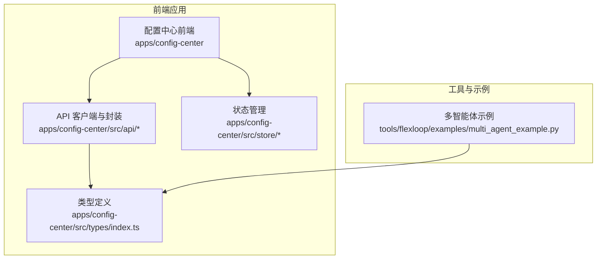
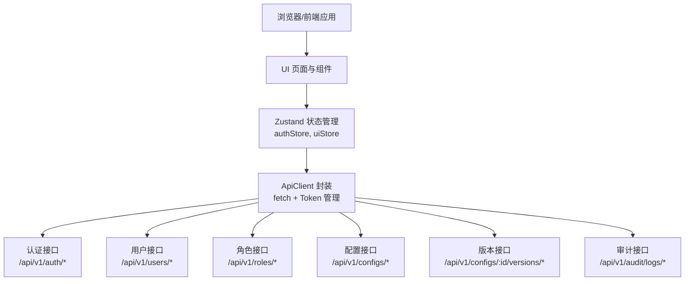
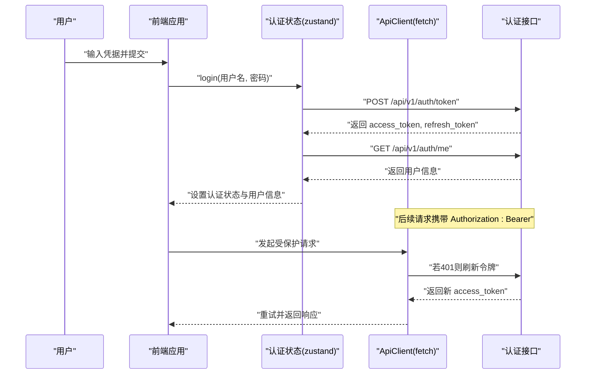
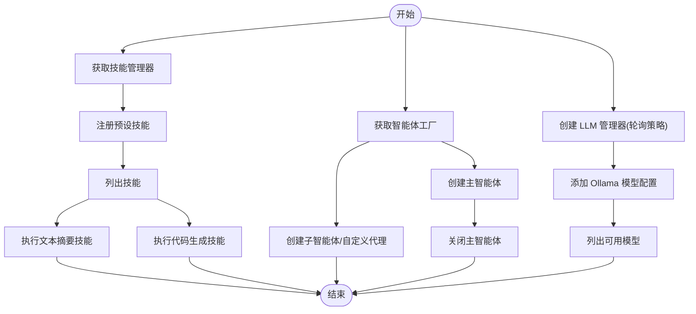
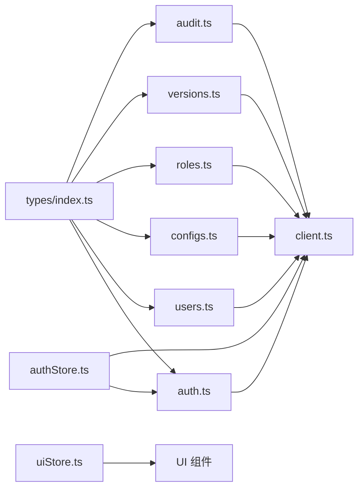

# API参考

<cite>
**本文引用的文件**
- [apps/config-center/src/api/client.ts](file://apps/config-center/src/api/client.ts)
- [apps/config-center/src/api/auth.ts](file://apps/config-center/src/api/auth.ts)
- [apps/config-center/src/api/users.ts](file://apps/config-center/src/api/users.ts)
- [apps/config-center/src/api/configs.ts](file://apps/config-center/src/api/configs.ts)
- [apps/config-center/src/api/roles.ts](file://apps/config-center/src/api/roles.ts)
- [apps/config-center/src/api/versions.ts](file://apps/config-center/src/api/versions.ts)
- [apps/config-center/src/api/audit.ts](file://apps/config-center/src/api/audit.ts)
- [apps/config-center/src/types/index.ts](file://apps/config-center/src/types/index.ts)
- [apps/config-center/src/store/authStore.ts](file://apps/config-center/src/store/authStore.ts)
- [apps/config-center/src/store/uiStore.ts](file://apps/config-center/src/store/uiStore.ts)
- [tools/flexloop/examples/multi_agent_example.py](file://tools/flexloop/examples/multi_agent_example.py)
</cite>

## 目录
1. [简介](#简介)
2. [项目结构](#项目结构)
3. [核心组件](#核心组件)
4. [架构总览](#架构总览)
5. [详细组件分析](#详细组件分析)
6. [依赖关系分析](#依赖关系分析)
7. [性能考量](#性能考量)
8. [故障排查指南](#故障排查指南)
9. [结论](#结论)
10. [附录](#附录)

## 简介
本文件为 DAO Collective 项目的 API 参考文档，覆盖以下方面：
- 配置中心（Config Center）REST API：认证、用户、角色、配置、版本与审计日志等接口规范。
- 多智能体系统（Multi-Agent System）：代理管理、技能调用、负载均衡与主代理编排的示例与流程。
- WebSocket API：当前仓库未发现 WebSocket 相关实现，故不包含该部分。
- 协议示例、错误处理策略、安全与速率限制建议、版本信息与常见用例。

## 项目结构
本项目采用多包/多应用组织方式，其中与 API 直接相关的核心模块位于：
- 前端应用 config-center：提供配置中心的 Web 界面与前端 API 客户端封装。
- Python 工具 flexloop：包含多智能体系统示例与测试，用于演示代理、技能与 LLM 管理。

图表来源
- [apps/config-center/src/api/client.ts:1-172](file://apps/config-center/src/api/client.ts#L1-L172)
- [apps/config-center/src/store/authStore.ts:1-108](file://apps/config-center/src/store/authStore.ts#L1-L108)
- [apps/config-center/src/types/index.ts:1-163](file://apps/config-center/src/types/index.ts#L1-L163)
- [tools/flexloop/examples/multi_agent_example.py:1-196](file://tools/flexloop/examples/multi_agent_example.py#L1-L196)

章节来源
- [apps/config-center/src/api/client.ts:1-172](file://apps/config-center/src/api/client.ts#L1-L172)
- [apps/config-center/src/store/authStore.ts:1-108](file://apps/config-center/src/store/authStore.ts#L1-L108)
- [apps/config-center/src/types/index.ts:1-163](file://apps/config-center/src/types/index.ts#L1-L163)
- [tools/flexloop/examples/multi_agent_example.py:1-196](file://tools/flexloop/examples/multi_agent_example.py#L1-L196)

## 核心组件
- REST API 客户端与错误处理：统一的 ApiClient 封装 GET/POST/PUT/DELETE/Form 提交，并内置 Bearer Token 与自动刷新逻辑；同时提供 ApiError 统一异常结构。
- 认证与会话：登录、刷新令牌、获取当前用户信息；前端通过本地存储持久化令牌并在 401 时重定向至登录页。
- 资源管理：用户、角色、配置、版本与审计日志的 CRUD 与查询接口。
- 类型系统：集中定义枚举与实体接口，确保前后端一致的数据契约。
- 多智能体系统：示例脚本展示技能注册、代理创建、主代理编排与 LLM 管理器的负载均衡配置。

章节来源
- [apps/config-center/src/api/client.ts:1-172](file://apps/config-center/src/api/client.ts#L1-L172)
- [apps/config-center/src/api/auth.ts:1-15](file://apps/config-center/src/api/auth.ts#L1-L15)
- [apps/config-center/src/api/users.ts:1-26](file://apps/config-center/src/api/users.ts#L1-L26)
- [apps/config-center/src/api/configs.ts:1-33](file://apps/config-center/src/api/configs.ts#L1-L33)
- [apps/config-center/src/api/roles.ts:1-26](file://apps/config-center/src/api/roles.ts#L1-L26)
- [apps/config-center/src/api/versions.ts:1-29](file://apps/config-center/src/api/versions.ts#L1-L29)
- [apps/config-center/src/api/audit.ts:1-18](file://apps/config-center/src/api/audit.ts#L1-L18)
- [apps/config-center/src/types/index.ts:1-163](file://apps/config-center/src/types/index.ts#L1-L163)
- [apps/config-center/src/store/authStore.ts:1-108](file://apps/config-center/src/store/authStore.ts#L1-L108)

## 架构总览
下图展示了前端应用与后端 API 的交互关系，以及认证与状态管理的协作：

图表来源
- [apps/config-center/src/api/client.ts:1-172](file://apps/config-center/src/api/client.ts#L1-L172)
- [apps/config-center/src/store/authStore.ts:1-108](file://apps/config-center/src/store/authStore.ts#L1-L108)
- [apps/config-center/src/store/uiStore.ts:1-14](file://apps/config-center/src/store/uiStore.ts#L1-L14)
- [apps/config-center/src/api/auth.ts:1-15](file://apps/config-center/src/api/auth.ts#L1-L15)
- [apps/config-center/src/api/users.ts:1-26](file://apps/config-center/src/api/users.ts#L1-L26)
- [apps/config-center/src/api/roles.ts:1-26](file://apps/config-center/src/api/roles.ts#L1-L26)
- [apps/config-center/src/api/configs.ts:1-33](file://apps/config-center/src/api/configs.ts#L1-L33)
- [apps/config-center/src/api/versions.ts:1-29](file://apps/config-center/src/api/versions.ts#L1-L29)
- [apps/config-center/src/api/audit.ts:1-18](file://apps/config-center/src/api/audit.ts#L1-L18)

## 详细组件分析

### REST API 规范（配置中心）
- 基础路径：/api/v1
- 认证方式：Bearer Token（Authorization 头），支持刷新令牌自动续期。
- 错误处理：统一返回 ApiError，包含状态码、消息与可选详情字段。
- 分页与过滤：多数列表接口支持 skip/limit 参数；部分接口支持按环境、服务、状态等条件过滤。

接口清单与要点
- 认证
  - 登录：POST /api/v1/auth/token（表单提交用户名/密码）
  - 刷新：POST /api/v1/auth/refresh（JSON 提交 refresh_token）
  - 当前用户：GET /api/v1/auth/me
- 用户
  - 列表：GET /api/v1/users?skip&limit
  - 查询：GET /api/v1/users/:id
  - 新增：POST /api/v1/users
  - 更新：PUT /api/v1/users/:id
  - 删除：DELETE /api/v1/users/:id
- 角色
  - 列表：GET /api/v1/roles?skip&limit
  - 查询：GET /api/v1/roles/:id
  - 新增：POST /api/v1/roles
  - 更新：PUT /api/v1/roles/:id
  - 删除：DELETE /api/v1/roles/:id
- 配置
  - 列表：GET /api/v1/configs?environment&service&status&skip&limit
  - 查询：GET /api/v1/configs/:id
  - 新增：POST /api/v1/configs
  - 更新：PUT /api/v1/configs/:id
  - 删除：DELETE /api/v1/configs/:id
  - 发布：POST /api/v1/configs/:id/publish
- 版本
  - 列表：GET /api/v1/configs/:id/versions?skip&limit
  - 查询：GET /api/v1/configs/:id/versions/:version
  - 差异：GET /api/v1/configs/:id/versions/diff/:v1/to/:v2
  - 回滚：POST /api/v1/configs/:id/versions/:version/rollback
- 审计
  - 查询：GET /api/v1/audit/logs?resource_type&resource_id&actor_id&action&skip&limit
  - 查询：GET /api/v1/audit/logs/:id

请求/响应模式与类型
- 请求体：JSON 或表单（登录场景）
- 响应体：JSON；空响应返回 204
- 错误响应：JSON 包含 detail 字段或回退为状态文本

章节来源
- [apps/config-center/src/api/auth.ts:1-15](file://apps/config-center/src/api/auth.ts#L1-L15)
- [apps/config-center/src/api/users.ts:1-26](file://apps/config-center/src/api/users.ts#L1-L26)
- [apps/config-center/src/api/configs.ts:1-33](file://apps/config-center/src/api/configs.ts#L1-L33)
- [apps/config-center/src/api/roles.ts:1-26](file://apps/config-center/src/api/roles.ts#L1-L26)
- [apps/config-center/src/api/versions.ts:1-29](file://apps/config-center/src/api/versions.ts#L1-L29)
- [apps/config-center/src/api/audit.ts:1-18](file://apps/config-center/src/api/audit.ts#L1-L18)
- [apps/config-center/src/types/index.ts:1-163](file://apps/config-center/src/types/index.ts#L1-L163)

### 认证与会话流程

图表来源
- [apps/config-center/src/store/authStore.ts:1-108](file://apps/config-center/src/store/authStore.ts#L1-L108)
- [apps/config-center/src/api/auth.ts:1-15](file://apps/config-center/src/api/auth.ts#L1-L15)
- [apps/config-center/src/api/client.ts:1-172](file://apps/config-center/src/api/client.ts#L1-L172)

章节来源
- [apps/config-center/src/store/authStore.ts:1-108](file://apps/config-center/src/store/authStore.ts#L1-L108)
- [apps/config-center/src/api/auth.ts:1-15](file://apps/config-center/src/api/auth.ts#L1-L15)
- [apps/config-center/src/api/client.ts:1-172](file://apps/config-center/src/api/client.ts#L1-L172)

### 多智能体系统 API（Python 示例）
- 技能管理：注册预设技能、列出技能、执行技能（如文本摘要、代码生成）。
- 代理管理：通过 AgentFactory 创建主代理与子代理，支持从模板创建与自定义创建。
- LLM 管理：配置模型提供商（如 Ollama）、添加模型实例、轮询策略的负载均衡。
- 示例脚本展示了完整的生命周期：技能使用 → 代理创建 → 主代理编排 → LLM 管理。

图表来源
- [tools/flexloop/examples/multi_agent_example.py:1-196](file://tools/flexloop/examples/multi_agent_example.py#L1-L196)

章节来源
- [tools/flexloop/examples/multi_agent_example.py:1-196](file://tools/flexloop/examples/multi_agent_example.py#L1-L196)

### 数据模型与类型
- 枚举与通用类型：环境、配置值类型、状态、变更类型、审计动作与状态等。
- 配置：键、环境、服务、值类型、描述、标签、状态、版本、创建者与时间戳等。
- 版本：版本号、变更原因、变更类型、差异摘要、是否回滚目标等。
- 审计：操作类型、资源类型/ID/Key、执行者、IP、旧/新值、状态、元数据与时间戳。
- 用户：用户名、邮箱、显示名、角色ID数组、激活状态与时间戳。
- 角色：名称、描述、权限集合、环境/服务作用域、系统角色标记与时间戳。
- 认证：访问令牌、刷新令牌与令牌类型。

章节来源
- [apps/config-center/src/types/index.ts:1-163](file://apps/config-center/src/types/index.ts#L1-L163)

## 依赖关系分析
- 前端层依赖关系
  - ApiClient 依赖浏览器原生 fetch 与本地存储，负责统一请求、鉴权与错误处理。
  - 各业务 API 模块（auth/users/configs/roles/versions/audit）均通过 ApiClient 发起请求。
  - Zustand 状态管理模块（authStore/uiStore）协调认证状态与 UI 状态。
  - 类型定义模块集中提供接口契约，避免前后端不一致。
- 多智能体系统依赖关系
  - 示例脚本导入多智能体库（AgentFactory、SkillManager、LLMManager 等），演示技能注册、代理创建与 LLM 管理。

图表来源
- [apps/config-center/src/api/auth.ts:1-15](file://apps/config-center/src/api/auth.ts#L1-L15)
- [apps/config-center/src/api/users.ts:1-26](file://apps/config-center/src/api/users.ts#L1-L26)
- [apps/config-center/src/api/configs.ts:1-33](file://apps/config-center/src/api/configs.ts#L1-L33)
- [apps/config-center/src/api/roles.ts:1-26](file://apps/config-center/src/api/roles.ts#L1-L26)
- [apps/config-center/src/api/versions.ts:1-29](file://apps/config-center/src/api/versions.ts#L1-L29)
- [apps/config-center/src/api/audit.ts:1-18](file://apps/config-center/src/api/audit.ts#L1-L18)
- [apps/config-center/src/api/client.ts:1-172](file://apps/config-center/src/api/client.ts#L1-L172)
- [apps/config-center/src/store/authStore.ts:1-108](file://apps/config-center/src/store/authStore.ts#L1-L108)
- [apps/config-center/src/store/uiStore.ts:1-14](file://apps/config-center/src/store/uiStore.ts#L1-L14)
- [apps/config-center/src/types/index.ts:1-163](file://apps/config-center/src/types/index.ts#L1-L163)

章节来源
- [apps/config-center/src/api/client.ts:1-172](file://apps/config-center/src/api/client.ts#L1-L172)
- [apps/config-center/src/store/authStore.ts:1-108](file://apps/config-center/src/store/authStore.ts#L1-L108)
- [apps/config-center/src/store/uiStore.ts:1-14](file://apps/config-center/src/store/uiStore.ts#L1-L14)
- [apps/config-center/src/types/index.ts:1-163](file://apps/config-center/src/types/index.ts#L1-L163)

## 性能考量
- 前端请求
  - 合理使用分页参数（skip/limit）以控制单次响应大小。
  - 对频繁读取的列表接口进行缓存（可在应用层引入轻量缓存策略）。
  - 在网络波动场景下，利用自动刷新令牌机制减少重复登录开销。
- 多智能体系统
  - 使用轮询策略的 LLM 管理器进行负载均衡，避免单点过载。
  - 控制并发执行的技能数量，结合队列与限流策略提升稳定性。
- 通用建议
  - 对大体积配置值采用压缩或分片传输（如适用）。
  - 后端实现必要的速率限制与配额控制，前端做好退避与重试策略。

## 故障排查指南
- 常见错误与处理
  - 401 未授权：检查本地存储中的 access_token 与 refresh_token 是否存在；若刷新失败，清除本地存储并引导重新登录。
  - 403 权限不足：确认用户角色与权限范围；前端可通过 hasPermission 进行 UI 屏蔽提示。
  - 429 速率限制：在前端实现指数退避重试与节流，避免触发后端限流。
  - 5xx 服务器错误：记录 ApiError 的状态码与详情，定位具体接口与参数。
- 前端调试
  - 使用浏览器开发者工具查看请求头与响应体，确认 Authorization 与 Content-Type 设置正确。
  - 检查本地存储中认证信息是否被意外清除或篡改。
- 多智能体系统
  - 若技能执行失败，优先检查技能 ID 与参数格式；确认模型提供商地址与权重配置正确。
  - 主代理关闭后需重建实例，避免复用已销毁对象。

章节来源
- [apps/config-center/src/api/client.ts:1-172](file://apps/config-center/src/api/client.ts#L1-L172)
- [apps/config-center/src/store/authStore.ts:1-108](file://apps/config-center/src/store/authStore.ts#L1-L108)

## 结论
本参考文档梳理了配置中心的 REST API 与多智能体系统的使用示例，明确了认证、资源管理、版本与审计等关键接口，提供了错误处理与性能优化建议。对于 WebSocket API，当前仓库未发现实现，因此不包含相关内容。建议在后续迭代中补充版本号、速率限制与安全加固策略，并完善后端接口文档与 OpenAPI 规范。

## 附录
- 常见用例
  - 管理员登录后批量创建用户与角色，再发布配置到生产环境。
  - 开发者通过版本差异对比快速定位变更影响，必要时执行回滚。
  - 多智能体编排：主代理协调多个子代理执行复杂任务，LLM 管理器按策略分配负载。
- 客户端实现要点
  - 统一封装请求与错误处理，集中管理令牌与刷新逻辑。
  - 在 UI 层根据权限动态渲染菜单与按钮，提升用户体验。
- 安全与合规
  - 严格区分前端提示与后端强制校验，不要仅依赖前端权限判断。
  - 对敏感配置值采用加密存储与最小暴露原则。
- 版本信息
  - 前端 API 客户端与类型定义位于配置中心前端目录；多智能体示例位于 tools/flexloop。