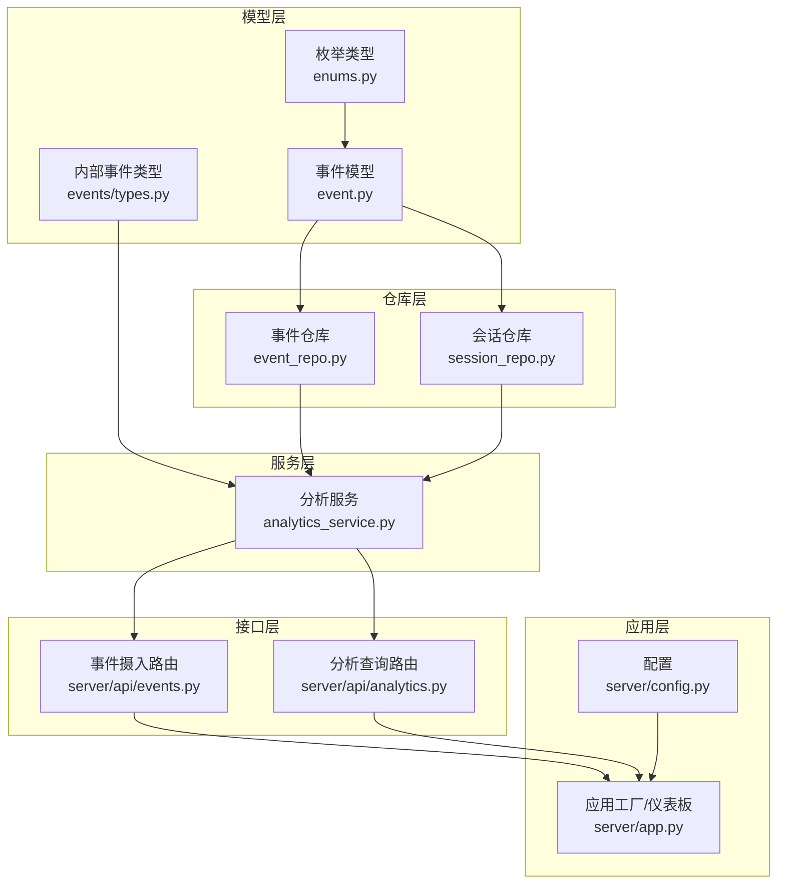
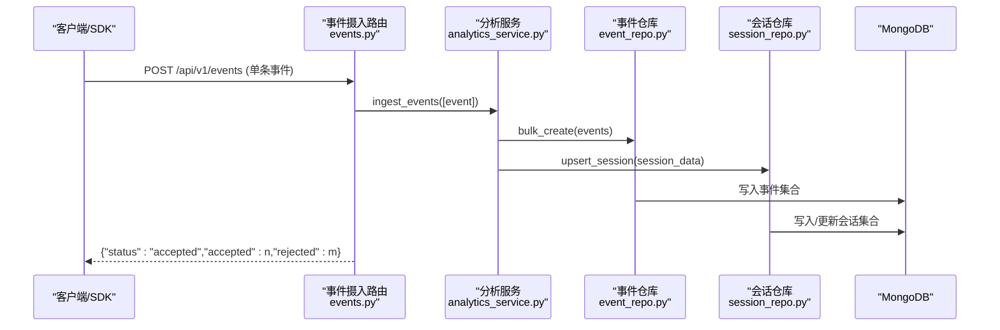
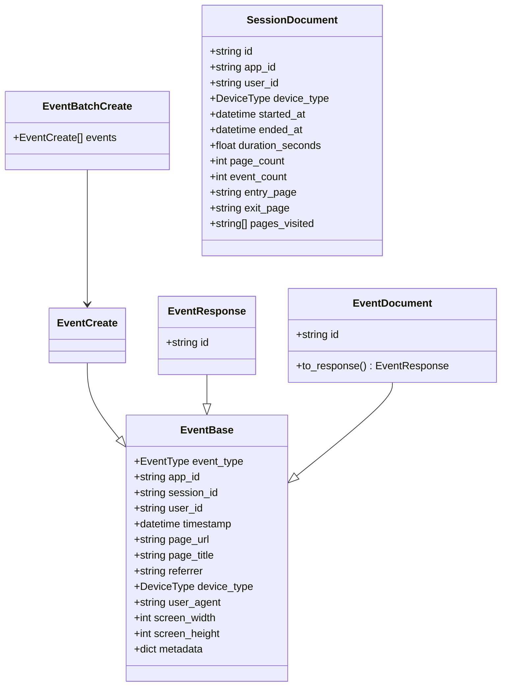
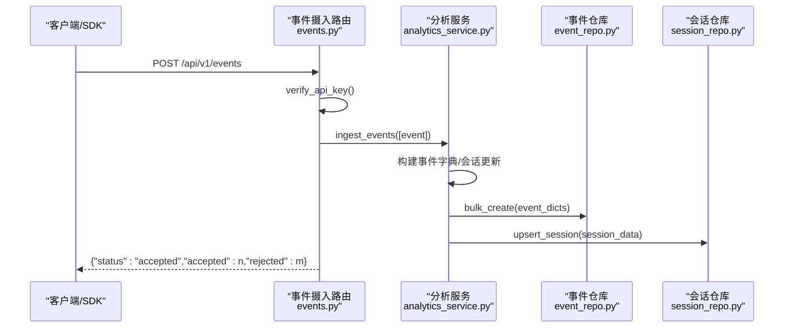
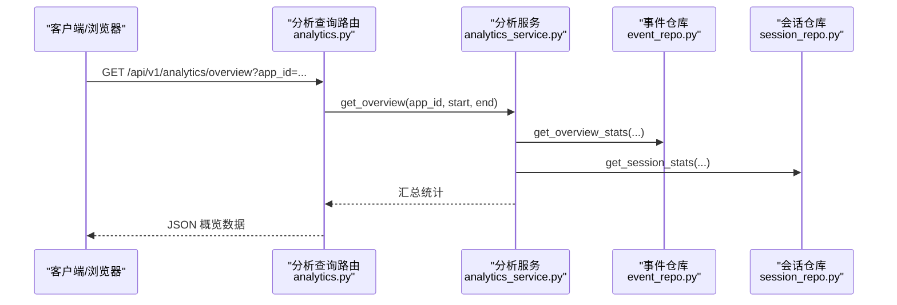
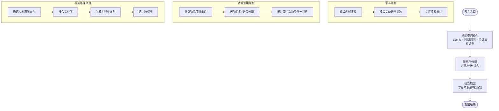
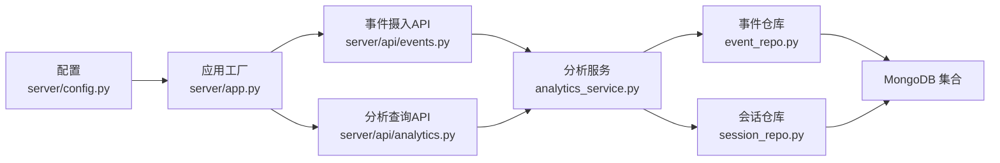

# 分析事件API

<cite>
**本文档引用的文件**
- [event.py](file://tools/flexloop/src/taolib/testing/analytics/models/event.py)
- [enums.py](file://tools/flexloop/src/taolib/testing/analytics/models/enums.py)
- [types.py](file://tools/flexloop/src/taolib/testing/analytics/events/types.py)
- [event_repo.py](file://tools/flexloop/src/taolib/testing/analytics/repository/event_repo.py)
- [session_repo.py](file://tools/flexloop/src/taolib/testing/analytics/repository/session_repo.py)
- [analytics_service.py](file://tools/flexloop/src/taolib/testing/analytics/services/analytics_service.py)
- [events.py](file://tools/flexloop/src/taolib/testing/analytics/server/api/events.py)
- [analytics.py](file://tools/flexloop/src/taolib/testing/analytics/server/api/analytics.py)
- [app.py](file://tools/flexloop/src/taolib/testing/analytics/server/app.py)
- [config.py](file://tools/flexloop/src/taolib/testing/analytics/server/config.py)
- [test_repository.py](file://tools/flexloop/tests/testing/test_analytics/test_repository.py)
- [test_service.py](file://tools/flexloop/tests/testing/test_analytics/test_service.py)
- [test_api.py](file://tools/flexloop/tests/testing/test_analytics/test_api.py)
</cite>

## 目录
1. [简介](#简介)
2. [项目结构](#项目结构)
3. [核心组件](#核心组件)
4. [架构总览](#架构总览)
5. [详细组件分析](#详细组件分析)
6. [依赖关系分析](#依赖关系分析)
7. [性能考虑](#性能考虑)
8. [故障排查指南](#故障排查指南)
9. [结论](#结论)
10. [附录](#附录)

## 简介
本文件为分析事件系统的完整API文档，覆盖事件采集、存储、查询与分析的全链路接口规范。系统支持事件上报（单条/批量）、实时与离线分析、聚合统计与可视化仪表板，并提供SDK集成、埋点配置与数据质量保障的实现细节。文档同时包含事件流处理、性能监控、容量规划与成本优化的设计建议。

## 项目结构
分析事件系统位于工具包 flexloop 的 analytics 子模块中，采用分层架构：
- 模型层：事件与会话的数据模型定义
- 仓库层：事件与会话的数据访问与聚合
- 服务层：业务逻辑编排（事件摄入、分析聚合）
- 服务层：FastAPI 接口路由（事件摄入与分析查询）
- 应用层：FastAPI 应用工厂与仪表板
- 配置层：运行参数与环境变量

**图表来源**
- [event.py:1-105](file://tools/flexloop/src/taolib/testing/analytics/models/event.py#L1-L105)
- [enums.py:1-31](file://tools/flexloop/src/taolib/testing/analytics/models/enums.py#L1-L31)
- [types.py:1-44](file://tools/flexloop/src/taolib/testing/analytics/events/types.py#L1-L44)
- [event_repo.py:1-469](file://tools/flexloop/src/taolib/testing/analytics/repository/event_repo.py#L1-L469)
- [session_repo.py:1-197](file://tools/flexloop/src/taolib/testing/analytics/repository/session_repo.py#L1-L197)
- [analytics_service.py:1-271](file://tools/flexloop/src/taolib/testing/analytics/services/analytics_service.py#L1-L271)
- [events.py:1-63](file://tools/flexloop/src/taolib/testing/analytics/server/api/events.py#L1-L63)
- [analytics.py:1-343](file://tools/flexloop/src/taolib/testing/analytics/server/api/analytics.py#L1-L343)
- [app.py:1-243](file://tools/flexloop/src/taolib/testing/analytics/server/app.py#L1-L243)
- [config.py:1-51](file://tools/flexloop/src/taolib/testing/analytics/server/config.py#L1-L51)

**章节来源**
- [app.py:65-95](file://tools/flexloop/src/taolib/testing/analytics/server/app.py#L65-L95)
- [config.py:10-48](file://tools/flexloop/src/taolib/testing/analytics/server/config.py#L10-L48)

## 核心组件
- 事件模型与枚举：定义事件字段、类型与设备类别
- 仓库层：事件与会话的增删改查、聚合分析与索引管理
- 服务层：事件摄入、概览统计、漏斗分析、功能排名、导航路径、停留分析、流失分析
- 接口层：事件摄入（单条/批量）、分析查询（概览/漏斗/功能/路径/停留/流失）
- 应用与配置：FastAPI 应用、CORS、MongoDB 连接、索引与TTL、仪表板与SDK

**章节来源**
- [event.py:17-105](file://tools/flexloop/src/taolib/testing/analytics/models/event.py#L17-L105)
- [enums.py:9-31](file://tools/flexloop/src/taolib/testing/analytics/models/enums.py#L9-L31)
- [event_repo.py:16-469](file://tools/flexloop/src/taolib/testing/analytics/repository/event_repo.py#L16-L469)
- [session_repo.py:15-197](file://tools/flexloop/src/taolib/testing/analytics/repository/session_repo.py#L15-L197)
- [analytics_service.py:16-271](file://tools/flexloop/src/taolib/testing/analytics/services/analytics_service.py#L16-L271)
- [events.py:38-61](file://tools/flexloop/src/taolib/testing/analytics/server/api/events.py#L38-L61)
- [analytics.py:95-340](file://tools/flexloop/src/taolib/testing/analytics/server/api/analytics.py#L95-L340)
- [app.py:19-56](file://tools/flexloop/src/taolib/testing/analytics/server/app.py#L19-L56)
- [config.py:20-44](file://tools/flexloop/src/taolib/testing/analytics/server/config.py#L20-L44)

## 架构总览
系统采用“事件摄入—数据存储—分析查询—可视化”的闭环架构。事件通过HTTP接口上报，经服务层归并会话后写入MongoDB；分析查询通过聚合管道实现，支持漏斗、路径、功能使用、停留时间、流失点等分析维度；仪表板提供前端可视化展示。

**图表来源**
- [events.py:38-44](file://tools/flexloop/src/taolib/testing/analytics/server/api/events.py#L38-L44)
- [analytics_service.py:33-101](file://tools/flexloop/src/taolib/testing/analytics/services/analytics_service.py#L33-L101)
- [event_repo.py:23-35](file://tools/flexloop/src/taolib/testing/analytics/repository/event_repo.py#L23-L35)
- [session_repo.py:22-79](file://tools/flexloop/src/taolib/testing/analytics/repository/session_repo.py#L22-L79)

## 详细组件分析

### 事件模型与类型定义
- 事件基础字段：事件类型、应用ID、会话ID、用户ID、时间戳、页面URL/标题、来源、设备类型、UA、屏幕尺寸、扩展元数据
- 事件类型枚举：页面浏览、点击、功能使用、会话开始/结束、导航、区域停留、自定义
- 设备类型枚举：桌面、移动、平板、未知
- 会话文档：聚合会话信息（开始/结束时间、时长、页面数、事件数、入口/出口页面、访问页面集合）

**图表来源**
- [event.py:17-105](file://tools/flexloop/src/taolib/testing/analytics/models/event.py#L17-L105)
- [enums.py:9-31](file://tools/flexloop/src/taolib/testing/analytics/models/enums.py#L9-L31)

**章节来源**
- [event.py:17-105](file://tools/flexloop/src/taolib/testing/analytics/models/event.py#L17-L105)
- [enums.py:9-31](file://tools/flexloop/src/taolib/testing/analytics/models/enums.py#L9-L31)

### 事件摄入API
- 单条事件上报
  - 方法：POST /api/v1/events
  - 认证：可选API Key（通过请求头 X-API-Key）
  - 请求体：事件对象（EventCreate）
  - 响应：{"status":"accepted","accepted":n,"rejected":m}
- 批量事件上报
  - 方法：POST /api/v1/events/batch
  - 认证：同上
  - 请求体：事件数组（EventBatchCreate）
  - 限制：单次批量数量不超过配置项 max_batch_size
  - 响应：{"accepted":n,"rejected":m}

**图表来源**
- [events.py:38-61](file://tools/flexloop/src/taolib/testing/analytics/server/api/events.py#L38-L61)
- [analytics_service.py:33-101](file://tools/flexloop/src/taolib/testing/analytics/services/analytics_service.py#L33-L101)
- [event_repo.py:23-35](file://tools/flexloop/src/taolib/testing/analytics/repository/event_repo.py#L23-L35)
- [session_repo.py:22-79](file://tools/flexloop/src/taolib/testing/analytics/repository/session_repo.py#L22-L79)

**章节来源**
- [events.py:11-61](file://tools/flexloop/src/taolib/testing/analytics/server/api/events.py#L11-L61)
- [config.py:43-44](file://tools/flexloop/src/taolib/testing/analytics/server/config.py#L43-L44)
- [analytics_service.py:33-101](file://tools/flexloop/src/taolib/testing/analytics/services/analytics_service.py#L33-L101)

### 分析查询API
- 概览统计
  - 方法：GET /api/v1/analytics/overview
  - 参数：app_id（必填），start/end（可选，默认最近7天）
  - 响应：总事件数、唯一会话数、唯一用户数、热门页面、事件类型分布等
- 转化漏斗
  - 方法：GET /api/v1/analytics/funnel
  - 参数：app_id（必填），steps（逗号分隔，必填），start/end（可选）
  - 响应：每步人数与转化率，整体转化率
- 功能使用排名
  - 方法：GET /api/v1/analytics/features
  - 参数：app_id（必填），start/end（可选），limit（1-100，默认20）
  - 响应：功能名称、使用次数、唯一用户数
- 导航路径（用户流）
  - 方法：GET /api/v1/analytics/paths
  - 参数：app_id（必填），start/end（可选），limit（1-200，默认50）
  - 响应：页面对序列及出现频次
- 停留时间分析
  - 方法：GET /api/v1/analytics/retention
  - 参数：app_id（必填），start/end（可选）
  - 响应：区域ID、平均停留时长、访问次数
- 流失点分析
  - 方法：GET /api/v1/analytics/drop-off
  - 参数：app_id（必填），steps（逗号分隔，必填），start/end（可选）
  - 响应：每步进入/完成/流失率

**图表来源**
- [analytics.py:95-104](file://tools/flexloop/src/taolib/testing/analytics/server/api/analytics.py#L95-L104)
- [analytics_service.py:103-121](file://tools/flexloop/src/taolib/testing/analytics/services/analytics_service.py#L103-L121)
- [event_repo.py:361-441](file://tools/flexloop/src/taolib/testing/analytics/repository/event_repo.py#L361-L441)
- [session_repo.py:119-177](file://tools/flexloop/src/taolib/testing/analytics/repository/session_repo.py#L119-L177)

**章节来源**
- [analytics.py:54-340](file://tools/flexloop/src/taolib/testing/analytics/server/api/analytics.py#L54-L340)
- [analytics_service.py:103-253](file://tools/flexloop/src/taolib/testing/analytics/services/analytics_service.py#L103-L253)

### 仓库层与聚合分析
- 事件仓库
  - 增删改查：按会话/应用/时间范围查询、批量写入
  - 聚合分析：漏斗、功能使用、导航路径、停留时间、流失点、概览统计
  - 索引：应用+时间、应用+事件类型、会话+时间、功能名稀疏索引、TTL
- 会话仓库
  - upsert：合并更新会话，自动计算页面数与时长
  - 统计：平均时长、平均页面数、跳出率
  - 索引：应用+开始时间、应用+用户ID稀疏索引、TTL

**图表来源**
- [event_repo.py:93-360](file://tools/flexloop/src/taolib/testing/analytics/repository/event_repo.py#L93-L360)
- [session_repo.py:22-177](file://tools/flexloop/src/taolib/testing/analytics/repository/session_repo.py#L22-L177)

**章节来源**
- [event_repo.py:16-469](file://tools/flexloop/src/taolib/testing/analytics/repository/event_repo.py#L16-L469)
- [session_repo.py:15-197](file://tools/flexloop/src/taolib/testing/analytics/repository/session_repo.py#L15-L197)

### 服务层编排
- 事件摄入：校验/清洗事件，构建事件字典，收集会话更新，批量写入事件，UPSERT会话
- 概览统计：汇总事件与会话统计
- 转化漏斗：逐级统计进入/完成/流失
- 功能排名：按使用次数与唯一用户排序
- 导航路径：生成页面对并统计频次
- 停留分析：按区域统计平均停留时长
- 流失分析：计算每步流失率

**章节来源**
- [analytics_service.py:16-271](file://tools/flexloop/src/taolib/testing/analytics/services/analytics_service.py#L16-L271)

### 应用与配置
- 应用工厂：创建FastAPI实例，注册中间件与路由，提供SDK与仪表板
- 生命周期：启动时连接MongoDB，创建事件与会话集合索引，设置TTL
- 配置项：MongoDB连接串、数据库名、监听地址/端口、CORS、API Key、TTL天数、批量大小

**章节来源**
- [app.py:19-95](file://tools/flexloop/src/taolib/testing/analytics/server/app.py#L19-L95)
- [config.py:10-48](file://tools/flexloop/src/taolib/testing/analytics/server/config.py#L10-L48)

## 依赖关系分析
- 组件耦合
  - 服务层依赖仓库层（事件/会话）
  - 接口层依赖服务层
  - 应用层依赖接口层与配置
- 外部依赖
  - MongoDB（Motor异步驱动）
  - FastAPI（路由与ASGI）
  - Chart.js（前端可视化）
- 索引与TTL
  - 事件集合：复合索引、功能名稀疏索引、按时间TTL
  - 会话集合：应用+时间、应用+用户稀疏索引、按开始时间TTL

**图表来源**
- [events.py:27-35](file://tools/flexloop/src/taolib/testing/analytics/server/api/events.py#L27-L35)
- [analytics.py:43-51](file://tools/flexloop/src/taolib/testing/analytics/server/api/analytics.py#L43-L51)
- [analytics_service.py:19-31](file://tools/flexloop/src/taolib/testing/analytics/services/analytics_service.py#L19-L31)
- [event_repo.py:19-21](file://tools/flexloop/src/taolib/testing/analytics/repository/event_repo.py#L19-L21)
- [session_repo.py:18-20](file://tools/flexloop/src/taolib/testing/analytics/repository/session_repo.py#L18-L20)
- [app.py:65-95](file://tools/flexloop/src/taolib/testing/analytics/server/app.py#L65-L95)
- [config.py:20-44](file://tools/flexloop/src/taolib/testing/analytics/server/config.py#L20-L44)

**章节来源**
- [app.py:24-49](file://tools/flexloop/src/taolib/testing/analytics/server/app.py#L24-L49)
- [event_repo.py:443-466](file://tools/flexloop/src/taolib/testing/analytics/repository/event_repo.py#L443-L466)
- [session_repo.py:179-194](file://tools/flexloop/src/taolib/testing/analytics/repository/session_repo.py#L179-L194)

## 性能考虑
- 索引策略
  - 事件集合：应用+时间降序、应用+事件类型、会话+时间、功能名稀疏索引
  - 会话集合：应用+开始时间降序、应用+用户稀疏索引
- TTL与容量
  - 事件TTL默认90天，会话TTL默认180天，可通过配置调整
- 批量摄入
  - 单次批量上限受 max_batch_size 控制，避免单次写入过大
- 聚合复杂度
  - 漏斗/路径/功能使用等聚合涉及多阶段聚合，建议合理设置limit与时间范围
- 缓存与CDN
  - 仪表板静态资源可配合CDN加速
- 监控与告警
  - 建议接入指标监控（QPS、P95/P99延迟、聚合耗时、MongoDB慢查询）

[本节为通用性能指导，不直接分析具体文件]

## 故障排查指南
- 认证失败
  - 现象：401未授权
  - 排查：确认是否启用API Key、请求头X-API-Key是否正确
- 批量超限
  - 现象：400错误，提示批量数量超过限制
  - 排查：检查max_batch_size配置，减少单次批量数量
- 查询无数据
  - 现象：概览/分析接口返回空或零值
  - 排查：确认app_id、时间范围、事件类型过滤条件；检查索引是否存在
- 聚合异常
  - 现象：漏斗/路径/功能使用等聚合结果异常
  - 排查：核对事件类型与元数据字段（如metadata.feature_name）；检查聚合管道
- 仪表板无法加载
  - 现象：/dashboard或/SDK返回404或空白
  - 排查：确认应用已启动并创建索引；检查静态资源路径

**章节来源**
- [events.py:11-24](file://tools/flexloop/src/taolib/testing/analytics/server/api/events.py#L11-L24)
- [events.py:52-56](file://tools/flexloop/src/taolib/testing/analytics/server/api/events.py#L52-L56)
- [app.py:24-49](file://tools/flexloop/src/taolib/testing/analytics/server/app.py#L24-L49)
- [analytics.py:28-40](file://tools/flexloop/src/taolib/testing/analytics/server/api/analytics.py#L28-L40)

## 结论
分析事件系统提供了从事件上报、存储、聚合到可视化的完整能力，具备良好的扩展性与可维护性。通过合理的索引、TTL与批量策略，可在高并发场景下保持稳定性能。建议结合业务需求持续优化聚合维度与前端展示，并完善监控与告警体系以保障线上稳定性。

[本节为总结性内容，不直接分析具体文件]

## 附录

### SDK集成与埋点配置
- SDK提供
  - 通过 /sdk/analytics.js 提供前端SDK
  - 支持单条/批量事件上报
- 埋点建议
  - 明确事件类型（页面浏览、点击、功能使用、会话开始/结束等）
  - 规范元数据字段（如功能名、分类、区域ID）
  - 合理设置会话边界与时间戳

**章节来源**
- [app.py:84-88](file://tools/flexloop/src/taolib/testing/analytics/server/app.py#L84-L88)
- [enums.py:9-20](file://tools/flexloop/src/taolib/testing/analytics/models/enums.py#L9-L20)
- [event.py:17-36](file://tools/flexloop/src/taolib/testing/analytics/models/event.py#L17-L36)

### 内部事件类型
- EventsReceivedEvent：事件接收事件（元事件）
- AnalyticsQueryEvent：分析查询事件（元事件）

**章节来源**
- [types.py:11-44](file://tools/flexloop/src/taolib/testing/analytics/events/types.py#L11-L44)

### 测试参考
- 事件入库与查询测试
- 服务层聚合方法测试
- API端点测试（SDK、事件摄入、仪表板）

**章节来源**
- [test_repository.py:38-185](file://tools/flexloop/tests/testing/test_analytics/test_repository.py#L38-L185)
- [test_service.py:13-189](file://tools/flexloop/tests/testing/test_analytics/test_service.py#L13-L189)
- [test_api.py:47-83](file://tools/flexloop/tests/testing/test_analytics/test_api.py#L47-L83)