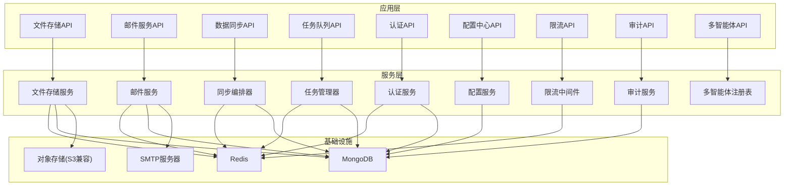
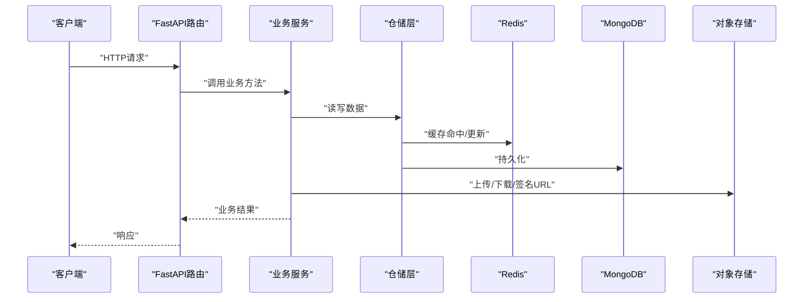
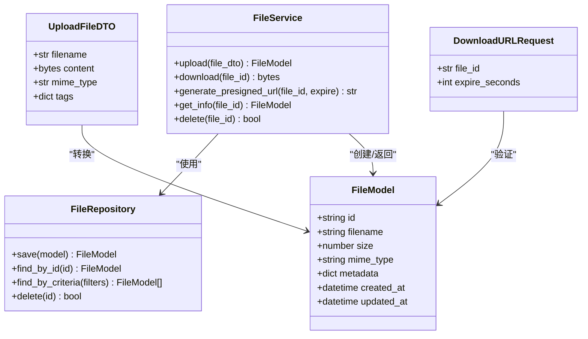
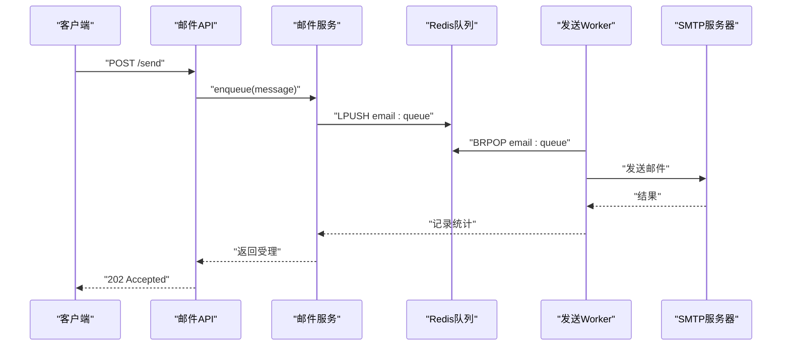
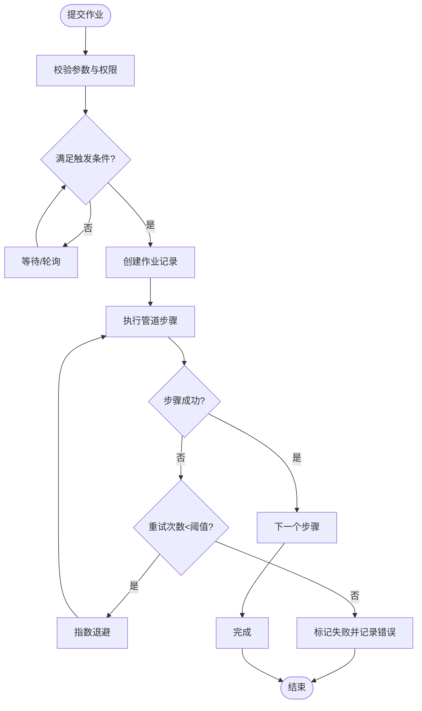
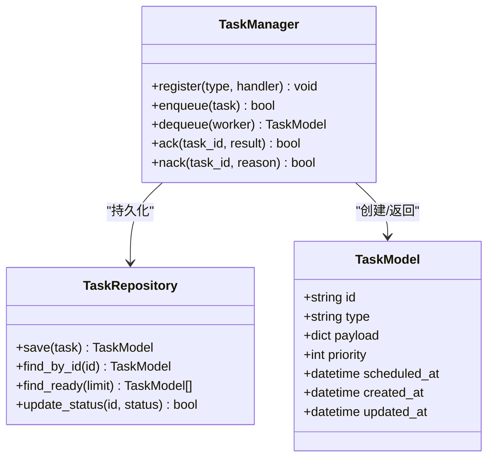
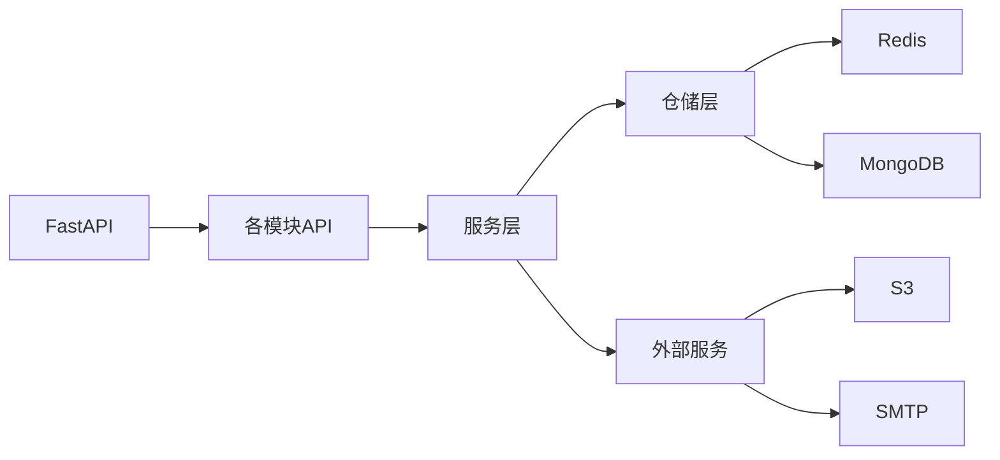

# 数据存储API

<cite>
**本文引用的文件**
- [pyproject.toml](file://tools/flexloop/pyproject.toml)
- [file_storage/__init__.py](file://tools/flexloop/src/taolib/file_storage/__init__.py)
- [file_storage/models.py](file://tools/flexloop/src/taolib/file_storage/models.py)
- [file_storage/services.py](file://tools/flexloop/src/taolib/file_storage/services.py)
- [file_storage/repository.py](file://tools/flexloop/src/taolib/file_storage/repository.py)
- [file_storage/api.py](file://tools/flexloop/src/taolib/file_storage/api.py)
- [email_service/__init__.py](file://tools/flexloop/src/taolib/email_service/__init__.py)
- [email_service/models.py](file://tools/flexloop/src/taolib/email_service/models.py)
- [email_service/services.py](file://tools/flexloop/src/taolib/email_service/services.py)
- [email_service/repository.py](file://tools/flexloop/src/taolib/email_service/repository.py)
- [email_service/api.py](file://tools/flexloop/src/taolib/email_service/api.py)
- [data_sync/__init__.py](file://tools/flexloop/src/taolib/data_sync/__init__.py)
- [data_sync/models.py](file://tools/flexloop/src/taolib/data_sync/models.py)
- [data_sync/orchestrator.py](file://tools/flexloop/src/taolib/data_sync/orchestrator.py)
- [data_sync/pipeline.py](file://tools/flexloop/src/taolib/data_sync/pipeline.py)
- [data_sync/repository.py](file://tools/flexloop/src/taolib/data_sync/repository.py)
- [data_sync/api.py](file://tools/flexloop/src/taolib/data_sync/api.py)
- [task_queue/__init__.py](file://tools/flexloop/src/taolib/task_queue/__init__.py)
- [task_queue/models.py](file://tools/flexloop/src/taolib/task_queue/models.py)
- [task_queue/manager.py](file://tools/flexloop/src/taolib/task_queue/manager.py)
- [task_queue/repository.py](file://tools/flexloop/src/taolib/task_queue/repository.py)
- [task_queue/api.py](file://tools/flexloop/src/taolib/task_queue/api.py)
- [auth/__init__.py](file://tools/flexloop/src/taolib/auth/__init__.py)
- [auth/models.py](file://tools/flexloop/src/taolib/auth/models.py)
- [auth/services.py](file://tools/flexloop/src/taolib/auth/services.py)
- [auth/repository.py](file://tools/flexloop/src/taolib/auth/repository.py)
- [auth/api.py](file://tools/flexloop/src/taolib/auth/api.py)
- [config_center/__init__.py](file://tools/flexloop/src/taolib/config_center/__init__.py)
- [config_center/models.py](file://tools/flexloop/src/taolib/config_center/models.py)
- [config_center/repository.py](file://tools/flexloop/src/taolib/config_center/repository.py)
- [config_center/api.py](file://tools/flexloop/src/taolib/config_center/api.py)
- [rate_limiter/__init__.py](file://tools/flexloop/src/taolib/rate_limiter/__init__.py)
- [rate_limiter/models.py](file://tools/flexloop/src/taolib/rate_limiter/models.py)
- [rate_limiter/store.py](file://tools/flexloop/src/taolib/rate_limiter/store.py)
- [rate_limiter/middleware.py](file://tools/flexloop/src/taolib/rate_limiter/middleware.py)
- [rate_limiter/api.py](file://tools/flexloop/src/taolib/rate_limiter/api.py)
- [audit/__init__.py](file://tools/flexloop/src/taolib/audit/__init__.py)
- [audit/models.py](file://tools/flexloop/src/taolib/audit/models.py)
- [audit/repository.py](file://tools/flexloop/src/taolib/audit/repository.py)
- [audit/api.py](file://tools/flexloop/src/taolib/audit/api.py)
- [multi_agent/__init__.py](file://tools/flexloop/src/taolib/multi_agent/__init__.py)
- [multi_agent/models.py](file://tools/flexloop/src/taolib/multi_agent/models.py)
- [multi_agent/registry.py](file://tools/flexloop/src/taolib/multi_agent/registry.py)
- [multi_agent/api.py](file://tools/flexloop/src/taolib/multi_agent/api.py)
- [plot/__init__.py](file://tools/flexloop/src/taolib/plot/__init__.py)
- [qrcode/__init__.py](file://tools/flexloop/src/taolib/qrcode/__init__.py)
- [remote/__init__.py](file://tools/flexloop/src/taolib/remote/__init__.py)
- [doc.py](file://tools/flexloop/src/taolib/doc.py)
- [logging_config.py](file://tools/flexloop/src/taolib/logging_config.py)
- [file_storage_server.py](file://tools/flexloop/tests/testing/test_file_storage/test_services.py)
- [email_service_server.py](file://tools/flexloop/tests/testing/test_email_service/test_services.py)
- [data_sync_server.py](file://tools/flexloop/tests/testing/test_data_sync/test_orchestrator.py)
- [task_queue_server.py](file://tools/flexloop/tests/testing/test_task_queue/test_manager.py)
- [auth_server.py](file://tools/flexloop/tests/testing/test_auth/test_api_key.py)
- [config_center_server.py](file://tools/flexloop/tests/testing/test_config_center/test_api_integration.py)
- [rate_limiter_server.py](file://tools/flexloop/tests/testing/test_rate_limiter/test_api.py)
- [audit_server.py](file://tools/flexloop/tests/testing/test_audit/test_api.py)
- [multi_agent_server.py](file://tools/flexloop/tests/testing/test_multi_agent/test_agents.py)
</cite>

## 目录
1. [简介](#简介)
2. [项目结构](#项目结构)
3. [核心组件](#核心组件)
4. [架构总览](#架构总览)
5. [详细组件分析](#详细组件分析)
6. [依赖关系分析](#依赖关系分析)
7. [性能考虑](#性能考虑)
8. [故障排查指南](#故障排查指南)
9. [结论](#结论)
10. [附录](#附录)

## 简介
本文件为数据存储系统（taolib）的API文档，覆盖以下能力域：
- 文件存储：上传、下载、签名URL生成、处理与归档
- 邮件服务：模板渲染、队列化发送、订阅管理
- 数据同步：管道编排、作业调度、状态跟踪
- 文档管理：版本控制、备份恢复、生命周期策略
- 存储桶管理：访问控制、权限策略、生命周期规则
- 性能优化：缓存、限流、异步处理
- 错误处理：重试机制、监控告警、审计日志

该系统基于FastAPI + Redis/Motor + Pydantic构建，采用模块化分层设计，便于扩展与测试。

## 项目结构
- 包名：taolib（Python包）
- 模块按功能域划分：file_storage、email_service、data_sync、task_queue、auth、config_center、rate_limiter、audit、multi_agent、plot、qrcode、remote等
- 各模块均包含models、repository、services、api四个层次，遵循清晰的职责分离
- 测试位于tests/testing下，覆盖各模块的集成与单元测试

图表来源
- [pyproject.toml](file://tools/flexloop/pyproject.toml)
- [file_storage/api.py](file://tools/flexloop/src/taolib/file_storage/api.py)
- [email_service/api.py](file://tools/flexloop/src/taolib/email_service/api.py)
- [data_sync/api.py](file://tools/flexloop/src/taolib/data_sync/api.py)
- [task_queue/api.py](file://tools/flexloop/src/taolib/task_queue/api.py)
- [auth/api.py](file://tools/flexloop/src/taolib/auth/api.py)
- [config_center/api.py](file://tools/flexloop/src/taolib/config_center/api.py)
- [rate_limiter/api.py](file://tools/flexloop/src/taolib/rate_limiter/api.py)
- [audit/api.py](file://tools/flexloop/src/taolib/audit/api.py)
- [multi_agent/api.py](file://tools/flexloop/src/taolib/multi_agent/api.py)

章节来源
- [pyproject.toml](file://tools/flexloop/pyproject.toml)

## 核心组件
- 文件存储模块：提供文件元数据、处理、归档与签名URL生成能力
- 邮件服务模块：提供模板引擎、队列化发送、订阅管理与退订
- 数据同步模块：提供管道定义、作业编排、调度与状态跟踪
- 任务队列模块：提供任务注册、执行、重试与结果存储
- 认证模块：提供API密钥、令牌、RBAC与黑名单
- 配置中心模块：提供配置发布、版本审计与差异对比
- 限流模块：提供速率限制中间件与统计
- 审计模块：提供操作审计与查询
- 多智能体模块：提供智能体注册与负载均衡

章节来源
- [file_storage/api.py](file://tools/flexloop/src/taolib/file_storage/api.py)
- [email_service/api.py](file://tools/flexloop/src/taolib/email_service/api.py)
- [data_sync/api.py](file://tools/flexloop/src/taolib/data_sync/api.py)
- [task_queue/api.py](file://tools/flexloop/src/taolib/task_queue/api.py)
- [auth/api.py](file://tools/flexloop/src/taolib/auth/api.py)
- [config_center/api.py](file://tools/flexloop/src/taolib/config_center/api.py)
- [rate_limiter/api.py](file://tools/flexloop/src/taolib/rate_limiter/api.py)
- [audit/api.py](file://tools/flexloop/src/taolib/audit/api.py)
- [multi_agent/api.py](file://tools/flexloop/src/taolib/multi_agent/api.py)

## 架构总览
系统采用“模块化分层 + 异步处理 + 缓存/数据库”的架构模式：
- 表现层：FastAPI路由，统一返回模型
- 业务层：服务类封装领域逻辑
- 数据层：MongoDB（Motor）持久化；Redis（hiredis）缓存/队列
- 外部集成：S3兼容对象存储、SMTP、定时任务

图表来源
- [file_storage/api.py](file://tools/flexloop/src/taolib/file_storage/api.py)
- [file_storage/services.py](file://tools/flexloop/src/taolib/file_storage/services.py)
- [file_storage/repository.py](file://tools/flexloop/src/taolib/file_storage/repository.py)
- [email_service/api.py](file://tools/flexloop/src/taolib/email_service/api.py)
- [email_service/services.py](file://tools/flexloop/src/taolib/email_service/services.py)
- [email_service/repository.py](file://tools/flexloop/src/taolib/email_service/repository.py)
- [data_sync/api.py](file://tools/flexloop/src/taolib/data_sync/api.py)
- [data_sync/orchestrator.py](file://tools/flexloop/src/taolib/data_sync/orchestrator.py)
- [data_sync/pipeline.py](file://tools/flexloop/src/taolib/data_sync/pipeline.py)
- [data_sync/repository.py](file://tools/flexloop/src/taolib/data_sync/repository.py)
- [task_queue/api.py](file://tools/flexloop/src/taolib/task_queue/api.py)
- [task_queue/manager.py](file://tools/flexloop/src/taolib/task_queue/manager.py)
- [task_queue/repository.py](file://tools/flexloop/src/taolib/task_queue/repository.py)
- [auth/api.py](file://tools/flexloop/src/taolib/auth/api.py)
- [auth/services.py](file://tools/flexloop/src/taolib/auth/services.py)
- [auth/repository.py](file://tools/flexloop/src/taolib/auth/repository.py)
- [config_center/api.py](file://tools/flexloop/src/taolib/config_center/api.py)
- [config_center/repository.py](file://tools/flexloop/src/taolib/config_center/repository.py)
- [rate_limiter/api.py](file://tools/flexloop/src/taolib/rate_limiter/api.py)
- [rate_limiter/middleware.py](file://tools/flexloop/src/taolib/rate_limiter/middleware.py)
- [rate_limiter/store.py](file://tools/flexloop/src/taolib/rate_limiter/store.py)
- [audit/api.py](file://tools/flexloop/src/taolib/audit/api.py)
- [audit/repository.py](file://tools/flexloop/src/taolib/audit/repository.py)
- [multi_agent/api.py](file://tools/flexloop/src/taolib/multi_agent/api.py)
- [multi_agent/registry.py](file://tools/flexloop/src/taolib/multi_agent/registry.py)

## 详细组件分析

### 文件存储API
- 功能范围
  - 文件上传：支持multipart/form-data，校验大小/类型，写入对象存储
  - 文件下载：支持直接下载与带过期时间的签名URL
  - 元数据管理：文件名、大小、MIME类型、标签、版本号
  - 处理流程：缩略图生成、格式转换、水印添加（可选）
  - 归档策略：生命周期规则、冷热分层、跨区域复制（可选）
- 关键接口（路径参考）
  - 上传文件：[file_storage/api.py](file://tools/flexloop/src/taolib/file_storage/api.py)
  - 下载文件：[file_storage/api.py](file://tools/flexloop/src/taolib/file_storage/api.py)
  - 生成签名URL：[file_storage/api.py](file://tools/flexloop/src/taolib/file_storage/api.py)
  - 获取文件信息：[file_storage/api.py](file://tools/flexloop/src/taolib/file_storage/api.py)
  - 删除文件：[file_storage/api.py](file://tools/flexloop/src/taolib/file_storage/api.py)
  - 处理队列：[file_storage/services.py](file://tools/flexloop/src/taolib/file_storage/services.py)
- 数据模型
  - 文件元数据模型：[file_storage/models.py](file://tools/flexloop/src/taolib/file_storage/models.py)
  - 处理任务模型：[file_storage/models.py](file://tools/flexloop/src/taolib/file_storage/models.py)
- 仓储与服务
  - 仓储接口：[file_storage/repository.py](file://tools/flexloop/src/taolib/file_storage/repository.py)
  - 业务服务：[file_storage/services.py](file://tools/flexloop/src/taolib/file_storage/services.py)
- 类关系图

图表来源
- [file_storage/models.py](file://tools/flexloop/src/taolib/file_storage/models.py)
- [file_storage/services.py](file://tools/flexloop/src/taolib/file_storage/services.py)
- [file_storage/repository.py](file://tools/flexloop/src/taolib/file_storage/repository.py)
- [file_storage/api.py](file://tools/flexloop/src/taolib/file_storage/api.py)

章节来源
- [file_storage/api.py](file://tools/flexloop/src/taolib/file_storage/api.py)
- [file_storage/models.py](file://tools/flexloop/src/taolib/file_storage/models.py)
- [file_storage/services.py](file://tools/flexloop/src/taolib/file_storage/services.py)
- [file_storage/repository.py](file://tools/flexloop/src/taolib/file_storage/repository.py)

### 邮件服务API
- 功能范围
  - 模板渲染：Jinja2模板引擎，支持变量注入与宏
  - 队列化发送：消息入队，后台Worker异步发送
  - 订阅管理：用户订阅/退订主题，批量管理
  - 发送统计：成功/失败计数、重试次数、延迟指标
- 关键接口（路径参考）
  - 发送邮件：[email_service/api.py](file://tools/flexloop/src/taolib/email_service/api.py)
  - 订阅/退订：[email_service/api.py](file://tools/flexloop/src/taolib/email_service/api.py)
  - 模板管理：[email_service/api.py](file://tools/flexloop/src/taolib/email_service/api.py)
  - 事件回调：[email_service/api.py](file://tools/flexloop/src/taolib/email_service/api.py)
- 数据模型
  - 邮件任务模型：[email_service/models.py](file://tools/flexloop/src/taolib/email_service/models.py)
  - 订阅模型：[email_service/models.py](file://tools/flexloop/src/taolib/email_service/models.py)
- 仓储与服务
  - 仓储接口：[email_service/repository.py](file://tools/flexloop/src/taolib/email_service/repository.py)
  - 业务服务：[email_service/services.py](file://tools/flexloop/src/taolib/email_service/services.py)
- 序列图（发送流程）

图表来源
- [email_service/api.py](file://tools/flexloop/src/taolib/email_service/api.py)
- [email_service/services.py](file://tools/flexloop/src/taolib/email_service/services.py)
- [email_service/repository.py](file://tools/flexloop/src/taolib/email_service/repository.py)

章节来源
- [email_service/api.py](file://tools/flexloop/src/taolib/email_service/api.py)
- [email_service/models.py](file://tools/flexloop/src/taolib/email_service/models.py)
- [email_service/services.py](file://tools/flexloop/src/taolib/email_service/services.py)
- [email_service/repository.py](file://tools/flexloop/src/taolib/email_service/repository.py)

### 数据同步API
- 功能范围
  - 管道定义：声明式配置源/目标、转换规则、校验策略
  - 作业编排：触发条件（定时/CDC）、并发度、重试策略
  - 状态跟踪：进度、错误码、重试次数、耗时统计
  - 调度器：基于cron表达式或事件驱动
- 关键接口（路径参考）
  - 创建/更新管道：[data_sync/api.py](file://tools/flexloop/src/taolib/data_sync/api.py)
  - 触发作业：[data_sync/api.py](file://tools/flexloop/src/taolib/data_sync/api.py)
  - 查询作业状态：[data_sync/api.py](file://tools/flexloop/src/taolib/data_sync/api.py)
  - 停止/重试作业：[data_sync/api.py](file://tools/flexloop/src/taolib/data_sync/api.py)
- 数据模型
  - 管道模型：[data_sync/models.py](file://tools/flexloop/src/taolib/data_sync/models.py)
  - 作业模型：[data_sync/models.py](file://tools/flexloop/src/taolib/data_sync/models.py)
- 仓储与服务
  - 仓储接口：[data_sync/repository.py](file://tools/flexloop/src/taolib/data_sync/repository.py)
  - 编排器：[data_sync/orchestrator.py](file://tools/flexloop/src/taolib/data_sync/orchestrator.py)
  - 管道执行器：[data_sync/pipeline.py](file://tools/flexloop/src/taolib/data_sync/pipeline.py)
- 流程图（作业执行）

图表来源
- [data_sync/api.py](file://tools/flexloop/src/taolib/data_sync/api.py)
- [data_sync/orchestrator.py](file://tools/flexloop/src/taolib/data_sync/orchestrator.py)
- [data_sync/pipeline.py](file://tools/flexloop/src/taolib/data_sync/pipeline.py)
- [data_sync/models.py](file://tools/flexloop/src/taolib/data_sync/models.py)

章节来源
- [data_sync/api.py](file://tools/flexloop/src/taolib/data_sync/api.py)
- [data_sync/models.py](file://tools/flexloop/src/taolib/data_sync/models.py)
- [data_sync/orchestrator.py](file://tools/flexloop/src/taolib/data_sync/orchestrator.py)
- [data_sync/pipeline.py](file://tools/flexloop/src/taolib/data_sync/pipeline.py)
- [data_sync/repository.py](file://tools/flexloop/src/taolib/data_sync/repository.py)

### 任务队列API
- 功能范围
  - 任务注册：声明任务类型、默认超时、重试策略
  - 入队出队：支持优先级、延迟、批量
  - 执行器：Worker拉取任务、执行、上报结果
  - 结果存储：成功/失败、异常栈、耗时
- 关键接口（路径参考）
  - 注册任务：[task_queue/api.py](file://tools/flexloop/src/taolib/task_queue/api.py)
  - 入队：[task_queue/api.py](file://tools/flexloop/src/taolib/task_queue/api.py)
  - 查询状态：[task_queue/api.py](file://tools/flexloop/src/taolib/task_queue/api.py)
  - 取消/重试：[task_queue/api.py](file://tools/flexloop/src/taolib/task_queue/api.py)
- 数据模型
  - 任务模型：[task_queue/models.py](file://tools/flexloop/src/taolib/task_queue/models.py)
- 仓储与服务
  - 仓储接口：[task_queue/repository.py](file://tools/flexloop/src/taolib/task_queue/repository.py)
  - 管理器：[task_queue/manager.py](file://tools/flexloop/src/taolib/task_queue/manager.py)
- 类关系图

图表来源
- [task_queue/models.py](file://tools/flexloop/src/taolib/task_queue/models.py)
- [task_queue/manager.py](file://tools/flexloop/src/taolib/task_queue/manager.py)
- [task_queue/repository.py](file://tools/flexloop/src/taolib/task_queue/repository.py)
- [task_queue/api.py](file://tools/flexloop/src/taolib/task_queue/api.py)

章节来源
- [task_queue/api.py](file://tools/flexloop/src/taolib/task_queue/api.py)
- [task_queue/models.py](file://tools/flexloop/src/taolib/task_queue/models.py)
- [task_queue/manager.py](file://tools/flexloop/src/taolib/task_queue/manager.py)
- [task_queue/repository.py](file://tools/flexloop/src/taolib/task_queue/repository.py)

### 认证API
- 功能范围
  - API密钥：创建、轮换、禁用、审计
  - 令牌：JWT签发、刷新、吊销列表
  - RBAC：角色、权限矩阵、资源绑定
  - 黑名单：Token/Key吊销、防重放
- 关键接口（路径参考）
  - 创建/管理API密钥：[auth/api.py](file://tools/flexloop/src/taolib/auth/api.py)
  - 登录/登出：[auth/api.py](file://tools/flexloop/src/taolib/auth/api.py)
  - 刷新令牌：[auth/api.py](file://tools/flexloop/src/taolib/auth/api.py)
  - 权限校验中间件：[auth/api.py](file://tools/flexloop/src/taolib/auth/api.py)
- 数据模型
  - 密钥模型：[auth/models.py](file://tools/flexloop/src/taolib/auth/models.py)
  - 用户/角色模型：[auth/models.py](file://tools/flexloop/src/taolib/auth/models.py)
- 仓储与服务
  - 仓储接口：[auth/repository.py](file://tools/flexloop/src/taolib/auth/repository.py)
  - 业务服务：[auth/services.py](file://tools/flexloop/src/taolib/auth/services.py)

章节来源
- [auth/api.py](file://tools/flexloop/src/taolib/auth/api.py)
- [auth/models.py](file://tools/flexloop/src/taolib/auth/models.py)
- [auth/services.py](file://tools/flexloop/src/taolib/auth/services.py)
- [auth/repository.py](file://tools/flexloop/src/taolib/auth/repository.py)

### 配置中心API
- 功能范围
  - 配置发布：版本化、标签、灰度
  - 差异对比：前后版本差异可视化
  - 审计追踪：变更人、时间、影响面
  - 客户端拉取：长轮询/推送
- 关键接口（路径参考）
  - 发布配置：[config_center/api.py](file://tools/flexloop/src/taolib/config_center/api.py)
  - 查询版本：[config_center/api.py](file://tools/flexloop/src/taolib/config_center/api.py)
  - 版本差异：[config_center/api.py](file://tools/flexloop/src/taolib/config_center/api.py)
  - 审计日志：[config_center/api.py](file://tools/flexloop/src/taolib/config_center/api.py)
- 数据模型
  - 配置模型：[config_center/models.py](file://tools/flexloop/src/taolib/config_center/models.py)
- 仓储与服务
  - 仓储接口：[config_center/repository.py](file://tools/flexloop/src/taolib/config_center/repository.py)

章节来源
- [config_center/api.py](file://tools/flexloop/src/taolib/config_center/api.py)
- [config_center/models.py](file://tools/flexloop/src/taolib/config_center/models.py)
- [config_center/repository.py](file://tools/flexloop/src/taolib/config_center/repository.py)

### 限流API
- 功能范围
  - 速率限制：QPS/并发限制、滑动窗口/令牌桶
  - 维度隔离：IP/Key/用户/接口
  - 统计上报：峰值、命中率、拒绝率
- 关键接口（路径参考）
  - 中间件注册：[rate_limiter/api.py](file://tools/flexloop/src/taolib/rate_limiter/api.py)
  - 配置管理：[rate_limiter/api.py](file://tools/flexloop/src/taolib/rate_limiter/api.py)
  - 统计查询：[rate_limiter/api.py](file://tools/flexloop/src/taolib/rate_limiter/api.py)
- 数据模型
  - 限流配置模型：[rate_limiter/models.py](file://tools/flexloop/src/taolib/rate_limiter/models.py)
- 仓储与服务
  - 存储实现：[rate_limiter/store.py](file://tools/flexloop/src/taolib/rate_limiter/store.py)
  - 中间件：[rate_limiter/middleware.py](file://tools/flexloop/src/taolib/rate_limiter/middleware.py)

章节来源
- [rate_limiter/api.py](file://tools/flexloop/src/taolib/rate_limiter/api.py)
- [rate_limiter/models.py](file://tools/flexloop/src/taolib/rate_limiter/models.py)
- [rate_limiter/store.py](file://tools/flexloop/src/taolib/rate_limiter/store.py)
- [rate_limiter/middleware.py](file://tools/flexloop/src/taolib/rate_limiter/middleware.py)

### 审计API
- 功能范围
  - 操作审计：登录、配置变更、文件操作、邮件发送
  - 查询过滤：时间范围、操作类型、用户、资源
  - 导出与告警：合规导出、异常行为告警
- 关键接口（路径参考）
  - 写入审计：[audit/api.py](file://tools/flexloop/src/taolib/audit/api.py)
  - 查询审计：[audit/api.py](file://tools/flexloop/src/taolib/audit/api.py)
- 数据模型
  - 审计模型：[audit/models.py](file://tools/flexloop/src/taolib/audit/models.py)
- 仓储与服务
  - 仓储接口：[audit/repository.py](file://tools/flexloop/src/taolib/audit/repository.py)

章节来源
- [audit/api.py](file://tools/flexloop/src/taolib/audit/api.py)
- [audit/models.py](file://tools/flexloop/src/taolib/audit/models.py)
- [audit/repository.py](file://tools/flexloop/src/taolib/audit/repository.py)

### 多智能体API
- 功能范围
  - 智能体注册：类型、能力、权重、健康检查
  - 负载均衡：轮询/权重/最小连接
  - 任务派发：根据能力匹配智能体
- 关键接口（路径参考）
  - 注册智能体：[multi_agent/api.py](file://tools/flexloop/src/taolib/multi_agent/api.py)
  - 查询可用智能体：[multi_agent/api.py](file://tools/flexloop/src/taolib/multi_agent/api.py)
  - 派发任务：[multi_agent/api.py](file://tools/flexloop/src/taolib/multi_agent/api.py)
- 数据模型
  - 智能体模型：[multi_agent/models.py](file://tools/flexloop/src/taolib/multi_agent/models.py)
- 仓储与服务
  - 注册表：[multi_agent/registry.py](file://tools/flexloop/src/taolib/multi_agent/registry.py)

章节来源
- [multi_agent/api.py](file://tools/flexloop/src/taolib/multi_agent/api.py)
- [multi_agent/models.py](file://tools/flexloop/src/taolib/multi_agent/models.py)
- [multi_agent/registry.py](file://tools/flexloop/src/taolib/multi_agent/registry.py)

## 依赖关系分析
- 包依赖
  - FastAPI、Uvicorn：Web框架与ASGI服务器
  - Motor：MongoDB异步驱动
  - Redis：缓存/队列/限流
  - aiobotocore：S3兼容对象存储SDK
  - Jinja2：模板渲染
  - Croniter：定时表达式解析
  - httpx/websockets：HTTP/WebSocket客户端
- 模块耦合
  - 各模块通过API层暴露接口，内部通过服务层解耦仓储
  - 限流、认证、审计作为横切关注点在API层装配
- 外部集成
  - 对象存储：用于文件内容存储与签名URL
  - SMTP：用于邮件发送
  - Elasticsearch（日志平台）：用于日志检索（可选）

图表来源
- [pyproject.toml](file://tools/flexloop/pyproject.toml)

章节来源
- [pyproject.toml](file://tools/flexloop/pyproject.toml)

## 性能考虑
- 缓存策略
  - 热数据：Redis缓存文件元数据、订阅列表、限流配额
  - 冷数据：MongoDB分片与索引优化
- 异步处理
  - 文件处理、邮件发送、数据同步均采用队列异步化
  - 任务队列支持优先级与批量处理
- 并发与限流
  - 限流中间件按维度隔离，避免热点击穿
  - 任务执行器动态调整并发度
- 存储优化
  - 对象存储分层：热/温/冷分层，生命周期策略自动迁移
  - 签名URL短时效，降低带宽与安全风险
- 监控与可观测性
  - 采集关键指标：QPS、P95/P99、队列长度、重试率
  - 审计日志与告警联动，异常自动通知

## 故障排查指南
- 常见问题
  - 文件上传失败：检查对象存储凭证、网络连通性、文件大小限制
  - 邮件发送失败：检查SMTP配置、队列堆积、模板变量缺失
  - 数据同步中断：检查源/目标连接、权限、重试配置
  - 任务积压：检查Worker数量、任务复杂度、Redis内存
- 排查步骤
  - 查看对应模块API的错误响应与状态码
  - 检查仓储层日志与异常堆栈
  - 使用审计API定位操作轨迹
  - 结合限流统计判断是否触发限流
- 重试机制
  - 邮件与数据同步支持指数退避重试
  - 任务队列支持nack后重新入队
- 监控告警
  - 设置阈值告警：队列长度、错误率、延迟
  - 审计异常行为：批量删除、越权操作

章节来源
- [file_storage/api.py](file://tools/flexloop/src/taolib/file_storage/api.py)
- [email_service/api.py](file://tools/flexloop/src/taolib/email_service/api.py)
- [data_sync/api.py](file://tools/flexloop/src/taolib/data_sync/api.py)
- [task_queue/api.py](file://tools/flexloop/src/taolib/task_queue/api.py)
- [rate_limiter/api.py](file://tools/flexloop/src/taolib/rate_limiter/api.py)
- [audit/api.py](file://tools/flexloop/src/taolib/audit/api.py)

## 结论
本API体系以模块化设计为核心，结合Redis/MongoDB与S3/SMTP等基础设施，提供了从文件存储到邮件发送、从数据同步到任务调度的完整能力闭环。通过统一的API层与服务层，系统具备良好的可扩展性与可维护性，并内置了限流、审计与监控等治理能力，适合在生产环境中稳定运行。

## 附录
- 版本控制与备份恢复
  - 配置中心提供版本化与差异对比，支持回滚
  - MongoDB副本集与快照策略保障数据安全
  - 对象存储版本化与跨区域复制提升可靠性
- 生命周期策略
  - 对象存储：热/温/冷分层与自动迁移
  - 数据库：索引优化与归档清理
- 最佳实践
  - 为高并发场景预留充足的Redis/MongoDB资源
  - 为关键流程开启审计与告警
  - 定期评估限流策略与任务执行效率