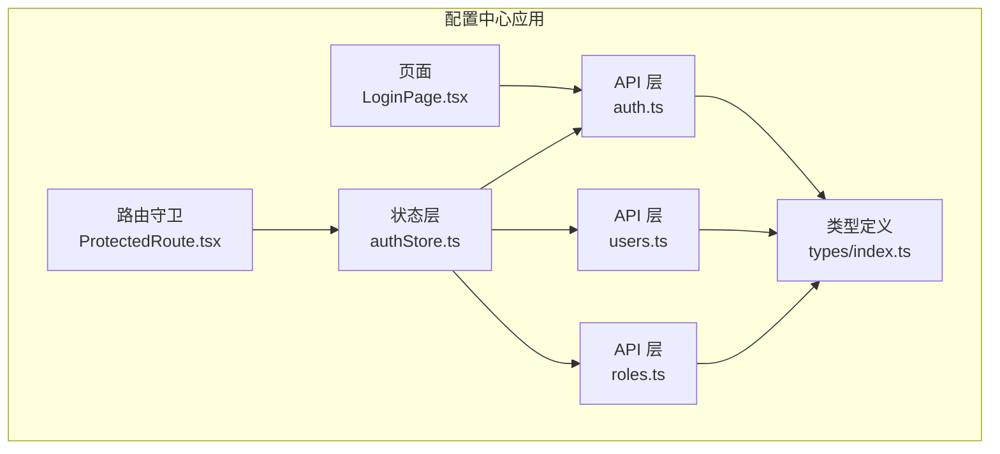
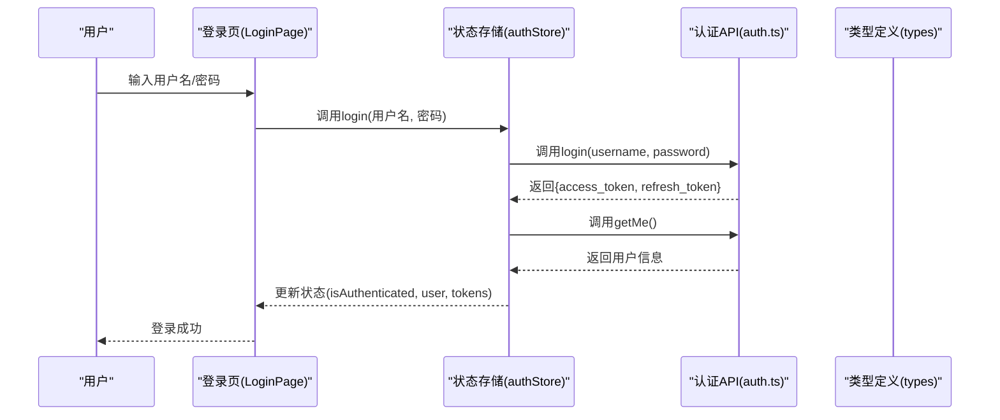
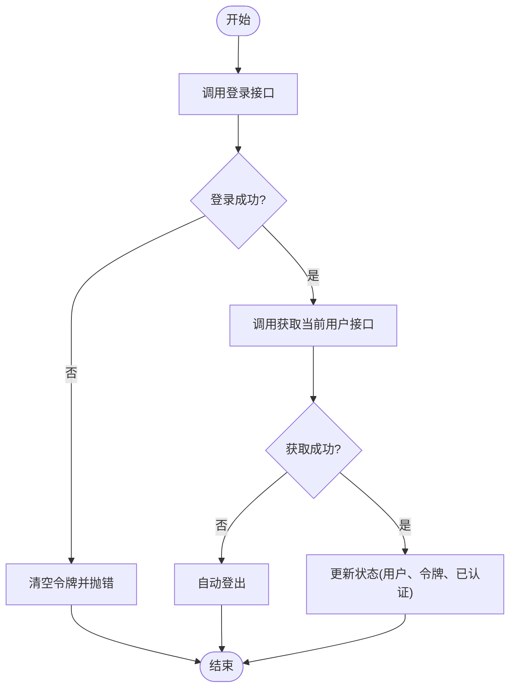
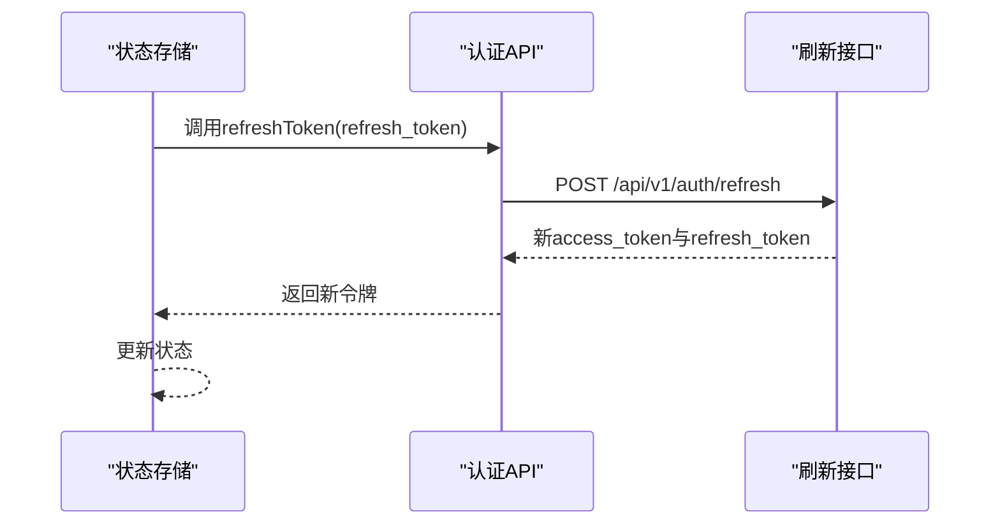
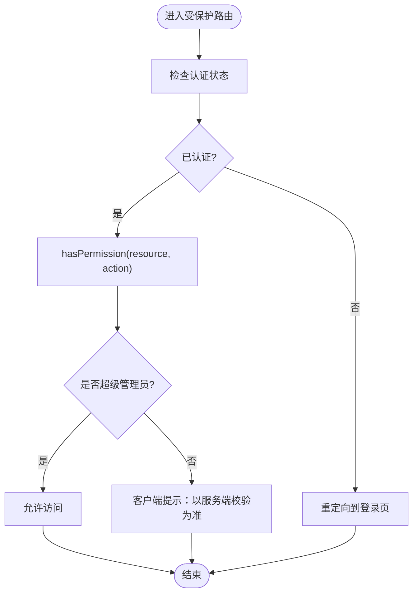
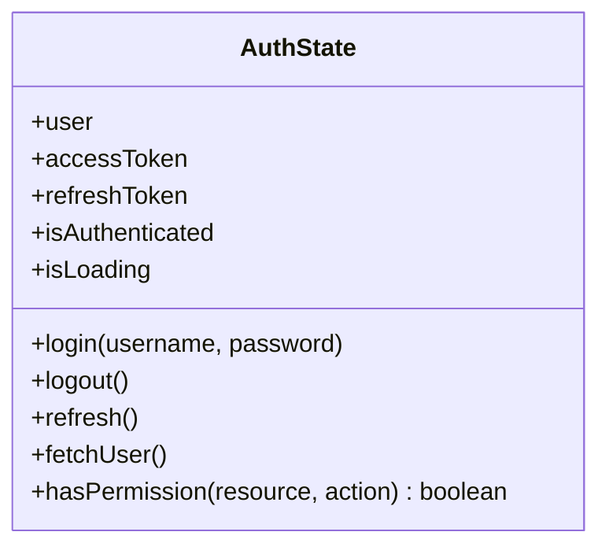
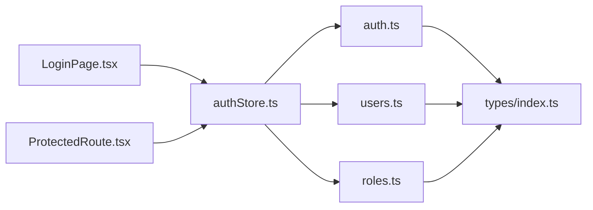

# 认证授权API

<cite>
**本文引用的文件**
- [apps/config-center/src/api/auth.ts](file://apps/config-center/src/api/auth.ts)
- [apps/config-center/src/api/users.ts](file://apps/config-center/src/api/users.ts)
- [apps/config-center/src/api/roles.ts](file://apps/config-center/src/api/roles.ts)
- [apps/config-center/src/store/authStore.ts](file://apps/config-center/src/store/authStore.ts)
- [apps/config-center/src/types/index.ts](file://apps/config-center/src/types/index.ts)
- [apps/config-center/src/pages/LoginPage.tsx](file://apps/config-center/src/pages/LoginPage.tsx)
- [apps/config-center/src/components/ProtectedRoute.tsx](file://apps/config-center/src/components/ProtectedRoute.tsx)
</cite>

## 目录
1. [简介](#简介)
2. [项目结构](#项目结构)
3. [核心组件](#核心组件)
4. [架构总览](#架构总览)
5. [详细组件分析](#详细组件分析)
6. [依赖关系分析](#依赖关系分析)
7. [性能考虑](#性能考虑)
8. [故障排除指南](#故障排除指南)
9. [结论](#结论)
10. [附录](#附录)

## 简介
本文件为认证授权系统的API文档，覆盖以下能力与接口：
- JWT认证：登录、令牌刷新、当前用户信息查询
- RBAC权限控制：基于角色的资源访问控制（含超级管理员豁免）
- 用户与角色管理：用户列表、详情、创建、更新、删除；角色列表、详情、创建、更新、删除
- 客户端状态管理：基于Zustand的状态持久化与权限提示

文档同时说明认证流程、令牌格式、过期策略与安全机制，并提供多种认证方式的使用示例（Bearer Token、API Key、Session Cookie）及异常处理建议。

## 项目结构
认证授权相关代码集中在配置中心应用中，主要由API层、状态管理层与类型定义组成：
- API层：封装HTTP请求，暴露登录、刷新、用户与角色管理等方法
- 状态管理层：使用Zustand管理用户会话、令牌与权限判断
- 类型定义：统一响应与请求数据结构
- 页面与路由：登录页、受保护路由组件

**图表来源**
- [apps/config-center/src/api/auth.ts:1-15](file://apps/config-center/src/api/auth.ts#L1-L15)
- [apps/config-center/src/api/users.ts:1-26](file://apps/config-center/src/api/users.ts#L1-L26)
- [apps/config-center/src/api/roles.ts:1-26](file://apps/config-center/src/api/roles.ts#L1-L26)
- [apps/config-center/src/store/authStore.ts:1-108](file://apps/config-center/src/store/authStore.ts#L1-L108)
- [apps/config-center/src/types/index.ts](file://apps/config-center/src/types/index.ts)
- [apps/config-center/src/pages/LoginPage.tsx](file://apps/config-center/src/pages/LoginPage.tsx)
- [apps/config-center/src/components/ProtectedRoute.tsx](file://apps/config-center/src/components/ProtectedRoute.tsx)

**章节来源**
- [apps/config-center/src/api/auth.ts:1-15](file://apps/config-center/src/api/auth.ts#L1-L15)
- [apps/config-center/src/api/users.ts:1-26](file://apps/config-center/src/api/users.ts#L1-L26)
- [apps/config-center/src/api/roles.ts:1-26](file://apps/config-center/src/api/roles.ts#L1-L26)
- [apps/config-center/src/store/authStore.ts:1-108](file://apps/config-center/src/store/authStore.ts#L1-L108)
- [apps/config-center/src/types/index.ts](file://apps/config-center/src/types/index.ts)

## 核心组件
- 认证API模块：提供登录、令牌刷新、获取当前用户信息
- 用户管理API模块：提供用户增删改查
- 角色管理API模块：提供角色增删改查
- 认证状态存储：负责登录态、令牌、用户信息与权限判断
- 类型定义：统一响应与请求数据结构

**章节来源**
- [apps/config-center/src/api/auth.ts:1-15](file://apps/config-center/src/api/auth.ts#L1-L15)
- [apps/config-center/src/api/users.ts:1-26](file://apps/config-center/src/api/users.ts#L1-L26)
- [apps/config-center/src/api/roles.ts:1-26](file://apps/config-center/src/api/roles.ts#L1-L26)
- [apps/config-center/src/store/authStore.ts:1-108](file://apps/config-center/src/store/authStore.ts#L1-L108)
- [apps/config-center/src/types/index.ts](file://apps/config-center/src/types/index.ts)

## 架构总览
认证授权系统采用前端直连后端的模式，通过API层发起HTTP请求，状态层维护会话与权限，页面与路由组件消费状态层数据。

**图表来源**
- [apps/config-center/src/pages/LoginPage.tsx](file://apps/config-center/src/pages/LoginPage.tsx)
- [apps/config-center/src/store/authStore.ts:29-46](file://apps/config-center/src/store/authStore.ts#L29-L46)
- [apps/config-center/src/api/auth.ts:4-14](file://apps/config-center/src/api/auth.ts#L4-L14)
- [apps/config-center/src/types/index.ts](file://apps/config-center/src/types/index.ts)

## 详细组件分析

### 认证API模块
- 接口概览
  - POST /api/v1/auth/token：用户名+密码登录，返回access_token与refresh_token
  - POST /api/v1/auth/refresh：使用refresh_token刷新access_token
  - GET /api/v1/auth/me：获取当前登录用户信息
- 数据模型
  - 请求参数：登录时以表单形式提交用户名与密码；刷新时以JSON提交refresh_token
  - 响应模型：登录与刷新返回包含access_token与refresh_token的对象；获取当前用户返回用户对象
- 错误处理
  - 登录失败或令牌无效时，状态层清空令牌并抛出错误
  - 刷新失败时，自动登出
  - 获取用户信息失败时，自动登出

**图表来源**
- [apps/config-center/src/store/authStore.ts:29-46](file://apps/config-center/src/store/authStore.ts#L29-L46)
- [apps/config-center/src/api/auth.ts:4-14](file://apps/config-center/src/api/auth.ts#L4-L14)

**章节来源**
- [apps/config-center/src/api/auth.ts:1-15](file://apps/config-center/src/api/auth.ts#L1-L15)
- [apps/config-center/src/store/authStore.ts:29-46](file://apps/config-center/src/store/authStore.ts#L29-L46)

### 令牌刷新流程
- 触发条件：access_token即将过期或服务端返回401
- 流程：使用本地保存的refresh_token调用刷新接口，替换新的access_token与refresh_token
- 异常：刷新失败则自动登出，清除所有令牌

**图表来源**
- [apps/config-center/src/store/authStore.ts:57-73](file://apps/config-center/src/store/authStore.ts#L57-L73)
- [apps/config-center/src/api/auth.ts:8-10](file://apps/config-center/src/api/auth.ts#L8-L10)

**章节来源**
- [apps/config-center/src/store/authStore.ts:57-73](file://apps/config-center/src/store/authStore.ts#L57-L73)
- [apps/config-center/src/api/auth.ts:8-10](file://apps/config-center/src/api/auth.ts#L8-L10)

### RBAC权限控制
- 权限模型
  - 超级管理员拥有全部权限，客户端侧默认放行
  - 普通用户权限由服务端严格校验，客户端仅做UI提示
- 权限判断
  - hasPermission(resource, action)：若用户角色包含超级管理员，则直接返回true；否则返回true用于UI显示，实际权限以服务端为准
- 路由保护
  - 受保护路由在渲染前检查认证状态，未认证则重定向至登录页

**图表来源**
- [apps/config-center/src/store/authStore.ts:84-95](file://apps/config-center/src/store/authStore.ts#L84-L95)
- [apps/config-center/src/components/ProtectedRoute.tsx](file://apps/config-center/src/components/ProtectedRoute.tsx)

**章节来源**
- [apps/config-center/src/store/authStore.ts:84-95](file://apps/config-center/src/store/authStore.ts#L84-L95)
- [apps/config-center/src/components/ProtectedRoute.tsx](file://apps/config-center/src/components/ProtectedRoute.tsx)

### 用户管理API模块
- 接口概览
  - GET /api/v1/users：分页列出用户
  - GET /api/v1/users/{id}：获取指定用户详情
  - POST /api/v1/users：创建用户
  - PUT /api/v1/users/{id}：更新用户
  - DELETE /api/v1/users/{id}：删除用户
- 数据模型
  - 请求体与响应体遵循统一的用户类型定义

**章节来源**
- [apps/config-center/src/api/users.ts:1-26](file://apps/config-center/src/api/users.ts#L1-L26)
- [apps/config-center/src/types/index.ts](file://apps/config-center/src/types/index.ts)

### 角色管理API模块
- 接口概览
  - GET /api/v1/roles：分页列出角色
  - GET /api/v1/roles/{id}：获取指定角色详情
  - POST /api/v1/roles：创建角色
  - PUT /api/v1/roles/{id}：更新角色
  - DELETE /api/v1/roles/{id}：删除角色
- 数据模型
  - 请求体与响应体遵循统一的角色类型定义

**章节来源**
- [apps/config-center/src/api/roles.ts:1-26](file://apps/config-center/src/api/roles.ts#L1-L26)
- [apps/config-center/src/types/index.ts](file://apps/config-center/src/types/index.ts)

### 状态管理与持久化
- 状态字段
  - user：当前用户信息
  - accessToken：访问令牌
  - refreshToken：刷新令牌
  - isAuthenticated：是否已认证
  - isLoading：登录中状态
- 行为
  - login：登录成功后保存令牌并拉取用户信息
  - refresh：使用refresh_token刷新access_token
  - logout：清空所有认证状态
  - fetchUser：重新拉取用户信息
  - hasPermission：超级管理员直接放行，其他用户默认放行（仅UI提示）

**图表来源**
- [apps/config-center/src/store/authStore.ts:6-18](file://apps/config-center/src/store/authStore.ts#L6-L18)

**章节来源**
- [apps/config-center/src/store/authStore.ts:1-108](file://apps/config-center/src/store/authStore.ts#L1-L108)

## 依赖关系分析
- 组件耦合
  - 页面(LoginPage)依赖状态存储(authStore)
  - 状态存储依赖认证API(auth.ts)与用户/角色API(users.ts, roles.ts)
  - 所有API模块依赖类型定义(types/index.ts)
  - 路由守卫(ProtectedRoute)依赖状态存储
- 外部依赖
  - Zustand：状态管理与持久化
  - 类型系统：TypeScript类型定义

**图表来源**
- [apps/config-center/src/pages/LoginPage.tsx](file://apps/config-center/src/pages/LoginPage.tsx)
- [apps/config-center/src/store/authStore.ts:1-108](file://apps/config-center/src/store/authStore.ts#L1-L108)
- [apps/config-center/src/api/auth.ts:1-15](file://apps/config-center/src/api/auth.ts#L1-L15)
- [apps/config-center/src/api/users.ts:1-26](file://apps/config-center/src/api/users.ts#L1-L26)
- [apps/config-center/src/api/roles.ts:1-26](file://apps/config-center/src/api/roles.ts#L1-L26)
- [apps/config-center/src/types/index.ts](file://apps/config-center/src/types/index.ts)
- [apps/config-center/src/components/ProtectedRoute.tsx](file://apps/config-center/src/components/ProtectedRoute.tsx)

**章节来源**
- [apps/config-center/src/store/authStore.ts:1-108](file://apps/config-center/src/store/authStore.ts#L1-L108)
- [apps/config-center/src/api/auth.ts:1-15](file://apps/config-center/src/api/auth.ts#L1-L15)
- [apps/config-center/src/api/users.ts:1-26](file://apps/config-center/src/api/users.ts#L1-L26)
- [apps/config-center/src/api/roles.ts:1-26](file://apps/config-center/src/api/roles.ts#L1-L26)
- [apps/config-center/src/types/index.ts](file://apps/config-center/src/types/index.ts)
- [apps/config-center/src/components/ProtectedRoute.tsx](file://apps/config-center/src/components/ProtectedRoute.tsx)

## 性能考虑
- 令牌持久化：使用Zustand中间件持久化令牌与认证状态，减少重复登录开销
- UI提示优化：hasPermission默认放行避免不必要的UI隐藏，提升交互体验
- 网络请求：批量操作建议合并请求，减少往返次数
- 缓存策略：对只读数据（如角色列表）可引入缓存，降低服务器压力

## 故障排除指南
- 登录失败
  - 检查用户名/密码是否正确
  - 确认网络连接与后端服务可用性
  - 查看浏览器控制台与网络面板
- 令牌过期
  - 自动触发刷新流程；若刷新失败，将自动登出
  - 检查refresh_token是否有效
- 权限不足
  - 确认用户角色是否包含超级管理员
  - 实际权限以服务端校验为准，客户端仅作UI提示
- 路由无法访问
  - 检查认证状态；未认证将被重定向至登录页

**章节来源**
- [apps/config-center/src/store/authStore.ts:40-45](file://apps/config-center/src/store/authStore.ts#L40-L45)
- [apps/config-center/src/store/authStore.ts:63-72](file://apps/config-center/src/store/authStore.ts#L63-L72)
- [apps/config-center/src/store/authStore.ts:75-81](file://apps/config-center/src/store/authStore.ts#L75-L81)
- [apps/config-center/src/components/ProtectedRoute.tsx](file://apps/config-center/src/components/ProtectedRoute.tsx)

## 结论
该认证授权系统提供了完整的JWT认证、令牌刷新与RBAC权限控制能力，并通过状态层实现会话管理与权限提示。用户与角色管理API为后台治理提供基础支撑。建议在生产环境中结合HTTPS、CORS策略与严格的令牌过期策略，确保安全性与稳定性。

## 附录

### API规范总览
- 认证
  - POST /api/v1/auth/token：用户名+密码登录
  - POST /api/v1/auth/refresh：刷新访问令牌
  - GET /api/v1/auth/me：获取当前用户信息
- 用户管理
  - GET /api/v1/users：分页列出用户
  - GET /api/v1/users/{id}：获取用户详情
  - POST /api/v1/users：创建用户
  - PUT /api/v1/users/{id}：更新用户
  - DELETE /api/v1/users/{id}：删除用户
- 角色管理
  - GET /api/v1/roles：分页列出角色
  - GET /api/v1/roles/{id}：获取角色详情
  - POST /api/v1/roles：创建角色
  - PUT /api/v1/roles/{id}：更新角色
  - DELETE /api/v1/roles/{id}：删除角色

**章节来源**
- [apps/config-center/src/api/auth.ts:1-15](file://apps/config-center/src/api/auth.ts#L1-L15)
- [apps/config-center/src/api/users.ts:1-26](file://apps/config-center/src/api/users.ts#L1-L26)
- [apps/config-center/src/api/roles.ts:1-26](file://apps/config-center/src/api/roles.ts#L1-L26)

### 认证流程与令牌格式
- 认证流程
  - 用户输入凭据 → 登录接口返回令牌 → 保存令牌 → 拉取用户信息 → 更新状态
  - 访问令牌过期 → 使用刷新令牌 → 替换新令牌
- 令牌格式
  - 访问令牌(access_token)：用于API请求的身份标识
  - 刷新令牌(refresh_token)：用于换取新的访问令牌
- 过期策略
  - 访问令牌过期时自动尝试刷新；刷新失败则登出
- 安全机制
  - 超级管理员拥有全部权限
  - 普通用户的权限以服务端校验为准，客户端仅作UI提示

**章节来源**
- [apps/config-center/src/store/authStore.ts:29-46](file://apps/config-center/src/store/authStore.ts#L29-L46)
- [apps/config-center/src/store/authStore.ts:57-73](file://apps/config-center/src/store/authStore.ts#L57-L73)
- [apps/config-center/src/store/authStore.ts:84-95](file://apps/config-center/src/store/authStore.ts#L84-L95)

### 使用示例
- Bearer Token
  - 在请求头Authorization中携带访问令牌
- API Key
  - 在请求头X-API-Key中携带API Key
- Session Cookie
  - 通过浏览器Cookie维持会话（需后端支持）

说明：以上示例为通用实践，具体实现请参考后端接口与安全策略。

### 安全最佳实践
- 传输安全：启用HTTPS，防止令牌泄露
- 存储安全：仅在内存中保存敏感令牌，避免持久化明文
- 过期策略：合理设置访问令牌与刷新令牌有效期
- 权限最小化：RBAC按需分配，避免过度授权
- 日志审计：记录关键认证事件，便于追踪与审计