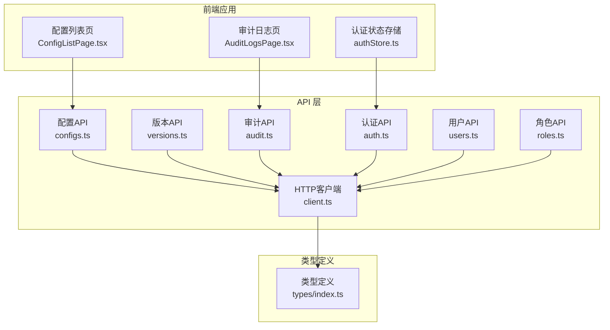
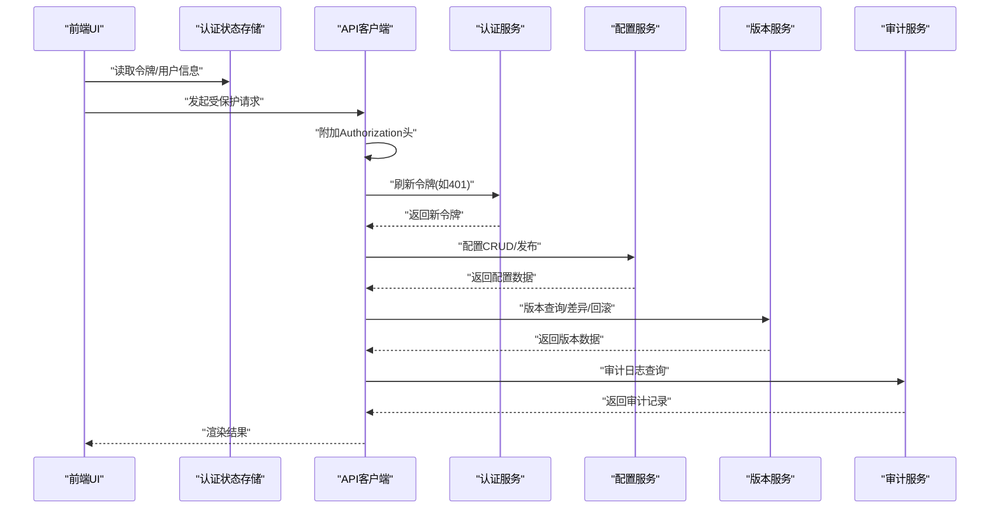
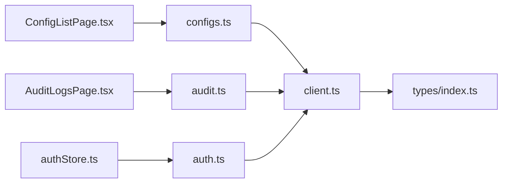

# 配置中心API

<cite>
**本文引用的文件**
- [apps/config-center/src/api/configs.ts](file://apps/config-center/src/api/configs.ts)
- [apps/config-center/src/api/versions.ts](file://apps/config-center/src/api/versions.ts)
- [apps/config-center/src/api/audit.ts](file://apps/config-center/src/api/audit.ts)
- [apps/config-center/src/api/auth.ts](file://apps/config-center/src/api/auth.ts)
- [apps/config-center/src/api/users.ts](file://apps/config-center/src/api/users.ts)
- [apps/config-center/src/api/roles.ts](file://apps/config-center/src/api/roles.ts)
- [apps/config-center/src/api/client.ts](file://apps/config-center/src/api/client.ts)
- [apps/config-center/src/types/index.ts](file://apps/config-center/src/types/index.ts)
- [apps/config-center/src/pages/ConfigListPage.tsx](file://apps/config-center/src/pages/ConfigListPage.tsx)
- [apps/config-center/src/pages/AuditLogsPage.tsx](file://apps/config-center/src/pages/AuditLogsPage.tsx)
- [apps/config-center/src/store/authStore.ts](file://apps/config-center/src/store/authStore.ts)
</cite>

## 目录
1. [简介](#简介)
2. [项目结构](#项目结构)
3. [核心组件](#核心组件)
4. [架构总览](#架构总览)
5. [详细组件分析](#详细组件分析)
6. [依赖关系分析](#依赖关系分析)
7. [性能考虑](#性能考虑)
8. [故障排查指南](#故障排查指南)
9. [结论](#结论)
10. [附录](#附录)

## 简介
本文件为“配置中心API”的完整RESTful接口文档，覆盖配置项的CRUD、版本控制与回滚、审计日志查询、用户与角色管理、认证与授权流程，并给出认证要求、权限控制、数据校验规则、请求/响应示例以及同步与冲突处理策略建议。本文档面向前后端开发者与运维人员，帮助快速理解与集成配置中心能力。

## 项目结构
配置中心前端采用模块化组织，API层通过统一客户端封装HTTP请求；类型定义集中于types模块；页面组件负责业务交互；状态管理用于认证态维护。

图表来源
- [apps/config-center/src/pages/ConfigListPage.tsx:1-178](file://apps/config-center/src/pages/ConfigListPage.tsx#L1-L178)
- [apps/config-center/src/pages/AuditLogsPage.tsx:1-162](file://apps/config-center/src/pages/AuditLogsPage.tsx#L1-L162)
- [apps/config-center/src/store/authStore.ts:1-108](file://apps/config-center/src/store/authStore.ts#L1-L108)
- [apps/config-center/src/api/configs.ts:1-33](file://apps/config-center/src/api/configs.ts#L1-L33)
- [apps/config-center/src/api/versions.ts:1-29](file://apps/config-center/src/api/versions.ts#L1-L29)
- [apps/config-center/src/api/audit.ts:1-18](file://apps/config-center/src/api/audit.ts#L1-L18)
- [apps/config-center/src/api/auth.ts:1-15](file://apps/config-center/src/api/auth.ts#L1-L15)
- [apps/config-center/src/api/users.ts:1-26](file://apps/config-center/src/api/users.ts#L1-L26)
- [apps/config-center/src/api/roles.ts:1-26](file://apps/config-center/src/api/roles.ts#L1-L26)
- [apps/config-center/src/api/client.ts:1-172](file://apps/config-center/src/api/client.ts#L1-L172)
- [apps/config-center/src/types/index.ts:1-163](file://apps/config-center/src/types/index.ts#L1-L163)

章节来源
- [apps/config-center/src/api/configs.ts:1-33](file://apps/config-center/src/api/configs.ts#L1-L33)
- [apps/config-center/src/api/versions.ts:1-29](file://apps/config-center/src/api/versions.ts#L1-L29)
- [apps/config-center/src/api/audit.ts:1-18](file://apps/config-center/src/api/audit.ts#L1-L18)
- [apps/config-center/src/api/auth.ts:1-15](file://apps/config-center/src/api/auth.ts#L1-L15)
- [apps/config-center/src/api/users.ts:1-26](file://apps/config-center/src/api/users.ts#L1-L26)
- [apps/config-center/src/api/roles.ts:1-26](file://apps/config-center/src/api/roles.ts#L1-L26)
- [apps/config-center/src/api/client.ts:1-172](file://apps/config-center/src/api/client.ts#L1-L172)
- [apps/config-center/src/types/index.ts:1-163](file://apps/config-center/src/types/index.ts#L1-L163)
- [apps/config-center/src/pages/ConfigListPage.tsx:1-178](file://apps/config-center/src/pages/ConfigListPage.tsx#L1-L178)
- [apps/config-center/src/pages/AuditLogsPage.tsx:1-162](file://apps/config-center/src/pages/AuditLogsPage.tsx#L1-L162)
- [apps/config-center/src/store/authStore.ts:1-108](file://apps/config-center/src/store/authStore.ts#L1-L108)

## 核心组件
- 统一HTTP客户端：封装鉴权头、自动刷新令牌、错误处理与重试逻辑。
- 配置API：提供配置项的分页查询、详情、创建、更新、删除、发布。
- 版本API：提供版本列表、指定版本详情、版本差异对比、回滚到指定版本。
- 审计API：提供审计日志的条件查询与详情。
- 认证API：登录、刷新令牌、获取当前用户信息。
- 用户/角色API：用户与角色的CRUD。
- 类型系统：统一定义枚举与请求/响应模型。

章节来源
- [apps/config-center/src/api/client.ts:1-172](file://apps/config-center/src/api/client.ts#L1-L172)
- [apps/config-center/src/api/configs.ts:1-33](file://apps/config-center/src/api/configs.ts#L1-L33)
- [apps/config-center/src/api/versions.ts:1-29](file://apps/config-center/src/api/versions.ts#L1-L29)
- [apps/config-center/src/api/audit.ts:1-18](file://apps/config-center/src/api/audit.ts#L1-L18)
- [apps/config-center/src/api/auth.ts:1-15](file://apps/config-center/src/api/auth.ts#L1-L15)
- [apps/config-center/src/api/users.ts:1-26](file://apps/config-center/src/api/users.ts#L1-L26)
- [apps/config-center/src/api/roles.ts:1-26](file://apps/config-center/src/api/roles.ts#L1-L26)
- [apps/config-center/src/types/index.ts:1-163](file://apps/config-center/src/types/index.ts#L1-L163)

## 架构总览
下图展示从前端调用到后端服务的整体链路，以及认证与鉴权在其中的位置。

图表来源
- [apps/config-center/src/store/authStore.ts:1-108](file://apps/config-center/src/store/authStore.ts#L1-L108)
- [apps/config-center/src/api/client.ts:1-172](file://apps/config-center/src/api/client.ts#L1-L172)
- [apps/config-center/src/api/auth.ts:1-15](file://apps/config-center/src/api/auth.ts#L1-L15)
- [apps/config-center/src/api/configs.ts:1-33](file://apps/config-center/src/api/configs.ts#L1-L33)
- [apps/config-center/src/api/versions.ts:1-29](file://apps/config-center/src/api/versions.ts#L1-L29)
- [apps/config-center/src/api/audit.ts:1-18](file://apps/config-center/src/api/audit.ts#L1-L18)

## 详细组件分析

### 认证与授权
- 登录
  - 方法与路径：POST /api/v1/auth/token
  - 表单字段：username, password
  - 成功响应：access_token, refresh_token, token_type
  - 失败响应：错误码与错误信息
- 刷新令牌
  - 方法与路径：POST /api/v1/auth/refresh
  - 请求体：refresh_token
  - 成功响应：新的access_token与refresh_token
- 获取当前用户
  - 方法与路径：GET /api/v1/auth/me
  - 成功响应：用户信息（含角色ID）
- 前端行为
  - 自动在请求头中携带 Bearer 令牌
  - 401时尝试刷新令牌，失败则清空本地认证并跳转登录页
  - 认证状态持久化于本地存储

章节来源
- [apps/config-center/src/api/auth.ts:1-15](file://apps/config-center/src/api/auth.ts#L1-L15)
- [apps/config-center/src/api/client.ts:1-172](file://apps/config-center/src/api/client.ts#L1-L172)
- [apps/config-center/src/store/authStore.ts:1-108](file://apps/config-center/src/store/authStore.ts#L1-L108)

### 配置管理（CRUD）
- 查询配置列表
  - 方法与路径：GET /api/v1/configs
  - 查询参数：environment, service, status, skip, limit
  - 成功响应：配置数组（ConfigResponse[]）
- 获取配置详情
  - 方法与路径：GET /api/v1/configs/{id}
  - 成功响应：单个配置（ConfigResponse）
- 创建配置
  - 方法与路径：POST /api/v1/configs
  - 请求体：ConfigCreate
  - 成功响应：新配置（ConfigResponse）
- 更新配置
  - 方法与路径：PUT /api/v1/configs/{id}
  - 请求体：ConfigUpdate
  - 成功响应：更新后的配置（ConfigResponse）
- 删除配置
  - 方法与路径：DELETE /api/v1/configs/{id}
  - 成功响应：无内容（204）
- 发布配置
  - 方法与路径：POST /api/v1/configs/{id}/publish
  - 成功响应：发布的配置（ConfigResponse）

章节来源
- [apps/config-center/src/api/configs.ts:1-33](file://apps/config-center/src/api/configs.ts#L1-L33)
- [apps/config-center/src/types/index.ts:1-163](file://apps/config-center/src/types/index.ts#L1-L163)

### 版本控制与回滚
- 查询版本列表
  - 方法与路径：GET /api/v1/configs/{configId}/versions
  - 查询参数：skip, limit
  - 成功响应：版本数组（ConfigVersionResponse[]）
- 获取指定版本
  - 方法与路径：GET /api/v1/configs/{configId}/versions/{versionNum}
  - 成功响应：版本详情（ConfigVersionResponse）
- 版本差异对比
  - 方法与路径：GET /api/v1/configs/{configId}/versions/diff/{v1}/to/{v2}
  - 成功响应：差异摘要（VersionDiffResult）
- 回滚到指定版本
  - 方法与路径：POST /api/v1/configs/{configId}/versions/{versionNum}/rollback
  - 成功响应：{message, config_id, new_version}

章节来源
- [apps/config-center/src/api/versions.ts:1-29](file://apps/config-center/src/api/versions.ts#L1-L29)
- [apps/config-center/src/types/index.ts:1-163](file://apps/config-center/src/types/index.ts#L1-L163)

### 审计日志查询
- 查询审计日志
  - 方法与路径：GET /api/v1/audit/logs
  - 查询参数：resource_type, resource_id, actor_id, action, skip, limit
  - 成功响应：审计日志数组（AuditLogResponse[]）
- 获取审计日志详情
  - 方法与路径：GET /api/v1/audit/logs/{logId}
  - 成功响应：单条审计日志（AuditLogResponse）

章节来源
- [apps/config-center/src/api/audit.ts:1-18](file://apps/config-center/src/api/audit.ts#L1-L18)
- [apps/config-center/src/types/index.ts:1-163](file://apps/config-center/src/types/index.ts#L1-L163)

### 用户与角色管理
- 用户
  - 列表/详情/创建/更新/删除：对应 /api/v1/users 与 /api/v1/users/{id}
  - 请求体：UserCreate/UserUpdate/UserResponse
- 角色
  - 列表/详情/创建/更新/删除：对应 /api/v1/roles 与 /api/v1/roles/{id}
  - 请求体：RoleCreate/RoleUpdate/RoleResponse
- 权限控制
  - 超级管理员拥有全部权限；非超级管理员由服务端强制校验，前端仅作UI提示

章节来源
- [apps/config-center/src/api/users.ts:1-26](file://apps/config-center/src/api/users.ts#L1-L26)
- [apps/config-center/src/api/roles.ts:1-26](file://apps/config-center/src/api/roles.ts#L1-L26)
- [apps/config-center/src/types/index.ts:1-163](file://apps/config-center/src/types/index.ts#L1-L163)
- [apps/config-center/src/store/authStore.ts:1-108](file://apps/config-center/src/store/authStore.ts#L1-L108)

### 数据模型与校验规则
- 枚举与类型
  - 环境：development/staging/pre-production/production
  - 值类型：string/number/boolean/json/secret
  - 状态：draft/active/deprecated
  - 变更类型：create/update/delete/rollback
  - 审计动作：config.create/config.update/config.delete/config.publish/config.rollback/user.login/user.logout/role.assign
  - 审计状态：success/failed
- 请求体字段约束
  - 创建配置：key、environment、service、value、value_type 必填；可选 description、tags、status
  - 更新配置：value/value_type/description/tags/status 可选
  - 用户创建/更新：用户名必填；邮箱/显示名可选；可选角色ID数组
  - 角色创建/更新：name、permissions 必填；可选描述与作用域
- 响应字段
  - 所有响应均包含标准字段（如 created_at/updated_at），版本号与变更历史在版本相关接口中体现

章节来源
- [apps/config-center/src/types/index.ts:1-163](file://apps/config-center/src/types/index.ts#L1-L163)

### 错误处理与状态码
- 常见状态码
  - 200：成功
  - 204：删除成功（无内容）
  - 400：请求参数或格式错误
  - 401：未认证或令牌无效
  - 403：权限不足
  - 404：资源不存在
  - 500：服务器内部错误
- 客户端错误对象
  - 包含 status、message、details 字段，便于前端展示与定位

章节来源
- [apps/config-center/src/api/client.ts:1-172](file://apps/config-center/src/api/client.ts#L1-L172)

### 请求/响应示例（路径指引）
- 登录
  - 请求：POST /api/v1/auth/token（表单：username, password）
  - 成功：返回 access_token、refresh_token、token_type
  - 失败：返回错误码与错误信息
- 查询配置列表
  - 请求：GET /api/v1/configs?environment=...&service=...&status=...&skip=...&limit=...
  - 成功：返回配置数组
- 创建配置
  - 请求：POST /api/v1/configs（Body：ConfigCreate）
  - 成功：返回新配置
- 发布配置
  - 请求：POST /api/v1/configs/{id}/publish
  - 成功：返回已发布配置
- 查询版本差异
  - 请求：GET /api/v1/configs/{configId}/versions/diff/{v1}/to/{v2}
  - 成功：返回差异摘要
- 回滚到版本
  - 请求：POST /api/v1/configs/{configId}/versions/{versionNum}/rollback
  - 成功：返回 {message, config_id, new_version}
- 审计日志查询
  - 请求：GET /api/v1/audit/logs?action=...&resource_type=...&resource_id=...&skip=...&limit=...
  - 成功：返回审计日志数组

章节来源
- [apps/config-center/src/api/auth.ts:1-15](file://apps/config-center/src/api/auth.ts#L1-L15)
- [apps/config-center/src/api/configs.ts:1-33](file://apps/config-center/src/api/configs.ts#L1-L33)
- [apps/config-center/src/api/versions.ts:1-29](file://apps/config-center/src/api/versions.ts#L1-L29)
- [apps/config-center/src/api/audit.ts:1-18](file://apps/config-center/src/api/audit.ts#L1-L18)

### 同步机制、实时推送与冲突处理策略
- 同步机制
  - 建议：客户端轮询或WebSocket订阅配置变更事件，结合版本号与时间戳进行增量同步。
- 实时推送
  - 建议：后端向客户端推送配置变更通知（含变更类型、目标版本号、变更摘要）。
- 冲突处理
  - 建议：客户端在写入前拉取最新版本，比较本地与远端差异，采用“最后写入获胜”或“合并策略”，并在冲突时提示用户选择保留版本。
- 审计与回滚
  - 建议：所有变更均记录审计日志，支持按资源与动作筛选；提供一键回滚到历史版本的能力。

[本节为通用实践建议，不直接分析具体文件]

## 依赖关系分析
- 模块耦合
  - 页面组件依赖API模块；API模块依赖HTTP客户端；类型定义被所有模块共享。
- 外部依赖
  - 浏览器原生fetch、本地存储localStorage、第三方UI库与状态库。
- 认证依赖
  - 前端通过本地存储持有令牌，客户端在401时自动刷新并重试。

图表来源
- [apps/config-center/src/pages/ConfigListPage.tsx:1-178](file://apps/config-center/src/pages/ConfigListPage.tsx#L1-L178)
- [apps/config-center/src/pages/AuditLogsPage.tsx:1-162](file://apps/config-center/src/pages/AuditLogsPage.tsx#L1-L162)
- [apps/config-center/src/store/authStore.ts:1-108](file://apps/config-center/src/store/authStore.ts#L1-L108)
- [apps/config-center/src/api/configs.ts:1-33](file://apps/config-center/src/api/configs.ts#L1-L33)
- [apps/config-center/src/api/audit.ts:1-18](file://apps/config-center/src/api/audit.ts#L1-L18)
- [apps/config-center/src/api/auth.ts:1-15](file://apps/config-center/src/api/auth.ts#L1-L15)
- [apps/config-center/src/api/client.ts:1-172](file://apps/config-center/src/api/client.ts#L1-L172)
- [apps/config-center/src/types/index.ts:1-163](file://apps/config-center/src/types/index.ts#L1-L163)

## 性能考虑
- 分页与过滤
  - 使用 skip/limit 控制返回数量；合理设置默认limit，避免一次性拉取过多数据。
- 缓存策略
  - 对只读配置与审计日志进行短期缓存；对版本差异与回滚结果进行局部缓存。
- 并发控制
  - 避免同时发起大量请求；对重复请求进行去重或合并。
- 网络优化
  - 在弱网环境下启用指数退避重试；对大体积配置采用压缩传输（如适用）。

[本节提供通用指导，不直接分析具体文件]

## 故障排查指南
- 401未认证
  - 现象：接口返回401，前端自动刷新令牌后重试；若仍失败则清空本地认证并跳转登录页。
  - 排查：确认refresh_token是否有效；检查网络代理与跨域配置。
- 403权限不足
  - 现象：当前用户角色无相应权限。
  - 排查：确认用户角色与环境/服务作用域；联系管理员分配权限。
- 404资源不存在
  - 现象：访问不存在的配置/版本/日志ID。
  - 排查：核对ID与路径拼写；确认资源是否已被删除。
- 500服务器错误
  - 现象：后端异常。
  - 排查：查看后端日志与追踪ID；检查数据库连接与依赖服务可用性。

章节来源
- [apps/config-center/src/api/client.ts:1-172](file://apps/config-center/src/api/client.ts#L1-L172)

## 结论
本文档系统梳理了配置中心API的端点、参数、响应与错误处理，并给出了认证授权、权限控制、数据校验、同步与冲突处理的实践建议。建议在生产环境中结合审计日志与版本回滚能力，确保变更可追溯、可恢复。

## 附录

### API一览表（端点、方法、说明）
- 认证
  - POST /api/v1/auth/token：登录
  - POST /api/v1/auth/refresh：刷新令牌
  - GET /api/v1/auth/me：获取当前用户
- 配置
  - GET /api/v1/configs：查询配置列表
  - GET /api/v1/configs/{id}：获取配置详情
  - POST /api/v1/configs：创建配置
  - PUT /api/v1/configs/{id}：更新配置
  - DELETE /api/v1/configs/{id}：删除配置
  - POST /api/v1/configs/{id}/publish：发布配置
- 版本
  - GET /api/v1/configs/{configId}/versions：查询版本列表
  - GET /api/v1/configs/{configId}/versions/{versionNum}：获取版本详情
  - GET /api/v1/configs/{configId}/versions/diff/{v1}/to/{v2}：版本差异对比
  - POST /api/v1/configs/{configId}/versions/{versionNum}/rollback：回滚到版本
- 审计
  - GET /api/v1/audit/logs：查询审计日志
  - GET /api/v1/audit/logs/{logId}：获取审计日志详情
- 用户
  - GET /api/v1/users：查询用户列表
  - GET /api/v1/users/{id}：获取用户详情
  - POST /api/v1/users：创建用户
  - PUT /api/v1/users/{id}：更新用户
  - DELETE /api/v1/users/{id}：删除用户
- 角色
  - GET /api/v1/roles：查询角色列表
  - GET /api/v1/roles/{id}：获取角色详情
  - POST /api/v1/roles：创建角色
  - PUT /api/v1/roles/{id}：更新角色
  - DELETE /api/v1/roles/{id}：删除角色

章节来源
- [apps/config-center/src/api/auth.ts:1-15](file://apps/config-center/src/api/auth.ts#L1-L15)
- [apps/config-center/src/api/configs.ts:1-33](file://apps/config-center/src/api/configs.ts#L1-L33)
- [apps/config-center/src/api/versions.ts:1-29](file://apps/config-center/src/api/versions.ts#L1-L29)
- [apps/config-center/src/api/audit.ts:1-18](file://apps/config-center/src/api/audit.ts#L1-L18)
- [apps/config-center/src/api/users.ts:1-26](file://apps/config-center/src/api/users.ts#L1-L26)
- [apps/config-center/src/api/roles.ts:1-26](file://apps/config-center/src/api/roles.ts#L1-L26)