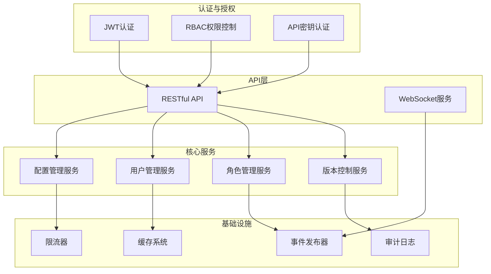
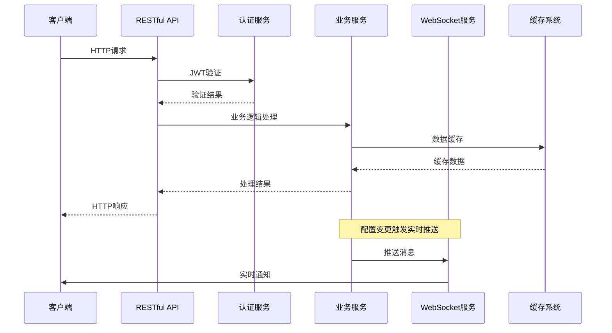
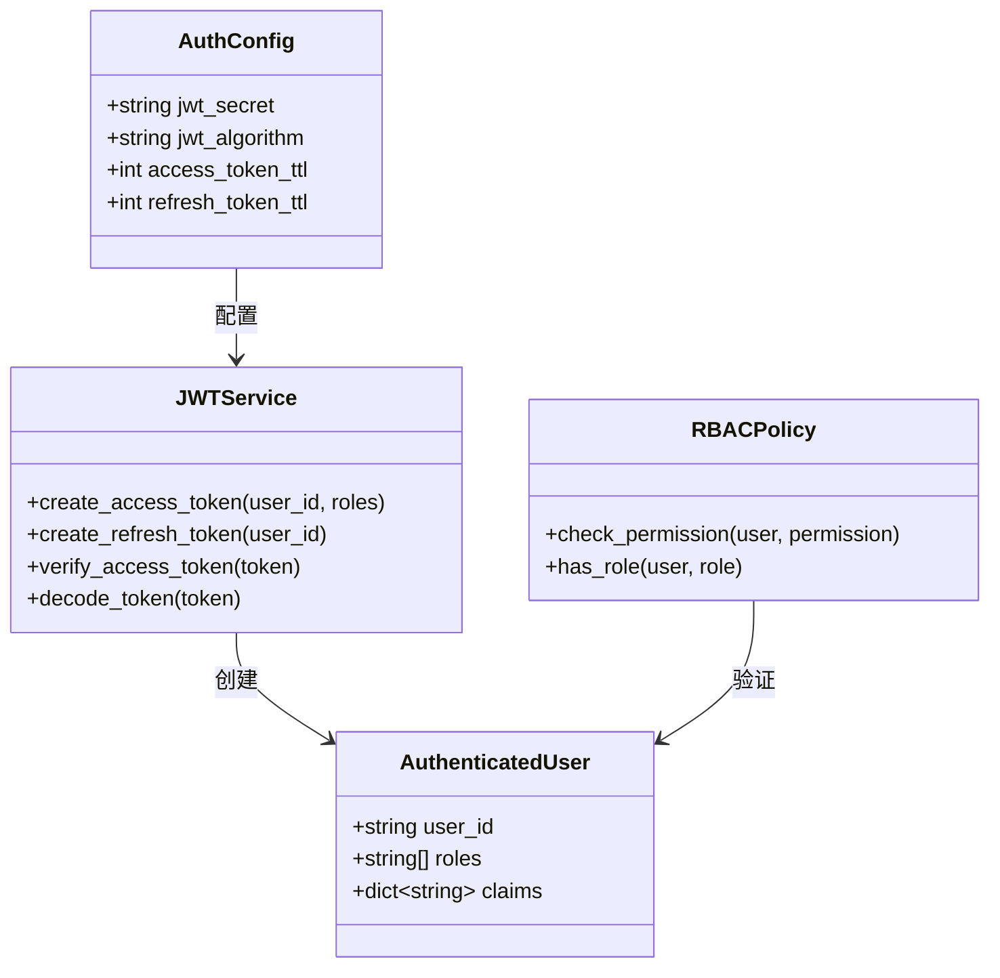
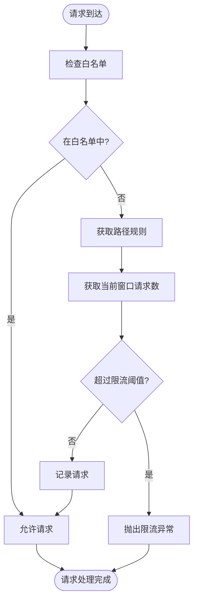
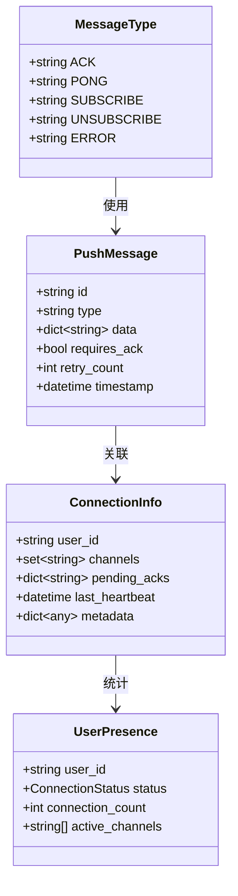
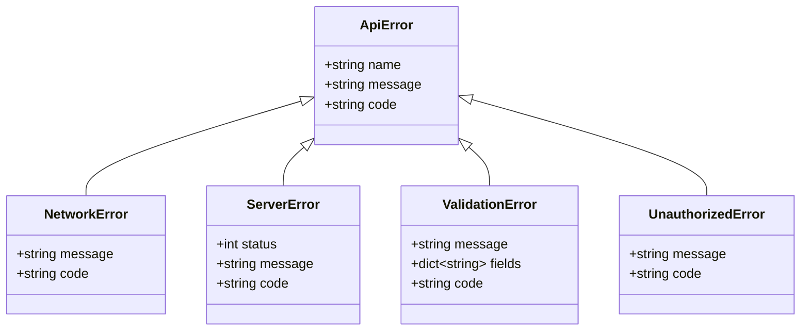
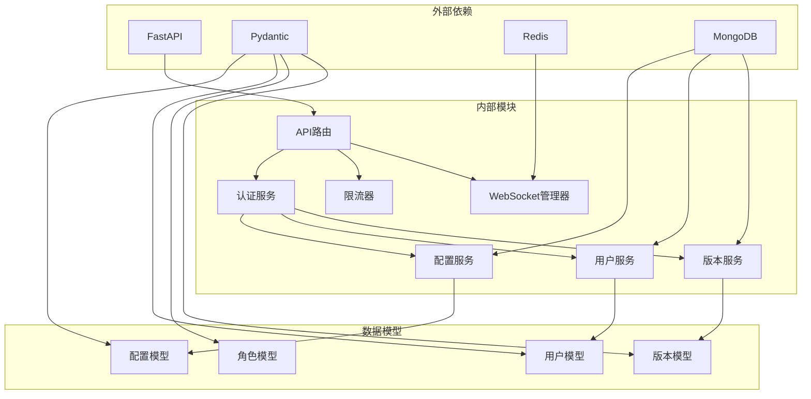

# API参考文档

<cite>
**本文档引用的文件**
- [configs.py](file://tools/flexloop/src/taolib/testing/config_center/server/api/configs.py)
- [users.py](file://tools/flexloop/src/taolib/testing/config_center/server/api/users.py)
- [roles.py](file://tools/flexloop/src/taolib/testing/config_center/server/api/roles.py)
- [versions.py](file://tools/flexloop/src/taolib/testing/config_center/server/api/versions.py)
- [manager.py](file://tools/flexloop/src/taolib/testing/config_center/server/websocket/manager.py)
- [__init__.py](file://tools/flexloop/src/taolib/testing/config_center/server/websocket/__init__.py)
- [auth.py](file://tools/flexloop/src/taolib/testing/auth/__init__.py)
- [limiter.py](file://tools/flexloop/src/taolib/testing/rate_limiter/limiter.py)
- [middleware.py](file://tools/flexloop/src/taolib/testing/rate_limiter/middleware.py)
- [errors.ts](file://src/services/errors.ts)
- [errors.ts](file://apps/AgentPit/src/services/errors.ts)
</cite>

## 目录
1. [简介](#简介)
2. [项目结构](#项目结构)
3. [核心组件](#核心组件)
4. [架构概览](#架构概览)
5. [详细组件分析](#详细组件分析)
6. [依赖关系分析](#依赖关系分析)
7. [性能考虑](#性能考虑)
8. [故障排除指南](#故障排除指南)
9. [结论](#结论)

## 简介

DAOApps项目是一个基于FastAPI构建的企业级配置管理中心，提供了完整的RESTful API和WebSocket实时通信能力。该项目专注于为DAO组织提供去中心化的应用管理和配置服务，支持多环境配置管理、版本控制、实时推送和强大的权限控制系统。

## 项目结构

DAOApps项目采用模块化架构设计，主要包含以下核心模块：

**图表来源**
- [configs.py:1-385](file://tools/flexloop/src/taolib/testing/config_center/server/api/configs.py#L1-L385)
- [users.py:1-272](file://tools/flexloop/src/taolib/testing/config_center/server/api/users.py#L1-L272)
- [roles.py:1-172](file://tools/flexloop/src/taolib/testing/config_center/server/api/roles.py#L1-L172)

**章节来源**
- [configs.py:1-50](file://tools/flexloop/src/taolib/testing/config_center/server/api/configs.py#L1-L50)
- [users.py:1-30](file://tools/flexloop/src/taolib/testing/config_center/server/api/users.py#L1-L30)
- [roles.py:1-20](file://tools/flexloop/src/taolib/testing/config_center/server/api/roles.py#L1-L20)

## 核心组件

### RESTful API端点

DAOApps提供完整的配置管理API，涵盖CRUD操作和版本控制功能：

#### 配置管理API
- **GET /configs** - 获取配置列表，支持环境和服务过滤
- **GET /configs/{config_id}** - 获取配置详情
- **POST /configs** - 创建新配置
- **PUT /configs/{config_id}** - 更新配置
- **DELETE /configs/{config_id}** - 删除配置
- **POST /configs/{config_id}/publish** - 发布配置

#### 用户管理API
- **GET /users** - 获取用户列表
- **GET /users/{user_id}** - 获取用户详情
- **POST /users** - 创建用户
- **PUT /users/{user_id}** - 更新用户
- **DELETE /users/{user_id}** - 删除用户

#### 角色管理API
- **GET /roles** - 获取角色列表
- **GET /roles/{role_id}** - 获取角色详情
- **POST /roles** - 创建角色
- **PUT /roles/{role_id}** - 更新角色
- **DELETE /roles/{role_id}** - 删除角色

#### 版本管理API
- **GET /configs/{config_id}/versions** - 获取版本历史
- **GET /configs/{config_id}/versions/{version_num}** - 获取指定版本
- **POST /configs/{config_id}/versions/{version_num}/rollback** - 回滚到指定版本
- **GET /configs/{config_id}/versions/diff/{v1}/to/{v2}** - 比较版本差异

**章节来源**
- [configs.py:64-385](file://tools/flexloop/src/taolib/testing/config_center/server/api/configs.py#L64-L385)
- [users.py:31-272](file://tools/flexloop/src/taolib/testing/config_center/server/api/users.py#L31-L272)
- [roles.py:15-172](file://tools/flexloop/src/taolib/testing/config_center/server/api/roles.py#L15-L172)
- [versions.py:39-190](file://tools/flexloop/src/taolib/testing/config_center/server/api/versions.py#L39-L190)

### WebSocket实时通信

系统提供高性能的WebSocket实时推送服务，支持：

- **连接管理**：多设备支持、连接池管理
- **频道订阅**：动态订阅和取消订阅
- **消息投递**：ACK确认机制、重传机制
- **心跳检测**：僵尸连接自动清理
- **在线状态**：跨实例在线状态同步

**章节来源**
- [manager.py:28-467](file://tools/flexloop/src/taolib/testing/config_center/server/websocket/manager.py#L28-L467)
- [__init__.py:1-39](file://tools/flexloop/src/taolib/testing/config_center/server/websocket/__init__.py#L1-L39)

## 架构概览

**图表来源**
- [configs.py:218-232](file://tools/flexloop/src/taolib/testing/config_center/server/api/configs.py#L218-L232)
- [manager.py:235-265](file://tools/flexloop/src/taolib/testing/config_center/server/websocket/manager.py#L235-L265)

## 详细组件分析

### 认证与授权系统

#### JWT认证机制
系统采用无状态JWT认证，支持：
- **访问令牌**：短期有效，用于常规API调用
- **刷新令牌**：长期有效，用于获取新的访问令牌
- **令牌黑名单**：支持令牌撤销和登出
- **RBAC权限控制**：基于角色的权限管理

**图表来源**
- [auth.py:1-86](file://tools/flexloop/src/taolib/testing/auth/__init__.py#L1-L86)

**章节来源**
- [auth.py:1-86](file://tools/flexloop/src/taolib/testing/auth/__init__.py#L1-L86)

### 限流器系统

#### 滑动窗口限流算法
系统实现高效的滑动窗口限流，支持：
- **IP白名单**：允许特定IP绕过限流
- **用户白名单**：允许特定用户绕过限流
- **路径规则**：不同路径不同的限流策略
- **方法过滤**：针对不同HTTP方法设置规则

**图表来源**
- [limiter.py:123-178](file://tools/flexloop/src/taolib/testing/rate_limiter/limiter.py#L123-L178)

**章节来源**
- [limiter.py:15-202](file://tools/flexloop/src/taolib/testing/rate_limiter/limiter.py#L15-L202)
- [middleware.py:132-167](file://tools/flexloop/src/taolib/testing/rate_limiter/middleware.py#L132-L167)

### WebSocket消息协议

#### 消息类型定义
系统定义了标准的WebSocket消息格式：

**图表来源**
- [manager.py:15-22](file://tools/flexloop/src/taolib/testing/config_center/server/websocket/manager.py#L15-L22)

**章节来源**
- [manager.py:324-367](file://tools/flexloop/src/taolib/testing/config_center/server/websocket/manager.py#L324-L367)

### 错误处理机制

系统提供统一的错误处理框架：

**图表来源**
- [errors.ts:1-44](file://src/services/errors.ts#L1-L44)

**章节来源**
- [errors.ts:1-44](file://src/services/errors.ts#L1-L44)
- [errors.ts:1-44](file://apps/AgentPit/src/services/errors.ts#L1-L44)

## 依赖关系分析

**图表来源**
- [configs.py:6-25](file://tools/flexloop/src/taolib/testing/config_center/server/api/configs.py#L6-L25)
- [users.py:6-10](file://tools/flexloop/src/taolib/testing/config_center/server/api/users.py#L6-L10)
- [roles.py:6-9](file://tools/flexloop/src/taolib/testing/config_center/server/api/roles.py#L6-L9)

**章节来源**
- [configs.py:6-25](file://tools/flexloop/src/taolib/testing/config_center/server/api/configs.py#L6-L25)
- [users.py:6-10](file://tools/flexloop/src/taolib/testing/config_center/server/api/users.py#L6-L10)
- [roles.py:6-9](file://tools/flexloop/src/taolib/testing/config_center/server/api/roles.py#L6-L9)

## 性能考虑

### 缓存策略
- **配置缓存**：使用Redis缓存热点配置数据
- **用户信息缓存**：缓存用户权限和角色信息
- **版本历史缓存**：缓存常用版本查询结果

### 连接池管理
- **WebSocket连接池**：支持数万级并发连接
- **数据库连接池**：优化数据库连接复用
- **HTTP客户端连接池**：减少连接建立开销

### 异步处理
- **异步API调用**：非阻塞I/O操作
- **后台任务队列**：异步处理耗时操作
- **事件驱动架构**：基于事件的解耦设计

## 故障排除指南

### 常见问题诊断

#### 认证相关问题
- **401未授权**：检查JWT令牌格式和有效期
- **403权限不足**：验证用户角色和权限范围
- **令牌过期**：使用刷新令牌获取新访问令牌

#### 限流相关问题
- **429请求过于频繁**：检查限流配置和客户端重试策略
- **白名单配置错误**：验证IP地址和用户ID格式
- **路径规则不生效**：检查路径匹配和方法过滤配置

#### WebSocket连接问题
- **连接失败**：检查网络连接和服务器状态
- **消息丢失**：验证ACK确认机制和重传配置
- **心跳超时**：检查客户端心跳发送频率

**章节来源**
- [middleware.py:132-167](file://tools/flexloop/src/taolib/testing/rate_limiter/middleware.py#L132-L167)
- [manager.py:423-429](file://tools/flexloop/src/taolib/testing/config_center/server/websocket/manager.py#L423-L429)

## 结论

DAOApps项目提供了一个功能完整、性能优异的企业级配置管理平台。其RESTful API和WebSocket实时通信能力为企业级应用提供了坚实的技术基础。通过完善的认证授权体系、智能的限流机制和高可用的架构设计，DAOApps能够满足各种规模企业的配置管理需求。

系统的设计充分考虑了可扩展性和维护性，为未来的功能扩展和技术演进奠定了良好的基础。无论是小型团队还是大型企业，都可以基于DAOApps快速构建自己的配置管理解决方案。