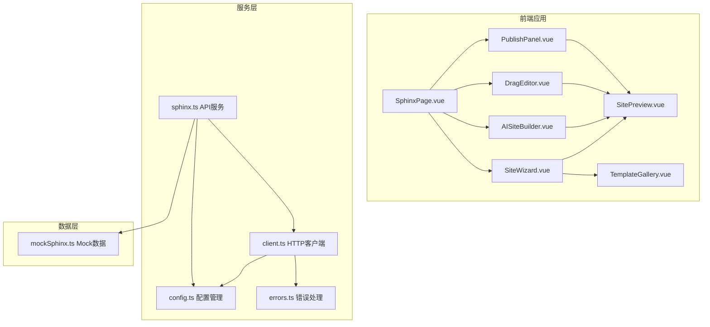
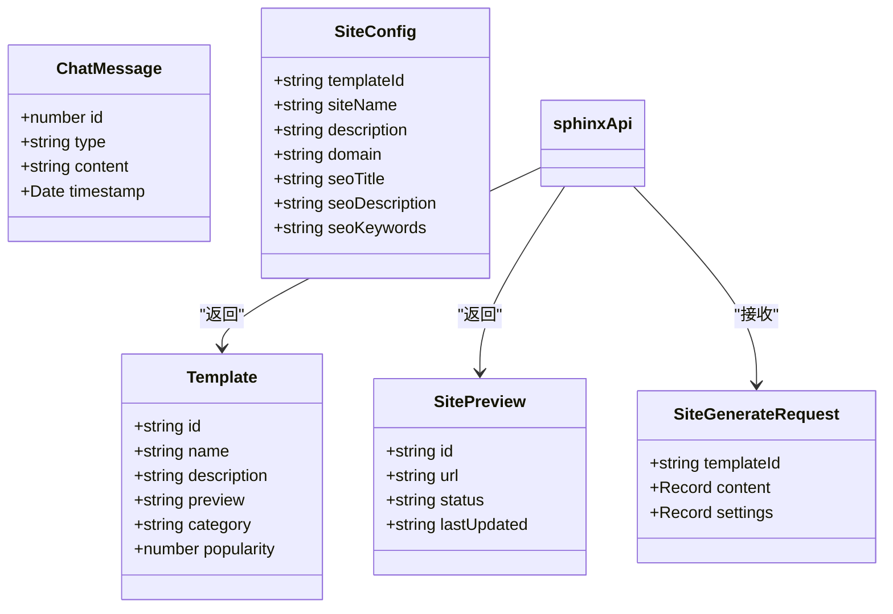
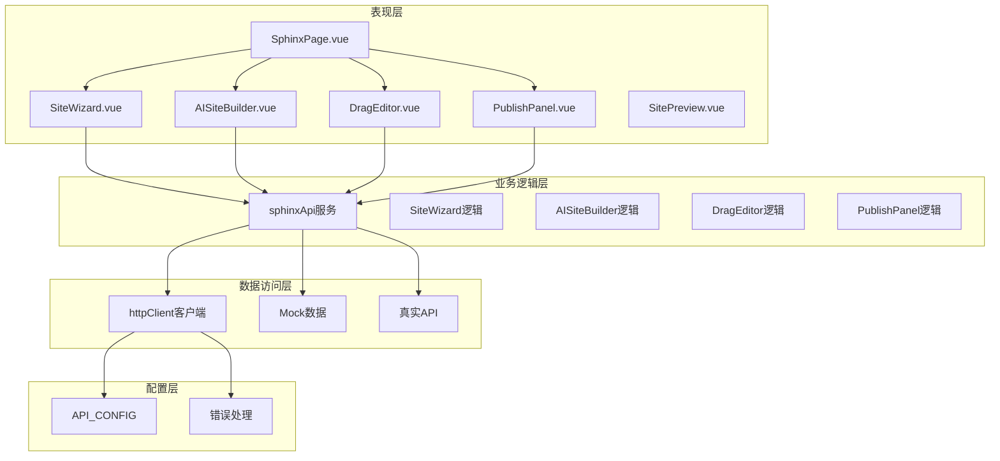
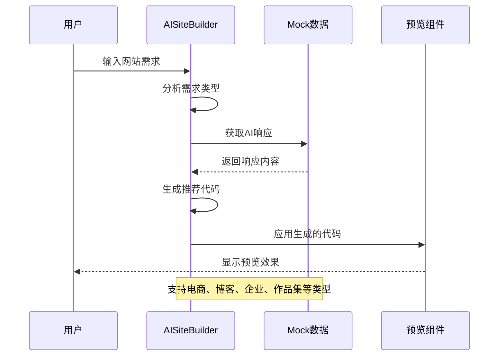
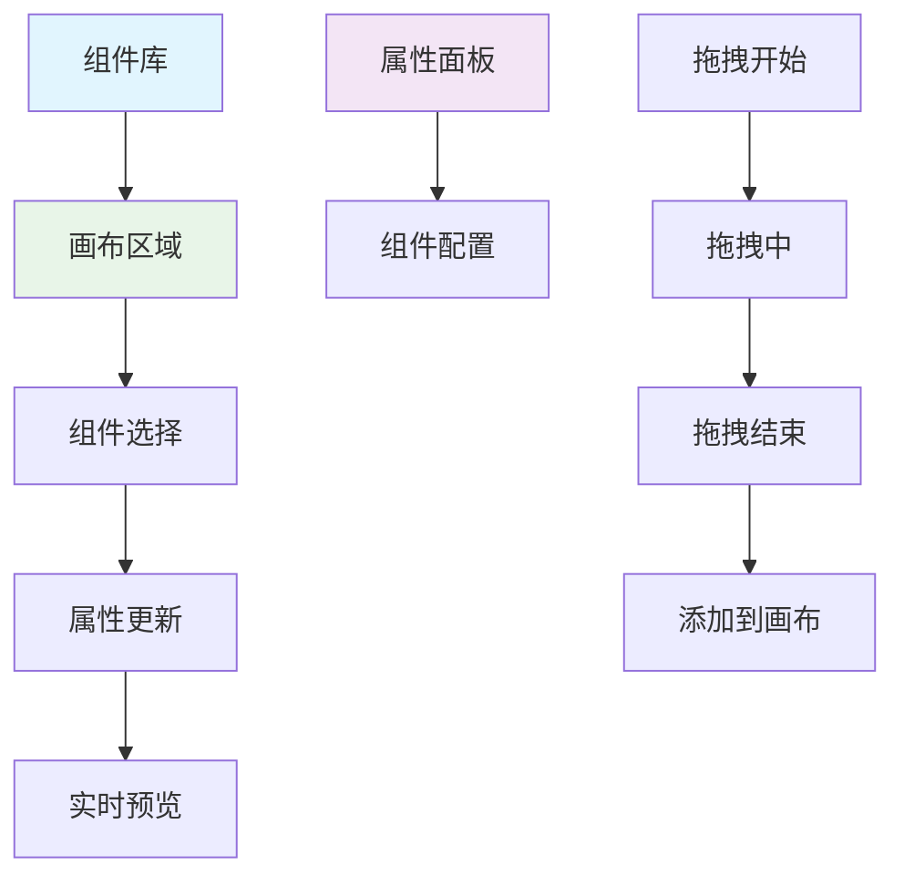
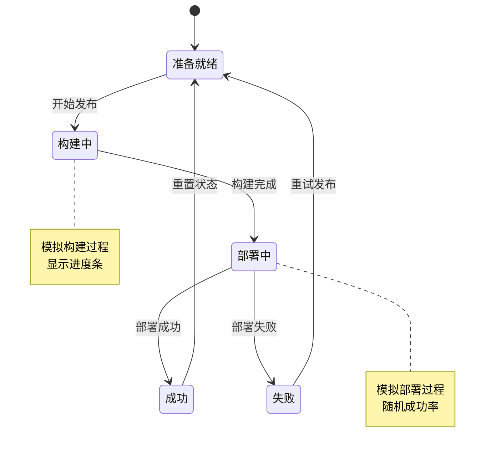
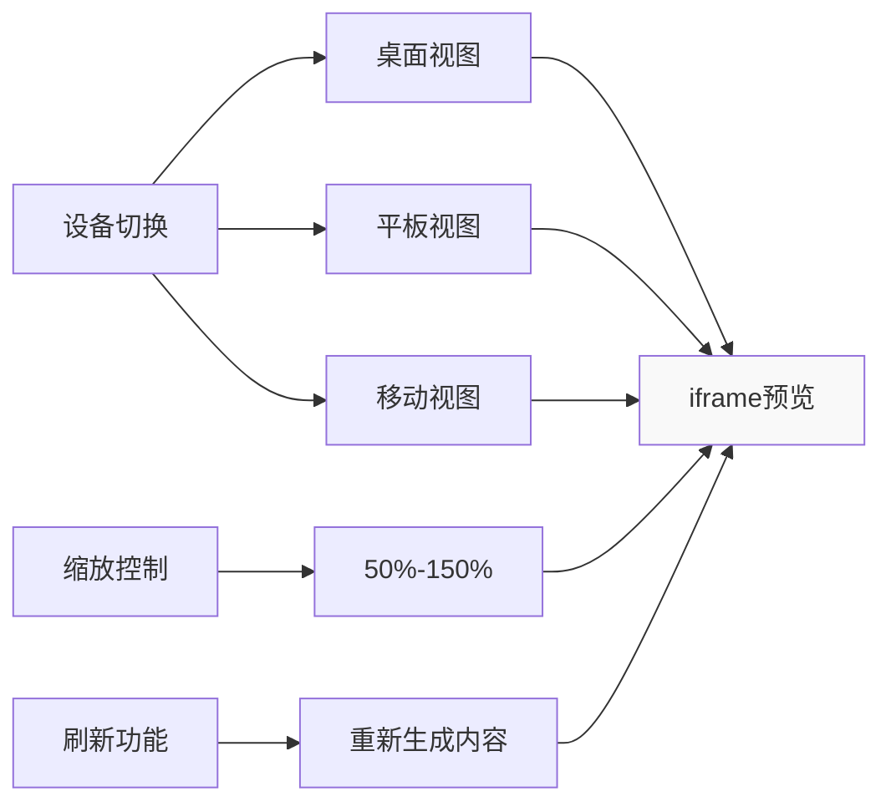
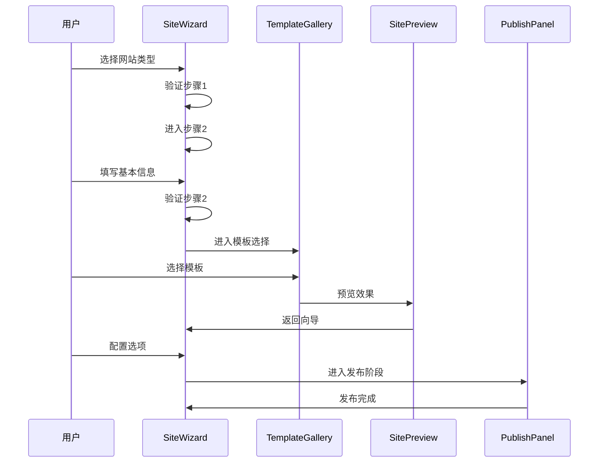
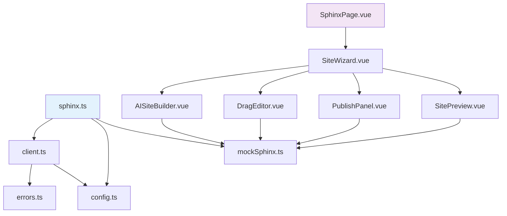

# Sphinx API

<cite>
**本文档引用的文件**
- [sphinx.ts](file://apps/AgentPit/src/services/api/sphinx.ts)
- [client.ts](file://apps/AgentPit/src/services/api/client.ts)
- [config.ts](file://apps/AgentPit/src/services/config.ts)
- [errors.ts](file://apps/AgentPit/src/services/errors.ts)
- [mockSphinx.ts](file://apps/AgentPit/src/data/mockSphinx.ts)
- [AISiteBuilder.vue](file://apps/AgentPit/src/components/sphinx/AISiteBuilder.vue)
- [DragEditor.vue](file://apps/AgentPit/src/components/sphinx/DragEditor.vue)
- [PublishPanel.vue](file://apps/AgentPit/src/components/sphinx/PublishPanel.vue)
- [SitePreview.vue](file://apps/AgentPit/src/components/sphinx/SitePreview.vue)
- [SiteWizard.vue](file://apps/AgentPit/src/components/sphinx/SiteWizard.vue)
- [TemplateGallery.vue](file://apps/AgentPit/src/components/sphinx/TemplateGallery.vue)
- [SphinxPage.vue](file://apps/AgentPit/src/views/SphinxPage.vue)
</cite>

## 目录
1. [简介](#简介)
2. [项目结构](#项目结构)
3. [核心组件](#核心组件)
4. [架构概览](#架构概览)
5. [详细组件分析](#详细组件分析)
6. [依赖关系分析](#依赖关系分析)
7. [性能考虑](#性能考虑)
8. [故障排除指南](#故障排除指南)
9. [结论](#结论)

## 简介

Sphinx API 是一个基于 Vue 3 和 TypeScript 的智能网站构建平台，提供 AI 驱动的建站服务。该系统包含完整的网站构建工作流，从 AI 智能对话到可视化拖拽编辑，再到一键发布和预览功能。

本 API 文档详细说明了 Sphinx 系统的接口规范、数据模型、认证机制和 Mock 数据使用方法，帮助开发者进行本地开发和测试。

## 项目结构

Sphinx API 采用模块化架构设计，主要分为以下几个核心模块：

**图表来源**
- [SphinxPage.vue:1-186](file://apps/AgentPit/src/views/SphinxPage.vue#L1-L186)
- [sphinx.ts:1-69](file://apps/AgentPit/src/services/api/sphinx.ts#L1-L69)

**章节来源**
- [SphinxPage.vue:1-186](file://apps/AgentPit/src/views/SphinxPage.vue#L1-L186)
- [SiteWizard.vue:1-523](file://apps/AgentPit/src/components/sphinx/SiteWizard.vue#L1-L523)

## 核心组件

### API 服务层

Sphinx API 提供了完整的网站构建服务，包括模板管理、网站生成、预览和发布功能。

### 数据模型

系统定义了以下核心数据接口：

**图表来源**
- [sphinx.ts:9-29](file://apps/AgentPit/src/services/api/sphinx.ts#L9-L29)
- [mockSphinx.ts:1-34](file://apps/AgentPit/src/data/mockSphinx.ts#L1-L34)

**章节来源**
- [sphinx.ts:1-69](file://apps/AgentPit/src/services/api/sphinx.ts#L1-L69)
- [mockSphinx.ts:1-127](file://apps/AgentPit/src/data/mockSphinx.ts#L1-L127)

## 架构概览

Sphinx API 采用分层架构设计，确保了良好的可维护性和扩展性：

**图表来源**
- [sphinx.ts:32-67](file://apps/AgentPit/src/services/api/sphinx.ts#L32-L67)
- [client.ts:19-104](file://apps/AgentPit/src/services/api/client.ts#L19-L104)
- [config.ts:2-10](file://apps/AgentPit/src/services/config.ts#L2-L10)

## 详细组件分析

### AI 网站构建器 (AISiteBuilder)

AI 网站构建器提供了智能对话式的网站创建体验，支持多种网站类型的模板推荐：

**图表来源**
- [AISiteBuilder.vue:40-264](file://apps/AgentPit/src/components/sphinx/AISiteBuilder.vue#L40-L264)
- [mockSphinx.ts:111-116](file://apps/AgentPit/src/data/mockSphinx.ts#L111-L116)

**章节来源**
- [AISiteBuilder.vue:1-509](file://apps/AgentPit/src/components/sphinx/AISiteBuilder.vue#L1-L509)
- [mockSphinx.ts:93-116](file://apps/AgentPit/src/data/mockSphinx.ts#L93-L116)

### 可视化拖拽编辑器 (DragEditor)

拖拽编辑器提供了直观的网站构建界面，支持组件的拖拽、属性配置和层级管理：

**图表来源**
- [DragEditor.vue:16-135](file://apps/AgentPit/src/components/sphinx/DragEditor.vue#L16-L135)
- [DragEditor.vue:137-172](file://apps/AgentPit/src/components/sphinx/DragEditor.vue#L137-L172)

**章节来源**
- [DragEditor.vue:1-445](file://apps/AgentPit/src/components/sphinx/DragEditor.vue#L1-L445)

### 发布面板 (PublishPanel)

发布面板提供了完整的网站发布流程，包括平台选择、域名配置和发布状态跟踪：

**图表来源**
- [PublishPanel.vue:47-121](file://apps/AgentPit/src/components/sphinx/PublishPanel.vue#L47-L121)

**章节来源**
- [PublishPanel.vue:1-492](file://apps/AgentPit/src/components/sphinx/PublishPanel.vue#L1-L492)

### 网站预览 (SitePreview)

网站预览组件提供了多设备、多缩放级别的网站预览功能：

**图表来源**
- [SitePreview.vue:16-26](file://apps/AgentPit/src/components/sphinx/SitePreview.vue#L16-L26)
- [SitePreview.vue:49-166](file://apps/AgentPit/src/components/sphinx/SitePreview.vue#L49-L166)

**章节来源**
- [SitePreview.vue:1-329](file://apps/AgentPit/src/components/sphinx/SitePreview.vue#L1-L329)

### 站点向导 (SiteWizard)

站点向导提供了完整的网站创建流程，包含五个步骤的渐进式指导：

**图表来源**
- [SiteWizard.vue:8-76](file://apps/AgentPit/src/components/sphinx/SiteWizard.vue#L8-L76)
- [SiteWizard.vue:47-70](file://apps/AgentPit/src/components/sphinx/SiteWizard.vue#L47-L70)

**章节来源**
- [SiteWizard.vue:1-523](file://apps/AgentPit/src/components/sphinx/SiteWizard.vue#L1-L523)

## 依赖关系分析

Sphinx API 的依赖关系清晰明确，遵循了单一职责原则：

**图表来源**
- [sphinx.ts:2-6](file://apps/AgentPit/src/services/api/sphinx.ts#L2-L6)
- [client.ts:1-105](file://apps/AgentPit/src/services/api/client.ts#L1-L105)
- [config.ts:1-11](file://apps/AgentPit/src/services/config.ts#L1-L11)

**章节来源**
- [sphinx.ts:1-69](file://apps/AgentPit/src/services/api/sphinx.ts#L1-L69)
- [client.ts:1-105](file://apps/AgentPit/src/services/api/client.ts#L1-L105)

## 性能考虑

Sphinx API 在设计时充分考虑了性能优化：

### Mock 数据优化
- 使用静态数据减少网络请求
- 支持环境变量切换真实 API 和 Mock 数据
- 预加载常用数据提高响应速度

### 组件性能
- 懒加载非关键组件
- 虚拟滚动处理大量模板
- 防抖处理高频输入事件

### 缓存策略
- 浏览器本地存储认证令牌
- 组件级状态缓存
- 图片资源预加载

## 故障排除指南

### 常见问题及解决方案

#### 认证问题
- **症状**: 请求返回 401 状态码
- **原因**: 缺少或过期的认证令牌
- **解决**: 检查 `localStorage` 中的 `auth_token` 是否存在且有效

#### 网络超时
- **症状**: 请求在 30 秒后超时
- **原因**: 网络延迟或服务器响应慢
- **解决**: 检查 `API_CONFIG.timeout` 设置，确认网络连接稳定

#### Mock 数据不生效
- **症状**: 真实 API 调用而非 Mock 数据
- **原因**: `VITE_USE_MOCK_API` 环境变量未设置为 `true`
- **解决**: 在 `.env` 文件中设置 `VITE_USE_MOCK_API=true`

#### 发布失败
- **症状**: 发布流程中断或失败
- **原因**: 随机成功率机制或配置错误
- **解决**: 检查域名配置、SSL 设置和发布平台选择

**章节来源**
- [errors.ts:1-45](file://apps/AgentPit/src/services/errors.ts#L1-L45)
- [config.ts:1-11](file://apps/AgentPit/src/services/config.ts#L1-L11)

## 结论

Sphinx API 提供了一个完整、易用且功能丰富的网站构建平台。通过模块化的设计和清晰的架构，开发者可以轻松地进行本地开发和测试。

### 主要特性
- **AI 驱动**: 智能对话式网站创建
- **可视化编辑**: 直观的拖拽式设计工具
- **多平台发布**: 支持多种部署平台
- **Mock 数据**: 完整的本地开发支持
- **响应式设计**: 适配各种设备和屏幕尺寸

### 最佳实践
- 使用 Mock 数据进行快速原型开发
- 遵循组件单一职责原则
- 合理使用缓存机制提升性能
- 实施适当的错误处理和用户反馈

通过本 API 文档，开发者可以快速理解和使用 Sphinx 系统的各项功能，构建专业级的网站解决方案。