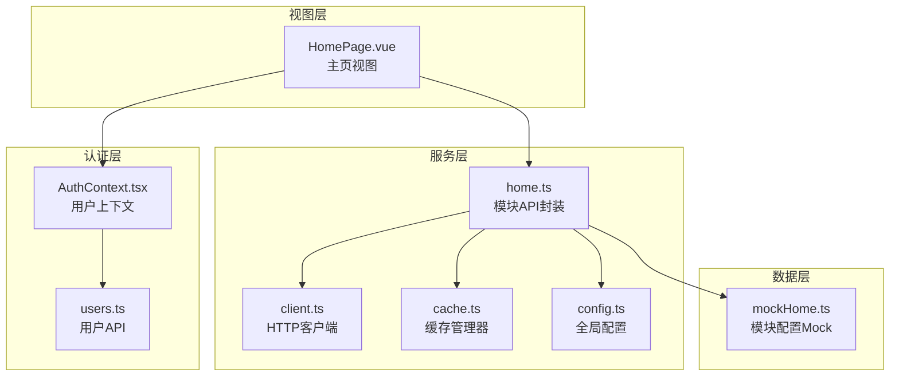
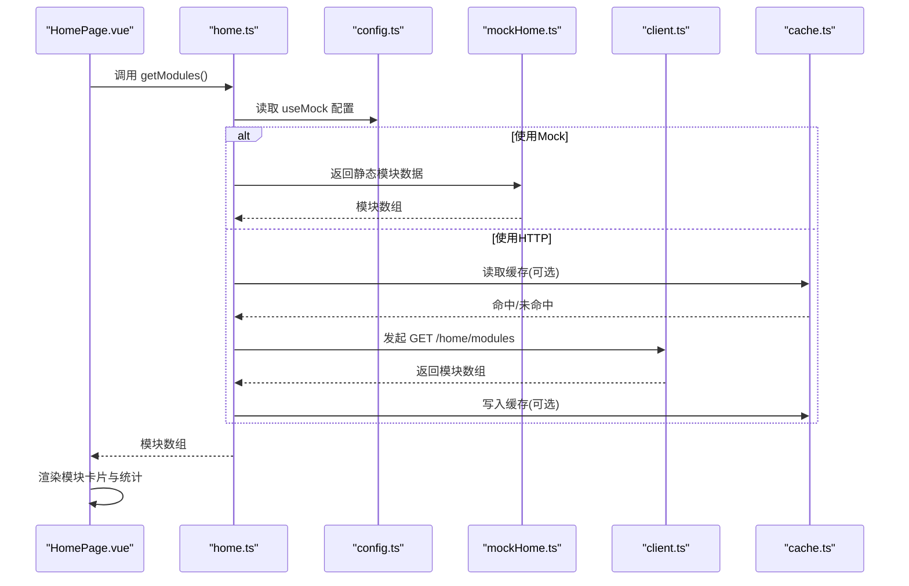
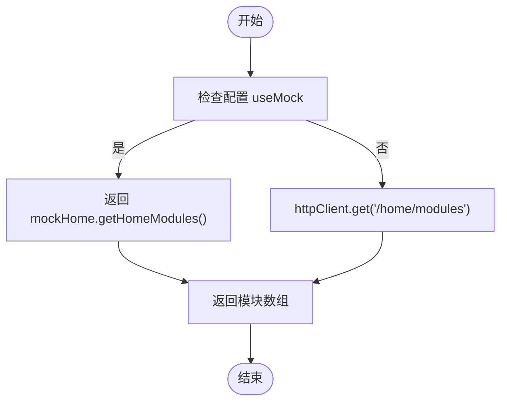
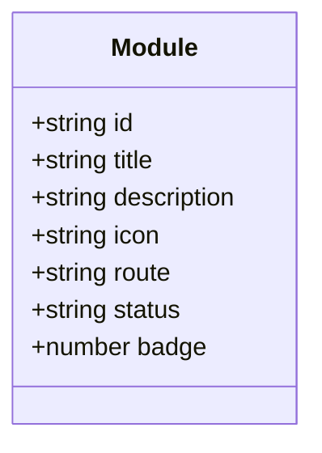
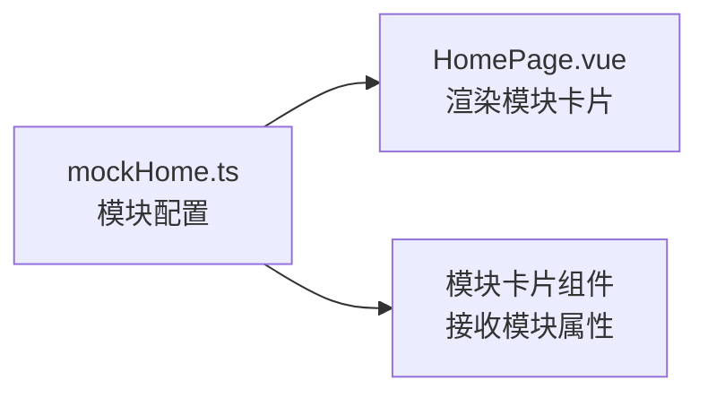
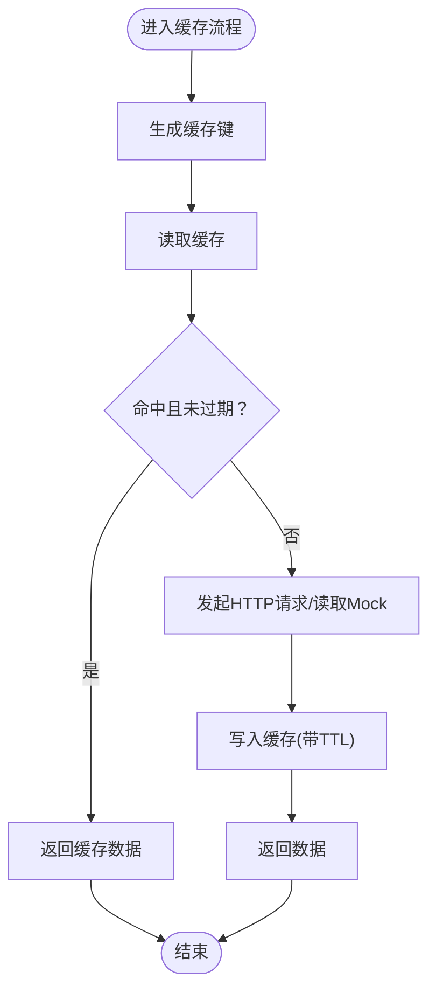
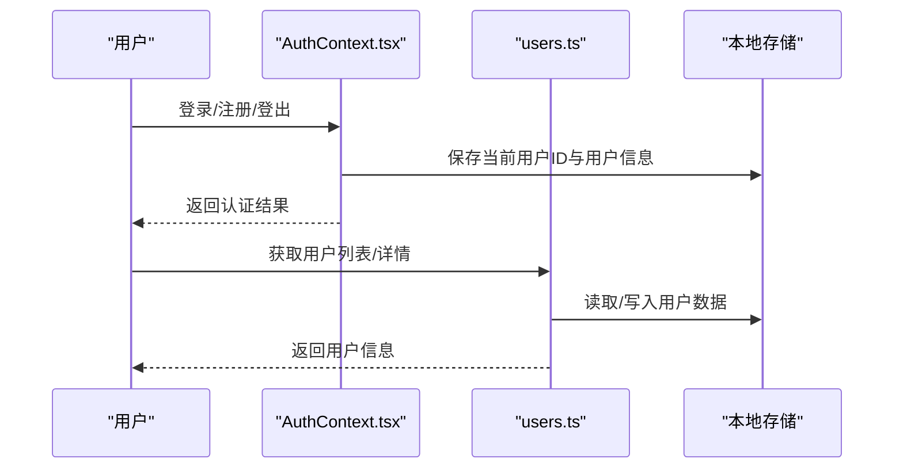
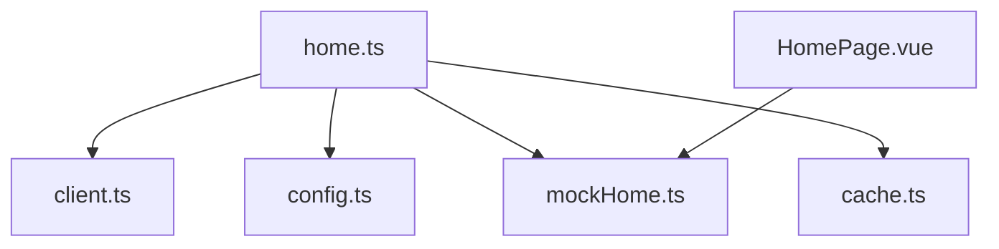

# 主页API

<cite>
**本文引用的文件**
- [home.ts](file://src/services/api/home.ts)
- [mockHome.ts](file://apps/AgentPit/src/data/mockHome.ts)
- [HomePage.vue](file://apps/AgentPit/src/views/HomePage.vue)
- [cache.ts](file://src/services/cache.ts)
- [client.ts](file://src/services/api/client.ts)
- [config.ts](file://src/services/config.ts)
- [users.ts](file://apps/config-center/src/api/users.ts)
- [AuthContext.tsx](file://apps/forum/src/context/AuthContext.tsx)
</cite>

## 目录
1. [简介](#简介)
2. [项目结构](#项目结构)
3. [核心组件](#核心组件)
4. [架构总览](#架构总览)
5. [详细组件分析](#详细组件分析)
6. [依赖关系分析](#依赖关系分析)
7. [性能考虑](#性能考虑)
8. [故障排除指南](#故障排除指南)
9. [结论](#结论)
10. [附录](#附录)

## 简介
本文件为主页API的详细技术文档，覆盖以下主题：
- 获取主页数据的接口规范：HTTP方法、URL路径、请求参数与响应格式
- 模块配置与用户仪表板信息的数据模型与来源
- 认证方法与Mock数据使用方式
- 数据缓存策略与性能优化建议
- 测试场景与示例用法

注意：当前仓库中主页API的实现采用Mock数据直出，未接入后端服务；本文档同时给出对接后端时的预期行为与迁移指引。

## 项目结构
与主页API相关的核心文件分布如下：
- 服务层：API封装与缓存
- 视图层：主页页面渲染与动画
- 数据层：Mock模块配置
- 配置层：API开关与环境配置
- 认证层：用户状态与登录流程（用于仪表板信息）

**图表来源**
- [home.ts:1-30](file://src/services/api/home.ts#L1-L30)
- [client.ts:1-200](file://src/services/api/client.ts#L1-L200)
- [cache.ts:1-50](file://src/services/cache.ts#L1-L50)
- [config.ts:1-200](file://src/services/config.ts#L1-L200)
- [HomePage.vue:1-469](file://apps/AgentPit/src/views/HomePage.vue#L1-L469)
- [mockHome.ts:1-108](file://apps/AgentPit/src/data/mockHome.ts#L1-L108)
- [AuthContext.tsx:1-81](file://apps/forum/src/context/AuthContext.tsx#L1-L81)
- [users.ts:1-25](file://apps/config-center/src/api/users.ts#L1-L25)

**章节来源**
- [home.ts:1-30](file://src/services/api/home.ts#L1-L30)
- [mockHome.ts:1-108](file://apps/AgentPit/src/data/mockHome.ts#L1-L108)
- [HomePage.vue:1-469](file://apps/AgentPit/src/views/HomePage.vue#L1-L469)
- [cache.ts:1-50](file://src/services/cache.ts#L1-L50)
- [config.ts:1-200](file://src/services/config.ts#L1-L200)
- [AuthContext.tsx:1-81](file://apps/forum/src/context/AuthContext.tsx#L1-L81)
- [users.ts:1-25](file://apps/config-center/src/api/users.ts#L1-L25)

## 核心组件
- 模块API封装：提供获取模块列表的能力，并支持Mock模式与真实HTTP请求两种路径
- Mock模块配置：定义核心模块与扩展模块的静态数据
- 缓存管理器：提供键值缓存、TTL过期与按正则清理能力
- 配置开关：控制是否启用Mock模式
- 主页视图：负责渲染模块卡片、统计信息与过渡动画
- 认证上下文：提供用户登录、注册、登出与资料更新能力

**章节来源**
- [home.ts:20-28](file://src/services/api/home.ts#L20-L28)
- [mockHome.ts:1-108](file://apps/AgentPit/src/data/mockHome.ts#L1-L108)
- [cache.ts:8-47](file://src/services/cache.ts#L8-L47)
- [config.ts:1-200](file://src/services/config.ts#L1-L200)
- [HomePage.vue:1-120](file://apps/AgentPit/src/views/HomePage.vue#L1-L120)
- [AuthContext.tsx:17-81](file://apps/forum/src/context/AuthContext.tsx#L17-L81)

## 架构总览
主页API的调用链路如下：
- 视图组件在挂载时触发模块数据获取
- API封装根据配置决定走Mock还是HTTP客户端
- 若启用HTTP，通过统一客户端发起请求
- 可选地使用缓存管理器进行数据缓存
- 认证上下文为仪表板信息提供用户状态

**图表来源**
- [home.ts:20-28](file://src/services/api/home.ts#L20-L28)
- [mockHome.ts:1-108](file://apps/AgentPit/src/data/mockHome.ts#L1-L108)
- [client.ts:1-200](file://src/services/api/client.ts#L1-L200)
- [cache.ts:11-29](file://src/services/cache.ts#L11-L29)
- [config.ts:1-200](file://src/services/config.ts#L1-L200)
- [HomePage.vue:1-120](file://apps/AgentPit/src/views/HomePage.vue#L1-L120)

## 详细组件分析

### 接口定义与调用流程
- 接口名称：获取模块列表
- HTTP方法：GET
- URL路径：/home/modules
- 请求参数：无
- 响应格式：模块对象数组
  - 字段说明：
    - id: 字符串，模块唯一标识
    - title: 字符串，模块标题
    - description: 字符串，模块描述
    - icon: 字符串，图标名称
    - route: 字符串，模块路由
    - status: 字符串，状态(active/inactive)
    - badge: 数字或可选徽章数
- 认证：未要求认证（当前Mock模式下）
- Mock数据来源：apps/AgentPit/src/data/mockHome.ts

调用流程（含Mock与HTTP两种分支）：

**图表来源**
- [home.ts:20-28](file://src/services/api/home.ts#L20-L28)
- [mockHome.ts:1-108](file://apps/AgentPit/src/data/mockHome.ts#L1-L108)

**章节来源**
- [home.ts:20-28](file://src/services/api/home.ts#L20-L28)
- [mockHome.ts:1-108](file://apps/AgentPit/src/data/mockHome.ts#L1-L108)

### 数据模型
模块对象字段与类型：
- id: string
- title: string
- description: string
- icon: string
- route: string
- status: 'active' | 'inactive'
- badge: number（可选）

**图表来源**
- [home.ts:9-17](file://src/services/api/home.ts#L9-L17)

**章节来源**
- [home.ts:9-17](file://src/services/api/home.ts#L9-L17)

### Mock数据与模块配置
- 核心模块与扩展模块均来自同一Mock文件
- 模块包含：id、title、description、icon、routePath、color、badge（可选）
- 页面通过导入该Mock数据直接渲染模块卡片

**图表来源**
- [mockHome.ts:1-108](file://apps/AgentPit/src/data/mockHome.ts#L1-L108)
- [HomePage.vue:5-119](file://apps/AgentPit/src/views/HomePage.vue#L5-L119)

**章节来源**
- [mockHome.ts:1-108](file://apps/AgentPit/src/data/mockHome.ts#L1-L108)
- [HomePage.vue:5-119](file://apps/AgentPit/src/views/HomePage.vue#L5-L119)

### 缓存策略与性能优化
- 缓存管理器提供：
  - 读取：get(key)
  - 写入：set(key, data, ttl)
  - 删除：delete(key)、clear()、clearPattern(pattern)
- TTL过期机制：基于时间戳判断是否过期
- 性能建议：
  - 对高频访问的模块列表启用缓存
  - 合理设置TTL，避免过期与陈旧数据
  - 使用clearPattern按需清理相关缓存键
  - 在HTTP模式下结合缓存提升首屏性能

**图表来源**
- [cache.ts:11-29](file://src/services/cache.ts#L11-L29)

**章节来源**
- [cache.ts:8-47](file://src/services/cache.ts#L8-L47)

### 认证与用户仪表板
- 认证上下文提供登录、注册、登出与资料更新能力
- 用户API提供用户列表、详情、创建、更新、删除等操作
- 仪表板信息通常依赖用户状态与权限，当前主页以Mock模块为主

**图表来源**
- [AuthContext.tsx:17-81](file://apps/forum/src/context/AuthContext.tsx#L17-L81)
- [users.ts:1-25](file://apps/config-center/src/api/users.ts#L1-L25)

**章节来源**
- [AuthContext.tsx:1-81](file://apps/forum/src/context/AuthContext.tsx#L1-L81)
- [users.ts:1-25](file://apps/config-center/src/api/users.ts#L1-L25)

## 依赖关系分析
- home.ts 依赖：
  - httpClient（HTTP客户端）
  - API_CONFIG（配置）
  - mockHome（Mock数据）
- HomePage.vue 依赖：
  - mockHome（模块配置）
  - ModuleCard（模块卡片组件）
- cache.ts 为通用缓存工具
- config.ts 提供useMock等配置项

**图表来源**
- [home.ts:1-30](file://src/services/api/home.ts#L1-L30)
- [client.ts:1-200](file://src/services/api/client.ts#L1-L200)
- [config.ts:1-200](file://src/services/config.ts#L1-L200)
- [mockHome.ts:1-108](file://apps/AgentPit/src/data/mockHome.ts#L1-L108)
- [HomePage.vue:1-469](file://apps/AgentPit/src/views/HomePage.vue#L1-L469)
- [cache.ts:1-50](file://src/services/cache.ts#L1-L50)

**章节来源**
- [home.ts:1-30](file://src/services/api/home.ts#L1-L30)
- [client.ts:1-200](file://src/services/api/client.ts#L1-L200)
- [config.ts:1-200](file://src/services/config.ts#L1-L200)
- [mockHome.ts:1-108](file://apps/AgentPit/src/data/mockHome.ts#L1-L108)
- [HomePage.vue:1-469](file://apps/AgentPit/src/views/HomePage.vue#L1-L469)
- [cache.ts:1-50](file://src/services/cache.ts#L1-L50)

## 性能考虑
- 首屏渲染：使用Mock数据可显著降低网络开销，提升首屏速度
- 缓存命中：对模块列表启用缓存，减少重复请求
- 分页与懒加载：若模块数量增长，建议引入分页或按需加载
- 动画与资源：主页动画较多，建议在低端设备上适度降级
- 并发控制：避免短时间内多次重复请求，可通过防抖或去重策略优化

## 故障排除指南
- 无法获取模块数据
  - 检查API配置中的useMock开关
  - 确认HTTP客户端已正确初始化
  - 查看网络请求是否被拦截或跨域限制
- 缓存异常
  - 检查TTL设置是否过短导致频繁失效
  - 使用clearPattern清理相关键，确认缓存清理逻辑
- Mock数据不一致
  - 确认mockHome.ts中的模块配置与路由一致
  - 检查页面导入路径是否正确

**章节来源**
- [home.ts:20-28](file://src/services/api/home.ts#L20-L28)
- [cache.ts:39-46](file://src/services/cache.ts#L39-L46)
- [mockHome.ts:1-108](file://apps/AgentPit/src/data/mockHome.ts#L1-L108)

## 结论
- 当前主页API以Mock数据为主，具备良好的可测试性与快速迭代能力
- 建议在后端服务就绪后，平滑切换至HTTP模式，并结合缓存策略提升性能
- 认证与用户API为后续仪表板功能提供基础，应保持与主页数据流的解耦与独立演进

## 附录

### API参考（当前实现）
- 接口名称：获取模块列表
- 方法：GET
- 路径：/home/modules
- 请求参数：无
- 响应：模块对象数组
- 认证：无需认证（当前Mock模式）
- 示例调用路径：
  - [调用入口:22-28](file://src/services/api/home.ts#L22-L28)
  - [Mock数据源:1-108](file://apps/AgentPit/src/data/mockHome.ts#L1-L108)

**章节来源**
- [home.ts:20-28](file://src/services/api/home.ts#L20-L28)
- [mockHome.ts:1-108](file://apps/AgentPit/src/data/mockHome.ts#L1-L108)

### 测试场景与Mock使用
- 单元测试：可直接导入mockHome.ts进行断言
- 集成测试：通过切换API_CONFIG.useMock验证不同分支
- 端到端测试：在主页页面验证模块渲染与动画效果

**章节来源**
- [mockHome.ts:1-108](file://apps/AgentPit/src/data/mockHome.ts#L1-L108)
- [HomePage.vue:1-120](file://apps/AgentPit/src/views/HomePage.vue#L1-L120)