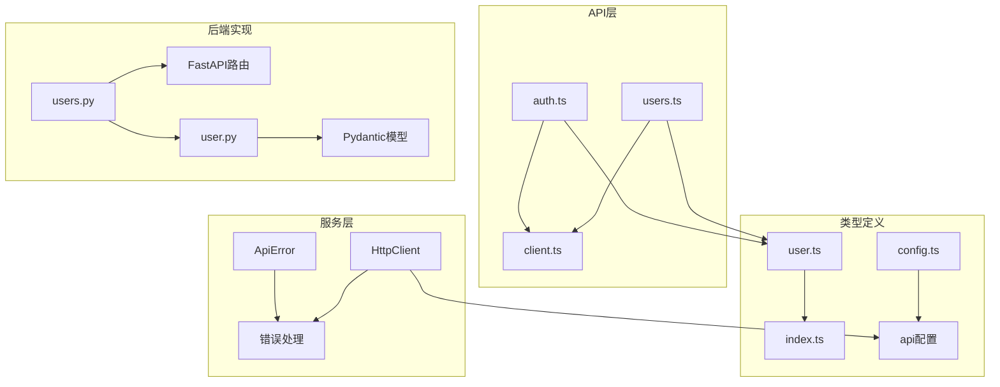
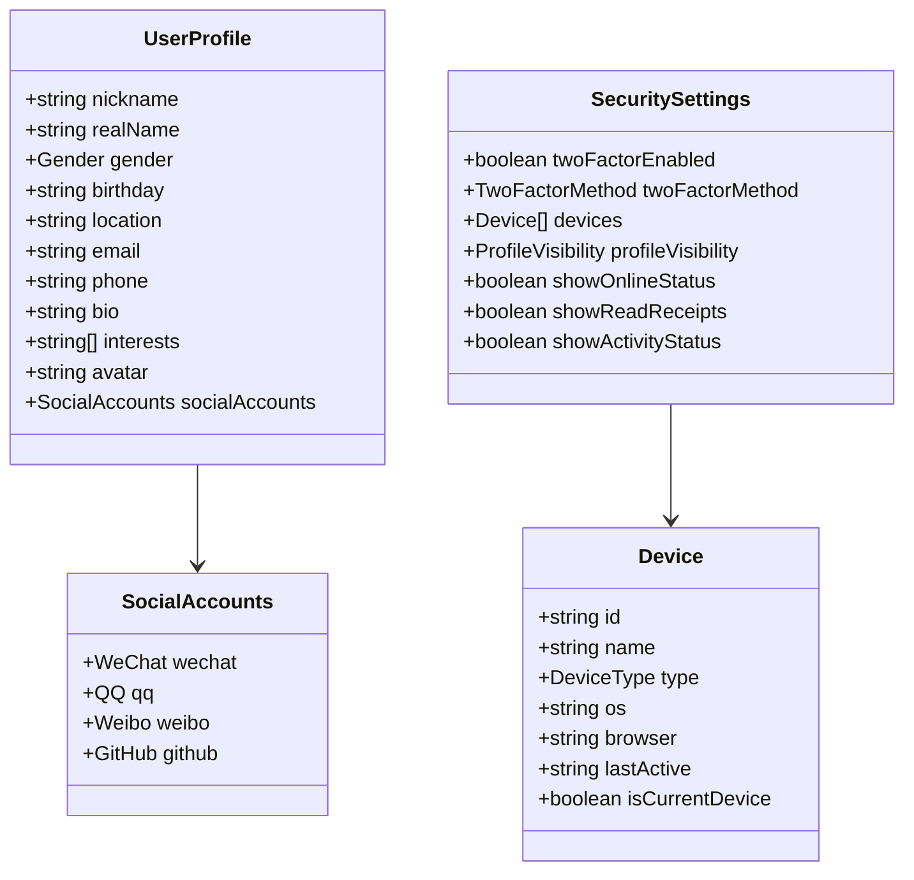
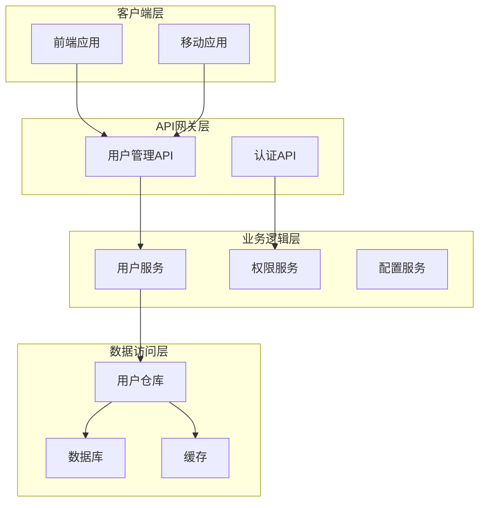
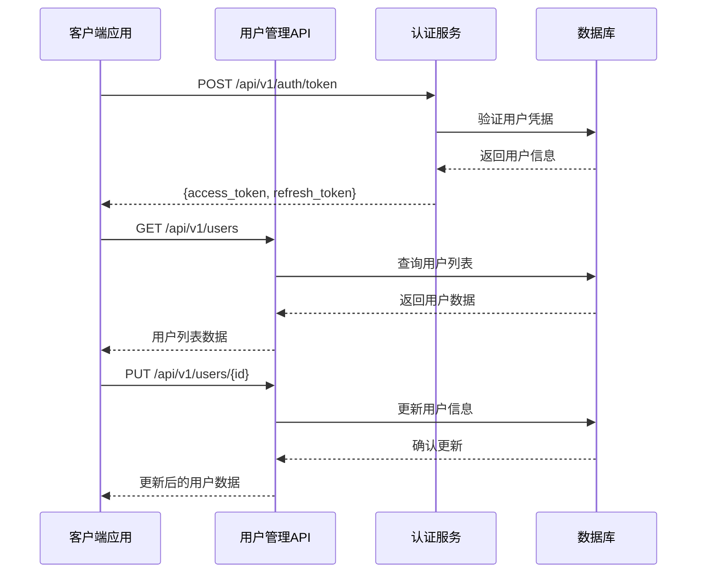
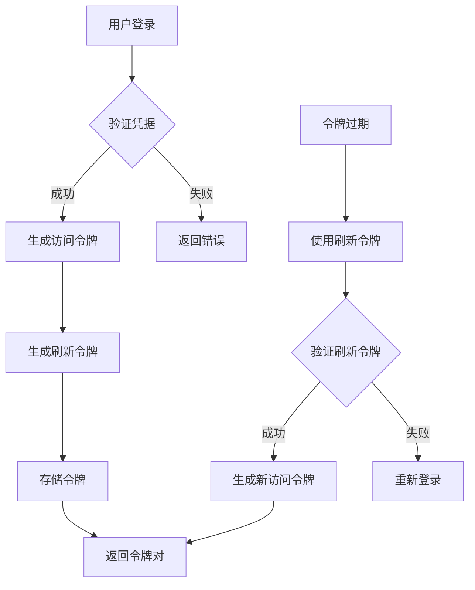
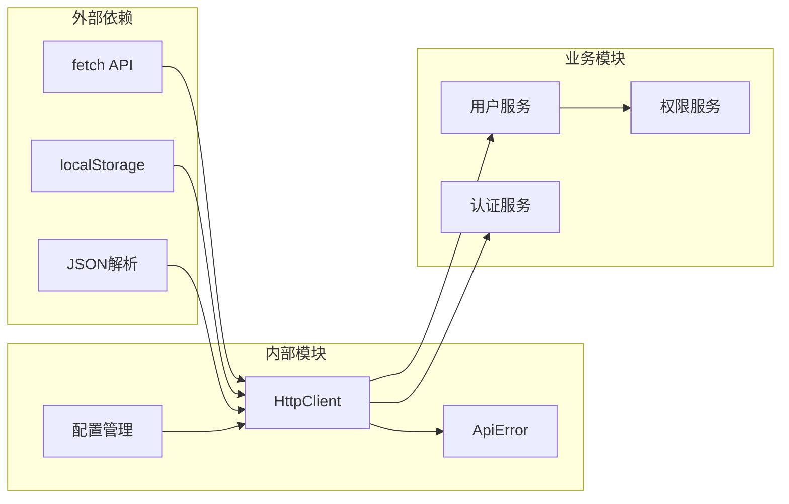
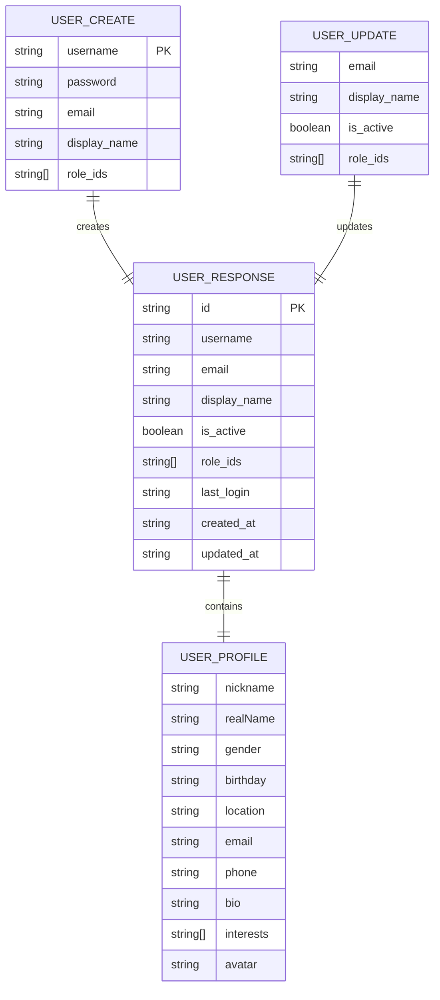
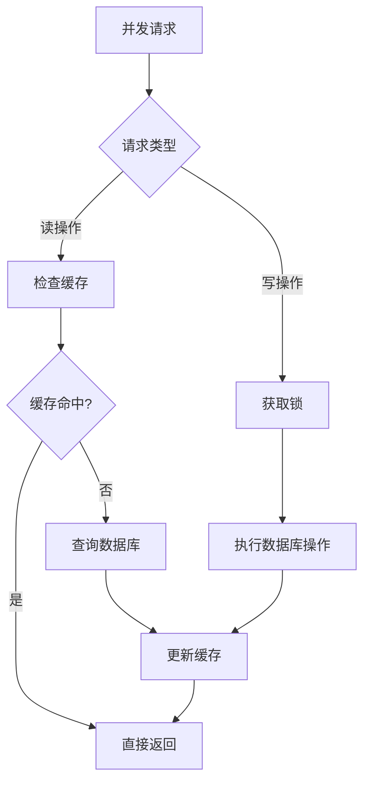

# 用户管理API

<cite>
**本文档引用的文件**
- [apps/config-center/src/api/users.ts](file://apps/config-center/src/api/users.ts)
- [apps/config-center/src/api/auth.ts](file://apps/config-center/src/api/auth.ts)
- [apps/config-center/src/api/client.ts](file://apps/config-center/src/api/client.ts)
- [apps/config-center/src/types/index.ts](file://apps/config-center/src/types/index.ts)
- [apps/AgentPit/src/types/user.ts](file://apps/AgentPit/src/types/user.ts)
- [apps/AgentPit/src/services/api/client.ts](file://apps/AgentPit/src/services/api/client.ts)
- [src/services/api/client.ts](file://src/services/api/client.ts)
- [src/services/config.ts](file://src/services/config.ts)
- [apps/AgentPit/src/services/config.ts](file://apps/AgentPit/src/services/config.ts)
- [tools/flexloop/src/taolib/testing/config_center/server/api/users.py](file://tools/flexloop/src/taolib/testing/config_center/server/api/users.py)
- [tools/flexloop/src/taolib/testing/config_center/models/user.py](file://tools/flexloop/src/taolib/testing/config_center/models/user.py)
</cite>

## 目录
1. [简介](#简介)
2. [项目结构](#项目结构)
3. [核心组件](#核心组件)
4. [架构概览](#架构概览)
5. [详细组件分析](#详细组件分析)
6. [依赖关系分析](#依赖关系分析)
7. [性能考虑](#性能考虑)
8. [故障排除指南](#故障排除指南)
9. [结论](#结论)

## 简介

用户管理API是DAO Apps生态系统中的核心服务，负责管理用户信息查询、更新、删除以及与用户相关的各种操作。该API提供了完整的用户生命周期管理功能，包括用户资料管理、个人设置配置、头像上传处理等。

本API采用RESTful设计原则，支持标准的HTTP方法，并提供了完善的错误处理机制和安全认证。系统支持多应用集成，包括AgentPit前端应用和配置中心应用，确保了跨平台的一致性体验。

## 项目结构

用户管理API的项目结构采用模块化设计，主要分布在以下目录中：

**图表来源**
- [apps/config-center/src/api/users.ts:1-26](file://apps/config-center/src/api/users.ts#L1-L26)
- [apps/config-center/src/api/auth.ts:1-15](file://apps/config-center/src/api/auth.ts#L1-L15)
- [apps/config-center/src/api/client.ts:1-171](file://apps/config-center/src/api/client.ts#L1-L171)

**章节来源**
- [apps/config-center/src/api/users.ts:1-26](file://apps/config-center/src/api/users.ts#L1-L26)
- [apps/config-center/src/api/auth.ts:1-15](file://apps/config-center/src/api/auth.ts#L1-L15)
- [apps/config-center/src/api/client.ts:1-171](file://apps/config-center/src/api/client.ts#L1-L171)

## 核心组件

### 用户管理API接口

用户管理API提供了以下核心接口：

#### 用户查询接口
- **列表查询**: GET `/api/v1/users`
- **单个查询**: GET `/api/v1/users/{userId}`
- **分页参数**: skip (默认0), limit (默认100)

#### 用户操作接口
- **创建用户**: POST `/api/v1/users`
- **更新用户**: PUT `/api/v1/users/{userId}`
- **删除用户**: DELETE `/api/v1/users/{userId}`

#### 认证相关接口
- **用户登录**: POST `/api/v1/auth/token`
- **刷新令牌**: POST `/api/v1/auth/refresh`
- **获取当前用户**: GET `/api/v1/auth/me`

**章节来源**
- [apps/config-center/src/api/users.ts:4-25](file://apps/config-center/src/api/users.ts#L4-L25)
- [apps/config-center/src/api/auth.ts:4-14](file://apps/config-center/src/api/auth.ts#L4-L14)

### 数据模型定义

用户数据模型采用强类型设计，确保数据一致性和完整性：

**图表来源**
- [apps/AgentPit/src/types/user.ts:10-154](file://apps/AgentPit/src/types/user.ts#L10-L154)

**章节来源**
- [apps/AgentPit/src/types/user.ts:1-200](file://apps/AgentPit/src/types/user.ts#L1-L200)

## 架构概览

用户管理API采用分层架构设计，确保了良好的可维护性和扩展性：

**图表来源**
- [apps/config-center/src/api/users.ts:1-26](file://apps/config-center/src/api/users.ts#L1-L26)
- [apps/config-center/src/api/auth.ts:1-15](file://apps/config-center/src/api/auth.ts#L1-L15)

### 客户端通信流程

**图表来源**
- [apps/config-center/src/api/auth.ts:4-14](file://apps/config-center/src/api/auth.ts#L4-L14)
- [apps/config-center/src/api/users.ts:15-21](file://apps/config-center/src/api/users.ts#L15-L21)

## 详细组件分析

### 用户管理服务

用户管理服务提供了完整的用户生命周期管理功能：

#### 用户查询功能
- **分页查询**: 支持skip和limit参数控制查询范围
- **条件过滤**: 可根据用户名、邮箱等字段进行过滤
- **排序支持**: 支持按创建时间、最后登录时间等字段排序

#### 用户操作功能
- **创建用户**: 验证用户名唯一性，设置初始密码
- **更新用户**: 支持部分字段更新，保持数据一致性
- **删除用户**: 支持软删除和硬删除两种模式

**章节来源**
- [apps/config-center/src/api/users.ts:4-25](file://apps/config-center/src/api/users.ts#L4-L25)

### 认证与授权

认证系统采用JWT令牌机制，确保系统的安全性：

**图表来源**
- [apps/config-center/src/api/auth.ts:4-14](file://apps/config-center/src/api/auth.ts#L4-L14)

**章节来源**
- [apps/config-center/src/api/auth.ts:1-15](file://apps/config-center/src/api/auth.ts#L1-L15)

### 错误处理机制

系统实现了完善的错误处理机制：

| 错误类型 | HTTP状态码 | 描述 | 处理建议 |
|---------|-----------|------|---------|
| ApiError | 400 | 请求参数错误 | 检查请求格式和必填字段 |
| ApiError | 401 | 未授权访问 | 检查令牌有效性 |
| ApiError | 403 | 权限不足 | 验证用户角色和权限 |
| ApiError | 404 | 资源不存在 | 确认资源ID正确性 |
| ApiError | 409 | 资源冲突 | 解决数据冲突问题 |
| ApiError | 500 | 服务器内部错误 | 检查服务器日志 |

**章节来源**
- [apps/config-center/src/api/client.ts:1-171](file://apps/config-center/src/api/client.ts#L1-L171)

## 依赖关系分析

用户管理API的依赖关系体现了清晰的分层架构：

**图表来源**
- [apps/config-center/src/api/client.ts:19-104](file://apps/config-center/src/api/client.ts#L19-L104)

### 类型依赖关系

**图表来源**
- [apps/config-center/src/types/index.ts:95-120](file://apps/config-center/src/types/index.ts#L95-L120)
- [apps/AgentPit/src/types/user.ts:10-33](file://apps/AgentPit/src/types/user.ts#L10-L33)

**章节来源**
- [apps/config-center/src/types/index.ts:95-120](file://apps/config-center/src/types/index.ts#L95-L120)
- [apps/AgentPit/src/types/user.ts:1-200](file://apps/AgentPit/src/types/user.ts#L1-L200)

## 性能考虑

### 缓存策略

系统采用了多层次的缓存策略来提升性能：

- **内存缓存**: 存储热点用户数据，减少数据库查询
- **浏览器缓存**: 利用localStorage存储认证令牌
- **CDN缓存**: 静态资源通过CDN加速

### 并发处理

### 性能优化建议

1. **批量操作**: 支持批量用户查询和更新操作
2. **懒加载**: 用户详情采用懒加载策略
3. **分页查询**: 默认限制查询数量，避免大数据量影响
4. **索引优化**: 在常用查询字段上建立数据库索引

## 故障排除指南

### 常见问题及解决方案

#### 认证问题
- **问题**: 401未授权错误
- **原因**: 令牌过期或无效
- **解决**: 使用刷新令牌获取新令牌

#### 数据验证错误
- **问题**: 400参数错误
- **原因**: 请求数据格式不正确
- **解决**: 检查数据类型和必填字段

#### 网络连接问题
- **问题**: 请求超时
- **原因**: 网络不稳定或服务器繁忙
- **解决**: 增加重试机制和超时时间

**章节来源**
- [apps/config-center/src/api/client.ts:50-68](file://apps/config-center/src/api/client.ts#L50-L68)

### 调试工具

系统提供了完善的调试工具：

- **请求日志**: 记录所有API请求和响应
- **错误追踪**: 自动捕获和报告异常
- **性能监控**: 监控API响应时间和错误率

## 结论

用户管理API作为DAO Apps生态系统的核心组件，提供了完整、安全、高效的用户管理功能。通过采用现代化的架构设计和最佳实践，确保了系统的可扩展性和可维护性。

该API不仅满足了当前的功能需求，还为未来的功能扩展奠定了坚实的基础。通过持续的优化和改进，用户管理API将继续为用户提供优质的用户体验。