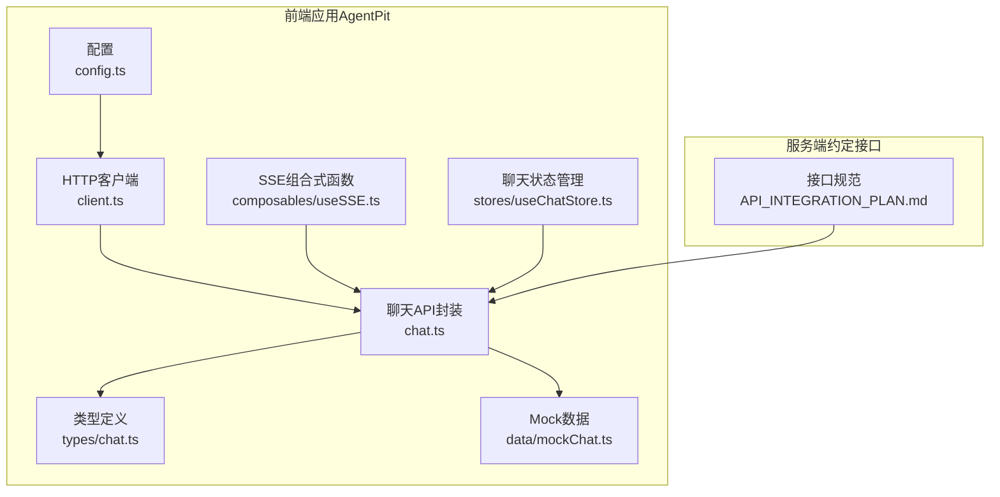
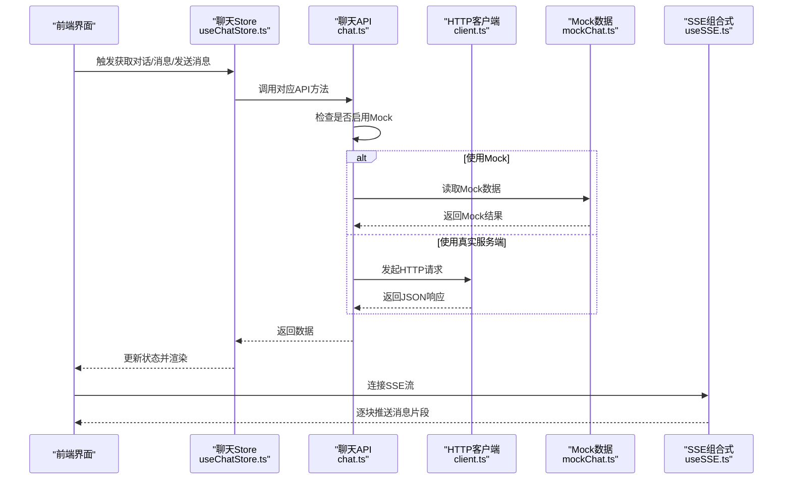
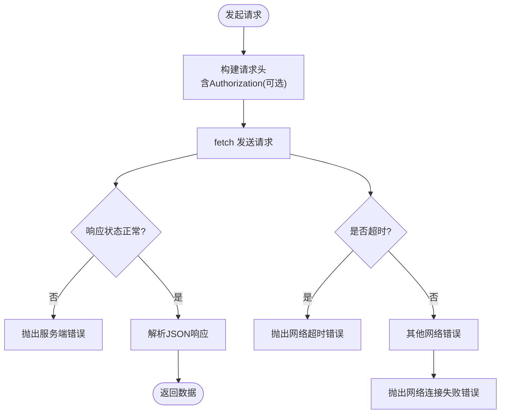
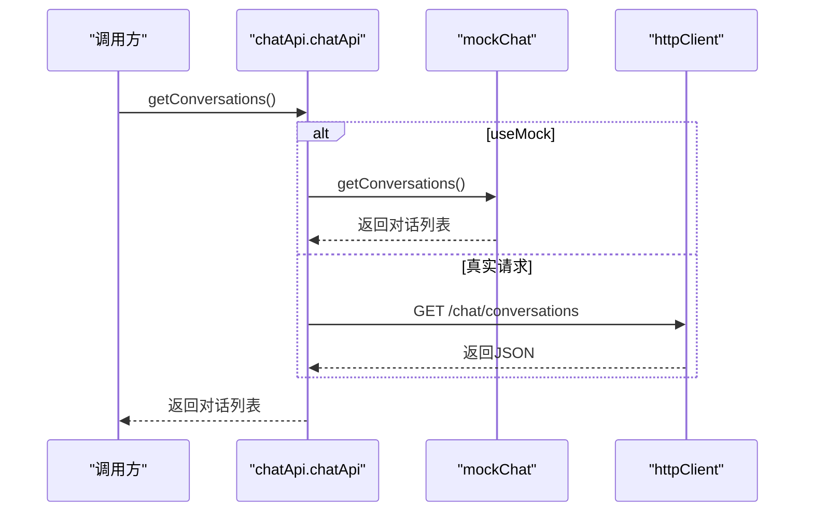
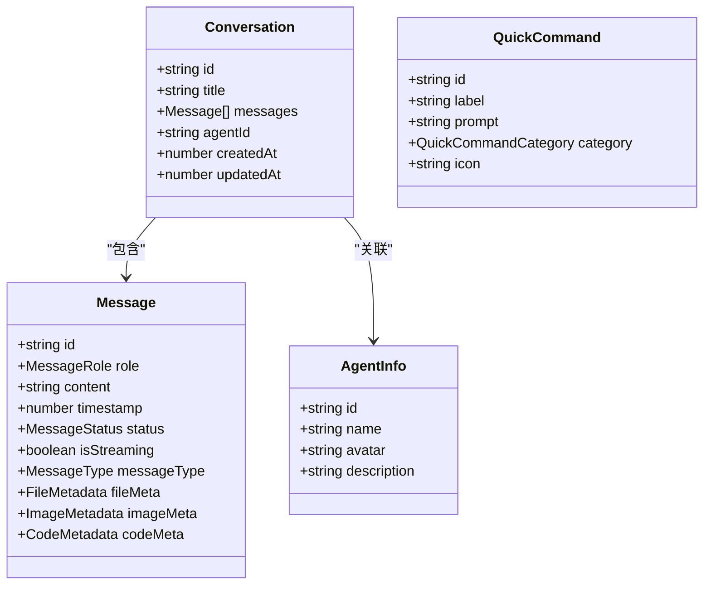
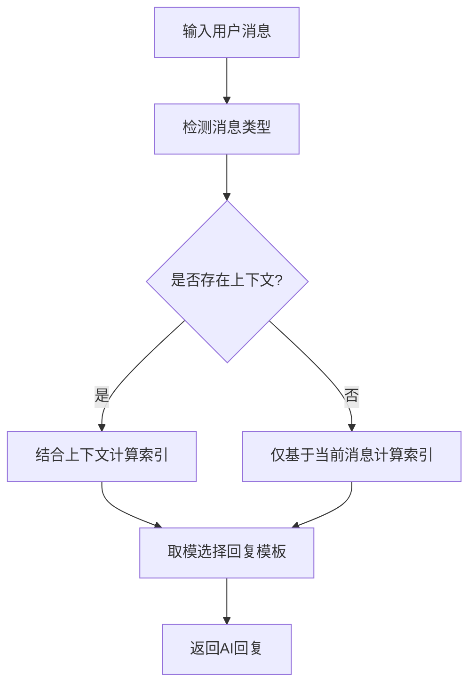
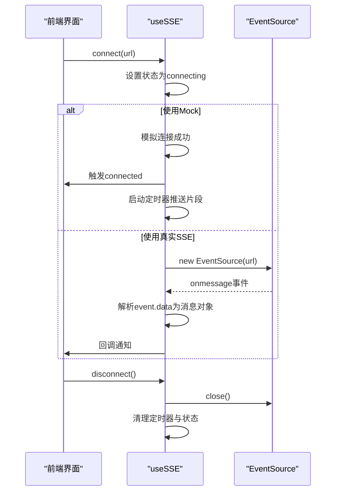
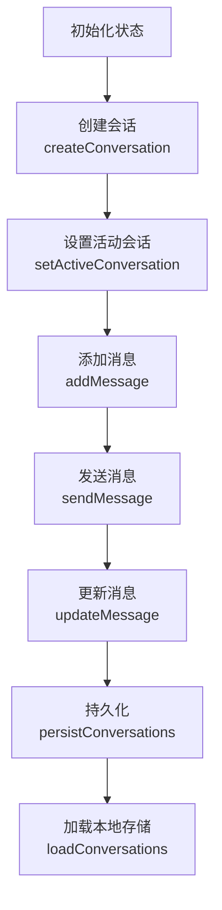
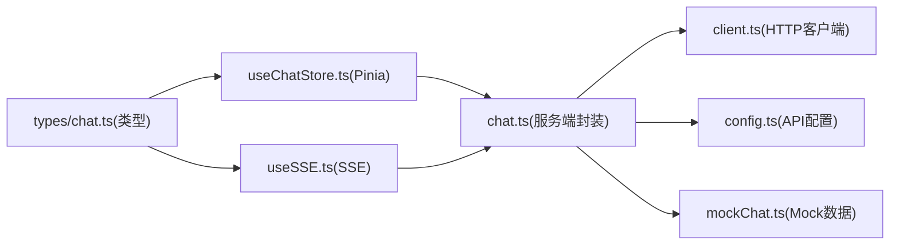

# 聊天API

<cite>
**本文引用的文件**   
- [chat.ts](file://src/services/api/chat.ts)
- [client.ts](file://apps/AgentPit/src/services/api/client.ts)
- [config.ts](file://apps/AgentPit/src/services/config.ts)
- [chat.ts](file://apps/AgentPit/src/types/chat.ts)
- [mockChat.ts](file://apps/AgentPit/src/data/mockChat.ts)
- [useSSE.ts](file://apps/AgentPit/src/composables/useSSE.ts)
- [useChatStore.ts](file://apps/AgentPit/src/stores/useChatStore.ts)
- [API_INTEGRATION_PLAN.md](file://apps/AgentPit/docs/API_INTEGRATION_PLAN.md)
</cite>

## 目录
1. [简介](#简介)
2. [项目结构](#项目结构)
3. [核心组件](#核心组件)
4. [架构总览](#架构总览)
5. [详细组件分析](#详细组件分析)
6. [依赖关系分析](#依赖关系分析)
7. [性能考量](#性能考量)
8. [故障排查指南](#故障排查指南)
9. [结论](#结论)
10. [附录](#附录)

## 简介
本文件为聊天API的详细技术文档，覆盖以下能力：
- 获取对话列表
- 获取消息历史
- 发送消息
- 流式消息接收（SSE）

文档同时说明HTTP方法、URL路径、请求参数、响应格式与错误码，并补充WebSocket连接处理、消息格式、事件类型与实时交互模式的实现要点与最佳实践。此外，提供Mock数据使用方法、测试指南以及认证与错误处理策略。

## 项目结构
聊天相关代码主要分布在以下位置：
- 服务端API封装与类型定义位于根目录的服务层
- 前端聊天API、类型、Mock数据与SSE组合式函数位于 AgentPit 应用
- 文档中明确了接口映射与Mock来源

**图示来源**
- [config.ts:1-11](file://apps/AgentPit/src/services/config.ts#L1-L11)
- [client.ts:1-105](file://apps/AgentPit/src/services/api/client.ts#L1-L105)
- [chat.ts:1-87](file://src/services/api/chat.ts#L1-L87)
- [chat.ts:1-151](file://apps/AgentPit/src/types/chat.ts#L1-L151)
- [mockChat.ts:1-192](file://apps/AgentPit/src/data/mockChat.ts#L1-L192)
- [useSSE.ts:1-129](file://apps/AgentPit/src/composables/useSSE.ts#L1-L129)
- [useChatStore.ts:1-218](file://apps/AgentPit/src/stores/useChatStore.ts#L1-L218)
- [API_INTEGRATION_PLAN.md:310-320](file://apps/AgentPit/docs/API_INTEGRATION_PLAN.md#L310-L320)

**章节来源**
- [API_INTEGRATION_PLAN.md:64-88](file://apps/AgentPit/docs/API_INTEGRATION_PLAN.md#L64-L88)
- [API_INTEGRATION_PLAN.md:310-320](file://apps/AgentPit/docs/API_INTEGRATION_PLAN.md#L310-L320)

## 核心组件
- HTTP客户端：负责统一请求头、超时控制与错误包装
- 聊天API封装：提供获取对话列表、获取消息历史、发送消息、SSE流式接收
- 类型系统：定义消息、会话、智能体、快捷指令等核心数据结构
- Mock数据：提供对话、智能体、快捷指令与AI响应模板
- SSE组合式函数：封装SSE连接、状态与消息队列
- 聊天状态管理：Pinia Store，负责会话与消息的本地持久化与上下文提取

**章节来源**
- [client.ts:1-105](file://apps/AgentPit/src/services/api/client.ts#L1-L105)
- [chat.ts:1-87](file://src/services/api/chat.ts#L1-L87)
- [chat.ts:1-151](file://apps/AgentPit/src/types/chat.ts#L1-L151)
- [mockChat.ts:1-192](file://apps/AgentPit/src/data/mockChat.ts#L1-L192)
- [useSSE.ts:1-129](file://apps/AgentPit/src/composables/useSSE.ts#L1-L129)
- [useChatStore.ts:1-218](file://apps/AgentPit/src/stores/useChatStore.ts#L1-L218)

## 架构总览
下图展示了从前端到服务端的调用链路与Mock切换机制：

**图示来源**
- [chat.ts:26-85](file://src/services/api/chat.ts#L26-L85)
- [client.ts:33-69](file://apps/AgentPit/src/services/api/client.ts#L33-L69)
- [mockChat.ts:1-192](file://apps/AgentPit/src/data/mockChat.ts#L1-L192)
- [useSSE.ts:18-39](file://apps/AgentPit/src/composables/useSSE.ts#L18-L39)

## 详细组件分析

### HTTP客户端与认证
- 自动注入Authorization头：若localStorage存在auth_token，则在请求头中附加Bearer Token
- 统一超时控制：使用AbortController在指定时间内取消请求
- 错误处理：区分超时、网络异常与服务端错误，抛出对应错误类型

**图示来源**
- [client.ts:33-69](file://apps/AgentPit/src/services/api/client.ts#L33-L69)

**章节来源**
- [client.ts:19-105](file://apps/AgentPit/src/services/api/client.ts#L19-L105)
- [config.ts:1-11](file://apps/AgentPit/src/services/config.ts#L1-L11)

### 聊天API封装（服务端约定）
- 获取对话列表：GET /chat/conversations
- 获取消息历史：GET /chat/conversations/{id}
- 发送消息：POST /chat/conversations/{id}/messages
- 流式消息（SSE）：GET /chat/conversations/{id}/stream

Mock切换：当API_CONFIG.useMock为true时，直接返回mockChat的数据；否则走httpClient。

**图示来源**
- [chat.ts:26-34](file://src/services/api/chat.ts#L26-L34)
- [chat.ts:28-34](file://src/services/api/chat.ts#L28-L34)

**章节来源**
- [chat.ts:26-85](file://src/services/api/chat.ts#L26-L85)
- [API_INTEGRATION_PLAN.md:314-320](file://apps/AgentPit/docs/API_INTEGRATION_PLAN.md#L314-L320)

### 类型系统（消息、会话、智能体、快捷指令）
- Message：包含id、role、content、timestamp、status、isStreaming、messageType及各类元数据
- Conversation：包含id、title、messages、agentId、createdAt、updatedAt
- AgentInfo：智能体基本信息
- QuickCommand：快捷指令
- ChatState：聊天全局状态
- ChatEventType：聊天事件类型集合
- StreamingConfig：流式输出配置

**图示来源**
- [chat.ts:38-76](file://apps/AgentPit/src/types/chat.ts#L38-L76)

**章节来源**
- [chat.ts:1-151](file://apps/AgentPit/src/types/chat.ts#L1-L151)

### Mock数据与AI响应
- availableAgents：可用智能体列表
- quickCommands：快捷指令列表
- mockConversations：示例会话与消息
- aiResponses：按消息类型分类的AI回复模板
- getMockResponse：根据消息内容与上下文选择合适的Mock回复

**图示来源**
- [mockChat.ts:136-191](file://apps/AgentPit/src/data/mockChat.ts#L136-L191)

**章节来源**
- [mockChat.ts:1-192](file://apps/AgentPit/src/data/mockChat.ts#L1-L192)

### SSE流式接收（SSE）
- 连接状态：connecting、connected、disconnected、error
- 消息结构：data、id、event
- 连接流程：connect -> 模拟/真实EventSource -> onmessage解析 -> 回调通知
- 断开与清理：disconnect关闭EventSource与定时器，clearMessages清空消息

**图示来源**
- [useSSE.ts:18-39](file://apps/AgentPit/src/composables/useSSE.ts#L18-L39)
- [useSSE.ts:41-61](file://apps/AgentPit/src/composables/useSSE.ts#L41-L61)
- [useSSE.ts:97-109](file://apps/AgentPit/src/composables/useSSE.ts#L97-L109)

**章节来源**
- [useSSE.ts:1-129](file://apps/AgentPit/src/composables/useSSE.ts#L1-L129)

### 聊天状态管理（Pinia Store）
- 状态：conversations、activeConversationId、activeAgent、isStreaming、streamingMessageId
- 行为：创建会话、设置活动会话、添加/更新消息、删除会话、清空、持久化、加载
- 上下文：recentContext按最近N轮（默认10轮）提取完整user+assistant对

**图示来源**
- [useChatStore.ts:13-218](file://apps/AgentPit/src/stores/useChatStore.ts#L13-L218)

**章节来源**
- [useChatStore.ts:1-218](file://apps/AgentPit/src/stores/useChatStore.ts#L1-L218)

## 依赖关系分析
- chat.ts（服务端封装）依赖：
  - httpClient（client.ts）：统一HTTP请求与错误处理
  - API_CONFIG（config.ts）：基础URL、超时、Mock开关
  - mockChat（mockChat.ts）：Mock数据源
- 前端组件依赖：
  - types/chat.ts：类型约束
  - useSSE.ts：SSE连接与消息流
  - useChatStore.ts：状态与持久化

**图示来源**
- [chat.ts:1-87](file://src/services/api/chat.ts#L1-L87)
- [client.ts:1-105](file://apps/AgentPit/src/services/api/client.ts#L1-L105)
- [config.ts:1-11](file://apps/AgentPit/src/services/config.ts#L1-L11)
- [mockChat.ts:1-192](file://apps/AgentPit/src/data/mockChat.ts#L1-L192)
- [useChatStore.ts:1-218](file://apps/AgentPit/src/stores/useChatStore.ts#L1-L218)
- [useSSE.ts:1-129](file://apps/AgentPit/src/composables/useSSE.ts#L1-L129)
- [chat.ts:1-151](file://apps/AgentPit/src/types/chat.ts#L1-L151)

**章节来源**
- [chat.ts:1-87](file://src/services/api/chat.ts#L1-L87)
- [client.ts:1-105](file://apps/AgentPit/src/services/api/client.ts#L1-L105)
- [config.ts:1-11](file://apps/AgentPit/src/services/config.ts#L1-L11)
- [mockChat.ts:1-192](file://apps/AgentPit/src/data/mockChat.ts#L1-L192)
- [useChatStore.ts:1-218](file://apps/AgentPit/src/stores/useChatStore.ts#L1-L218)
- [useSSE.ts:1-129](file://apps/AgentPit/src/composables/useSSE.ts#L1-L129)
- [chat.ts:1-151](file://apps/AgentPit/src/types/chat.ts#L1-L151)

## 性能考量
- Mock优先：在开发阶段开启VITE_USE_MOCK_API可显著降低网络延迟，便于前端联调
- 超时与重试：合理设置API_CONFIG.timeout与重试策略，避免长时间阻塞
- SSE节流：前端可对onmessage回调进行节流/防抖，减少渲染压力
- 本地持久化：Store将会话与消息持久化至localStorage，减少重复请求
- 上下文截断：recentContext默认最多10轮，避免传输过多历史消息

[本节为通用建议，无需列出章节来源]

## 故障排查指南
- 认证失败
  - 确认localStorage中存在auth_token
  - 检查Authorization头是否正确附加
- 网络超时
  - 调整API_CONFIG.timeout
  - 检查服务端可达性与防火墙
- SSE连接异常
  - 检查SSE URL是否正确
  - 查看useSSE的状态机与错误信息
- Mock数据不生效
  - 确认VITE_USE_MOCK_API=true
  - 检查mockChat.ts中的数据结构与字段

**章节来源**
- [client.ts:19-105](file://apps/AgentPit/src/services/api/client.ts#L19-L105)
- [config.ts:1-11](file://apps/AgentPit/src/services/config.ts#L1-L11)
- [useSSE.ts:18-39](file://apps/AgentPit/src/composables/useSSE.ts#L18-L39)

## 结论
本文档梳理了聊天API的接口规范、前端实现与Mock机制，明确了HTTP方法、路径、参数、响应与错误处理策略，并补充了SSE流式交互与实时模式的最佳实践。通过Pinia Store与类型系统，前端能够稳定地管理会话与消息，配合Mock数据可高效完成端到端联调。

[本节为总结，无需列出章节来源]

## 附录

### 接口定义与示例（路径引用）
- 获取对话列表
  - 方法与路径：GET /chat/conversations
  - 响应：Conversation[]
  - 示例路径：[chat.ts:28-34](file://src/services/api/chat.ts#L28-L34)
- 获取消息历史
  - 方法与路径：GET /chat/conversations/{id}
  - 响应：Message[]
  - 示例路径：[chat.ts:36-43](file://src/services/api/chat.ts#L36-L43)
- 发送消息
  - 方法与路径：POST /chat/conversations/{id}/messages
  - 请求体：{ content: string }
  - 响应：Message
  - 示例路径：[chat.ts:45-55](file://src/services/api/chat.ts#L45-L55)
- 流式消息接收（SSE）
  - 方法与路径：GET /chat/conversations/{id}/stream
  - 事件：message（data为JSON字符串）
  - 示例路径：[chat.ts:57-85](file://src/services/api/chat.ts#L57-L85)

**章节来源**
- [API_INTEGRATION_PLAN.md:314-320](file://apps/AgentPit/docs/API_INTEGRATION_PLAN.md#L314-L320)
- [chat.ts:26-85](file://src/services/api/chat.ts#L26-L85)

### 认证与错误处理
- 认证方式：Authorization: Bearer {token}
  - 示例路径：[client.ts:20-31](file://apps/AgentPit/src/services/api/client.ts#L20-L31)
- 错误处理策略：超时、网络异常、服务端错误分别抛出对应异常
  - 示例路径：[client.ts:56-69](file://apps/AgentPit/src/services/api/client.ts#L56-L69)

**章节来源**
- [client.ts:19-105](file://apps/AgentPit/src/services/api/client.ts#L19-L105)

### Mock数据使用与测试
- 开启Mock：设置VITE_USE_MOCK_API=true
  - 示例路径：[config.ts](file://apps/AgentPit/src/services/config.ts#L5)
- Mock数据来源：mockChat.ts
  - 示例路径：[mockChat.ts:1-192](file://apps/AgentPit/src/data/mockChat.ts#L1-L192)
- 测试指南
  - 前端：useSSE.spec.ts验证SSE组合式函数行为
    - 示例路径：[useSSE.spec.ts:1-67](file://apps/AgentPit/src/__tests__/composables/useSSE.spec.ts#L1-L67)
  - 端到端：chat-flow.spec.ts覆盖聊天流程
    - 示例路径：[chat-flow.spec.ts](file://apps/AgentPit/e2e/chat-flow.spec.ts)

**章节来源**
- [config.ts:1-11](file://apps/AgentPit/src/services/config.ts#L1-L11)
- [mockChat.ts:1-192](file://apps/AgentPit/src/data/mockChat.ts#L1-L192)
- [useSSE.spec.ts:1-67](file://apps/AgentPit/src/__tests__/composables/useSSE.spec.ts#L1-L67)
- [chat-flow.spec.ts](file://apps/AgentPit/e2e/chat-flow.spec.ts)