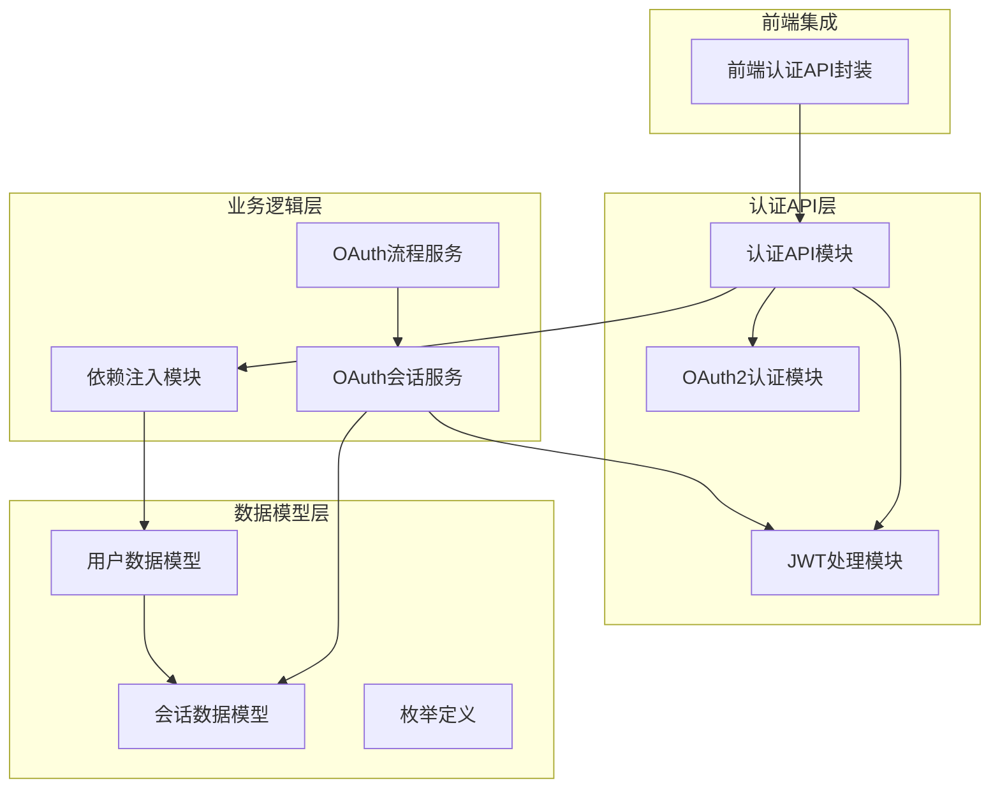
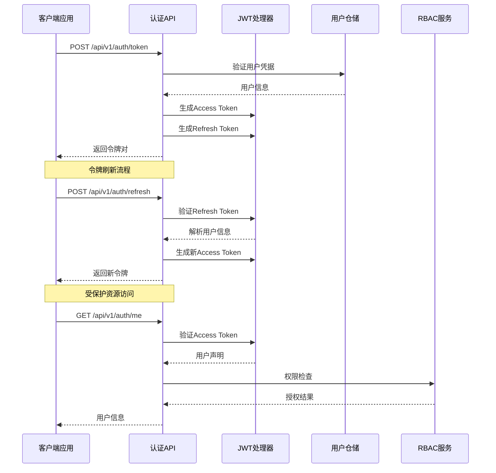
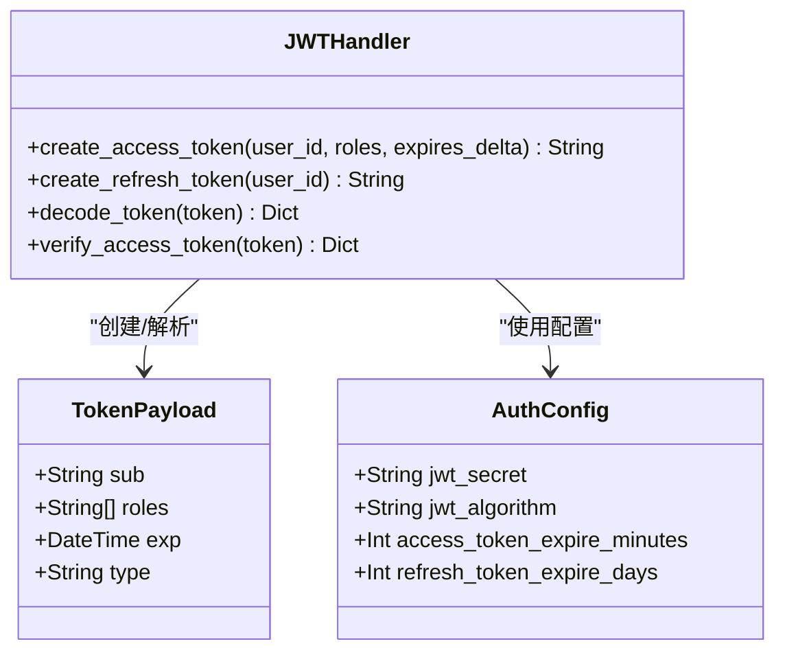
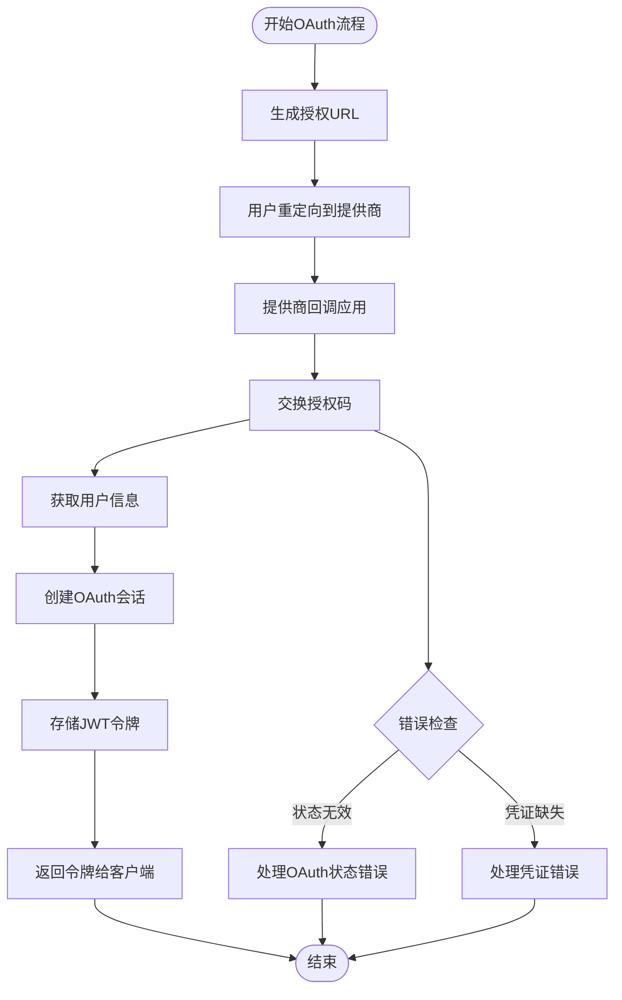
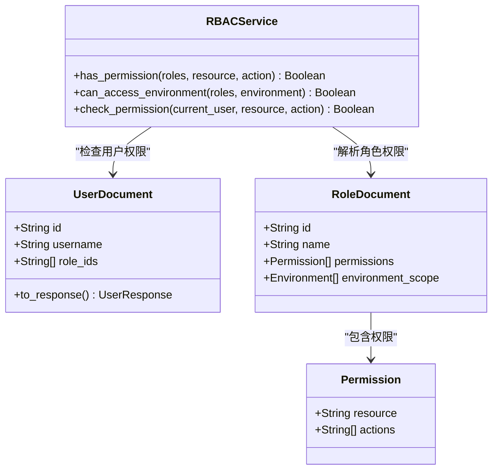
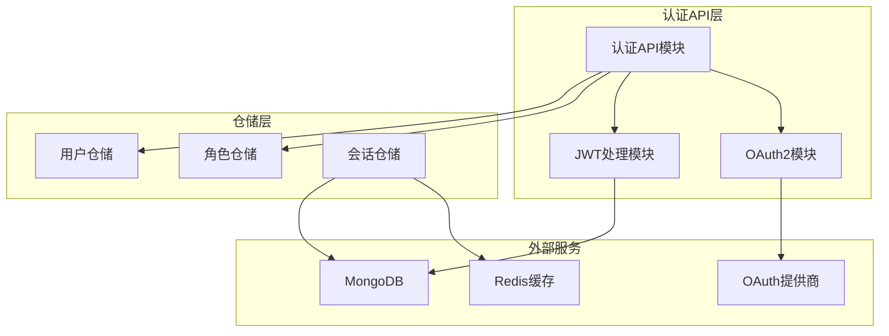

# 认证API

<cite>
**本文档引用的文件**
- [认证API模块](file://tools/flexloop/src/taolib/testing/config_center/server/api/auth.py)
- [JWT处理模块](file://tools/flexloop/src/taolib/testing/config_center/server/auth/jwt_handler.py)
- [OAuth2认证模块](file://tools/flexloop/src/taolib/testing/config_center/server/auth/oauth2.py)
- [依赖注入模块](file://tools/flexloop/src/taolib/testing/config_center/server/dependencies.py)
- [用户与角色数据模型](file://tools/flexloop/src/taolib/testing/config_center/models/user.py)
- [OAuth会话服务模块](file://tools/flexloop/src/taolib/testing/oauth/services/session_service.py)
- [OAuth流程服务模块](file://tools/flexloop/src/taolib/testing/oauth/services/flow_service.py)
- [OAuth会话数据模型](file://tools/flexloop/src/taolib/testing/oauth/models/session.py)
- [OAuth枚举定义](file://tools/flexloop/src/taolib/testing/oauth/models/enums.py)
- [前端认证API封装](file://apps/config-center/src/api/auth.ts)
</cite>

## 目录
1. [简介](#简介)
2. [项目结构](#项目结构)
3. [核心组件](#核心组件)
4. [架构概览](#架构概览)
5. [详细组件分析](#详细组件分析)
6. [依赖关系分析](#依赖关系分析)
7. [性能考虑](#性能考虑)
8. [故障排除指南](#故障排除指南)
9. [结论](#结论)

## 简介

本文件为DAO Apps项目中的认证API提供全面的技术文档。该认证系统基于JWT（JSON Web Token）实现，支持传统的用户名密码登录、令牌刷新以及OAuth2.0授权码流程。系统采用FastAPI框架构建RESTful API，并集成了RBAC（基于角色的访问控制）权限管理机制。

认证系统的核心特性包括：
- 双令牌机制：Access Token（15分钟）和Refresh Token（7天）
- OAuth2.0授权码流程支持Google和GitHub
- RBAC权限控制系统
- 会话管理和令牌撤销功能
- 前后端分离的认证架构

## 项目结构

认证相关代码分布在以下主要模块中：



**图表来源**
- [认证API模块:1-270](file://tools/flexloop/src/taolib/testing/config_center/server/api/auth.py#L1-L270)
- [OAuth会话服务模块:1-238](file://tools/flexloop/src/taolib/testing/oauth/services/session_service.py#L1-L238)
- [用户与角色数据模型:1-163](file://tools/flexloop/src/taolib/testing/config_center/models/user.py#L1-L163)

**章节来源**
- [认证API模块:1-270](file://tools/flexloop/src/taolib/testing/config_center/server/api/auth.py#L1-L270)
- [OAuth会话服务模块:1-238](file://tools/flexloop/src/taolib/testing/oauth/services/session_service.py#L1-L238)

## 核心组件

### JWT令牌管理系统

系统采用双令牌机制确保安全性：
- **Access Token**：短期令牌（15分钟），用于API请求认证
- **Refresh Token**：长期令牌（7天），用于刷新Access Token

令牌结构包含标准声明：
- `sub`：用户标识符
- `roles`：用户角色列表
- `exp`：过期时间戳
- `type`：令牌类型（access/refresh）

### OAuth2.0集成

支持主流OAuth提供商：
- Google OAuth
- GitHub OAuth

提供完整的授权码流程：
1. 生成授权URL
2. 用户授权重定向
3. 交换授权码获取访问令牌
4. 获取用户信息

### RBAC权限控制

基于角色的访问控制系统，支持：
- 资源级权限控制
- 环境访问限制
- 动态权限检查

**章节来源**
- [JWT处理模块:1-94](file://tools/flexloop/src/taolib/testing/config_center/server/auth/jwt_handler.py#L1-L94)
- [OAuth流程服务模块:1-122](file://tools/flexloop/src/taolib/testing/oauth/services/flow_service.py#L1-L122)
- [依赖注入模块:144-198](file://tools/flexloop/src/taolib/testing/config_center/server/dependencies.py#L144-L198)

## 架构概览



**图表来源**
- [认证API模块:92-122](file://tools/flexloop/src/taolib/testing/config_center/server/api/auth.py#L92-L122)
- [JWT处理模块:14-58](file://tools/flexloop/src/taolib/testing/config_center/server/auth/jwt_handler.py#L14-L58)
- [依赖注入模块:109-141](file://tools/flexloop/src/taolib/testing/config_center/server/dependencies.py#L109-L141)

## 详细组件分析

### 认证API端点

#### 用户登录接口

**HTTP方法与路径**
- 方法：POST
- 路径：`/api/v1/auth/token`

**请求参数**
- Content-Type: `application/x-www-form-urlencoded`
- 参数：
  - `username` (string, 必填): 用户名
  - `password` (string, 必填): 密码

**响应格式**
```json
{
  "access_token": "eyJhbGciOiJIUzI1NiIsInR5cCI6IkpXVCJ9...",
  "refresh_token": "eyJhbGciOiJIUzI1NiIsInR5cCI6IkpXVCJ9...",
  "token_type": "bearer"
}
```

**错误处理**
- 401 Unauthorized: 用户名或密码错误
- WWW-Authenticate: Bearer

#### 令牌刷新接口

**HTTP方法与路径**
- 方法：POST
- 路径：`/api/v1/auth/refresh`

**请求参数**
- JSON Body:
  - `refresh_token` (string, 必填): 刷新令牌

**响应格式**
与登录接口相同

**错误处理**
- 401 Unauthorized: 无效的刷新令牌

#### 获取当前用户信息接口

**HTTP方法与路径**
- 方法：GET
- 路径：`/api/v1/auth/me`

**响应格式**
```json
{
  "id": "user_abc123",
  "username": "admin",
  "email": "admin@example.com",
  "display_name": "管理员",
  "roles": ["admin", "editor"],
  "created_at": "2024-01-01T00:00:00Z",
  "updated_at": "2024-01-15T10:30:00Z"
}
```

**错误处理**
- 401 Unauthorized: 未授权

**章节来源**
- [认证API模块:45-267](file://tools/flexloop/src/taolib/testing/config_center/server/api/auth.py#L45-L267)

### JWT令牌处理机制



**图表来源**
- [JWT处理模块:14-94](file://tools/flexloop/src/taolib/testing/config_center/server/auth/jwt_handler.py#L14-L94)

**章节来源**
- [JWT处理模块:1-94](file://tools/flexloop/src/taolib/testing/config_center/server/auth/jwt_handler.py#L1-L94)

### OAuth2.0会话管理



**图表来源**
- [OAuth流程服务模块:40-121](file://tools/flexloop/src/taolib/testing/oauth/services/flow_service.py#L40-L121)

**章节来源**
- [OAuth流程服务模块:1-122](file://tools/flexloop/src/taolib/testing/oauth/services/flow_service.py#L1-L122)
- [OAuth会话服务模块:72-138](file://tools/flexloop/src/taolib/testing/oauth/services/session_service.py#L72-L138)

### RBAC权限控制



**图表来源**
- [依赖注入模块:144-198](file://tools/flexloop/src/taolib/testing/config_center/server/dependencies.py#L144-L198)
- [用户与角色数据模型:13-91](file://tools/flexloop/src/taolib/testing/config_center/models/user.py#L13-L91)

**章节来源**
- [依赖注入模块:144-198](file://tools/flexloop/src/taolib/testing/config_center/server/dependencies.py#L144-L198)
- [用户与角色数据模型:1-163](file://tools/flexloop/src/taolib/testing/config_center/models/user.py#L1-L163)

## 依赖关系分析



**图表来源**
- [认证API模块:15-22](file://tools/flexloop/src/taolib/testing/config_center/server/api/auth.py#L15-L22)
- [OAuth会话服务模块:31-43](file://tools/flexloop/src/taolib/testing/oauth/services/session_service.py#L31-L43)

**章节来源**
- [认证API模块:1-24](file://tools/flexloop/src/taolib/testing/config_center/server/api/auth.py#L1-L24)
- [OAuth会话服务模块:1-27](file://tools/flexloop/src/taolib/testing/oauth/services/session_service.py#L1-L27)

## 性能考虑

### 令牌缓存策略

系统采用多层缓存机制优化性能：
- **Redis缓存**：会话状态快速查询
- **MongoDB索引**：用户和会话数据高效检索
- **令牌预生成**：减少实时计算开销

### 连接池管理

- **数据库连接池**：复用MongoDB连接
- **Redis连接池**：异步客户端管理
- **HTTP客户端池化**：OAuth提供商API调用

### 内存优化

- **令牌黑名单**：内存中维护短期令牌状态
- **会话数据压缩**：Redis存储优化
- **批量操作**：令牌撤销和清理

## 故障排除指南

### 常见认证问题

**令牌过期问题**
- 现象：401 Unauthorized错误
- 解决：使用refresh_token接口刷新令牌
- 预防：实现自动刷新机制

**权限不足问题**
- 现象：403 Forbidden错误
- 解决：检查用户角色和权限配置
- 预防：RBAC权限设计审查

**OAuth流程失败**
- 现象：授权码交换失败
- 解决：验证OAuth提供商凭证和回调URL
- 预防：状态token验证和CSRF防护

### 调试建议

1. **启用详细日志**：监控认证流程和错误
2. **令牌验证**：使用JWT调试工具检查令牌结构
3. **权限审计**：定期检查用户权限分配
4. **性能监控**：关注令牌生成和验证延迟

**章节来源**
- [认证API模块:98-104](file://tools/flexloop/src/taolib/testing/config_center/server/api/auth.py#L98-L104)
- [依赖注入模块:125-141](file://tools/flexloop/src/taolib/testing/config_center/server/dependencies.py#L125-L141)

## 结论

DAO Apps的认证API系统提供了企业级的安全认证解决方案，具有以下优势：

**安全性方面**
- 双令牌机制确保最小权限原则
- OAuth2.0标准流程保障第三方集成安全
- RBAC权限控制实现细粒度访问管理

**可用性方面**
- RESTful API设计简洁易用
- 完整的错误处理和状态码体系
- 前后端分离架构便于扩展

**性能方面**
- 多层缓存优化提升响应速度
- 连接池管理保证高并发性能
- 模块化设计支持水平扩展

该认证系统为企业级应用提供了可靠的身份认证和授权基础设施，支持复杂的业务场景和安全要求。