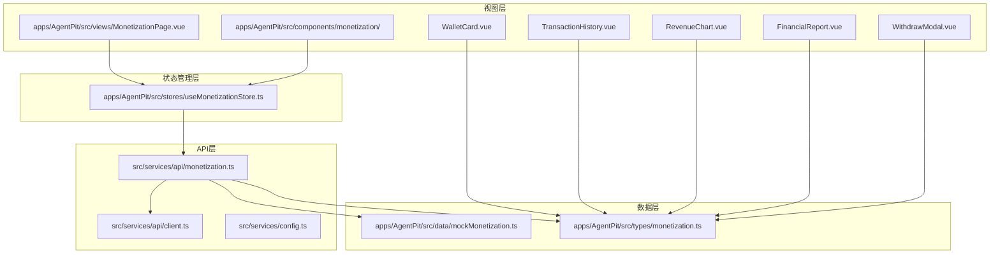
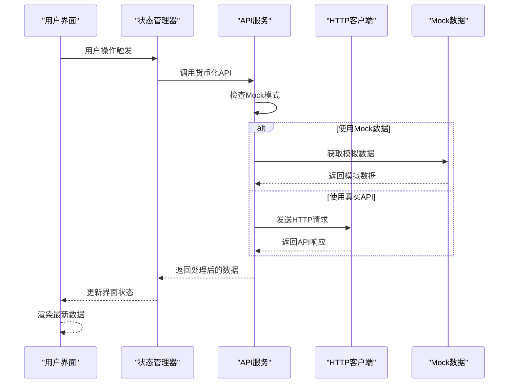
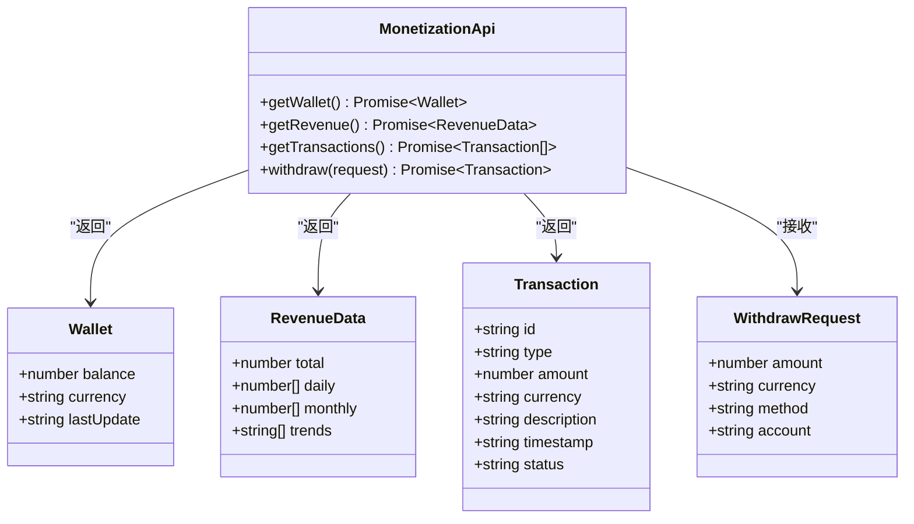
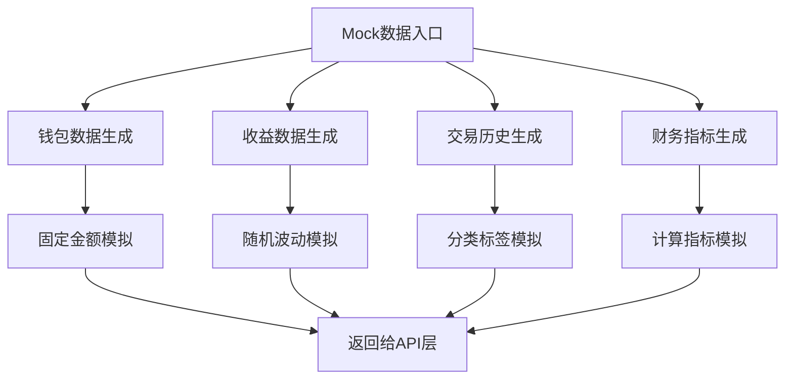
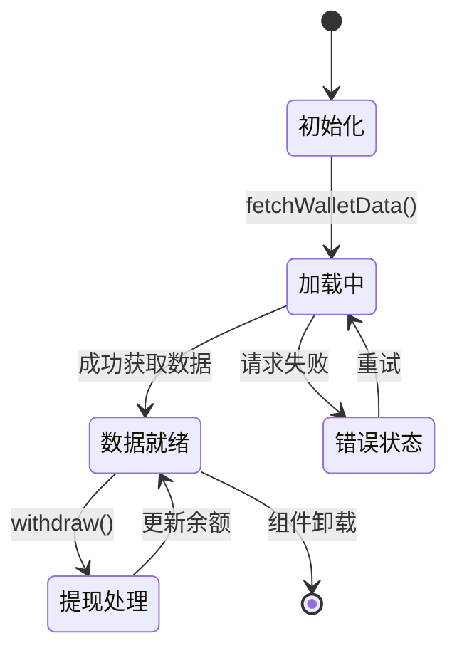
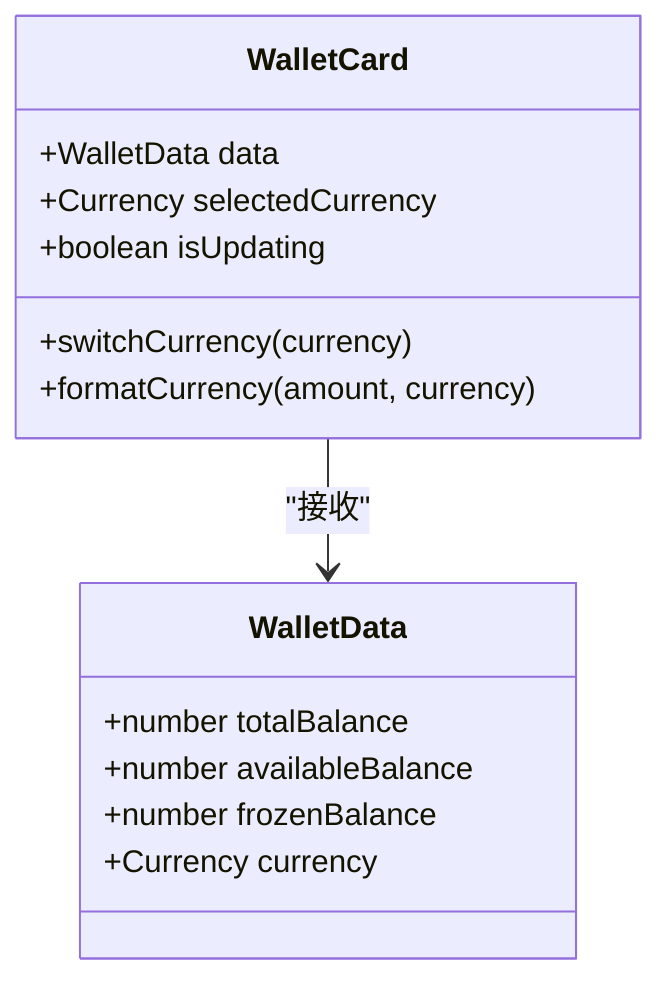
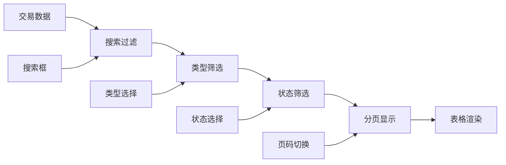
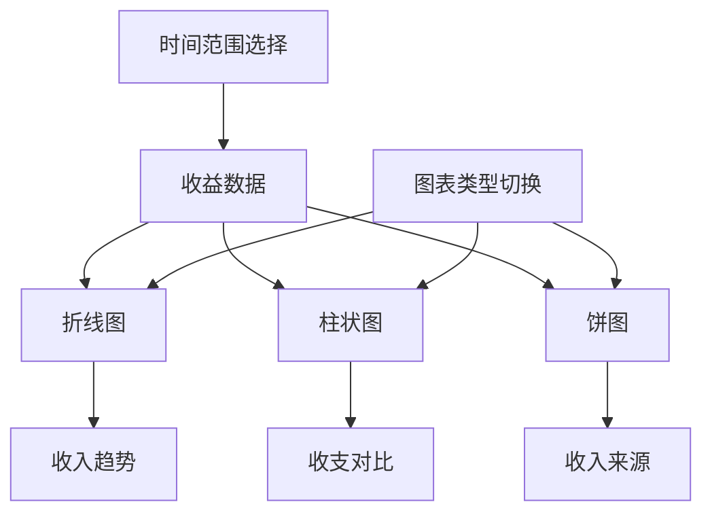
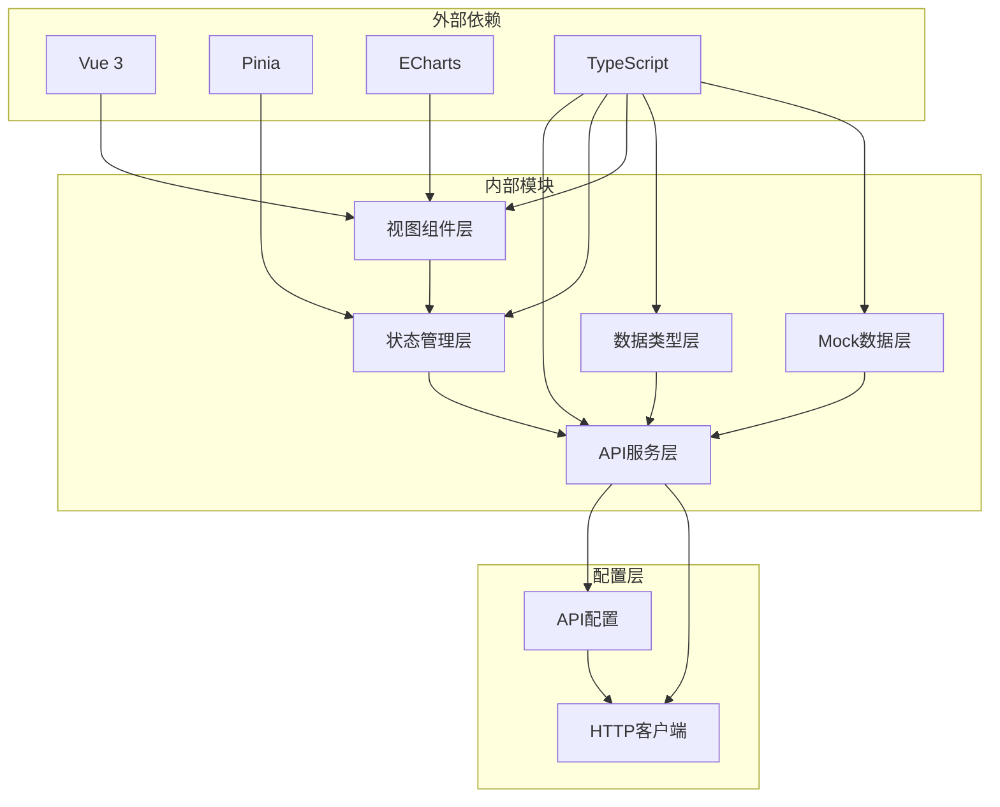

# 货币化API

<cite>
**本文档引用的文件**
- [monetization.ts](file://src/services/api/monetization.ts)
- [client.ts](file://apps/AgentPit/src/services/api/client.ts)
- [config.ts](file://src/services/config.ts)
- [mockMonetization.ts](file://apps/AgentPit/src/data/mockMonetization.ts)
- [monetization.ts](file://apps/AgentPit/src/types/monetization.ts)
- [useMonetizationStore.ts](file://apps/AgentPit/src/stores/useMonetizationStore.ts)
- [WalletCard.vue](file://apps/AgentPit/src/components/monetization/WalletCard.vue)
- [TransactionHistory.vue](file://apps/AgentPit/src/components/monetization/TransactionHistory.vue)
- [RevenueChart.vue](file://apps/AgentPit/src/components/monetization/RevenueChart.vue)
- [FinancialReport.vue](file://apps/AgentPit/src/components/monetization/FinancialReport.vue)
- [WithdrawModal.vue](file://apps/AgentPit/src/components/monetization/WithdrawModal.vue)
- [MonetizationPage.vue](file://apps/AgentPit/src/views/MonetizationPage.vue)
</cite>

## 目录
1. [简介](#简介)
2. [项目结构](#项目结构)
3. [核心组件](#核心组件)
4. [架构概览](#架构概览)
5. [详细组件分析](#详细组件分析)
6. [依赖关系分析](#依赖关系分析)
7. [性能考虑](#性能考虑)
8. [故障排除指南](#故障排除指南)
9. [结论](#结论)

## 简介

货币化API是DAO Apps平台中智能体变现系统的核心接口集合，为开发者提供了完整的收益管理、提现申请、交易历史查询和财务报表展示功能。该系统采用前后端分离架构，支持真实API调用和Mock数据模拟两种模式，便于开发、测试和生产环境的灵活切换。

系统主要面向智能体服务提供商，提供以下核心功能：
- 钱包余额查询和管理
- 收益数据可视化分析
- 交易历史记录追踪
- 多种提现方式支持
- 实时财务指标监控

## 项目结构

货币化API系统采用模块化设计，主要分布在以下目录结构中：

**图表来源**
- [monetization.ts:1-77](file://src/services/api/monetization.ts#L1-L77)
- [client.ts:1-105](file://apps/AgentPit/src/services/api/client.ts#L1-L105)
- [mockMonetization.ts:1-145](file://apps/AgentPit/src/data/mockMonetization.ts#L1-L145)

**章节来源**
- [monetization.ts:1-77](file://src/services/api/monetization.ts#L1-L77)
- [client.ts:1-105](file://apps/AgentPit/src/services/api/client.ts#L1-L105)
- [config.ts:1-11](file://src/services/config.ts#L1-L11)

## 核心组件

货币化API系统由多个相互协作的组件构成，每个组件都有明确的职责分工：

### API服务层
- **monetizationApi**: 核心API服务对象，提供钱包查询、收益获取、交易历史和提现申请功能
- **httpClient**: 封装的HTTP客户端，处理认证、错误处理和请求配置
- **API_CONFIG**: 配置管理，支持Mock模式切换和环境变量配置

### 数据类型定义
- **Wallet**: 钱包余额数据结构
- **RevenueData**: 收益数据接口定义
- **Transaction**: 交易记录类型
- **WithdrawRequest**: 提现请求参数

### 状态管理
- **useMonetizationStore**: Pinia状态管理，协调API调用和UI更新

**章节来源**
- [monetization.ts:8-76](file://src/services/api/monetization.ts#L8-L76)
- [monetization.ts:1-135](file://apps/AgentPit/src/types/monetization.ts#L1-L135)

## 架构概览

货币化API采用分层架构设计，确保了良好的可维护性和扩展性：

**图表来源**
- [monetization.ts:42-75](file://src/services/api/monetization.ts#L42-L75)
- [client.ts:33-69](file://apps/AgentPit/src/services/api/client.ts#L33-L69)

系统架构特点：
- **双模式支持**: 同时支持Mock数据和真实API调用
- **统一错误处理**: 集中的错误处理机制
- **类型安全**: 完整的TypeScript类型定义
- **响应式更新**: 自动化的数据同步和界面更新

## 详细组件分析

### API服务组件

#### 货币化API服务
货币化API服务是整个系统的核心，提供了四个主要接口：

**图表来源**
- [monetization.ts:9-37](file://src/services/api/monetization.ts#L9-L37)

#### Mock数据模拟
系统内置了完整的Mock数据生成机制：

**图表来源**
- [mockMonetization.ts:43-144](file://apps/AgentPit/src/data/mockMonetization.ts#L43-L144)

**章节来源**
- [monetization.ts:40-76](file://src/services/api/monetization.ts#L40-L76)
- [mockMonetization.ts:1-145](file://apps/AgentPit/src/data/mockMonetization.ts#L1-L145)

### 状态管理组件

#### Pinia状态管理器
状态管理器负责协调各个组件之间的数据流：

**图表来源**
- [useMonetizationStore.ts:66-142](file://apps/AgentPit/src/stores/useMonetizationStore.ts#L66-L142)

状态管理特性：
- **响应式数据**: 自动追踪数据变化
- **计算属性**: 智能的派生状态
- **异步操作**: 完善的异步状态管理
- **错误处理**: 集中的异常捕获

**章节来源**
- [useMonetizationStore.ts:1-153](file://apps/AgentPit/src/stores/useMonetizationStore.ts#L1-L153)

### 视图组件

#### 钱包卡片组件
钱包卡片提供了直观的余额展示和交互功能：

**图表来源**
- [WalletCard.vue:1-124](file://apps/AgentPit/src/components/monetization/WalletCard.vue#L1-L124)

组件功能：
- **多币种支持**: 支持CNY、USD、EUR等多种货币
- **实时更新**: 动态余额显示
- **交互按钮**: 充值和提现操作入口

**章节来源**
- [WalletCard.vue:1-124](file://apps/AgentPit/src/components/monetization/WalletCard.vue#L1-L124)

#### 交易历史组件
交易历史组件提供了完整的交易记录管理和筛选功能：

**图表来源**
- [TransactionHistory.vue:43-62](file://apps/AgentPit/src/components/monetization/TransactionHistory.vue#L43-L62)

**章节来源**
- [TransactionHistory.vue:1-273](file://apps/AgentPit/src/components/monetization/TransactionHistory.vue#L1-L273)

#### 收益图表组件
收益图表组件集成了多种可视化图表：

**图表来源**
- [RevenueChart.vue:46-253](file://apps/AgentPit/src/components/monetization/RevenueChart.vue#L46-L253)

**章节来源**
- [RevenueChart.vue:1-333](file://apps/AgentPit/src/components/monetization/RevenueChart.vue#L1-L333)

## 依赖关系分析

货币化API系统的依赖关系呈现清晰的层次结构：

**图表来源**
- [monetization.ts:1-77](file://src/services/api/monetization.ts#L1-L77)
- [useMonetizationStore.ts:1-153](file://apps/AgentPit/src/stores/useMonetizationStore.ts#L1-L153)

**章节来源**
- [client.ts:1-105](file://apps/AgentPit/src/services/api/client.ts#L1-L105)
- [config.ts:1-11](file://src/services/config.ts#L1-L11)

## 性能考虑

货币化API系统在设计时充分考虑了性能优化：

### 数据缓存策略
- **状态持久化**: 使用Pinia进行状态缓存
- **组件缓存**: Vue组件级别的渲染缓存
- **请求去重**: 避免重复的API请求

### 异步处理优化
- **并发控制**: 合理的并发请求管理
- **超时处理**: 30秒默认超时设置
- **重试机制**: 最多重试3次，间隔1秒

### 内存管理
- **垃圾回收**: 及时清理事件监听器
- **组件卸载**: 自动清理定时器和订阅
- **数据清理**: 状态重置和资源释放

## 故障排除指南

### 常见问题及解决方案

#### API调用失败
**问题症状**: 页面加载空白或显示错误信息
**可能原因**:
- 网络连接问题
- API服务器不可用
- 认证令牌过期

**解决步骤**:
1. 检查网络连接状态
2. 验证API服务器状态
3. 重新登录获取新令牌
4. 查看浏览器开发者工具的网络面板

#### Mock数据不显示
**问题症状**: 页面显示空数据或默认值
**可能原因**:
- Mock模式未正确启用
- 数据生成函数异常

**解决步骤**:
1. 检查环境变量VITE_USE_MOCK_API
2. 验证Mock数据生成逻辑
3. 确认数据类型定义正确

#### 提现功能异常
**问题症状**: 提现请求无法完成
**可能原因**:
- 余额不足
- 参数验证失败
- 网络超时

**解决步骤**:
1. 检查可用余额是否充足
2. 验证输入参数格式
3. 查看网络请求状态
4. 重试操作

**章节来源**
- [client.ts:56-68](file://apps/AgentPit/src/services/api/client.ts#L56-L68)
- [useMonetizationStore.ts:114-142](file://apps/AgentPit/src/stores/useMonetizationStore.ts#L114-L142)

## 结论

货币化API系统是一个功能完整、架构清晰的智能体变现解决方案。系统通过模块化设计实现了高内聚、低耦合的组件结构，支持Mock数据和真实API的灵活切换，为开发者提供了便捷的开发和测试体验。

系统的主要优势包括：
- **完整的功能覆盖**: 涵盖了变现业务的所有核心需求
- **灵活的部署模式**: 支持本地开发、测试和生产环境
- **强大的扩展性**: 清晰的架构便于功能扩展和维护
- **完善的错误处理**: 全面的异常处理和用户反馈机制

未来可以考虑的功能增强方向：
- 增加更多的提现方式支持
- 实现实时数据推送功能
- 添加更详细的财务分析报告
- 优化移动端用户体验