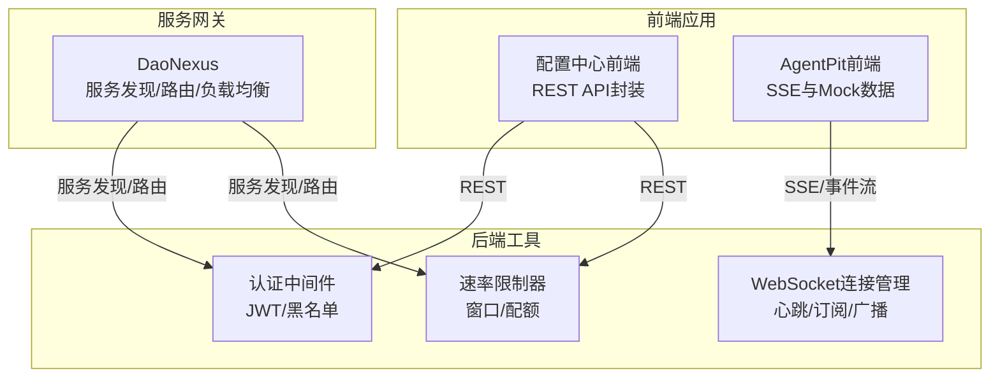
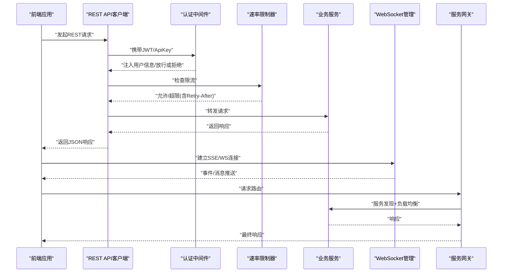
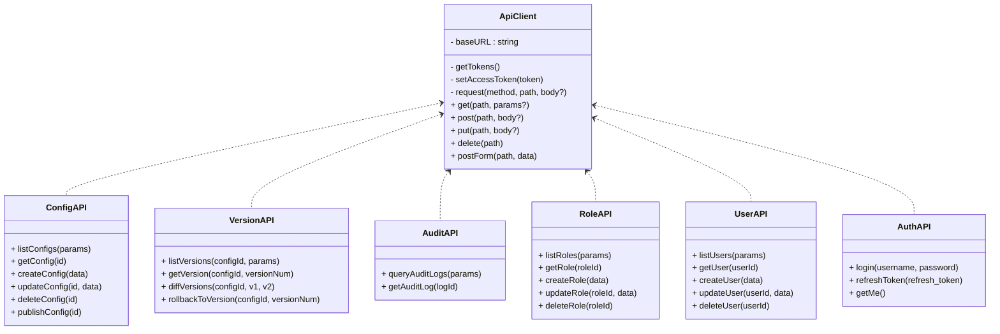
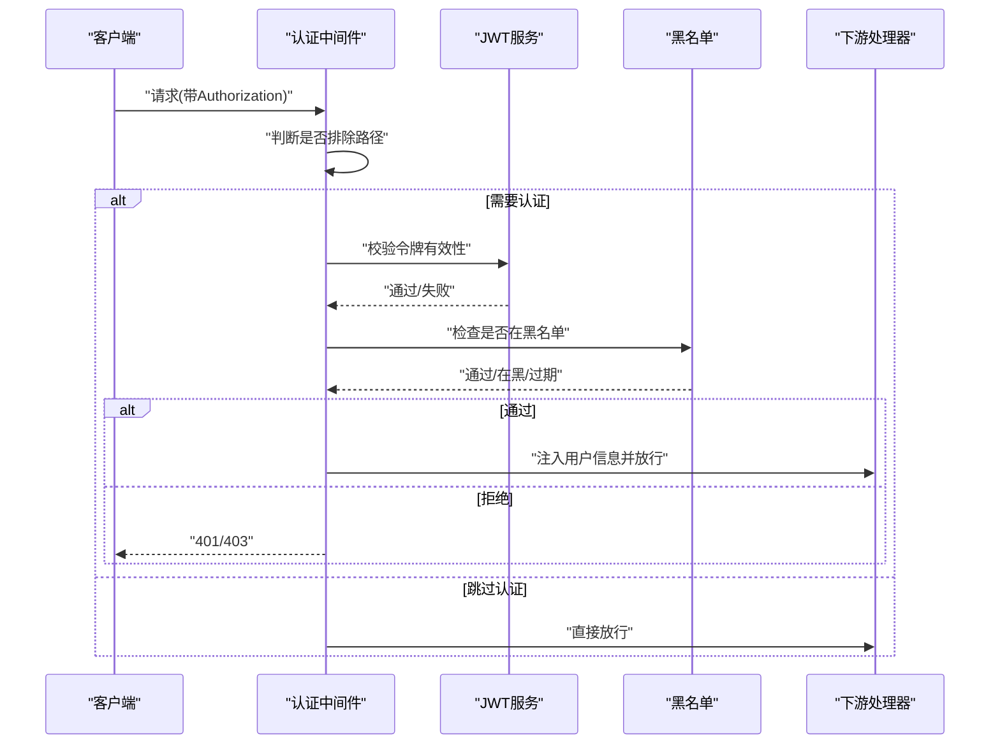
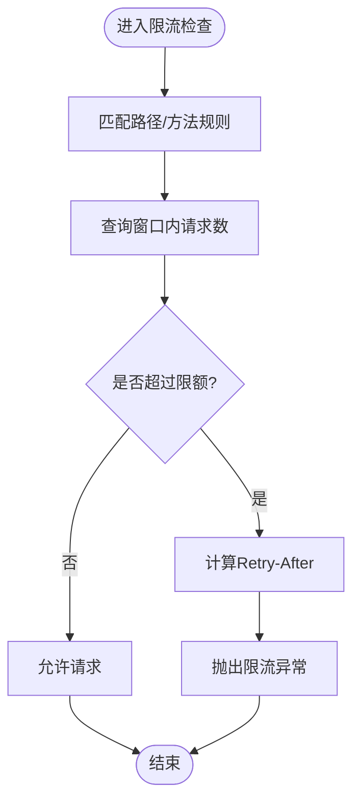
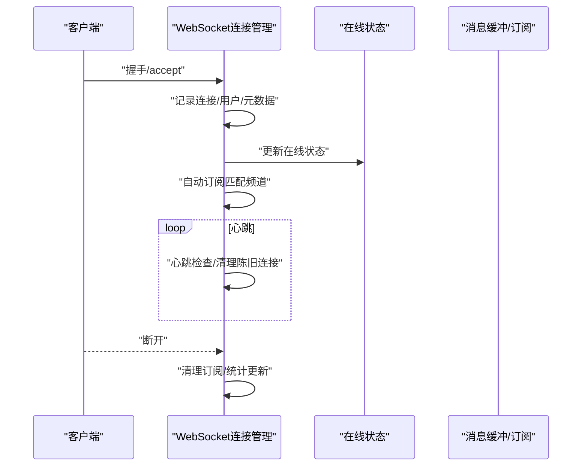
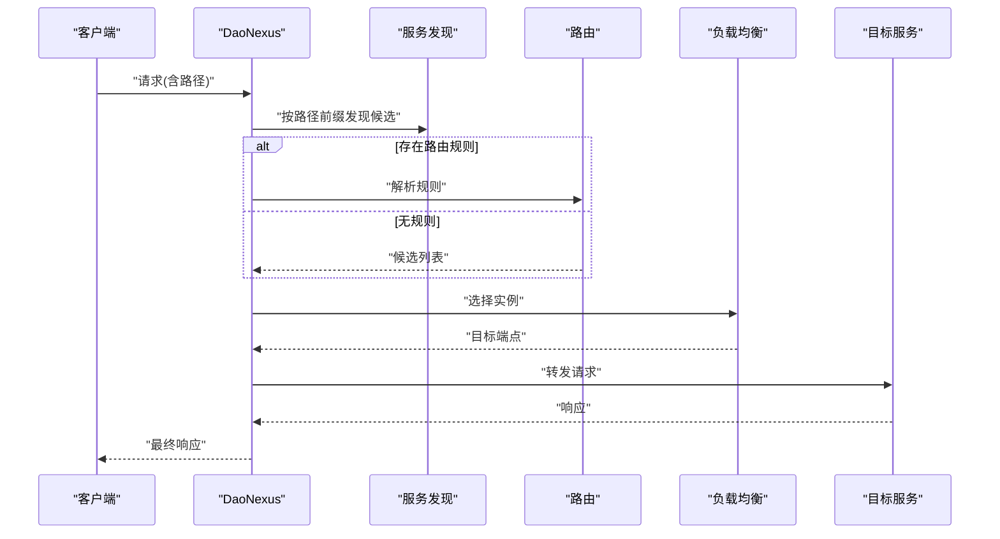
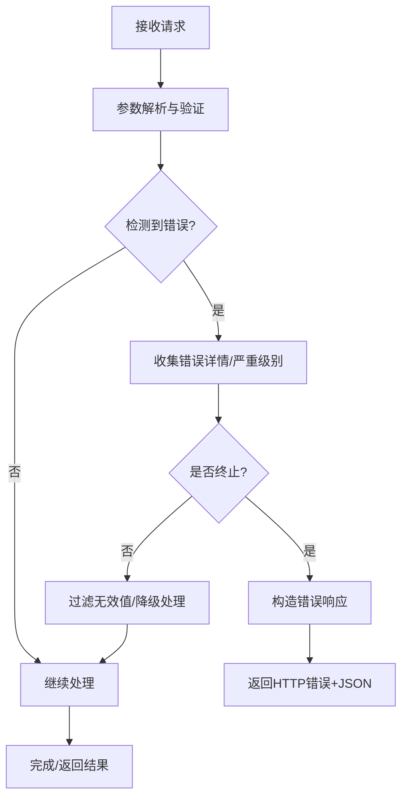
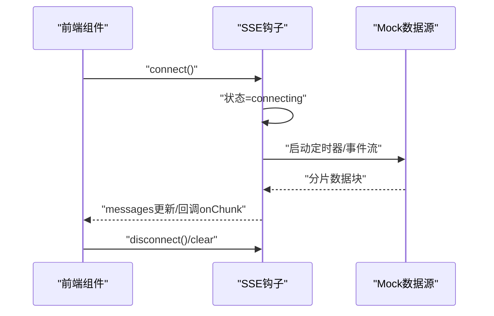
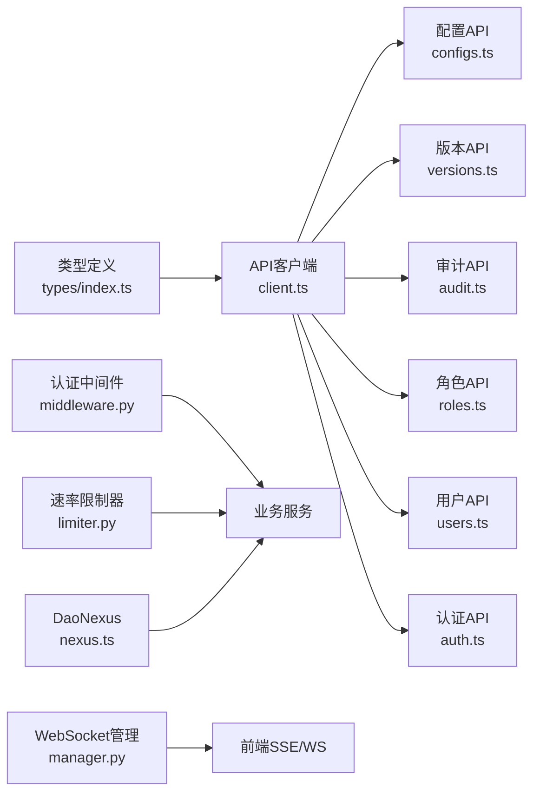

# API接口与集成

<cite>
**本文引用的文件**
- [apps/config-center/src/api/client.ts](file://apps/config-center/src/api/client.ts)
- [apps/config-center/src/api/configs.ts](file://apps/config-center/src/api/configs.ts)
- [apps/config-center/src/api/versions.ts](file://apps/config-center/src/api/versions.ts)
- [apps/config-center/src/api/audit.ts](file://apps/config-center/src/api/audit.ts)
- [apps/config-center/src/api/roles.ts](file://apps/config-center/src/api/roles.ts)
- [apps/config-center/src/api/users.ts](file://apps/config-center/src/api/users.ts)
- [apps/config-center/src/api/auth.ts](file://apps/config-center/src/api/auth.ts)
- [apps/config-center/src/types/index.ts](file://apps/config-center/src/types/index.ts)
- [apps/AgentPit/src/composables/useSSE.ts](file://apps/AgentPit/src/composables/useSSE.ts)
- [apps/AgentPit/src/data/mockChat.ts](file://apps/AgentPit/src/data/mockChat.ts)
- [apps/AgentPit/src/data/mockCollaboration.ts](file://apps/AgentPit/src/data/mockCollaboration.ts)
- [tools/flexloop/src/taolib/testing/auth/fastapi/middleware.py](file://tools/flexloop/src/taolib/testing/auth/fastapi/middleware.py)
- [tools/flexloop/tests/testing/test_auth/test_fastapi/test_middleware.py](file://tools/flexloop/tests/testing/test_auth/test_fastapi/test_middleware.py)
- [tools/flexloop/src/taolib/testing/rate_limiter/limiter.py](file://tools/flexloop/src/taolib/testing/rate_limiter/limiter.py)
- [tools/flexloop/src/taolib/testing/config_center/websocket/manager.py](file://tools/flexloop/src/taolib/testing/config_center/websocket/manager.py)
- [tools/flexloop/tests/testing/test_config_center/test_push_service.py](file://tools/flexloop/tests/testing/test_config_center/test_push_service.py)
- [apps/DaoMind/packages/daoNexus/src/nexus.ts](file://apps/DaoMind/packages/daoNexus/src/nexus.ts)
- [apps/DaoMind/packages/daoNexus/src/__tests__/nexus.test.ts](file://apps/DaoMind/packages/daoNexus/src/__tests__/nexus.test.ts)
- [tools/flexloop/tests/testing/test_multi_agent/test_load_balancer.py](file://tools/flexloop/tests/testing/test_multi_agent/test_load_balancer.py)
- [skills/daoSkilLs/skills/task-execution-summary/references/error-codes.md](file://skills/daoSkilLs/skills/task-execution-summary/references/error-codes.md)
- [skills/daoSkilLs/skills/task-execution-summary/references/examples-v2.md](file://skills/daoSkilLs/skills/task-execution-summary/references/examples-v2.md)
</cite>

## 目录
1. [简介](#简介)
2. [项目结构](#项目结构)
3. [核心组件](#核心组件)
4. [架构总览](#架构总览)
5. [详细组件分析](#详细组件分析)
6. [依赖关系分析](#依赖关系分析)
7. [性能考量](#性能考量)
8. [故障排查指南](#故障排查指南)
9. [结论](#结论)
10. [附录](#附录)

## 简介
本文件面向API接口与集成的开发与运维，系统性阐述RESTful API设计原则、WebSocket通信实现、第三方服务集成、认证授权与RBAC、API版本管理、请求响应格式与数据校验、错误处理机制、以及与前端应用的集成方式、Mock数据与测试策略。同时给出最佳实践、性能优化建议与安全防护措施，帮助团队在多应用与多服务场景下构建稳定、可演进、可观测的API体系。

## 项目结构
本仓库包含多个前端应用与后端工具包，其中与API与集成密切相关的模块包括：
- 配置中心前端API层：封装HTTP客户端、认证、配置、版本、审计、角色与用户管理等REST接口。
- AgentPit前端：SSE与Mock数据用于演示实时流式输出与对话交互。
- FlexLoop后端工具：认证中间件、速率限制器、WebSocket连接管理与推送桥接。
- DaoNexus服务网关：服务发现、路由、连接管理与负载均衡的集成示例。
- 技能与错误规范：统一的错误响应结构与示例，便于前后端一致的错误处理。

**图示来源**
- [apps/config-center/src/api/client.ts:1-171](file://apps/config-center/src/api/client.ts#L1-L171)
- [apps/config-center/src/api/configs.ts:1-32](file://apps/config-center/src/api/configs.ts#L1-L32)
- [apps/AgentPit/src/composables/useSSE.ts:1-139](file://apps/AgentPit/src/composables/useSSE.ts#L1-L139)
- [tools/flexloop/src/taolib/testing/auth/fastapi/middleware.py:1-80](file://tools/flexloop/src/taolib/testing/auth/fastapi/middleware.py#L1-L80)
- [tools/flexloop/src/taolib/testing/rate_limiter/limiter.py:130-172](file://tools/flexloop/src/taolib/testing/rate_limiter/limiter.py#L130-L172)
- [tools/flexloop/src/taolib/testing/config_center/websocket/manager.py:43-154](file://tools/flexloop/src/taolib/testing/config_center/websocket/manager.py#L43-L154)
- [apps/DaoMind/packages/daoNexus/src/nexus.ts:1-38](file://apps/DaoMind/packages/daoNexus/src/nexus.ts#L1-L38)

**章节来源**
- [apps/config-center/src/api/client.ts:1-171](file://apps/config-center/src/api/client.ts#L1-L171)
- [apps/AgentPit/src/composables/useSSE.ts:1-139](file://apps/AgentPit/src/composables/useSSE.ts#L1-L139)
- [tools/flexloop/src/taolib/testing/auth/fastapi/middleware.py:1-80](file://tools/flexloop/src/taolib/testing/auth/fastapi/middleware.py#L1-L80)
- [tools/flexloop/src/taolib/testing/rate_limiter/limiter.py:130-172](file://tools/flexloop/src/taolib/testing/rate_limiter/limiter.py#L130-L172)
- [tools/flexloop/src/taolib/testing/config_center/websocket/manager.py:43-154](file://tools/flexloop/src/taolib/testing/config_center/websocket/manager.py#L43-L154)
- [apps/DaoMind/packages/daoNexus/src/nexus.ts:1-38](file://apps/DaoMind/packages/daoNexus/src/nexus.ts#L1-L38)

## 核心组件
- REST API客户端与封装
  - 统一的HTTP客户端负责基础URL、鉴权令牌持久化与刷新、错误包装、GET/POST/PUT/DELETE/Form提交等。
  - 配置中心API模块按功能拆分：配置、版本、审计、角色、用户、认证等。
- 认证与授权中间件
  - 提供JWT认证中间件与简单认证中间件，支持排除路径、令牌提取、黑名单校验。
- 速率限制器
  - 基于标识符、路径与方法的窗口限流，支持超限抛错与Retry-After计算。
- WebSocket连接管理
  - 支持连接生命周期、心跳监控、订阅管理、用户级多设备连接、在线状态与统计。
- 服务网关与负载均衡
  - DaoNexus聚合连接管理、路由、负载均衡与服务发现，支持规则解析与目标选择。
- 错误处理规范
  - 统一错误响应结构、错误码分类、严重级别、恢复建议与文档引用，便于前端友好展示与自动化处理。

**章节来源**
- [apps/config-center/src/api/client.ts:1-171](file://apps/config-center/src/api/client.ts#L1-L171)
- [apps/config-center/src/api/configs.ts:1-32](file://apps/config-center/src/api/configs.ts#L1-L32)
- [apps/config-center/src/api/versions.ts:1-29](file://apps/config-center/src/api/versions.ts#L1-L29)
- [apps/config-center/src/api/audit.ts:1-18](file://apps/config-center/src/api/audit.ts#L1-L18)
- [apps/config-center/src/api/roles.ts:1-26](file://apps/config-center/src/api/roles.ts#L1-L26)
- [apps/config-center/src/api/users.ts:1-26](file://apps/config-center/src/api/users.ts#L1-L26)
- [apps/config-center/src/api/auth.ts:1-14](file://apps/config-center/src/api/auth.ts#L1-L14)
- [tools/flexloop/src/taolib/testing/auth/fastapi/middleware.py:1-80](file://tools/flexloop/src/taolib/testing/auth/fastapi/middleware.py#L1-L80)
- [tools/flexloop/src/taolib/testing/rate_limiter/limiter.py:130-172](file://tools/flexloop/src/taolib/testing/rate_limiter/limiter.py#L130-L172)
- [tools/flexloop/src/taolib/testing/config_center/websocket/manager.py:43-154](file://tools/flexloop/src/taolib/testing/config_center/websocket/manager.py#L43-L154)
- [apps/DaoMind/packages/daoNexus/src/nexus.ts:1-38](file://apps/DaoMind/packages/daoNexus/src/nexus.ts#L1-L38)
- [skills/daoSkilLs/skills/task-execution-summary/references/error-codes.md:92-161](file://skills/daoSkilLs/skills/task-execution-summary/references/error-codes.md#L92-L161)

## 架构总览
下图展示了从前端API调用到后端中间件、速率限制、WebSocket与服务网关的整体链路。

**图示来源**
- [apps/config-center/src/api/client.ts:1-171](file://apps/config-center/src/api/client.ts#L1-L171)
- [tools/flexloop/src/taolib/testing/auth/fastapi/middleware.py:1-80](file://tools/flexloop/src/taolib/testing/auth/fastapi/middleware.py#L1-L80)
- [tools/flexloop/src/taolib/testing/rate_limiter/limiter.py:130-172](file://tools/flexloop/src/taolib/testing/rate_limiter/limiter.py#L130-L172)
- [tools/flexloop/src/taolib/testing/config_center/websocket/manager.py:43-154](file://tools/flexloop/src/taolib/testing/config_center/websocket/manager.py#L43-L154)
- [apps/DaoMind/packages/daoNexus/src/nexus.ts:1-38](file://apps/DaoMind/packages/daoNexus/src/nexus.ts#L1-L38)

## 详细组件分析

### REST API客户端与封装
- 统一基类负责：
  - 基础URL规范化
  - 令牌读取/刷新/持久化
  - GET/POST/PUT/DELETE/Form提交
  - 错误包装与HTTP状态映射
- 配置中心API模块：
  - 配置：分页查询、详情、创建、更新、删除、发布
  - 版本：列出/查看/差异/回滚
  - 审计：日志查询/详情
  - 角色：CRUD
  - 用户：CRUD
  - 认证：登录、刷新、当前用户

**图示来源**
- [apps/config-center/src/api/client.ts:1-171](file://apps/config-center/src/api/client.ts#L1-L171)
- [apps/config-center/src/api/configs.ts:1-32](file://apps/config-center/src/api/configs.ts#L1-L32)
- [apps/config-center/src/api/versions.ts:1-29](file://apps/config-center/src/api/versions.ts#L1-L29)
- [apps/config-center/src/api/audit.ts:1-18](file://apps/config-center/src/api/audit.ts#L1-L18)
- [apps/config-center/src/api/roles.ts:1-26](file://apps/config-center/src/api/roles.ts#L1-L26)
- [apps/config-center/src/api/users.ts:1-26](file://apps/config-center/src/api/users.ts#L1-L26)
- [apps/config-center/src/api/auth.ts:1-14](file://apps/config-center/src/api/auth.ts#L1-L14)

**章节来源**
- [apps/config-center/src/api/client.ts:1-171](file://apps/config-center/src/api/client.ts#L1-L171)
- [apps/config-center/src/api/configs.ts:1-32](file://apps/config-center/src/api/configs.ts#L1-L32)
- [apps/config-center/src/api/versions.ts:1-29](file://apps/config-center/src/api/versions.ts#L1-L29)
- [apps/config-center/src/api/audit.ts:1-18](file://apps/config-center/src/api/audit.ts#L1-L18)
- [apps/config-center/src/api/roles.ts:1-26](file://apps/config-center/src/api/roles.ts#L1-L26)
- [apps/config-center/src/api/users.ts:1-26](file://apps/config-center/src/api/users.ts#L1-L26)
- [apps/config-center/src/api/auth.ts:1-14](file://apps/config-center/src/api/auth.ts#L1-L14)

### 认证授权与RBAC
- 中间件职责：
  - 路径白名单跳过
  - Bearer令牌提取
  - JWT校验与黑名单检查
- 测试覆盖：
  - 有效JWT放行
  - 无认证返回401
  - API Key与JWT组合校验
  - 基于角色的访问控制

**图示来源**
- [tools/flexloop/src/taolib/testing/auth/fastapi/middleware.py:1-80](file://tools/flexloop/src/taolib/testing/auth/fastapi/middleware.py#L1-L80)
- [tools/flexloop/tests/testing/test_auth/test_fastapi/test_middleware.py:43-87](file://tools/flexloop/tests/testing/test_auth/test_fastapi/test_middleware.py#L43-L87)

**章节来源**
- [tools/flexloop/src/taolib/testing/auth/fastapi/middleware.py:1-80](file://tools/flexloop/src/taolib/testing/auth/fastapi/middleware.py#L1-L80)
- [tools/flexloop/tests/testing/test_auth/test_fastapi/test_middleware.py:43-87](file://tools/flexloop/tests/testing/test_auth/test_fastapi/test_middleware.py#L43-L87)

### 速率限制器
- 核心逻辑：
  - 依据路径与方法匹配规则
  - 查询窗口内请求数
  - 计算剩余配额与Retry-After
  - 超限时抛出限流异常
- 场景：
  - 用户ID/IP维度限流
  - 不同端点差异化配额

**图示来源**
- [tools/flexloop/src/taolib/testing/rate_limiter/limiter.py:130-172](file://tools/flexloop/src/taolib/testing/rate_limiter/limiter.py#L130-L172)

**章节来源**
- [tools/flexloop/src/taolib/testing/rate_limiter/limiter.py:130-172](file://tools/flexloop/src/taolib/testing/rate_limiter/limiter.py#L130-L172)

### WebSocket通信与推送
- 连接管理：
  - 接受连接、记录用户与元数据
  - 多设备连接、订阅频道、自动订阅匹配
  - 在线状态跟踪、心跳监控、统计指标
- 测试覆盖：
  - 连接/断开、多设备、清理订阅
  - 实例ID、PubSub模式订阅

**图示来源**
- [tools/flexloop/src/taolib/testing/config_center/websocket/manager.py:43-154](file://tools/flexloop/src/taolib/testing/config_center/websocket/manager.py#L43-L154)
- [tools/flexloop/tests/testing/test_config_center/test_push_service.py:251-880](file://tools/flexloop/tests/testing/test_config_center/test_push_service.py#L251-L880)

**章节来源**
- [tools/flexloop/src/taolib/testing/config_center/websocket/manager.py:43-154](file://tools/flexloop/src/taolib/testing/config_center/websocket/manager.py#L43-L154)
- [tools/flexloop/tests/testing/test_config_center/test_push_service.py:251-880](file://tools/flexloop/tests/testing/test_config_center/test_push_service.py#L251-L880)

### 服务网关与负载均衡
- DaoNexus职责：
  - 服务发现：按服务名查找候选实例
  - 路由解析：优先使用规则，否则回退到候选列表
  - 连接管理、负载均衡与请求转发
- 测试验证：
  - 单例一致性
  - 注册服务后可正确转发

**图示来源**
- [apps/DaoMind/packages/daoNexus/src/nexus.ts:1-38](file://apps/DaoMind/packages/daoNexus/src/nexus.ts#L1-L38)
- [apps/DaoMind/packages/daoNexus/src/__tests__/nexus.test.ts:53-101](file://apps/DaoMind/packages/daoNexus/src/__tests__/nexus.test.ts#L53-L101)

**章节来源**
- [apps/DaoMind/packages/daoNexus/src/nexus.ts:1-38](file://apps/DaoMind/packages/daoNexus/src/nexus.ts#L1-L38)
- [apps/DaoMind/packages/daoNexus/src/__tests__/nexus.test.ts:53-101](file://apps/DaoMind/packages/daoNexus/src/__tests__/nexus.test.ts#L53-L101)
- [tools/flexloop/tests/testing/test_multi_agent/test_load_balancer.py:216-232](file://tools/flexloop/tests/testing/test_multi_agent/test_load_balancer.py#L216-L232)

### 错误处理与响应规范
- 统一错误结构：
  - success、error.code/name/message/category/severity/http_status/timestamp/request_id/context/recovery
  - metadata.version/service
- 错误码分类与处理策略：
  - 参数验证、数据源、分析引擎、报告生成、系统资源、超时等
- 示例与流程：
  - 参数缺失/越界/组合非法的错误收集与恢复建议
  - 终止/降级策略与提示

**图示来源**
- [skills/daoSkilLs/skills/task-execution-summary/references/error-codes.md:92-161](file://skills/daoSkilLs/skills/task-execution-summary/references/error-codes.md#L92-L161)
- [skills/daoSkilLs/skills/task-execution-summary/references/examples-v2.md:310-460](file://skills/daoSkilLs/skills/task-execution-summary/references/examples-v2.md#L310-L460)

**章节来源**
- [skills/daoSkilLs/skills/task-execution-summary/references/error-codes.md:92-161](file://skills/daoSkilLs/skills/task-execution-summary/references/error-codes.md#L92-L161)
- [skills/daoSkilLs/skills/task-execution-summary/references/examples-v2.md:310-460](file://skills/daoSkilLs/skills/task-execution-summary/references/examples-v2.md#L310-L460)

### 前端集成与Mock数据
- SSE集成：
  - 状态机：connecting/connected/disconnected/error
  - 模拟事件流与分片推送，便于前端联调
- Mock数据：
  - AgentPit：聊天对话、快捷命令、协作任务与消息、AI响应模板
  - 用于前端开发与端到端测试，降低后端依赖

**图示来源**
- [apps/AgentPit/src/composables/useSSE.ts:1-139](file://apps/AgentPit/src/composables/useSSE.ts#L1-L139)
- [apps/AgentPit/src/data/mockChat.ts:1-143](file://apps/AgentPit/src/data/mockChat.ts#L1-L143)
- [apps/AgentPit/src/data/mockCollaboration.ts:1-301](file://apps/AgentPit/src/data/mockCollaboration.ts#L1-L301)

**章节来源**
- [apps/AgentPit/src/composables/useSSE.ts:1-139](file://apps/AgentPit/src/composables/useSSE.ts#L1-L139)
- [apps/AgentPit/src/data/mockChat.ts:1-143](file://apps/AgentPit/src/data/mockChat.ts#L1-L143)
- [apps/AgentPit/src/data/mockCollaboration.ts:1-301](file://apps/AgentPit/src/data/mockCollaboration.ts#L1-L301)

## 依赖关系分析
- 前端API层依赖：
  - 统一HTTP客户端作为底层依赖
  - 类型定义集中于types/index.ts，保证前后端契约一致
- 后端中间件与工具：
  - 认证中间件与JWT/黑名单解耦
  - 速率限制器独立于业务逻辑
  - WebSocket管理与在线状态/消息缓冲解耦
- 网关与服务：
  - DaoNexus聚合服务发现、路由与负载均衡，避免各应用重复实现

**图示来源**
- [apps/config-center/src/types/index.ts:1-163](file://apps/config-center/src/types/index.ts#L1-L163)
- [apps/config-center/src/api/client.ts:1-171](file://apps/config-center/src/api/client.ts#L1-L171)
- [apps/config-center/src/api/configs.ts:1-32](file://apps/config-center/src/api/configs.ts#L1-L32)
- [apps/config-center/src/api/versions.ts:1-29](file://apps/config-center/src/api/versions.ts#L1-L29)
- [apps/config-center/src/api/audit.ts:1-18](file://apps/config-center/src/api/audit.ts#L1-L18)
- [apps/config-center/src/api/roles.ts:1-26](file://apps/config-center/src/api/roles.ts#L1-L26)
- [apps/config-center/src/api/users.ts:1-26](file://apps/config-center/src/api/users.ts#L1-L26)
- [apps/config-center/src/api/auth.ts:1-14](file://apps/config-center/src/api/auth.ts#L1-L14)
- [tools/flexloop/src/taolib/testing/auth/fastapi/middleware.py:1-80](file://tools/flexloop/src/taolib/testing/auth/fastapi/middleware.py#L1-L80)
- [tools/flexloop/src/taolib/testing/rate_limiter/limiter.py:130-172](file://tools/flexloop/src/taolib/testing/rate_limiter/limiter.py#L130-L172)
- [tools/flexloop/src/taolib/testing/config_center/websocket/manager.py:43-154](file://tools/flexloop/src/taolib/testing/config_center/websocket/manager.py#L43-L154)
- [apps/DaoMind/packages/daoNexus/src/nexus.ts:1-38](file://apps/DaoMind/packages/daoNexus/src/nexus.ts#L1-L38)

**章节来源**
- [apps/config-center/src/types/index.ts:1-163](file://apps/config-center/src/types/index.ts#L1-L163)
- [apps/config-center/src/api/client.ts:1-171](file://apps/config-center/src/api/client.ts#L1-L171)
- [tools/flexloop/src/taolib/testing/auth/fastapi/middleware.py:1-80](file://tools/flexloop/src/taolib/testing/auth/fastapi/middleware.py#L1-L80)
- [tools/flexloop/src/taolib/testing/rate_limiter/limiter.py:130-172](file://tools/flexloop/src/taolib/testing/rate_limiter/limiter.py#L130-L172)
- [tools/flexloop/src/taolib/testing/config_center/websocket/manager.py:43-154](file://tools/flexloop/src/taolib/testing/config_center/websocket/manager.py#L43-L154)
- [apps/DaoMind/packages/daoNexus/src/nexus.ts:1-38](file://apps/DaoMind/packages/daoNexus/src/nexus.ts#L1-L38)

## 性能考量
- 限流与降级
  - 为高并发端点设置合理窗口与配额，超限返回Retry-After，避免雪崩
  - 对非关键路径采用降级策略（如过滤无效值、返回默认值）
- 连接与内存
  - WebSocket连接池化与心跳周期调优，避免僵尸连接
  - 前端SSE使用分片推送与及时清理，减少DOM压力
- 负载均衡
  - 基于健康检查与熔断策略的动态权重调整
  - 服务发现与就近路由，降低跨域延迟

## 故障排查指南
- 认证失败
  - 检查Authorization头格式与令牌有效期
  - 核对黑名单状态与排除路径配置
- 429限流
  - 查看Retry-After与当前窗口请求数
  - 调整限流规则或客户端退避策略
- WebSocket断连
  - 关注心跳间隔与超时阈值
  - 确认订阅清理与在线状态更新
- 错误响应
  - 依据错误码与恢复建议定位参数/数据问题
  - 记录request_id便于后端追踪

**章节来源**
- [tools/flexloop/tests/testing/test_auth/test_fastapi/test_middleware.py:43-87](file://tools/flexloop/tests/testing/test_auth/test_fastapi/test_middleware.py#L43-L87)
- [tools/flexloop/src/taolib/testing/rate_limiter/limiter.py:130-172](file://tools/flexloop/src/taolib/testing/rate_limiter/limiter.py#L130-L172)
- [tools/flexloop/tests/testing/test_config_center/test_push_service.py:251-880](file://tools/flexloop/tests/testing/test_config_center/test_push_service.py#L251-L880)
- [skills/daoSkilLs/skills/task-execution-summary/references/error-codes.md:92-161](file://skills/daoSkilLs/skills/task-execution-summary/references/error-codes.md#L92-L161)

## 结论
本仓库提供了从REST API、认证授权、速率限制、WebSocket到服务网关与错误规范的完整集成方案。通过统一的类型契约、中间件与工具模块，以及前端Mock与测试用例，团队可在多应用环境下高效构建可演进、可观测、可维护的API体系。建议在生产环境中结合监控与告警完善可观测性，并持续优化限流与负载均衡策略以提升整体性能与稳定性。

## 附录
- 最佳实践
  - API版本管理：语义化版本与向后兼容策略
  - 请求响应格式：统一JSON结构与错误响应
  - 数据验证：前端轻量校验+后端严格校验
  - 安全防护：最小权限、HTTPS、CORS、CSRF、输入净化
- 测试策略
  - 单元测试：认证中间件、限流器、WebSocket管理
  - 集成测试：API端点、推送服务、服务网关
  - 端到端：前端SSE/WS与Mock数据联动
- 开发指南
  - 前端：使用统一API客户端与类型定义
  - 后端：中间件与工具模块解耦，便于复用
  - 运维：日志、指标、告警与灰度发布