# RESTful API设计

<cite>
**本文引用的文件**
- [apps/config-center/src/api/client.ts](file://apps/config-center/src/api/client.ts)
- [apps/config-center/src/api/users.ts](file://apps/config-center/src/api/users.ts)
- [apps/config-center/src/api/roles.ts](file://apps/config-center/src/api/roles.ts)
- [apps/config-center/src/api/configs.ts](file://apps/config-center/src/api/configs.ts)
- [apps/config-center/src/api/versions.ts](file://apps/config-center/src/api/versions.ts)
- [apps/config-center/src/types/index.ts](file://apps/config-center/src/types/index.ts)
- [apps/config-center/src/store/authStore.ts](file://apps/config-center/src/store/authStore.ts)
- [apps/config-center/src/store/uiStore.ts](file://apps/config-center/src/store/uiStore.ts)
- [tools/flexloop/src/taolib/testing/config_center/server/api/auth.py](file://tools/flexloop/src/taolib/testing/config_center/server/api/auth.py)
- [tools/flexloop/src/taolib/testing/config_center/server/api/users.py](file://tools/flexloop/src/taolib/testing/config_center/server/api/users.py)
- [tools/flexloop/src/taolib/testing/config_center/server/api/roles.py](file://tools/flexloop/src/taolib/testing/config_center/server/api/roles.py)
- [tools/flexloop/src/taolib/testing/rate_limiter/middleware.py](file://tools/flexloop/src/taolib/testing/rate_limiter/middleware.py)
- [tools/flexloop/tests/testing/test_config_center/test_api_integration.py](file://tools/flexloop/tests/testing/test_config_center/test_api_integration.py)
- [apps/DaoMind/packages/daoDocs/src/api-docs.ts](file://apps/DaoMind/packages/daoDocs/src/api-docs.ts)
</cite>

## 目录
1. [引言](#引言)
2. [项目结构](#项目结构)
3. [核心组件](#核心组件)
4. [架构总览](#架构总览)
5. [详细组件分析](#详细组件分析)
6. [依赖关系分析](#依赖关系分析)
7. [性能考虑](#性能考虑)
8. [故障排除指南](#故障排除指南)
9. [结论](#结论)
10. [附录](#附录)

## 引言
本文件面向RESTful API设计与实现，结合仓库中的前端API封装与后端FastAPI实现，系统阐述API设计原则、URL路径规范、HTTP方法使用、状态码标准、请求响应格式、参数传递方式、分页查询、过滤排序、版本管理与兼容性、API文档生成以及客户端封装与集成等主题。文档以“可落地”的方式组织内容，既适合初学者理解，也便于有经验的工程师快速定位实现细节。

## 项目结构
本仓库包含两套互补的API实现：
- 前端TypeScript客户端封装：统一的HTTP客户端、类型定义、鉴权存储与UI状态管理，覆盖用户、角色、配置与版本管理等资源。
- 后端Python FastAPI服务：基于装饰器路由的REST端点，提供认证、用户、角色、配置与版本等API，并配套测试验证。

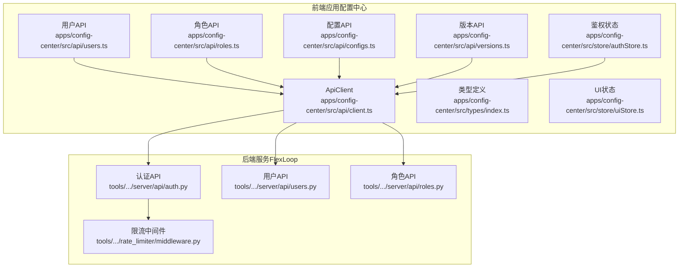

图表来源
- [apps/config-center/src/api/client.ts:1-172](file://apps/config-center/src/api/client.ts#L1-L172)
- [apps/config-center/src/api/users.ts:1-26](file://apps/config-center/src/api/users.ts#L1-L26)
- [apps/config-center/src/api/roles.ts:1-26](file://apps/config-center/src/api/roles.ts#L1-L26)
- [apps/config-center/src/api/configs.ts:1-33](file://apps/config-center/src/api/configs.ts#L1-L33)
- [apps/config-center/src/api/versions.ts:1-29](file://apps/config-center/src/api/versions.ts#L1-L29)
- [apps/config-center/src/types/index.ts:1-163](file://apps/config-center/src/types/index.ts#L1-L163)
- [apps/config-center/src/store/authStore.ts:1-108](file://apps/config-center/src/store/authStore.ts#L1-L108)
- [apps/config-center/src/store/uiStore.ts:1-14](file://apps/config-center/src/store/uiStore.ts#L1-L14)
- [tools/flexloop/src/taolib/testing/config_center/server/api/auth.py:1-54](file://tools/flexloop/src/taolib/testing/config_center/server/api/auth.py#L1-L54)
- [tools/flexloop/src/taolib/testing/config_center/server/api/users.py:1-164](file://tools/flexloop/src/taolib/testing/config_center/server/api/users.py#L1-L164)
- [tools/flexloop/src/taolib/testing/config_center/server/api/roles.py:1-47](file://tools/flexloop/src/taolib/testing/config_center/server/api/roles.py#L1-L47)
- [tools/flexloop/src/taolib/testing/rate_limiter/middleware.py:132-167](file://tools/flexloop/src/taolib/testing/rate_limiter/middleware.py#L132-L167)

章节来源
- [apps/config-center/src/api/client.ts:1-172](file://apps/config-center/src/api/client.ts#L1-L172)
- [apps/config-center/src/types/index.ts:1-163](file://apps/config-center/src/types/index.ts#L1-L163)

## 核心组件
- 统一HTTP客户端：负责基础URL拼接、鉴权头注入、401自动刷新、错误包装与JSON序列化。
- 资源API模块：按领域拆分，分别封装用户、角色、配置与版本的CRUD与扩展操作。
- 类型系统：集中定义枚举与请求/响应模型，确保前后端契约一致。
- 鉴权状态管理：封装登录、刷新、登出与权限判断逻辑，持久化令牌与用户信息。
- 后端路由与中间件：FastAPI路由定义与限流中间件，保障安全与稳定性。

章节来源
- [apps/config-center/src/api/client.ts:1-172](file://apps/config-center/src/api/client.ts#L1-L172)
- [apps/config-center/src/api/users.ts:1-26](file://apps/config-center/src/api/users.ts#L1-L26)
- [apps/config-center/src/api/roles.ts:1-26](file://apps/config-center/src/api/roles.ts#L1-L26)
- [apps/config-center/src/api/configs.ts:1-33](file://apps/config-center/src/api/configs.ts#L1-L33)
- [apps/config-center/src/api/versions.ts:1-29](file://apps/config-center/src/api/versions.ts#L1-L29)
- [apps/config-center/src/types/index.ts:1-163](file://apps/config-center/src/types/index.ts#L1-L163)
- [apps/config-center/src/store/authStore.ts:1-108](file://apps/config-center/src/store/authStore.ts#L1-L108)

## 架构总览
下图展示了从前端API调用到后端路由与中间件的整体交互流程，体现鉴权、限流与错误处理的关键节点。

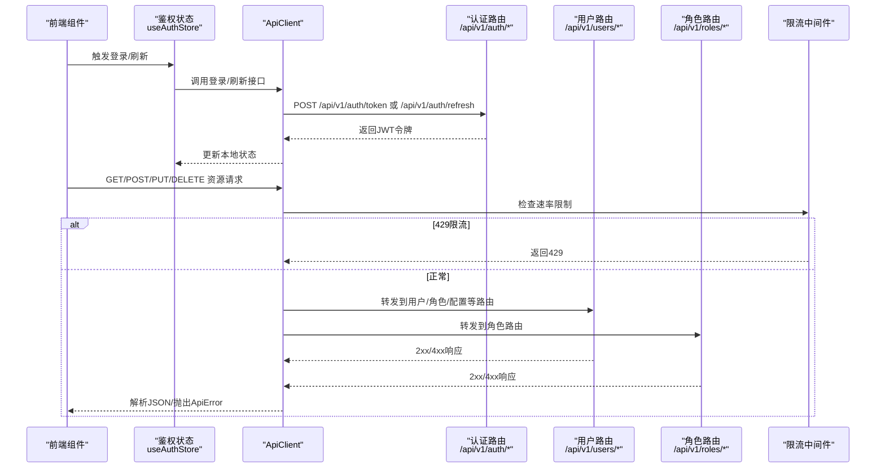

图表来源
- [apps/config-center/src/store/authStore.ts:29-72](file://apps/config-center/src/store/authStore.ts#L29-L72)
- [apps/config-center/src/api/client.ts:85-129](file://apps/config-center/src/api/client.ts#L85-L129)
- [tools/flexloop/src/taolib/testing/config_center/server/api/auth.py:45-54](file://tools/flexloop/src/taolib/testing/config_center/server/api/auth.py#L45-L54)
- [tools/flexloop/src/taolib/testing/rate_limiter/middleware.py:132-167](file://tools/flexloop/src/taolib/testing/rate_limiter/middleware.py#L132-L167)

## 详细组件分析

### 统一HTTP客户端（ApiClient）
- 功能要点
  - 基础URL标准化，移除尾随斜杠。
  - 从本地存储读取/写入访问令牌与刷新令牌。
  - 自动在请求头注入Authorization: Bearer。
  - 401时触发刷新流程，失败则清空本地状态并跳转登录。
  - 支持GET查询参数拼接、表单提交与JSON解析。
  - 统一错误包装为ApiError，保留HTTP状态与可选details。
- 错误处理
  - 非2xx响应：解析错误体并抛出ApiError。
  - 204无内容：返回undefined。
- 适用场景
  - 所有资源API的基础调用封装，统一鉴权与错误处理。

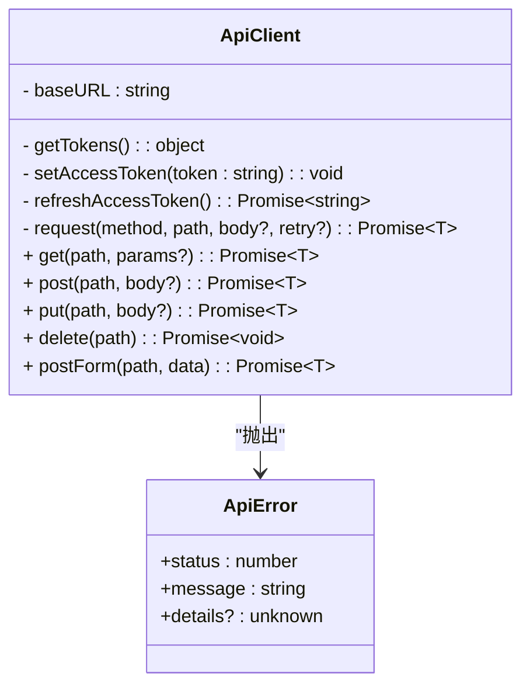

图表来源
- [apps/config-center/src/api/client.ts:1-172](file://apps/config-center/src/api/client.ts#L1-L172)

章节来源
- [apps/config-center/src/api/client.ts:1-172](file://apps/config-center/src/api/client.ts#L1-L172)

### 鉴权状态管理（useAuthStore）
- 功能要点
  - 登录：调用后端获取JWT，持久化令牌，拉取当前用户信息。
  - 刷新：使用刷新令牌轮换访问令牌，失败则登出。
  - 登出：清理本地状态。
  - hasPermission：超级管理员直接放行，其他用户用于UI提示。
- 与客户端协作
  - 通过ApiClient进行网络请求，自动携带Authorization头。
  - 登录成功后立即调用“获取当前用户”接口完善状态。

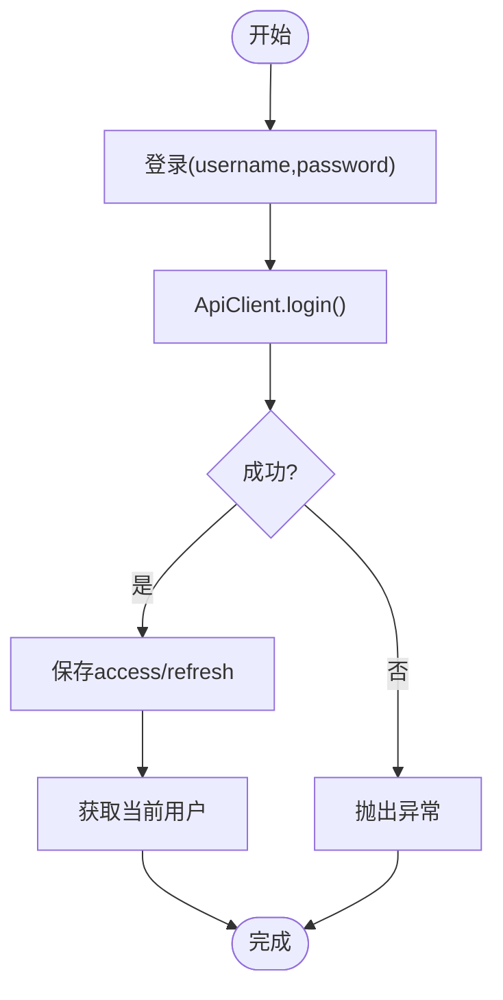

图表来源
- [apps/config-center/src/store/authStore.ts:29-46](file://apps/config-center/src/store/authStore.ts#L29-L46)

章节来源
- [apps/config-center/src/store/authStore.ts:1-108](file://apps/config-center/src/store/authStore.ts#L1-L108)

### 用户管理API（前端与后端）
- 前端API
  - listUsers/getUser/createUser/updateUser/deleteUser
  - 支持分页参数skip/limit
- 后端路由
  - GET /users、POST /users、GET /users/{user_id}等
  - 参数校验与业务规则（如密码复杂度、用户名唯一性）
  - 响应模型UserResponse，包含角色ID数组与时间戳
- 状态码约定
  - 200/201/204/400/401/403/404

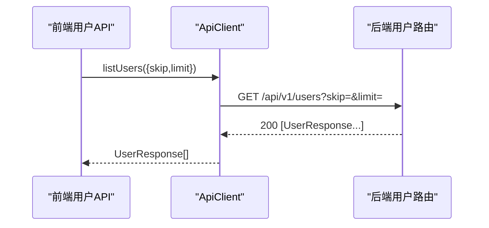

图表来源
- [apps/config-center/src/api/users.ts:1-26](file://apps/config-center/src/api/users.ts#L1-L26)
- [apps/config-center/src/api/client.ts:131-142](file://apps/config-center/src/api/client.ts#L131-L142)
- [tools/flexloop/src/taolib/testing/config_center/server/api/users.py:31-74](file://tools/flexloop/src/taolib/testing/config_center/server/api/users.py#L31-L74)

章节来源
- [apps/config-center/src/api/users.ts:1-26](file://apps/config-center/src/api/users.ts#L1-L26)
- [apps/config-center/src/types/index.ts:93-121](file://apps/config-center/src/types/index.ts#L93-L121)
- [tools/flexloop/src/taolib/testing/config_center/server/api/users.py:1-164](file://tools/flexloop/src/taolib/testing/config_center/server/api/users.py#L1-L164)

### 角色管理API（前端与后端）
- 前端API
  - listRoles/getRole/createRole/updateRole/deleteRole
  - 支持分页参数skip/limit
- 后端路由
  - GET/POST /roles，支持分页与鉴权依赖注入
  - 响应模型RoleResponse，包含权限集合与作用域
- 权限模型
  - Permission(resource, actions[])
  - 环境/服务作用域限制

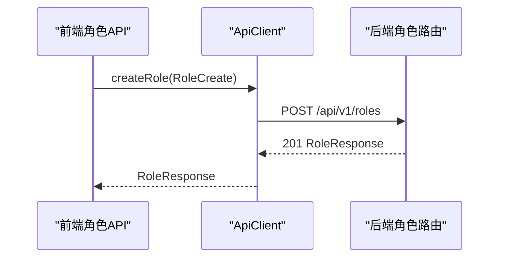

图表来源
- [apps/config-center/src/api/roles.ts:1-26](file://apps/config-center/src/api/roles.ts#L1-L26)
- [apps/config-center/src/types/index.ts:122-154](file://apps/config-center/src/types/index.ts#L122-L154)
- [tools/flexloop/src/taolib/testing/config_center/server/api/roles.py:15-47](file://tools/flexloop/src/taolib/testing/config_center/server/api/roles.py#L15-L47)

章节来源
- [apps/config-center/src/api/roles.ts:1-26](file://apps/config-center/src/api/roles.ts#L1-L26)
- [apps/config-center/src/types/index.ts:122-154](file://apps/config-center/src/types/index.ts#L122-L154)
- [tools/flexloop/src/taolib/testing/config_center/server/api/roles.py:1-47](file://tools/flexloop/src/taolib/testing/config_center/server/api/roles.py#L1-L47)

### 配置管理API（前端与后端）
- 前端API
  - listConfigs/getConfig/createConfig/updateConfig/deleteConfig/publishConfig
  - 支持环境、服务、状态过滤与分页
- 后端路由
  - GET/POST /configs，支持过滤参数
  - POST /configs/{id}/publish
  - 响应模型ConfigResponse，包含版本号与变更元数据
- 版本管理
  - GET /configs/{id}/versions（分页）
  - GET /configs/{id}/versions/{version}
  - GET /configs/{id}/versions/diff/{v1}/to/{v2}
  - POST /configs/{id}/versions/{version}/rollback

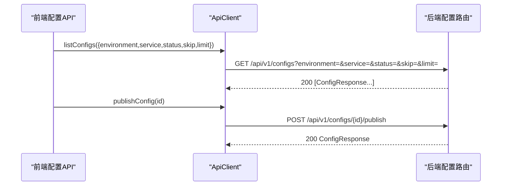

图表来源
- [apps/config-center/src/api/configs.ts:1-33](file://apps/config-center/src/api/configs.ts#L1-L33)
- [apps/config-center/src/types/index.ts:13-50](file://apps/config-center/src/types/index.ts#L13-L50)
- [tools/flexloop/tests/testing/test_config_center/test_api_integration.py:221-331](file://tools/flexloop/tests/testing/test_config_center/test_api_integration.py#L221-L331)

章节来源
- [apps/config-center/src/api/configs.ts:1-33](file://apps/config-center/src/api/configs.ts#L1-L33)
- [apps/config-center/src/types/index.ts:13-50](file://apps/config-center/src/types/index.ts#L13-L50)
- [tools/flexloop/tests/testing/test_config_center/test_api_integration.py:221-331](file://tools/flexloop/tests/testing/test_config_center/test_api_integration.py#L221-L331)

### 版本管理API（前端与后端）
- 前端API
  - listVersions/getVersion/diffVersions/rollbackToVersion
- 后端路由
  - GET /configs/{id}/versions（分页）
  - GET /configs/{id}/versions/{version}
  - GET /configs/{id}/versions/diff/{v1}/to/{v2}
  - POST /configs/{id}/versions/{version}/rollback
- 测试验证
  - 版本顺序降序返回、回滚创建新版本记录、差异比较等行为

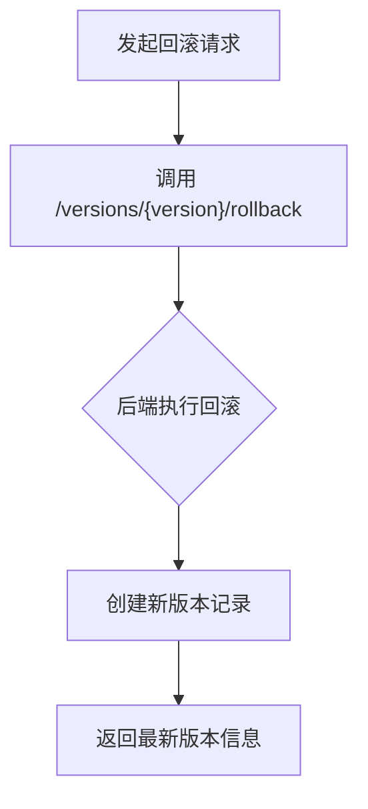

图表来源
- [apps/config-center/src/api/versions.ts:1-29](file://apps/config-center/src/api/versions.ts#L1-L29)
- [tools/flexloop/tests/testing/test_config_center/test_api_integration.py:250-318](file://tools/flexloop/tests/testing/test_config_center/test_api_integration.py#L250-L318)

章节来源
- [apps/config-center/src/api/versions.ts:1-29](file://apps/config-center/src/api/versions.ts#L1-L29)
- [tools/flexloop/tests/testing/test_config_center/test_api_integration.py:250-318](file://tools/flexloop/tests/testing/test_config_center/test_api_integration.py#L250-L318)

### 速率限制中间件
- 行为特征
  - 检查请求标识、路径与方法，超限时记录违规并返回429。
  - 记录MongoDB违规日志（包含用户ID、User-Agent等）。
- 与后端路由协作
  - 在认证路由等敏感端点生效，保护系统免受滥用。

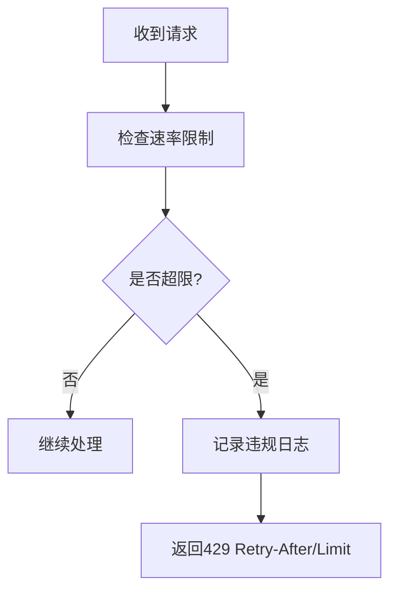

图表来源
- [tools/flexloop/src/taolib/testing/rate_limiter/middleware.py:132-167](file://tools/flexloop/src/taolib/testing/rate_limiter/middleware.py#L132-L167)

章节来源
- [tools/flexloop/src/taolib/testing/rate_limiter/middleware.py:132-167](file://tools/flexloop/src/taolib/testing/rate_limiter/middleware.py#L132-L167)

### API文档生成（DaoDocs）
- 能力概述
  - 注册/注销API条目，按路径与方法去重。
  - 统计API总数、按方法分类与最新版本号。
- 实践建议
  - 在后端路由注册阶段同步登记API描述，保持文档与实现一致。

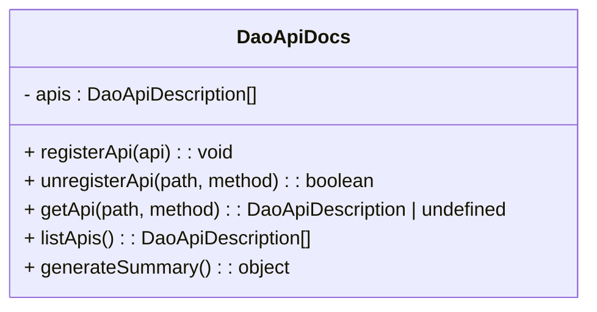

图表来源
- [apps/DaoMind/packages/daoDocs/src/api-docs.ts:1-58](file://apps/DaoMind/packages/daoDocs/src/api-docs.ts#L1-L58)

章节来源
- [apps/DaoMind/packages/daoDocs/src/api-docs.ts:1-58](file://apps/DaoMind/packages/daoDocs/src/api-docs.ts#L1-L58)

## 依赖关系分析
- 前端依赖
  - ApiClient被各资源API模块依赖；鉴权状态管理依赖API模块；类型定义被所有模块共享。
- 后端依赖
  - 路由模块依赖依赖注入（当前用户、仓库实例），认证路由依赖JWT工具与限流中间件。
- 耦合与内聚
  - 前端按资源模块解耦，公共逻辑集中在ApiClient；后端路由职责单一，通过依赖注入降低耦合。

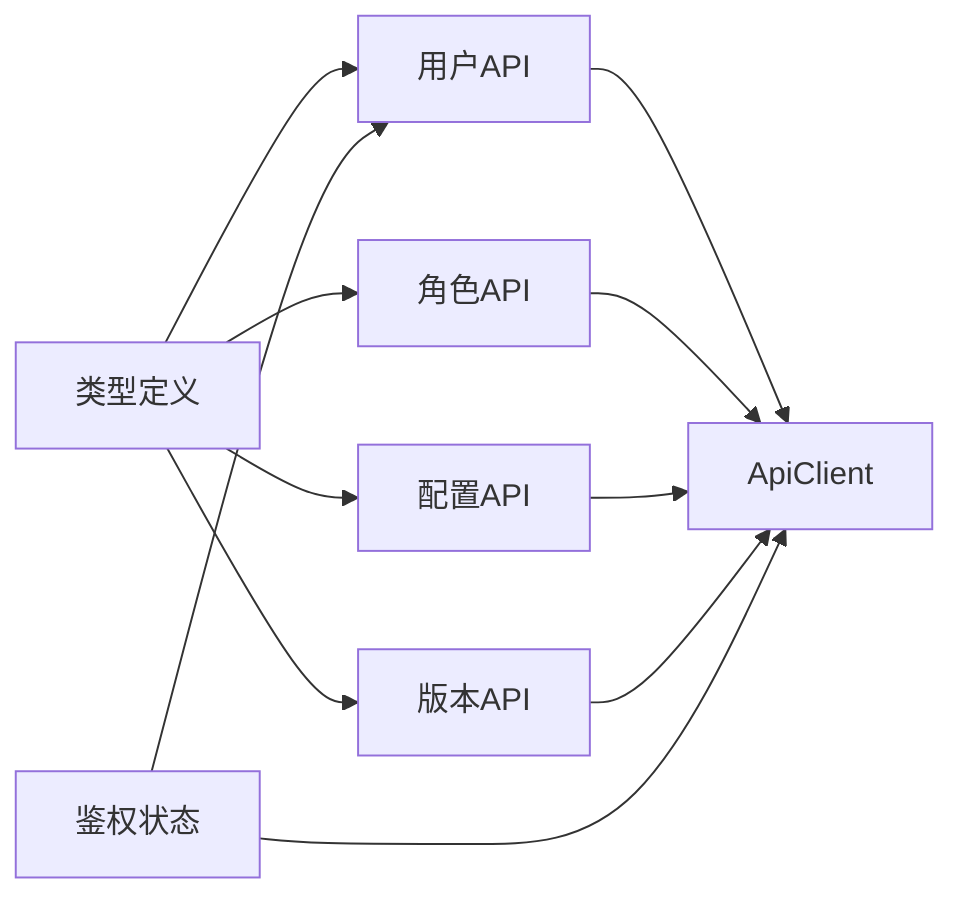

图表来源
- [apps/config-center/src/types/index.ts:1-163](file://apps/config-center/src/types/index.ts#L1-L163)
- [apps/config-center/src/api/users.ts:1-26](file://apps/config-center/src/api/users.ts#L1-L26)
- [apps/config-center/src/api/roles.ts:1-26](file://apps/config-center/src/api/roles.ts#L1-L26)
- [apps/config-center/src/api/configs.ts:1-33](file://apps/config-center/src/api/configs.ts#L1-L33)
- [apps/config-center/src/api/versions.ts:1-29](file://apps/config-center/src/api/versions.ts#L1-L29)
- [apps/config-center/src/api/client.ts:1-172](file://apps/config-center/src/api/client.ts#L1-L172)
- [apps/config-center/src/store/authStore.ts:1-108](file://apps/config-center/src/store/authStore.ts#L1-L108)

## 性能考虑
- 传输优化
  - 使用分页参数skip/limit控制单次响应规模，避免一次性加载过多数据。
  - 对于列表接口，优先使用服务端排序与过滤，减少前端二次处理。
- 缓存策略
  - 对只读列表与静态配置可采用浏览器缓存或CDN加速，配合ETag/Last-Modified。
- 并发与重试
  - 客户端对401自动刷新一次，避免重复重试造成风暴。
- 限流与熔断
  - 后端限流中间件保护关键端点；对第三方依赖设置超时与熔断策略。

## 故障排除指南
- 401未授权
  - 检查本地存储是否存在有效access/refresh令牌；确认刷新流程是否成功。
  - 若刷新失败，客户端会清除本地状态并跳转登录页。
- 429速率限制
  - 查看Retry-After与Limit响应头；降低请求频率或增加退避策略。
  - 检查限流中间件日志与违规追踪记录。
- 前端错误处理
  - 使用ApiError捕获HTTP错误，读取status与message；必要时显示details辅助诊断。
- 后端测试验证
  - 参考集成测试用例，核对版本回滚、差异比较、分页排序等关键行为。

章节来源
- [apps/config-center/src/api/client.ts:98-125](file://apps/config-center/src/api/client.ts#L98-L125)
- [tools/flexloop/src/taolib/testing/rate_limiter/middleware.py:132-167](file://tools/flexloop/src/taolib/testing/rate_limiter/middleware.py#L132-L167)
- [tools/flexloop/tests/testing/test_config_center/test_api_integration.py:221-331](file://tools/flexloop/tests/testing/test_config_center/test_api_integration.py#L221-L331)

## 结论
本仓库提供了从前端到后端的完整RESTful API实现范式：统一的HTTP客户端封装、清晰的资源模块划分、严谨的类型系统、完善的鉴权与状态管理、以及可扩展的限流与文档生成机制。遵循本文档的设计原则与最佳实践，可在保证一致性的同时提升系统的可维护性与可扩展性。

## 附录
- URL路径规范
  - 基础路径：/api/v1
  - 资源命名：复数形式（users、roles、configs、versions）
  - 版本化：路径包含版本号（/api/v1/...）
- HTTP方法使用
  - GET：查询列表与详情
  - POST：创建资源与触发动作（如publish、rollback）
  - PUT：更新资源
  - DELETE：删除资源
- 状态码标准
  - 200：成功获取数据
  - 201：创建成功
  - 204：删除成功（无响应体）
  - 400：参数错误或业务规则不满足
  - 401：未认证或令牌无效
  - 403：权限不足
  - 404：资源不存在
  - 429：超出速率限制
- 请求响应格式
  - Content-Type：application/json
  - 错误响应：包含status与message字段（客户端封装为ApiError）
- 参数传递方式
  - 查询参数：GET /resource?param=value
  - 路径参数：GET /resource/{id}
  - 请求体：POST/PUT JSON对象
- 分页查询实现
  - skip/limit参数；服务端默认值与最大限制应在路由层约束
- 过滤与排序
  - 过滤：在查询参数中传入过滤键值
  - 排序：在查询参数中传入排序键与方向（若需要）
- API版本管理与兼容性
  - 路径版本化；新增字段使用可选属性；变更字段标记弃用并通过迁移策略过渡
- API文档生成
  - 在后端路由注册时同步登记API描述，定期生成摘要与统计