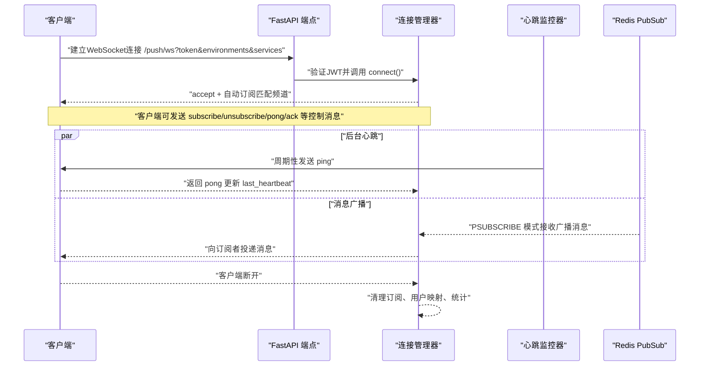
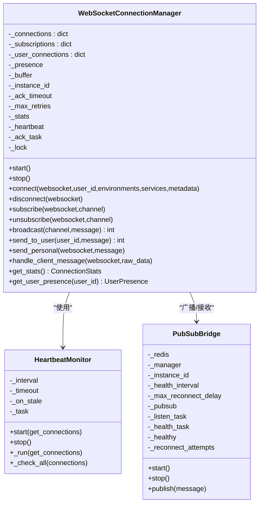
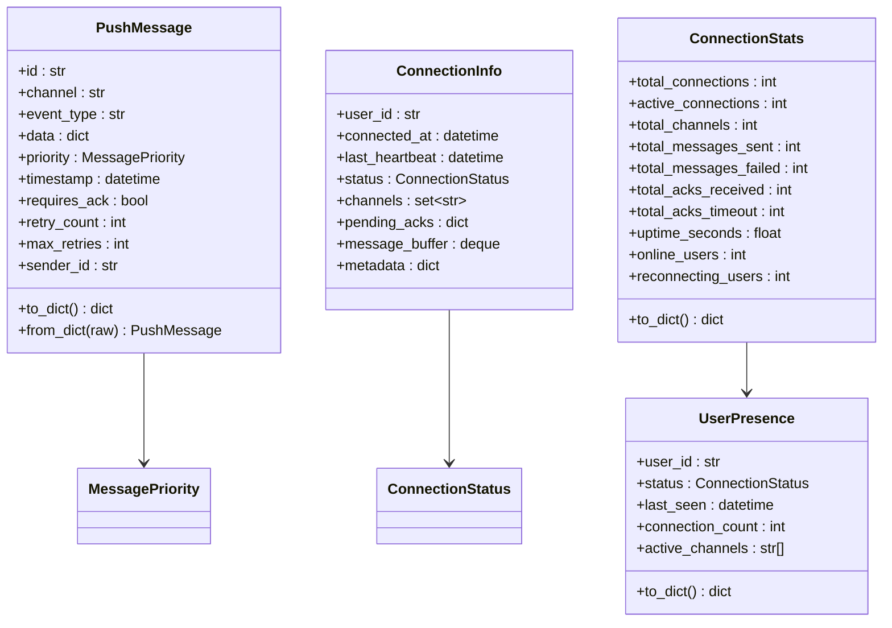
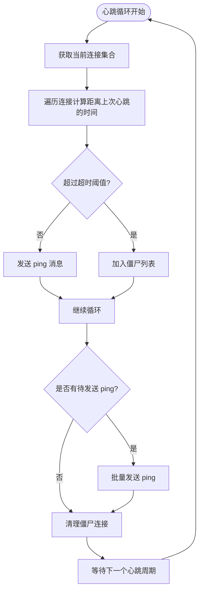
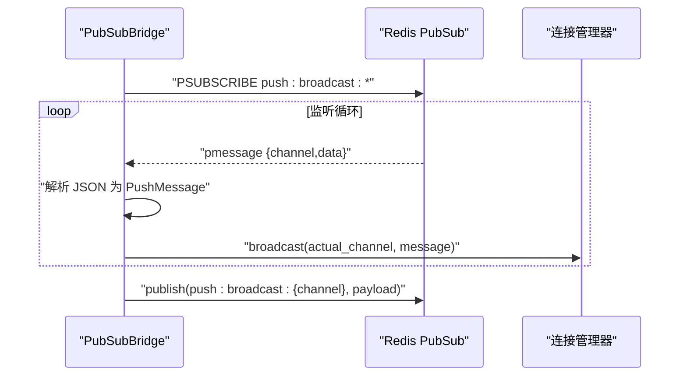
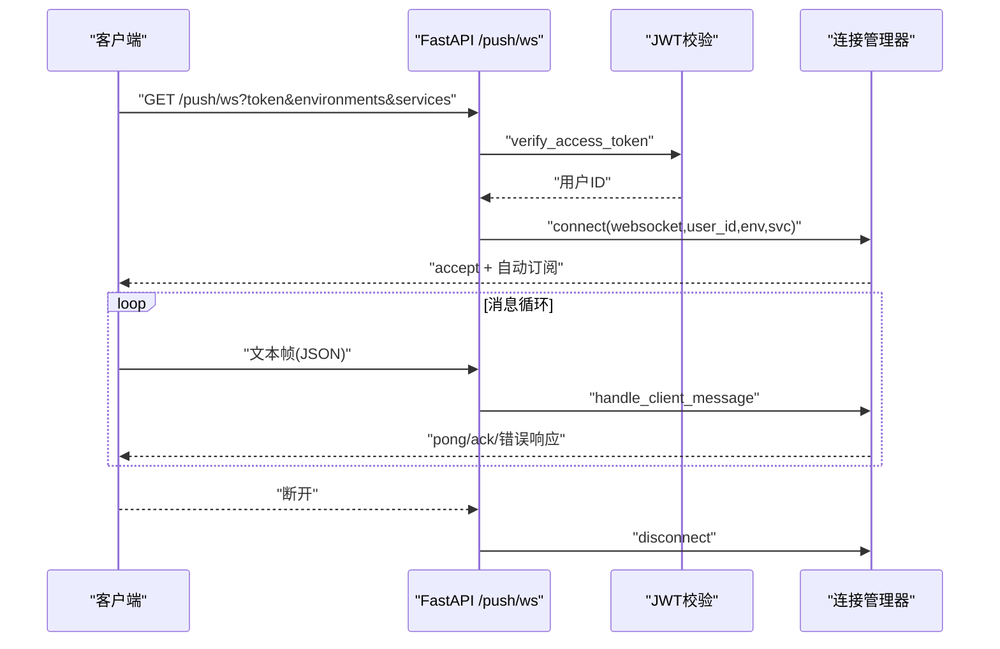
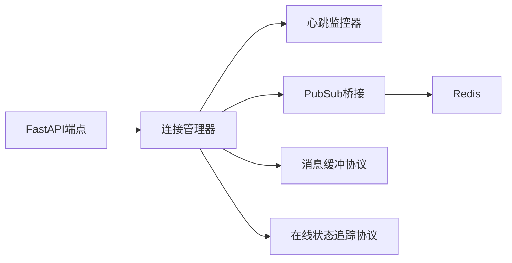

# WebSocket通信

<cite>
**本文引用的文件**
- [manager.py](file://tools/flexloop/src/taolib/testing/config_center/server/websocket/manager.py)
- [models.py](file://tools/flexloop/src/taolib/testing/config_center/server/websocket/models.py)
- [pubsub_bridge.py](file://tools/flexloop/src/taolib/testing/config_center/server/websocket/pubsub_bridge.py)
- [protocols.py](file://tools/flexloop/src/taolib/testing/config_center/server/websocket/protocols.py)
- [heartbeat.py](file://tools/flexloop/src/taolib/testing/config_center/server/websocket/heartbeat.py)
- [push.py](file://tools/flexloop/src/taolib/testing/config_center/server/api/push.py)
- [test_push_service.py](file://tools/flexloop/tests/testing/test_config_center/test_push_service.py)
- [conftest.py](file://tools/flexloop/tests/testing/conftest.py)
- [AuditLogsPage.tsx](file://apps/config-center/src/pages/AuditLogsPage.tsx)
</cite>

## 目录
1. [引言](#引言)
2. [项目结构](#项目结构)
3. [核心组件](#核心组件)
4. [架构总览](#架构总览)
5. [详细组件分析](#详细组件分析)
6. [依赖分析](#依赖分析)
7. [性能考虑](#性能考虑)
8. [故障排查指南](#故障排查指南)
9. [结论](#结论)
10. [附录](#附录)

## 引言
本文件围绕仓库中的WebSocket实时推送子系统，系统性阐述协议特性、连接建立、消息传输、断线重连、事件订阅与状态同步等关键技术，并结合配置中心的审计日志、配置变更通知、版本更新提醒等典型场景，给出工程实践建议与最佳实践。同时对比WebSocket与HTTP差异，说明其在低延迟、双向通信、长连接方面的优势与适用场景。

## 项目结构
WebSocket相关能力集中在工具包flexloop的“配置中心推送服务”模块中，采用FastAPI提供WebSocket端点，配合连接管理器、心跳监控、Redis PubSub桥接、消息缓冲与在线状态追踪等组件，形成可扩展、可分布式部署的实时推送基础设施。

```mermaid
graph TB
subgraph "配置中心推送服务"
API["FastAPI 端点<br/>/push/ws, /push/poll, /push/stats, /push/presence"]
Manager["连接管理器<br/>WebSocketConnectionManager"]
HB["心跳监控器<br/>HeartbeatMonitor"]
Bridge["Redis PubSub 桥接<br/>PubSubBridge"]
Buffer["消息缓冲协议<br/>MessageBufferProtocol"]
Presence["在线状态追踪协议<br/>PresenceTrackerProtocol"]
end
Client["浏览器/客户端"]
Redis["Redis 服务"]
Client <- --> API
API --> Manager
Manager --> HB
Manager --> Buffer
Manager --> Presence
Manager --> Bridge
Bridge --> Redis
Redis --> Bridge
```

图表来源
- [push.py:53-97](file://tools/flexloop/src/taolib/testing/config_center/server/api/push.py#L53-L97)
- [manager.py:28-78](file://tools/flexloop/src/taolib/testing/config_center/server/websocket/manager.py#L28-L78)
- [heartbeat.py:20-44](file://tools/flexloop/src/taolib/testing/config_center/server/websocket/heartbeat.py#L20-L44)
- [pubsub_bridge.py:19-48](file://tools/flexloop/src/taolib/testing/config_center/server/websocket/pubsub_bridge.py#L19-L48)
- [protocols.py:12-76](file://tools/flexloop/src/taolib/testing/config_center/server/websocket/protocols.py#L12-L76)

章节来源
- [push.py:1-190](file://tools/flexloop/src/taolib/testing/config_center/server/api/push.py#L1-L190)
- [manager.py:1-467](file://tools/flexloop/src/taolib/testing/config_center/server/websocket/manager.py#L1-L467)
- [heartbeat.py:1-125](file://tools/flexloop/src/taolib/testing/config_center/server/websocket/heartbeat.py#L1-L125)
- [pubsub_bridge.py:1-222](file://tools/flexloop/src/taolib/testing/config_center/server/websocket/pubsub_bridge.py#L1-L222)
- [protocols.py:1-76](file://tools/flexloop/src/taolib/testing/config_center/server/websocket/protocols.py#L1-L76)

## 核心组件
- 连接管理器：负责连接接入/断开、订阅管理、消息投递、ACK追踪与超时重传、心跳检测、统计与监控。
- 数据模型：定义消息、连接信息、状态枚举、统计与在线状态等数据结构。
- 心跳监控器：周期性向连接发送ping，检测僵尸连接并触发清理。
- Redis PubSub桥接：将本地消息广播与Redis广播桥接，支持多实例部署与跨实例消息转发。
- 协议接口：通过协议接口实现消息缓冲、在线状态追踪与连接管理的解耦与可替换性。
- FastAPI端点：提供WebSocket接入、HTTP轮询降级、统计与在线状态查询等REST接口。

章节来源
- [manager.py:28-467](file://tools/flexloop/src/taolib/testing/config_center/server/websocket/manager.py#L28-L467)
- [models.py:15-184](file://tools/flexloop/src/taolib/testing/config_center/server/websocket/models.py#L15-L184)
- [heartbeat.py:20-125](file://tools/flexloop/src/taolib/testing/config_center/server/websocket/heartbeat.py#L20-L125)
- [pubsub_bridge.py:19-222](file://tools/flexloop/src/taolib/testing/config_center/server/websocket/pubsub_bridge.py#L19-L222)
- [protocols.py:12-76](file://tools/flexloop/src/taolib/testing/config_center/server/websocket/protocols.py#L12-L76)
- [push.py:53-190](file://tools/flexloop/src/taolib/testing/config_center/server/api/push.py#L53-L190)

## 架构总览
WebSocket实时推送系统以FastAPI为入口，通过JWT鉴权后交由连接管理器完成握手、订阅与消息投递；心跳监控器保障连接健康；Redis PubSub桥接实现多实例广播；消息缓冲与在线状态追踪提供可靠性与可观测性。



图表来源
- [push.py:53-97](file://tools/flexloop/src/taolib/testing/config_center/server/api/push.py#L53-L97)
- [manager.py:114-172](file://tools/flexloop/src/taolib/testing/config_center/server/websocket/manager.py#L114-L172)
- [heartbeat.py:68-109](file://tools/flexloop/src/taolib/testing/config_center/server/websocket/heartbeat.py#L68-L109)
- [pubsub_bridge.py:109-149](file://tools/flexloop/src/taolib/testing/config_center/server/websocket/pubsub_bridge.py#L109-L149)

## 详细组件分析

### 连接管理器（WebSocketConnectionManager）
- 职责
  - 连接生命周期：接入、断开、多设备连接、自动订阅匹配频道。
  - 频道订阅：订阅/取消订阅、广播投递。
  - 消息投递：JSON序列化、ACK追踪、超时重传、离线缓冲。
  - 心跳检测：委托HeartbeatMonitor进行ping/pong与僵尸连接清理。
  - 在线状态：通过PresenceTracker跨实例同步在线状态。
  - 统计监控：连接数、消息数、ACK统计、运行时长等。
- 关键流程
  - 连接建立：accept后初始化ConnectionInfo，按environments与services自动订阅config:env:svc类频道，更新在线状态并投递离线缓冲消息。
  - 广播：对订阅者集合快照遍历，逐个投递，失败或断开则清理。
  - 个人消息：send_to_user在用户离线时写入离线缓冲。
  - 客户端消息：处理ack、pong、subscribe、unsubscribe等类型，未知类型返回error。
  - ACK清理：周期扫描pending_acks，超时则重传或转入离线缓冲。
  - 僵尸连接：心跳超时触发清理回调，关闭连接并断开。



图表来源
- [manager.py:28-467](file://tools/flexloop/src/taolib/testing/config_center/server/websocket/manager.py#L28-L467)
- [heartbeat.py:20-125](file://tools/flexloop/src/taolib/testing/config_center/server/websocket/heartbeat.py#L20-L125)
- [pubsub_bridge.py:19-222](file://tools/flexloop/src/taolib/testing/config_center/server/websocket/pubsub_bridge.py#L19-L222)

章节来源
- [manager.py:28-467](file://tools/flexloop/src/taolib/testing/config_center/server/websocket/manager.py#L28-L467)
- [heartbeat.py:20-125](file://tools/flexloop/src/taolib/testing/config_center/server/websocket/heartbeat.py#L20-L125)
- [pubsub_bridge.py:19-222](file://tools/flexloop/src/taolib/testing/config_center/server/websocket/pubsub_bridge.py#L19-L222)

### 数据模型与协议
- 消息类型与优先级：PushMessage封装消息体、事件类型、优先级、时间戳、ACK需求、重试参数等；MessageType枚举覆盖push、ack、heartbeat、ping、pong、subscribe、unsubscribe、error、system、config_changed等。
- 连接信息：ConnectionInfo包含用户ID、连接时间、最后心跳、状态、订阅频道、待确认消息、离线消息缓冲、元数据等。
- 统计与在线状态：ConnectionStats与UserPresence用于监控与查询。
- 协议接口：MessageBufferProtocol、PresenceTrackerProtocol、ConnectionManagerProtocol通过运行时协议实现依赖注入与测试解耦。



图表来源
- [models.py:46-184](file://tools/flexloop/src/taolib/testing/config_center/server/websocket/models.py#L46-L184)

章节来源
- [models.py:15-184](file://tools/flexloop/src/taolib/testing/config_center/server/websocket/models.py#L15-L184)
- [protocols.py:12-76](file://tools/flexloop/src/taolib/testing/config_center/server/websocket/protocols.py#L12-L76)

### 心跳监控器（HeartbeatMonitor）
- 周期性向所有连接发送ping，计算last_heartbeat与当前时间差，超过阈值判定为僵尸连接并回调清理。
- 通过批量gather发送ping，避免事件循环饱和；异常被捕获不影响整体循环。



图表来源
- [heartbeat.py:68-123](file://tools/flexloop/src/taolib/testing/config_center/server/websocket/heartbeat.py#L68-L123)

章节来源
- [heartbeat.py:20-125](file://tools/flexloop/src/taolib/testing/config_center/server/websocket/heartbeat.py#L20-L125)

### Redis PubSub桥接（PubSubBridge）
- 使用PSUBSCRIBE模式订阅“push:broadcast:*”模式，将Redis消息反序列化为PushMessage并路由到本地管理器广播。
- 提供健康检查与指数退避重连，注册实例心跳键，确保多实例一致性。
- 提供publish便捷方法，将消息序列化后发布到对应Redis频道。



图表来源
- [pubsub_bridge.py:109-162](file://tools/flexloop/src/taolib/testing/config_center/server/websocket/pubsub_bridge.py#L109-L162)

章节来源
- [pubsub_bridge.py:19-222](file://tools/flexloop/src/taolib/testing/config_center/server/websocket/pubsub_bridge.py#L19-L222)

### FastAPI端点与客户端交互
- WebSocket端点：/push/ws，JWT鉴权，支持environments与services参数自动订阅配置变更频道，主消息循环处理客户端控制消息。
- HTTP轮询降级：/push/poll，支持channels+since+limit参数实现增量拉取。
- 监控端点：/push/stats、/push/presence、/push/presence/{user_id}。



图表来源
- [push.py:53-97](file://tools/flexloop/src/taolib/testing/config_center/server/api/push.py#L53-L97)
- [manager.py:324-368](file://tools/flexloop/src/taolib/testing/config_center/server/websocket/manager.py#L324-L368)

章节来源
- [push.py:53-190](file://tools/flexloop/src/taolib/testing/config_center/server/api/push.py#L53-L190)
- [manager.py:114-172](file://tools/flexloop/src/taolib/testing/config_center/server/websocket/manager.py#L114-L172)

### 断线重连与可靠性机制
- 客户端重连：心跳超时触发清理回调，关闭连接并断开；客户端需自行在断线后重连。
- 服务端重连：心跳超时触发清理回调，断开连接；Redis PubSub桥接具备指数退避重连与健康检查。
- 可靠性保障：ACK追踪与超时重传；超限后转入离线缓冲；用户离线时消息缓冲；心跳检测避免僵尸连接占用资源。

章节来源
- [manager.py:373-418](file://tools/flexloop/src/taolib/testing/config_center/server/websocket/manager.py#L373-L418)
- [heartbeat.py:46-109](file://tools/flexloop/src/taolib/testing/config_center/server/websocket/heartbeat.py#L46-L109)
- [pubsub_bridge.py:168-219](file://tools/flexloop/src/taolib/testing/config_center/server/websocket/pubsub_bridge.py#L168-L219)

### 应用场景与工程实践

#### 审计日志实时推送
- 场景描述：配置中心审计日志页面展示操作记录，可通过WebSocket实时推送最新审计事件。
- 实现思路：服务端在审计事件发生时构造PushMessage并广播至“audit:*”频道；客户端在连接后订阅相应频道，收到消息后更新UI。
- 工程要点：频道命名规范、消息结构设计、客户端订阅与渲染、错误处理与重连。

章节来源
- [AuditLogsPage.tsx:1-162](file://apps/config-center/src/pages/AuditLogsPage.tsx#L1-L162)

#### 配置变更通知
- 场景描述：配置中心配置变更时，向订阅了config:{env}:{svc}的客户端推送变更事件。
- 实现思路：事件发布时构造PushMessage（event_type=config_changed），通过管理器广播；客户端订阅对应频道并处理事件。
- 工程要点：频道自动订阅、事件类型标准化、消息去重与幂等处理。

章节来源
- [manager.py:145-151](file://tools/flexloop/src/taolib/testing/config_center/server/websocket/manager.py#L145-L151)
- [models.py:31-44](file://tools/flexloop/src/taolib/testing/config_center/server/websocket/models.py#L31-L44)

#### 版本更新提醒
- 场景描述：平台版本更新后，向在线用户推送版本公告或升级提示。
- 实现思路：服务端构造PushMessage（event_type=system或自定义类型），广播至“system:*”或“version:*”频道；客户端订阅并展示。
- 工程要点：消息优先级、过期时间、客户端展示策略。

章节来源
- [models.py:15-21](file://tools/flexloop/src/taolib/testing/config_center/server/websocket/models.py#L15-L21)
- [models.py:31-44](file://tools/flexloop/src/taolib/testing/config_center/server/websocket/models.py#L31-L44)

#### WebSocket与HTTP的区别、性能优势与适用场景
- 区别：WebSocket为全双工长连接，适合实时、频繁交互；HTTP为请求-响应短连接，适合一次性数据获取。
- 优势：低延迟、减少握手开销、支持双向推送、更好的状态保持。
- 适用场景：实时通知、协同编辑、游戏、监控看板、聊天室、配置中心事件推送等。

## 依赖分析
- 组件耦合
  - 连接管理器与心跳监控器松耦合，通过回调接口解耦。
  - 连接管理器与Redis PubSub桥接通过ConnectionManagerProtocol解耦，便于替换实现。
  - 协议接口（MessageBufferProtocol、PresenceTrackerProtocol、ConnectionManagerProtocol）统一抽象，提升可测试性与可维护性。
- 外部依赖
  - FastAPI：提供WebSocket端点与路由。
  - Redis：提供PubSub广播与实例心跳存储。
  - asyncio：提供异步I/O与任务调度。



图表来源
- [manager.py:14-23](file://tools/flexloop/src/taolib/testing/config_center/server/websocket/manager.py#L14-L23)
- [pubsub_bridge.py:13-14](file://tools/flexloop/src/taolib/testing/config_center/server/websocket/pubsub_bridge.py#L13-L14)
- [protocols.py:12-76](file://tools/flexloop/src/taolib/testing/config_center/server/websocket/protocols.py#L12-L76)
- [push.py:7-15](file://tools/flexloop/src/taolib/testing/config_center/server/api/push.py#L7-L15)

章节来源
- [manager.py:14-23](file://tools/flexloop/src/taolib/testing/config_center/server/websocket/manager.py#L14-L23)
- [pubsub_bridge.py:13-14](file://tools/flexloop/src/taolib/testing/config_center/server/websocket/pubsub_bridge.py#L13-L14)
- [protocols.py:12-76](file://tools/flexloop/src/taolib/testing/config_center/server/websocket/protocols.py#L12-L76)
- [push.py:7-15](file://tools/flexloop/src/taolib/testing/config_center/server/api/push.py#L7-L15)

## 性能考虑
- 并发与锁：连接管理器内部使用锁保护共享状态，避免竞态；广播时对订阅集合做快照，避免迭代中修改。
- 心跳与批处理：心跳监控器批量发送ping，降低事件循环压力。
- ACK清理：定期扫描pending_acks，超时重传或转入离线缓冲，避免内存膨胀。
- 分布式广播：Redis PubSub桥接支持多实例部署，通过模式订阅实现全局广播。
- I/O优化：序列化/反序列化使用标准库json，尽量减少额外转换成本。

## 故障排查指南
- 常见问题
  - 连接无法建立：检查JWT校验、app.state中push_manager是否注入、Redis连接是否可用。
  - 消息不达：检查频道订阅是否正确、广播通道是否一致、ACK超时与重传策略。
  - 心跳超时断开：检查客户端是否按时返回pong、网络抖动、服务端心跳间隔与超时配置。
  - PubSub断连：查看健康检查日志、指数退避重连是否生效。
- 排查步骤
  - 查看连接统计与在线状态端点，确认活跃连接数与用户在线情况。
  - 检查管理器日志与心跳监控器日志，定位僵尸连接与异常。
  - 使用HTTP轮询降级端点验证消息缓冲与历史消息获取。
  - 单元测试参考：通过FakeWebSocket与Mock Redis验证连接、订阅、广播、ACK、心跳等行为。

章节来源
- [push.py:148-190](file://tools/flexloop/src/taolib/testing/config_center/server/api/push.py#L148-L190)
- [test_push_service.py:251-540](file://tools/flexloop/tests/testing/test_config_center/test_push_service.py#L251-L540)
- [conftest.py:465-484](file://tools/flexloop/tests/testing/conftest.py#L465-L484)

## 结论
该WebSocket实时推送子系统以连接管理器为核心，结合心跳监控、Redis PubSub桥接、消息缓冲与在线状态追踪，构建了高可用、可扩展、可分布式部署的实时推送基础设施。通过标准化的消息模型与协议接口，系统具备良好的可测试性与可维护性。在配置中心等场景中，可基于频道订阅与事件类型实现审计日志、配置变更通知、版本更新提醒等丰富功能。

## 附录
- 关键流程图与序列图已在前述章节中给出，读者可据此理解连接建立、消息广播、心跳检测与断线重连等核心流程。
- 工程实践建议
  - 客户端侧：实现断线重连、订阅管理、消息去重、展示策略与错误提示。
  - 服务端侧：合理设置心跳间隔与超时、ACK超时与重试上限、缓冲容量与清理策略；监控连接统计与ACK指标。
  - 部署侧：Redis高可用、实例心跳键与健康检查、多实例间一致性保障。