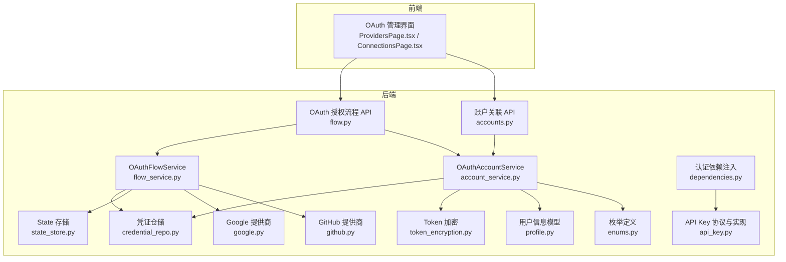
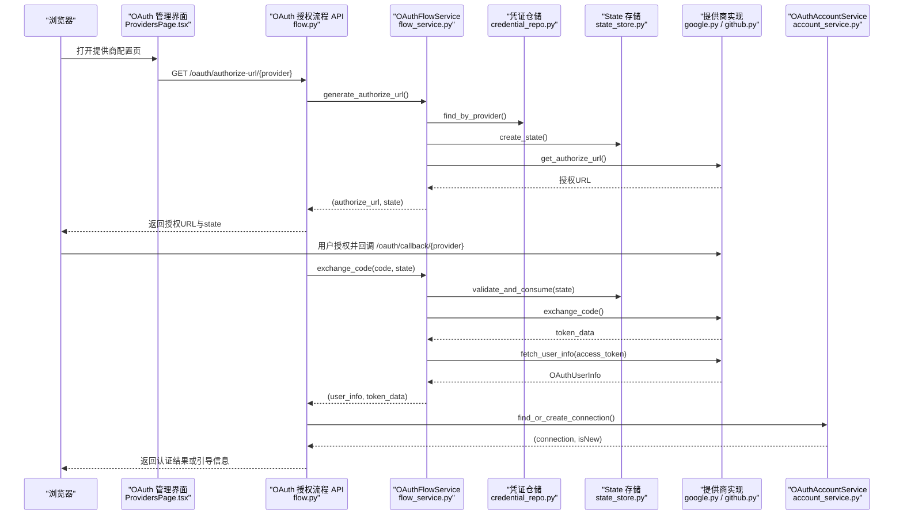
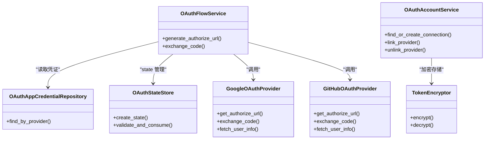

# 第三方集成

<cite>
**本文引用的文件**
- [apps/oauth-admin/src/pages/ProvidersPage.tsx](file://apps/oauth-admin/src/pages/ProvidersPage.tsx)
- [apps/oauth-admin/src/pages/ConnectionsPage.tsx](file://apps/oauth-admin/src/pages/ConnectionsPage.tsx)
- [tools/flexloop/src/taolib/testing/oauth/server/api/flow.py](file://tools/flexloop/src/taolib/testing/oauth/server/api/flow.py)
- [tools/flexloop/src/taolib/testing/oauth/server/api/accounts.py](file://tools/flexloop/src/taolib/testing/oauth/server/api/accounts.py)
- [tools/flexloop/src/taolib/testing/oauth/services/flow_service.py](file://tools/flexloop/src/taolib/testing/oauth/services/flow_service.py)
- [tools/flexloop/src/taolib/testing/oauth/services/account_service.py](file://tools/flexloop/src/taolib/testing/oauth/services/account_service.py)
- [tools/flexloop/src/taolib/testing/oauth/providers/google.py](file://tools/flexloop/src/taolib/testing/oauth/providers/google.py)
- [tools/flexloop/src/taolib/testing/oauth/providers/github.py](file://tools/flexloop/src/taolib/testing/oauth/providers/github.py)
- [tools/flexloop/src/taolib/testing/oauth/repository/credential_repo.py](file://tools/flexloop/src/taolib/testing/oauth/repository/credential_repo.py)
- [tools/flexloop/src/taolib/testing/oauth/cache/state_store.py](file://tools/flexloop/src/taolib/testing/oauth/cache/state_store.py)
- [tools/flexloop/src/taolib/testing/oauth/models/profile.py](file://tools/flexloop/src/taolib/testing/oauth/models/profile.py)
- [tools/flexloop/src/taolib/testing/oauth/models/enums.py](file://tools/flexloop/src/taolib/testing/oauth/models/enums.py)
- [tools/flexloop/src/taolib/testing/auth/fastapi/dependencies.py](file://tools/flexloop/src/taolib/testing/auth/fastapi/dependencies.py)
- [tools/flexloop/src/taolib/testing/auth/api_key.py](file://tools/flexloop/src/taolib/testing/auth/api_key.py)
- [tools/flexloop/tests/testing/test_auth/test_fastpi/test_dependencies.py](file://tools/flexloop/tests/testing/test_auth/test_fastpi/test_dependencies.py)
- [tools/flexloop/tests/testing/test_oauth/test_providers/test_providers.py](file://tools/flexloop/tests/testing/test_oauth/test_providers/test_providers.py)
- [tools/flexloop/src/taolib/testing/rate_limiter/__init__.py](file://tools/flexloop/src/taolib/testing/rate_limiter/__init__.py)
</cite>

## 目录
1. [简介](#简介)
2. [项目结构](#项目结构)
3. [核心组件](#核心组件)
4. [架构总览](#架构总览)
5. [详细组件分析](#详细组件分析)
6. [依赖分析](#依赖分析)
7. [性能考虑](#性能考虑)
8. [故障排查指南](#故障排查指南)
9. [结论](#结论)
10. [附录](#附录)

## 简介
本文件面向第三方集成开发者，系统性阐述基于 OAuth 2.0 的第三方登录与 API 密钥管理能力，覆盖 GitHub、Google 等主流平台的接入方式、回调处理、用户信息获取、会话建立与权限验证等关键环节。同时给出架构设计要点（API 网关、服务发现、负载均衡）、运维保障（监控、限流、故障转移）及可直接定位到源码路径的实现参考，帮助快速落地与扩展。

## 项目结构
围绕“第三方集成”的核心代码主要分布在以下区域：
- 后端 OAuth 服务：提供授权 URL 生成、回调处理、账户关联、会话创建等能力
- OAuth 提供商适配：针对 Google、GitHub 的授权码交换与用户信息拉取
- 认证与授权：JWT 与 API Key 双通道认证依赖注入，RBAC 权限控制
- 前端管理界面：OAuth 提供商配置与连接管理页面
- 运维工具：限流中间件与配置

图表来源
- [tools/flexloop/src/taolib/testing/oauth/server/api/flow.py:1-305](file://tools/flexloop/src/taolib/testing/oauth/server/api/flow.py#L1-L305)
- [tools/flexloop/src/taolib/testing/oauth/server/api/accounts.py:41-124](file://tools/flexloop/src/taolib/testing/oauth/server/api/accounts.py#L41-L124)
- [tools/flexloop/src/taolib/testing/oauth/services/flow_service.py:1-123](file://tools/flexloop/src/taolib/testing/oauth/services/flow_service.py#L1-L123)
- [tools/flexloop/src/taolib/testing/oauth/services/account_service.py:1-270](file://tools/flexloop/src/taolib/testing/oauth/services/account_service.py#L1-L270)
- [tools/flexloop/src/taolib/testing/oauth/providers/google.py:1-164](file://tools/flexloop/src/taolib/testing/oauth/providers/google.py#L1-L164)
- [tools/flexloop/src/taolib/testing/oauth/providers/github.py:1-205](file://tools/flexloop/src/taolib/testing/oauth/providers/github.py#L1-L205)
- [tools/flexloop/src/taolib/testing/oauth/repository/credential_repo.py:1-62](file://tools/flexloop/src/taolib/testing/oauth/repository/credential_repo.py#L1-L62)
- [tools/flexloop/src/taolib/testing/oauth/cache/state_store.py:1-69](file://tools/flexloop/src/taolib/testing/oauth/cache/state_store.py#L1-L69)
- [tools/flexloop/src/taolib/testing/oauth/models/profile.py:1-41](file://tools/flexloop/src/taolib/testing/oauth/models/profile.py#L1-L41)
- [tools/flexloop/src/taolib/testing/oauth/models/enums.py:1-45](file://tools/flexloop/src/taolib/testing/oauth/models/enums.py#L1-L45)
- [tools/flexloop/src/taolib/testing/auth/fastapi/dependencies.py:38-73](file://tools/flexloop/src/taolib/testing/auth/fastapi/dependencies.py#L38-L73)
- [tools/flexloop/src/taolib/testing/auth/api_key.py:1-47](file://tools/flexloop/src/taolib/testing/auth/api_key.py#L1-L47)

章节来源
- [tools/flexloop/src/taolib/testing/oauth/server/api/flow.py:1-305](file://tools/flexloop/src/taolib/testing/oauth/server/api/flow.py#L1-L305)
- [apps/oauth-admin/src/pages/ProvidersPage.tsx:220-242](file://apps/oauth-admin/src/pages/ProvidersPage.tsx#L220-L242)

## 核心组件
- OAuth 授权流程 API：负责生成授权 URL、处理回调、创建会话
- OAuthFlowService：编排授权码交换、用户信息获取、CSRF state 校验
- OAuthAccountService：账户关联、连接创建与更新、活动日志记录
- Provider 实现：GoogleOAuthProvider、GitHubOAuthProvider
- 凭证仓储：OAuthAppCredentialRepository
- State 存储：Redis 基于的 CSRF state 管理
- Token 加密：Fernet 对称加密存储敏感令牌
- 认证依赖注入：支持 JWT Bearer 与 API Key 的双通道认证
- 前端管理界面：提供提供商配置与连接管理入口

章节来源
- [tools/flexloop/src/taolib/testing/oauth/services/flow_service.py:1-123](file://tools/flexloop/src/taolib/testing/oauth/services/flow_service.py#L1-L123)
- [tools/flexloop/src/taolib/testing/oauth/services/account_service.py:1-270](file://tools/flexloop/src/taolib/testing/oauth/services/account_service.py#L1-L270)
- [tools/flexloop/src/taolib/testing/oauth/providers/google.py:1-164](file://tools/flexloop/src/taolib/testing/oauth/providers/google.py#L1-L164)
- [tools/flexloop/src/taolib/testing/oauth/providers/github.py:1-205](file://tools/flexloop/src/taolib/testing/oauth/providers/github.py#L1-L205)
- [tools/flexloop/src/taolib/testing/oauth/repository/credential_repo.py:1-62](file://tools/flexloop/src/taolib/testing/oauth/repository/credential_repo.py#L1-L62)
- [tools/flexloop/src/taolib/testing/oauth/cache/state_store.py:1-69](file://tools/flexloop/src/taolib/testing/oauth/cache/state_store.py#L1-L69)
- [tools/flexloop/src/taolib/testing/oauth/crypto/token_encryption.py:1-86](file://tools/flexloop/src/taolib/testing/oauth/crypto/token_encryption.py#L1-L86)
- [tools/flexloop/src/taolib/testing/auth/fastapi/dependencies.py:38-73](file://tools/flexloop/src/taolib/testing/auth/fastapi/dependencies.py#L38-L73)
- [tools/flexloop/src/taolib/testing/auth/api_key.py:1-47](file://tools/flexloop/src/taolib/testing/auth/api_key.py#L1-L47)

## 架构总览
下图展示了从浏览器到后端服务、再到第三方 OAuth 提供商的整体交互流程，包括授权码交换、用户信息获取、连接建立与会话创建。

图表来源
- [tools/flexloop/src/taolib/testing/oauth/server/api/flow.py:157-305](file://tools/flexloop/src/taolib/testing/oauth/server/api/flow.py#L157-L305)
- [tools/flexloop/src/taolib/testing/oauth/services/flow_service.py:40-123](file://tools/flexloop/src/taolib/testing/oauth/services/flow_service.py#L40-L123)
- [tools/flexloop/src/taolib/testing/oauth/providers/google.py:28-126](file://tools/flexloop/src/taolib/testing/oauth/providers/google.py#L28-L126)
- [tools/flexloop/src/taolib/testing/oauth/providers/github.py:32-139](file://tools/flexloop/src/taolib/testing/oauth/providers/github.py#L32-L139)
- [tools/flexloop/src/taolib/testing/oauth/services/account_service.py:43-131](file://tools/flexloop/src/taolib/testing/oauth/services/account_service.py#L43-L131)
- [tools/flexloop/src/taolib/testing/oauth/repository/credential_repo.py:23-40](file://tools/flexloop/src/taolib/testing/oauth/repository/credential_repo.py#L23-L40)
- [tools/flexloop/src/taolib/testing/oauth/cache/state_store.py:33-66](file://tools/flexloop/src/taolib/testing/oauth/cache/state_store.py#L33-L66)

## 详细组件分析

### OAuth 授权流程 API
- 功能职责
  - 生成授权 URL 并支持重定向或返回 URL+state
  - 处理回调，校验 state，交换授权码，获取用户信息，创建会话或返回引导信息
  - 支持将新提供商关联到已登录用户
- 关键端点
  - GET /oauth/authorize/{provider}：重定向至提供商授权页
  - GET /oauth/authorize-url/{provider}：返回授权 URL 与 state
  - GET /oauth/callback/{provider}：处理回调并返回认证结果
  - POST /oauth/link/{provider}/complete：完成账户关联
- 安全要点
  - state 参数用于 CSRF 防护，回调时必须校验并一次性消费
  - 400/404/502 状态码区分不同错误场景

章节来源
- [tools/flexloop/src/taolib/testing/oauth/server/api/flow.py:51-305](file://tools/flexloop/src/taolib/testing/oauth/server/api/flow.py#L51-L305)
- [tools/flexloop/src/taolib/testing/oauth/server/api/accounts.py:41-124](file://tools/flexloop/src/taolib/testing/oauth/server/api/accounts.py#L41-L124)

### OAuthFlowService：授权码流程编排
- 职责
  - 读取提供商凭证，生成授权 URL
  - 校验并消费 state，交换授权码，获取用户信息
  - 解密客户端密钥，调用具体提供商实现
- 关键流程
  - generate_authorize_url：读取凭证、创建 state、拼装授权 URL
  - exchange_code：校验 state、解密密钥、调用提供商交换 token、拉取用户信息

章节来源
- [tools/flexloop/src/taolib/testing/oauth/services/flow_service.py:40-123](file://tools/flexloop/src/taolib/testing/oauth/services/flow_service.py#L40-L123)
- [tools/flexloop/src/taolib/testing/oauth/repository/credential_repo.py:23-40](file://tools/flexloop/src/taolib/testing/oauth/repository/credential_repo.py#L23-L40)
- [tools/flexloop/src/taolib/testing/oauth/cache/state_store.py:33-66](file://tools/flexloop/src/taolib/testing/oauth/cache/state_store.py#L33-L66)

### OAuthAccountService：账户关联与连接管理
- 职责
  - 按 provider+provider_user_id 查找或创建连接
  - 更新连接的 token、过期时间、头像、显示名等
  - 支持将新提供商关联到已登录用户，并记录活动日志
- 关键流程
  - find_or_create_connection：新用户标记为待引导，老用户更新 token
  - link_provider：将提供商关联到指定用户
  - unlink_provider：确保至少保留一种认证方式

章节来源
- [tools/flexloop/src/taolib/testing/oauth/services/account_service.py:43-201](file://tools/flexloop/src/taolib/testing/oauth/services/account_service.py#L43-L201)

### GoogleOAuthProvider 与 GitHubOAuthProvider
- Google
  - 授权 URL、Token 交换、用户信息获取、刷新与撤销
  - 默认作用域包含 openid、email、profile
- GitHub
  - 授权 URL、Token 交换、用户信息获取（必要时拉取主邮箱）
  - 标准 OAuth 应用不支持刷新，提供撤销能力

章节来源
- [tools/flexloop/src/taolib/testing/oauth/providers/google.py:23-164](file://tools/flexloop/src/taolib/testing/oauth/providers/google.py#L23-L164)
- [tools/flexloop/src/taolib/testing/oauth/providers/github.py:27-205](file://tools/flexloop/src/taolib/testing/oauth/providers/github.py#L27-L205)

### 凭证仓储与状态存储
- OAuthAppCredentialRepository
  - 按提供商查询已启用的凭证，支持索引优化
- OAuthStateStore
  - 基于 Redis 的 state 存储，支持 TTL 与一次性消费，防重放攻击

章节来源
- [tools/flexloop/src/taolib/testing/oauth/repository/credential_repo.py:23-60](file://tools/flexloop/src/taolib/testing/oauth/repository/credential_repo.py#L23-L60)
- [tools/flexloop/src/taolib/testing/oauth/cache/state_store.py:33-66](file://tools/flexloop/src/taolib/testing/oauth/cache/state_store.py#L33-L66)

### Token 加密与模型
- TokenEncryptor
  - 使用 Fernet 对称加密存储 access_token/refresh_token
  - 支持密钥轮换
- OAuthUserInfo 与 OnboardingData
  - 标准化用户信息与首次登录引导数据

章节来源
- [tools/flexloop/src/taolib/testing/oauth/crypto/token_encryption.py:20-86](file://tools/flexloop/src/taolib/testing/oauth/crypto/token_encryption.py#L20-L86)
- [tools/flexloop/src/taolib/testing/oauth/models/profile.py:13-41](file://tools/flexloop/src/taolib/testing/oauth/models/profile.py#L13-L41)

### 认证与 API 密钥
- 认证依赖注入
  - 支持 JWT Bearer 与 API Key 两种认证方式，JWT 优先
- API Key 协议与实现
  - APIKeyLookupProtocol 抽象接口
  - StaticAPIKeyLookup 静态配置实现

章节来源
- [tools/flexloop/src/taolib/testing/auth/fastapi/dependencies.py:38-73](file://tools/flexloop/src/taolib/testing/auth/fastapi/dependencies.py#L38-L73)
- [tools/flexloop/src/taolib/testing/auth/api_key.py:11-47](file://tools/flexloop/src/taolib/testing/auth/api_key.py#L11-L47)
- [tools/flexloop/tests/testing/test_auth/test_fastpi/test_dependencies.py:250-318](file://tools/flexloop/tests/testing/test_auth/test_fastpi/test_dependencies.py#L250-L318)

### 前端管理界面
- ProvidersPage.tsx
  - 支持选择提供商（Google/GitHub）、填写显示名称、Client ID/Secret 等
- ConnectionsPage.tsx
  - 展示连接管理说明与 API 端点提示

章节来源
- [apps/oauth-admin/src/pages/ProvidersPage.tsx:220-242](file://apps/oauth-admin/src/pages/ProvidersPage.tsx#L220-L242)
- [apps/oauth-admin/src/pages/ConnectionsPage.tsx:1-32](file://apps/oauth-admin/src/pages/ConnectionsPage.tsx#L1-L32)

## 依赖分析
- 组件耦合
  - API 层依赖服务层；服务层依赖提供商注册表、凭证仓储、state 存储与加密器
  - 账户服务依赖连接仓储、活动日志仓储与加密器
- 外部依赖
  - Redis：state 存储与可能的会话/限流缓存
  - HTTP 客户端：调用 Google/GitHub API
- 可能的循环依赖
  - 通过依赖注入避免直接循环导入

图表来源
- [tools/flexloop/src/taolib/testing/oauth/services/flow_service.py:28-39](file://tools/flexloop/src/taolib/testing/oauth/services/flow_service.py#L28-L39)
- [tools/flexloop/src/taolib/testing/oauth/services/account_service.py:33-42](file://tools/flexloop/src/taolib/testing/oauth/services/account_service.py#L33-L42)
- [tools/flexloop/src/taolib/testing/oauth/providers/google.py:23-27](file://tools/flexloop/src/taolib/testing/oauth/providers/google.py#L23-L27)
- [tools/flexloop/src/taolib/testing/oauth/providers/github.py:27-31](file://tools/flexloop/src/taolib/testing/oauth/providers/github.py#L27-L31)
- [tools/flexloop/src/taolib/testing/oauth/crypto/token_encryption.py:20-36](file://tools/flexloop/src/taolib/testing/oauth/crypto/token_encryption.py#L20-L36)

## 性能考虑
- 异步 I/O：HTTP 客户端与 Redis 访问均采用异步模式，降低阻塞
- 缓存与索引：凭证仓储建立索引，state 使用 TTL，减少查询与内存占用
- 限流中间件：提供基于 Redis 的滑动窗口限流，按用户/IP 差异化配置
- 负载均衡：多实例部署时建议结合服务发现与健康检查，配合熔断与重试策略

章节来源
- [tools/flexloop/src/taolib/testing/rate_limiter/__init__.py:1-27](file://tools/flexloop/src/taolib/testing/rate_limiter/__init__.py#L1-L27)

## 故障排查指南
- 授权失败/状态校验失败
  - 检查回调是否携带正确 state，确认 state 是否在 Redis 中存在且未过期
  - 参考：[tools/flexloop/src/taolib/testing/oauth/cache/state_store.py:48-66](file://tools/flexloop/src/taolib/testing/oauth/cache/state_store.py#L48-L66)
- 凭证缺失或未启用
  - 确认凭证仓储中对应提供商已启用
  - 参考：[tools/flexloop/src/taolib/testing/oauth/repository/credential_repo.py:23-40](file://tools/flexloop/src/taolib/testing/oauth/repository/credential_repo.py#L23-L40)
- GitHub 无法获取邮箱
  - 系统会尝试拉取主邮箱，若失败请检查权限与网络
  - 参考：[tools/flexloop/src/taolib/testing/oauth/providers/github.py:141-165](file://tools/flexloop/src/taolib/testing/oauth/providers/github.py#L141-L165)
- API 密钥认证无效
  - 确认请求头格式与密钥配置，JWT 优先于 API Key
  - 参考：[tools/flexloop/tests/testing/test_auth/test_fastpi/test_dependencies.py:250-318](file://tools/flexloop/tests/testing/test_auth/test_fastpi/test_dependencies.py#L250-L318)

章节来源
- [tools/flexloop/src/taolib/testing/oauth/cache/state_store.py:48-66](file://tools/flexloop/src/taolib/testing/oauth/cache/state_store.py#L48-L66)
- [tools/flexloop/src/taolib/testing/oauth/repository/credential_repo.py:23-40](file://tools/flexloop/src/taolib/testing/oauth/repository/credential_repo.py#L23-L40)
- [tools/flexloop/src/taolib/testing/oauth/providers/github.py:141-165](file://tools/flexloop/src/taolib/testing/oauth/providers/github.py#L141-L165)
- [tools/flexloop/tests/testing/test_auth/test_fastpi/test_dependencies.py:250-318](file://tools/flexloop/tests/testing/test_auth/test_fastpi/test_dependencies.py#L250-L318)

## 结论
本集成方案以清晰的服务分层与标准化模型为核心，实现了对 GitHub、Google 等主流 OAuth 提供商的统一接入，具备完善的 CSRF 防护、令牌加密存储、账户关联与会话创建能力。配合前端管理界面与认证依赖注入，可快速完成第三方登录与 API 密钥管理的落地。建议在生产环境中结合限流、熔断与健康检查，确保高可用与安全性。

## 附录
- 快速实现参考（路径）
  - 发起授权：[tools/flexloop/src/taolib/testing/oauth/server/api/flow.py:82-109](file://tools/flexloop/src/taolib/testing/oauth/server/api/flow.py#L82-L109)
  - 获取授权 URL：[tools/flexloop/src/taolib/testing/oauth/server/api/flow.py:157-178](file://tools/flexloop/src/taolib/testing/oauth/server/api/flow.py#L157-L178)
  - 处理回调：[tools/flexloop/src/taolib/testing/oauth/server/api/flow.py:236-302](file://tools/flexloop/src/taolib/testing/oauth/server/api/flow.py#L236-L302)
  - 完成账户关联：[tools/flexloop/src/taolib/testing/oauth/server/api/accounts.py:71-124](file://tools/flexloop/src/taolib/testing/oauth/server/api/accounts.py#L71-L124)
  - Google 用户信息：[tools/flexloop/src/taolib/testing/oauth/providers/google.py:96-125](file://tools/flexloop/src/taolib/testing/oauth/providers/google.py#L96-L125)
  - GitHub 用户信息：[tools/flexloop/src/taolib/testing/oauth/providers/github.py:102-139](file://tools/flexloop/src/taolib/testing/oauth/providers/github.py#L102-L139)
  - 认证依赖注入（JWT/API Key）：[tools/flexloop/src/taolib/testing/auth/fastapi/dependencies.py:38-73](file://tools/flexloop/src/taolib/testing/auth/fastapi/dependencies.py#L38-L73)
  - API Key 协议与实现：[tools/flexloop/src/taolib/testing/auth/api_key.py:11-47](file://tools/flexloop/src/taolib/testing/auth/api_key.py#L11-L47)