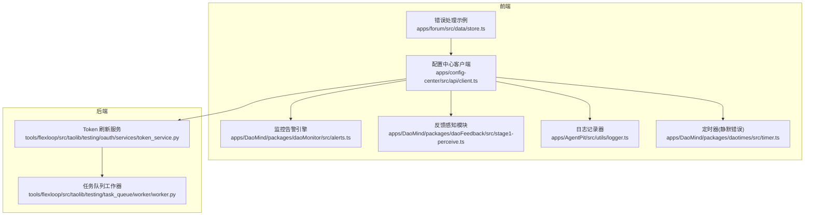
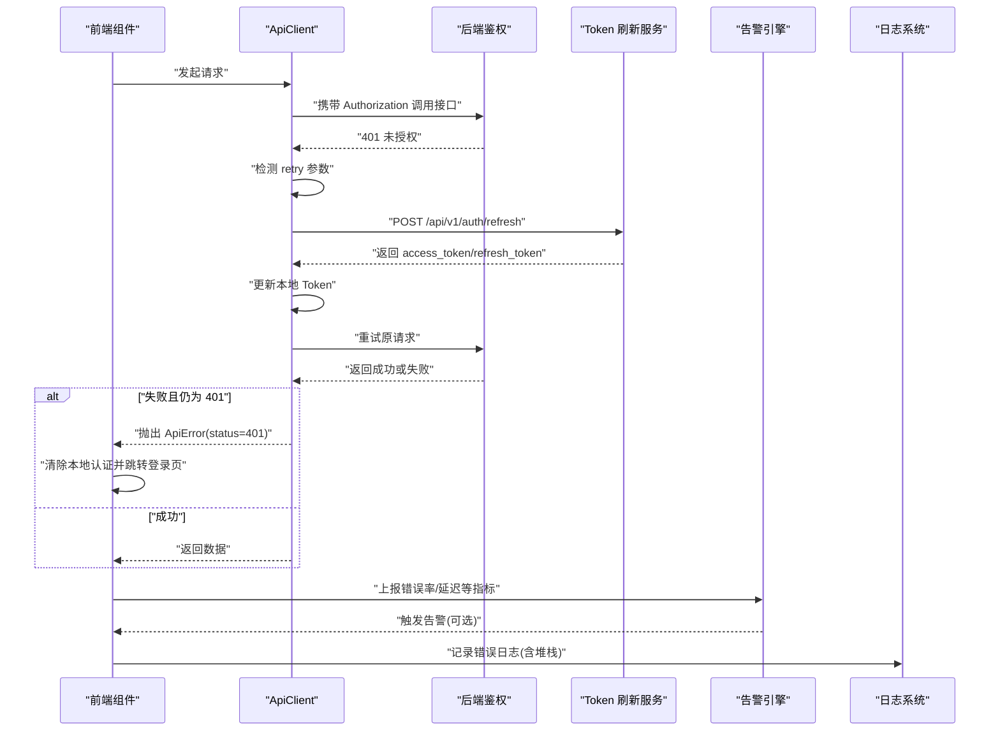
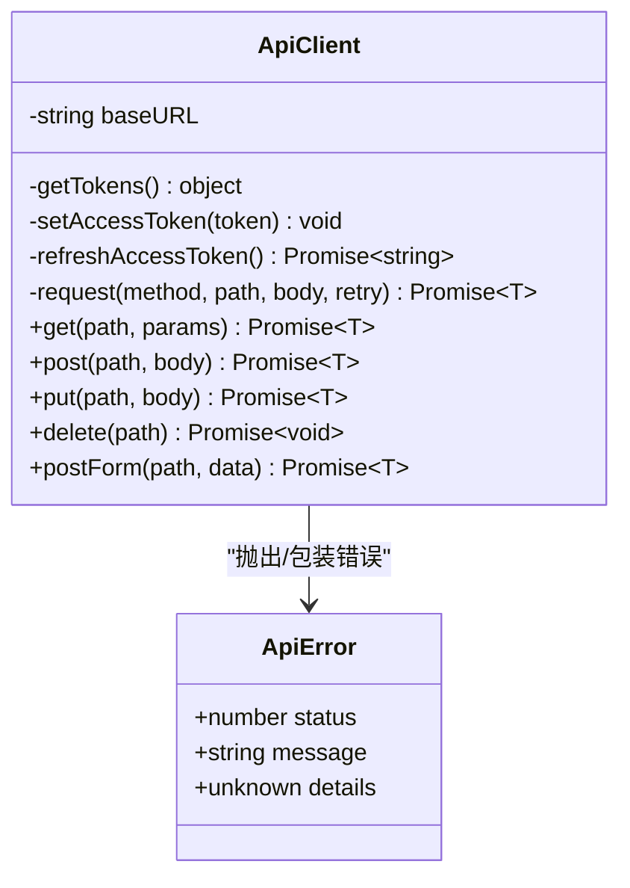
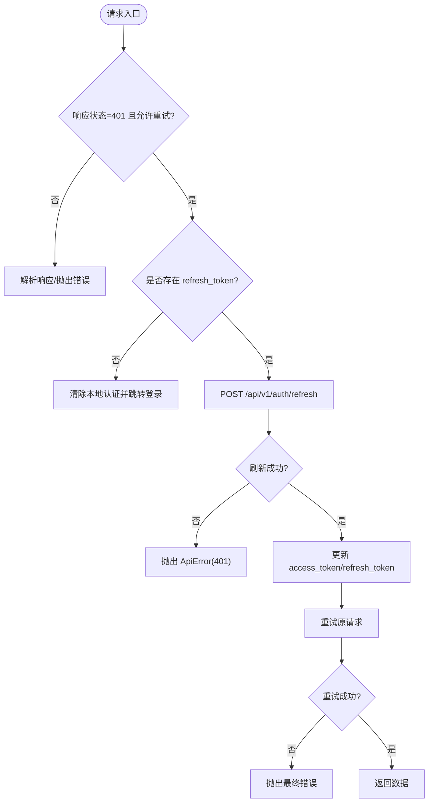
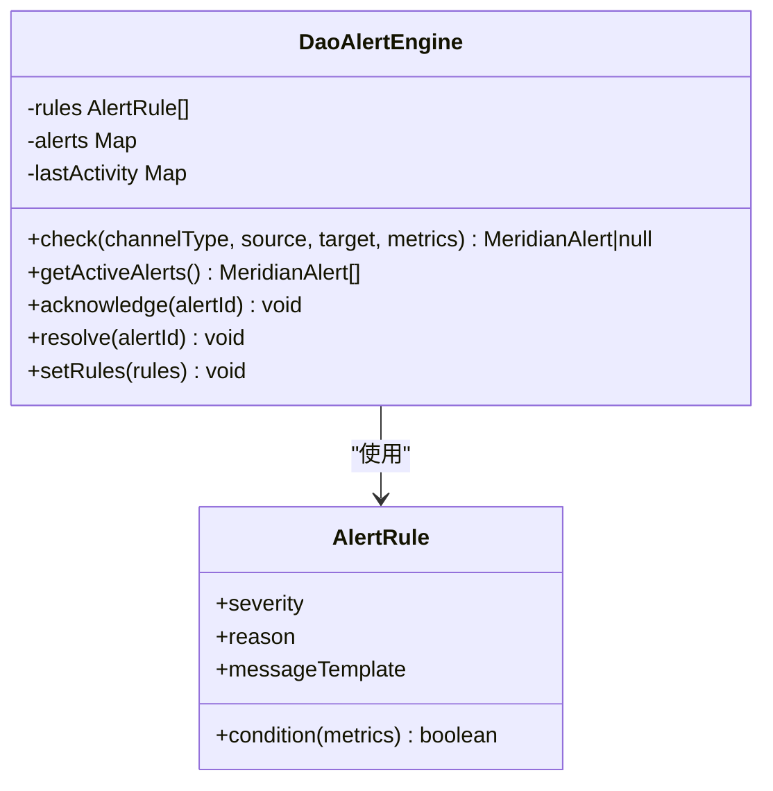
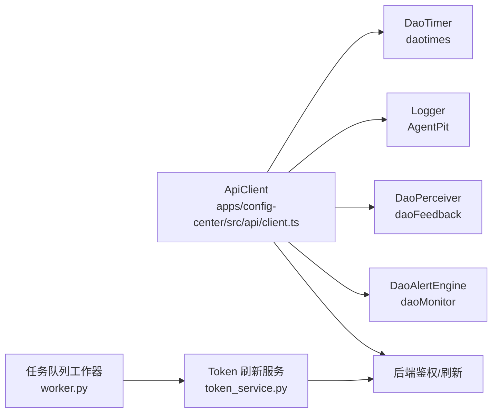

# 错误处理机制

<cite>
**本文引用的文件**
- [client.ts](file://apps/config-center/src/api/client.ts)
- [alerts.ts](file://apps/DaoMind/packages/daoMonitor/src/alerts.ts)
- [stage1-perceive.ts](file://apps/DaoMind/packages/daoFeedback/src/stage1-perceive.ts)
- [logger.ts](file://apps/AgentPit/src/utils/logger.ts)
- [timer.ts](file://apps/DaoMind/packages/daotimes/src/timer.ts)
- [token_service.py](file://tools/flexloop/src/taolib/testing/oauth/services/token_service.py)
- [worker.py](file://tools/flexloop/src/taolib/testing/task_queue/worker/worker.py)
- [store.ts](file://apps/forum/src/data/store.ts)
</cite>

## 目录
1. [简介](#简介)
2. [项目结构](#项目结构)
3. [核心组件](#核心组件)
4. [架构总览](#架构总览)
5. [详细组件分析](#详细组件分析)
6. [依赖关系分析](#依赖关系分析)
7. [性能考量](#性能考量)
8. [故障排查指南](#故障排查指南)
9. [结论](#结论)
10. [附录](#附录)

## 简介
本文件系统性梳理本仓库中的错误处理机制，重点围绕以下方面展开：
- ApiError 类的设计理念与错误分类体系
- 异常捕获策略与统一错误处理
- 401 未授权处理与 Token 刷新机制
- 重试策略、网络错误处理、超时控制与连接恢复
- 用户友好的错误提示与日志记录
- 错误监控、告警机制与运维考虑

## 项目结构
本仓库采用多应用与多包混合结构，错误处理相关的关键实现分布在如下位置：
- 前端统一 API 客户端与错误封装：apps/config-center/src/api/client.ts
- 前端错误监控与告警引擎：apps/DaoMind/packages/daoMonitor/src/alerts.ts
- 前端反馈感知与信号分级：apps/DaoMind/packages/daoFeedback/src/stage1-perceive.ts
- 日志记录与输出：apps/AgentPit/src/utils/logger.ts
- 定时器与静默错误处理：apps/DaoMind/packages/daotimes/src/timer.ts
- 后端 Token 刷新与错误传播：tools/flexloop/src/taolib/testing/oauth/services/token_service.py
- 后端任务队列重试与最终失败处理：tools/flexloop/src/taolib/testing/task_queue/worker/worker.py
- 前端错误处理示例与 Result 模式：apps/forum/src/data/store.ts

**图表来源**
- [client.ts:1-172](file://apps/config-center/src/api/client.ts#L1-L172)
- [alerts.ts:1-122](file://apps/DaoMind/packages/daoMonitor/src/alerts.ts#L1-L122)
- [stage1-perceive.ts:1-129](file://apps/DaoMind/packages/daoFeedback/src/stage1-perceive.ts#L1-L129)
- [logger.ts:1-396](file://apps/AgentPit/src/utils/logger.ts#L1-L396)
- [timer.ts:1-50](file://apps/DaoMind/packages/daotimes/src/timer.ts#L1-L50)
- [token_service.py:80-156](file://tools/flexloop/src/taolib/testing/oauth/services/token_service.py#L80-L156)
- [worker.py:244-274](file://tools/flexloop/src/taolib/testing/task_queue/worker/worker.py#L244-L274)
- [store.ts:215-215](file://apps/forum/src/data/store.ts#L215-L215)

**章节来源**
- [client.ts:1-172](file://apps/config-center/src/api/client.ts#L1-L172)
- [alerts.ts:1-122](file://apps/DaoMind/packages/daoMonitor/src/alerts.ts#L1-L122)
- [stage1-perceive.ts:1-129](file://apps/DaoMind/packages/daoFeedback/src/stage1-perceive.ts#L1-L129)
- [logger.ts:1-396](file://apps/AgentPit/src/utils/logger.ts#L1-L396)
- [timer.ts:1-50](file://apps/DaoMind/packages/daotimes/src/timer.ts#L1-L50)
- [token_service.py:80-156](file://tools/flexloop/src/taolib/testing/oauth/services/token_service.py#L80-L156)
- [worker.py:244-274](file://tools/flexloop/src/taolib/testing/task_queue/worker/worker.py#L244-L274)
- [store.ts:215-215](file://apps/forum/src/data/store.ts#L215-L215)

## 核心组件
- ApiError 统一错误模型：提供状态码、消息与可选详情，便于前端一致处理与展示。
- ApiClient 统一请求封装：内置 401 处理、Token 刷新、重试与响应解析。
- DaoAlertEngine 告警引擎：基于规则的错误率、延迟、吞吐等指标触发告警。
- DaoPerceiver 反馈感知：将性能、错误、资源等指标转化为信号级别。
- Logger 日志系统：结构化日志、缓冲、归档与颜色输出。
- DaoTimer 定时器：静默处理回调异常，避免定时任务崩溃影响主线程。
- Token 刷新服务：后端统一处理刷新逻辑与错误传播。
- 任务队列工作器：重试轮询与最终失败处理。

**章节来源**
- [client.ts:1-10](file://apps/config-center/src/api/client.ts#L1-L10)
- [client.ts:85-129](file://apps/config-center/src/api/client.ts#L85-L129)
- [alerts.ts:61-98](file://apps/DaoMind/packages/daoMonitor/src/alerts.ts#L61-L98)
- [stage1-perceive.ts:30-53](file://apps/DaoMind/packages/daoFeedback/src/stage1-perceive.ts#L30-L53)
- [logger.ts:1-48](file://apps/AgentPit/src/utils/logger.ts#L1-L48)
- [timer.ts:6-31](file://apps/DaoMind/packages/daotimes/src/timer.ts#L6-L31)
- [token_service.py:80-156](file://tools/flexloop/src/taolib/testing/oauth/services/token_service.py#L80-L156)
- [worker.py:244-274](file://tools/flexloop/src/taolib/testing/task_queue/worker/worker.py#L244-L274)

## 架构总览
前端通过 ApiClient 发起请求，统一拦截 401 并触发 Token 刷新；刷新成功后自动重试原请求；失败则抛出 ApiError 供上层 UI 层处理。同时，系统通过 DaoAlertEngine 与 DaoPerceiver 对错误进行监控与分级，结合 Logger 记录结构化日志，形成“捕获-刷新-重试-监控-记录”的闭环。

**图表来源**
- [client.ts:47-83](file://apps/config-center/src/api/client.ts#L47-L83)
- [client.ts:98-120](file://apps/config-center/src/api/client.ts#L98-L120)
- [token_service.py:80-156](file://tools/flexloop/src/taolib/testing/oauth/services/token_service.py#L80-L156)
- [alerts.ts:66-98](file://apps/DaoMind/packages/daoMonitor/src/alerts.ts#L66-L98)
- [logger.ts:378-381](file://apps/AgentPit/src/utils/logger.ts#L378-L381)

## 详细组件分析

### ApiError 与 ApiClient：统一错误模型与请求封装
- ApiError：以状态码、消息与可选详情为核心属性，便于 UI 与监控系统统一识别与处理。
- ApiClient：
  - 401 处理：在首次请求返回 401 且允许重试时，触发刷新流程；若刷新失败则清除本地认证并跳转登录页。
  - Token 刷新：并发去重（refreshPromise）、持久化新 Token、重试原请求。
  - 响应解析：自动处理 204、JSON 解析与错误包装。
  - 表单提交：postForm 支持 application/x-www-form-urlencoded。

**图表来源**
- [client.ts:1-10](file://apps/config-center/src/api/client.ts#L1-L10)
- [client.ts:14-171](file://apps/config-center/src/api/client.ts#L14-L171)

**章节来源**
- [client.ts:1-10](file://apps/config-center/src/api/client.ts#L1-L10)
- [client.ts:47-83](file://apps/config-center/src/api/client.ts#L47-L83)
- [client.ts:85-129](file://apps/config-center/src/api/client.ts#L85-L129)
- [client.ts:131-168](file://apps/config-center/src/api/client.ts#L131-L168)

### 401 未授权处理与 Token 刷新机制
- 401 检测：首次请求 401 且 retry=true 时进入刷新流程。
- 刷新幂等：refreshPromise 避免并发重复刷新。
- 刷新失败：抛出 ApiError(401)，清除本地认证并跳转登录页。
- 刷新成功：更新 access_token 与 refresh_token，并重试原请求。

**图表来源**
- [client.ts:98-120](file://apps/config-center/src/api/client.ts#L98-L120)
- [client.ts:47-83](file://apps/config-center/src/api/client.ts#L47-L83)
- [token_service.py:80-156](file://tools/flexloop/src/taolib/testing/oauth/services/token_service.py#L80-L156)

**章节来源**
- [client.ts:98-120](file://apps/config-center/src/api/client.ts#L98-L120)
- [client.ts:47-83](file://apps/config-center/src/api/client.ts#L47-L83)
- [token_service.py:80-156](file://tools/flexloop/src/taolib/testing/oauth/services/token_service.py#L80-L156)

### 重试策略与网络错误处理
- 重试触发：401 且 retry=true 时自动重试。
- 幂等性：refreshPromise 保证刷新只执行一次。
- 网络错误：fetch 返回非 ok 时解析错误详情并抛出 ApiError。
- 表单提交：postForm 自动设置 Content-Type 并解析响应。

**章节来源**
- [client.ts:85-129](file://apps/config-center/src/api/client.ts#L85-L129)
- [client.ts:156-168](file://apps/config-center/src/api/client.ts#L156-L168)

### 用户友好提示与 Result 模式示例
- 前端示例：在论坛应用中，通过注释展示了使用 Result 类型（例如 neverthrow）与 ApiError 结合的链式处理思路，便于统一错误处理与类型安全。

**章节来源**
- [store.ts:215-215](file://apps/forum/src/data/store.ts#L215-L215)

### 错误监控与告警机制
- DaoAlertEngine：基于规则检查指标（速率、延迟、错误率），命中条件即生成告警并可获取活跃告警列表。
- 默认规则：涵盖拥塞、延迟尖峰、错误率激增等场景。
- 规则可配置：支持动态设置规则数组。

**图表来源**
- [alerts.ts:3-57](file://apps/DaoMind/packages/daoMonitor/src/alerts.ts#L3-L57)
- [alerts.ts:61-121](file://apps/DaoMind/packages/daoMonitor/src/alerts.ts#L61-L121)

**章节来源**
- [alerts.ts:1-122](file://apps/DaoMind/packages/daoMonitor/src/alerts.ts#L1-L122)

### 反馈感知与信号分级
- DaoPerceiver：根据阈值将性能、错误、资源等指标映射为信号级别（critical/warning/info/opportunity），便于快速定位问题与制定优化策略。

**章节来源**
- [stage1-perceive.ts:55-108](file://apps/DaoMind/packages/daoFeedback/src/stage1-perceive.ts#L55-L108)

### 日志记录与输出
- Logger：支持结构化日志、级别优先级、缓冲与归档、颜色输出；错误方法会立即落盘，便于问题追踪。

**章节来源**
- [logger.ts:1-48](file://apps/AgentPit/src/utils/logger.ts#L1-L48)
- [logger.ts:311-381](file://apps/AgentPit/src/utils/logger.ts#L311-L381)

### 定时器与静默错误处理
- DaoTimer：定时任务回调异常会被静默捕获，避免影响后续执行与整体稳定性。

**章节来源**
- [timer.ts:11-22](file://apps/DaoMind/packages/daotimes/src/timer.ts#L11-L22)

### 后端重试策略与最终失败处理
- 任务队列工作器：在重试轮询中处理取消与异常，达到最大重试次数后标记为 FAILED 并记录错误与堆栈，确保可观测性与可恢复性。

**章节来源**
- [worker.py:244-274](file://tools/flexloop/src/taolib/testing/task_queue/worker/worker.py#L244-L274)

## 依赖关系分析
- 前端 ApiClient 依赖浏览器 fetch 与本地存储，间接依赖后端鉴权与刷新接口。
- 前端监控与反馈模块独立于业务，仅依赖指标输入与规则配置。
- 日志系统与定时器模块为基础设施，被各业务模块复用。
- 后端 Token 刷新服务与任务队列工作器提供跨语言的错误处理范式。

**图表来源**
- [client.ts:14-171](file://apps/config-center/src/api/client.ts#L14-L171)
- [alerts.ts:61-121](file://apps/DaoMind/packages/daoMonitor/src/alerts.ts#L61-L121)
- [stage1-perceive.ts:30-53](file://apps/DaoMind/packages/daoFeedback/src/stage1-perceive.ts#L30-L53)
- [logger.ts:378-381](file://apps/AgentPit/src/utils/logger.ts#L378-L381)
- [timer.ts:6-31](file://apps/DaoMind/packages/daotimes/src/timer.ts#L6-L31)
- [token_service.py:80-156](file://tools/flexloop/src/taolib/testing/oauth/services/token_service.py#L80-L156)
- [worker.py:244-274](file://tools/flexloop/src/taolib/testing/task_queue/worker/worker.py#L244-L274)

**章节来源**
- [client.ts:14-171](file://apps/config-center/src/api/client.ts#L14-L171)
- [token_service.py:80-156](file://tools/flexloop/src/taolib/testing/oauth/services/token_service.py#L80-L156)
- [worker.py:244-274](file://tools/flexloop/src/taolib/testing/task_queue/worker/worker.py#L244-L274)

## 性能考量
- 并发刷新去重：refreshPromise 避免多个 401 同时触发刷新，降低后端压力。
- 缓冲与归档：日志系统具备缓冲与归档策略，减少频繁 IO。
- 定时器静默：定时器回调异常不会阻塞后续执行，保障长周期任务稳定性。
- 监控告警：基于规则的阈值触发，避免过度报警与漏报。

[本节为通用指导，无需具体文件分析]

## 故障排查指南
- 401 未授权反复出现
  - 检查本地存储中的 refresh_token 是否存在与有效。
  - 查看刷新接口返回与后端日志，确认刷新是否成功。
  - 若刷新失败，确认清除本地认证与跳转登录逻辑是否生效。
- 刷新成功但请求仍失败
  - 确认重试逻辑是否执行，Headers 是否已更新 Authorization。
  - 检查后端接口是否幂等，避免重复操作导致状态异常。
- 错误监控未触发
  - 核对指标上报频率与规则阈值，确认告警模板变量替换是否正确。
- 日志缺失或格式异常
  - 检查 Logger 的级别与输出目标，确认错误方法是否传入了堆栈信息。
- 定时任务异常
  - 确认回调异常是否被静默捕获，必要时在回调内显式记录错误。

**章节来源**
- [client.ts:98-120](file://apps/config-center/src/api/client.ts#L98-L120)
- [client.ts:47-83](file://apps/config-center/src/api/client.ts#L47-L83)
- [alerts.ts:66-98](file://apps/DaoMind/packages/daoMonitor/src/alerts.ts#L66-L98)
- [logger.ts:311-381](file://apps/AgentPit/src/utils/logger.ts#L311-L381)
- [timer.ts:11-22](file://apps/DaoMind/packages/daotimes/src/timer.ts#L11-L22)

## 结论
本仓库在前端与后端分别实现了统一的错误模型、401 处理与 Token 刷新、监控告警与日志记录等能力。通过 ApiError 与 ApiClient 的组合，实现了“捕获-刷新-重试-监控-记录”的闭环；配合 DaoAlertEngine 与 DaoPerceiver，能够快速定位与响应异常；Logger 与定时器模块进一步增强了系统的可观测性与稳定性。建议在后续迭代中持续完善规则阈值、日志字段与告警联动策略，以提升整体运维效率。

[本节为总结，无需具体文件分析]

## 附录
- 统一错误处理示例路径
  - [ApiClient.request:85-129](file://apps/config-center/src/api/client.ts#L85-L129)
  - [ApiClient.refreshAccessToken:47-83](file://apps/config-center/src/api/client.ts#L47-L83)
- 监控与告警示例路径
  - [DaoAlertEngine.check:66-98](file://apps/DaoMind/packages/daoMonitor/src/alerts.ts#L66-L98)
  - [DaoAlertEngine.setRules:118-121](file://apps/DaoMind/packages/daoMonitor/src/alerts.ts#L118-L121)
- 反馈感知示例路径
  - [DaoPerceiver.evaluateLevel:55-108](file://apps/DaoMind/packages/daoFeedback/src/stage1-perceive.ts#L55-L108)
- 日志记录示例路径
  - [Logger.error:378-381](file://apps/AgentPit/src/utils/logger.ts#L378-L381)
- 定时器静默错误示例路径
  - [DaoTimer.setInterval 回调异常处理:11-22](file://apps/DaoMind/packages/daotimes/src/timer.ts#L11-L22)
- 后端重试与最终失败示例路径
  - [任务队列工作器最终失败处理:244-274](file://tools/flexloop/src/taolib/testing/task_queue/worker/worker.py#L244-L274)