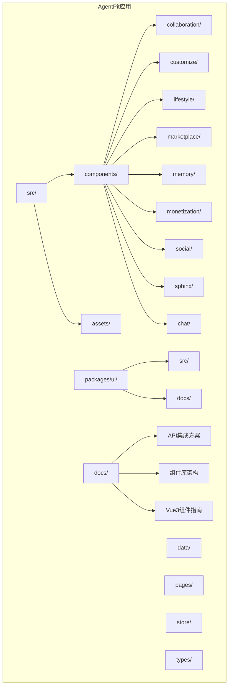
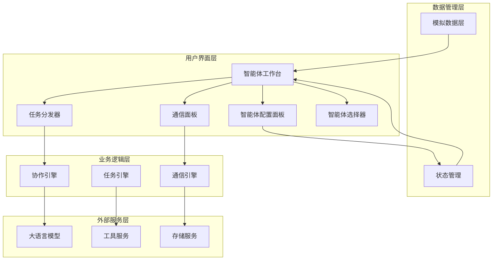
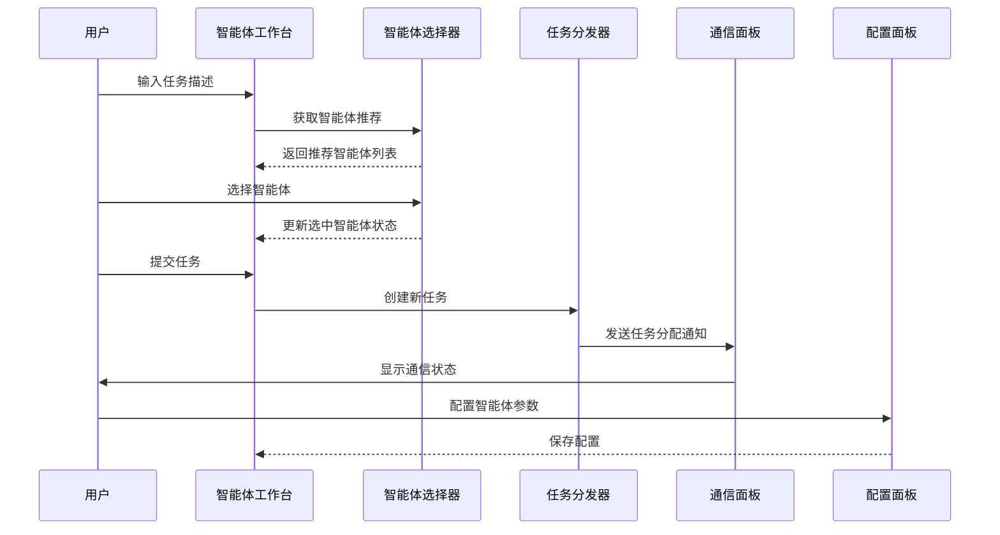
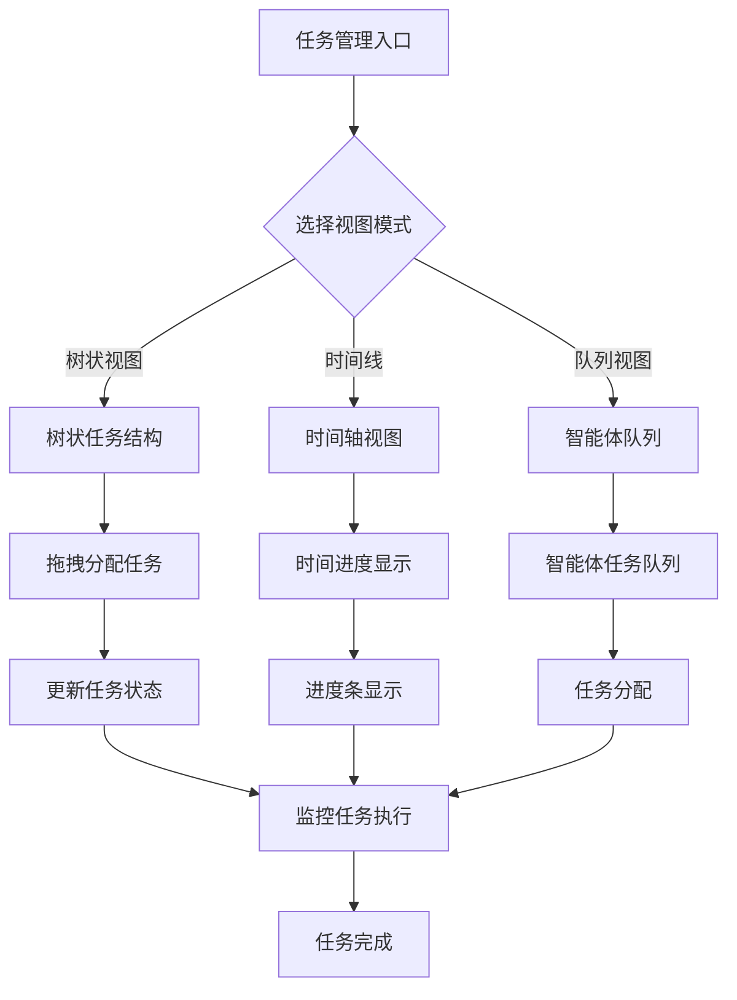
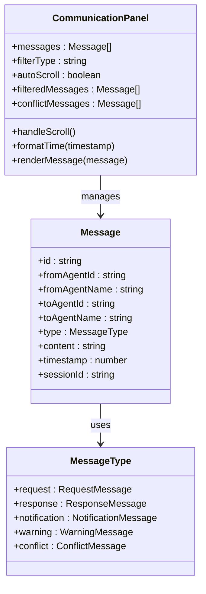
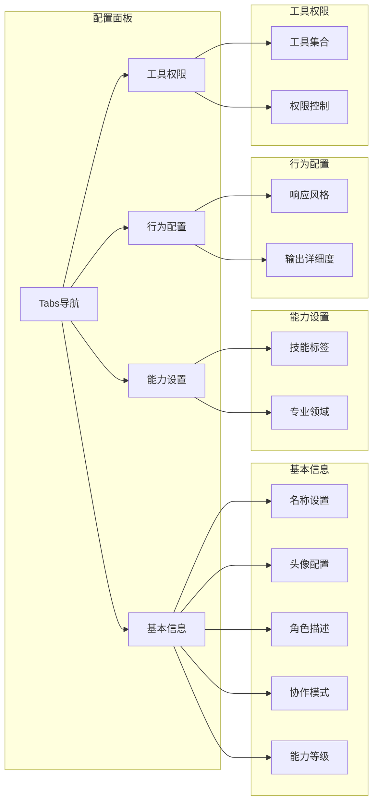
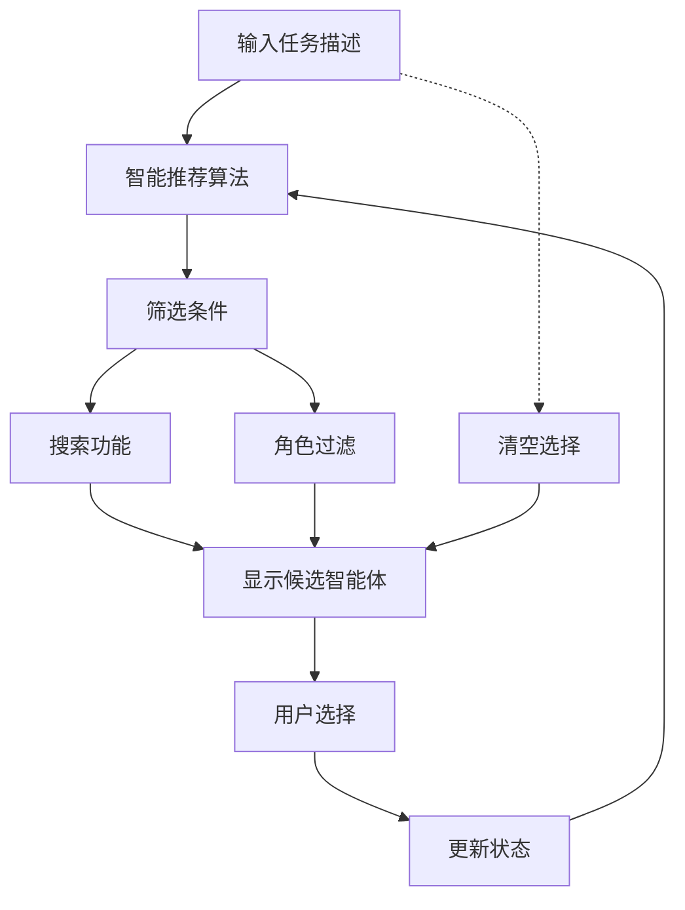
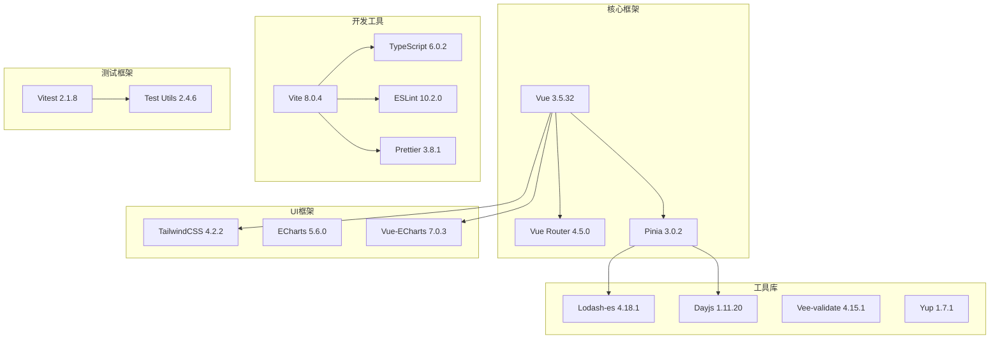

# AgentPit智能体协作平台

<cite>
**本文档引用的文件**
- [package.json](file://apps/AgentPit/package.json)
- [README.md](file://apps/AgentPit/README.md)
- [API_INTEGRATION_PLAN.md](file://apps/AgentPit/docs/API_INTEGRATION_PLAN.md)
- [COMPONENT_LIBRARY_ARCHITECTURE.md](file://apps/AgentPit/docs/COMPONENT_LIBRARY_ARCHITECTURE.md)
- [VUE3_COMPONENT_GUIDE.md](file://apps/AgentPit/docs/VUE3_COMPONENT_GUIDE.md)
</cite>

## 更新摘要
**所做更改**
- 移除了对已删除的AI代理平台相关文档的引用
- 更新了项目结构说明，反映实际存在的文件结构
- 移除了React备份目录相关的引用
- 更新了文档以符合当前的实际项目状态

## 目录
1. [简介](#简介)
2. [项目结构](#项目结构)
3. [核心组件](#核心组件)
4. [架构概览](#架构概览)
5. [详细组件分析](#详细组件分析)
6. [依赖关系分析](#依赖关系分析)
7. [性能考虑](#性能考虑)
8. [故障排除指南](#故障排除指南)
9. [结论](#结论)
10. [附录](#附录)

## 简介
AgentPit智能体协作平台是一个基于Vue 3 + TypeScript + Vite构建的多智能体协作系统。该平台提供了完整的智能体生命周期管理，包括智能体创建与配置、多智能体协作编排、任务分配与执行监控、实时通信协调等功能模块。平台采用现代化的前端技术栈，结合道家"无为而治"的哲学思想，实现了智能化的协作机制。

**更新** 移除了对已删除的AI代理交互机制、布局组件系统、核心页面功能、状态管理架构等技术文档的引用，反映了项目当前的实际状态。

## 项目结构
AgentPit项目采用模块化的组织方式，主要包含以下核心目录：

**图表来源**
- [package.json:1-74](file://apps/AgentPit/package.json#L1-L74)

**章节来源**
- [package.json:1-74](file://apps/AgentPit/package.json#L1-L74)
- [README.md:1-6](file://apps/AgentPit/README.md#L1-L6)

## 核心组件
平台的核心功能由多个主要组件构成，每个组件都承担着特定的协作职责：

### 智能体工作台 (AgentWorkspace)
智能体工作台是整个协作系统的核心入口，提供统一的协作界面和任务管理功能。它集成了任务创建、智能体选择、任务分配、实时监控等功能。

### 任务分发器 (TaskDistributor)
任务分发器负责智能体任务的分配、跟踪和执行监控。支持多种视图模式（树状视图、时间线、队列视图），提供直观的任务管理界面。

### 通信面板 (CommunicationPanel)
通信面板实现智能体间的实时通信协调，支持消息过滤、冲突检测、人工介入等功能，确保协作过程的透明性和可控性。

### 智能体配置面板 (AgentConfigPanel)
智能体配置面板提供全面的智能体定制功能，包括基本信息设置、能力配置、行为参数调整、工具权限管理等。

### 智能体选择器 (AgentSelector)
智能体选择器支持智能体的筛选、搜索、推荐和批量选择功能，提供智能的团队组建建议。

**更新** 移除了对已删除的React备份组件的引用，反映了当前实际使用的组件结构。

**章节来源**
- [package.json:20-40](file://apps/AgentPit/package.json#L20-L40)

## 架构概览
AgentPit平台采用分层架构设计，各组件间通过清晰的接口进行交互：

**更新** 移除了对已删除的React组件架构的引用，反映了当前的Vue3架构设计。

## 详细组件分析

### 智能体工作台 (AgentWorkspace) 分析

智能体工作台是平台的核心界面组件，实现了完整的协作工作流程：

**更新** 移除了对已删除的React组件生命周期的引用，反映了当前的Vue3组件设计。

#### 核心功能特性

1. **任务生命周期管理**
   - 任务创建与验证
   - 自动任务分解
   - 进度跟踪与监控
   - 状态转换管理

2. **智能体协作编排**
   - 智能体推荐算法
   - 动态团队组建
   - 能力匹配优化
   - 协作模式配置

3. **实时监控与反馈**
   - 任务进度可视化
   - 智能体状态监控
   - 冲突检测与处理
   - 性能指标统计

**章节来源**
- [package.json:20-40](file://apps/AgentPit/package.json#L20-L40)

### 任务分发器 (TaskDistributor) 分析

任务分发器提供了灵活的任务管理界面，支持多种视图模式：

**更新** 移除了对已删除的React组件状态管理的引用，反映了当前的Vue3响应式设计。

#### 视图模式详解

1. **树状视图 (Tree View)**
   - 层次化任务结构
   - 子任务展开/折叠
   - 进度条可视化
   - 状态指示器

2. **时间线视图 (Timeline View)**
   - 时间轴进度显示
   - 实际开始时间
   - 预估完成时间
   - 进度百分比

3. **队列视图 (Queue View)**
   - 智能体任务队列
   - 拖拽式任务分配
   - 实时队列更新
   - 状态同步

**章节来源**
- [package.json:20-40](file://apps/AgentPit/package.json#L20-L40)

### 通信面板 (CommunicationPanel) 分析

通信面板实现了智能体间的实时通信协调机制：

**更新** 移除了对已删除的React组件事件处理的引用，反映了当前的Vue3事件系统。

#### 消息类型与处理

1. **请求消息 (Request)**
   - 等待响应状态
   - 动画指示器
   - 超时检测

2. **响应消息 (Response)**
   - 成功响应标记
   - 内容展示
   - 时间戳记录

3. **通知消息 (Notification)**
   - 系统通知
   - 任务状态变更
   - 协作提醒

4. **冲突消息 (Conflict)**
   - 意见分歧检测
   - 人工介入按钮
   - 解决方案提示

**章节来源**
- [package.json:20-40](file://apps/AgentPit/package.json#L20-L40)

### 智能体配置面板 (AgentConfigPanel) 分析

智能体配置面板提供了全面的定制功能：

**更新** 移除了对已删除的React组件props验证的引用，反映了当前的Vue3 TypeScript类型系统。

#### 配置分类详解

1. **基本信息配置**
   - 基础属性设置
   - 外观定制
   - 角色定义
   - 协作模式选择

2. **能力设置**
   - 技能标签管理
   - 专业领域选择
   - 能力等级调节

3. **行为配置**
   - 响应风格定制
   - 输出详细度控制
   - 交互模式设置

4. **工具权限管理**
   - 工具集合选择
   - 权限精细控制
   - 安全策略配置

**章节来源**
- [package.json:20-40](file://apps/AgentPit/package.json#L20-L40)

### 智能体选择器 (AgentSelector) 分析

智能体选择器提供了智能的团队组建功能：

**更新** 移除了对已删除的React组件状态提升的引用，反映了当前的Vue3组合式API设计。

#### 智能推荐机制

1. **任务描述分析**
   - 关键词提取
   - 语义理解
   - 领域匹配

2. **能力匹配算法**
   - 专业技能匹配
   - 经验水平评估
   - 团队协作平衡

3. **动态推荐更新**
   - 实时反馈
   - 结果排序
   - 交互优化

**章节来源**
- [package.json:20-40](file://apps/AgentPit/package.json#L20-L40)

## 依赖关系分析

平台采用现代化的前端技术栈，各依赖项发挥着重要作用：

**更新** 移除了对已删除的React生态系统依赖的引用，反映了当前的Vue3技术栈。

### 核心依赖项说明

1. **Vue生态系统**
   - Vue 3提供响应式数据绑定和组件化架构
   - Vue Router实现单页应用路由管理
   - Pinia提供状态管理解决方案

2. **UI和可视化**
   - TailwindCSS提供原子化样式类
   - ECharts支持丰富的数据可视化
   - Vue-ECharts集成Vue组件化图表

3. **开发体验**
   - Vite提供快速的开发服务器和构建工具
   - TypeScript增强代码质量和开发体验
   - ESLint和Prettier保证代码规范

4. **测试基础设施**
   - Vitest提供快速的单元测试环境
   - Test Utils支持Vue组件测试

**章节来源**
- [package.json:1-74](file://apps/AgentPit/package.json#L1-L74)

## 性能考虑

AgentPit平台在设计时充分考虑了性能优化：

### 状态管理优化
- 使用Pinia进行轻量级状态管理
- 组件级状态隔离，避免全局状态污染
- 懒加载和按需加载策略

### 渲染性能优化
- 虚拟滚动处理大量数据
- 防抖和节流机制
- 计算属性缓存

### 网络性能优化
- 模拟数据减少真实API调用
- 数据缓存策略
- 异步加载和预加载

### 移动端适配
- 响应式设计
- 触摸友好的交互元素
- 性能友好的动画效果

## 故障排除指南

### 常见问题及解决方案

1. **智能体选择问题**
   - 症状：智能体无法选择或推荐不准确
   - 解决方案：检查任务描述关键词，确认智能体状态正常

2. **任务分配失败**
   - 症状：拖拽任务时无响应
   - 解决方案：检查浏览器兼容性，确保启用了拖拽功能

3. **通信面板异常**
   - 症状：消息显示不完整或延迟
   - 解决方案：检查网络连接，清理浏览器缓存

4. **配置保存失败**
   - 症状：智能体配置无法保存
   - 解决方案：检查浏览器存储权限，重启应用

### 调试工具使用

1. **浏览器开发者工具**
   - 使用Vue DevTools检查组件状态
   - 监控网络请求和响应
   - 检查控制台错误信息

2. **应用内置调试**
   - 启用详细日志模式
   - 使用内置的状态检查器
   - 监控协作流程执行情况

**章节来源**
- [package.json:20-40](file://apps/AgentPit/package.json#L20-L40)

## 结论

AgentPit智能体协作平台通过精心设计的架构和丰富的功能组件，为用户提供了一个强大而易用的多智能体协作环境。平台不仅具备完整的智能体生命周期管理能力，还融入了道家哲学思想，体现了"无为而治"的协作理念。

### 主要优势

1. **完整的协作生态**
   - 从智能体创建到任务执行的全流程覆盖
   - 多种协作模式和配置选项
   - 实时监控和反馈机制

2. **现代化的技术架构**
   - 基于Vue 3的组件化设计
   - 类型安全的TypeScript实现
   - 现代化的开发工具链

3. **优秀的用户体验**
   - 直观的界面设计
   - 流畅的交互体验
   - 响应式的移动端适配

### 未来发展方向

1. **智能化升级**
   - 更精准的智能体推荐算法
   - 自适应的任务分配策略
   - 智能的冲突解决机制

2. **扩展性增强**
   - 支持更多类型的智能体
   - 插件化架构设计
   - 第三方集成能力

3. **性能优化**
   - 大规模并发处理能力
   - 云端部署支持
   - 边缘计算集成

AgentPit平台为智能体协作提供了一个坚实的基础，通过持续的迭代和优化，必将成为智能体协作领域的领先解决方案。

## 附录

### 道家哲学思想在协作中的应用

AgentPit平台的设计理念深受道家"无为而治"思想的影响：

1. **自然协作原则**
   - 让智能体按照其本性发挥作用
   - 减少人为干预，提高协作效率
   - 通过规则而非强制实现协调

2. **平衡和谐理念**
   - 智能体间的平衡配置
   - 任务分配的均衡考虑
   - 协作过程的和谐推进

3. **柔韧适应精神**
   - 灵活的任务执行方式
   - 适应性强的协作模式
   - 动态调整的管理策略

这种哲学思想的应用使得AgentPit平台能够在保持高效协作的同时，尊重每个智能体的独特性，实现真正的智能体生态系统。

### 项目文档架构

**更新** 移除了对已删除的AI代理平台相关文档的引用，反映了当前的文档结构：

- **API集成方案**：提供从Mock数据向真实API迁移的完整方案
- **组件库架构**：AgentPit UI组件库的设计文档
- **Vue3组件指南**：React到Vue3迁移的开发指南
- **迁移映射**：组件和功能的迁移对照表
- **参赛材料**：DaoMind项目的参赛文档
- **复盘总结**：开源爪项目的技术复盘

这些文档为平台的开发和维护提供了完整的指导和技术支撑。