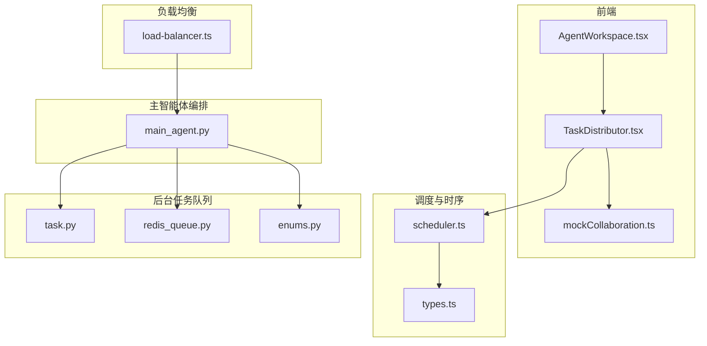
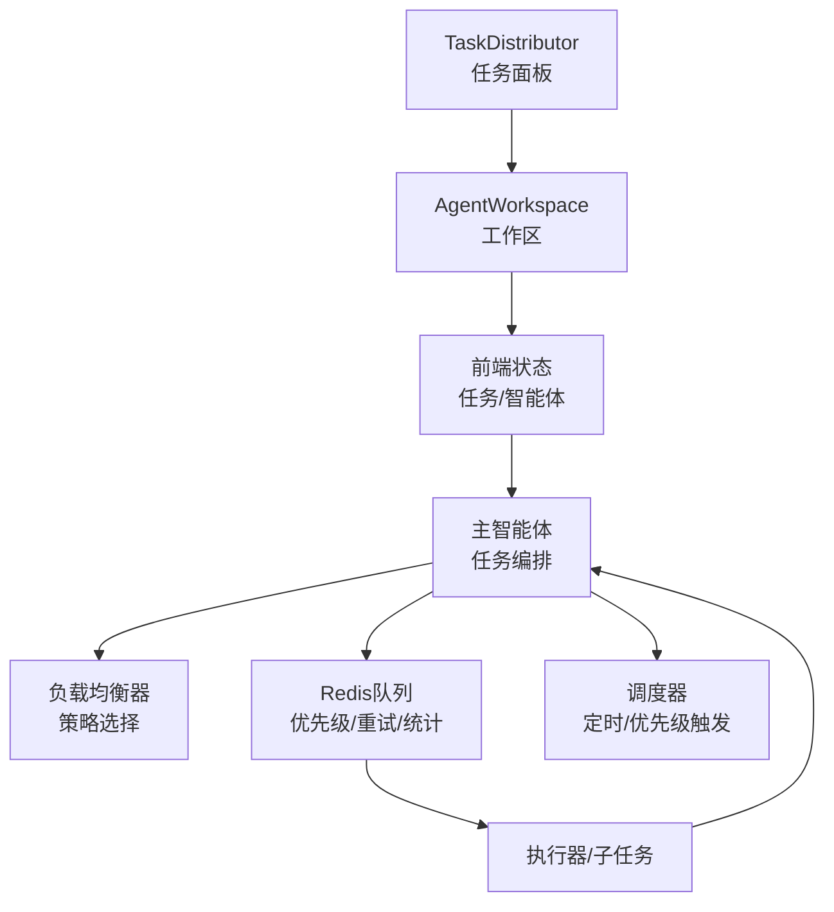
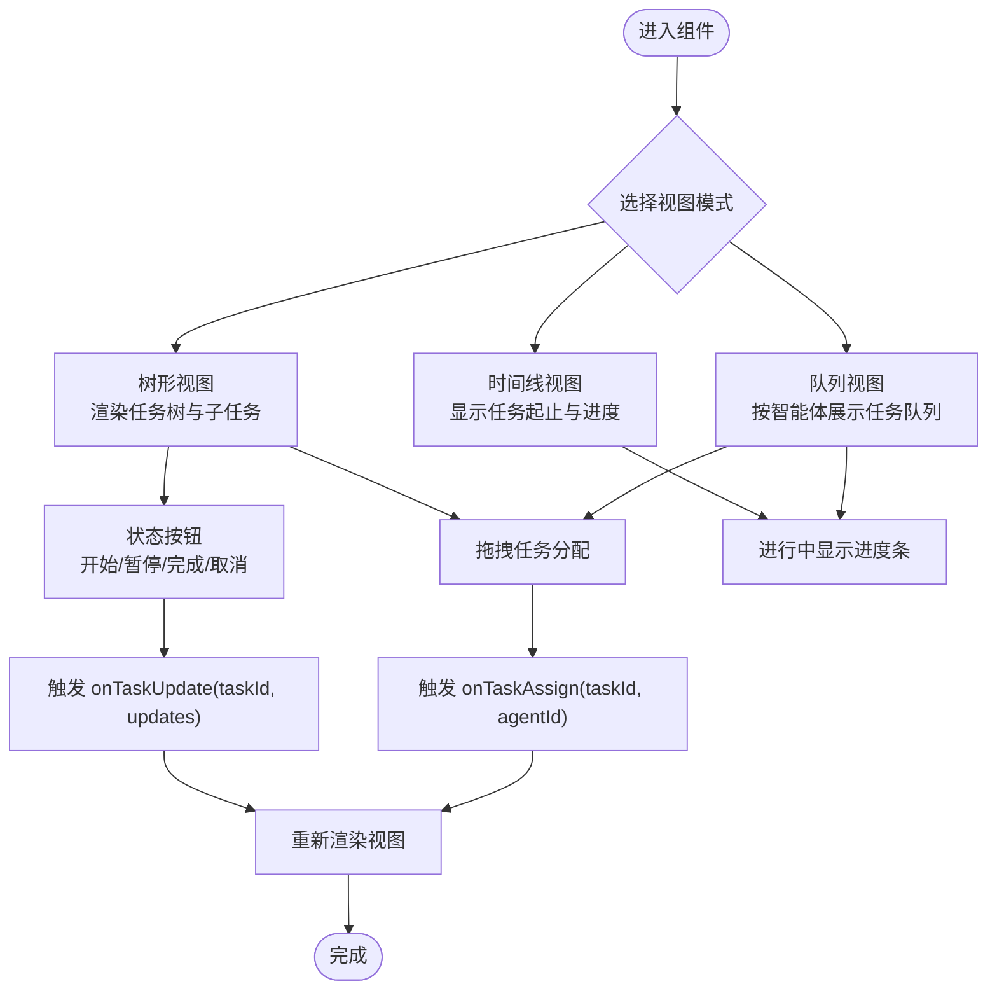
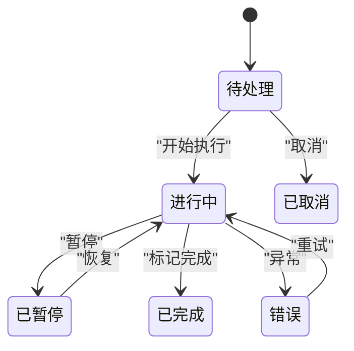
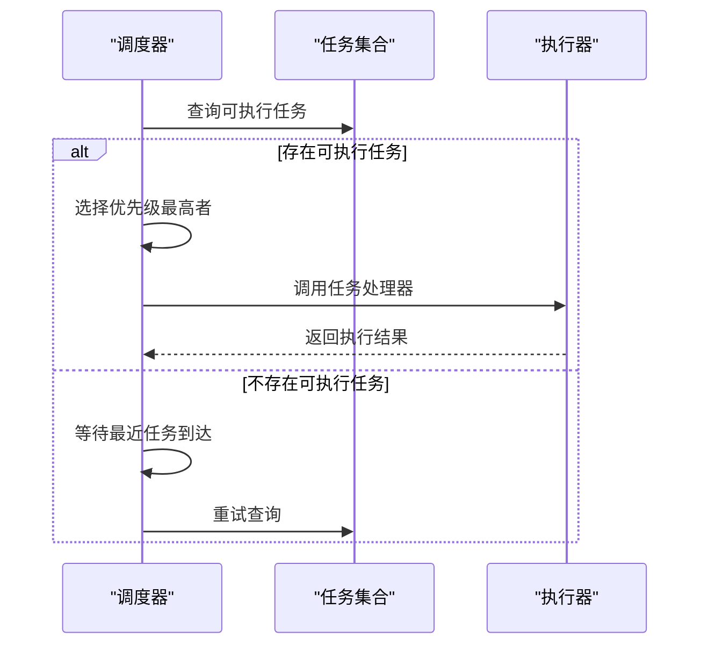
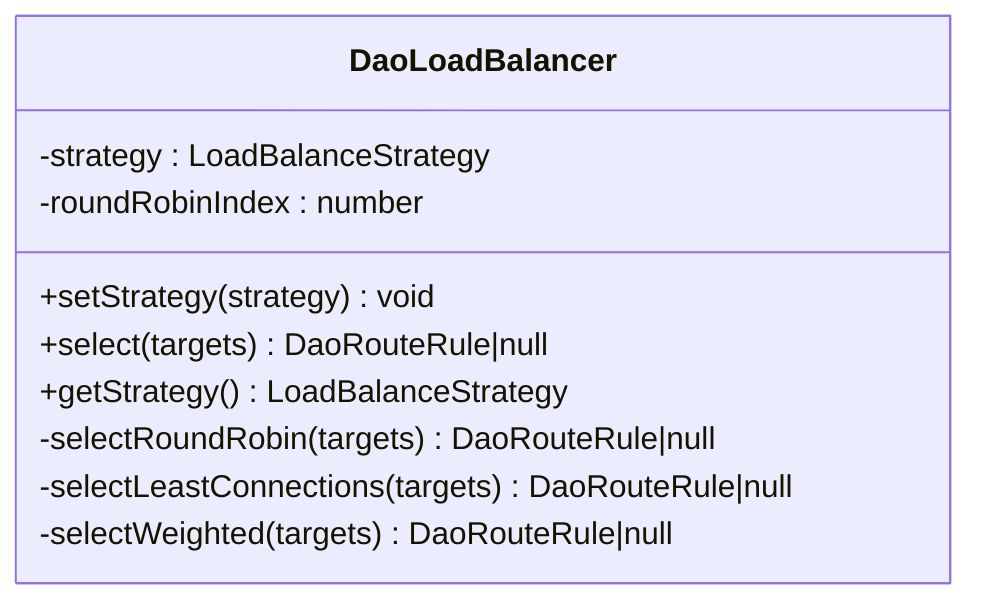
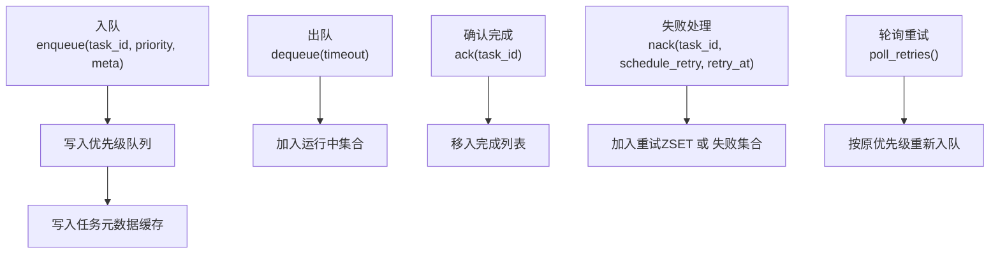
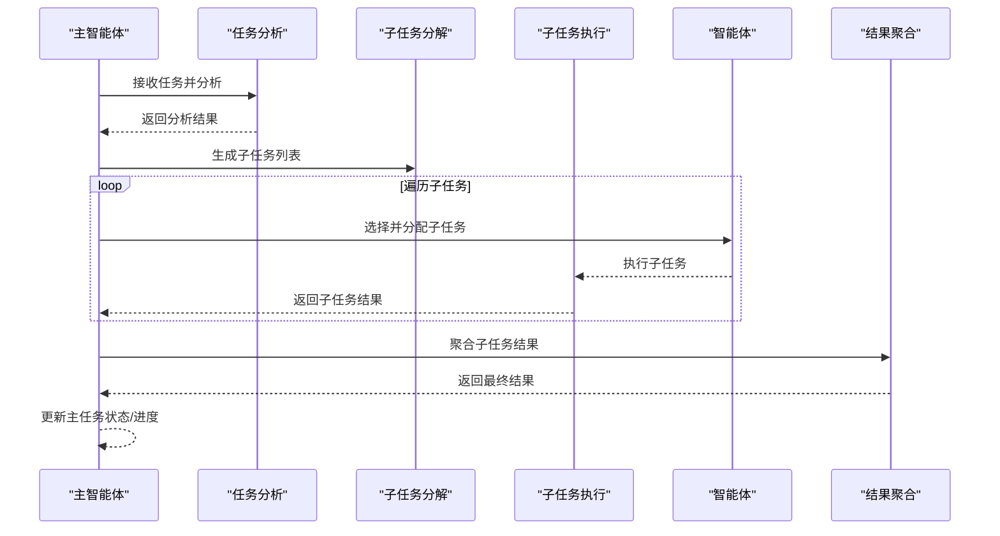
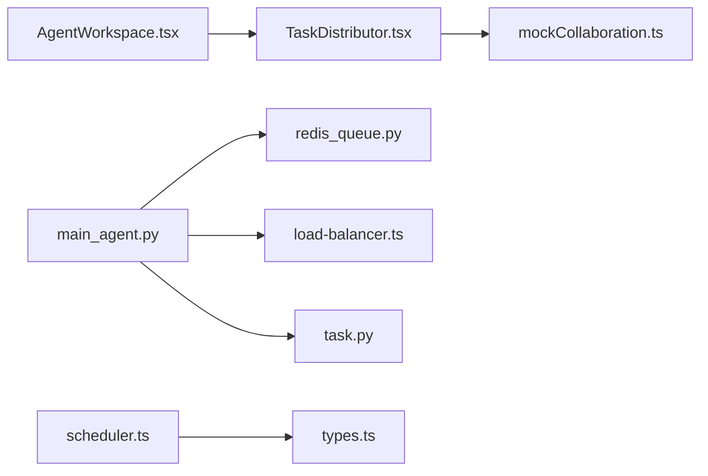

# 任务分发系统

<cite>
**本文引用的文件**
- [TaskDistributor.tsx](file://apps/AgentPit/src-react-backup-20260410/components/collaboration/TaskDistributor.tsx)
- [mockCollaboration.ts](file://apps/AgentPit/src-react-backup-20260410/data/mockCollaboration.ts)
- [AgentWorkspace.tsx](file://apps/AgentPit/src-react-backup-20260410/components/collaboration/AgentWorkspace.tsx)
- [scheduler.ts](file://apps/DaoMind/packages/daotimes/src/scheduler.ts)
- [types.ts](file://apps/DaoMind/packages/daotimes/src/types.ts)
- [load-balancer.ts](file://apps/DaoMind/packages/daoNexus/src/load-balancer.ts)
- [task.py](file://tools/flexloop/src/taolib/testing/task_queue/models/task.py)
- [redis_queue.py](file://tools/flexloop/src/taolib/testing/task_queue/queue/redis_queue.py)
- [enums.py](file://tools/flexloop/src/taolib/testing/task_queue/models/enums.py)
- [main_agent.py](file://tools/flexloop/src/taolib/testing/multi_agent/agents/main_agent.py)
- [execution-flow.md](file://skills/daoSkilLs/skills/task-execution-summary/references/execution-flow.md)
- [tasks.md](file://tools/flexloop/.trae/specs/multi_agent_system/tasks.md)
</cite>

## 目录
1. [简介](#简介)
2. [项目结构](#项目结构)
3. [核心组件](#核心组件)
4. [架构概览](#架构概览)
5. [详细组件分析](#详细组件分析)
6. [依赖分析](#依赖分析)
7. [性能考量](#性能考量)
8. [故障排除指南](#故障排除指南)
9. [结论](#结论)
10. [附录](#附录)

## 简介
本文件为“任务分发系统”的全面技术文档，聚焦于 TaskDistributor 组件及其相关调度与执行基础设施。内容涵盖：
- 任务优先级排序、智能体匹配与负载均衡机制
- 任务状态管理、进度跟踪与异常处理
- 子任务分解策略、并行执行控制与结果聚合
- 性能优化、缓存策略与实时更新机制
- 调度算法实现细节、配置参数与扩展接口
- 故障排除与调试技巧

## 项目结构
围绕任务分发系统的关键文件与模块如下：
- 前端任务分发与协作面板：TaskDistributor.tsx、AgentWorkspace.tsx、mockCollaboration.ts
- 调度与时间窗：scheduler.ts、types.ts
- 负载均衡：load-balancer.ts
- 后台任务队列与模型：task.py、redis_queue.py、enums.py
- 主智能体任务编排：main_agent.py
- 优先级与执行流程参考：execution-flow.md
- 多智能体系统任务规划：tasks.md

图表来源
- [AgentWorkspace.tsx:507-515](file://apps/AgentPit/src-react-backup-20260410/components/collaboration/AgentWorkspace.tsx#L507-L515)
- [TaskDistributor.tsx:1-516](file://apps/AgentPit/src-react-backup-20260410/components/collaboration/TaskDistributor.tsx#L1-L516)
- [mockCollaboration.ts:1-447](file://apps/AgentPit/src-react-backup-20260410/data/mockCollaboration.ts#L1-L447)
- [scheduler.ts:1-57](file://apps/DaoMind/packages/daotimes/src/scheduler.ts#L1-L57)
- [types.ts:1-20](file://apps/DaoMind/packages/daotimes/src/types.ts#L1-L20)
- [load-balancer.ts:1-71](file://apps/DaoMind/packages/daoNexus/src/load-balancer.ts#L1-L71)
- [task.py:1-107](file://tools/flexloop/src/taolib/testing/task_queue/models/task.py#L1-L107)
- [redis_queue.py:1-317](file://tools/flexloop/src/taolib/testing/task_queue/queue/redis_queue.py#L1-L317)
- [enums.py:1-28](file://tools/flexloop/src/taolib/testing/task_queue/models/enums.py#L1-L28)
- [main_agent.py:232-422](file://tools/flexloop/src/taolib/testing/multi_agent/agents/main_agent.py#L232-L422)

章节来源
- [AgentWorkspace.tsx:507-515](file://apps/AgentPit/src-react-backup-20260410/components/collaboration/AgentWorkspace.tsx#L507-L515)
- [TaskDistributor.tsx:1-516](file://apps/AgentPit/src-react-backup-20260410/components/collaboration/TaskDistributor.tsx#L1-L516)
- [mockCollaboration.ts:1-447](file://apps/AgentPit/src-react-backup-20260410/data/mockCollaboration.ts#L1-L447)

## 核心组件
- TaskDistributor：负责任务树形/时间线/队列视图渲染、拖拽分配、状态变更与进度展示。
- AgentWorkspace：承载任务分发面板并与应用状态联动。
- 任务数据模型：Task、Agent、协作会话与消息等。
- 调度器：DaoScheduler 支持优先级与定时触发。
- 负载均衡：DaoLoadBalancer 支持轮询、最少连接、加权策略。
- 后台任务队列：基于 Redis 的高/中/低优先级队列、重试调度、统计与缓存。
- 主智能体：任务分析、分解、子任务调度、执行与结果聚合。

章节来源
- [TaskDistributor.tsx:1-516](file://apps/AgentPit/src-react-backup-20260410/components/collaboration/TaskDistributor.tsx#L1-L516)
- [mockCollaboration.ts:20-46](file://apps/AgentPit/src-react-backup-20260410/data/mockCollaboration.ts#L20-L46)
- [scheduler.ts:1-57](file://apps/DaoMind/packages/daotimes/src/scheduler.ts#L1-L57)
- [load-balancer.ts:1-71](file://apps/DaoMind/packages/daoNexus/src/load-balancer.ts#L1-L71)
- [task.py:15-107](file://tools/flexloop/src/taolib/testing/task_queue/models/task.py#L15-L107)
- [redis_queue.py:14-317](file://tools/flexloop/src/taolib/testing/task_queue/queue/redis_queue.py#L14-L317)
- [main_agent.py:232-422](file://tools/flexloop/src/taolib/testing/multi_agent/agents/main_agent.py#L232-L422)

## 架构概览
系统采用“前端可视化 + 后端任务编排/队列”的分层架构：
- 前端通过 TaskDistributor 提供任务状态变更与分配操作
- 后端主智能体负责任务分析、分解、子任务调度与结果聚合
- 负载均衡器为外部服务或模型路由提供策略选择
- Redis 队列支撑高优先级消费、重试调度与运行态统计

图表来源
- [TaskDistributor.tsx:27-516](file://apps/AgentPit/src-react-backup-20260410/components/collaboration/TaskDistributor.tsx#L27-L516)
- [AgentWorkspace.tsx:507-515](file://apps/AgentPit/src-react-backup-20260410/components/collaboration/AgentWorkspace.tsx#L507-L515)
- [main_agent.py:232-422](file://tools/flexloop/src/taolib/testing/multi_agent/agents/main_agent.py#L232-L422)
- [load-balancer.ts:16-30](file://apps/DaoMind/packages/daoNexus/src/load-balancer.ts#L16-L30)
- [redis_queue.py:58-104](file://tools/flexloop/src/taolib/testing/task_queue/queue/redis_queue.py#L58-L104)
- [scheduler.ts:17-44](file://apps/DaoMind/packages/daotimes/src/scheduler.ts#L17-L44)

## 详细组件分析

### TaskDistributor 组件
- 视图模式：树形、时间线、队列视图
- 交互能力：拖拽分配、状态切换（开始/暂停/完成/取消）、进度条
- 数据绑定：任务状态、优先级、依赖、估算耗时、分配智能体
- 事件回调：onTaskUpdate、onTaskAssign

图表来源
- [TaskDistributor.tsx:27-516](file://apps/AgentPit/src-react-backup-20260410/components/collaboration/TaskDistributor.tsx#L27-L516)

章节来源
- [TaskDistributor.tsx:27-516](file://apps/AgentPit/src-react-backup-20260410/components/collaboration/TaskDistributor.tsx#L27-L516)
- [mockCollaboration.ts:20-35](file://apps/AgentPit/src-react-backup-20260410/data/mockCollaboration.ts#L20-L35)

### 任务数据模型与状态机
- 任务状态：待处理、进行中、已完成、已暂停、已取消、错误
- 优先级：低、中、高、紧急
- 关键字段：进度、开始/结束时间、估算耗时、依赖、结果、质量评分
- 智能体状态：在线、忙碌、离线、空闲、工作中、等待、错误

图表来源
- [mockCollaboration.ts:24-25](file://apps/AgentPit/src-react-backup-20260410/data/mockCollaboration.ts#L24-L25)

章节来源
- [mockCollaboration.ts:20-46](file://apps/AgentPit/src-react-backup-20260410/data/mockCollaboration.ts#L20-L46)

### 调度器（DaoScheduler）
- 支持定时任务与优先级调度
- next() 选择最早到期且优先级最高的任务执行
- pending() 统计可执行任务数量

图表来源
- [scheduler.ts:17-44](file://apps/DaoMind/packages/daotimes/src/scheduler.ts#L17-L44)
- [types.ts:9-14](file://apps/DaoMind/packages/daotimes/src/types.ts#L9-L14)

章节来源
- [scheduler.ts:1-57](file://apps/DaoMind/packages/daotimes/src/scheduler.ts#L1-L57)
- [types.ts:1-20](file://apps/DaoMind/packages/daotimes/src/types.ts#L1-L20)

### 负载均衡（DaoLoadBalancer）
- 支持轮询、最少连接、加权三种策略
- select() 根据策略返回目标路由规则

图表来源
- [load-balancer.ts:7-71](file://apps/DaoMind/packages/daoNexus/src/load-balancer.ts#L7-L71)

章节来源
- [load-balancer.ts:1-71](file://apps/DaoMind/packages/daoNexus/src/load-balancer.ts#L1-L71)

### 后台任务队列（Redis）
- 三级优先级队列：高/普通/低
- 运行中、完成、失败、重试集合与统计
- 支持阻塞出队、重试轮询、任务元数据缓存

图表来源
- [redis_queue.py:58-194](file://tools/flexloop/src/taolib/testing/task_queue/queue/redis_queue.py#L58-L194)

章节来源
- [redis_queue.py:14-317](file://tools/flexloop/src/taolib/testing/task_queue/queue/redis_queue.py#L14-L317)
- [enums.py:9-26](file://tools/flexloop/src/taolib/testing/task_queue/models/enums.py#L9-L26)

### 主智能体任务编排
- 任务分析与分解：根据分析结果生成子任务或默认子任务
- 子任务调度：选择合适智能体并分配执行
- 执行与聚合：汇总子任务结果，更新主任务状态与进度

图表来源
- [main_agent.py:232-422](file://tools/flexloop/src/taolib/testing/multi_agent/agents/main_agent.py#L232-L422)

章节来源
- [main_agent.py:232-422](file://tools/flexloop/src/taolib/testing/multi_agent/agents/main_agent.py#L232-L422)

### 优先级排序与执行流程参考
- 优先级计算：影响度、紧迫度、实施难度（反向）、确信度加权
- 等级划分：P0-P4 对应不同响应要求

章节来源
- [execution-flow.md:1228-1265](file://skills/daoSkilLs/skills/task-execution-summary/references/execution-flow.md#L1228-L1265)

## 依赖分析
- 组件耦合
  - TaskDistributor 依赖 mockCollaboration 的任务/智能体数据结构
  - AgentWorkspace 作为容器承载 TaskDistributor
  - 主智能体依赖任务队列与负载均衡器进行外部路由
- 外部依赖
  - Redis 用于队列与统计
  - 类型系统（TaskStatus、TaskPriority）贯穿前后端

图表来源
- [TaskDistributor.tsx:1-9](file://apps/AgentPit/src-react-backup-20260410/components/collaboration/TaskDistributor.tsx#L1-L9)
- [mockCollaboration.ts:1-18](file://apps/AgentPit/src-react-backup-20260410/data/mockCollaboration.ts#L1-L18)
- [AgentWorkspace.tsx:507-515](file://apps/AgentPit/src-react-backup-20260410/components/collaboration/AgentWorkspace.tsx#L507-L515)
- [main_agent.py:232-422](file://tools/flexloop/src/taolib/testing/multi_agent/agents/main_agent.py#L232-L422)
- [redis_queue.py:14-317](file://tools/flexloop/src/taolib/testing/task_queue/queue/redis_queue.py#L14-L317)
- [load-balancer.ts:1-71](file://apps/DaoMind/packages/daoNexus/src/load-balancer.ts#L1-L71)
- [task.py:15-107](file://tools/flexloop/src/taolib/testing/task_queue/models/task.py#L15-L107)
- [scheduler.ts:1-57](file://apps/DaoMind/packages/daotimes/src/scheduler.ts#L1-L57)
- [types.ts:1-20](file://apps/DaoMind/packages/daotimes/src/types.ts#L1-L20)

章节来源
- [TaskDistributor.tsx:1-9](file://apps/AgentPit/src-react-backup-20260410/components/collaboration/TaskDistributor.tsx#L1-L9)
- [AgentWorkspace.tsx:507-515](file://apps/AgentPit/src-react-backup-20260410/components/collaboration/AgentWorkspace.tsx#L507-L515)
- [main_agent.py:232-422](file://tools/flexloop/src/taolib/testing/multi_agent/agents/main_agent.py#L232-L422)

## 性能考量
- 优先级队列与阻塞出队：降低 CPU 空转，提升吞吐
- 重试调度与统计：通过 ZSET 与计数器减少无效轮询
- 任务元数据缓存：减少重复查询，提高响应速度
- 负载均衡策略：轮询保证公平；最少连接/加权提升整体吞吐
- 前端渲染优化：虚拟滚动与条件渲染，避免大规模重绘

## 故障排除指南
- 任务状态异常
  - 现象：任务卡在“进行中”或“错误”
  - 排查：检查队列统计与运行中集合，确认是否被阻塞或未完成
  - 参考：Redis 队列的 ack/nack/poll_retries 行为
- 负载均衡不生效
  - 现象：请求集中在少数目标
  - 排查：确认策略设置与权重配置，验证 selectLeastConnections/selectWeighted 逻辑
- 调度器未触发
  - 现象：定时任务未按时执行
  - 排查：检查 next() 的等待与重试逻辑，确保最早到期任务被正确选择
- 前端拖拽分配异常
  - 现象：拖拽后未触发 onTaskAssign
  - 排查：检查拖拽事件与目标代理状态，确认回调链路

章节来源
- [redis_queue.py:105-157](file://tools/flexloop/src/taolib/testing/task_queue/queue/redis_queue.py#L105-L157)
- [load-balancer.ts:16-30](file://apps/DaoMind/packages/daoNexus/src/load-balancer.ts#L16-L30)
- [scheduler.ts:17-44](file://apps/DaoMind/packages/daotimes/src/scheduler.ts#L17-L44)
- [TaskDistributor.tsx:46-69](file://apps/AgentPit/src-react-backup-20260410/components/collaboration/TaskDistributor.tsx#L46-L69)

## 结论
本系统以前端可视化与后端任务编排为核心，结合 Redis 队列、调度器与负载均衡，形成高效、可观测的任务分发与执行闭环。通过优先级排序、智能体匹配与结果聚合，满足复杂协作场景下的任务管理需求。建议持续优化优先级权重、负载均衡策略与队列统计，以进一步提升系统稳定性与吞吐。

## 附录
- 配置参数与扩展接口
  - 任务优先级：高/普通/低（枚举）
  - 任务状态：待处理/进行中/已完成/已暂停/已取消/错误（枚举）
  - 调度器：定时窗口、优先级阈值、最大触发次数
  - 负载均衡：策略切换、权重配置
- 相关任务规划与验收
  - 多智能体系统任务规划与验收标准

章节来源
- [enums.py:9-26](file://tools/flexloop/src/taolib/testing/task_queue/models/enums.py#L9-L26)
- [tasks.md:32-60](file://tools/flexloop/.trae/specs/multi_agent_system/tasks.md#L32-L60)