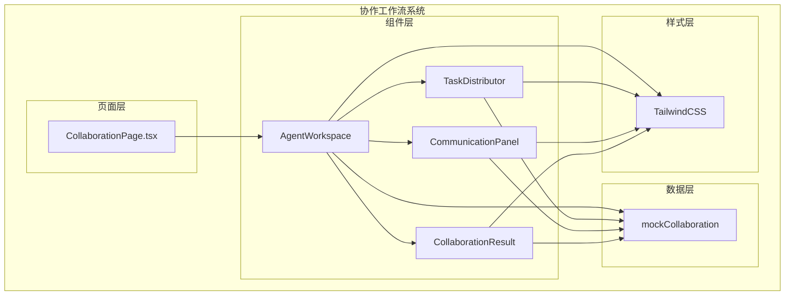
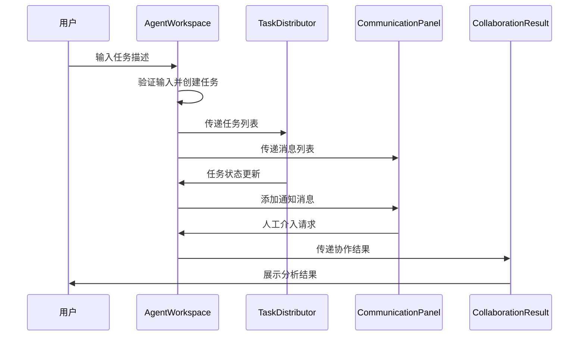
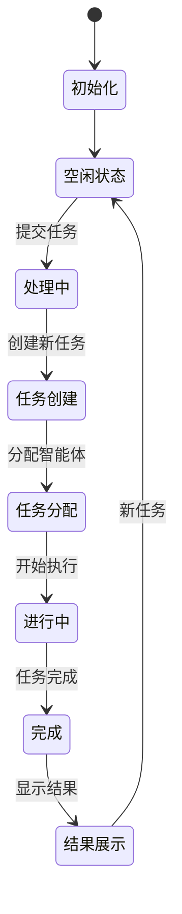
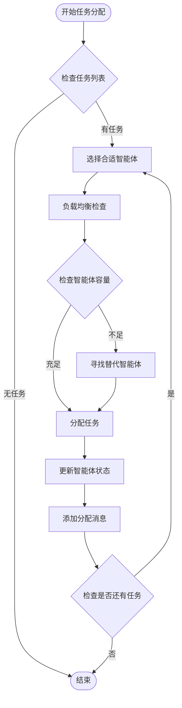
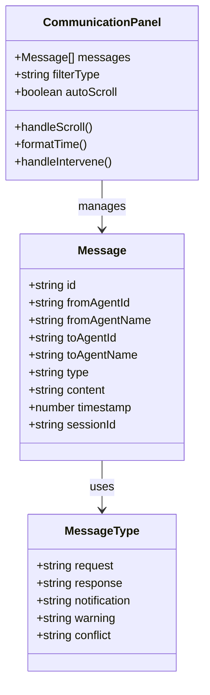
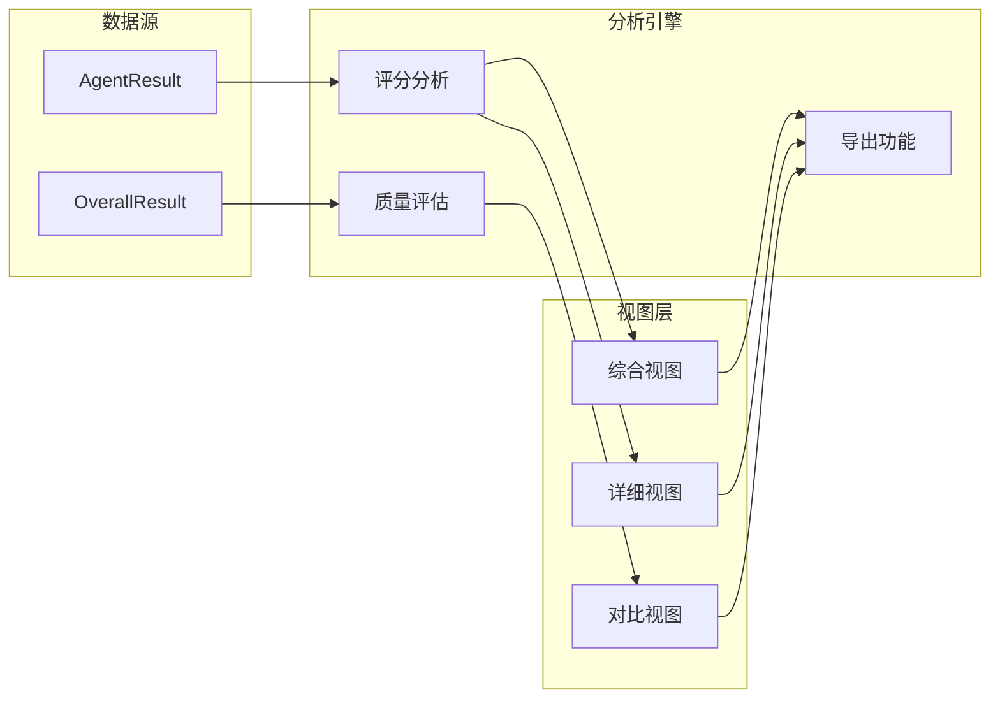
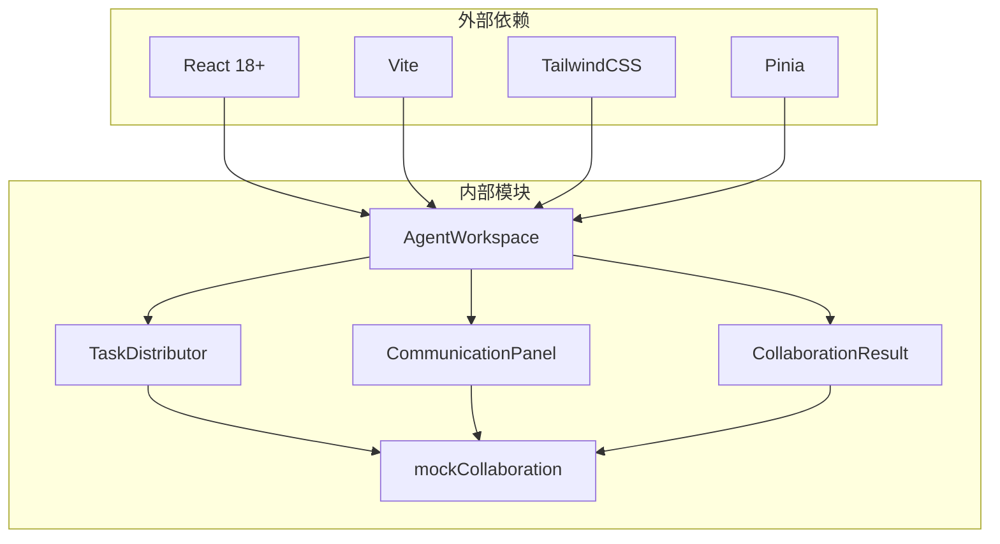

# 协作工作流系统

<cite>
**本文档引用的文件**
- [AgentWorkspace.tsx](file://apps/AgentPit/src-react-backup-20260410/components/collaboration/AgentWorkspace.tsx)
- [TaskDistributor.tsx](file://apps/AgentPit/src-react-backup-20260410/components/collaboration/TaskDistributor.tsx)
- [CommunicationPanel.tsx](file://apps/AgentPit/src-react-backup-20260410/components/collaboration/CommunicationPanel.tsx)
- [CollaborationResult.tsx](file://apps/AgentPit/src-react-backup-20260410/components/collaboration/CollaborationResult.tsx)
- [CollaborationPage.tsx](file://apps/AgentPit/src-react-backup-20260410/pages/CollaborationPage.tsx)
- [mockCollaboration.ts](file://apps/AgentPit/src/data/mockCollaboration.ts)
</cite>

## 目录
1. [简介](#简介)
2. [项目结构](#项目结构)
3. [核心组件](#核心组件)
4. [架构概览](#架构概览)
5. [详细组件分析](#详细组件分析)
6. [依赖关系分析](#依赖关系分析)
7. [性能考虑](#性能考虑)
8. [故障排除指南](#故障排除指南)
9. [结论](#结论)

## 简介

协作工作流系统是一个基于多智能体技术的分布式任务处理平台，旨在通过协调多个专业智能体实现高效的任务执行和结果生成。该系统采用React技术栈构建，提供了完整的协作工作流程管理能力。

系统的核心设计理念是"智能体即服务"，通过将复杂的任务分解为可并行执行的子任务，利用多个智能体的专业能力和互补特性，实现比单一智能体更优的处理效果。系统支持实时任务分配、智能体状态监控、通信协调和结果分析等功能。

## 项目结构

协作工作流系统主要位于AgentPit应用中，采用模块化设计，核心协作功能集中在`src-react-backup-20260410/components/collaboration`目录下：

**图表来源**
- [CollaborationPage.tsx:1-7](file://apps/AgentPit/src-react-backup-20260410/pages/CollaborationPage.tsx#L1-L7)
- [AgentWorkspace.tsx:1-15](file://apps/AgentPit/src-react-backup-20260410/components/collaboration/AgentWorkspace.tsx#L1-L15)

**章节来源**
- [CollaborationPage.tsx:1-7](file://apps/AgentPit/src-react-backup-20260410/pages/CollaborationPage.tsx#L1-L7)
- [AgentWorkspace.tsx:1-605](file://apps/AgentPit/src-react-backup-20260410/components/collaboration/AgentWorkspace.tsx#L1-L605)

## 核心组件

系统由四个核心组件构成，每个组件负责协作流程中的特定环节：

### AgentWorkspace（工作空间）
作为主控制器，负责协调各个子组件的工作，管理全局状态和用户交互。

### TaskDistributor（任务分发器）
实现智能体间任务分配和负载均衡的核心组件，支持多种视图模式和拖拽操作。

### CommunicationPanel（通信面板）
提供实时通信协调功能，支持消息过滤、冲突检测和人工介入机制。

### CollaborationResult（协作结果）
负责结果展示和数据分析，提供多种视图模式和导出功能。

**章节来源**
- [AgentWorkspace.tsx:18-171](file://apps/AgentPit/src-react-backup-20260410/components/collaboration/AgentWorkspace.tsx#L18-L171)
- [TaskDistributor.tsx:27-321](file://apps/AgentPit/src-react-backup-20260410/components/collaboration/TaskDistributor.tsx#L27-L321)
- [CommunicationPanel.tsx:18-257](file://apps/AgentPit/src-react-backup-20260410/components/collaboration/CommunicationPanel.tsx#L18-L257)
- [CollaborationResult.tsx:12-413](file://apps/AgentPit/src-react-backup-20260410/components/collaboration/CollaborationResult.tsx#L12-L413)

## 架构概览

系统采用事件驱动的架构模式，通过状态提升和回调函数实现组件间的解耦：

**图表来源**
- [AgentWorkspace.tsx:75-119](file://apps/AgentPit/src-react-backup-20260410/components/collaboration/AgentWorkspace.tsx#L75-L119)
- [TaskDistributor.tsx:121-155](file://apps/AgentPit/src-react-backup-20260410/components/collaboration/TaskDistributor.tsx#L121-L155)
- [CommunicationPanel.tsx:83-88](file://apps/AgentPit/src-react-backup-20260410/components/collaboration/CommunicationPanel.tsx#L83-L88)

系统采用以下设计原则：
- **单向数据流**：通过props向下传递，通过回调向上返回
- **状态集中管理**：在AgentWorkspace中维护全局状态
- **组件职责分离**：每个组件专注于特定功能领域
- **可扩展性**：通过接口定义和类型约束确保扩展性

## 详细组件分析

### AgentWorkspace 工作空间分析

AgentWorkspace是整个协作系统的核心控制器，负责协调各个子组件的工作。

#### 状态管理系统

**图表来源**
- [AgentWorkspace.tsx:37-73](file://apps/AgentPit/src-react-backup-20260410/components/collaboration/AgentWorkspace.tsx#L37-L73)
- [AgentWorkspace.tsx:121-155](file://apps/AgentPit/src-react-backup-20260410/components/collaboration/AgentWorkspace.tsx#L121-L155)

#### 多智能体并行协调机制

系统实现了智能体间的并行工作协调，通过以下机制实现：

1. **任务分解**：将复杂任务自动分解为子任务
2. **智能体选择**：根据任务类型推荐合适的智能体组合
3. **并行执行**：多个智能体同时处理不同子任务
4. **进度同步**：实时跟踪各智能体的执行进度

**章节来源**
- [AgentWorkspace.tsx:18-35](file://apps/AgentPit/src-react-backup-20260410/components/collaboration/AgentWorkspace.tsx#L18-L35)
- [AgentWorkspace.tsx:75-119](file://apps/AgentPit/src-react-backup-20260410/components/collaboration/AgentWorkspace.tsx#L75-L119)

### TaskDistributor 任务分发器分析

TaskDistributor是系统的核心调度组件，实现了智能的任务分配和负载均衡算法。

#### 任务分配算法

**图表来源**
- [TaskDistributor.tsx:138-155](file://apps/AgentPit/src-react-backup-20260410/components/collaboration/TaskDistributor.tsx#L138-L155)
- [AgentWorkspace.tsx:138-155](file://apps/AgentPit/src-react-backup-20260410/components/collaboration/AgentWorkspace.tsx#L138-L155)

#### 调度策略

系统采用动态优先级调度策略：

1. **优先级调度**：根据任务优先级分配给相应智能体
2. **负载均衡**：避免智能体过载，确保均匀分布
3. **能力匹配**：根据智能体专长分配相应任务
4. **实时调整**：根据执行情况动态调整分配

**章节来源**
- [TaskDistributor.tsx:27-321](file://apps/AgentPit/src-react-backup-20260410/components/collaboration/TaskDistributor.tsx#L27-L321)
- [TaskDistributor.tsx:46-69](file://apps/AgentPit/src-react-backup-20260410/components/collaboration/TaskDistributor.tsx#L46-L69)

### CommunicationPanel 通信面板分析

CommunicationPanel提供实时通信协调功能，支持多种消息类型和冲突处理机制。

#### 消息传递机制

**图表来源**
- [CommunicationPanel.tsx:5-8](file://apps/AgentPit/src-react-backup-20260410/components/collaboration/CommunicationPanel.tsx#L5-L8)
- [CommunicationPanel.tsx:10-16](file://apps/AgentPit/src-react-backup-20260410/components/collaboration/CommunicationPanel.tsx#L10-L16)

#### 实时通信协议

系统实现了基于WebSocket的消息传输协议：

1. **消息格式标准化**：统一的消息结构和字段定义
2. **类型化消息处理**：不同类型消息的专门处理逻辑
3. **冲突检测机制**：自动识别和标记智能体间的冲突
4. **人工介入通道**：提供管理员干预的接口

**章节来源**
- [CommunicationPanel.tsx:18-257](file://apps/AgentPit/src-react-backup-20260410/components/collaboration/CommunicationPanel.tsx#L18-L257)

### CollaborationResult 协作结果分析

CollaborationResult负责展示协作过程的结果和数据分析。

#### 数据展示架构

**图表来源**
- [CollaborationResult.tsx:12-413](file://apps/AgentPit/src-react-backup-20260410/components/collaboration/CollaborationResult.tsx#L12-L413)

#### 分析功能

系统提供多层次的结果分析：

1. **综合评分**：整体协作效果的量化评估
2. **智能体对比**：各智能体表现的横向比较
3. **质量指标**：完整性、准确性、创新性等维度分析
4. **可视化展示**：多种图表和统计信息的直观呈现

**章节来源**
- [CollaborationResult.tsx:12-413](file://apps/AgentPit/src-react-backup-20260410/components/collaboration/CollaborationResult.tsx#L12-L413)

## 依赖关系分析

系统采用模块化设计，各组件间存在清晰的依赖关系：

**图表来源**
- [AgentWorkspace.tsx:1-14](file://apps/AgentPit/src-react-backup-20260410/components/collaboration/AgentWorkspace.tsx#L1-L14)
- [TaskDistributor.tsx:1-3](file://apps/AgentPit/src-react-backup-20260410/components/collaboration/TaskDistributor.tsx#L1-L3)

**章节来源**
- [AgentWorkspace.tsx:1-14](file://apps/AgentPit/src-react-backup-20260410/components/collaboration/AgentWorkspace.tsx#L1-L14)
- [TaskDistributor.tsx:1-3](file://apps/AgentPit/src-react-backup-20260410/components/collaboration/TaskDistributor.tsx#L1-L3)

## 性能考虑

### 前端性能优化

1. **虚拟滚动**：对于大量消息和任务列表，使用虚拟滚动减少DOM节点数量
2. **状态优化**：使用React.memo和useMemo避免不必要的重渲染
3. **懒加载**：按需加载大型组件和图表库
4. **缓存策略**：合理使用浏览器缓存和内存缓存

### 任务调度优化

1. **批量处理**：合并多个状态更新操作
2. **防抖节流**：对高频操作进行防抖处理
3. **增量更新**：只更新发生变化的数据部分
4. **并发控制**：限制同时执行的任务数量

### 数据流优化

1. **状态提升**：将共享状态提升到最近的公共父组件
2. **单向数据流**：确保数据流向单一方向
3. **事件委托**：使用事件委托减少事件监听器数量
4. **内存泄漏防护**：及时清理定时器和事件监听器

## 故障排除指南

### 常见问题诊断

#### 组件渲染问题

**症状**：组件不显示或显示异常
**排查步骤**：
1. 检查props传递是否正确
2. 验证状态更新逻辑
3. 确认条件渲染逻辑
4. 检查CSS类名冲突

#### 任务分配异常

**症状**：任务无法正确分配给智能体
**排查步骤**：
1. 验证智能体状态检查逻辑
2. 检查任务优先级排序
3. 确认负载均衡算法
4. 验证拖拽事件处理

#### 通信中断

**症状**：消息无法正常发送或接收
**排查步骤**：
1. 检查网络连接状态
2. 验证消息格式验证
3. 确认冲突检测逻辑
4. 检查人工介入流程

### 调试工具使用

1. **React DevTools**：检查组件树和状态变化
2. **浏览器开发者工具**：监控网络请求和JavaScript错误
3. **日志系统**：添加详细的调试日志
4. **性能分析器**：识别性能瓶颈

### 错误处理策略

系统采用渐进式增强的错误处理策略：

1. **用户友好提示**：提供清晰的错误信息
2. **优雅降级**：在错误情况下保持基本功能
3. **自动恢复**：实现自动重试机制
4. **手动干预**：提供管理员手动修复接口

**章节来源**
- [AgentWorkspace.tsx:157-163](file://apps/AgentPit/src-react-backup-20260410/components/collaboration/AgentWorkspace.tsx#L157-L163)
- [TaskDistributor.tsx:56-69](file://apps/AgentPit/src-react-backup-20260410/components/collaboration/TaskDistributor.tsx#L56-L69)

## 结论

协作工作流系统通过精心设计的架构和组件实现了高效的多智能体协作。系统的主要优势包括：

1. **模块化设计**：清晰的组件职责分离和依赖关系
2. **实时协作**：完善的通信协调和状态同步机制
3. **智能调度**：基于算法的任务分配和负载均衡
4. **可视化展示**：丰富的数据分析和结果呈现
5. **可扩展性**：良好的架构设计支持功能扩展

未来可以进一步优化的方向包括：
- 实现真正的实时通信协议
- 增强智能体推荐算法
- 优化大数据量场景下的性能
- 扩展更多协作模式和工作流

该系统为多智能体协作提供了一个坚实的技术基础，能够有效提升复杂任务的处理效率和质量。