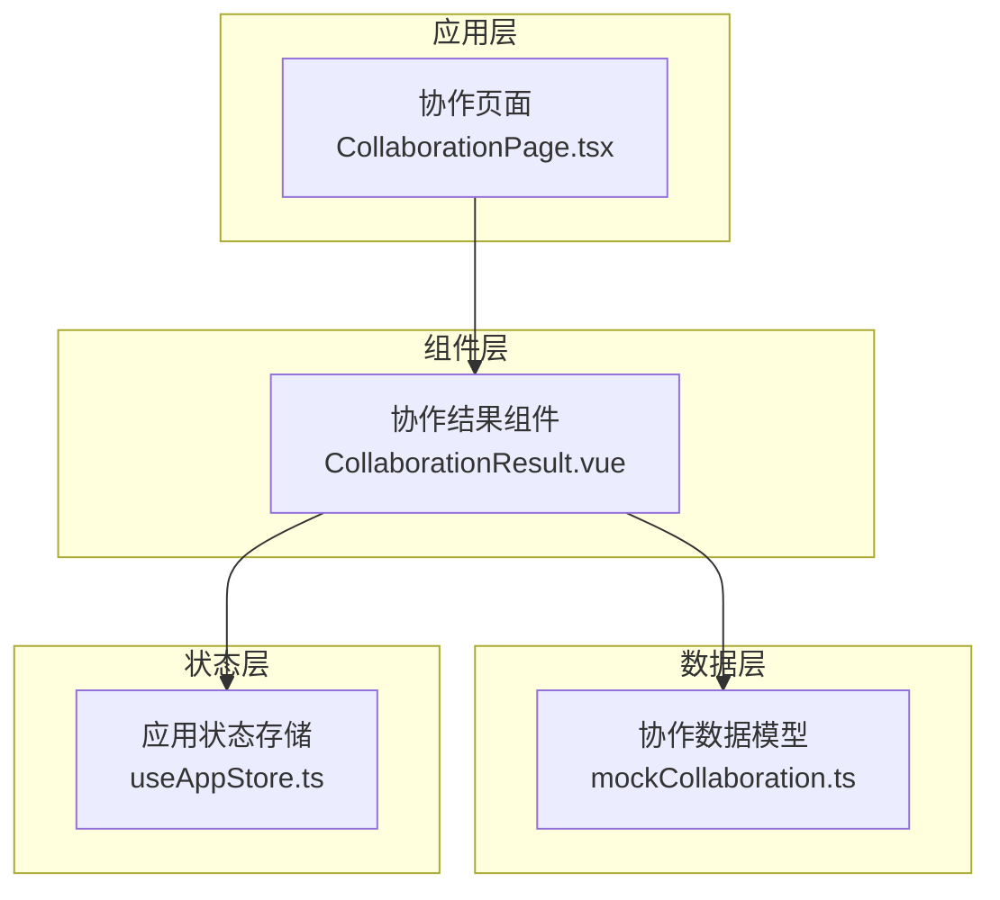
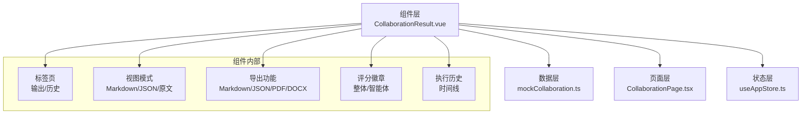
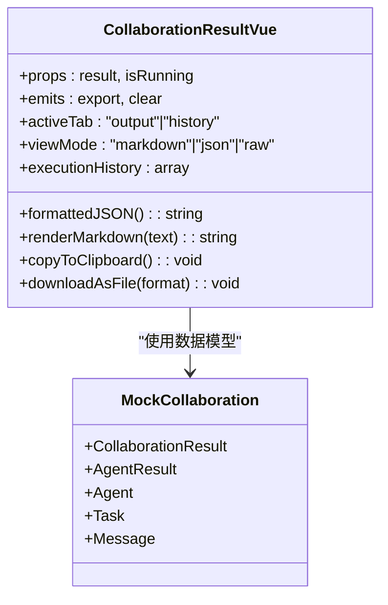
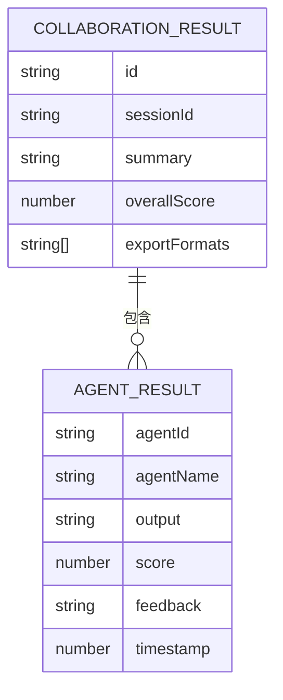
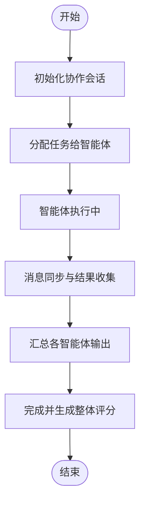
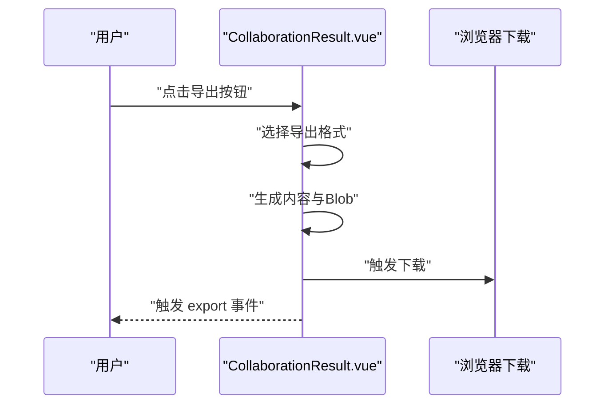
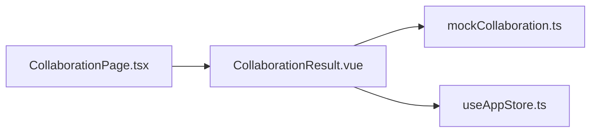

# 协作结果展示

<cite>
**本文引用的文件**
- [CollaborationResult.vue](file://apps/AgentPit/src/components/collaboration/CollaborationResult.vue)
- [mockCollaboration.ts](file://apps/AgentPit/src/data/mockCollaboration.ts)
- [CollaborationPage.tsx](file://apps/AgentPit/src-react-backup-20260410/pages/CollaborationPage.tsx)
- [useAppStore.ts](file://apps/AgentPit/src/stores/useAppStore.ts)
</cite>

## 目录
1. [简介](#简介)
2. [项目结构](#项目结构)
3. [核心组件](#核心组件)
4. [架构总览](#架构总览)
5. [详细组件分析](#详细组件分析)
6. [依赖关系分析](#依赖关系分析)
7. [性能考虑](#性能考虑)
8. [故障排查指南](#故障排查指南)
9. [结论](#结论)
10. [附录](#附录)

## 简介
本文件面向“协作结果展示系统”，聚焦 CollaborationResult 组件在数据可视化方面的实现，包括结果格式化、图表展示与交互、结果数据的采集与聚合、评分与质量评估、导出与分享、存档、性能优化与缓存策略、响应式设计、数据格式规范、API 接口与扩展开发指南，并提供用户体验与无障碍访问建议。

## 项目结构
协作结果展示位于 AgentPit 应用中，核心文件组织如下：
- 组件层：CollaborationResult.vue 负责结果展示与交互
- 数据层：mockCollaboration.ts 定义协作结果与相关数据模型
- 页面层：CollaborationPage.tsx 作为协作页面入口，承载工作区布局
- 状态层：useAppStore.ts 提供主题、加载状态等全局状态

**图示来源**
- [CollaborationPage.tsx:1-8](file://apps/AgentPit/src-react-backup-20260410/pages/CollaborationPage.tsx#L1-L8)
- [CollaborationResult.vue:1-436](file://apps/AgentPit/src/components/collaboration/CollaborationResult.vue#L1-L436)
- [mockCollaboration.ts:1-301](file://apps/AgentPit/src/data/mockCollaboration.ts#L1-L301)
- [useAppStore.ts:1-86](file://apps/AgentPit/src/stores/useAppStore.ts#L1-L86)

**章节来源**
- [CollaborationPage.tsx:1-8](file://apps/AgentPit/src-react-backup-20260410/pages/CollaborationPage.tsx#L1-L8)
- [CollaborationResult.vue:1-436](file://apps/AgentPit/src/components/collaboration/CollaborationResult.vue#L1-L436)
- [mockCollaboration.ts:1-301](file://apps/AgentPit/src/data/mockCollaboration.ts#L1-L301)
- [useAppStore.ts:1-86](file://apps/AgentPit/src/stores/useAppStore.ts#L1-L86)

## 核心组件
- CollaborationResult.vue
  - 功能：展示协作结果摘要、各智能体输出与评分、执行历史；支持 Markdown/JSON/原文三种视图模式；支持复制与导出（Markdown/JSON/PDF/DOCX）
  - 关键特性：评分徽章、标签页切换、历史时间线、响应式布局、深色/浅色主题适配
- mockCollaboration.ts
  - 功能：定义协作结果、智能体、任务、消息等数据模型与示例数据，支撑组件渲染与交互
- CollaborationPage.tsx
  - 功能：页面入口，承载协作工作区布局
- useAppStore.ts
  - 功能：提供主题切换、深色模式应用、侧边栏状态等全局状态

**章节来源**
- [CollaborationResult.vue:1-436](file://apps/AgentPit/src/components/collaboration/CollaborationResult.vue#L1-L436)
- [mockCollaboration.ts:1-301](file://apps/AgentPit/src/data/mockCollaboration.ts#L1-L301)
- [CollaborationPage.tsx:1-8](file://apps/AgentPit/src-react-backup-20260410/pages/CollaborationPage.tsx#L1-L8)
- [useAppStore.ts:1-86](file://apps/AgentPit/src/stores/useAppStore.ts#L1-L86)

## 架构总览
协作结果展示采用“组件-数据-页面-状态”分层架构：
- 组件层负责 UI 与交互
- 数据层提供模型与示例数据
- 页面层组织布局与路由
- 状态层管理主题与全局行为

**图示来源**
- [CollaborationResult.vue:1-436](file://apps/AgentPit/src/components/collaboration/CollaborationResult.vue#L1-L436)
- [mockCollaboration.ts:1-301](file://apps/AgentPit/src/data/mockCollaboration.ts#L1-L301)
- [CollaborationPage.tsx:1-8](file://apps/AgentPit/src-react-backup-20260410/pages/CollaborationPage.tsx#L1-L8)
- [useAppStore.ts:1-86](file://apps/AgentPit/src/stores/useAppStore.ts#L1-L86)

## 详细组件分析

### CollaborationResult 组件
- 数据结构与格式化
  - 结果数据结构：包含会话 ID、摘要文本、各智能体输出与评分、整体评分、导出格式列表
  - JSON 格式化：提供格式化后的 JSON 字符串用于 JSON 视图
  - Markdown 渲染：使用正则替换实现标题、粗体、代码块、列表等基础渲染
- 视图与交互
  - 标签页：输出结果与执行历史
  - 视图模式：Markdown、JSON、原文三选一
  - 智能体贡献卡片：展示名称、评分徽章、简要输出与反馈
  - 执行历史：时间线样式，按状态着色与图标标识
- 导出与分享
  - 支持导出为 Markdown 与 JSON；PDF/DOCX 提示需后端支持
  - 复制到剪贴板：复制格式化 JSON
- 性能与可用性
  - 加载态与空态：运行中与无结果时的占位提示
  - 响应式布局：自适应容器尺寸与滚动区域
  - 深色/浅色主题：基于全局状态自动切换

**图示来源**
- [CollaborationResult.vue:1-436](file://apps/AgentPit/src/components/collaboration/CollaborationResult.vue#L1-L436)
- [mockCollaboration.ts:1-301](file://apps/AgentPit/src/data/mockCollaboration.ts#L1-L301)

**章节来源**
- [CollaborationResult.vue:1-436](file://apps/AgentPit/src/components/collaboration/CollaborationResult.vue#L1-L436)
- [mockCollaboration.ts:1-301](file://apps/AgentPit/src/data/mockCollaboration.ts#L1-L301)

### 数据模型与数据流
- 数据模型
  - CollaborationResult：结果主对象，包含摘要、智能体结果数组、整体评分、导出格式
  - AgentResult：单个智能体输出、评分、反馈与时间戳
  - Agent/Task/Message：协作生态中的角色、任务与通信数据（用于历史与上下文）
- 数据流
  - 组件接收外部传入的结果或回退到内置示例数据
  - 历史数据为静态示例，便于演示执行过程

**图示来源**
- [mockCollaboration.ts:48-64](file://apps/AgentPit/src/data/mockCollaboration.ts#L48-L64)

**章节来源**
- [mockCollaboration.ts:1-301](file://apps/AgentPit/src/data/mockCollaboration.ts#L1-L301)

### 执行历史与评分系统
- 执行历史
  - 静态示例：包含启动、分配、执行中、消息同步、结果汇总、完成等关键节点
  - 时间线：状态颜色与图标区分不同阶段
- 评分系统
  - 整体评分：根据各智能体输出质量综合计算
  - 智能体评分：每个智能体独立评分，用于贡献卡片展示

**图示来源**
- [CollaborationResult.vue:181-224](file://apps/AgentPit/src/components/collaboration/CollaborationResult.vue#L181-L224)

**章节来源**
- [CollaborationResult.vue:181-224](file://apps/AgentPit/src/components/collaboration/CollaborationResult.vue#L181-L224)

### 导出、分享与存档
- 导出
  - 支持格式：Markdown、JSON；PDF/DOCX 提示需后端支持
  - 行为：生成 Blob 并触发浏览器下载，同时触发 export 事件
- 复制
  - 复制格式化 JSON 到剪贴板
- 存档
  - 当前实现为内存态；建议结合后端 API 实现持久化存档

**图示来源**
- [CollaborationResult.vue:142-179](file://apps/AgentPit/src/components/collaboration/CollaborationResult.vue#L142-L179)

**章节来源**
- [CollaborationResult.vue:142-179](file://apps/AgentPit/src/components/collaboration/CollaborationResult.vue#L142-L179)

## 依赖关系分析
- 组件依赖
  - CollaborationResult.vue 依赖 mockCollaboration.ts 的数据模型
  - 页面层 CollaborationPage.tsx 作为入口承载组件
  - 状态层 useAppStore.ts 提供主题与全局状态
- 外部依赖
  - Vue 生态（组合式 API、模板语法）
  - 浏览器原生 Clipboard API、Blob 下载

**图示来源**
- [CollaborationResult.vue:1-436](file://apps/AgentPit/src/components/collaboration/CollaborationResult.vue#L1-L436)
- [mockCollaboration.ts:1-301](file://apps/AgentPit/src/data/mockCollaboration.ts#L1-L301)
- [CollaborationPage.tsx:1-8](file://apps/AgentPit/src-react-backup-20260410/pages/CollaborationPage.tsx#L1-L8)
- [useAppStore.ts:1-86](file://apps/AgentPit/src/stores/useAppStore.ts#L1-L86)

**章节来源**
- [CollaborationResult.vue:1-436](file://apps/AgentPit/src/components/collaboration/CollaborationResult.vue#L1-L436)
- [mockCollaboration.ts:1-301](file://apps/AgentPit/src/data/mockCollaboration.ts#L1-L301)
- [CollaborationPage.tsx:1-8](file://apps/AgentPit/src-react-backup-20260410/pages/CollaborationPage.tsx#L1-L8)
- [useAppStore.ts:1-86](file://apps/AgentPit/src/stores/useAppStore.ts#L1-L86)

## 性能考虑
- 渲染优化
  - Markdown 渲染采用正则替换，建议在大数据量时引入轻量渲染库或虚拟滚动
  - JSON 视图与原文视图避免不必要的重排，保持 DOM 结构稳定
- 内存与计算
  - formattedJSON 使用字符串化，建议在 props 不变时缓存结果
  - 历史数据为静态示例，无需额外计算
- 导出性能
  - Blob 生成与下载在大文本场景下可能占用内存，建议分块或流式处理（需后端配合）

[本节为通用性能建议，不直接分析具体文件]

## 故障排查指南
- 导出 PDF/DOCX 失败
  - 现状：提示需后端支持
  - 建议：实现后端转换服务或集成第三方库
- 复制失败
  - 现象：写入剪贴板异常
  - 建议：检查 HTTPS 环境与权限，捕获错误并提示用户
- 主题切换无效
  - 现象：深色/浅色切换不生效
  - 建议：确认 useAppStore.applyTheme 是否正确设置 HTML 属性与类名

**章节来源**
- [CollaborationResult.vue:133-140](file://apps/AgentPit/src/components/collaboration/CollaborationResult.vue#L133-L140)
- [useAppStore.ts:60-69](file://apps/AgentPit/src/stores/useAppStore.ts#L60-L69)

## 结论
CollaborationResult 组件以简洁的 UI 与交互实现了协作结果的可视化展示，具备评分徽章、历史时间线、多视图模式与导出能力。当前实现以示例数据为主，建议后续对接真实后端 API，完善 PDF/DOCX 导出、结果存档与性能优化，进一步提升可用性与可扩展性。

[本节为总结性内容，不直接分析具体文件]

## 附录

### 数据格式规范
- 协作结果对象
  - 字段：id、sessionId、summary、agentResults、overallScore、exportFormats
  - 示例参考：[mockCollaboration.ts:48-55](file://apps/AgentPit/src/data/mockCollaboration.ts#L48-L55)
- 智能体结果对象
  - 字段：agentId、agentName、output、score、feedback、timestamp
  - 示例参考：[mockCollaboration.ts:57-64](file://apps/AgentPit/src/data/mockCollaboration.ts#L57-L64)

**章节来源**
- [mockCollaboration.ts:48-64](file://apps/AgentPit/src/data/mockCollaboration.ts#L48-L64)

### API 接口与扩展开发指南
- 接口建议
  - 获取协作结果：GET /api/collaboration/results/{sessionId}
  - 导出结果：POST /api/collaboration/results/{sessionId}/export
  - 存档结果：POST /api/collaboration/results/{sessionId}/archive
- 扩展点
  - 图表展示：引入可视化库（如轻量图表库）展示评分分布与趋势
  - 交互增强：支持筛选、排序、搜索与批量导出
  - 质量评估：增加置信度、一致性评分等指标

[本节为概念性建议，不直接分析具体文件]

### 用户体验与无障碍访问
- 无障碍
  - 为按钮与链接提供语义化标签与键盘导航
  - 确保对比度满足 WCAG 要求，深色模式下保持可读性
- 交互
  - 明确的状态提示与加载反馈
  - 提供撤销与重试机制（如复制失败时的重试按钮）

[本节为通用建议，不直接分析具体文件]