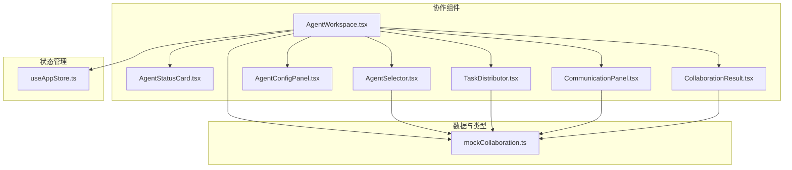
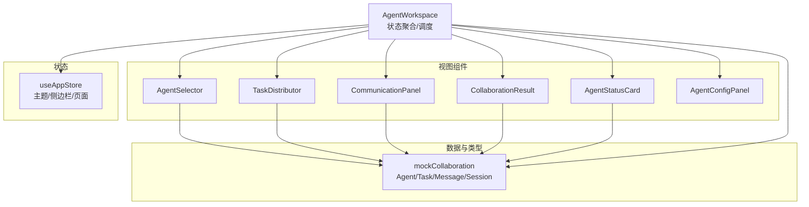
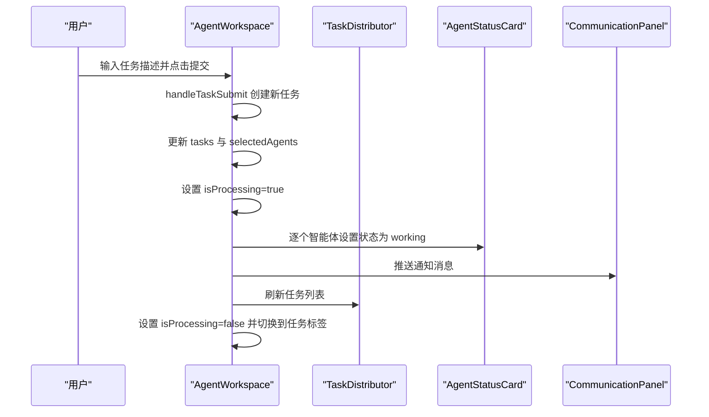
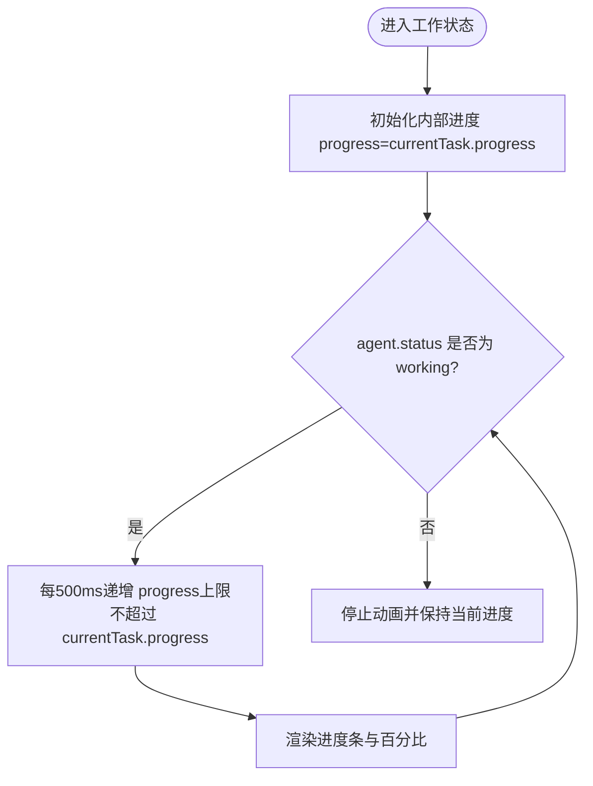
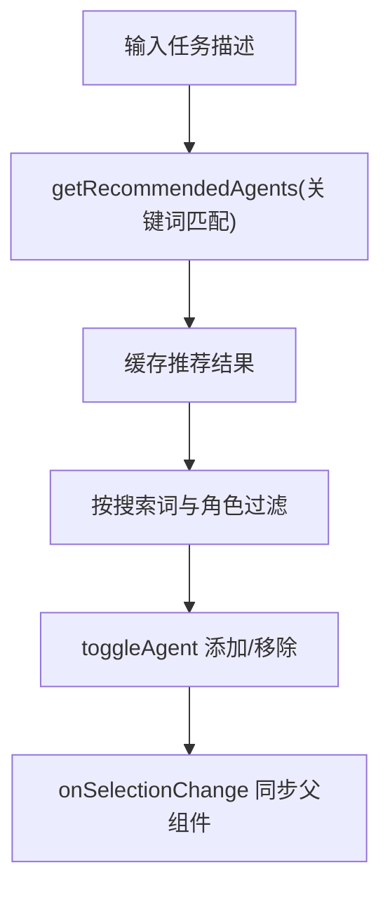
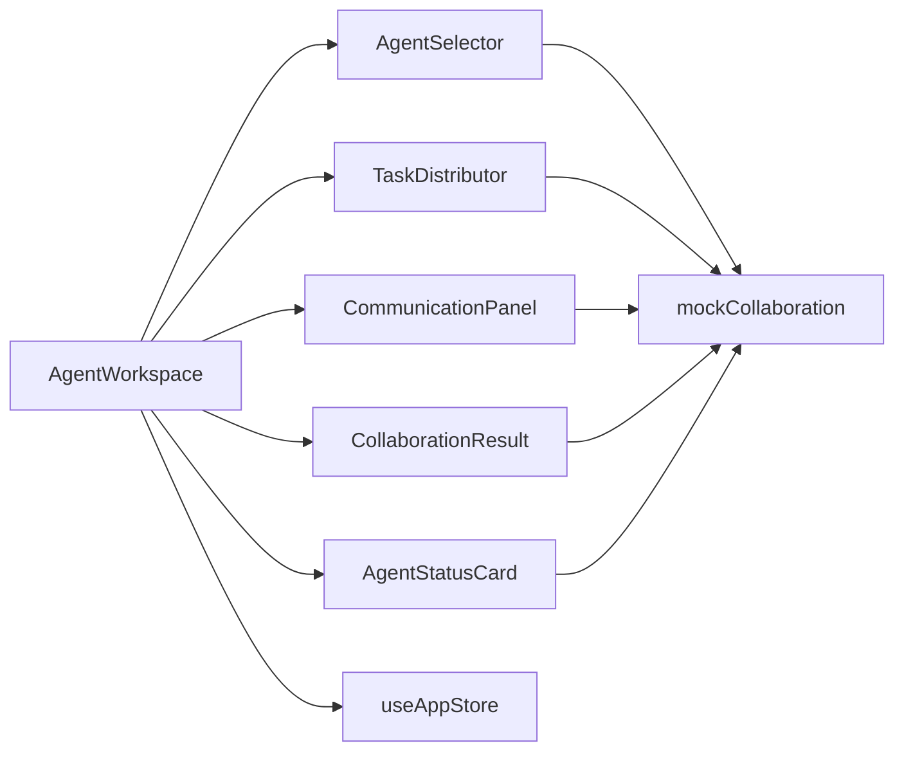

# 智能体工作空间

<cite>
**本文引用的文件**
- [AgentWorkspace.tsx](file://apps/AgentPit/src-react-backup-20260410/components/collaboration/AgentWorkspace.tsx)
- [AgentStatusCard.tsx](file://apps/AgentPit/src-react-backup-20260410/components/collaboration/AgentStatusCard.tsx)
- [AgentSelector.tsx](file://apps/AgentPit/src-react-backup-20260410/components/collaboration/AgentSelector.tsx)
- [AgentConfigPanel.tsx](file://apps/AgentPit/src-react-backup-20260410/components/collaboration/AgentConfigPanel.tsx)
- [TaskDistributor.tsx](file://apps/AgentPit/src-react-backup-20260410/components/collaboration/TaskDistributor.tsx)
- [CommunicationPanel.tsx](file://apps/AgentPit/src-react-backup-20260410/components/collaboration/CommunicationPanel.tsx)
- [CollaborationResult.tsx](file://apps/AgentPit/src-react-backup-20260410/components/collaboration/CollaborationResult.tsx)
- [mockCollaboration.ts](file://apps/AgentPit/src/data/mockCollaboration.ts)
- [useAppStore.ts](file://apps/AgentPit/src/stores/useAppStore.ts)
</cite>

## 目录
1. [简介](#简介)
2. [项目结构](#项目结构)
3. [核心组件](#核心组件)
4. [架构总览](#架构总览)
5. [详细组件分析](#详细组件分析)
6. [依赖关系分析](#依赖关系分析)
7. [性能考虑](#性能考虑)
8. [故障排查指南](#故障排查指南)
9. [结论](#结论)
10. [附录](#附录)

## 简介
本文件为“智能体工作空间”提供系统化技术文档，围绕 AgentWorkspace 主组件及其协作生态展开，重点覆盖：
- 多标签页切换机制与状态管理
- AgentStatusCard 智能体状态卡片的实现原理（状态显示、进度跟踪、交互逻辑）
- AgentSelector 智能体选择器的功能特性（多选机制、智能体推荐算法、选择状态管理）
- 工作空间的数据流控制与组件间协作
- 性能优化策略、内存管理与用户体验优化建议
- 实际代码示例与最佳实践指南

## 项目结构
智能体工作空间位于 AgentPit 应用的协作模块中，采用按功能分层的组织方式：
- 组件层：AgentWorkspace、AgentStatusCard、AgentSelector、AgentConfigPanel、TaskDistributor、CommunicationPanel、CollaborationResult
- 数据层：mockCollaboration 提供智能体、任务、消息、会话与推荐规则
- 状态层：Pinia Store useAppStore 管理全局主题、侧边栏与页面状态

图表来源
- [AgentWorkspace.tsx:18-605](file://apps/AgentPit/src-react-backup-20260410/components/collaboration/AgentWorkspace.tsx#L18-L605)
- [AgentSelector.tsx:21-305](file://apps/AgentPit/src-react-backup-20260410/components/collaboration/AgentSelector.tsx#L21-L305)
- [TaskDistributor.tsx:27-516](file://apps/AgentPit/src-react-backup-20260410/components/collaboration/TaskDistributor.tsx#L27-L516)
- [CommunicationPanel.tsx:18-257](file://apps/AgentPit/src-react-backup-20260410/components/collaboration/CommunicationPanel.tsx#L18-L257)
- [CollaborationResult.tsx:12-413](file://apps/AgentPit/src-react-backup-20260410/components/collaboration/CollaborationResult.tsx#L12-L413)
- [mockCollaboration.ts:1-301](file://apps/AgentPit/src/data/mockCollaboration.ts#L1-L301)
- [useAppStore.ts:11-86](file://apps/AgentPit/src/stores/useAppStore.ts#L11-L86)

章节来源
- [AgentWorkspace.tsx:18-605](file://apps/AgentPit/src-react-backup-20260410/components/collaboration/AgentWorkspace.tsx#L18-L605)
- [mockCollaboration.ts:1-301](file://apps/AgentPit/src/data/mockCollaboration.ts#L1-L301)
- [useAppStore.ts:11-86](file://apps/AgentPit/src/stores/useAppStore.ts#L11-L86)

## 核心组件
- AgentWorkspace：工作空间主容器，负责多标签页导航、任务提交与状态推进、智能体状态映射、消息与会话管理、结果展示与配置面板集成。
- AgentStatusCard：单个智能体的状态卡片，展示状态徽标、当前任务、进度条、统计指标，并提供暂停/停止/重分配等交互入口。
- AgentSelector：智能体选择器，支持搜索、筛选、一键推荐、多选与清空，维护选择状态并与父组件同步。
- AgentConfigPanel：智能体配置面板，提供基础信息、能力设置、行为配置、工具权限等多标签页配置。
- TaskDistributor：任务分配与进度管理，支持树状/时间线/队列三种视图，拖拽分配、状态变更与详情面板联动。
- CommunicationPanel：通信协调面板，过滤消息类型、自动滚动、冲突检测与人工介入按钮。
- CollaborationResult：协作结果汇总，支持综合/对比/详细三种视图，评分与导出功能。

章节来源
- [AgentWorkspace.tsx:18-605](file://apps/AgentPit/src-react-backup-20260410/components/collaboration/AgentWorkspace.tsx#L18-L605)
- [AgentStatusCard.tsx:24-173](file://apps/AgentPit/src-react-backup-20260410/components/collaboration/AgentStatusCard.tsx#L24-L173)
- [AgentSelector.tsx:21-305](file://apps/AgentPit/src-react-backup-20260410/components/collaboration/AgentSelector.tsx#L21-L305)
- [AgentConfigPanel.tsx:31-421](file://apps/AgentPit/src-react-backup-20260410/components/collaboration/AgentConfigPanel.tsx#L31-L421)
- [TaskDistributor.tsx:27-516](file://apps/AgentPit/src-react-backup-20260410/components/collaboration/TaskDistributor.tsx#L27-L516)
- [CommunicationPanel.tsx:18-257](file://apps/AgentPit/src-react-backup-20260410/components/collaboration/CommunicationPanel.tsx#L18-L257)
- [CollaborationResult.tsx:12-413](file://apps/AgentPit/src-react-backup-20260410/components/collaboration/CollaborationResult.tsx#L12-L413)

## 架构总览
工作空间采用“主容器 + 子组件 + 数据/类型 + 状态”的分层架构：
- 主容器负责状态聚合与调度，子组件专注各自视图与交互
- 数据层提供类型定义与模拟数据，支撑 UI 展示与交互
- 状态层统一管理主题、侧边栏与页面状态，保证跨页面一致性

图表来源
- [AgentWorkspace.tsx:18-605](file://apps/AgentPit/src-react-backup-20260410/components/collaboration/AgentWorkspace.tsx#L18-L605)
- [mockCollaboration.ts:1-301](file://apps/AgentPit/src/data/mockCollaboration.ts#L1-L301)
- [useAppStore.ts:11-86](file://apps/AgentPit/src/stores/useAppStore.ts#L11-L86)

## 详细组件分析

### AgentWorkspace：多标签页与状态管理
- 多标签页切换
  - 使用受控状态 activeTab 控制当前激活标签页，tabs 数组定义标签项与图标计数
  - 切换时根据 id 渲染对应视图区域（工作台、智能体、任务、通信、结果）
- 状态管理
  - 任务状态：tasks、messages、sessions、currentResult、isProcessing
  - 智能体状态：agentStatuses 记录每个智能体的工作状态
  - 用户交互：taskInput、selectedAgents、showAdvancedOptions、configuringAgent
- 数据流控制
  - 任务提交：handleTaskSubmit 创建新任务，更新 tasks 并触发智能体状态变化与消息推送
  - 任务更新：handleTaskUpdate 支持任务与子任务的统一更新
  - 任务分配：handleTaskAssign 将任务分配给智能体并更新状态与消息
  - 人工干预：handleIntervene 触发人工介入流程
  - 反馈收集：handleFeedback 接收智能体反馈与评分
- 进度推进
  - 使用定时器周期性推进 in_progress 任务与子任务的进度，达到阈值自动完成并记录结束时间
- 高级选项
  - showAdvancedOptions 控制高级配置面板显隐，包含优先级、截止时间、输出格式、自动分解与推荐开关等

图表来源
- [AgentWorkspace.tsx:75-119](file://apps/AgentPit/src-react-backup-20260410/components/collaboration/AgentWorkspace.tsx#L75-L119)
- [AgentWorkspace.tsx:121-155](file://apps/AgentPit/src-react-backup-20260410/components/collaboration/AgentWorkspace.tsx#L121-L155)

章节来源
- [AgentWorkspace.tsx:18-605](file://apps/AgentPit/src-react-backup-20260410/components/collaboration/AgentWorkspace.tsx#L18-L605)

### AgentStatusCard：状态显示、进度跟踪与交互
- 状态显示
  - 根据 agent.status 映射颜色与文本，支持 online/busy/offline/idle/working/waiting/error
  - 状态徽标随工作状态脉冲动画增强视觉反馈
- 进度跟踪
  - 当状态为 working 时，基于 currentTask.progress 动态推进内部 progress，带动画效果
  - 进度条宽度随 progress 变化，百分比实时显示
- 交互逻辑
  - 支持暂停/停止/重分配按钮回调（onPause/onStop/onReassign），阻止事件冒泡避免误触卡片选择
  - 支持卡片点击触发外部 onSelect 回调（用于多选场景）

图表来源
- [AgentStatusCard.tsx:36-49](file://apps/AgentPit/src-react-backup-20260410/components/collaboration/AgentStatusCard.tsx#L36-L49)
- [AgentStatusCard.tsx:92-107](file://apps/AgentPit/src-react-backup-20260410/components/collaboration/AgentStatusCard.tsx#L92-L107)

章节来源
- [AgentStatusCard.tsx:24-173](file://apps/AgentPit/src-react-backup-20260410/components/collaboration/AgentStatusCard.tsx#L24-L173)

### AgentSelector：多选机制、推荐算法与状态管理
- 多选机制
  - selectedAgents 作为受控数组，toggleAgent 实现添加/移除
  - 清空按钮一键清空选择，支持一键选择推荐
- 搜索与筛选
  - 支持按名称、专长、技能关键词搜索
  - 按角色过滤，生成唯一角色集合
- 智能体推荐
  - 基于任务描述中的关键词匹配 taskTypeRecommendations，返回推荐智能体 ID 列表
  - 使用 useMemo 缓存推荐结果，仅在任务描述变化时重新计算
- 选择状态管理
  - 卡片点击切换选中态，推荐但未选中的卡片显示星标徽章
  - 已选智能体团队以标签形式展示，支持一键移除

图表来源
- [AgentSelector.tsx:25-68](file://apps/AgentPit/src-react-backup-20260410/components/collaboration/AgentSelector.tsx#L25-L68)
- [mockCollaboration.ts:292-300](file://apps/AgentPit/src/data/mockCollaboration.ts#L292-L300)

章节来源
- [AgentSelector.tsx:21-305](file://apps/AgentPit/src-react-backup-20260410/components/collaboration/AgentSelector.tsx#L21-L305)
- [mockCollaboration.ts:281-300](file://apps/AgentPit/src/data/mockCollaboration.ts#L281-L300)

### AgentConfigPanel：配置面板与多标签页
- 多标签页
  - basic/ability/behavior/tools 四个标签页，分别管理基本信息、能力标签、行为配置、工具权限
- 能力设置
  - 技能标签增删、专业领域勾选
- 行为配置
  - 响应风格（正式/友好/幽默）、输出详细度（简洁/标准/详尽）
- 工具权限
  - 工具集合勾选，支持批量保存为预设
- 交互
  - 保存配置并关闭面板，或取消关闭

章节来源
- [AgentConfigPanel.tsx:31-421](file://apps/AgentPit/src-react-backup-20260410/components/collaboration/AgentConfigPanel.tsx#L31-L421)

### TaskDistributor：任务分配与进度管理
- 视图模式
  - tree（树状）、timeline（时间线）、queue（队列）三种视图
- 拖拽分配
  - 支持将任务从树状视图拖拽至队列视图目标智能体，触发 onTaskAssign
- 状态变更
  - 支持开始执行、暂停、恢复、标记完成、取消等操作
- 详情面板
  - 选择任务后展示标题、描述、状态、优先级、进度、分配对象、依赖关系与操作按钮

章节来源
- [TaskDistributor.tsx:27-516](file://apps/AgentPit/src-react-backup-20260410/components/collaboration/TaskDistributor.tsx#L27-L516)

### CommunicationPanel：通信协调与冲突处理
- 消息过滤
  - 支持 request/response/notification/warning/conflict 类型过滤
- 自动滚动
  - 根据滚动位置决定是否自动滚动到底部
- 冲突检测
  - 检测 conflict 类型消息并高亮提示，提供人工介入按钮
- 交互
  - hover 显示“介入”按钮，点击触发 onIntervene 回调

章节来源
- [CommunicationPanel.tsx:18-257](file://apps/AgentPit/src-react-backup-20260410/components/collaboration/CommunicationPanel.tsx#L18-L257)

### CollaborationResult：结果汇总与导出
- 视图模式
  - combined（综合摘要/评分/质量指标/合并输出）、compare（对比视图）、detail（详细视图）
- 导出功能
  - 支持 markdown/json/txt 三种格式导出
- 评分与标签
  - 根据分数映射颜色与等级标签，直观展示质量水平
- 反馈收集
  - 详细视图支持评分与反馈意见提交

章节来源
- [CollaborationResult.tsx:12-413](file://apps/AgentPit/src-react-backup-20260410/components/collaboration/CollaborationResult.tsx#L12-L413)

## 依赖关系分析
- 组件耦合
  - AgentWorkspace 作为中枢，依赖所有子组件；子组件之间低耦合，通过 props 与回调交互
- 数据依赖
  - 所有组件依赖 mockCollaboration 的类型与数据，确保一致的结构与默认值
- 状态依赖
  - useAppStore 提供主题与侧边栏状态，影响全局样式与布局
- 外部依赖
  - 使用 Pinia 管理全局状态，React Hooks 管理局部状态与副作用

图表来源
- [AgentWorkspace.tsx:18-605](file://apps/AgentPit/src-react-backup-20260410/components/collaboration/AgentWorkspace.tsx#L18-L605)
- [mockCollaboration.ts:1-301](file://apps/AgentPit/src/data/mockCollaboration.ts#L1-L301)
- [useAppStore.ts:11-86](file://apps/AgentPit/src/stores/useAppStore.ts#L11-L86)

章节来源
- [AgentWorkspace.tsx:18-605](file://apps/AgentPit/src-react-backup-20260410/components/collaboration/AgentWorkspace.tsx#L18-L605)
- [mockCollaboration.ts:1-301](file://apps/AgentPit/src/data/mockCollaboration.ts#L1-L301)
- [useAppStore.ts:11-86](file://apps/AgentPit/src/stores/useAppStore.ts#L11-L86)

## 性能考虑
- 状态与渲染优化
  - 使用 useMemo 缓存推荐结果与过滤后的智能体列表，减少重复计算
  - 使用 useCallback 包裹回调函数，避免子组件不必要的重渲染
  - 对长列表使用虚拟滚动或分页（当前实现为固定高度容器与自定义滚动条）
- 动画与定时器
  - 状态卡片进度动画与心跳定时器应在组件卸载时清理，避免内存泄漏
  - 任务进度推进定时器在 AgentWorkspace 中已正确清理
- 数据更新策略
  - 使用不可变更新（如 map/filter/spread）确保 React 能正确识别变更
  - 大量消息与任务时，建议分页加载与懒渲染
- 交互性能
  - 拖拽分配使用原生 HTML5 drag/drop，注意在大任务集下可能的性能瓶颈
  - 滚动容器监听滚动事件时，建议节流或防抖

章节来源
- [AgentSelector.tsx:25-68](file://apps/AgentPit/src-react-backup-20260410/components/collaboration/AgentSelector.tsx#L25-L68)
- [AgentWorkspace.tsx:37-73](file://apps/AgentPit/src-react-backup-20260410/components/collaboration/AgentWorkspace.tsx#L37-L73)
- [TaskDistributor.tsx:46-69](file://apps/AgentPit/src-react-backup-20260410/components/collaboration/TaskDistributor.tsx#L46-L69)

## 故障排查指南
- 任务无法推进
  - 检查定时器是否正常运行与清理
  - 确认任务状态为 in_progress 且存在 subtasks 时的子任务推进逻辑
- 智能体状态不更新
  - 确认 agentStatuses 映射是否正确，以及 handleTaskAssign 是否触发
- 消息不显示或不滚动
  - 检查 autoScroll 逻辑与容器滚动事件监听
  - 确认消息数组长度变化是否触发重渲染
- 推荐算法无效
  - 检查任务描述关键词是否命中 taskTypeRecommendations
  - 确认推荐结果去重与缓存逻辑

章节来源
- [AgentWorkspace.tsx:37-73](file://apps/AgentPit/src-react-backup-20260410/components/collaboration/AgentWorkspace.tsx#L37-L73)
- [CommunicationPanel.tsx:30-41](file://apps/AgentPit/src-react-backup-20260410/components/collaboration/CommunicationPanel.tsx#L30-L41)
- [mockCollaboration.ts:292-300](file://apps/AgentPit/src/data/mockCollaboration.ts#L292-L300)

## 结论
智能体工作空间通过清晰的组件分层与数据/状态分离，实现了多智能体协作的可视化编排与管理。AgentWorkspace 作为中枢，结合 AgentStatusCard 的状态反馈、AgentSelector 的智能推荐与多选、TaskDistributor 的任务分配与进度、CommunicationPanel 的通信协调与冲突处理、CollaborationResult 的结果汇总与导出，形成了完整的协作闭环。建议在后续迭代中引入更完善的性能监控与优化策略，进一步提升大规模任务与消息场景下的稳定性与用户体验。

## 附录
- 最佳实践
  - 使用 useMemo/useCallback 缓存昂贵计算与回调
  - 在组件卸载时清理定时器与事件监听
  - 对长列表使用虚拟滚动或分页
  - 为关键交互提供无障碍与键盘导航支持
  - 使用 TypeScript 严格类型约束，确保数据一致性