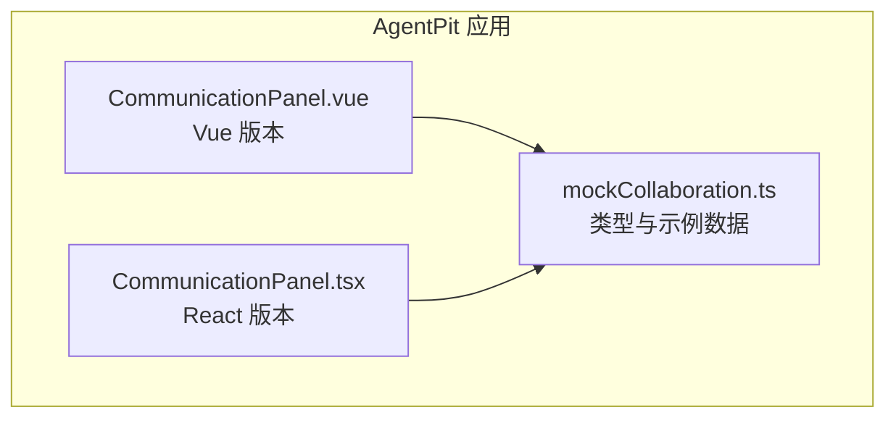
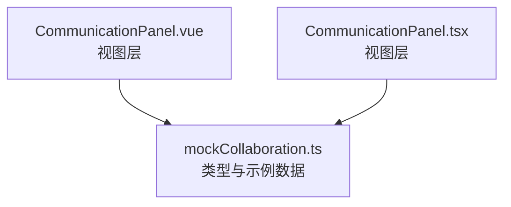
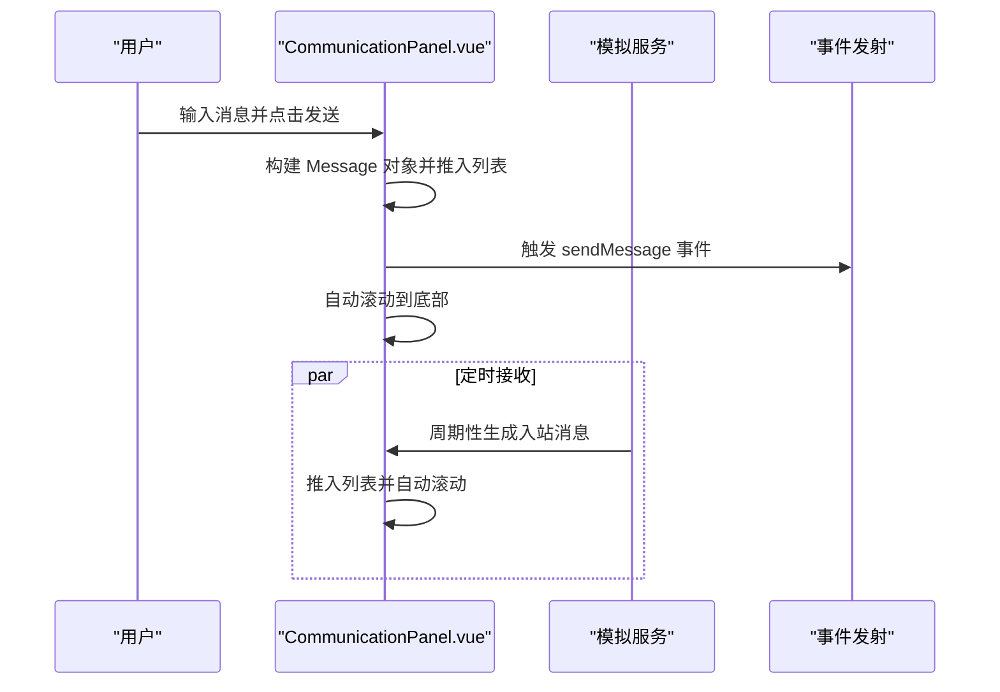
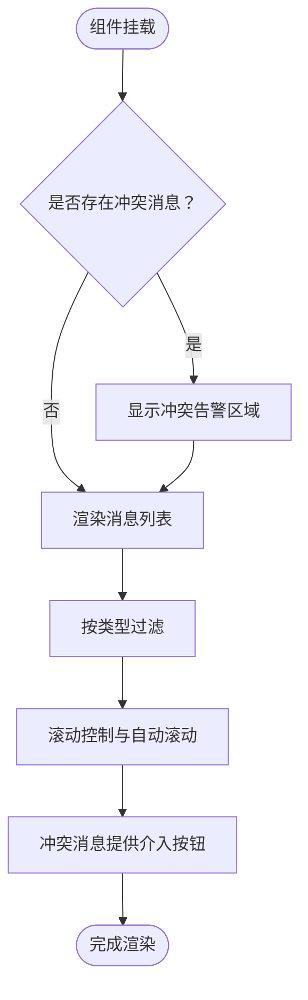
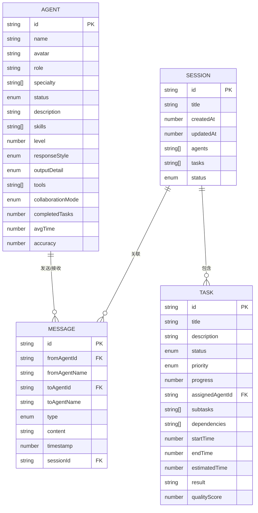
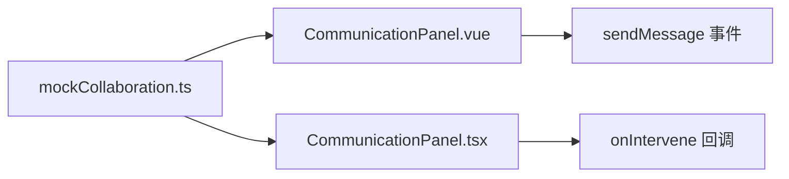

# 通信协调面板

<cite>
**本文档引用的文件**
- [CommunicationPanel.vue](file://apps/AgentPit/src/components/collaboration/CommunicationPanel.vue)
- [CommunicationPanel.tsx](file://apps/AgentPit/src-react-backup-20260410/components/collaboration/CommunicationPanel.tsx)
- [mockCollaboration.ts](file://apps/AgentPit/src/data/mockCollaboration.ts)
</cite>

## 目录
1. [简介](#简介)
2. [项目结构](#项目结构)
3. [核心组件](#核心组件)
4. [架构总览](#架构总览)
5. [详细组件分析](#详细组件分析)
6. [依赖关系分析](#依赖关系分析)
7. [性能考虑](#性能考虑)
8. [故障排查指南](#故障排查指南)
9. [结论](#结论)
10. [附录](#附录)

## 简介
本文件为“通信协调面板”的技术文档，聚焦于 CommunicationPanel 组件的消息传递机制与协作通信能力。文档从消息类型分类、实时通信协议模拟、状态同步方案入手，深入解析消息队列管理、消息过滤与排序算法，并介绍人工干预机制、冲突解决策略与通信监控功能。同时，结合现有代码实现，给出消息持久化、历史记录管理与审计追踪的可行方案建议，以及性能优化、并发控制与错误恢复机制的实践要点。最后提供消息格式规范、API 接口定义与集成指南，帮助开发者在现有基础上扩展真实通信能力。

## 项目结构
通信协调面板位于 AgentPit 应用的协作模块中，采用 Vue 与 React 双版本实现，配合 mock 数据进行演示。关键文件如下：
- CommunicationPanel.vue（Vue 版）：负责消息列表渲染、过滤、分组、自动滚动与发送消息事件。
- CommunicationPanel.tsx（React 版）：负责消息过滤、冲突高亮、人工介入按钮与滚动控制。
- mockCollaboration.ts：定义 Agent、Task、CollaborationSession、Message 等类型与示例数据。

**图表来源**
- [CommunicationPanel.vue:1-350](file://apps/AgentPit/src/components/collaboration/CommunicationPanel.vue#L1-L350)
- [CommunicationPanel.tsx:1-257](file://apps/AgentPit/src-react-backup-20260410/components/collaboration/CommunicationPanel.tsx#L1-L257)
- [mockCollaboration.ts:66-76](file://apps/AgentPit/src/data/mockCollaboration.ts#L66-L76)

**章节来源**
- [CommunicationPanel.vue:1-350](file://apps/AgentPit/src/components/collaboration/CommunicationPanel.vue#L1-L350)
- [CommunicationPanel.tsx:1-257](file://apps/AgentPit/src-react-backup-20260410/components/collaboration/CommunicationPanel.tsx#L1-L257)
- [mockCollaboration.ts:1-301](file://apps/AgentPit/src/data/mockCollaboration.ts#L1-L301)

## 核心组件
- 消息类型与格式
  - 类型：request（请求）、response（响应）、notification（通知）、warning（警告）、conflict（冲突）
  - 关键字段：id、fromAgentId、fromAgentName、toAgentId、toAgentName、type、content、timestamp、sessionId
- 实时通信协议模拟
  - Vue 版通过定时器周期性模拟入站消息；WebSocket 连接状态以状态枚举表示
  - React 版通过 props 注入消息数组，不包含实时模拟逻辑
- 状态同步
  - Vue 版：本地状态维护消息列表、过滤器、连接状态与滚动位置
  - React 版：通过外部传入 messages 与 onIntervene 回调实现状态外置

**章节来源**
- [mockCollaboration.ts:66-76](file://apps/AgentPit/src/data/mockCollaboration.ts#L66-L76)
- [CommunicationPanel.vue:10-15](file://apps/AgentPit/src/components/collaboration/CommunicationPanel.vue#L10-L15)
- [CommunicationPanel.tsx:5-8](file://apps/AgentPit/src-react-backup-20260410/components/collaboration/CommunicationPanel.tsx#L5-L8)

## 架构总览
通信协调面板由“视图层 + 数据层”构成。视图层负责消息展示、过滤与交互；数据层提供消息类型定义与示例数据。Vue 版本内置 WebSocket 状态与入站消息模拟；React 版本强调冲突高亮与人工介入回调。

**图表来源**
- [CommunicationPanel.vue:1-350](file://apps/AgentPit/src/components/collaboration/CommunicationPanel.vue#L1-L350)
- [CommunicationPanel.tsx:1-257](file://apps/AgentPit/src-react-backup-20260410/components/collaboration/CommunicationPanel.tsx#L1-L257)
- [mockCollaboration.ts:66-76](file://apps/AgentPit/src/data/mockCollaboration.ts#L66-L76)

## 详细组件分析

### Vue 版 CommunicationPanel（CommunicationPanel.vue）
- 消息传递机制
  - 发送消息：构建 Message 对象，推入本地消息列表，触发 sendMessage 事件，随后自动滚动到底部
  - 接收消息：周期性随机生成入站消息，填充消息列表并自动滚动
  - WebSocket 状态：连接状态枚举（connected/disconnected/connecting），用于 UI 提示
- 消息过滤与排序
  - 过滤：按消息类型筛选（all/request/response/notification/warning/conflict）
  - 排序：基于时间戳升序排列（由数据源与渲染顺序决定）
  - 分组：按日期分组显示，日期标签自动生成
- 用户交互
  - 选择接收者（广播或单播）
  - 清空消息记录（带确认）
  - 时间格式化与头像映射
- 性能与可用性
  - 自动滚动：滚动到底部；分组渲染减少 DOM 重排
  - 防抖与节流：未使用，但可通过 nextTick 与定时器频率控制优化

**图表来源**
- [CommunicationPanel.vue:134-161](file://apps/AgentPit/src/components/collaboration/CommunicationPanel.vue#L134-L161)
- [CommunicationPanel.vue:38-90](file://apps/AgentPit/src/components/collaboration/CommunicationPanel.vue#L38-L90)

**章节来源**
- [CommunicationPanel.vue:10-15](file://apps/AgentPit/src/components/collaboration/CommunicationPanel.vue#L10-L15)
- [CommunicationPanel.vue:92-190](file://apps/AgentPit/src/components/collaboration/CommunicationPanel.vue#L92-L190)
- [CommunicationPanel.vue:134-161](file://apps/AgentPit/src/components/collaboration/CommunicationPanel.vue#L134-L161)
- [CommunicationPanel.vue:163-173](file://apps/AgentPit/src/components/collaboration/CommunicationPanel.vue#L163-L173)

### React 版 CommunicationPanel（CommunicationPanel.tsx）
- 冲突检测与人工介入
  - 冲突消息高亮：当存在 conflict 类型消息时，顶部弹出冲突告警区域
  - 一键介入：提供“人工介入解决”按钮，触发 onIntervene 回调
- 消息过滤与滚动控制
  - 过滤：支持 all 与各类型过滤
  - 滚动：监听容器滚动，自动切换/恢复“自动滚动”
  - 顶部“回到最新”按钮：手动触发滚动到底部
- 视觉与交互
  - 不同类型消息使用不同颜色与图标
  - 请求类消息显示等待动画

**图表来源**
- [CommunicationPanel.tsx:28-90](file://apps/AgentPit/src-react-backup-20260410/components/collaboration/CommunicationPanel.tsx#L28-L90)
- [CommunicationPanel.tsx:103-116](file://apps/AgentPit/src-react-backup-20260410/components/collaboration/CommunicationPanel.tsx#L103-L116)
- [CommunicationPanel.tsx:118-223](file://apps/AgentPit/src-react-backup-20260410/components/collaboration/CommunicationPanel.tsx#L118-L223)

**章节来源**
- [CommunicationPanel.tsx:18-26](file://apps/AgentPit/src-react-backup-20260410/components/collaboration/CommunicationPanel.tsx#L18-L26)
- [CommunicationPanel.tsx:28-90](file://apps/AgentPit/src-react-backup-20260410/components/collaboration/CommunicationPanel.tsx#L28-L90)
- [CommunicationPanel.tsx:103-116](file://apps/AgentPit/src-react-backup-20260410/components/collaboration/CommunicationPanel.tsx#L103-L116)
- [CommunicationPanel.tsx:118-223](file://apps/AgentPit/src-react-backup-20260410/components/collaboration/CommunicationPanel.tsx#L118-L223)

### 数据模型与类型定义（mockCollaboration.ts）
- Agent：智能体基本信息与协作模式
- Task：任务状态、优先级与进度
- CollaborationSession：会话元数据与关联任务
- Message：消息核心字段与类型约束
- 示例数据：presetAgents、mockSessions、mockMessages

**图表来源**
- [mockCollaboration.ts:1-76](file://apps/AgentPit/src/data/mockCollaboration.ts#L1-L76)

**章节来源**
- [mockCollaboration.ts:1-301](file://apps/AgentPit/src/data/mockCollaboration.ts#L1-L301)

## 依赖关系分析
- 组件依赖
  - CommunicationPanel.vue 依赖 mockCollaboration.ts 中的 Message 类型与示例数据
  - CommunicationPanel.tsx 依赖 mockCollaboration.ts 中的 Message 类型与示例数据
- 外部接口
  - Vue 版通过 emit('sendMessage', message) 向父组件传递发送事件
  - React 版通过 onIntervene(messageId) 回调处理人工介入

**图表来源**
- [CommunicationPanel.vue:6-8](file://apps/AgentPit/src/components/collaboration/CommunicationPanel.vue#L6-L8)
- [CommunicationPanel.tsx](file://apps/AgentPit/src-react-backup-20260410/components/collaboration/CommunicationPanel.tsx#L7)

**章节来源**
- [CommunicationPanel.vue:6-8](file://apps/AgentPit/src/components/collaboration/CommunicationPanel.vue#L6-L8)
- [CommunicationPanel.tsx](file://apps/AgentPit/src-react-backup-20260410/components/collaboration/CommunicationPanel.tsx#L7)

## 性能考虑
- 渲染优化
  - 使用分组渲染与虚拟滚动（建议）：对长消息列表采用虚拟滚动减少 DOM 节点数量
  - 按需渲染：仅渲染可见区域内的消息块
- 过滤与排序
  - 过滤：在计算属性或 useMemo 中缓存过滤结果，避免重复计算
  - 排序：保持时间戳有序，必要时使用二分插入或增量更新
- 自动滚动
  - Vue 版：使用 nextTick 与滚动到底部，避免频繁重排
  - React 版：监听滚动事件时使用防抖，减少滚动回调频率
- WebSocket 与定时器
  - Vue 版：定时器频率可配置，建议根据消息密度调整周期
  - React 版：若接入真实 WS，应实现心跳与断线重连策略

[本节为通用性能建议，无需具体文件引用]

## 故障排查指南
- 消息不显示
  - 检查过滤器是否设置为特定类型导致为空
  - 确认消息列表非空且时间戳有效
- 无法自动滚动
  - Vue：确认容器元素引用与滚动高度计算
  - React：检查容器滚动事件监听与 autoScroll 状态
- 人工介入无效
  - 确认 onIntervene 回调已正确传入组件
  - 检查冲突消息是否存在且类型为 conflict
- WebSocket 状态异常
  - Vue：检查连接状态枚举与定时器触发逻辑
  - 建议增加错误捕获与重试机制

**章节来源**
- [CommunicationPanel.vue:163-173](file://apps/AgentPit/src/components/collaboration/CommunicationPanel.vue#L163-L173)
- [CommunicationPanel.tsx:36-41](file://apps/AgentPit/src-react-backup-20260410/components/collaboration/CommunicationPanel.tsx#L36-L41)

## 结论
通信协调面板在现有实现中提供了清晰的消息类型体系、基础的实时通信模拟与良好的用户交互体验。Vue 与 React 两个版本分别侧重于本地状态管理与人工介入能力。后续可围绕真实 WebSocket 集成、消息持久化与历史记录管理、冲突仲裁与审计追踪等方面进行扩展，以满足更复杂的协作场景。

[本节为总结性内容，无需具体文件引用]

## 附录

### 消息格式规范
- 字段定义
  - id：消息唯一标识
  - fromAgentId/fromAgentName：发送方智能体 ID 与名称
  - toAgentId/toAgentName：接收方智能体 ID 与名称（可选）
  - type：消息类型（request/response/notification/warning/conflict）
  - content：消息正文
  - timestamp：时间戳（毫秒）
  - sessionId：所属会话 ID
- 示例参考
  - [Message 接口定义:66-76](file://apps/AgentPit/src/data/mockCollaboration.ts#L66-L76)
  - [示例消息 mockMessages:256-279](file://apps/AgentPit/src/data/mockCollaboration.ts#L256-L279)

**章节来源**
- [mockCollaboration.ts:66-76](file://apps/AgentPit/src/data/mockCollaboration.ts#L66-L76)
- [mockCollaboration.ts:256-279](file://apps/AgentPit/src/data/mockCollaboration.ts#L256-L279)

### API 接口定义
- Vue 版（事件）
  - 事件名：sendMessage
  - 参数：Message
  - 用途：发送消息时由子组件向父组件传递
  - 参考：[事件声明与触发:6-8](file://apps/AgentPit/src/components/collaboration/CommunicationPanel.vue#L6-L8)、[发送逻辑:134-161](file://apps/AgentPit/src/components/collaboration/CommunicationPanel.vue#L134-L161)
- React 版（回调）
  - 回调名：onIntervene
  - 参数：messageId（string）
  - 用途：冲突消息的人工介入入口
  - 参考：[回调声明与使用:7-8](file://apps/AgentPit/src-react-backup-20260410/components/collaboration/CommunicationPanel.tsx#L7-L8)、[冲突告警与按钮:62-90](file://apps/AgentPit/src-react-backup-20260410/components/collaboration/CommunicationPanel.tsx#L62-L90)

**章节来源**
- [CommunicationPanel.vue:6-8](file://apps/AgentPit/src/components/collaboration/CommunicationPanel.vue#L6-L8)
- [CommunicationPanel.vue:134-161](file://apps/AgentPit/src/components/collaboration/CommunicationPanel.vue#L134-L161)
- [CommunicationPanel.tsx:7-8](file://apps/AgentPit/src-react-backup-20260410/components/collaboration/CommunicationPanel.tsx#L7-L8)
- [CommunicationPanel.tsx:62-90](file://apps/AgentPit/src-react-backup-20260410/components/collaboration/CommunicationPanel.tsx#L62-L90)

### 集成指南
- 与真实通信系统对接（建议步骤）
  - WebSocket 连接：建立连接、心跳保活、断线重连
  - 消息入站：解析消息并推入本地队列，触发 UI 更新
  - 消息出站：封装 Message 对象并通过 WebSocket 发送
  - 冲突检测：在入站消息中识别 conflict 类型并高亮
  - 人工介入：调用 onIntervene 回调，交由上层处理
- 数据持久化与历史记录
  - 建议：将消息列表持久化至 IndexedDB 或本地存储，支持分页加载与搜索
  - 历史记录：按 sessionId 分组，支持导出与回放
- 审计追踪
  - 记录关键操作（发送、清空、人工介入）与时间戳，便于审计与回溯

[本节为通用集成建议，无需具体文件引用]