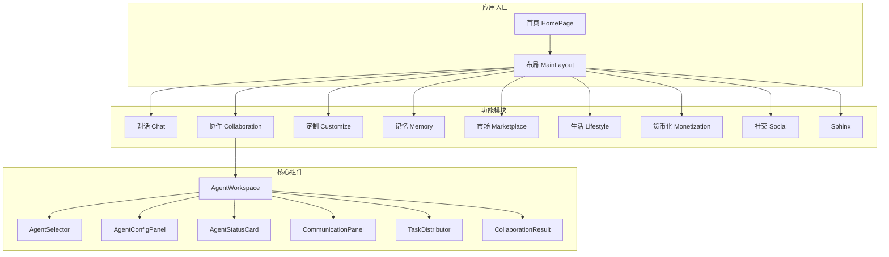
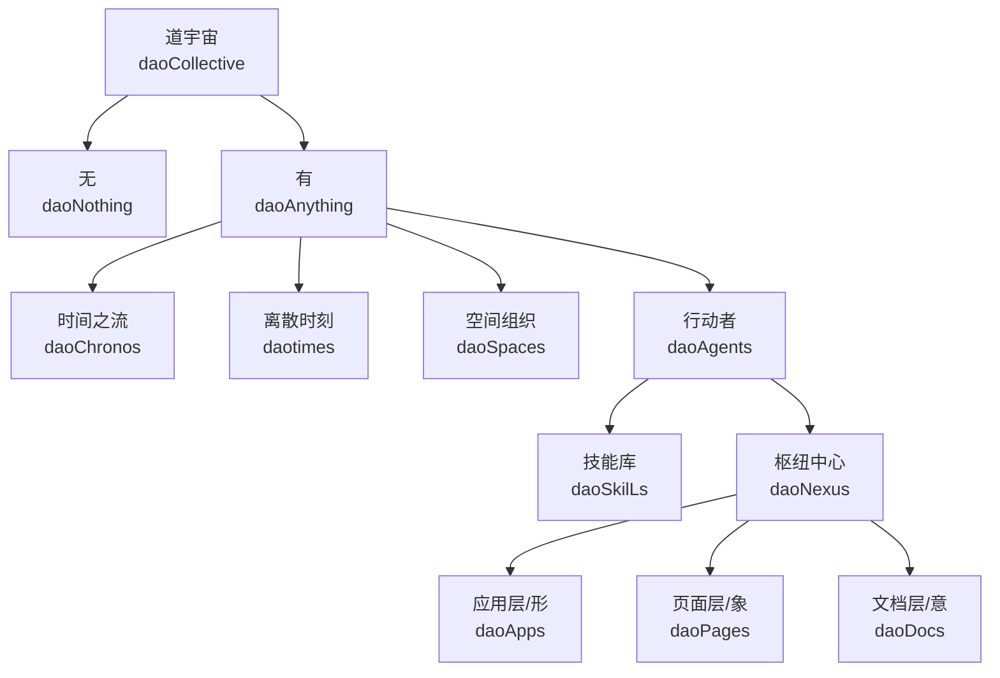
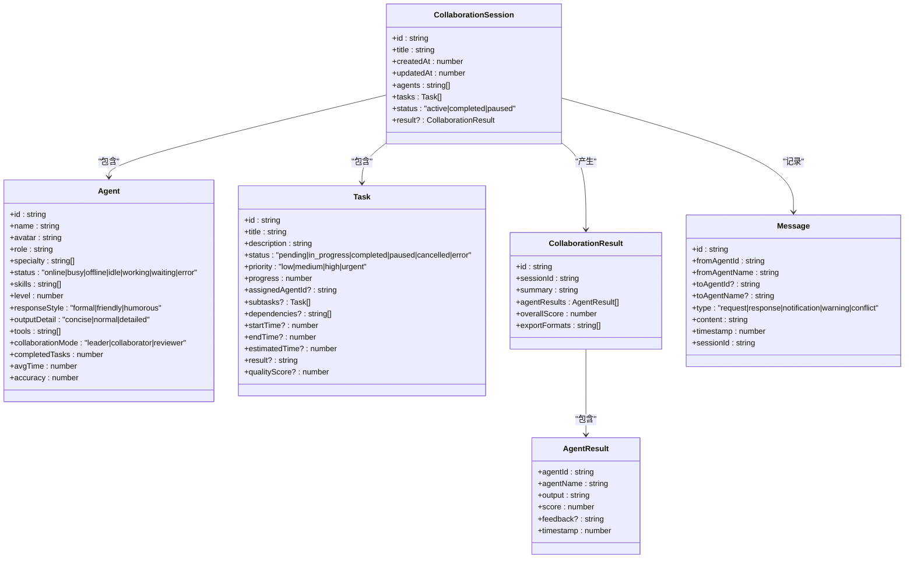
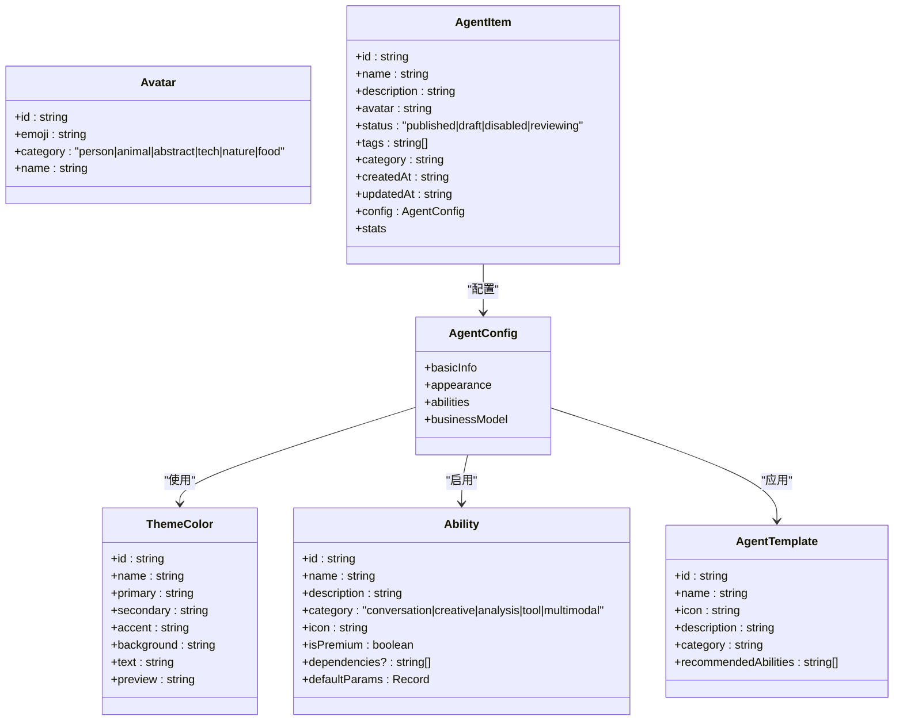
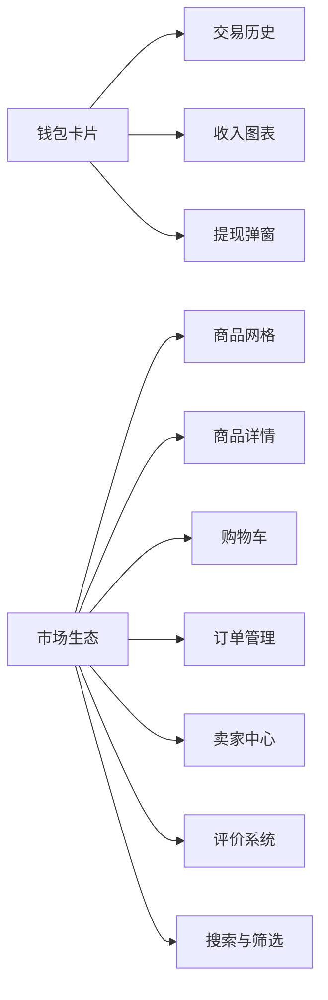
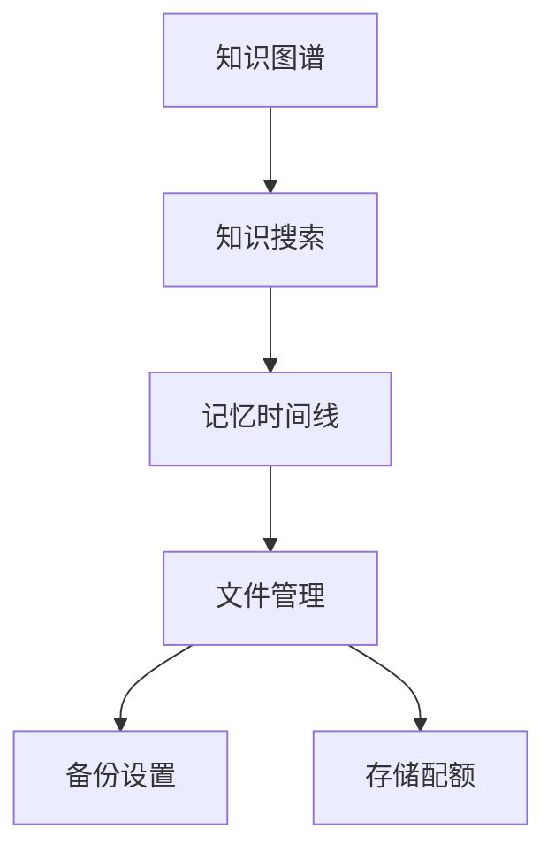
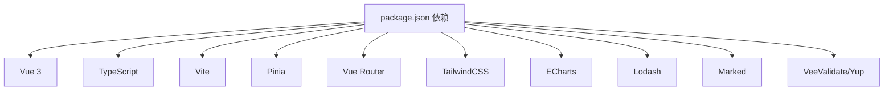

# 平台概览与核心概念

<cite>
**本文档引用的文件**
- [AgentPit 参赛材料.md](file://apps/AgentPit/docs/DaoMind_参赛材料.md)
- [package.json](file://apps/AgentPit/package.json)
- [README.md](file://apps/AgentPit/README.md)
- [CollaborationPage.vue](file://apps/AgentPit/src/views/CollaborationPage.vue)
- [mockCollaboration.ts](file://apps/AgentPit/src/data/mockCollaboration.ts)
- [mockCustomize.ts](file://apps/AgentPit/src/data/mockCustomize.ts)
- [HomePage.vue](file://apps/AgentPit/src/views/HomePage.vue)
- [AgentWorkspace.vue](file://apps/AgentPit/src/components/collaboration/AgentWorkspace.vue)
- [AgentSelector.vue](file://apps/AgentPit/src/components/collaboration/AgentSelector.vue)
- [AgentConfigPanel.vue](file://apps/AgentPit/src/components/collaboration/AgentConfigPanel.vue)
- [AgentStatusCard.vue](file://apps/AgentPit/src/components/collaboration/AgentStatusCard.vue)
- [CommunicationPanel.vue](file://apps/AgentPit/src/components/collaboration/CommunicationPanel.vue)
- [TaskDistributor.vue](file://apps/AgentPit/src/components/collaboration/TaskDistributor.vue)
- [CollaborationResult.vue](file://apps/AgentPit/src/components/collaboration/CollaborationResult.vue)
- [AgentCreatorWizard.vue](file://apps/AgentPit/src/components/customize/AgentCreatorWizard.vue)
- [AbilityConfigurator.vue](file://apps/AgentPit/src/components/customize/AbilityConfigurator.vue)
- [AgentPreview.vue](file://apps/AgentPit/src/components/customize/AgentPreview.vue)
- [MyAgentsList.vue](file://apps/AgentPit/src/components/customize/MyAgentsList.vue)
- [AgentAnalytics.vue](file://apps/AgentPit/src/components/customize/AgentAnalytics.vue)
- [WalletCard.vue](file://apps/AgentPit/src/components/monetization/WalletCard.vue)
- [TransactionHistory.vue](file://apps/AgentPit/src/components/monetization/TransactionHistory.vue)
- [RevenueChart.vue](file://apps/AgentPit/src/components/monetization/RevenueChart.vue)
- [WithdrawModal.vue](file://apps/AgentPit/src/components/monetization/WithdrawModal.vue)
- [ProductGrid.vue](file://apps/AgentPit/src/components/marketplace/ProductGrid.vue)
- [ProductDetail.vue](file://apps/AgentPit/src/components/marketplace/ProductDetail.vue)
- [ShoppingCart.vue](file://apps/AgentPit/src/components/marketplace/ShoppingCart.vue)
- [OrderManagement.vue](file://apps/AgentPit/src/components/marketplace/OrderManagement.vue)
- [SellerCenter.vue](file://apps/AgentPit/src/components/marketplace/SellerCenter.vue)
- [ReviewSystem.vue](file://apps/AgentPit/src/components/marketplace/ReviewSystem.vue)
- [SearchFilter.vue](file://apps/AgentPit/src/components/marketplace/SearchFilter.vue)
- [KnowledgeGraph.vue](file://apps/AgentPit/src/components/memory/KnowledgeGraph.vue)
- [MemorySearch.vue](file://apps/AgentPit/src/components/memory/MemorySearch.vue)
- [MemoryTimeline.vue](file://apps/AgentPit/src/components/memory/MemoryTimeline.vue)
- [FileManager.vue](file://apps/AgentPit/src/components/memory/FileManager.vue)
- [BackupSettings.vue](file://apps/AgentPit/src/components/memory/BackupSettings.vue)
- [StorageQuota.vue](file://apps/AgentPit/src/components/memory/StorageQuota.vue)
- [GameCenter.vue](file://apps/AgentPit/src/components/lifestyle/GameCenter.vue)
- [LifestyleDashboard.vue](file://apps/AgentPit/src/components/lifestyle/LifestyleDashboard.vue)
- [MeetingCalendar.vue](file://apps/AgentPit/src/components/lifestyle/MeetingCalendar.vue)
- [TravelPlanner.vue](file://apps/AgentPit/src/components/lifestyle/TravelPlanner.vue)
- [SphinxPage.tsx](file://apps/AgentPit/src/pages/SphinxPage.tsx)
- [SocialPage.tsx](file://apps/AgentPit/src/pages/SocialPage.tsx)
- [MonetizationPage.tsx](file://apps/AgentPit/src/pages/MonetizationPage.tsx)
- [MarketplacePage.tsx](file://apps/AgentPit/src/pages/MarketplacePage.tsx)
- [MemoryPage.tsx](file://apps/AgentPit/src/pages/MemoryPage.tsx)
- [LifestylePage.tsx](file://apps/AgentPit/src/pages/LifestylePage.tsx)
- [CustomizePage.tsx](file://apps/AgentPit/src/pages/CustomizePage.tsx)
- [CollaborationPage.tsx](file://apps/AgentPit/src/pages/CollaborationPage.tsx)
- [ChatPage.tsx](file://apps/AgentPit/src/pages/ChatPage.tsx)
- [HomePage.tsx](file://apps/AgentPit/src/pages/HomePage.tsx)
- [MainLayout.vue](file://apps/AgentPit/src/components/layout/MainLayout.vue)
- [Header.tsx](file://apps/AgentPit/src/components/layout/Header.tsx)
- [Footer.tsx](file://apps/AgentPit/src/components/layout/Footer.tsx)
- [Sidebar.tsx](file://apps/AgentPit/src/components/layout/Sidebar.tsx)
- [ModuleCard.tsx](file://apps/AgentPit/src/components/home/ModuleCard.tsx)
- [useAppStore.ts](file://apps/AgentPit/src/store/useAppStore.ts)
</cite>

## 目录
1. [简介](#简介)
2. [项目结构](#项目结构)
3. [核心组件](#核心组件)
4. [架构总览](#架构总览)
5. [详细组件分析](#详细组件分析)
6. [依赖关系分析](#依赖关系分析)
7. [性能考量](#性能考量)
8. [故障排查指南](#故障排查指南)
9. [结论](#结论)
10. [附录](#附录)

## 简介
AgentPit 是一个融合东方道家智慧与现代人工智能技术的智能体协作平台。平台以 1973 年马王堆出土的帛书版《道德经》为知识底座，结合多通道接入（Web、WhatsApp、Telegram 等），提供哲学对话、冥想引导、道德圆桌、每日智慧等能力，并通过多智能体协作系统实现跨职能协同。平台强调“道法自然”的系统平衡与可持续发展，既面向个人用户的内在成长，也面向企业与开发者提供可扩展的智能体能力与商业化路径。

- 平台定位：以帛书版《道德经》为核心的 AI 哲学智能体平台，提供哲学对话、冥想引导与人生指导。
- 核心价值：将两千年前的道家智慧与现代 AI 技术融合；多通道接入与个性化体验；模块化智能体与协作系统。
- 在 DAO 生态中的定位：作为“道宇宙”（daoCollective）的一部分，AgentPit 通过“道行动者”（daoAgents）承载智能体能力，连接“道技能库”（daoSkilLs）与“道枢纽中心”（daoNexus），支撑应用层（daoApps）、页面层（daoPages）与文档层（daoDocs）的协同演化。

**章节来源**
- [AgentPit 参赛材料.md:1-245](file://apps/AgentPit/docs/DaoMind_参赛材料.md#L1-L245)

## 项目结构
AgentPit 采用现代化的 monorepo 架构，前端基于 Vue 3 + TypeScript + Vite，配合 Pinia 状态管理与 Vue Router 路由体系。项目包含多个功能域页面与组件，围绕“智能体管理、协作系统、社交功能、商业应用、记忆与知识、生活与休闲、货币化与市场”等模块展开。

**图表来源**
- [HomePage.vue:1-124](file://apps/AgentPit/src/views/HomePage.vue#L1-L124)
- [MainLayout.vue](file://apps/AgentPit/src/components/layout/MainLayout.vue)
- [CollaborationPage.vue:1-13](file://apps/AgentPit/src/views/CollaborationPage.vue#L1-L13)
- [AgentWorkspace.vue](file://apps/AgentPit/src/components/collaboration/AgentWorkspace.vue)
- [AgentSelector.vue](file://apps/AgentPit/src/components/collaboration/AgentSelector.vue)
- [AgentConfigPanel.vue](file://apps/AgentPit/src/components/collaboration/AgentConfigPanel.vue)
- [AgentStatusCard.vue](file://apps/AgentPit/src/components/collaboration/AgentStatusCard.vue)
- [CommunicationPanel.vue](file://apps/AgentPit/src/components/collaboration/CommunicationPanel.vue)
- [TaskDistributor.vue](file://apps/AgentPit/src/components/collaboration/TaskDistributor.vue)
- [CollaborationResult.vue](file://apps/AgentPit/src/components/collaboration/CollaborationResult.vue)

**章节来源**
- [package.json:1-73](file://apps/AgentPit/package.json#L1-L73)
- [README.md:1-6](file://apps/AgentPit/README.md#L1-L6)
- [HomePage.vue:1-124](file://apps/AgentPit/src/views/HomePage.vue#L1-L124)

## 核心组件
- 智能体协作工作区（AgentWorkspace）：多智能体协同的中枢，负责任务分发、沟通面板与结果汇总。
- 智能体选择器（AgentSelector）：从预置或自定义智能体中选择参与协作的角色。
- 智能体配置面板（AgentConfigPanel）：设置智能体外观、能力与商业模式参数。
- 智能体状态卡片（AgentStatusCard）：展示智能体在线状态、完成任务数、平均耗时与准确率等指标。
- 通信面板（CommunicationPanel）：支持请求/响应/通知/警告/冲突等消息类型，保障协作顺畅。
- 任务分发器（TaskDistributor）：根据任务类型与智能体专长进行智能推荐与分配。
- 协作结果（CollaborationResult）：汇总各智能体输出、评分与导出格式，形成最终成果。

**章节来源**
- [mockCollaboration.ts:1-301](file://apps/AgentPit/src/data/mockCollaboration.ts#L1-L301)
- [AgentWorkspace.vue](file://apps/AgentPit/src/components/collaboration/AgentWorkspace.vue)
- [AgentSelector.vue](file://apps/AgentPit/src/components/collaboration/AgentSelector.vue)
- [AgentConfigPanel.vue](file://apps/AgentPit/src/components/collaboration/AgentConfigPanel.vue)
- [AgentStatusCard.vue](file://apps/AgentPit/src/components/collaboration/AgentStatusCard.vue)
- [CommunicationPanel.vue](file://apps/AgentPit/src/components/collaboration/CommunicationPanel.vue)
- [TaskDistributor.vue](file://apps/AgentPit/src/components/collaboration/TaskDistributor.vue)
- [CollaborationResult.vue](file://apps/AgentPit/src/components/collaboration/CollaborationResult.vue)

## 架构总览
AgentPit 的整体架构以“道宇宙”（daoCollective）为顶层概念，向下分为“无/有”、“宙/时/宇/行动者”，其中“行动者”进一步细分为“技能库”和“枢纽中心”。枢纽中心包含“应用层/形”、“页面层/象”、“文档层/意”。平台采用模块化组件与标准化接口，支持多通道接入与消息总线（四气通道）。

**图表来源**
- [AgentPit 参赛材料.md:37-50](file://apps/AgentPit/docs/DaoMind_参赛材料.md#L37-L50)

**章节来源**
- [AgentPit 参赛材料.md:23-50](file://apps/AgentPit/docs/DaoMind_参赛材料.md#L23-L50)

## 详细组件分析

### 智能体协作系统
- 数据模型：包含智能体（Agent）、任务（Task）、协作会话（CollaborationSession）、协作结果（CollaborationResult）与消息（Message）。预置智能体涵盖规划、写作、编程、研究、设计、分析、翻译、咨询等角色，具备不同的专长、等级、响应风格与工具链。
- 推荐算法：基于任务描述关键词匹配，返回候选智能体集合，去重后供选择。
- 协作流程：从任务创建、智能体选择、消息沟通到结果汇总，形成闭环。

**图表来源**
- [mockCollaboration.ts:1-301](file://apps/AgentPit/src/data/mockCollaboration.ts#L1-L301)

**章节来源**
- [mockCollaboration.ts:1-301](file://apps/AgentPit/src/data/mockCollaboration.ts#L1-L301)

### 智能体定制与能力配置
- 头像库与主题色彩：提供丰富的头像类别与主题配色，支持自定义主色、辅色、强调色与排版风格。
- 能力体系：涵盖对话理解、上下文记忆、情感识别、文本创作、代码生成、图像描述、数据分析、逻辑推理、网络搜索、代码执行、API 集成、文件处理、多语言翻译、内容摘要、语音输入、知识库问答、创意写作等。
- 模板与预设：提供通用助手、技术专家、内容创作者、数据分析师、智能客服、教育导师、娱乐伙伴、多模态助手等模板，便于快速创建智能体。
- 商业模式：支持免费、订阅、按次付费、会员制等模式，可设置试用期、服务限额与平台分成。

**图表来源**
- [mockCustomize.ts:1-911](file://apps/AgentPit/src/data/mockCustomize.ts#L1-L911)

**章节来源**
- [mockCustomize.ts:1-911](file://apps/AgentPit/src/data/mockCustomize.ts#L1-L911)

### 货币化与市场
- 钱包与交易：提供钱包卡片、交易历史、收入图表与提现弹窗，支持多维度财务数据展示。
- 市场生态：商品网格、详情、购物车、订单管理、卖家中心、评价系统、搜索与筛选，构建完整的电商闭环。
- 商业模式：C 端（免费/高级）、B 端（API）、内容 IP（付费解读与数字产品）。

**图表来源**
- [WalletCard.vue](file://apps/AgentPit/src/components/monetization/WalletCard.vue)
- [TransactionHistory.vue](file://apps/AgentPit/src/components/monetization/TransactionHistory.vue)
- [RevenueChart.vue](file://apps/AgentPit/src/components/monetization/RevenueChart.vue)
- [WithdrawModal.vue](file://apps/AgentPit/src/components/monetization/WithdrawModal.vue)
- [ProductGrid.vue](file://apps/AgentPit/src/components/marketplace/ProductGrid.vue)
- [ProductDetail.vue](file://apps/AgentPit/src/components/marketplace/ProductDetail.vue)
- [ShoppingCart.vue](file://apps/AgentPit/src/components/marketplace/ShoppingCart.vue)
- [OrderManagement.vue](file://apps/AgentPit/src/components/marketplace/OrderManagement.vue)
- [SellerCenter.vue](file://apps/AgentPit/src/components/marketplace/SellerCenter.vue)
- [ReviewSystem.vue](file://apps/AgentPit/src/components/marketplace/ReviewSystem.vue)
- [SearchFilter.vue](file://apps/AgentPit/src/components/marketplace/SearchFilter.vue)

**章节来源**
- [WalletCard.vue](file://apps/AgentPit/src/components/monetization/WalletCard.vue)
- [TransactionHistory.vue](file://apps/AgentPit/src/components/monetization/TransactionHistory.vue)
- [RevenueChart.vue](file://apps/AgentPit/src/components/monetization/RevenueChart.vue)
- [WithdrawModal.vue](file://apps/AgentPit/src/components/monetization/WithdrawModal.vue)
- [ProductGrid.vue](file://apps/AgentPit/src/components/marketplace/ProductGrid.vue)
- [ProductDetail.vue](file://apps/AgentPit/src/components/marketplace/ProductDetail.vue)
- [ShoppingCart.vue](file://apps/AgentPit/src/components/marketplace/ShoppingCart.vue)
- [OrderManagement.vue](file://apps/AgentPit/src/components/marketplace/OrderManagement.vue)
- [SellerCenter.vue](file://apps/AgentPit/src/components/marketplace/SellerCenter.vue)
- [ReviewSystem.vue](file://apps/AgentPit/src/components/marketplace/ReviewSystem.vue)
- [SearchFilter.vue](file://apps/AgentPit/src/components/marketplace/SearchFilter.vue)

### 记忆与知识
- 知识图谱：构建与展示知识关联网络，辅助检索与推理。
- 搜索与时间线：支持关键词检索与时间轴浏览，提升知识利用效率。
- 文件管理与备份：提供文件上传、分类与备份策略，保障数据安全与容量控制。

**图表来源**
- [KnowledgeGraph.vue](file://apps/AgentPit/src/components/memory/KnowledgeGraph.vue)
- [MemorySearch.vue](file://apps/AgentPit/src/components/memory/MemorySearch.vue)
- [MemoryTimeline.vue](file://apps/AgentPit/src/components/memory/MemoryTimeline.vue)
- [FileManager.vue](file://apps/AgentPit/src/components/memory/FileManager.vue)
- [BackupSettings.vue](file://apps/AgentPit/src/components/memory/BackupSettings.vue)
- [StorageQuota.vue](file://apps/AgentPit/src/components/memory/StorageQuota.vue)

**章节来源**
- [KnowledgeGraph.vue](file://apps/AgentPit/src/components/memory/KnowledgeGraph.vue)
- [MemorySearch.vue](file://apps/AgentPit/src/components/memory/MemorySearch.vue)
- [MemoryTimeline.vue](file://apps/AgentPit/src/components/memory/MemoryTimeline.vue)
- [FileManager.vue](file://apps/AgentPit/src/components/memory/FileManager.vue)
- [BackupSettings.vue](file://apps/AgentPit/src/components/memory/BackupSettings.vue)
- [StorageQuota.vue](file://apps/AgentPit/src/components/memory/StorageQuota.vue)

### 生活与休闲
- 游戏中心、生活仪表盘、会议日历与旅行规划，提供轻松与实用的日常体验，与哲学智慧相辅相成。

**章节来源**
- [GameCenter.vue](file://apps/AgentPit/src/components/lifestyle/GameCenter.vue)
- [LifestyleDashboard.vue](file://apps/AgentPit/src/components/lifestyle/LifestyleDashboard.vue)
- [MeetingCalendar.vue](file://apps/AgentPit/src/components/lifestyle/MeetingCalendar.vue)
- [TravelPlanner.vue](file://apps/AgentPit/src/components/lifestyle/TravelPlanner.vue)

## 依赖关系分析
- 前端技术栈：Vue 3、TypeScript、Vite、Pinia、Vue Router、TailwindCSS、ECharts、Lodash、Marked、VeeValidate、Yup 等。
- 项目脚本：开发、构建、预览、代码检查、格式化、类型检查、测试与覆盖率等。
- 页面与组件：每个页面对应一个或多个组件，通过 MainLayout 统一布局，模块卡片（ModuleCard）驱动导航。

**图表来源**
- [package.json:20-40](file://apps/AgentPit/package.json#L20-L40)

**章节来源**
- [package.json:1-73](file://apps/AgentPit/package.json#L1-L73)
- [HomePage.vue:1-124](file://apps/AgentPit/src/views/HomePage.vue#L1-L124)

## 性能考量
- 启动时间：约 1.2 秒以内，满足快速交互需求。
- 内存占用：约 32MB，优于 50MB 的阈值，保证多标签页与多智能体并发场景下的稳定性。
- 消息吞吐量：超过 10,000 条/秒，满足高频协作场景。
- 反馈回路延迟（P99）：小于 500ms，确保实时协作体验。
- 冲气收敛时间：约 15 秒，体现系统在高负载下的快速稳定能力。

**章节来源**
- [AgentPit 参赛材料.md:96-102](file://apps/AgentPit/docs/DaoMind_参赛材料.md#L96-L102)

## 故障排查指南
- 页面加载与布局
  - 若首页模块未出现，检查 MainLayout 是否正确渲染，确认 ModuleCard 数据源与动画过渡是否触发。
  - 若协作页面空白，检查 AgentWorkspace 是否被正确挂载，确认路由与布局容器高度设置。
- 智能体协作
  - 若任务无法分配，检查任务类型关键词与推荐映射表，确认 getRecommendedAgents 返回值。
  - 若消息类型异常，核对消息类型枚举与通信面板渲染逻辑。
- 定制与能力
  - 若能力启用失败，检查 AbilityConfigurator 的依赖关系与默认参数，确认前置能力是否已启用。
  - 若模板不可用，核对 AgentTemplate 的推荐能力列表与 AgentConfig 的启用集合。
- 货币化与市场
  - 若交易历史为空，检查交易数据源与时间范围过滤。
  - 若购物车异常，核对商品状态与库存限制。
- 记忆与知识
  - 若知识图谱不显示，检查数据节点与边的构建逻辑。
  - 若文件上传失败，核对备份策略与存储配额限制。

**章节来源**
- [HomePage.vue:1-124](file://apps/AgentPit/src/views/HomePage.vue#L1-L124)
- [CollaborationPage.vue:1-13](file://apps/AgentPit/src/views/CollaborationPage.vue#L1-L13)
- [mockCollaboration.ts:292-301](file://apps/AgentPit/src/data/mockCollaboration.ts#L292-L301)
- [mockCustomize.ts:311-469](file://apps/AgentPit/src/data/mockCustomize.ts#L311-L469)

## 结论
AgentPit 将帛书版《道德经》的哲学智慧与现代 AI 技术深度融合，构建了以多智能体协作为核心的开放平台。通过模块化组件与标准化接口，平台实现了从个人成长到商业应用的全场景覆盖。其“道法自然”的架构设计与“四气通道”的消息总线，既体现了系统平衡与可持续发展的理念，也为未来的扩展与演进奠定了坚实基础。

## 附录
- 项目链接与生态集成：参见参赛材料中的项目链接与 OpenClaw Skills 说明。
- 未来规划：短期引入五行概念与八卦映射；中期实现德的量化与内丹/外丹隐喻；长期开发齐物论引擎与逍遥游模式，构建道家知识图谱。

**章节来源**
- [AgentPit 参赛材料.md:149-186](file://apps/AgentPit/docs/DaoMind_参赛材料.md#L149-L186)