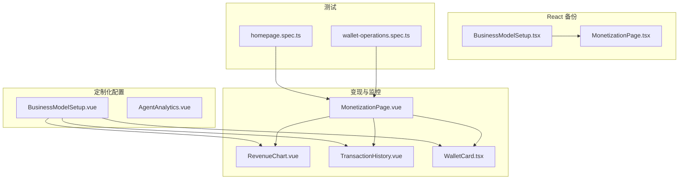
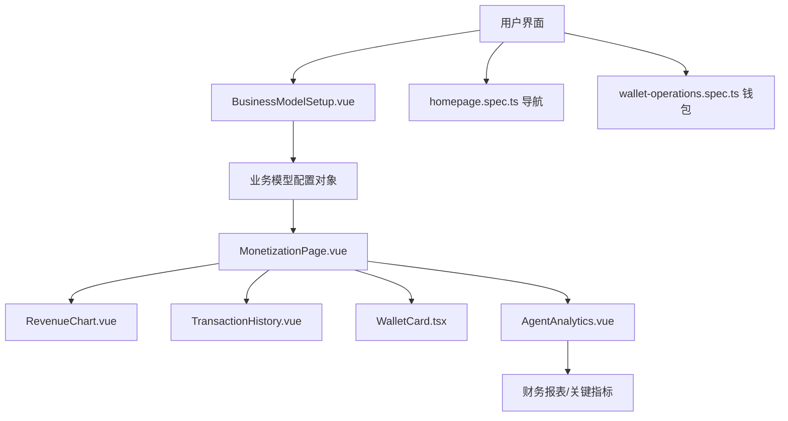
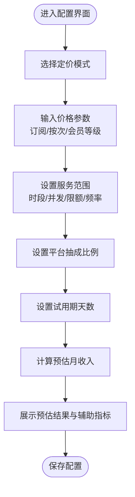
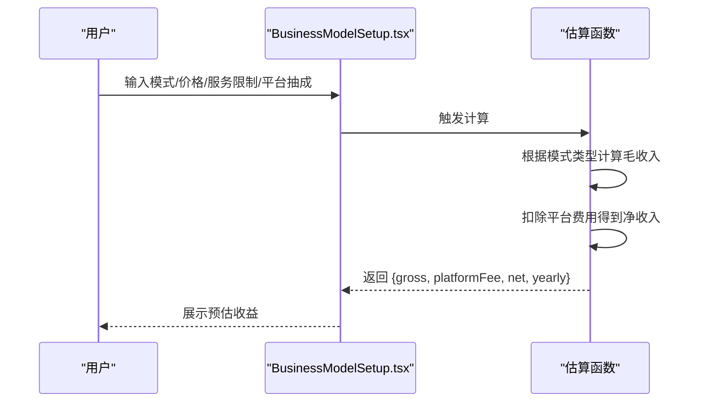
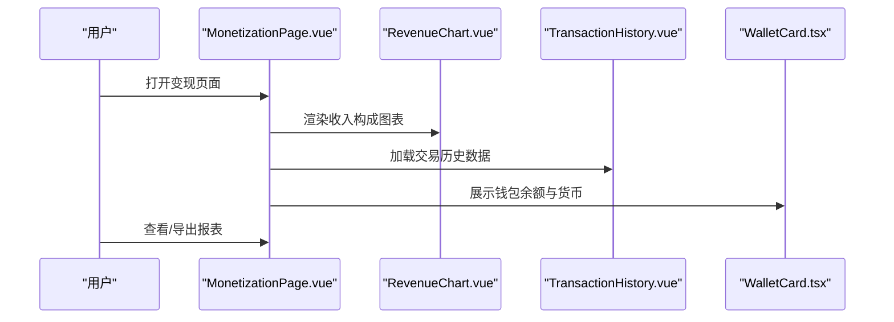
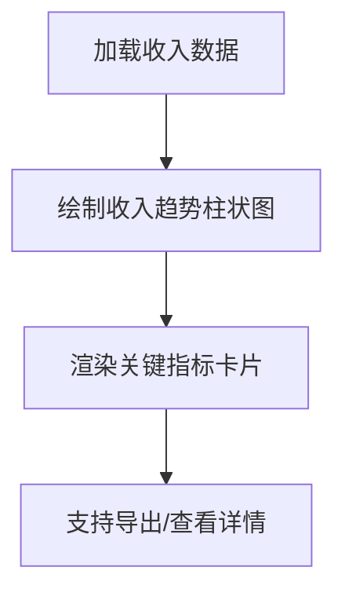
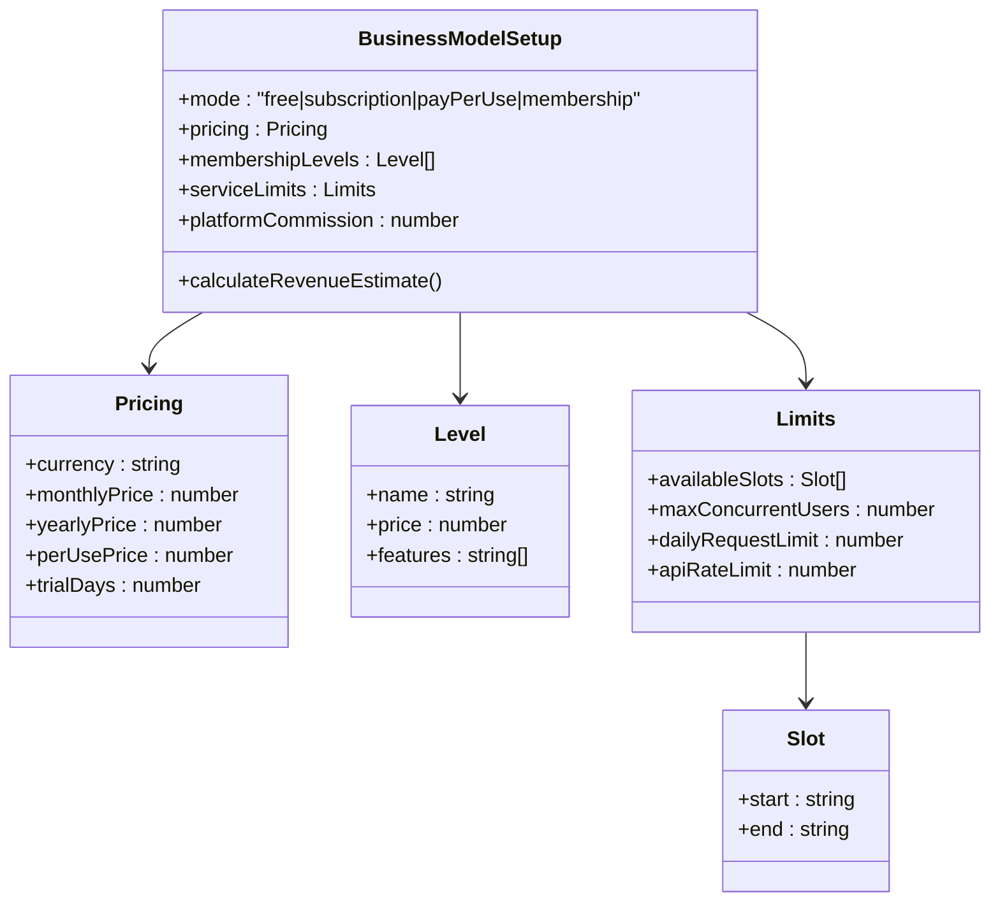
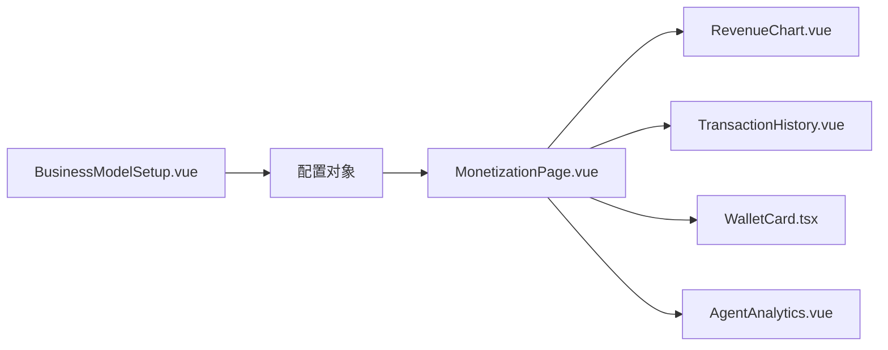

# 商业模式配置

<cite>
**本文引用的文件**
- [BusinessModelSetup.vue](file://apps/AgentPit/src/components/customize/BusinessModelSetup.vue)
- [AgentAnalytics.vue](file://apps/AgentPit/src/components/customize/AgentAnalytics.vue)
- [MonetizationPage.vue](file://apps/AgentPit/src/views/MonetizationPage.vue)
- [RevenueChart.vue](file://apps/AgentPit/src/components/monetization/RevenueChart.vue)
- [TransactionHistory.vue](file://apps/AgentPit/src/components/monetization/TransactionHistory.vue)
- [WalletCard.tsx](file://apps/AgentPit/src-react-backup-20260410/components/monetization/WalletCard.tsx)
- [BusinessModelSetup.tsx](file://apps/AgentPit/src-react-backup-20260410/components/customize/BusinessModelSetup.tsx)
- [MonetizationPage.tsx](file://apps/AgentPit/src-react-backup-20260410/pages/MonetizationPage.tsx)
- [spec.md](file://apps/AgentPit/.trae/specs/implement-monetization-system/spec.md)
- [wallet-operations.spec.ts](file://apps/AgentPit/e2e/wallet-operations.spec.ts)
- [homepage.spec.ts](file://apps/AgentPit/e2e/homepage.spec.ts)
</cite>

## 目录
1. [简介](#简介)
2. [项目结构](#项目结构)
3. [核心组件](#核心组件)
4. [架构总览](#架构总览)
5. [详细组件分析](#详细组件分析)
6. [依赖关系分析](#依赖关系分析)
7. [性能考虑](#性能考虑)
8. [故障排除指南](#故障排除指南)
9. [结论](#结论)
10. [附录](#附录)

## 简介
本技术文档围绕 AgentPit 应用中的“商业模式配置”功能展开，重点介绍 BusinessModelSetup 组件在定价模式、定价策略、收益分配等方面的配置能力，并解释不同商业模式（订阅制、按次付费、会员等级等）的实现机制与对智能体使用体验的影响。同时，文档涵盖变现与监控分析（收入统计、成本分析、ROI 计算）以及最佳实践与案例分析，帮助开发者与产品人员高效落地该功能。

## 项目结构
AgentPit 的商业模式配置主要分布在以下位置：
- Vue 版本的商业模式配置组件位于 customize 目录，提供交互式配置界面与实时预估。
- React 备份版本保留了部分组件与页面，便于对照与迁移。
- 变现与监控分析组件集中在 monetization 目录，提供图表、交易历史、钱包等能力。
- E2E 测试覆盖了首页导航与钱包操作流程，验证关键路径。

**图表来源**
- [BusinessModelSetup.vue:1-330](file://apps/AgentPit/src/components/customize/BusinessModelSetup.vue#L1-L330)
- [AgentAnalytics.vue](file://apps/AgentPit/src/components/customize/AgentAnalytics.vue)
- [MonetizationPage.vue](file://apps/AgentPit/src/views/MonetizationPage.vue)
- [RevenueChart.vue](file://apps/AgentPit/src/components/monetization/RevenueChart.vue)
- [TransactionHistory.vue](file://apps/AgentPit/src/components/monetization/TransactionHistory.vue)
- [WalletCard.tsx](file://apps/AgentPit/src-react-backup-20260410/components/monetization/WalletCard.tsx)
- [BusinessModelSetup.tsx:1-128](file://apps/AgentPit/src-react-backup-20260410/components/customize/BusinessModelSetup.tsx#L1-L128)
- [MonetizationPage.tsx:27-57](file://apps/AgentPit/src-react-backup-20260410/pages/MonetizationPage.tsx#L27-L57)
- [homepage.spec.ts:16-24](file://apps/AgentPit/e2e/homepage.spec.ts#L16-L24)
- [wallet-operations.spec.ts:1-41](file://apps/AgentPit/e2e/wallet-operations.spec.ts#L1-L41)

**章节来源**
- [BusinessModelSetup.vue:1-330](file://apps/AgentPit/src/components/customize/BusinessModelSetup.vue#L1-L330)
- [MonetizationPage.vue](file://apps/AgentPit/src/views/MonetizationPage.vue)
- [homepage.spec.ts:16-24](file://apps/AgentPit/e2e/homepage.spec.ts#L16-L24)

## 核心组件
- BusinessModelSetup.vue：提供定价模式选择、价格配置、服务范围控制、平台抽成与试用期设置，并实时计算预估月收入。
- AgentAnalytics.vue：提供收入趋势分析、关键指标卡片、月度对比等可视化能力。
- MonetizationPage.vue：变现主页面，整合钱包、收入图表、交易历史与提现模态框。
- RevenueChart.vue / TransactionHistory.vue：分别负责收入构成与交易明细的可视化。
- WalletCard.tsx：钱包余额与货币选择等基础能力。
- BusinessModelSetup.tsx（React 备份）：与 Vue 版本对应的功能实现，包含收费模式、定价策略与收益估算逻辑。
- MonetizationPage.tsx（React 备份）：变现页面占位与渠道展示。

**章节来源**
- [BusinessModelSetup.vue:29-120](file://apps/AgentPit/src/components/customize/BusinessModelSetup.vue#L29-L120)
- [AgentAnalytics.vue:192-220](file://apps/AgentPit/src/components/customize/AgentAnalytics.vue#L192-L220)
- [MonetizationPage.vue:72-95](file://apps/AgentPit/src/views/MonetizationPage.vue#L72-L95)
- [RevenueChart.vue](file://apps/AgentPit/src/components/monetization/RevenueChart.vue)
- [TransactionHistory.vue:140-165](file://apps/AgentPit/src/components/monetization/TransactionHistory.vue#L140-L165)
- [WalletCard.tsx](file://apps/AgentPit/src-react-backup-20260410/components/monetization/WalletCard.tsx)
- [BusinessModelSetup.tsx:33-128](file://apps/AgentPit/src-react-backup-20260410/components/customize/BusinessModelSetup.tsx#L33-L128)
- [MonetizationPage.tsx:27-57](file://apps/AgentPit/src-react-backup-20260410/pages/MonetizationPage.tsx#L27-L57)

## 架构总览
商业模式配置与变现监控的整体架构如下：
- 配置层：BusinessModelSetup.vue 接收用户输入，计算预估收入并回传配置对象。
- 展示层：MonetizationPage.vue 聚合 WalletCard、RevenueChart、TransactionHistory 等组件。
- 分析层：AgentAnalytics.vue 提供收入趋势与关键指标卡片，支持 ROI 等指标展示。
- 测试层：E2E 用例覆盖首页导航与钱包操作，保障核心路径可用性。

**图表来源**
- [BusinessModelSetup.vue:107-120](file://apps/AgentPit/src/components/customize/BusinessModelSetup.vue#L107-L120)
- [MonetizationPage.vue:72-95](file://apps/AgentPit/src/views/MonetizationPage.vue#L72-L95)
- [RevenueChart.vue](file://apps/AgentPit/src/components/monetization/RevenueChart.vue)
- [TransactionHistory.vue:140-165](file://apps/AgentPit/src/components/monetization/TransactionHistory.vue#L140-L165)
- [WalletCard.tsx](file://apps/AgentPit/src-react-backup-20260410/components/monetization/WalletCard.tsx)
- [AgentAnalytics.vue:192-220](file://apps/AgentPit/src/components/customize/AgentAnalytics.vue#L192-L220)
- [homepage.spec.ts:16-24](file://apps/AgentPit/e2e/homepage.spec.ts#L16-L24)
- [wallet-operations.spec.ts:1-41](file://apps/AgentPit/e2e/wallet-operations.spec.ts#L1-L41)

## 详细组件分析

### BusinessModelSetup 组件（Vue）
BusinessModelSetup.vue 是商业模式配置的核心组件，提供以下能力：
- 定价模式选择：免费模式、订阅制、按次付费、会员等级。
- 价格配置：订阅制支持月付/季付/年付价格；按次付费支持单次调用价格；会员等级支持多档价格与功能列表。
- 服务范围控制：可用时段、并发用户上限、每日请求限额、API 频率限制。
- 平台抽成与试用期：平台抽成比例与试用期天数设置。
- 实时预估：基于并发用户、日请求量等参数计算预估月收入，并显示预期用户、日请求量、分成比例等辅助信息。

**图表来源**
- [BusinessModelSetup.vue:29-120](file://apps/AgentPit/src/components/customize/BusinessModelSetup.vue#L29-L120)
- [BusinessModelSetup.vue:36-56](file://apps/AgentPit/src/components/customize/BusinessModelSetup.vue#L36-L56)

**章节来源**
- [BusinessModelSetup.vue:1-330](file://apps/AgentPit/src/components/customize/BusinessModelSetup.vue#L1-L330)

### BusinessModelSetup 组件（React 备份）
React 版本的 BusinessModelSetup.tsx 提供与 Vue 版本一致的配置能力，包含：
- 收费模式枚举：免费、订阅、按次付费、增值服务、广告分成。
- 定价策略：月费、年费、单次价格、试用期天数。
- 服务限制：日/月限额、响应时间。
- 支付方式：支付宝、微信、信用卡、加密货币。
- 收益估算：根据模式类型计算毛收入、平台费用与净收入，并提供年化净收入。

**图表来源**
- [BusinessModelSetup.tsx:80-112](file://apps/AgentPit/src-react-backup-20260410/components/customize/BusinessModelSetup.tsx#L80-L112)

**章节来源**
- [BusinessModelSetup.tsx:1-128](file://apps/AgentPit/src-react-backup-20260410/components/customize/BusinessModelSetup.tsx#L1-L128)

### 变现与监控分析（MonetizationPage）
MonetizationPage.vue 作为变现主页面，整合以下组件：
- 收入构成图表：RevenueChart.vue 展示智能体服务、建站分成、商品销售、其他收入的占比。
- 交易历史：TransactionHistory.vue 展示交易 ID、描述、类型、金额、状态、时间等字段。
- 钱包卡片：WalletCard.tsx 展示余额与货币选择。
- 提现模态框：WithdrawModal（在 MonetizationPage.vue 中引用）处理提现流程。

**图表来源**
- [MonetizationPage.vue:72-95](file://apps/AgentPit/src/views/MonetizationPage.vue#L72-L95)
- [RevenueChart.vue](file://apps/AgentPit/src/components/monetization/RevenueChart.vue)
- [TransactionHistory.vue:140-165](file://apps/AgentPit/src/components/monetization/TransactionHistory.vue#L140-L165)
- [WalletCard.tsx](file://apps/AgentPit/src-react-backup-20260410/components/monetization/WalletCard.tsx)

**章节来源**
- [MonetizationPage.vue:72-95](file://apps/AgentPit/src/views/MonetizationPage.vue#L72-L95)

### 收入趋势分析（AgentAnalytics）
AgentAnalytics.vue 提供收入趋势分析与关键指标卡片，支持：
- 收入趋势图表：订阅收入、按次付费收入等分项柱状图。
- 关键指标：总收入、总支出、净利润、ROI 等指标卡片与环比变化。

**图表来源**
- [AgentAnalytics.vue:192-220](file://apps/AgentPit/src/components/customize/AgentAnalytics.vue#L192-L220)

**章节来源**
- [AgentAnalytics.vue:192-220](file://apps/AgentPit/src/components/customize/AgentAnalytics.vue#L192-L220)

### 不同商业模式的实现机制
- 订阅制：支持月付/季付/年付价格，按预估用户数与单价计算月收入，平台抽成分成后得出净收入。
- 按次付费：按单次调用价格与总请求量计算收入，结合平台抽成得出净收入。
- 会员等级：多档价格与功能列表，按平均价格与用户规模估算收入。
- 免费模式：通常无直接收入，适合品牌推广或生态建设。
- 广告分成：通过内置广告产生收益，按预估用户数与广告收益系数计算。

**图表来源**
- [BusinessModelSetup.vue:14-24](file://apps/AgentPit/src/components/customize/BusinessModelSetup.vue#L14-L24)
- [BusinessModelSetup.vue:36-56](file://apps/AgentPit/src/components/customize/BusinessModelSetup.vue#L36-L56)

**章节来源**
- [BusinessModelSetup.vue:29-120](file://apps/AgentPit/src/components/customize/BusinessModelSetup.vue#L29-L120)

### 商业模式与智能体能力的关系
- 服务能力与用户体验：通过并发用户上限、每日请求限额、API 频率限制等参数，控制智能体的可用性与时效性，直接影响用户使用体验。
- 收费模式与功能开放：订阅制与会员等级可作为功能解锁的门槛，免费模式适合快速拉新，广告分成可在不改变用户体验的前提下增加收益。
- 平台抽成与收益分配：平台抽成比例直接影响创作者的净收入，需在收益与合规之间平衡。

**章节来源**
- [BusinessModelSetup.vue:214-289](file://apps/AgentPit/src/components/customize/BusinessModelSetup.vue#L214-L289)

### 监控与分析功能
- 收入统计：MonetizationPage.vue 整合图表与交易历史，支持按来源分类查看收入。
- 成本分析：通过关键指标卡片与趋势图表，识别成本与收入的变化趋势。
- ROI 计算：AgentAnalytics.vue 提供 ROI 等关键指标展示，便于评估投入产出比。

**章节来源**
- [MonetizationPage.vue:72-95](file://apps/AgentPit/src/views/MonetizationPage.vue#L72-L95)
- [AgentAnalytics.vue:192-220](file://apps/AgentPit/src/components/customize/AgentAnalytics.vue#L192-L220)

## 依赖关系分析
- 组件耦合：BusinessModelSetup.vue 与 MonetizationPage.vue 通过配置对象进行解耦，降低直接依赖。
- 数据流：从配置到展示的数据流清晰，配置变更触发更新，避免重复计算。
- 外部依赖：Recharts 用于图表渲染，Tailwind CSS 用于样式统一。

**图表来源**
- [BusinessModelSetup.vue:107-120](file://apps/AgentPit/src/components/customize/BusinessModelSetup.vue#L107-L120)
- [MonetizationPage.vue:72-95](file://apps/AgentPit/src/views/MonetizationPage.vue#L72-L95)

**章节来源**
- [BusinessModelSetup.vue:107-120](file://apps/AgentPit/src/components/customize/BusinessModelSetup.vue#L107-L120)
- [MonetizationPage.vue:72-95](file://apps/AgentPit/src/views/MonetizationPage.vue#L72-L95)

## 性能考虑
- 计算优化：预估收入计算仅在配置变更时触发，避免频繁重算。
- 渲染优化：使用条件渲染与过渡动画，减少不必要的 DOM 更新。
- 数据缓存：图表与交易历史建议采用分页与懒加载，提升大数据量下的交互性能。

## 故障排除指南
- 首页导航异常：检查 E2E 用例中“导航到变现页面”的断言，确认模块卡片存在且可点击。
- 钱包卡片不可见：验证 E2E 用例中钱包卡片的可见性与文本匹配逻辑。
- 图表渲染失败：确认 Recharts 依赖已正确安装，容器尺寸与数据格式符合要求。

**章节来源**
- [homepage.spec.ts:16-24](file://apps/AgentPit/e2e/homepage.spec.ts#L16-L24)
- [wallet-operations.spec.ts:9-30](file://apps/AgentPit/e2e/wallet-operations.spec.ts#L9-L30)

## 结论
BusinessModelSetup 组件提供了灵活的商业模式配置能力，结合 MonetizationPage 与 AgentAnalytics，能够实现从配置到监控的完整闭环。通过合理的定价策略、服务范围控制与平台抽成设置，既能提升创作者收益，又能保障用户体验。建议在实际落地中结合业务目标与用户画像，持续迭代商业模式与监控指标。

## 附录
- 设计规范与需求：参考自动变现系统模块实现 Spec，明确关键指标卡片、收入来源分布与月度对比数据等要求。
- 最佳实践：优先以订阅制或会员等级为主，配合免费试用与广告分成，形成多元化的收入结构；通过 ROI 与趋势分析持续优化定价与资源配置。

**章节来源**
- [spec.md:25-43](file://apps/AgentPit/.trae/specs/implement-monetization-system/spec.md#L25-L43)