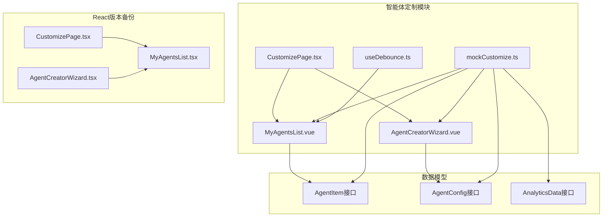
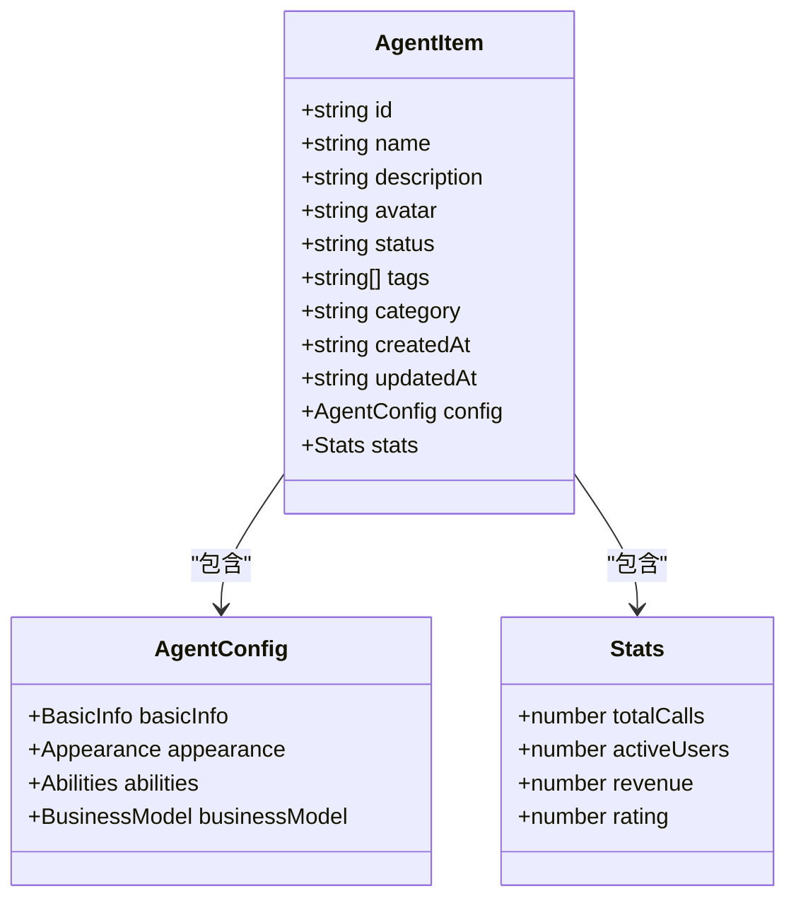
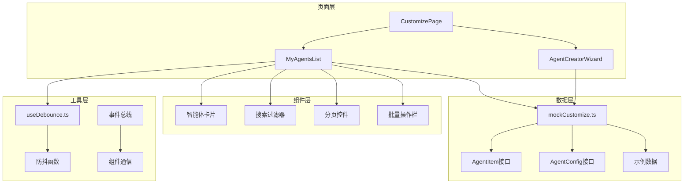
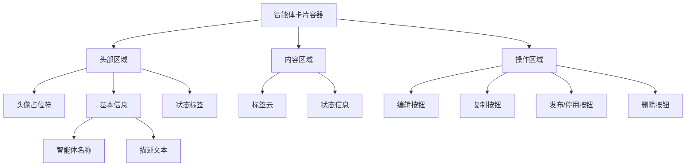
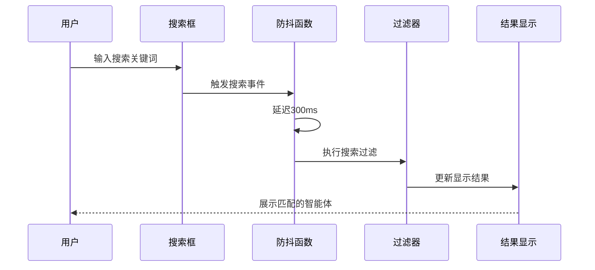
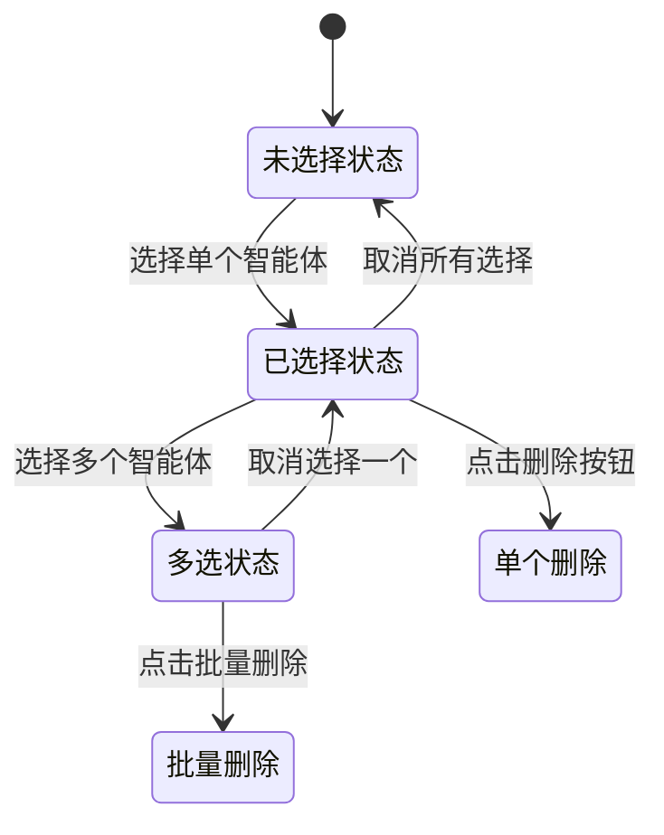
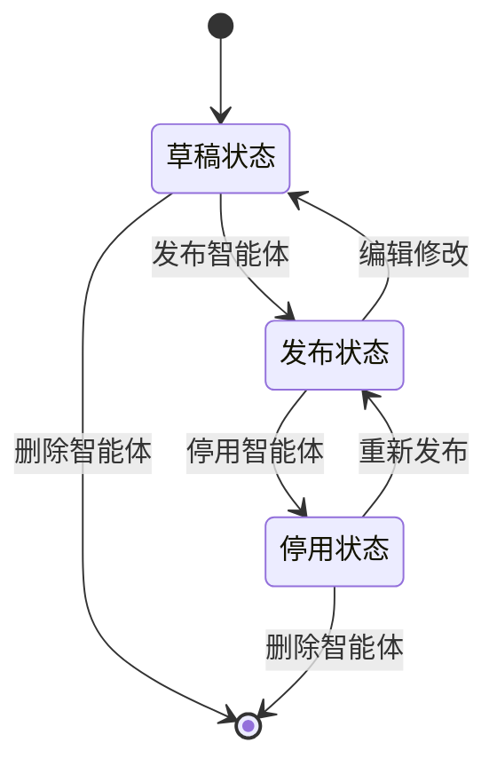
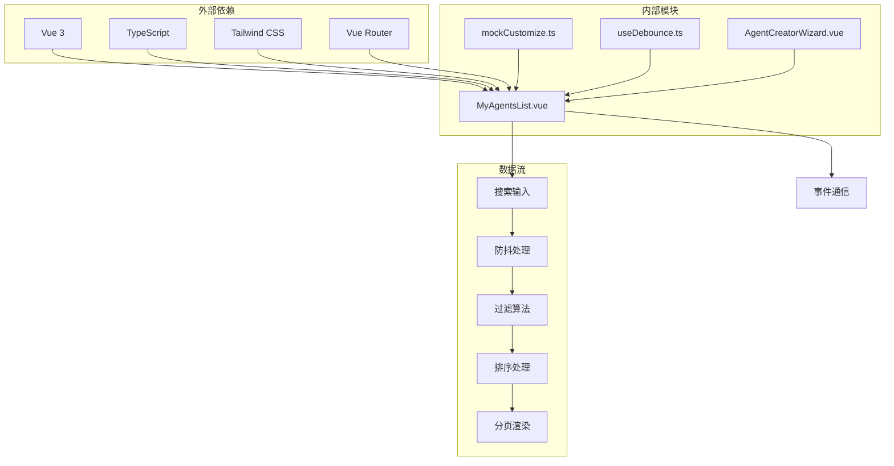

# 智能体列表管理

<cite>
**本文档引用的文件**
- [MyAgentsList.vue](file://apps/AgentPit/src/components/customize/MyAgentsList.vue)
- [mockCustomize.ts](file://apps/AgentPit/src/data/mockCustomize.ts)
- [useDebounce.ts](file://apps/AgentPit/src/composables/useDebounce.ts)
- [AgentCreatorWizard.vue](file://apps/AgentPit/src/components/customize/AgentCreatorWizard.vue)
- [CustomizePage.tsx](file://apps/AgentPit/src-react-backup-20260410/pages/CustomizePage.tsx)
- [AgentCreatorWizard.tsx](file://apps/AgentPit/src-react-backup-20260410/components/customize/AgentCreatorWizard.tsx)
</cite>

## 目录
1. [简介](#简介)
2. [项目结构](#项目结构)
3. [核心组件](#核心组件)
4. [架构概览](#架构概览)
5. [详细组件分析](#详细组件分析)
6. [依赖关系分析](#依赖关系分析)
7. [性能考虑](#性能考虑)
8. [故障排除指南](#故障排除指南)
9. [结论](#结论)

## 简介

智能体列表管理功能是AgentPit平台的核心模块之一，负责展示、管理和操作用户创建的AI智能体。该功能提供了完整的智能体生命周期管理，包括创建、编辑、删除、启用/禁用等操作，并集成了强大的搜索、过滤、排序和分页功能。

本功能采用Vue 3 Composition API构建，结合TypeScript提供类型安全的开发体验，同时支持响应式数据绑定和组件间通信。系统设计注重用户体验，提供了直观的操作界面和流畅的交互效果。

## 项目结构

智能体列表管理功能主要分布在以下目录结构中：

**图表来源**
- [MyAgentsList.vue:1-328](file://apps/AgentPit/src/components/customize/MyAgentsList.vue#L1-L328)
- [mockCustomize.ts:95-141](file://apps/AgentPit/src/data/mockCustomize.ts#L95-L141)

**章节来源**
- [MyAgentsList.vue:1-328](file://apps/AgentPit/src/components/customize/MyAgentsList.vue#L1-L328)
- [mockCustomize.ts:1-911](file://apps/AgentPit/src/data/mockCustomize.ts#L1-L911)

## 核心组件

### MyAgentsList组件

MyAgentsList是智能体列表管理的核心组件，提供了完整的智能体展示和管理功能。该组件采用响应式设计，支持多种视图模式和交互方式。

#### 主要功能特性

1. **智能体卡片展示**：每个智能体以卡片形式展示，包含基本信息、状态标识和操作按钮
2. **搜索和过滤**：支持按名称、标签、描述进行搜索，按状态进行过滤
3. **排序功能**：支持按创建时间、更新时间、名称等维度排序
4. **分页机制**：支持大数据量的分页显示
5. **批量操作**：支持多选和批量删除操作
6. **状态管理**：提供智能体状态的可视化标识

#### 数据模型

组件使用以下数据结构来管理智能体信息：

**图表来源**
- [mockCustomize.ts:95-141](file://apps/AgentPit/src/data/mockCustomize.ts#L95-L141)

**章节来源**
- [MyAgentsList.vue:95-112](file://apps/AgentPit/src/data/mockCustomize.ts#L95-L112)
- [mockCustomize.ts:39-141](file://apps/AgentPit/src/data/mockCustomize.ts#L39-L141)

## 架构概览

智能体列表管理功能采用模块化架构设计，各组件职责明确，耦合度低，便于维护和扩展。

**图表来源**
- [CustomizePage.tsx:6-51](file://apps/AgentPit/src-react-backup-20260410/pages/CustomizePage.tsx#L6-L51)
- [MyAgentsList.vue:1-126](file://apps/AgentPit/src/components/customize/MyAgentsList.vue#L1-L126)

## 详细组件分析

### 智能体卡片设计

智能体卡片是用户界面的核心元素，采用现代化的设计风格，提供丰富的视觉信息和交互反馈。

#### 卡片布局结构

**图表来源**
- [MyAgentsList.vue:175-228](file://apps/AgentPit/src/components/customize/MyAgentsList.vue#L175-L228)

#### 状态标识系统

系统实现了完整的状态标识体系，通过颜色、图标和标签清晰地展示智能体当前状态：

| 状态 | 颜色 | 图标 | 描述 |
|------|------|------|------|
| published | 绿色 | ✓ | 已发布，可正常使用 |
| draft | 灰色 | 📝 | 草稿，未发布 |
| disabled | 红色 | ⚠️ | 已停用，不可使用 |
| reviewing | 橙色 | ⏳ | 审核中，等待审核 |

**章节来源**
- [MyAgentsList.vue:38-43](file://apps/AgentPit/src/components/customize/MyAgentsList.vue#L38-L43)

### 搜索和过滤功能

搜索和过滤功能提供了灵活的数据检索方式，支持多种查询条件和组合筛选。

#### 搜索实现机制

**图表来源**
- [MyAgentsList.vue:45-73](file://apps/AgentPit/src/components/customize/MyAgentsList.vue#L45-L73)
- [useDebounce.ts:1-20](file://apps/AgentPit/src/composables/useDebounce.ts#L1-L20)

#### 过滤条件

系统支持以下过滤条件：

1. **状态过滤**：按智能体状态进行筛选
2. **标签过滤**：按智能体标签进行筛选  
3. **分类过滤**：按智能体类别进行筛选
4. **名称过滤**：按智能体名称进行精确匹配

**章节来源**
- [MyAgentsList.vue:45-73](file://apps/AgentPit/src/components/customize/MyAgentsList.vue#L45-L73)

### 排序和分页功能

系统提供了灵活的排序和分页机制，确保在大量数据场景下的良好性能和用户体验。

#### 排序选项

| 排序类型 | 字段 | 方向 | 描述 |
|----------|------|------|------|
| createdAt | 创建时间 | 降序 | 最新创建的智能体排在前面 |
| updatedAt | 更新时间 | 降序 | 最近更新的智能体排在前面 |
| name-asc | 名称 | 升序 | 按字母顺序排列 |
| name-desc | 名称 | 降序 | 按字母逆序排列 |

#### 分页实现

分页功能采用虚拟分页策略，支持以下配置：

- **每页显示数量**：9个智能体
- **总页数计算**：基于过滤后的结果总数
- **页码导航**：支持上一页、下一页和直接跳转
- **响应式布局**：根据屏幕尺寸调整列数

**章节来源**
- [MyAgentsList.vue:75-80](file://apps/AgentPit/src/components/customize/MyAgentsList.vue#L75-L80)
- [MyAgentsList.vue:239-263](file://apps/AgentPit/src/components/customize/MyAgentsList.vue#L239-L263)

### 批量操作功能

批量操作功能允许用户同时对多个智能体进行管理操作，提高工作效率。

#### 批量选择机制

**图表来源**
- [MyAgentsList.vue:82-100](file://apps/AgentPit/src/components/customize/MyAgentsList.vue#L82-L100)

#### 批量操作选项

1. **批量删除**：删除选中的多个智能体
2. **取消选择**：清除当前的选择状态
3. **全选功能**：未来版本计划支持

**章节来源**
- [MyAgentsList.vue:165-173](file://apps/AgentPit/src/components/customize/MyAgentsList.vue#L165-L173)
- [MyAgentsList.vue:94-100](file://apps/AgentPit/src/components/customize/MyAgentsList.vue#L94-L100)

### 智能体生命周期管理

系统提供了完整的智能体生命周期管理功能，涵盖从创建到删除的全过程。

#### 生命周期状态转换

**图表来源**
- [mockCustomize.ts:100](file://apps/AgentPit/src/data/mockCustomize.ts#L100)

#### 状态管理策略

1. **状态验证**：确保状态转换的合法性
2. **权限控制**：不同状态下允许的操作不同
3. **数据一致性**：状态变化时同步更新相关数据
4. **用户提示**：提供状态变化的反馈信息

**章节来源**
- [MyAgentsList.vue:220-226](file://apps/AgentPit/src/components/customize/MyAgentsList.vue#L220-L226)

## 依赖关系分析

智能体列表管理功能涉及多个模块间的依赖关系，形成了清晰的层次结构。

**图表来源**
- [MyAgentsList.vue:1-126](file://apps/AgentPit/src/components/customize/MyAgentsList.vue#L1-L126)
- [mockCustomize.ts:1-911](file://apps/AgentPit/src/data/mockCustomize.ts#L1-L911)

### 组件间通信

系统采用多种方式实现组件间通信：

1. **Props传递**：父子组件间的数据传递
2. **事件发射**：子组件向父组件发送事件
3. **状态共享**：通过全局状态管理共享数据
4. **路由参数**：通过URL参数传递状态

**章节来源**
- [CustomizePage.tsx:11-17](file://apps/AgentPit/src-react-backup-20260410/pages/CustomizePage.tsx#L11-L17)

## 性能考虑

智能体列表管理功能在设计时充分考虑了性能优化，确保在大数据量场景下的流畅体验。

### 性能优化策略

1. **虚拟滚动**：对于超大数据集，采用虚拟滚动减少DOM节点数量
2. **懒加载**：图片和资源采用懒加载策略
3. **缓存机制**：搜索结果和过滤状态进行缓存
4. **防抖优化**：搜索输入采用防抖机制减少计算次数
5. **响应式设计**：根据设备性能调整渲染策略

### 内存管理

1. **组件卸载**：及时清理事件监听器和定时器
2. **数据清理**：删除智能体时清理相关数据引用
3. **垃圾回收**：避免内存泄漏，定期进行垃圾回收

## 故障排除指南

### 常见问题及解决方案

#### 搜索功能异常

**问题描述**：搜索框输入后没有响应或搜索结果不准确

**可能原因**：
1. 防抖函数配置错误
2. 搜索算法实现问题
3. 数据源格式不正确

**解决步骤**：
1. 检查防抖延迟设置（默认300ms）
2. 验证搜索关键词的大小写处理
3. 确认数据字段的可搜索性

#### 分页显示问题

**问题描述**：分页控件显示异常或跳转失效

**可能原因**：
1. 总页数计算错误
2. 当前页码状态不一致
3. 页面大小配置问题

**解决步骤**：
1. 验证过滤后的数据长度
2. 检查当前页码的边界条件
3. 确认分页组件的响应式配置

#### 状态切换失败

**问题描述**：智能体状态无法正常切换

**可能原因**：
1. 状态转换规则不满足
2. 权限检查失败
3. 数据同步问题

**解决步骤**：
1. 检查当前状态是否允许转换
2. 验证用户权限级别
3. 确认状态更新的异步处理

**章节来源**
- [useDebounce.ts:1-20](file://apps/AgentPit/src/composables/useDebounce.ts#L1-L20)
- [MyAgentsList.vue:75-80](file://apps/AgentPit/src/components/customize/MyAgentsList.vue#L75-L80)

## 结论

智能体列表管理功能通过精心设计的架构和完善的组件实现，为用户提供了强大而易用的智能体管理体验。该功能不仅满足了基本的展示和操作需求，还通过搜索、过滤、排序、分页等高级功能提升了用户体验。

系统采用现代化的技术栈和最佳实践，确保了良好的性能表现和可维护性。未来可以进一步扩展功能，如添加全选功能、导入导出能力、智能体模板管理等，以满足更复杂的使用场景。

通过持续的优化和改进，智能体列表管理功能将成为AgentPit平台的重要基础设施，为用户提供更加便捷和高效的智能体管理服务。