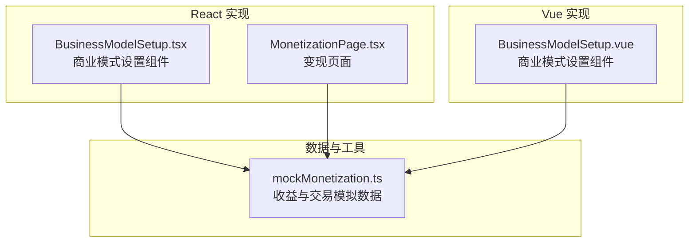
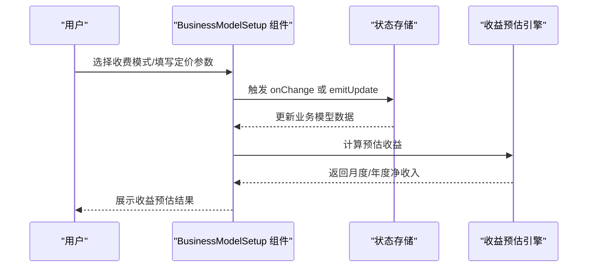
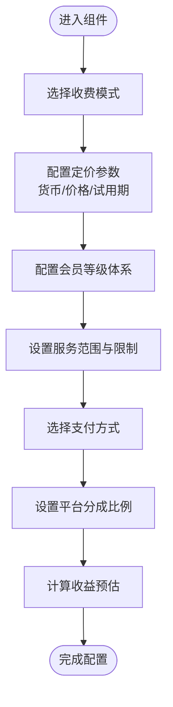
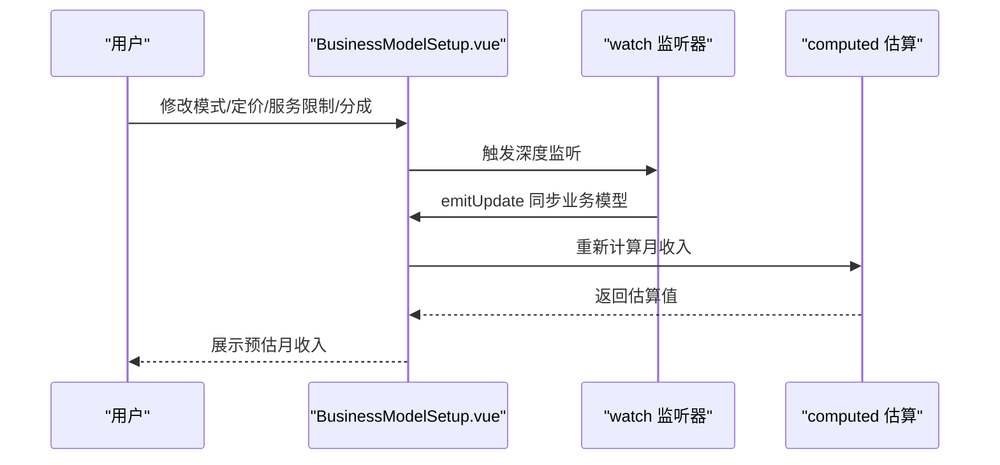
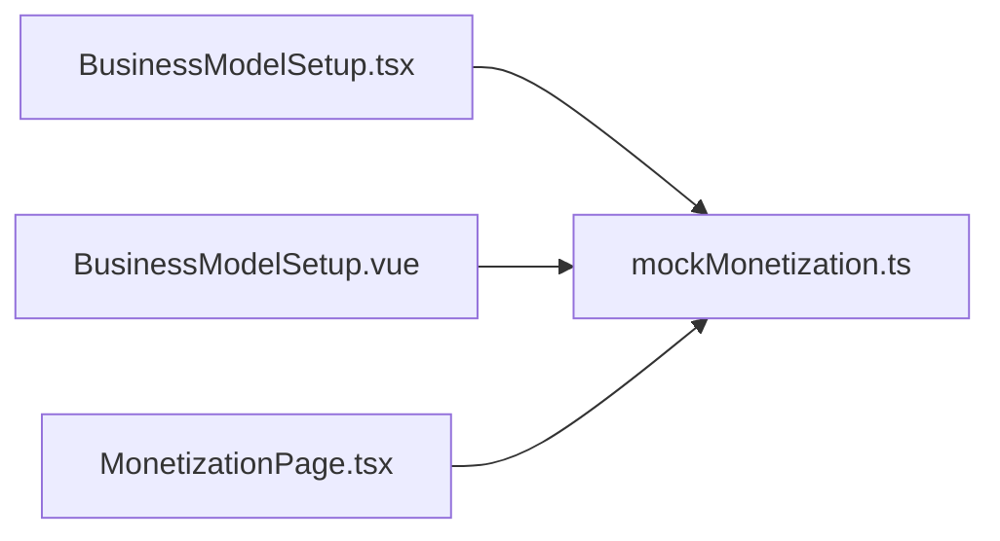

# 商业模式设置步骤

<cite>
**本文引用的文件**
- [BusinessModelSetup.tsx](file://apps/AgentPit/src-react-backup-20260410/components/customize/BusinessModelSetup.tsx)
- [BusinessModelSetup.vue](file://apps/AgentPit/src/components/customize/BusinessModelSetup.vue)
- [MonetizationPage.tsx](file://apps/AgentPit/src-react-backup-20260410/pages/MonetizationPage.tsx)
- [mockMonetization.ts](file://apps/AgentPit/src/data/mockMonetization.ts)
</cite>

## 目录
1. [简介](#简介)
2. [项目结构](#项目结构)
3. [核心组件](#核心组件)
4. [架构概览](#架构概览)
5. [详细组件分析](#详细组件分析)
6. [依赖关系分析](#依赖关系分析)
7. [性能考量](#性能考量)
8. [故障排除指南](#故障排除指南)
9. [结论](#结论)
10. [附录](#附录)

## 简介
本技术文档围绕智能体创建向导中的“商业模式设置步骤”展开，重点解析 BusinessModelSetup 组件的实现机制，涵盖收费模式选择、定价策略配置、收益分配与平台分成、服务范围与限制、支付方式配置以及收益预估计算。文档同时提供不同商业模式（免费、订阅、按次付费、增值服务、广告分成）的配置界面与参数设置说明，并给出定价数据验证、货币单位转换与支付网关集成的处理建议，以及完整的商业模式配置指南、最佳实践、定价策略建议、收入预测模型与商业可持续性考虑。

## 项目结构
AgentPit 应用包含两套实现版本：
- React 版本：位于 apps/AgentPit/src-react-backup-20260410，包含 BusinessModelSetup.tsx、MonetizationPage.tsx 等组件与页面。
- Vue 版本：位于 apps/AgentPit/src，包含 BusinessModelSetup.vue 及相关数据与页面。

两者均提供商业模式配置界面与收益预估能力，React 版本更强调交互与可视化，Vue 版本更强调响应式数据绑定与实时更新。

图表来源
- [BusinessModelSetup.tsx:1-544](file://apps/AgentPit/src-react-backup-20260410/components/customize/BusinessModelSetup.tsx#L1-L544)
- [BusinessModelSetup.vue:1-330](file://apps/AgentPit/src/components/customize/BusinessModelSetup.vue#L1-L330)
- [MonetizationPage.tsx:1-58](file://apps/AgentPit/src-react-backup-20260410/pages/MonetizationPage.tsx#L1-L58)
- [mockMonetization.ts:1-145](file://apps/AgentPit/src/data/mockMonetization.ts#L1-L145)

章节来源
- [BusinessModelSetup.tsx:1-544](file://apps/AgentPit/src-react-backup-20260410/components/customize/BusinessModelSetup.tsx#L1-L544)
- [BusinessModelSetup.vue:1-330](file://apps/AgentPit/src/components/customize/BusinessModelSetup.vue#L1-L330)
- [MonetizationPage.tsx:1-58](file://apps/AgentPit/src-react-backup-20260410/pages/MonetizationPage.tsx#L1-L58)
- [mockMonetization.ts:1-145](file://apps/AgentPit/src/data/mockMonetization.ts#L1-L145)

## 核心组件
BusinessModelSetup 组件负责引导用户完成商业模式的配置，包括：
- 收费模式选择：免费、订阅、按次付费、增值服务、广告分成。
- 定价策略配置：货币类型、月度/年度价格、单次使用价格、试用期天数。
- 会员等级体系：多级会员价格与功能列表。
- 服务范围与限制：每日/每月使用次数限制、响应时间承诺。
- 支付方式配置：支持多种支付渠道勾选。
- 平台分成比例：可调节平台抽成百分比。
- 收益预估计算器：基于用户规模与转化率估算月度/年度净收入。

章节来源
- [BusinessModelSetup.tsx:29-114](file://apps/AgentPit/src-react-backup-20260410/components/customize/BusinessModelSetup.tsx#L29-L114)
- [BusinessModelSetup.vue:14-120](file://apps/AgentPit/src/components/customize/BusinessModelSetup.vue#L14-L120)

## 架构概览
React 与 Vue 两个版本的 BusinessModelSetup 在职责上保持一致，但在实现细节与交互体验上存在差异：
- React 版本通过 onChange 回调将状态变更传递给父组件，便于统一管理全局状态。
- Vue 版本通过 v-model 与 emitUpdate 实时同步业务模型，减少外部状态依赖。
- 两者均提供收益预估模块，用于帮助用户理解不同商业模式下的潜在收入。

图表来源
- [BusinessModelSetup.tsx:80-114](file://apps/AgentPit/src-react-backup-20260410/components/customize/BusinessModelSetup.tsx#L80-L114)
- [BusinessModelSetup.vue:36-56](file://apps/AgentPit/src/components/customize/BusinessModelSetup.vue#L36-L56)

## 详细组件分析

### React 版本 BusinessModelSetup.tsx
- 数据结构与属性
  - 接收 data 与 onChange 两个属性，data 包含 mode、pricing、membershipLevels、serviceLimits、paymentMethods、platformCommission 等字段。
  - 使用 useState 维护预估用户规模与转化率。
- 收费模式选择
  - 提供五种模式：免费、付费订阅、按次付费、增值服务、广告分成；通过按钮切换并更新 mode。
- 定价策略配置
  - 货币类型下拉框支持 CNY、USD、EUR、GBP。
  - 订阅/增值服务模式下支持月度/年度价格输入与试用期天数设置。
  - 按次付费模式下支持单次使用价格输入。
  - 会员等级体系支持三级会员的价格与功能列表配置。
- 服务范围与限制
  - 每日/每月使用次数限制与响应时间承诺。
- 支付方式配置
  - 多种支付方式勾选（支付宝、微信支付、信用卡、加密货币），通过 handleTogglePayment 切换启用状态。
- 平台分成比例
  - 可拖动滑块设置平台抽成比例，并实时展示分成占比。
- 收益预估计算器
  - 根据模式与用户规模、转化率计算月度/年度净收入，并扣除平台抽成。

图表来源
- [BusinessModelSetup.tsx:33-114](file://apps/AgentPit/src-react-backup-20260410/components/customize/BusinessModelSetup.tsx#L33-L114)

章节来源
- [BusinessModelSetup.tsx:1-544](file://apps/AgentPit/src-react-backup-20260410/components/customize/BusinessModelSetup.tsx#L1-L544)

### Vue 版本 BusinessModelSetup.vue
- 数据结构与响应式
  - 通过 ref 与 computed 管理模式、定价、会员等级、服务限制与平台分成。
  - computed 估算月收入，结合并发用户、日请求数与平台抽成比例。
- 收费模式选择
  - 提供四种模式：免费、订阅、按次付费、会员等级；通过按钮切换。
- 定价策略配置
  - 订阅模式支持月付、季付、年付价格；按次付费模式支持单次调用价格。
  - 会员等级模式支持动态增删等级与功能项。
- 服务范围与限制
  - 可用时段（开始/结束时间）增删；并发用户上限、每日请求限额、API 频率限制。
- 平台与试用
  - 平台抽成比例滑块；试用期天数输入（0 表示无试用）。
- 收益预估
  - 基于并发用户与日请求数估算月收入，并展示预期用户、日请求量与分成比例。

图表来源
- [BusinessModelSetup.vue:107-120](file://apps/AgentPit/src/components/customize/BusinessModelSetup.vue#L107-L120)
- [BusinessModelSetup.vue:36-56](file://apps/AgentPit/src/components/customize/BusinessModelSetup.vue#L36-L56)

章节来源
- [BusinessModelSetup.vue:1-330](file://apps/AgentPit/src/components/customize/BusinessModelSetup.vue#L1-L330)

### 收益预估与财务数据
- 收益预估
  - React 版本：根据模式与用户规模、转化率计算月度/年度净收入，扣除平台抽成。
  - Vue 版本：基于并发用户与日请求数估算月收入，展示预期用户、日请求量与分成比例。
- 财务数据与报表
  - mockMonetization.ts 提供钱包余额、交易记录、收入分布与财务指标等数据结构，可用于变现页面的数据支撑。

章节来源
- [BusinessModelSetup.tsx:80-114](file://apps/AgentPit/src-react-backup-20260410/components/customize/BusinessModelSetup.tsx#L80-L114)
- [BusinessModelSetup.vue:36-56](file://apps/AgentPit/src/components/customize/BusinessModelSetup.vue#L36-L56)
- [mockMonetization.ts:1-145](file://apps/AgentPit/src/data/mockMonetization.ts#L1-L145)

## 依赖关系分析
- 组件间耦合
  - BusinessModelSetup 与 MonetizationPage 页面通过业务模型数据进行解耦，前者负责配置，后者负责展示。
  - 两个版本的组件均依赖 mockMonetization.ts 的数据结构进行收益与交易模拟。
- 外部依赖
  - React 版本通过 onChange 回调与父组件通信；Vue 版本通过 emitUpdate 与父组件通信。
  - 货币单位与支付方式在组件内枚举，便于扩展与国际化。

图表来源
- [BusinessModelSetup.tsx:1-544](file://apps/AgentPit/src-react-backup-20260410/components/customize/BusinessModelSetup.tsx#L1-L544)
- [BusinessModelSetup.vue:1-330](file://apps/AgentPit/src/components/customize/BusinessModelSetup.vue#L1-L330)
- [MonetizationPage.tsx:1-58](file://apps/AgentPit/src-react-backup-20260410/pages/MonetizationPage.tsx#L1-L58)
- [mockMonetization.ts:1-145](file://apps/AgentPit/src/data/mockMonetization.ts#L1-L145)

章节来源
- [BusinessModelSetup.tsx:1-544](file://apps/AgentPit/src-react-backup-20260410/components/customize/BusinessModelSetup.tsx#L1-L544)
- [BusinessModelSetup.vue:1-330](file://apps/AgentPit/src/components/customize/BusinessModelSetup.vue#L1-L330)
- [MonetizationPage.tsx:1-58](file://apps/AgentPit/src-react-backup-20260410/pages/MonetizationPage.tsx#L1-L58)
- [mockMonetization.ts:1-145](file://apps/AgentPit/src/data/mockMonetization.ts#L1-L145)

## 性能考量
- 计算复杂度
  - 收益预估计算为 O(1)，仅涉及基本算术运算，性能开销极小。
- 渲染优化
  - React 版本通过条件渲染隐藏不适用的配置面板，减少 DOM 结构与重绘。
  - Vue 版本通过 v-if/v-show 控制面板显示，避免不必要的渲染。
- 数据绑定
  - Vue 版本使用 computed 与 watch，确保仅在依赖变化时重新计算，降低性能损耗。

## 故障排除指南
- 定价输入异常
  - 现象：输入非数值导致 NaN。
  - 处理：在输入事件中进行类型转换与默认值处理，确保数值有效。
- 货币单位不一致
  - 现象：货币符号与实际货币代码不匹配。
  - 处理：在渲染时根据货币代码动态选择符号，避免硬编码。
- 支付方式未启用
  - 现象：用户勾选后未生效。
  - 处理：检查 handleTogglePayment 逻辑与 onChange 回调，确保状态同步。
- 收益预估偏差
  - 现象：预估值与实际不符。
  - 处理：核对模式分支、用户规模与转化率参数，必要时引入更精细的预测模型。

章节来源
- [BusinessModelSetup.tsx:116-128](file://apps/AgentPit/src-react-backup-20260410/components/customize/BusinessModelSetup.tsx#L116-L128)
- [BusinessModelSetup.vue:107-120](file://apps/AgentPit/src/components/customize/BusinessModelSetup.vue#L107-L120)

## 结论
BusinessModelSetup 组件为智能体创建向导提供了完整的商业模式配置入口，覆盖收费模式、定价策略、服务限制、支付方式与平台分成等关键要素。React 与 Vue 两个版本在实现方式上各有侧重，但目标一致：帮助用户快速建立可持续的商业模型。配合收益预估与财务数据，用户可以基于真实场景做出更明智的决策。

## 附录

### 不同商业模式的配置指南
- 免费模式
  - 适用场景：公益项目、个人使用、品牌推广。
  - 配置要点：无需定价；可设置服务限制与响应时间承诺。
- 付费订阅
  - 适用场景：SaaS 类智能体服务。
  - 配置要点：设置货币类型、月度/年度价格与试用期；可配置会员等级体系。
- 按次付费
  - 适用场景：低频高价值使用场景。
  - 配置要点：设置单次使用价格；建议价格区间参考组件内提示。
- 增值服务（免费+付费）
  - 适用场景：免费基础功能+高级功能解锁。
  - 配置要点：设置基础价格与高级功能列表；可配置会员等级。
- 广告分成
  - 适用场景：内容型智能体，可在对话中嵌入广告。
  - 配置要点：设置广告收益预估与分成比例。

章节来源
- [BusinessModelSetup.tsx:33-64](file://apps/AgentPit/src-react-backup-20260410/components/customize/BusinessModelSetup.tsx#L33-L64)
- [BusinessModelSetup.vue:29-34](file://apps/AgentPit/src/components/customize/BusinessModelSetup.vue#L29-L34)

### 定价数据验证与货币单位转换
- 数据验证
  - 对数值输入进行最小值、最大值与步长校验；对空值进行默认处理。
- 货币单位转换
  - 在渲染层根据货币代码选择符号；在存储层保留 ISO 代码，便于后续扩展。

章节来源
- [BusinessModelSetup.tsx:169-243](file://apps/AgentPit/src-react-backup-20260410/components/customize/BusinessModelSetup.tsx#L169-L243)
- [BusinessModelSetup.vue:151-181](file://apps/AgentPit/src/components/customize/BusinessModelSetup.vue#L151-L181)

### 支付网关集成建议
- 支付方式配置
  - 在组件中维护支付方式列表与启用状态；通过回调通知父组件保存配置。
- 网关对接
  - 将支付方式与第三方网关映射，统一处理支付流程与回调。

章节来源
- [BusinessModelSetup.tsx:116-128](file://apps/AgentPit/src-react-backup-20260410/components/customize/BusinessModelSetup.tsx#L116-L128)
- [BusinessModelSetup.vue:130-147](file://apps/AgentPit/src/components/customize/BusinessModelSetup.vue#L130-L147)

### 收入预测模型与商业可持续性
- 收入预测模型
  - 订阅/增值服务：月收入 = 用户数 × 转化率 × 月单价 × (1 - 平台抽成)。
  - 按次付费：月收入 = 用户数 × 转化率 × 每用户使用次数 × 单次价格 × (1 - 平台抽成)。
  - 广告分成：月收入 = 用户数 × 每用户广告收益 × (1 - 平台抽成)。
- 商业可持续性
  - 平衡平台抽成与开发者收益，确保长期激励。
  - 设置合理的服务限制与响应时间承诺，控制运营成本。
  - 定期评估用户规模与转化率，动态调整定价与功能策略。

章节来源
- [BusinessModelSetup.tsx:80-114](file://apps/AgentPit/src-react-backup-20260410/components/customize/BusinessModelSetup.tsx#L80-L114)
- [BusinessModelSetup.vue:36-56](file://apps/AgentPit/src/components/customize/BusinessModelSetup.vue#L36-L56)