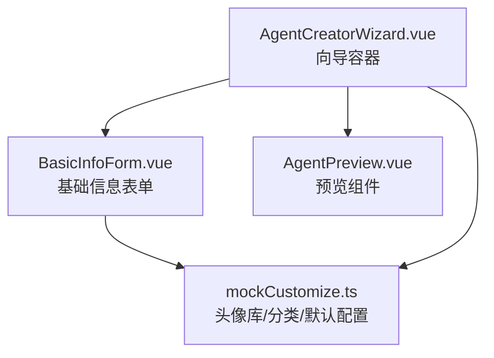
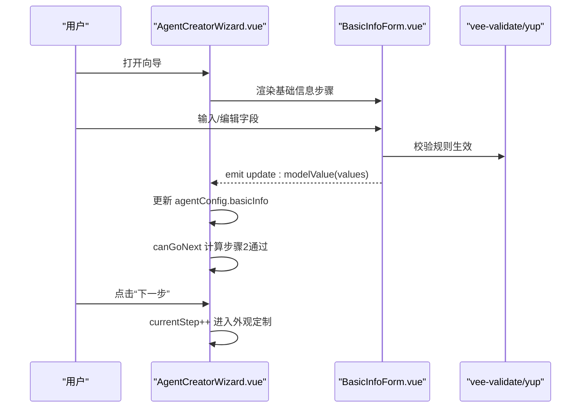
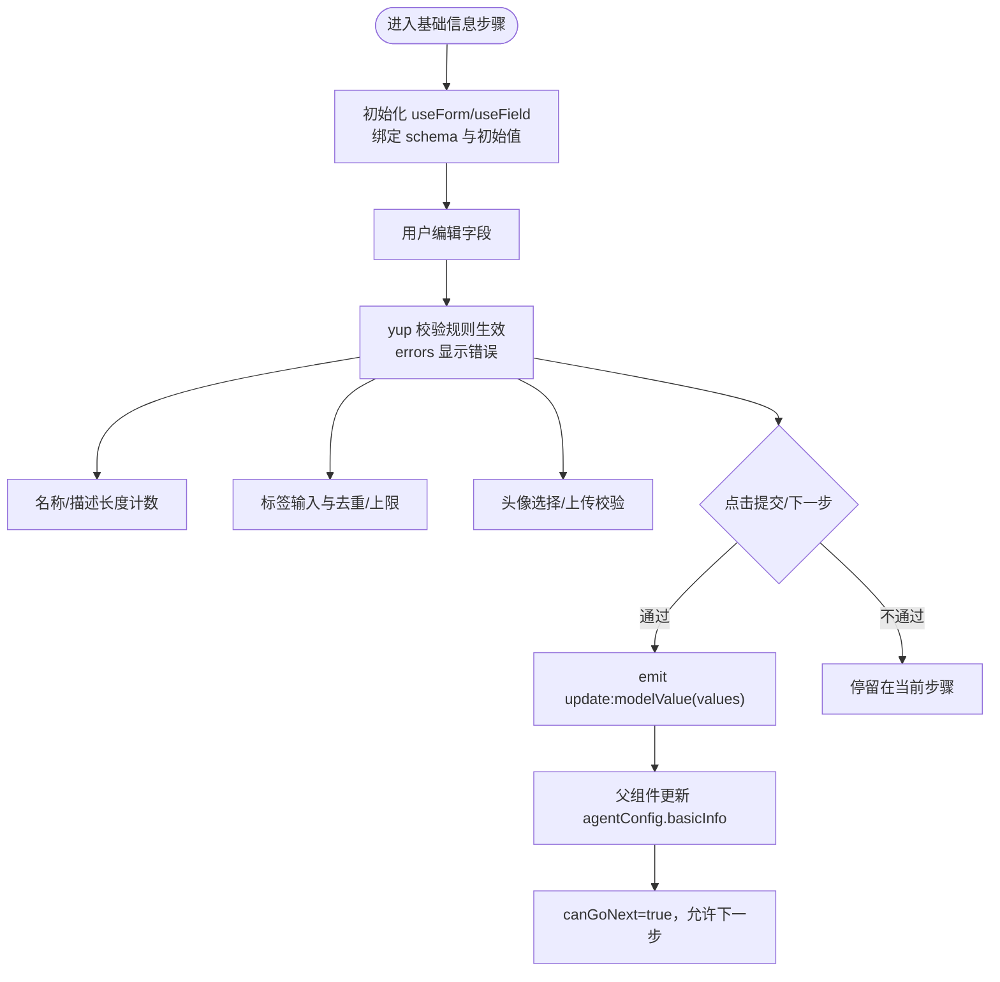
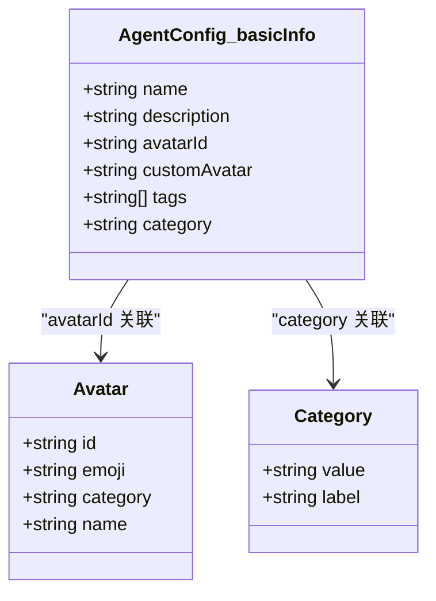
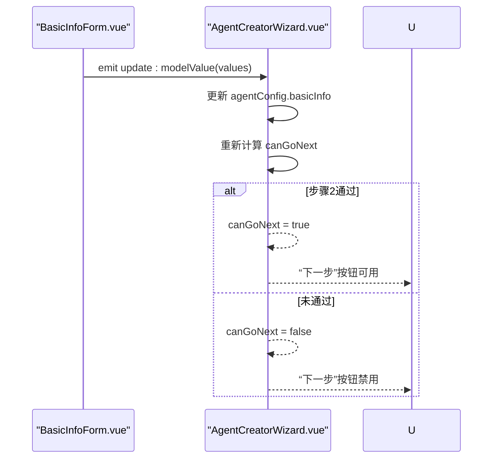
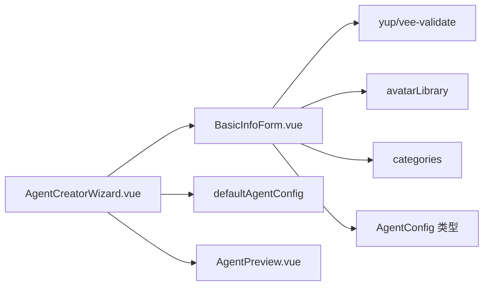

# 基础信息配置步骤

<cite>
**本文引用的文件**
- [BasicInfoForm.vue](file://apps/AgentPit/src/components/customize/BasicInfoForm.vue)
- [AgentCreatorWizard.vue](file://apps/AgentPit/src/components/customize/AgentCreatorWizard.vue)
- [mockCustomize.ts](file://apps/AgentPit/src/data/mockCustomize.ts)
</cite>

## 目录
1. [简介](#简介)
2. [项目结构](#项目结构)
3. [核心组件](#核心组件)
4. [架构总览](#架构总览)
5. [详细组件分析](#详细组件分析)
6. [依赖关系分析](#依赖关系分析)
7. [性能考量](#性能考量)
8. [故障排查指南](#故障排查指南)
9. [结论](#结论)
10. [附录](#附录)

## 简介
本章节聚焦于“智能体创建向导”的基础信息配置步骤，围绕 BasicInfoForm 组件展开，系统性阐述以下内容：
- 基础信息字段：智能体名称、描述、头像、标签、分类
- 数据结构与校验规则：字段类型、长度限制、必填约束、枚举值
- 用户交互逻辑：输入、粘贴、键盘事件、头像选择与上传、标签增删
- 全局状态联动：通过 v-model 与父组件共享状态；通过表单提交事件触发下一步
- 向导导航控制：onSubmit 触发父组件 AgentCreatorWizard 的下一步推进

## 项目结构
该功能位于 AgentPit 应用的“定制化”模块下，采用分步向导模式：
- AgentCreatorWizard.vue：向导容器，管理步骤、进度、全局 AgentConfig
- BasicInfoForm.vue：基础信息表单，负责名称、描述、头像、标签、分类的采集与校验
- mockCustomize.ts：提供头像库、分类列表、默认配置等数据支撑

图示来源
- [AgentCreatorWizard.vue:1-300](file://apps/AgentPit/src/components/customize/AgentCreatorWizard.vue#L1-L300)
- [BasicInfoForm.vue:1-284](file://apps/AgentPit/src/components/customize/BasicInfoForm.vue#L1-L284)
- [mockCustomize.ts:143-177](file://apps/AgentPit/src/data/mockCustomize.ts#L143-L177)
- [mockCustomize.ts:868-876](file://apps/AgentPit/src/data/mockCustomize.ts#L868-L876)
- [mockCustomize.ts:878-910](file://apps/AgentPit/src/data/mockCustomize.ts#L878-L910)

章节来源
- [AgentCreatorWizard.vue:1-300](file://apps/AgentPit/src/components/customize/AgentCreatorWizard.vue#L1-L300)
- [BasicInfoForm.vue:1-284](file://apps/AgentPit/src/components/customize/BasicInfoForm.vue#L1-L284)
- [mockCustomize.ts:143-177](file://apps/AgentPit/src/data/mockCustomize.ts#L143-L177)
- [mockCustomize.ts:868-876](file://apps/AgentPit/src/data/mockCustomize.ts#L868-L876)
- [mockCustomize.ts:878-910](file://apps/AgentPit/src/data/mockCustomize.ts#L878-L910)

## 核心组件
- BasicInfoForm.vue
  - 使用 vee-validate + yup 进行表单校验
  - 提供名称、描述、头像、标签、分类等字段
  - 通过 v-model 将内部状态同步到父组件
- AgentCreatorWizard.vue
  - 维护当前步骤、全局 AgentConfig
  - 控制“下一步/上一步/完成”按钮可用性
  - 在步骤 2（基础信息）完成后推进到下一步
- mockCustomize.ts
  - 提供 avatarLibrary、categories、defaultAgentConfig 等数据

章节来源
- [BasicInfoForm.vue:16-27](file://apps/AgentPit/src/components/customize/BasicInfoForm.vue#L16-L27)
- [AgentCreatorWizard.vue:20-57](file://apps/AgentPit/src/components/customize/AgentCreatorWizard.vue#L20-L57)
- [mockCustomize.ts:868-876](file://apps/AgentPit/src/data/mockCustomize.ts#L868-L876)
- [mockCustomize.ts:878-910](file://apps/AgentPit/src/data/mockCustomize.ts#L878-L910)

## 架构总览
向导以“步骤”为单位推进，基础信息步骤负责收集关键元数据，并在通过校验后解锁后续步骤。

图示来源
- [AgentCreatorWizard.vue:20-57](file://apps/AgentPit/src/components/customize/AgentCreatorWizard.vue#L20-L57)
- [AgentCreatorWizard.vue:210-212](file://apps/AgentPit/src/components/customize/AgentCreatorWizard.vue#L210-L212)
- [BasicInfoForm.vue:113-115](file://apps/AgentPit/src/components/customize/BasicInfoForm.vue#L113-L115)

## 详细组件分析

### BasicInfoForm 组件实现机制
- 表单字段与数据结构
  - 名称：字符串，必填，最小 2，最大 50
  - 描述：字符串，最大 500，支持 Markdown 预览
  - 头像：avatarId（来自头像库），或自定义图片上传（JPG/PNG/WebP，≤2MB）
  - 标签：字符串数组，最多 10 个，支持回车/逗号分隔添加
  - 分类：必选项，来自 categories 列表
- 校验规则与错误提示
  - 使用 yup.object 定义 schema，配合 useForm/useField
  - 错误对象 errors 用于渲染字段级错误
- 用户交互逻辑
  - 名称/描述计数器与长度限制
  - Markdown 预览开关
  - 头像选择弹层与上传文件校验
  - 标签输入框支持 Enter/逗号分隔，带去重与上限控制
  - 分类下拉框绑定必填校验
- 状态更新与事件
  - v-model 绑定到父组件传入的 basicInfo 对象
  - handleSubmit 回调中 emit update:modelValue，将当前 values 同步给父组件
  - 父组件据此更新全局 AgentConfig 并决定下一步是否可点

图示来源
- [BasicInfoForm.vue:16-27](file://apps/AgentPit/src/components/customize/BasicInfoForm.vue#L16-L27)
- [BasicInfoForm.vue:24-33](file://apps/AgentPit/src/components/customize/BasicInfoForm.vue#L24-L33)
- [BasicInfoForm.vue:66-83](file://apps/AgentPit/src/components/customize/BasicInfoForm.vue#L66-L83)
- [BasicInfoForm.vue:91-111](file://apps/AgentPit/src/components/customize/BasicInfoForm.vue#L91-L111)
- [BasicInfoForm.vue:113-115](file://apps/AgentPit/src/components/customize/BasicInfoForm.vue#L113-L115)
- [AgentCreatorWizard.vue:40-46](file://apps/AgentPit/src/components/customize/AgentCreatorWizard.vue#L40-L46)

章节来源
- [BasicInfoForm.vue:16-27](file://apps/AgentPit/src/components/customize/BasicInfoForm.vue#L16-L27)
- [BasicInfoForm.vue:24-33](file://apps/AgentPit/src/components/customize/BasicInfoForm.vue#L24-L33)
- [BasicInfoForm.vue:66-83](file://apps/AgentPit/src/components/customize/BasicInfoForm.vue#L66-L83)
- [BasicInfoForm.vue:91-111](file://apps/AgentPit/src/components/customize/BasicInfoForm.vue#L91-L111)
- [BasicInfoForm.vue:113-115](file://apps/AgentPit/src/components/customize/BasicInfoForm.vue#L113-L115)
- [AgentCreatorWizard.vue:40-46](file://apps/AgentPit/src/components/customize/AgentCreatorWizard.vue#L40-L46)

### 字段数据结构与约束
- 基础信息对象（AgentConfig.basicInfo）
  - name: string（必填，2-50）
  - description: string（可选，≤500）
  - avatarId: string（可选，来自头像库）
  - customAvatar?: string（可选，自定义头像 URL）
  - tags: string[]（可选，最多 10 个）
  - category: string（必填，来自 categories）

图示来源
- [mockCustomize.ts:39-47](file://apps/AgentPit/src/data/mockCustomize.ts#L39-L47)
- [mockCustomize.ts:143-177](file://apps/AgentPit/src/data/mockCustomize.ts#L143-L177)
- [mockCustomize.ts:868-876](file://apps/AgentPit/src/data/mockCustomize.ts#L868-L876)

章节来源
- [mockCustomize.ts:39-47](file://apps/AgentPit/src/data/mockCustomize.ts#L39-L47)
- [mockCustomize.ts:143-177](file://apps/AgentPit/src/data/mockCustomize.ts#L143-L177)
- [mockCustomize.ts:868-876](file://apps/AgentPit/src/data/mockCustomize.ts#L868-L876)

### 表单验证规则与错误处理
- 校验规则
  - name：必填、最小 2、最大 50
  - description：最大 500，默认空字符串
  - avatarId：默认空字符串
  - tags：数组，每项字符串，最多 10 个，默认空数组
  - category：必填，默认“assistant”
- 错误处理
  - errors 对象用于显示字段级错误
  - 输入框边框在错误时高亮
  - 标签/分类/名称等字段均有对应错误提示

章节来源
- [BasicInfoForm.vue:16-22](file://apps/AgentPit/src/components/customize/BasicInfoForm.vue#L16-L22)
- [BasicInfoForm.vue:134-136](file://apps/AgentPit/src/components/customize/BasicInfoForm.vue#L134-L136)
- [BasicInfoForm.vue:155-156](file://apps/AgentPit/src/components/customize/BasicInfoForm.vue#L155-L156)
- [BasicInfoForm.vue:266](file://apps/AgentPit/src/components/customize/BasicInfoForm.vue#L266)

### 用户交互逻辑
- 名称/描述
  - 实时长度计数与最大长度限制
  - 描述支持 Markdown 预览切换
- 头像
  - 点击头像区域打开预设头像选择面板
  - 支持上传自定义图片（JPG/PNG/WebP，≤2MB）
- 标签
  - 输入框支持回车/逗号分隔添加
  - 自动去重、最多 10 个、支持删除
- 分类
  - 下拉框绑定必填校验，选项来自 categories

章节来源
- [BasicInfoForm.vue:124-137](file://apps/AgentPit/src/components/customize/BasicInfoForm.vue#L124-L137)
- [BasicInfoForm.vue:144-165](file://apps/AgentPit/src/components/customize/BasicInfoForm.vue#L144-L165)
- [BasicInfoForm.vue:178-194](file://apps/AgentPit/src/components/customize/BasicInfoForm.vue#L178-L194)
- [BasicInfoForm.vue:196-221](file://apps/AgentPit/src/components/customize/BasicInfoForm.vue#L196-L221)
- [BasicInfoForm.vue:227-252](file://apps/AgentPit/src/components/customize/BasicInfoForm.vue#L227-L252)
- [BasicInfoForm.vue:258-267](file://apps/AgentPit/src/components/customize/BasicInfoForm.vue#L258-L267)

### 全局状态联动与导航控制
- onChange 回调
  - v-model 绑定 agentConfig.basicInfo，BasicInfoForm 内部通过 useField 获取字段值
  - handleSubmit 中 emit update:modelValue，父组件接收并更新全局配置
- onValidationChange 影响导航
  - AgentCreatorWizard 计算 canGoNext：步骤 2 通过条件为 name≥2 且 category 非空
  - 当 canGoNext 为真时，“下一步”按钮启用，允许进入外观定制步骤

图示来源
- [BasicInfoForm.vue:113-115](file://apps/AgentPit/src/components/customize/BasicInfoForm.vue#L113-L115)
- [AgentCreatorWizard.vue:32-34](file://apps/AgentPit/src/components/customize/AgentCreatorWizard.vue#L32-L34)
- [AgentCreatorWizard.vue:40-46](file://apps/AgentPit/src/components/customize/AgentCreatorWizard.vue#L40-L46)

章节来源
- [BasicInfoForm.vue:113-115](file://apps/AgentPit/src/components/customize/BasicInfoForm.vue#L113-L115)
- [AgentCreatorWizard.vue:32-34](file://apps/AgentPit/src/components/customize/AgentCreatorWizard.vue#L32-L34)
- [AgentCreatorWizard.vue:40-46](file://apps/AgentPit/src/components/customize/AgentCreatorWizard.vue#L40-L46)

## 依赖关系分析
- BasicInfoForm 依赖
  - vee-validate/yup：表单校验
  - avatarLibrary、categories、AgentConfig 类型：数据与类型支撑
- AgentCreatorWizard 依赖
  - defaultAgentConfig：初始配置
  - 各步骤组件：作为步骤内容区渲染
  - provide/inject：向子组件注入 agentConfig

图示来源
- [BasicInfoForm.vue:3-5](file://apps/AgentPit/src/components/customize/BasicInfoForm.vue#L3-L5)
- [mockCustomize.ts:143-177](file://apps/AgentPit/src/data/mockCustomize.ts#L143-L177)
- [mockCustomize.ts:868-876](file://apps/AgentPit/src/data/mockCustomize.ts#L868-L876)
- [mockCustomize.ts:878-910](file://apps/AgentPit/src/data/mockCustomize.ts#L878-L910)
- [AgentCreatorWizard.vue:32-37](file://apps/AgentPit/src/components/customize/AgentCreatorWizard.vue#L32-L37)

章节来源
- [BasicInfoForm.vue:3-5](file://apps/AgentPit/src/components/customize/BasicInfoForm.vue#L3-L5)
- [mockCustomize.ts:143-177](file://apps/AgentPit/src/data/mockCustomize.ts#L143-L177)
- [mockCustomize.ts:868-876](file://apps/AgentPit/src/data/mockCustomize.ts#L868-L876)
- [mockCustomize.ts:878-910](file://apps/AgentPit/src/data/mockCustomize.ts#L878-L910)
- [AgentCreatorWizard.vue:32-37](file://apps/AgentPit/src/components/customize/AgentCreatorWizard.vue#L32-L37)

## 性能考量
- 表单校验
  - 使用集中式 schema 与 useForm/useField，避免重复校验逻辑
  - 错误渲染仅在字段变化时触发，减少不必要的重渲染
- 头像上传
  - 文件读取使用 FileReader 异步处理，避免阻塞主线程
  - 上传前进行类型与大小校验，失败即早返回
- 标签输入
  - 输入框防抖与去重策略降低数组操作频率
  - 最大数量限制在前端即时生效，避免无效提交

## 故障排查指南
- 常见问题
  - 名称长度不符：确保 2-50 字符，超出将显示错误
  - 分类未选择：分类为必填项，需选择有效值
  - 标签过多：最多 10 个，超出将禁用输入框
  - 头像上传失败：检查文件类型与大小限制
- 调试建议
  - 在父组件监听 update:modelValue，打印 agentConfig.basicInfo 校验结果
  - 使用浏览器开发者工具查看 errors 对象，定位具体字段错误
  - 检查 categories 与 avatarLibrary 是否正确加载

章节来源
- [BasicInfoForm.vue:16-22](file://apps/AgentPit/src/components/customize/BasicInfoForm.vue#L16-L22)
- [BasicInfoForm.vue:91-111](file://apps/AgentPit/src/components/customize/BasicInfoForm.vue#L91-L111)
- [AgentCreatorWizard.vue:40-46](file://apps/AgentPit/src/components/customize/AgentCreatorWizard.vue#L40-L46)

## 结论
BasicInfoForm 通过清晰的字段设计、严格的校验规则与友好的交互体验，为智能体创建提供了可靠的基础信息采集入口。结合 AgentCreatorWizard 的导航控制，实现了从模板选择到最终创建的顺畅流程。遵循本文的最佳实践，可进一步提升表单的稳定性与用户体验。

## 附录
- 表单配置示例（字段与约束）
  - 名称：必填，2-50 字符
  - 描述：可选，≤500 字符，支持 Markdown 预览
  - 头像：avatarId（来自头像库）或自定义图片（JPG/PNG/WebP，≤2MB）
  - 标签：最多 10 个，支持回车/逗号分隔，自动去重
  - 分类：必填，来自 categories 列表
- 最佳实践
  - 在父组件中监听 update:modelValue，及时保存到持久化存储
  - 使用 canGoNext 控制按钮状态，避免无效提交
  - 对上传文件进行严格校验并在 UI 上明确提示
  - 为每个字段提供清晰的占位符与辅助文案