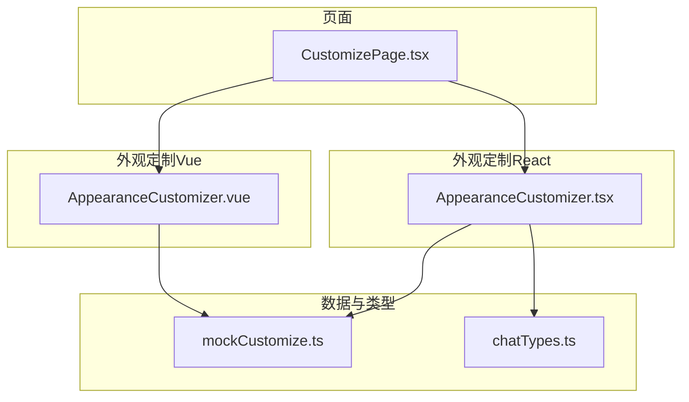
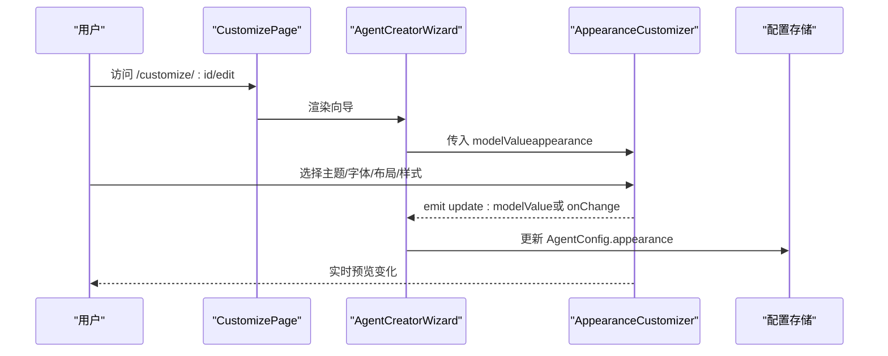
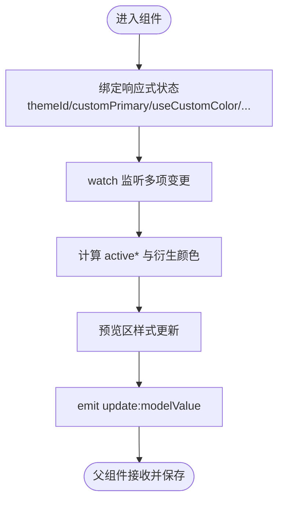
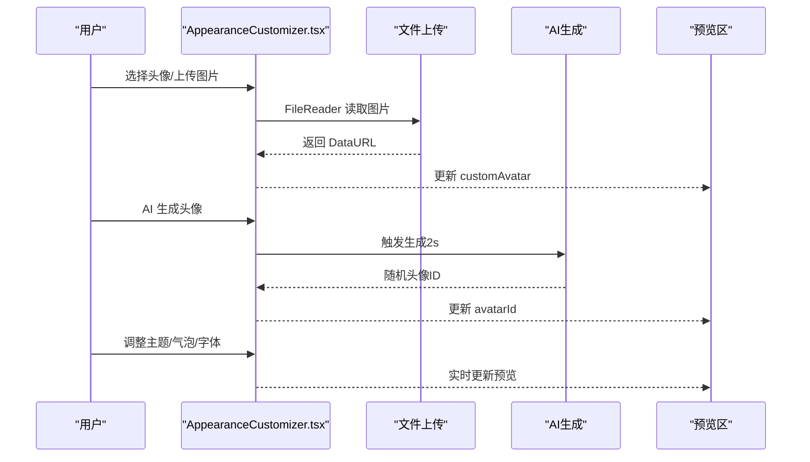
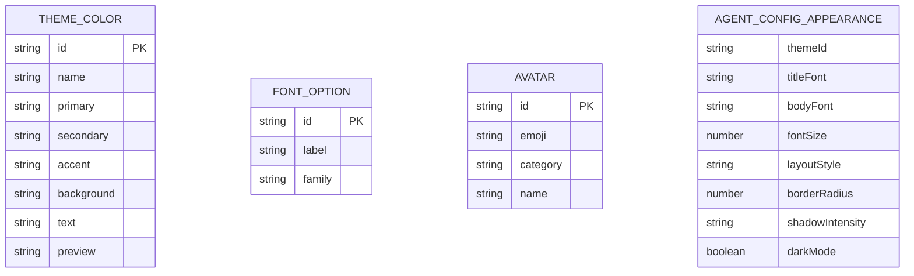
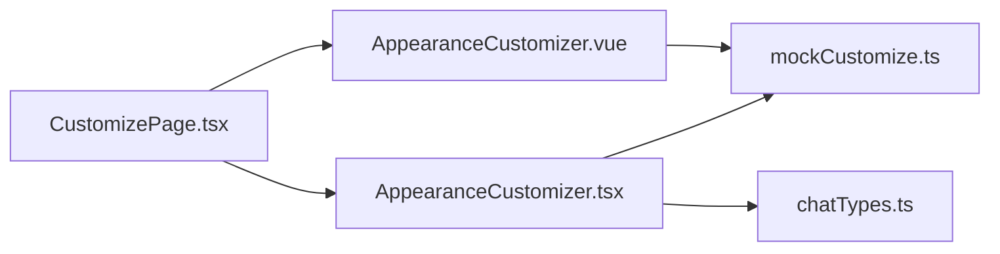

# 形象定制步骤

<cite>
**本文引用的文件**
- [AppearanceCustomizer.vue](file://apps/AgentPit/src/components/customize/AppearanceCustomizer.vue)
- [AppearanceCustomizer.tsx](file://apps/AgentPit/src-react-backup-20260410/components/customize/AppearanceCustomizer.tsx)
- [mockCustomize.ts](file://apps/AgentPit/src/data/mockCustomize.ts)
- [CustomizePage.tsx](file://apps/AgentPit/src-react-backup-20260410/pages/CustomizePage.tsx)
- [chatTypes.ts](file://apps/AgentPit/src-react-backup-20260410/types/chatTypes.ts)
</cite>

## 目录
1. [简介](#简介)
2. [项目结构](#项目结构)
3. [核心组件](#核心组件)
4. [架构总览](#架构总览)
5. [详细组件分析](#详细组件分析)
6. [依赖关系分析](#依赖关系分析)
7. [性能考量](#性能考量)
8. [故障排查指南](#故障排查指南)
9. [结论](#结论)
10. [附录](#附录)

## 简介
本文件面向“智能体创建向导”的“形象定制步骤”，聚焦于 AppearanceCustomizer 组件在 Vue 和 React 两套实现下的功能与交互，涵盖：
- 智能体外观设置：主题配色、头像选择与上传、字体与字号、布局风格、样式细节（圆角、阴影、深色模式）
- 对话样式定制：对话气泡圆角、透明度、边框样式、字体家族、问候语
- 实时预览机制：通过计算属性/状态变更即时反映到预览区
- 回调更新：通过 onChange 或 update:modelValue 将配置回传给父级表单或向导流程
- 设计系统与可访问性：颜色对比、无障碍标签、响应式布局与跨浏览器兼容建议

## 项目结构
与“形象定制步骤”直接相关的文件组织如下：
- Vue 实现：AppearanceCustomizer.vue 负责外观配置与实时预览
- React 实现：AppearanceCustomizer.tsx 提供更丰富的头像上传、AI 生成头像、对话气泡样式定制
- 数据模型：mockCustomize.ts 定义 AgentConfig、主题色、字体选项、头像库等
- 页面入口：CustomizePage.tsx 控制路由与页面渲染
- 类型定义：chatTypes.ts 提供消息与会话相关类型（用于对话预览）

图表来源
- [AppearanceCustomizer.vue:1-332](file://apps/AgentPit/src/components/customize/AppearanceCustomizer.vue#L1-L332)
- [AppearanceCustomizer.tsx:1-514](file://apps/AgentPit/src-react-backup-20260410/components/customize/AppearanceCustomizer.tsx#L1-L514)
- [mockCustomize.ts:1-911](file://apps/AgentPit/src/data/mockCustomize.ts#L1-L911)
- [CustomizePage.tsx:1-54](file://apps/AgentPit/src-react-backup-20260410/pages/CustomizePage.tsx#L1-L54)
- [chatTypes.ts:1-49](file://apps/AgentPit/src-react-backup-20260410/types/chatTypes.ts#L1-L49)

章节来源
- [AppearanceCustomizer.vue:1-332](file://apps/AgentPit/src/components/customize/AppearanceCustomizer.vue#L1-L332)
- [AppearanceCustomizer.tsx:1-514](file://apps/AgentPit/src-react-backup-20260410/components/customize/AppearanceCustomizer.tsx#L1-L514)
- [mockCustomize.ts:1-911](file://apps/AgentPit/src/data/mockCustomize.ts#L1-L911)
- [CustomizePage.tsx:1-54](file://apps/AgentPit/src-react-backup-20260410/pages/CustomizePage.tsx#L1-L54)
- [chatTypes.ts:1-49](file://apps/AgentPit/src-react-backup-20260410/types/chatTypes.ts#L1-L49)

## 核心组件
- Vue 版 AppearanceCustomizer.vue
  - 输入：modelValue（AgentConfig.appearance）
  - 输出：update:modelValue（实时回传）
  - 关键功能：主题色选择、自定义主色、字体与字号、布局风格、圆角与阴影、深色模式、重置默认
  - 实时预览：通过计算属性 activePrimary/Secondary/Accent/Background 与 Computed 颜色衍生值联动
- React 版 AppearanceCustomizer.tsx
  - 输入：data（包含 avatarId、customAvatar、themeId、customColors、bubbleStyle、fontFamily、greeting）
  - 输出：onChange（实时回传）
  - 关键功能：头像分类筛选、头像网格、上传图片、AI 生成头像、主题色选择/自定义、对话气泡样式、字体与问候语
  - 实时预览：右侧预览区动态渲染对话气泡与头像

章节来源
- [AppearanceCustomizer.vue:1-332](file://apps/AgentPit/src/components/customize/AppearanceCustomizer.vue#L1-L332)
- [AppearanceCustomizer.tsx:1-514](file://apps/AgentPit/src-react-backup-20260410/components/customize/AppearanceCustomizer.tsx#L1-L514)

## 架构总览
从“创建向导”到“外观定制”的典型流程：
- 页面入口：CustomizePage 根据路由参数决定渲染 AgentCreatorWizard 或 MyAgentsList
- 向导组件：接收 AgentConfig，分步保存各步骤配置
- 外观定制：AppearanceCustomizer 将用户操作映射为 AgentConfig.appearance，并通过回调回传
- 预览：在向导内或独立页面实时预览最终效果

图表来源
- [CustomizePage.tsx:1-54](file://apps/AgentPit/src-react-backup-20260410/pages/CustomizePage.tsx#L1-L54)
- [AppearanceCustomizer.vue:1-332](file://apps/AgentPit/src/components/customize/AppearanceCustomizer.vue#L1-L332)
- [AppearanceCustomizer.tsx:1-514](file://apps/AgentPit/src-react-backup-20260410/components/customize/AppearanceCustomizer.tsx#L1-L514)

## 详细组件分析

### Vue 版 AppearanceCustomizer 组件
- 数据绑定与状态
  - 使用 ref/computed/watch 管理 themeId、customPrimary、useCustomColor、titleFont、bodyFont、fontSize、layoutStyle、borderRadius、shadowIntensity、darkMode
  - 通过 watch 监听多个响应式值，触发 emitUpdate，实现“所见即所得”
- 主题与颜色
  - 主题色来自 themeColors，支持“使用自定义颜色”开关
  - 计算属性 activePrimary/Secondary/Accent/Background 决定预览与样式
  - 衍生颜色：互补色、类似色，便于色彩搭配建议
- 字体与字号
  - 字体族来自 fontOptions；字号范围 12–24px
  - 预览区实时展示标题与正文的字体与字号
- 布局风格
  - 卡片式、列表式、时间线式、仪表盘式四种布局
- 样式细节
  - 圆角 0–20px；阴影强度 none/light/medium/heavy；深色模式开关
- 实时预览
  - 预览容器动态应用主色渐变、圆角、阴影与背景色
- 回调更新
  - emit('update:modelValue', appearance) 将完整配置回传给父组件

图表来源
- [AppearanceCustomizer.vue:1-332](file://apps/AgentPit/src/components/customize/AppearanceCustomizer.vue#L1-L332)

章节来源
- [AppearanceCustomizer.vue:1-332](file://apps/AgentPit/src/components/customize/AppearanceCustomizer.vue#L1-L332)
- [mockCustomize.ts:1-911](file://apps/AgentPit/src/data/mockCustomize.ts#L1-L911)

### React 版 AppearanceCustomizer 组件
- 头像设置
  - 分类筛选：全部/人物/动物/抽象/科技
  - 头像网格：点击选中；支持上传图片（FileReader 转 DataURL）；支持 AI 生成头像（模拟异步）
- 主题配色
  - 支持选择内置主题或启用自定义三色（主色、辅色、强调色）
- 对话气泡样式
  - 圆角、透明度、边框样式（无/实线/虚线/点线）
- 字体与问候语
  - 字体家族下拉；问候语多行文本，带长度提示
- 实时预览
  - 右侧预览区渲染智能体与用户消息气泡，动态应用头像、颜色、字体、气泡样式

图表来源
- [AppearanceCustomizer.tsx:1-514](file://apps/AgentPit/src-react-backup-20260410/components/customize/AppearanceCustomizer.tsx#L1-L514)

章节来源
- [AppearanceCustomizer.tsx:1-514](file://apps/AgentPit/src-react-backup-20260410/components/customize/AppearanceCustomizer.tsx#L1-L514)
- [mockCustomize.ts:1-911](file://apps/AgentPit/src/data/mockCustomize.ts#L1-L911)
- [chatTypes.ts:1-49](file://apps/AgentPit/src-react-backup-20260410/types/chatTypes.ts#L1-L49)

### 数据模型与设计系统
- AgentConfig.appearance 字段
  - themeId、customColors、titleFont、bodyFont、fontSize、layoutStyle、borderRadius、shadowIntensity、darkMode
- 主题色 ThemeColor
  - 包含 id、name、primary/secondary/accent/background/text、preview 渐变
- 字体选项 fontOptions
  - 系统默认、Inter、Roboto、Noto Sans SC、Playfair Display、Source Han Serif
- 头像库 avatarLibrary
  - 按类别（person/animal/abstract/tech/nature/food）组织

图表来源
- [mockCustomize.ts:1-911](file://apps/AgentPit/src/data/mockCustomize.ts#L1-L911)

章节来源
- [mockCustomize.ts:1-911](file://apps/AgentPit/src/data/mockCustomize.ts#L1-L911)

## 依赖关系分析
- AppearanceCustomizer.vue
  - 依赖：themeColors、fontOptions、AgentConfig.appearance 类型
  - 通过 emit('update:modelValue') 与父组件通信
- AppearanceCustomizer.tsx
  - 依赖：avatarLibrary、themeColors、chatTypes（用于消息预览）
  - 通过 onChange 回调与父组件通信
- 页面层
  - CustomizePage 根据路由渲染不同视图，承载向导与列表

图表来源
- [AppearanceCustomizer.vue:1-332](file://apps/AgentPit/src/components/customize/AppearanceCustomizer.vue#L1-L332)
- [AppearanceCustomizer.tsx:1-514](file://apps/AgentPit/src-react-backup-20260410/components/customize/AppearanceCustomizer.tsx#L1-L514)
- [mockCustomize.ts:1-911](file://apps/AgentPit/src/data/mockCustomize.ts#L1-L911)
- [chatTypes.ts:1-49](file://apps/AgentPit/src-react-backup-20260410/types/chatTypes.ts#L1-L49)
- [CustomizePage.tsx:1-54](file://apps/AgentPit/src-react-backup-20260410/pages/CustomizePage.tsx#L1-L54)

章节来源
- [AppearanceCustomizer.vue:1-332](file://apps/AgentPit/src/components/customize/AppearanceCustomizer.vue#L1-L332)
- [AppearanceCustomizer.tsx:1-514](file://apps/AgentPit/src-react-backup-20260410/components/customize/AppearanceCustomizer.tsx#L1-L514)
- [CustomizePage.tsx:1-54](file://apps/AgentPit/src-react-backup-20260410/pages/CustomizePage.tsx#L1-L54)

## 性能考量
- Vue 实时更新
  - 使用 watch 监听多个字段，建议在高频交互场景下考虑节流/防抖，避免频繁回传
  - 预览区样式计算量较小，但应避免在极端尺寸下重复计算
- React 实时更新
  - onChange 在每次输入/滑块移动时触发，建议在父组件合并多次变更后再持久化
  - 文件上传使用 FileReader，注意大文件处理与内存占用
- 预览渲染
  - 预览区仅做样式拼接，不涉及复杂 DOM 操作；如需进一步优化，可将预览区拆分为独立组件并按需渲染

## 故障排查指南
- 颜色预览异常
  - 检查 useCustomColor 开关与 themeId 是否正确切换
  - 确认 activePrimary/Secondary/Accent 的计算链路是否生效
- 字体预览不生效
  - 确认 fontOptions 中对应 id 的 family 是否正确
  - 检查预览区的 fontFamily/fontSize 应用是否覆盖
- 深色模式未生效
  - 确认 darkMode 状态与预览区背景色/文字色的条件分支
- 头像上传失败
  - 检查 FileReader 读取与 onChange 回传路径
  - 确认 customAvatar 清除逻辑
- AI 生成头像卡顿
  - 检查 isGeneratingAI 状态与禁用按钮逻辑
  - 确认 onChange 回传的 avatarId 是否存在

章节来源
- [AppearanceCustomizer.vue:1-332](file://apps/AgentPit/src/components/customize/AppearanceCustomizer.vue#L1-L332)
- [AppearanceCustomizer.tsx:1-514](file://apps/AgentPit/src-react-backup-20260410/components/customize/AppearanceCustomizer.tsx#L1-L514)

## 结论
- Vue 与 React 两套实现均提供了完整的外观定制能力，覆盖主题、字体、布局、样式细节与实时预览
- 回调机制清晰：Vue 使用 update:modelValue，React 使用 onChange，均可将配置回传至向导或父组件
- React 版在头像上传、AI 生成与对话气泡样式方面更为丰富，适合需要强交互体验的场景
- 建议在生产环境中结合节流/防抖与状态合并策略，提升交互流畅度与性能

## 附录

### 自定义选项一览（基于数据模型）
- 主题与颜色
  - 主题：选择内置主题或关闭“使用自定义颜色”
  - 自定义：主色、辅色、强调色（支持颜色选择器与十六进制输入）
- 字体与字号
  - 标题字体、正文字体（从 fontOptions 选择）
  - 字号：12–24px 滑块调节
- 布局风格
  - 卡片式、列表式、时间线式、仪表盘式
- 样式细节
  - 圆角：0–20px
  - 阴影强度：无/轻/中/重
  - 深色模式：开关切换
- 对话气泡样式（React 版）
  - 圆角、透明度、边框样式（无/实线/虚线/点线）
  - 字体家族、个性化问候语（最多 200 字）

章节来源
- [mockCustomize.ts:1-911](file://apps/AgentPit/src/data/mockCustomize.ts#L1-L911)
- [AppearanceCustomizer.vue:1-332](file://apps/AgentPit/src/components/customize/AppearanceCustomizer.vue#L1-L332)
- [AppearanceCustomizer.tsx:1-514](file://apps/AgentPit/src-react-backup-20260410/components/customize/AppearanceCustomizer.tsx#L1-L514)

### 设计系统与可访问性建议
- 对比度与可读性
  - 确保主色与文字色满足 WCAG 对比度要求；深色模式下优先使用浅色文字
- 无障碍标签
  - 所有交互元素添加 aria-label 或 aria-describedby
  - 滑块与颜色选择器提供数值/十六进制提示
- 响应式设计
  - 使用 grid/sm:grid-cols-* 适配移动端；预览区最小高度与滚动处理
- 跨浏览器兼容
  - 颜色选择器与 range 滑块在旧版浏览器可能降级，建议提供替代输入框
  - FileReader 与 CSS 渐变在低端设备上注意性能