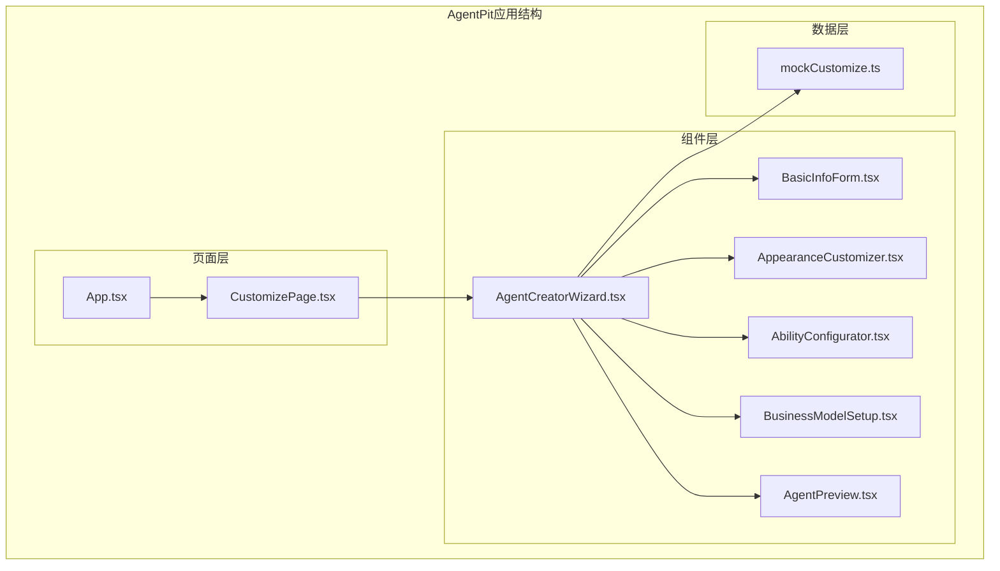
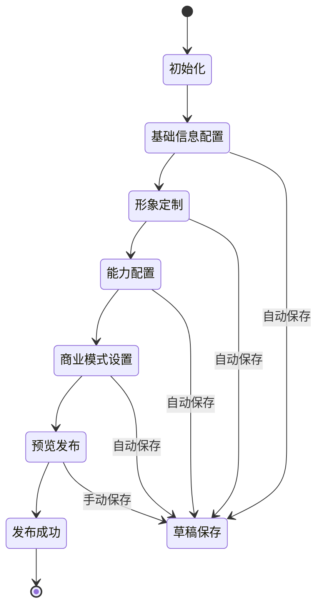
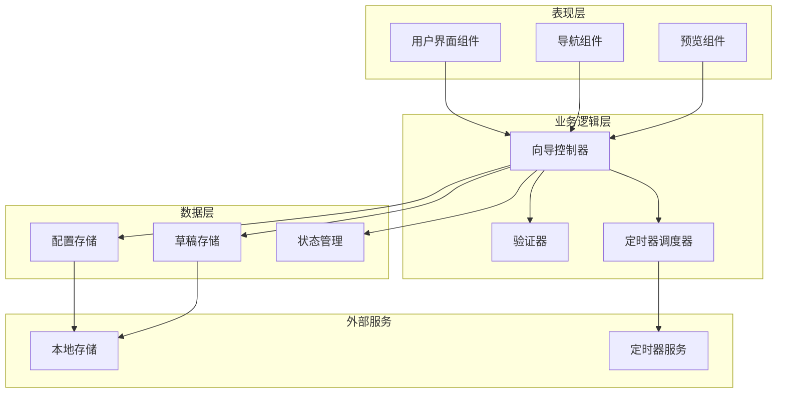
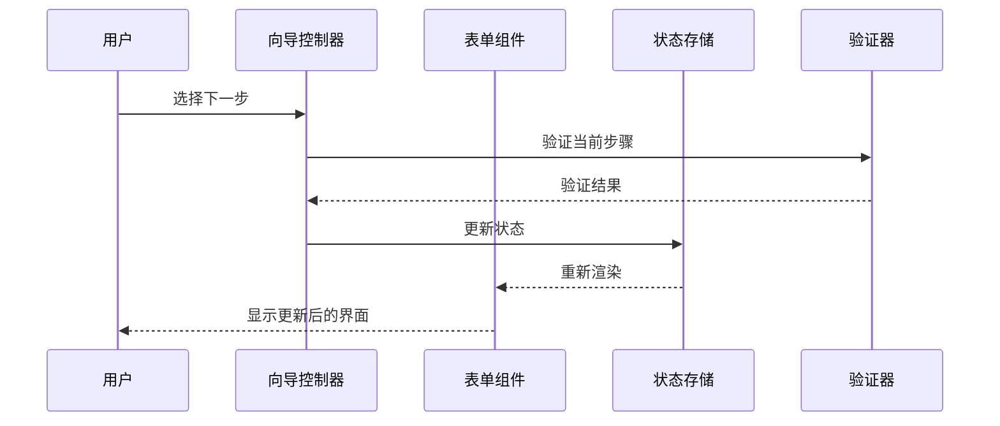
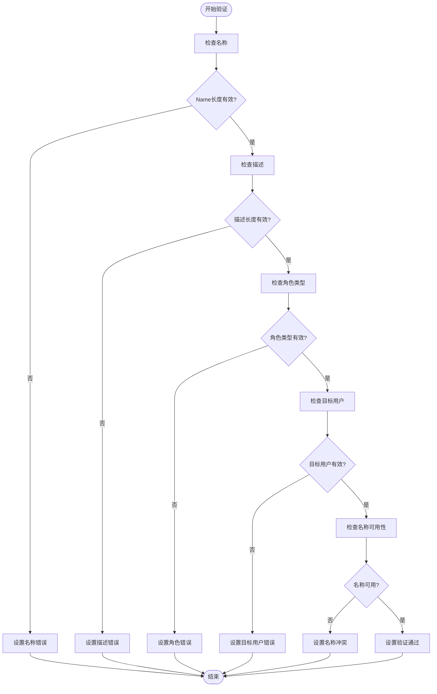
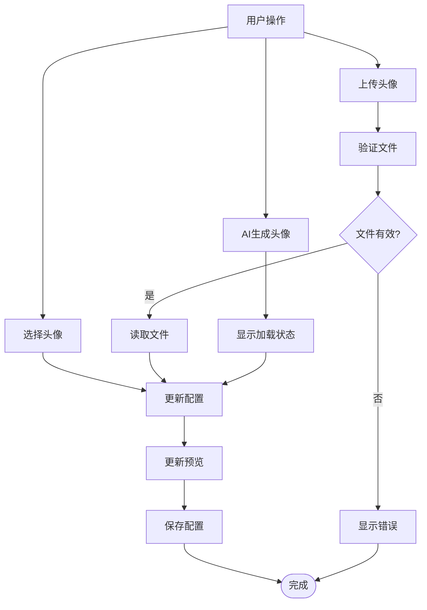
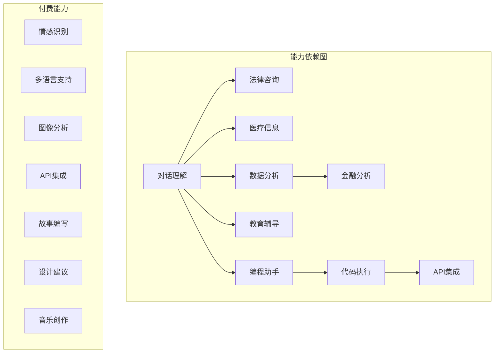
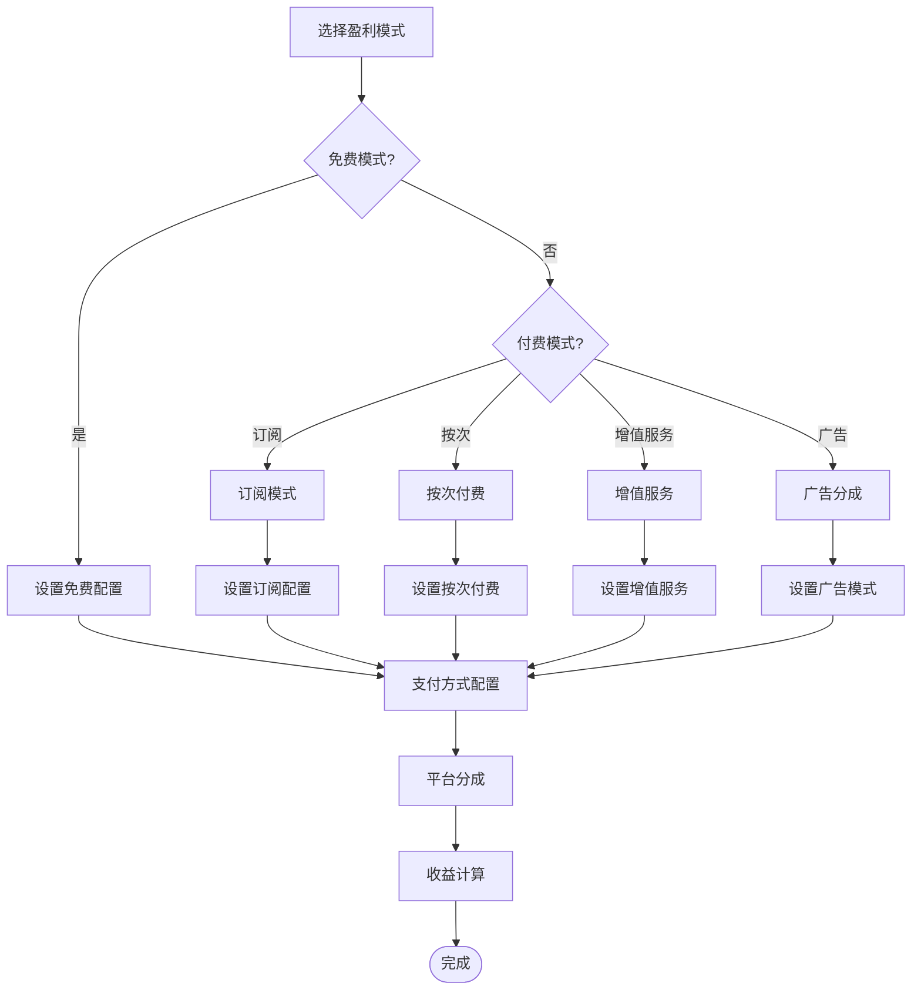
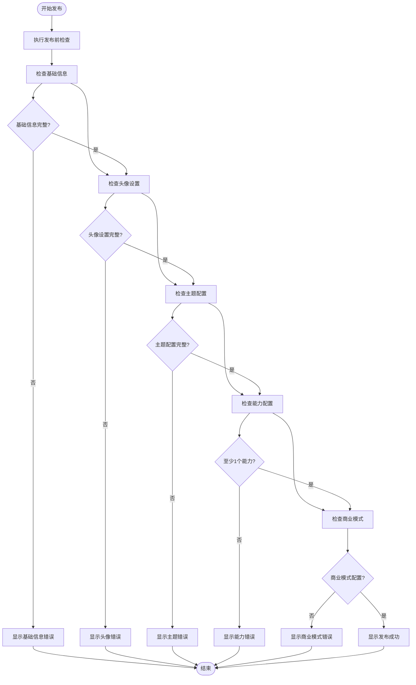
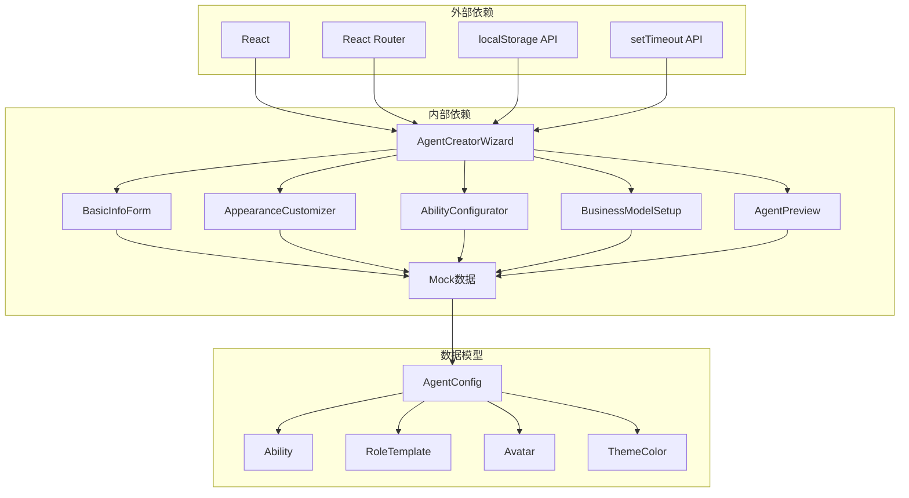

# 智能体创建向导

<cite>
**本文档引用的文件**
- [AgentCreatorWizard.tsx](file://apps/AgentPit/src-react-backup-20260410/components/customize/AgentCreatorWizard.tsx)
- [BasicInfoForm.tsx](file://apps/AgentPit/src-react-backup-20260410/components/customize/BasicInfoForm.tsx)
- [AppearanceCustomizer.tsx](file://apps/AgentPit/src-react-backup-20260410/components/customize/AppearanceCustomizer.tsx)
- [AbilityConfigurator.tsx](file://apps/AgentPit/src-react-backup-20260410/components/customize/AbilityConfigurator.tsx)
- [BusinessModelSetup.tsx](file://apps/AgentPit/src-react-backup-20260410/components/customize/BusinessModelSetup.tsx)
- [AgentPreview.tsx](file://apps/AgentPit/src-react-backup-20260410/components/customize/AgentPreview.tsx)
- [mockCustomize.ts](file://apps/AgentPit/src-react-backup-20260410/data/mockCustomize.ts)
- [App.tsx](file://apps/AgentPit/src-react-backup-20260410/App.tsx)
- [CustomizePage.tsx](file://apps/AgentPit/src-react-backup-20260410/pages/CustomizePage.tsx)
</cite>

## 目录
1. [引言](#引言)
2. [项目结构](#项目结构)
3. [核心组件](#核心组件)
4. [架构概览](#架构概览)
5. [详细组件分析](#详细组件分析)
6. [依赖关系分析](#依赖关系分析)
7. [性能考虑](#性能考虑)
8. [故障排除指南](#故障排除指南)
9. [结论](#结论)
10. [附录](#附录)

## 引言

智能体创建向导是AgentPit平台中的核心功能模块，为用户提供了一个完整的智能体开发工作流程。该系统采用五步向导模式，从基础信息配置开始，逐步引导用户完成智能体的完整创建过程。

本系统的设计理念是"所见即所得"和"渐进式配置"，通过直观的界面设计和智能的表单验证机制，让用户能够在轻松的环境中创建出符合需求的AI智能体。系统不仅提供了丰富的配置选项，还内置了完善的验证机制、草稿保存功能和实时预览能力。

## 项目结构

智能体创建向导位于AgentPit应用的自定义模块中，采用组件化的架构设计：

**图表来源**
- [App.tsx:15-38](file://apps/AgentPit/src-react-backup-20260410/App.tsx#L15-L38)
- [CustomizePage.tsx:6-51](file://apps/AgentPit/src-react-backup-20260410/pages/CustomizePage.tsx#L6-L51)

**章节来源**
- [App.tsx:1-41](file://apps/AgentPit/src-react-backup-20260410/App.tsx#L1-L41)
- [CustomizePage.tsx:1-54](file://apps/AgentPit/src-react-backup-20260410/pages/CustomizePage.tsx#L1-L54)

## 核心组件

### AgentCreatorWizard - 向导主控制器

AgentCreatorWizard是整个向导系统的核心控制器，负责协调五个步骤之间的导航和状态管理。该组件采用了React Hooks模式，实现了完整的状态管理和生命周期控制。

**核心特性：**
- **步骤导航管理**：通过currentStep状态控制当前显示的步骤
- **全局状态管理**：统一管理agentConfig配置对象
- **验证状态跟踪**：维护每个步骤的验证状态
- **草稿管理系统**：实现自动和手动草稿保存功能
- **发布流程控制**：管理最终发布前的确认流程

**状态管理机制：**

**图表来源**
- [AgentCreatorWizard.tsx:19-161](file://apps/AgentPit/src-react-backup-20260410/components/customize/AgentCreatorWizard.tsx#L19-L161)

**章节来源**
- [AgentCreatorWizard.tsx:19-414](file://apps/AgentPit/src-react-backup-20260410/components/customize/AgentCreatorWizard.tsx#L19-L414)

## 架构概览

智能体创建向导采用分层架构设计，确保了良好的可维护性和扩展性：

**图表来源**
- [AgentCreatorWizard.tsx:33-45](file://apps/AgentPit/src-react-backup-20260410/components/customize/AgentCreatorWizard.tsx#L33-L45)

### 数据流架构

系统采用单向数据流设计，确保了数据的一致性和可预测性：

**图表来源**
- [AgentCreatorWizard.tsx:67-84](file://apps/AgentPit/src-react-backup-20260410/components/customize/AgentCreatorWizard.tsx#L67-L84)

## 详细组件分析

### 第一步：基础信息配置 (BasicInfoForm)

基础信息配置是智能体创建的第一步，要求用户提供智能体的基本属性信息。

**核心字段：**
- **智能体名称**：2-20字符长度限制，支持重复检测
- **智能体描述**：10-500字符长度限制
- **角色类型**：基于角色模板的选择
- **目标用户群体**：描述智能体的服务对象
- **语言设置**：支持中文、英文、多语言

**验证机制：**

**图表来源**
- [BasicInfoForm.tsx:25-51](file://apps/AgentPit/src-react-backup-20260410/components/customize/BasicInfoForm.tsx#L25-L51)

**最佳实践：**
- 使用角色模板推荐系统能力，提高配置质量
- 提供实时字符计数和剩余字符显示
- 实现异步名称可用性检查，避免重复命名

**章节来源**
- [BasicInfoForm.tsx:16-272](file://apps/AgentPit/src-react-backup-20260410/components/customize/BasicInfoForm.tsx#L16-L272)

### 第二步：形象定制 (AppearanceCustomizer)

形象定制模块允许用户个性化智能体的外观和交互风格。

**核心功能：**
- **头像设置**：支持预设头像、自定义上传、AI生成
- **主题配色**：提供12种预设主题和自定义颜色支持
- **对话样式**：圆角大小、透明度、边框样式的实时预览
- **字体选择**：多种字体样式的切换
- **问候语定制**：个性化的开场白设置

**头像管理流程：**

**图表来源**
- [AppearanceCustomizer.tsx:51-69](file://apps/AgentPit/src-react-backup-20260410/components/customize/AppearanceCustomizer.tsx#L51-L69)

**章节来源**
- [AppearanceCustomizer.tsx:25-514](file://apps/AgentPit/src-react-backup-20260410/components/customize/AppearanceCustomizer.tsx#L25-L514)

### 第三步：能力配置 (AbilityConfigurator)

能力配置模块是智能体功能的核心，提供了丰富的能力选择和配置选项。

**能力分类：**
- **通用能力**：对话理解、上下文记忆、情感识别等
- **专业能力**：法律咨询、医疗信息、金融分析等
- **工具调用**：网络搜索、代码执行、图像分析等
- **创意能力**：诗歌创作、故事编写、头脑风暴等

**依赖关系管理：**

**图表来源**
- [mockCustomize.ts:282-437](file://apps/AgentPit/src-react-backup-20260410/data/mockCustomize.ts#L282-L437)

**能力级别系统：**
- **初级**：基础功能，适合入门使用
- **中级**：增强功能，满足一般需求
- **高级**：专业功能，提供深度能力
- **专家**：顶级功能，支持复杂应用场景

**章节来源**
- [AbilityConfigurator.tsx:15-430](file://apps/AgentPit/src-react-backup-20260410/components/customize/AbilityConfigurator.tsx#L15-L430)

### 第四步：商业模式设置 (BusinessModelSetup)

商业模式设置模块为智能体的商业化运营提供完整的配置选项。

**盈利模式：**
- **免费模式**：完全免费，适合个人使用
- **付费订阅**：月费/年费制，提供持续收入
- **按次付费**：单次使用收费，适合高价值服务
- **增值服务**：基础免费，高级功能付费
- **广告分成**：通过广告获得收益

**定价策略：**

**图表来源**
- [BusinessModelSetup.tsx:29-114](file://apps/AgentPit/src-react-backup-20260410/components/customize/BusinessModelSetup.tsx#L29-L114)

**收益预估功能：**
系统内置了智能的收益预估计算器，帮助用户评估不同商业模式的潜在收入：

- **用户规模估算**：基于预估月活跃用户数
- **转化率分析**：付费转化率对收入的影响
- **平台分成计算**：平台抽成对净收入的影响
- **年化收入预测**：提供年度收入预估

**章节来源**
- [BusinessModelSetup.tsx:29-544](file://apps/AgentPit/src-react-backup-20260410/components/customize/BusinessModelSetup.tsx#L29-L544)

### 第五步：预览发布 (AgentPreview)

预览发布模块提供了完整的智能体预览和发布功能。

**预览功能：**
- **总览视图**：显示智能体的整体配置信息
- **对话演示**：实时模拟智能体的对话交互
- **能力清单**：展示所有已启用的能力详情
- **商业模式**：显示商业配置的完整信息

**发布前检查：**

**图表来源**
- [AgentPreview.tsx:22-50](file://apps/AgentPit/src-react-backup-20260410/components/customize/AgentPreview.tsx#L22-L50)

**发布确认流程：**
系统提供了双重确认机制，确保用户不会误操作：

1. **预览确认**：在发布前显示完整的配置摘要
2. **最终确认**：弹出确认对话框进行二次确认
3. **发布状态**：显示发布后的状态信息

**章节来源**
- [AgentPreview.tsx:10-585](file://apps/AgentPit/src-react-backup-20260410/components/customize/AgentPreview.tsx#L10-L585)

## 依赖关系分析

智能体创建向导的组件间依赖关系体现了清晰的分层架构：

**图表来源**
- [AgentCreatorWizard.tsx:1-8](file://apps/AgentPit/src-react-backup-20260410/components/customize/AgentCreatorWizard.tsx#L1-L8)
- [mockCustomize.ts:37-90](file://apps/AgentPit/src-react-backup-20260410/data/mockCustomize.ts#L37-L90)

**章节来源**
- [mockCustomize.ts:1-716](file://apps/AgentPit/src-react-backup-20260410/data/mockCustomize.ts#L1-L716)

## 性能考虑

### 内存管理
- **状态优化**：使用React.memo避免不必要的重渲染
- **定时器清理**：在组件卸载时清理定时器，防止内存泄漏
- **本地存储优化**：限制草稿数量，避免localStorage过度占用

### 渲染性能
- **条件渲染**：只渲染当前步骤的组件
- **防抖机制**：对频繁触发的状态更新使用防抖
- **虚拟滚动**：对于大量选项的列表使用虚拟滚动

### 网络优化
- **异步加载**：头像上传和AI生成使用异步处理
- **缓存策略**：对静态资源使用浏览器缓存
- **懒加载**：非关键路径的组件按需加载

## 故障排除指南

### 常见问题及解决方案

**问题1：草稿无法保存**
- 检查浏览器是否禁用了localStorage
- 确认浏览器隐私设置允许本地存储
- 清理浏览器缓存后重试

**问题2：表单验证不生效**
- 检查网络连接是否正常
- 确认JavaScript是否正确加载
- 刷新页面后重试

**问题3：能力依赖关系异常**
- 检查被依赖能力是否已启用
- 确认依赖链是否完整
- 重新排序能力启用顺序

**问题4：AI生成头像失败**
- 检查网络连接
- 确认AI服务是否可用
- 尝试手动上传头像

**章节来源**
- [AgentCreatorWizard.tsx:86-102](file://apps/AgentPit/src-react-backup-20260410/components/customize/AgentCreatorWizard.tsx#L86-L102)

## 结论

智能体创建向导是一个设计精良、功能完整的用户体验系统。通过五个精心设计的步骤，用户可以轻松地创建出符合需求的AI智能体。

**系统优势：**
- **用户体验优秀**：直观的界面设计和流畅的交互体验
- **功能完整性**：涵盖了智能体创建的所有关键环节
- **扩展性强**：模块化设计便于功能扩展和维护
- **可靠性高**：完善的错误处理和数据保护机制

**技术亮点：**
- 采用React Hooks实现现代化的状态管理
- 实现了完整的离线草稿保存功能
- 提供了智能的验证和预估功能
- 支持实时预览和双向数据绑定

该系统为AgentPit平台的成功奠定了坚实的基础，为用户提供了简单而强大的智能体创建体验。

## 附录

### API接口规范

**向导控制器接口：**
- `currentStep`: 当前步骤状态
- `agentConfig`: 完整的智能体配置
- `handleNext()`: 跳转到下一步
- `handlePrev()`: 返回上一步
- `handleJumpToStep(step)`: 跳转到指定步骤

**表单组件接口：**
- `data`: 表单数据对象
- `onChange(data)`: 数据变更回调
- `onValidationChange(isValid)`: 验证状态变更回调

**预览组件接口：**
- `data`: 预览数据
- `onEditStep(step)`: 编辑步骤回调
- `onPublish()`: 发布回调

### 最佳实践指南

**开发最佳实践：**
- 使用TypeScript确保类型安全
- 实现完整的错误边界处理
- 提供清晰的用户反馈和状态指示
- 确保响应式设计适配各种设备

**用户体验最佳实践：**
- 提供详细的帮助信息和使用提示
- 实现实时验证和即时反馈
- 设计合理的默认值和推荐配置
- 提供便捷的撤销和重做功能

**性能优化最佳实践：**
- 实现组件懒加载和代码分割
- 使用虚拟滚动处理大量数据
- 优化图片和媒体资源的加载
- 实现智能的缓存策略