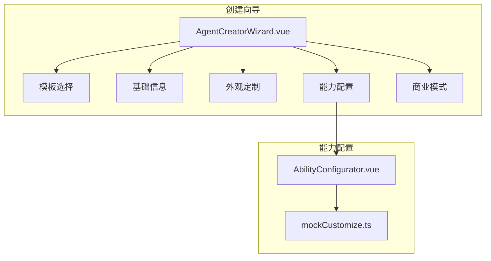
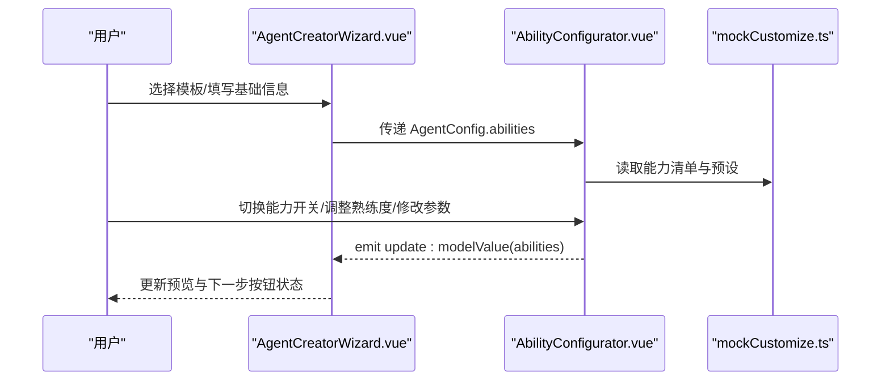
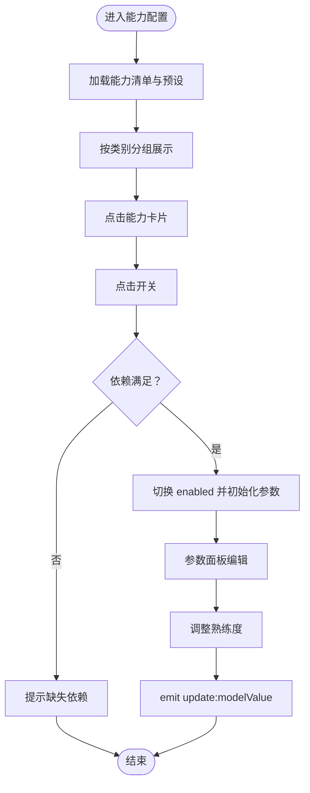
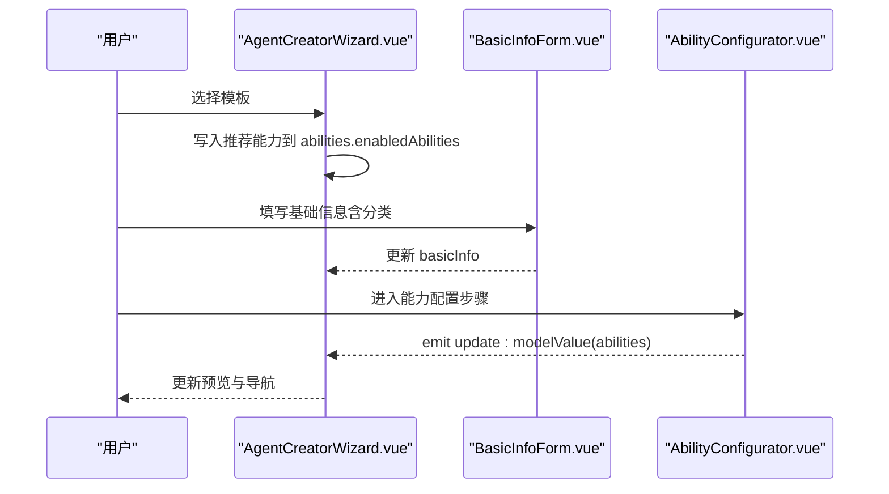
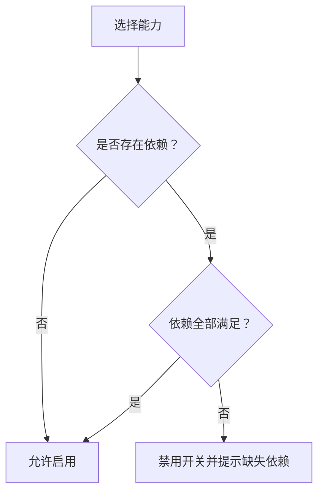
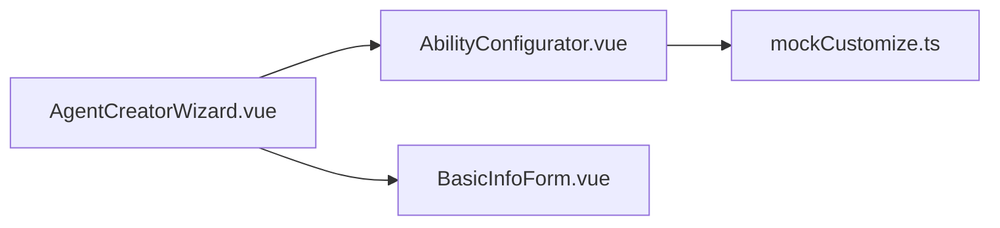

# 能力配置步骤

<cite>
**本文引用的文件**
- [AbilityConfigurator.vue](file://apps/AgentPit/src/components/customize/AbilityConfigurator.vue)
- [AgentCreatorWizard.vue](file://apps/AgentPit/src/components/customize/AgentCreatorWizard.vue)
- [BasicInfoForm.vue](file://apps/AgentPit/src/components/customize/BasicInfoForm.vue)
- [mockCustomize.ts](file://apps/AgentPit/src/data/mockCustomize.ts)
</cite>

## 目录
1. [简介](#简介)
2. [项目结构](#项目结构)
3. [核心组件](#核心组件)
4. [架构总览](#架构总览)
5. [详细组件分析](#详细组件分析)
6. [依赖关系分析](#依赖关系分析)
7. [性能考量](#性能考量)
8. [故障排查指南](#故障排查指南)
9. [结论](#结论)
10. [附录](#附录)

## 简介
本章节聚焦“智能体创建向导”的“能力配置步骤”，围绕 AbilityConfigurator 组件展开，系统阐述以下内容：
- 能力选择与组合机制：如何在不同类别中启用/禁用能力，并对已启用能力进行熟练度与参数配置。
- 不同类型能力的配置界面与参数：对话、分析、创作、工具调用、多模态等类别的能力参数与效果预览。
- 基于基础信息的角色类型动态调整可用能力列表：通过模板与基础信息联动影响能力可用性。
- 能力间依赖关系与冲突处理：依赖满足检查、不可用提示与交互反馈。
- 能力配置 API 说明与最佳实践：组合策略、性能优化与用户体验设计。

## 项目结构
能力配置步骤位于 AgentPit 应用的 customize 子模块中，采用 Vue 单文件组件与 TypeScript 类型定义配合数据模拟文件实现。关键文件如下：
- AbilityConfigurator.vue：能力配置面板，负责能力分组、开关、参数与熟练度配置。
- AgentCreatorWizard.vue：创建向导主容器，串联模板选择、基础信息、外观定制、能力配置与商业模式五个步骤。
- BasicInfoForm.vue：基础信息表单，提供角色类型（分类）等输入，影响后续能力可用性。
- mockCustomize.ts：能力、模板、主题、字体、分类等数据模型与示例数据。

**图表来源**
- [AgentCreatorWizard.vue:1-300](file://apps/AgentPit/src/components/customize/AgentCreatorWizard.vue#L1-L300)
- [AbilityConfigurator.vue:1-358](file://apps/AgentPit/src/components/customize/AbilityConfigurator.vue#L1-L358)
- [mockCustomize.ts:1-911](file://apps/AgentPit/src/data/mockCustomize.ts#L1-L911)

**章节来源**
- [AgentCreatorWizard.vue:1-300](file://apps/AgentPit/src/components/customize/AgentCreatorWizard.vue#L1-L300)
- [AbilityConfigurator.vue:1-358](file://apps/AgentPit/src/components/customize/AbilityConfigurator.vue#L1-L358)
- [mockCustomize.ts:1-911](file://apps/AgentPit/src/data/mockCustomize.ts#L1-L911)

## 核心组件
本节聚焦 AbilityConfigurator 组件，它是能力配置步骤的核心，负责：
- 能力分组与折叠展示：按类别（对话、创作、分析、工具调用、多模态）分组，支持展开/收起。
- 能力开关与依赖校验：启用能力前检查依赖是否满足；不满足时禁用开关并提示所需依赖。
- 熟练度调节：对已启用能力提供 0-100 的熟练度滑条。
- 参数配置：根据能力默认参数渲染输入控件（数字、布尔、字符串），支持即时更新。
- 预设模板应用：一键应用“通用型/专业型/创意型/效率型”等预设组合。

关键特性与行为：
- 数据结构：维护 enabledAbilities 映射，包含 enabled、proficiency、params 三要素。
- 事件通信：通过 update:modelValue 向父组件回传当前能力配置。
- 视图联动：选中某能力时，右侧参数面板显示该能力的参数与熟练度进度条。

**章节来源**
- [AbilityConfigurator.vue:14-148](file://apps/AgentPit/src/components/customize/AbilityConfigurator.vue#L14-L148)
- [AbilityConfigurator.vue:139-144](file://apps/AgentPit/src/components/customize/AbilityConfigurator.vue#L139-L144)

## 架构总览
能力配置步骤在向导中的位置与数据流如下：

**图表来源**
- [AgentCreatorWizard.vue:20-98](file://apps/AgentPit/src/components/customize/AgentCreatorWizard.vue#L20-L98)
- [AgentCreatorWizard.vue:218-224](file://apps/AgentPit/src/components/customize/AgentCreatorWizard.vue#L218-L224)
- [AbilityConfigurator.vue:9-12](file://apps/AgentPit/src/components/customize/AbilityConfigurator.vue#L9-L12)
- [mockCustomize.ts:311-469](file://apps/AgentPit/src/data/mockCustomize.ts#L311-L469)

## 详细组件分析

### AbilityConfigurator 组件分析
- 能力分组与计数
  - groupedAbilities：按 category 聚合能力列表。
  - categoryCounts：统计每类已启用能力数量。
- 能力开关与依赖
  - toggleAbility：若依赖满足则切换 enabled；否则忽略并提示。
  - isDependencyMet / getUnmetDependencies：判断依赖是否满足并列出缺失依赖。
- 熟练度与参数
  - updateProficiency：更新指定能力的 proficiency。
  - updateParam：更新指定能力的 params 中的键值。
- 预设应用
  - applyPreset：一键应用预设能力组合，自动设置 enabled 与默认 proficiency。
- 事件与响应式
  - emitUpdate：统一触发 update:modelValue，确保父组件同步最新配置。
  - watch(props.modelValue)：当父组件传入的 modelValue 变更时，深拷贝覆盖本地状态，保证双向绑定一致性。

**图表来源**
- [AbilityConfigurator.vue:69-105](file://apps/AgentPit/src/components/customize/AbilityConfigurator.vue#L69-L105)
- [AbilityConfigurator.vue:107-119](file://apps/AgentPit/src/components/customize/AbilityConfigurator.vue#L107-L119)
- [AbilityConfigurator.vue:139-144](file://apps/AgentPit/src/components/customize/AbilityConfigurator.vue#L139-L144)

**章节来源**
- [AbilityConfigurator.vue:14-148](file://apps/AgentPit/src/components/customize/AbilityConfigurator.vue#L14-L148)
- [AbilityConfigurator.vue:160-333](file://apps/AgentPit/src/components/customize/AbilityConfigurator.vue#L160-L333)

### AgentCreatorWizard 与能力配置联动
- 步骤编排：模板选择（Step1）、基础信息（Step2）、外观定制（Step3）、能力配置（Step4）、商业模式（Step5）。
- 能力配置步骤：Step4 中直接嵌入 AbilityConfigurator，并通过 v-model 与 AgentConfig.abilities 双向绑定。
- 模板应用：Step1 中选择模板后，自动将模板推荐能力写入 abilities.enabledAbilities，作为初始能力集。
- 基础信息联动：Step2 的基础信息（尤其是分类）可作为后续能力可用性的参考依据（在当前实现中，模板推荐已覆盖大部分场景）。

**图表来源**
- [AgentCreatorWizard.vue:59-75](file://apps/AgentPit/src/components/customize/AgentCreatorWizard.vue#L59-L75)
- [AgentCreatorWizard.vue:210-224](file://apps/AgentPit/src/components/customize/AgentCreatorWizard.vue#L210-L224)
- [BasicInfoForm.vue:16-33](file://apps/AgentPit/src/components/customize/BasicInfoForm.vue#L16-L33)

**章节来源**
- [AgentCreatorWizard.vue:20-98](file://apps/AgentPit/src/components/customize/AgentCreatorWizard.vue#L20-L98)
- [AgentCreatorWizard.vue:166-275](file://apps/AgentPit/src/components/customize/AgentCreatorWizard.vue#L166-L275)

### 不同类型能力的配置界面与参数
- 对话能力（conversation）
  - 典型能力：对话理解、上下文记忆、情感识别。
  - 参数示例：temperature、maxTokens、contextWindow、memoryDepth、maxHistory、sensitivity、empathyLevel 等。
  - 效果预览：通过熟练度百分比与参数组合影响回复质量、上下文长度与情感适配。
- 创作能力（creative）
  - 典型能力：文本创作、代码生成、创意写作。
  - 参数示例：creativity、style、outputFormat、language、styleGuide、comments、genre、tone、length 等。
  - 效果预览：熟练度与参数共同决定输出风格、长度与质量。
- 分析能力（analysis）
  - 典型能力：数据分析、逻辑推理、内容摘要、知识库问答。
  - 参数示例：dataVolume、accuracyPriority、visualization、reasoningDepth、stepByStep、lengthRatio、keyPoints、format、retrievalMethod、topK 等。
  - 效果预览：影响分析深度、报告质量与检索精度。
- 工具调用（tool）
  - 典型能力：网络搜索、代码执行、API 集成、文件处理、多语言翻译。
  - 参数示例：searchEngine、resultCount、safeSearch、timeout、memoryLimit、languages、formats、targetLanguage、formality、rateLimit、cacheTTL 等。
  - 效果预览：影响搜索结果数量、执行超时、缓存时效与文件格式支持。
- 多模态（multimodal）
  - 典型能力：图像描述、语音输入。
  - 参数示例：detailLevel、includeObjects、language、realTime 等。
  - 效果预览：影响图像解析细节与语音识别准确率。

参数配置界面根据参数类型动态渲染：
- 数字：输入框（数值）。
- 布尔：下拉选择或开关。
- 字符串：输入框（文本）。

**章节来源**
- [mockCustomize.ts:311-469](file://apps/AgentPit/src/data/mockCustomize.ts#L311-L469)
- [AbilityConfigurator.vue:297-310](file://apps/AgentPit/src/components/customize/AbilityConfigurator.vue#L297-L310)

### 基于基础信息的角色类型动态调整可用能力列表
- 当前实现策略：
  - Step1 模板选择：通过模板推荐能力集合初始化 abilities.enabledAbilities。
  - Step2 基础信息：提供分类（categories）等字段，用于后续业务规则或筛选。
- 扩展建议（概念性）：
  - 可在 Step2 后根据分类动态过滤/高亮推荐能力，或在 Step4 中对不适用的能力进行禁用提示。
  - 可引入“能力-角色匹配度”评分，在能力面板中展示匹配度与建议理由。

**章节来源**
- [AgentCreatorWizard.vue:59-75](file://apps/AgentPit/src/components/customize/AgentCreatorWizard.vue#L59-L75)
- [BasicInfoForm.vue:57-64](file://apps/AgentPit/src/components/customize/BasicInfoForm.vue#L57-L64)
- [mockCustomize.ts:868-876](file://apps/AgentPit/src/data/mockCustomize.ts#L868-L876)

### 能力间的依赖关系与冲突处理
- 依赖关系：
  - 某些能力需要前置能力启用才可启用（例如“上下文记忆”依赖“对话理解”、“情感识别”依赖“对话理解”、“内容摘要”依赖“对话理解”、“创意写作”依赖“文本创作”）。
- 冲突处理：
  - 未满足依赖时，能力开关处于禁用态，并在卡片下方提示所需依赖名称。
  - 用户需先启用被依赖能力，再启用当前能力。
- 依赖检查逻辑：
  - isDependencyMet：遍历依赖数组，确认全部已启用。
  - getUnmetDependencies：返回缺失依赖 ID 列表，用于提示。

**图表来源**
- [AbilityConfigurator.vue:69-79](file://apps/AgentPit/src/components/customize/AbilityConfigurator.vue#L69-L79)

**章节来源**
- [AbilityConfigurator.vue:69-79](file://apps/AgentPit/src/components/customize/AbilityConfigurator.vue#L69-L79)
- [mockCustomize.ts:311-469](file://apps/AgentPit/src/data/mockCustomize.ts#L311-L469)

### 能力配置 API 说明
- 输入属性（Props）
  - modelValue: AgentConfig['abilities']，即 abilities.enabledAbilities 的当前值。
- 输出事件（Emits）
  - update:modelValue: 回传最新的 abilities 结构（包含 enabledAbilities 与可选 presetTemplate）。
- 关键方法（内部）
  - toggleAbility(abilityId)：切换能力启用状态（受依赖约束）。
  - updateProficiency(abilityId, value)：更新熟练度。
  - updateParam(abilityId, paramKey, value)：更新参数。
  - applyPreset(presetId)：应用预设能力组合。
  - emitUpdate()：统一触发 update:modelValue。
- 响应式状态
  - enabledAbilities: 记录每个能力的 enabled、proficiency、params。
  - expandedCategories: 记录展开的类别。
  - selectedAbilityId: 当前选中的能力 ID，用于右侧参数面板。

**章节来源**
- [AbilityConfigurator.vue:5-12](file://apps/AgentPit/src/components/customize/AbilityConfigurator.vue#L5-L12)
- [AbilityConfigurator.vue:89-137](file://apps/AgentPit/src/components/customize/AbilityConfigurator.vue#L89-L137)
- [AbilityConfigurator.vue:139-144](file://apps/AgentPit/src/components/customize/AbilityConfigurator.vue#L139-L144)

## 依赖关系分析
- 组件耦合
  - AgentCreatorWizard 作为容器，将 AbilityConfigurator 作为步骤之一，通过 v-model 与 AgentConfig.abilities 交互。
  - AbilityConfigurator 依赖 mockCustomize.ts 提供的能力清单、模板与预设。
- 外部依赖
  - 使用 Vue 响应式系统（ref/computed/watch）与事件发射（defineEmits）。
  - 使用数据模拟文件（mockCustomize.ts）提供类型与示例数据，便于开发与演示。

**图表来源**
- [AgentCreatorWizard.vue:3-7](file://apps/AgentPit/src/components/customize/AgentCreatorWizard.vue#L3-L7)
- [AbilityConfigurator.vue:3](file://apps/AgentPit/src/components/customize/AbilityConfigurator.vue#L3)
- [mockCustomize.ts:311-469](file://apps/AgentPit/src/data/mockCustomize.ts#L311-L469)

**章节来源**
- [AgentCreatorWizard.vue:1-300](file://apps/AgentPit/src/components/customize/AgentCreatorWizard.vue#L1-L300)
- [AbilityConfigurator.vue:1-358](file://apps/AgentPit/src/components/customize/AbilityConfigurator.vue#L1-L358)
- [mockCustomize.ts:1-911](file://apps/AgentPit/src/data/mockCustomize.ts#L1-L911)

## 性能考量
- 渲染性能
  - 能力分组与展开/收起使用过渡动画，注意在大量能力时控制渲染开销。
  - 使用 computed 缓存 groupedAbilities、categoryCounts，避免重复计算。
- 事件与状态
  - emitUpdate 在每次参数/熟练度变更时触发，建议在高频交互场景下考虑节流或批量提交。
- 数据规模
  - 当能力数量增长时，建议分页或虚拟滚动展示能力列表，减少 DOM 节点数量。
- 依赖检查
  - isDependencyMet 与 getUnmetDependencies 为 O(n) 依赖检查，能力数量较多时可考虑建立依赖图并缓存结果。

[本节提供一般性指导，无需特定文件引用]

## 故障排查指南
- 无法启用某能力
  - 检查该能力是否声明了依赖，确认依赖能力已启用。
  - 查看卡片下方的“需要：…”提示，逐项补齐依赖。
- 参数未生效
  - 确认已在右侧参数面板完成修改，且 emitUpdate 已触发。
  - 检查参数类型是否与默认参数一致（数字/布尔/字符串）。
- 预设应用后能力异常
  - 检查预设中是否包含 Premium 能力，确认当前账户权限。
  - 确认预设中能力 ID 与实际能力清单一致。
- 模板选择后能力为空
  - 确认模板推荐能力是否正确写入 abilities.enabledAbilities。
  - 检查模板 ID 是否匹配。

**章节来源**
- [AbilityConfigurator.vue:249-254](file://apps/AgentPit/src/components/customize/AbilityConfigurator.vue#L249-L254)
- [AgentCreatorWizard.vue:59-75](file://apps/AgentPit/src/components/customize/AgentCreatorWizard.vue#L59-L75)

## 结论
AbilityConfigurator 组件通过清晰的分组、依赖检查、参数与熟练度配置，为用户提供了直观而强大的能力组合体验。结合 AgentCreatorWizard 的步骤化流程与 mockCustomize 的数据模型，实现了从模板到能力配置的完整闭环。未来可在角色类型联动、依赖图优化与参数校验等方面进一步增强，以提升可维护性与用户体验。

[本节为总结性内容，无需特定文件引用]

## 附录

### 能力配置最佳实践
- 组合策略
  - 通用场景：对话理解 + 上下文记忆 + 网络搜索 + 翻译。
  - 专业场景：对话理解 + 知识库问答 + 数据分析 + 逻辑推理 + 文件处理。
  - 创意场景：文本创作 + 创意写作 + 翻译 + 内容摘要。
  - 效率场景：网络搜索 + 代码执行 + API 集成 + 文件处理 + 内容摘要。
- 性能优化
  - 控制同时启用能力数量，避免过度并发导致资源紧张。
  - 合理设置熟练度与参数，平衡质量与成本。
- 用户体验
  - 提供“预设模板”与“依赖提示”，降低用户决策成本。
  - 在参数面板中提供参数说明与默认值建议，减少试错成本。

[本节提供一般性指导，无需特定文件引用]