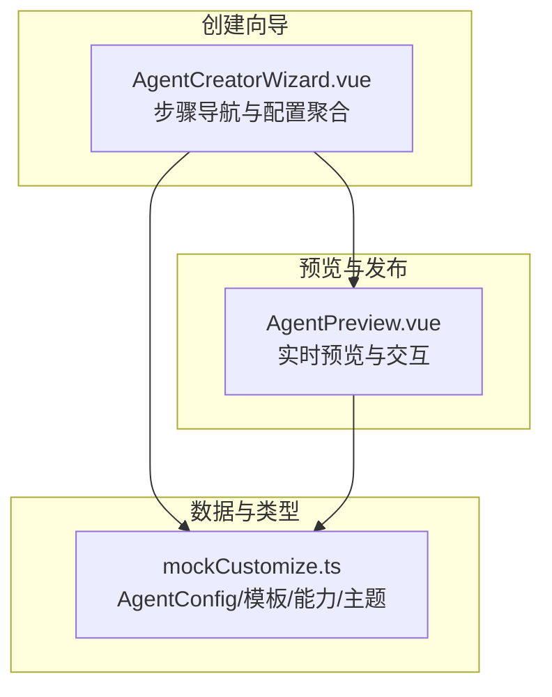
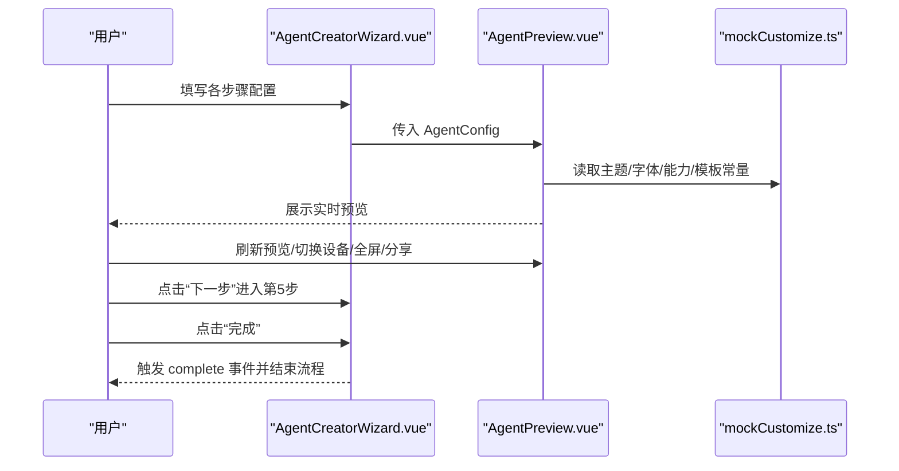
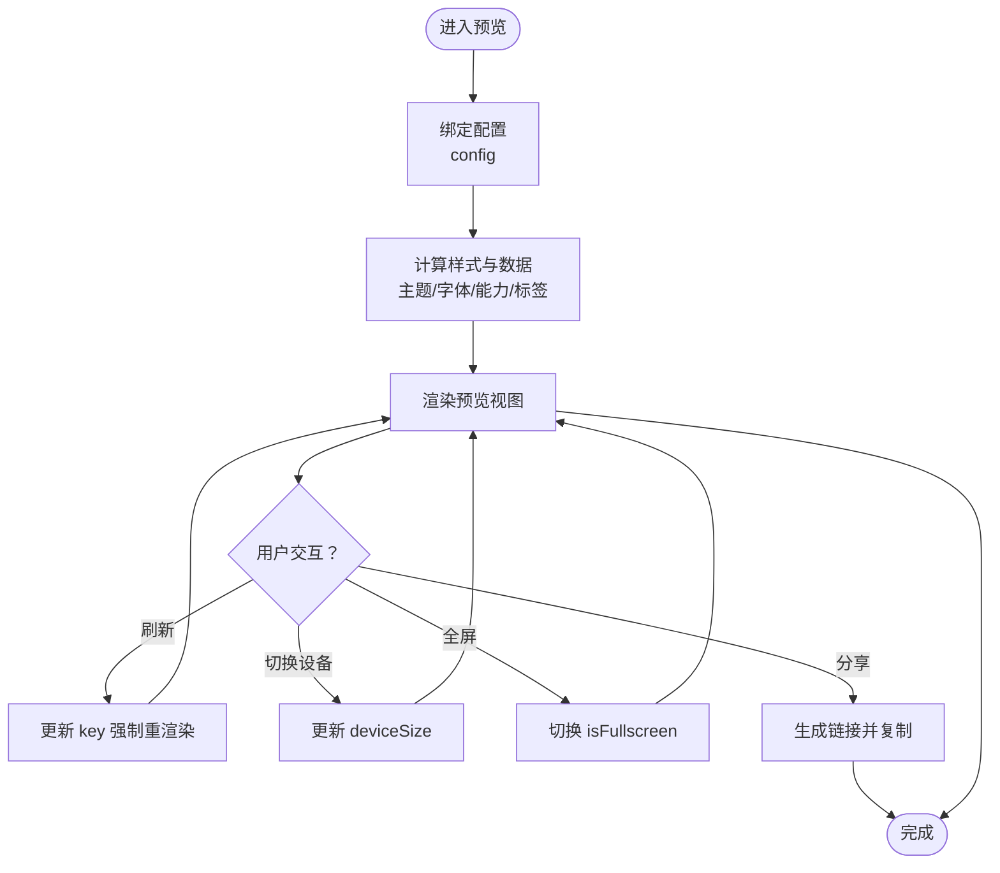
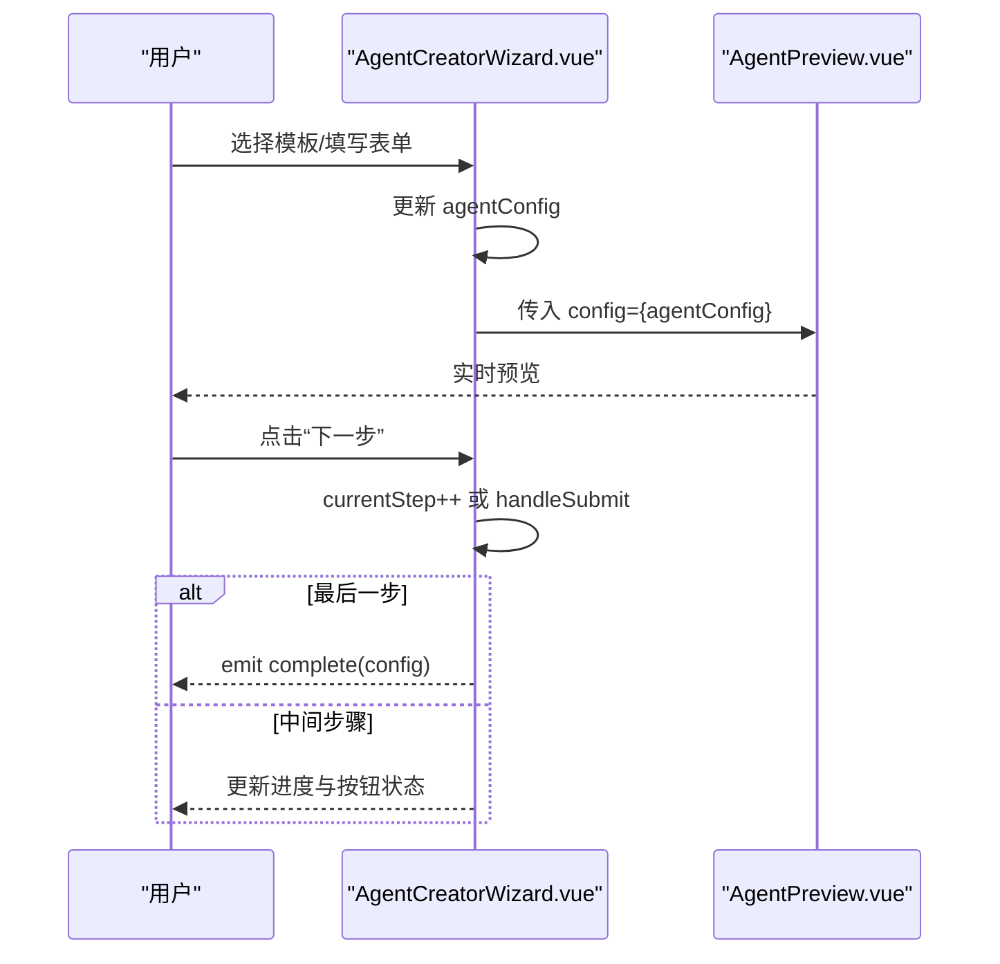
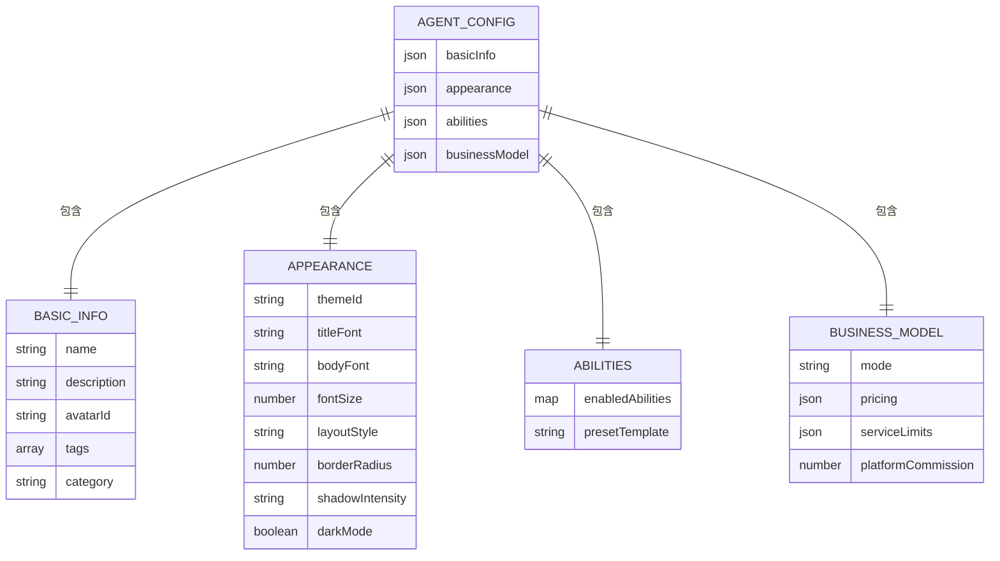
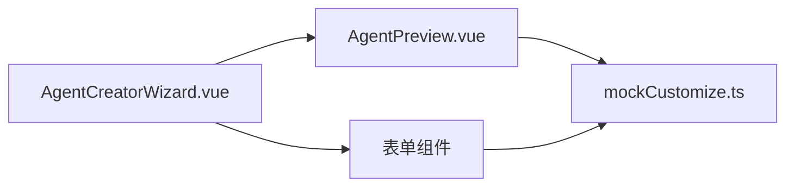

# 预览发布步骤

<cite>
**本文引用的文件**
- [AgentPreview.vue](file://apps/AgentPit/src/components/customize/AgentPreview.vue)
- [AgentCreatorWizard.vue](file://apps/AgentPit/src/components/customize/AgentCreatorWizard.vue)
- [mockCustomize.ts](file://apps/AgentPit/src/data/mockCustomize.ts)
</cite>

## 目录
1. [简介](#简介)
2. [项目结构](#项目结构)
3. [核心组件](#核心组件)
4. [架构总览](#架构总览)
5. [详细组件分析](#详细组件分析)
6. [依赖关系分析](#依赖关系分析)
7. [性能考量](#性能考量)
8. [故障排查指南](#故障排查指南)
9. [结论](#结论)
10. [附录](#附录)

## 简介
本章节聚焦“智能体创建向导”的“预览发布步骤”，围绕 AgentPreview 组件的功能实现展开，解释其在最终预览、修改入口与发布流程中的作用。文档将详细说明预览界面的数据绑定、实时更新机制与交互设计；阐述如何通过 onEditStep 回调跳转到对应配置步骤进行修改；解释 handlePublish 事件触发的发布流程；并提供完整的发布确认机制、成功反馈界面与后续操作指南，包括智能体状态管理、市场推广建议与用户反馈收集。

## 项目结构
AgentPit 应用采用 Vue 3 + TypeScript 的前端架构，预览发布步骤位于 customize 子模块中：
- AgentCreatorWizard.vue：向导主容器，负责步骤导航、配置聚合与提交。
- AgentPreview.vue：实时预览组件，展示当前配置的最终效果。
- mockCustomize.ts：类型定义与示例数据，包含 AgentConfig 结构、主题、字体、能力与模板等。

图表来源
- [AgentCreatorWizard.vue:1-300](file://apps/AgentPit/src/components/customize/AgentCreatorWizard.vue#L1-L300)
- [AgentPreview.vue:1-234](file://apps/AgentPit/src/components/customize/AgentPreview.vue#L1-L234)
- [mockCustomize.ts:39-93](file://apps/AgentPit/src/data/mockCustomize.ts#L39-L93)

章节来源
- [AgentCreatorWizard.vue:1-300](file://apps/AgentPit/src/components/customize/AgentCreatorWizard.vue#L1-L300)
- [AgentPreview.vue:1-234](file://apps/AgentPit/src/components/customize/AgentPreview.vue#L1-L234)
- [mockCustomize.ts:39-93](file://apps/AgentPit/src/data/mockCustomize.ts#L39-L93)

## 核心组件
- AgentPreview.vue
  - 职责：接收 AgentConfig，计算并渲染实时预览视图；提供设备尺寸切换、全屏预览、刷新预览与分享链接等交互。
  - 关键点：通过 computed 计算主题色、字体族、能力列表与商业模式标签；通过 key 强制刷新以实现“刷新预览”。
- AgentCreatorWizard.vue
  - 职责：维护当前步骤、进度条、表单校验与提交；在第5步展示 AgentPreview 并提供下一步/完成按钮；完成时发出 complete 事件。
  - 关键点：使用 provide/inject 传递 agentConfig；watch 监听步骤变化滚动至顶部；handleSubmit 触发完成流程。

章节来源
- [AgentPreview.vue:1-234](file://apps/AgentPit/src/components/customize/AgentPreview.vue#L1-L234)
- [AgentCreatorWizard.vue:1-300](file://apps/AgentPit/src/components/customize/AgentCreatorWizard.vue#L1-L300)

## 架构总览
预览发布步骤的控制流如下：

图表来源
- [AgentCreatorWizard.vue:230-262](file://apps/AgentPit/src/components/customize/AgentCreatorWizard.vue#L230-L262)
- [AgentPreview.vue:48-61](file://apps/AgentPit/src/components/customize/AgentPreview.vue#L48-L61)
- [mockCustomize.ts:39-93](file://apps/AgentPit/src/data/mockCustomize.ts#L39-L93)

## 详细组件分析

### AgentPreview 组件分析
- 数据绑定与实时更新
  - 输入属性：config（AgentConfig），作为预览数据源。
  - 计算属性：主题色、字体族、能力列表、商业模式标签映射等，确保视图随配置变化而更新。
  - 刷新机制：通过 key 重渲染容器，强制刷新预览区域。
- 交互设计
  - 设备尺寸切换：desktop/tablet/mobile 三种尺寸，动态改变容器宽度与高度。
  - 全屏预览：切换 isFullscreen 状态，提供退出按钮。
  - 分享链接：生成预览链接并复制到剪贴板，提示用户。
- 视图结构
  - 头部：头像、名称、描述、标签、定价模式徽标。
  - 能力配置区：展示启用的能力及其熟练度条。
  - 商业模式区：展示定价模式、日请求限额、并发用户、平台抽成等。
  - 页脚：平台标识与预览模式提示。

图表来源
- [AgentPreview.vue:48-61](file://apps/AgentPit/src/components/customize/AgentPreview.vue#L48-L61)
- [AgentPreview.vue:64-220](file://apps/AgentPit/src/components/customize/AgentPreview.vue#L64-L220)

章节来源
- [AgentPreview.vue:1-234](file://apps/AgentPit/src/components/customize/AgentPreview.vue#L1-L234)

### AgentCreatorWizard 组件分析
- 步骤与导航
  - 总共 5 步：模板选择、基本信息、外观定制、能力配置、商业模式。
  - 当前步骤 currentStep 控制显示区域；上一步/下一步按钮受 canGoNext 与 isLastStep 控制。
- 配置聚合与提交
  - 使用 reactive 保存 agentConfig；通过 provide/inject 在子组件中双向绑定。
  - handleSubmit 发出 complete 事件，携带完整配置对象。
- 预览集成
  - 第 5 步右侧固定展示 AgentPreview，便于边看边改。
  - watch 监听 currentStep，滚动至顶部优化用户体验。

图表来源
- [AgentCreatorWizard.vue:230-262](file://apps/AgentPit/src/components/customize/AgentCreatorWizard.vue#L230-L262)
- [AgentCreatorWizard.vue:89-98](file://apps/AgentPit/src/components/customize/AgentCreatorWizard.vue#L89-L98)

章节来源
- [AgentCreatorWizard.vue:1-300](file://apps/AgentPit/src/components/customize/AgentCreatorWizard.vue#L1-L300)

### 数据模型与类型
- AgentConfig 结构
  - basicInfo：名称、描述、头像、标签、分类。
  - appearance：主题、字体、字号、圆角、阴影强度、深色模式等。
  - abilities：启用能力集合与参数。
  - businessModel：定价模式、价格、服务限制、平台抽成等。
- 示例数据
  - 主题、字体、能力、模板、默认配置等均在 mockCustomize.ts 中定义，供预览与向导使用。

图表来源
- [mockCustomize.ts:39-93](file://apps/AgentPit/src/data/mockCustomize.ts#L39-L93)

章节来源
- [mockCustomize.ts:39-93](file://apps/AgentPit/src/data/mockCustomize.ts#L39-L93)

## 依赖关系分析
- 组件耦合
  - AgentCreatorWizard.vue 依赖 AgentPreview.vue 与多个表单组件（BasicInfoForm/AppearanceCustomizer/AbilityConfigurator/BusinessModelSetup）。
  - AgentPreview.vue 依赖 mockCustomize.ts 提供的主题、字体、能力与模板常量。
- 数据流
  - Wizard 通过 v-model 与子组件双向绑定，形成单向数据流：父组件持有完整配置，子组件只读或局部更新。
  - 预览区域仅消费配置，不参与业务提交，职责清晰。

图表来源
- [AgentCreatorWizard.vue:3-7](file://apps/AgentPit/src/components/customize/AgentCreatorWizard.vue#L3-L7)
- [AgentPreview.vue:2-4](file://apps/AgentPit/src/components/customize/AgentPreview.vue#L2-L4)

章节来源
- [AgentCreatorWizard.vue:1-300](file://apps/AgentPit/src/components/customize/AgentCreatorWizard.vue#L1-L300)
- [AgentPreview.vue:1-234](file://apps/AgentPit/src/components/customize/AgentPreview.vue#L1-L234)
- [mockCustomize.ts:39-93](file://apps/AgentPit/src/data/mockCustomize.ts#L39-L93)

## 性能考量
- 渲染优化
  - 预览区域通过 key 强制重渲染，确保样式与数据同步，避免缓存导致的视觉不一致。
  - 字体与主题计算使用 computed，减少重复计算开销。
- 交互响应
  - 设备尺寸切换与全屏切换均为本地状态变更，开销极低。
  - 分享链接仅复制 URL 至剪贴板，避免网络请求。
- 建议
  - 对于大规模能力列表，可考虑虚拟滚动或分页展示，降低 DOM 节点数量。
  - 若配置体量增大，可引入浅拷贝与选择性更新策略，减少不必要的重渲染。

## 故障排查指南
- 预览不更新
  - 症状：修改配置后预览未变化。
  - 排查：确认是否正确传递 config；检查 computed 是否被覆盖；尝试点击“刷新预览”。
  - 参考
    - [AgentPreview.vue:48-50](file://apps/AgentPit/src/components/customize/AgentPreview.vue#L48-L50)
- 设备尺寸无效
  - 症状：切换设备后容器尺寸不变。
  - 排查：确认 deviceSize 状态更新；检查样式绑定逻辑。
  - 参考
    - [AgentPreview.vue:70-78](file://apps/AgentPit/src/components/customize/AgentPreview.vue#L70-L78)
- 全屏无法退出
  - 症状：全屏后无退出按钮或点击无效。
  - 排查：确认 isFullscreen 状态切换；检查事件绑定。
  - 参考
    - [AgentPreview.vue:52-54](file://apps/AgentPit/src/components/customize/AgentPreview.vue#L52-L54)
- 分享链接失败
  - 症状：复制失败或弹窗提示异常。
  - 排查：确认浏览器权限与剪贴板 API 可用性；检查 URL 生成逻辑。
  - 参考
    - [AgentPreview.vue:56-61](file://apps/AgentPit/src/components/customize/AgentPreview.vue#L56-L61)
- 提交流程未触发
  - 症状：点击“完成”无反应。
  - 排查：确认 handleSubmit 是否被调用；检查 isSubmitting 状态；验证 emit 事件。
  - 参考
    - [AgentCreatorWizard.vue:89-98](file://apps/AgentPit/src/components/customize/AgentCreatorWizard.vue#L89-L98)

章节来源
- [AgentPreview.vue:48-61](file://apps/AgentPit/src/components/customize/AgentPreview.vue#L48-L61)
- [AgentCreatorWizard.vue:89-98](file://apps/AgentPit/src/components/customize/AgentCreatorWizard.vue#L89-L98)

## 结论
AgentPreview 组件在“预览发布步骤”中承担了最终配置的可视化呈现与交互入口，配合 AgentCreatorWizard 的步骤导航与提交流程，形成了从配置到发布的闭环。其实时更新机制、设备适配与分享能力提升了用户体验；结合发布确认与成功反馈流程，可进一步完善智能体上线后的状态管理与运营推广。

## 附录
- 发布确认机制建议
  - 在 handleSubmit 后增加二次确认弹窗，展示关键配置摘要与风险提示。
  - 提供“导出配置”与“复制链接”选项，便于归档与分享。
- 成功反馈界面
  - 显示“发布成功”提示与智能体概览卡片，提供“查看详情”“分享推广”“继续编辑”等快捷入口。
- 智能体状态管理
  - 发布后将状态从 draft 更新为 reviewing/published，并同步统计数据与市场信息。
- 市场推广建议
  - 基于标签与分类生成推广文案；提供社交分享模板与截图生成。
- 用户反馈收集
  - 在发布后引导用户评价与反馈，建立反馈收集与响应机制。