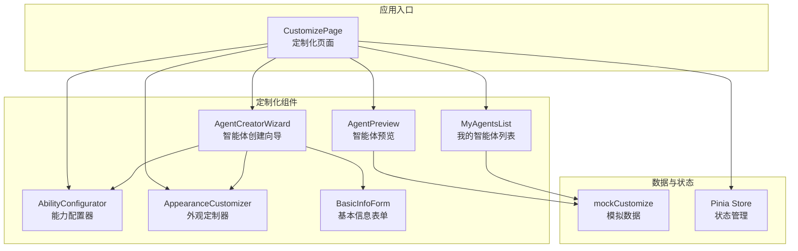
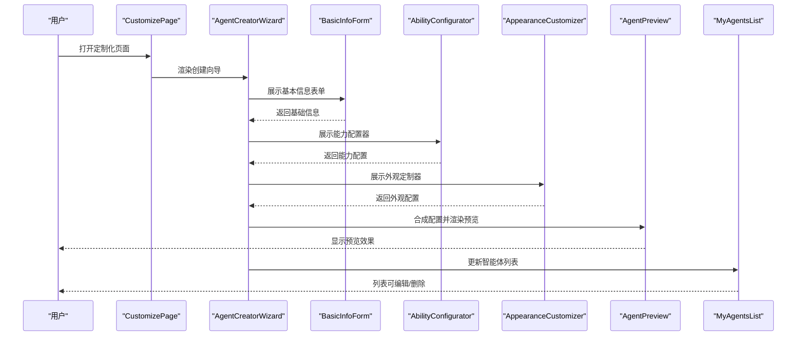
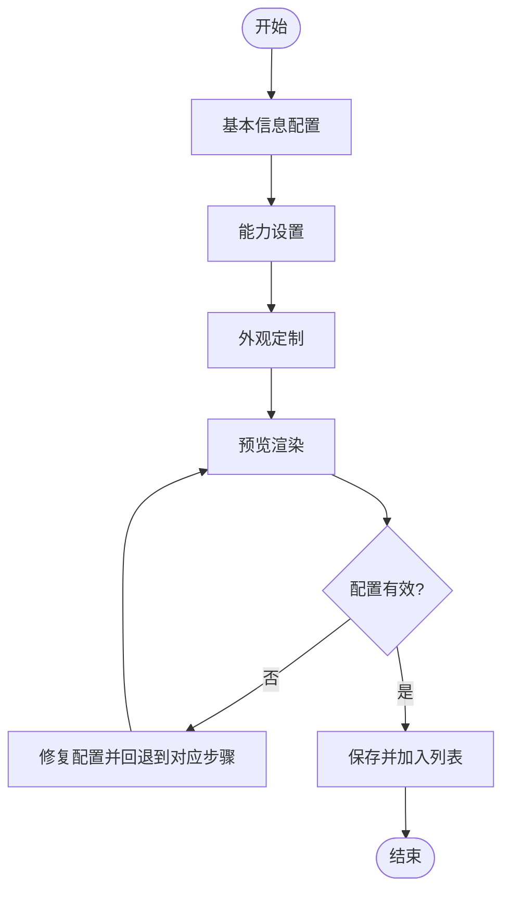
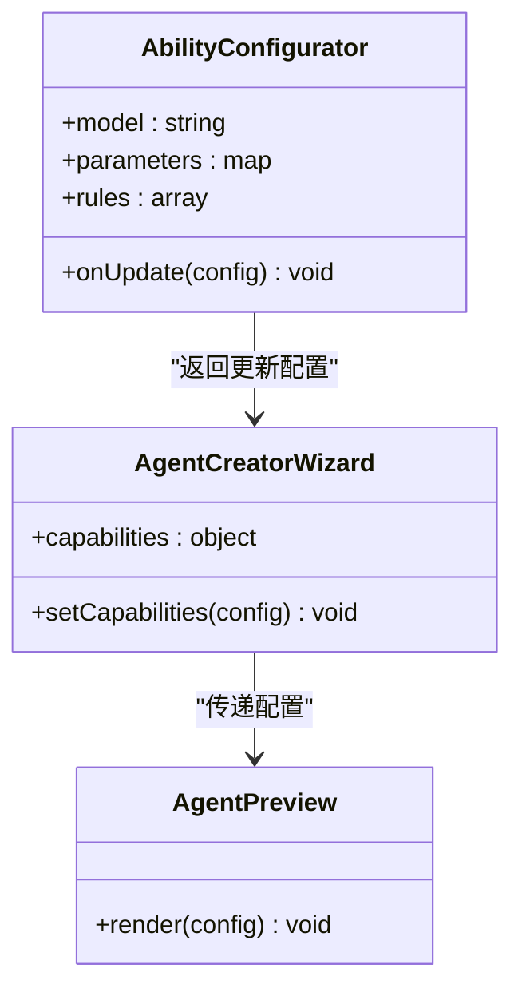
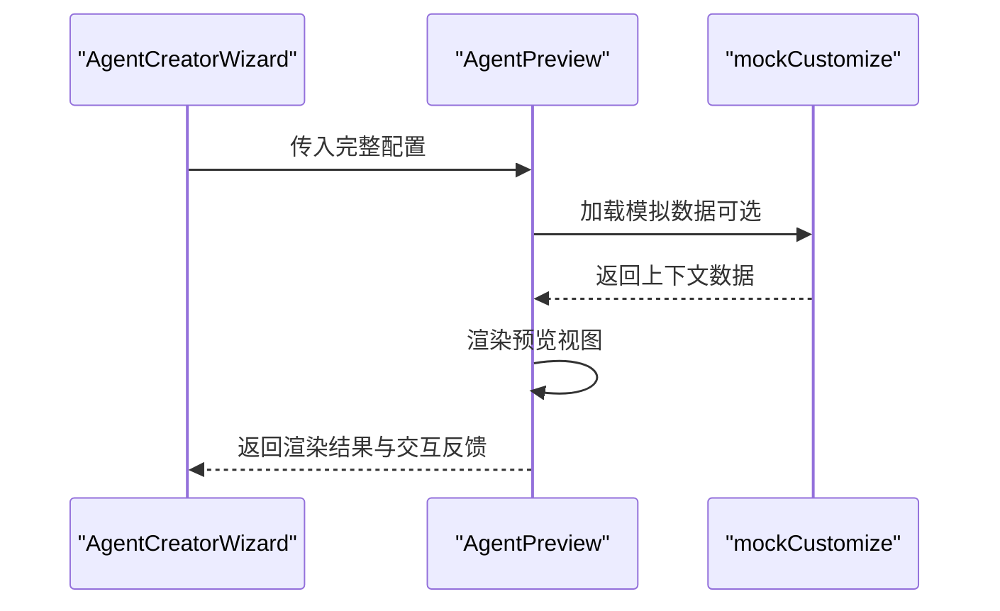
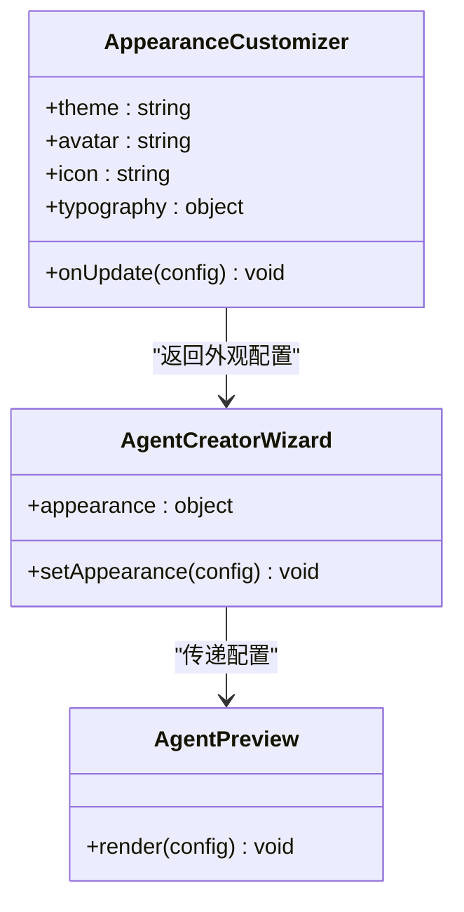
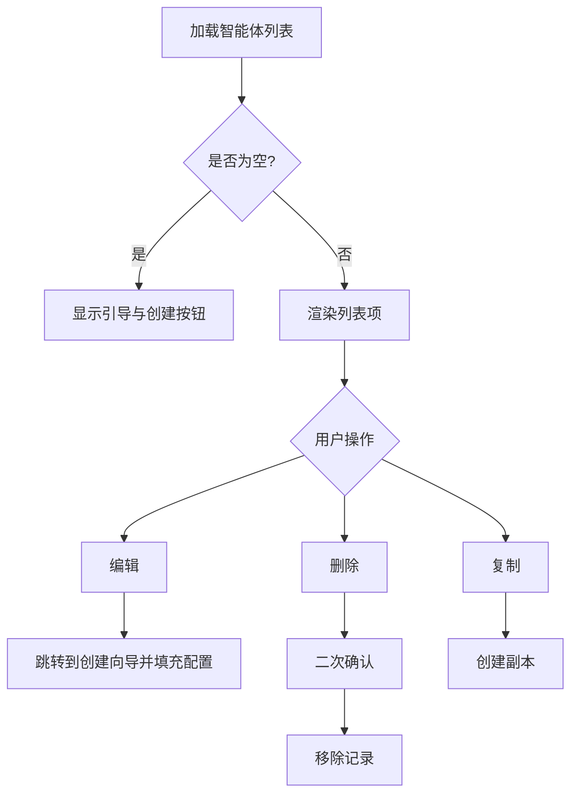
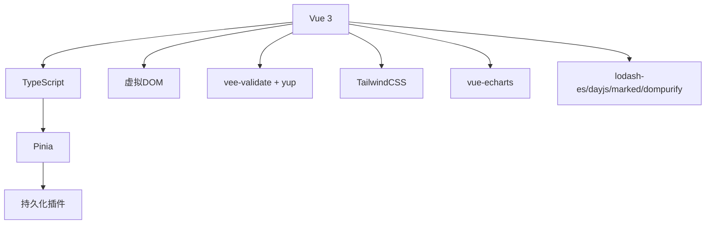

# 智能体管理系统

<cite>
**本文引用的文件**
- [package.json](file://apps/AgentPit/package.json)
- [AgentCreatorWizard.tsx](file://apps/AgentPit/src/components/customize/AgentCreatorWizard.tsx)
- [AbilityConfigurator.tsx](file://apps/AgentPit/src/components/customize/AbilityConfigurator.tsx)
- [AgentPreview.tsx](file://apps/AgentPit/src/components/customize/AgentPreview.tsx)
- [AppearanceCustomizer.tsx](file://apps/AgentPit/src/components/customize/AppearanceCustomizer.tsx)
- [BasicInfoForm.tsx](file://apps/AgentPit/src/components/customize/BasicInfoForm.tsx)
- [MyAgentsList.tsx](file://apps/AgentPit/src/components/customize/MyAgentsList.tsx)
- [CustomizePage.tsx](file://apps/AgentPit/src/pages/CustomizePage.tsx)
- [mockCustomize.ts](file://apps/AgentPit/src/data/mockCustomize.ts)
</cite>

## 目录
1. [简介](#简介)
2. [项目结构](#项目结构)
3. [核心组件](#核心组件)
4. [架构总览](#架构总览)
5. [详细组件分析](#详细组件分析)
6. [依赖关系分析](#依赖关系分析)
7. [性能考虑](#性能考虑)
8. [故障排除指南](#故障排除指南)
9. [结论](#结论)
10. [附录](#附录)

## 简介
本文件面向智能体管理系统（AgentPit）中的智能体创建与管理功能，重点围绕以下目标展开：
- 深入介绍 AgentCreatorWizard 智能体创建向导的工作流程，包括基本信息配置、能力设置、外观定制等步骤。
- 详细说明智能体的生命周期管理：创建、编辑、预览、删除等操作。
- 解释 AgentPreview 预览功能如何帮助用户可视化智能体效果。
- 介绍 AbilityConfigurator 能力配置器的各种配置选项，包括 AI 模型选择、行为参数调整、交互规则设置等。
- 提供完整的智能体创建最佳实践指南和常见问题解决方案。

该系统基于 Vue 3 + TypeScript 技术栈构建，采用模块化组件设计，通过 Pinia 进行状态管理，并在页面层提供统一的定制化入口。

## 项目结构
AgentPit 应用位于 apps/AgentPit 目录下，核心定制化功能集中在 src/components/customize 目录中，包含智能体创建向导、能力配置器、外观定制器、预览组件以及智能体列表等模块。页面入口为 CustomizePage，负责承载这些定制化组件。

图表来源
- [CustomizePage.tsx](file://apps/AgentPit/src/pages/CustomizePage.tsx)
- [AgentCreatorWizard.tsx](file://apps/AgentPit/src/components/customize/AgentCreatorWizard.tsx)
- [AbilityConfigurator.tsx](file://apps/AgentPit/src/components/customize/AbilityConfigurator.tsx)
- [AppearanceCustomizer.tsx](file://apps/AgentPit/src/components/customize/AppearanceCustomizer.tsx)
- [AgentPreview.tsx](file://apps/AgentPit/src/components/customize/AgentPreview.tsx)
- [MyAgentsList.tsx](file://apps/AgentPit/src/components/customize/MyAgentsList.tsx)
- [mockCustomize.ts](file://apps/AgentPit/src/data/mockCustomize.ts)

章节来源
- [package.json:1-73](file://apps/AgentPit/package.json#L1-L73)

## 核心组件
本节对关键组件进行概览性分析，聚焦其职责、输入输出与协作关系。

- AgentCreatorWizard（智能体创建向导）
  - 职责：引导用户完成智能体从创建到可运行的关键步骤，串联基本信息、能力与外观配置。
  - 关键交互：接收用户输入，驱动 AbilityConfigurator 与 AppearanceCustomizer 的配置变更；触发预览更新；最终生成智能体对象。
  - 输出：返回标准化的智能体配置对象，供后续存储或调用。

- AbilityConfigurator（能力配置器）
  - 职责：提供 AI 模型选择、行为参数调整、交互规则设置等能力维度的配置界面。
  - 输入：当前智能体的能力配置快照。
  - 输出：更新后的智能体能力配置。

- AppearanceCustomizer（外观定制器）
  - 职责：提供外观样式、颜色、图标、头像等视觉元素的定制化设置。
  - 输入：当前智能体外观配置快照。
  - 输出：更新后的智能体外观配置。

- AgentPreview（智能体预览）
  - 职责：实时渲染智能体在不同场景下的表现，辅助用户验证配置效果。
  - 输入：智能体配置（能力 + 外观）。
  - 输出：预览视图与交互反馈。

- MyAgentsList（我的智能体列表）
  - 职责：展示用户已创建的智能体清单，支持编辑、删除、复制等操作。
  - 输入：智能体集合数据。
  - 输出：列表项点击事件（编辑/删除/复制）。

- BasicInfoForm（基本信息表单）
  - 职责：收集智能体名称、描述、标签等基础信息。
  - 输入：空或已有基础信息。
  - 输出：标准化的基础信息对象。

章节来源
- [AgentCreatorWizard.tsx](file://apps/AgentPit/src/components/customize/AgentCreatorWizard.tsx)
- [AbilityConfigurator.tsx](file://apps/AgentPit/src/components/customize/AbilityConfigurator.tsx)
- [AppearanceCustomizer.tsx](file://apps/AgentPit/src/components/customize/AppearanceCustomizer.tsx)
- [AgentPreview.tsx](file://apps/AgentPit/src/components/customize/AgentPreview.tsx)
- [MyAgentsList.tsx](file://apps/AgentPit/src/components/customize/MyAgentsList.tsx)
- [BasicInfoForm.tsx](file://apps/AgentPit/src/components/customize/BasicInfoForm.tsx)

## 架构总览
下图展示了从页面入口到各功能组件的调用关系与数据流：

图表来源
- [CustomizePage.tsx](file://apps/AgentPit/src/pages/CustomizePage.tsx)
- [AgentCreatorWizard.tsx](file://apps/AgentPit/src/components/customize/AgentCreatorWizard.tsx)
- [BasicInfoForm.tsx](file://apps/AgentPit/src/components/customize/BasicInfoForm.tsx)
- [AbilityConfigurator.tsx](file://apps/AgentPit/src/components/customize/AbilityConfigurator.tsx)
- [AppearanceCustomizer.tsx](file://apps/AgentPit/src/components/customize/AppearanceCustomizer.tsx)
- [AgentPreview.tsx](file://apps/AgentPit/src/components/customize/AgentPreview.tsx)
- [MyAgentsList.tsx](file://apps/AgentPit/src/components/customize/MyAgentsList.tsx)

## 详细组件分析

### AgentCreatorWizard 组件分析
- 工作流程
  - 步骤一：基本信息配置（名称、描述、标签等）。
  - 步骤二：能力设置（AI 模型、行为参数、交互规则）。
  - 步骤三：外观定制（颜色、图标、头像等）。
  - 步骤四：预览与确认（实时渲染效果，支持回退修改）。
  - 步骤五：提交与保存（生成智能体对象，加入列表）。
- 数据结构
  - 基础信息对象：包含名称、描述、标签等字段。
  - 能力配置对象：包含模型选择、参数映射、交互规则等。
  - 外观配置对象：包含颜色方案、图标、头像等。
  - 最终智能体对象：合并上述配置，形成可执行的智能体定义。
- 错误处理
  - 表单校验失败时提示具体字段错误。
  - 能力配置不兼容时给出兼容性警告。
  - 预览渲染异常时降级显示默认视图。
- 性能优化
  - 使用受控组件减少不必要的重渲染。
  - 将复杂计算移出渲染函数，使用计算属性或缓存策略。

图表来源
- [AgentCreatorWizard.tsx](file://apps/AgentPit/src/components/customize/AgentCreatorWizard.tsx)

章节来源
- [AgentCreatorWizard.tsx](file://apps/AgentPit/src/components/customize/AgentCreatorWizard.tsx)

### AbilityConfigurator 组件分析
- 配置选项
  - AI 模型选择：支持多模型切换与参数映射。
  - 行为参数调整：如响应速度、语气温和度、指令遵循度等。
  - 交互规则设置：如多轮对话限制、敏感词过滤、打断策略等。
- 数据流
  - 接收来自 AgentCreatorWizard 的当前能力配置。
  - 用户修改后返回更新后的配置对象。
  - 与 AgentPreview 协同，确保预览反映最新能力设定。
- 错误处理
  - 参数越界时自动修正至合法范围。
  - 不支持的组合给出兼容性提示。
- 性能优化
  - 使用分步加载与懒渲染，避免一次性渲染过多控件。
  - 对高频变更使用防抖策略。

图表来源
- [AbilityConfigurator.tsx](file://apps/AgentPit/src/components/customize/AbilityConfigurator.tsx)
- [AgentCreatorWizard.tsx](file://apps/AgentPit/src/components/customize/AgentCreatorWizard.tsx)
- [AgentPreview.tsx](file://apps/AgentPit/src/components/customize/AgentPreview.tsx)

章节来源
- [AbilityConfigurator.tsx](file://apps/AgentPit/src/components/customize/AbilityConfigurator.tsx)

### AgentPreview 组件分析
- 功能概述
  - 实时渲染智能体在不同场景下的表现，包括对话、任务执行、交互反馈等。
  - 支持缩略预览与全屏预览两种模式。
- 数据输入
  - 来自 AgentCreatorWizard 的合并配置（能力 + 外观）。
  - 可选的模拟上下文（如历史消息、任务背景）。
- 渲染策略
  - 使用轻量级渲染引擎，优先保证流畅度。
  - 对长文本进行截断与折叠处理，避免布局溢出。
- 错误处理
  - 渲染异常时显示占位符与错误提示。
  - 配置缺失时以默认值兜底。

图表来源
- [AgentPreview.tsx](file://apps/AgentPit/src/components/customize/AgentPreview.tsx)
- [mockCustomize.ts](file://apps/AgentPit/src/data/mockCustomize.ts)

章节来源
- [AgentPreview.tsx](file://apps/AgentPit/src/components/customize/AgentPreview.tsx)
- [mockCustomize.ts](file://apps/AgentPit/src/data/mockCustomize.ts)

### AppearanceCustomizer 组件分析
- 配置选项
  - 主题色板：支持明暗主题与品牌色系。
  - 图标与头像：提供图标库与上传自定义图片。
  - 字体与排版：字号、行高、字重等基础排版参数。
- 数据流
  - 接收来自 AgentCreatorWizard 的外观配置快照。
  - 用户修改后返回更新后的外观配置。
  - 与 AgentPreview 协同，确保预览体现最新外观。
- 错误处理
  - 自定义图片格式不支持时提示正确格式。
  - 颜色值非法时回退到默认色。

图表来源
- [AppearanceCustomizer.tsx](file://apps/AgentPit/src/components/customize/AppearanceCustomizer.tsx)
- [AgentCreatorWizard.tsx](file://apps/AgentPit/src/components/customize/AgentCreatorWizard.tsx)
- [AgentPreview.tsx](file://apps/AgentPit/src/components/customize/AgentPreview.tsx)

章节来源
- [AppearanceCustomizer.tsx](file://apps/AgentPit/src/components/customize/AppearanceCustomizer.tsx)

### MyAgentsList 组件分析
- 功能概述
  - 展示用户已创建的智能体列表，支持排序、筛选与批量操作。
  - 提供编辑、删除、复制、启用/禁用等操作入口。
- 数据来源
  - 从状态管理或本地存储读取智能体集合。
  - 结合 mockCustomize 中的示例数据进行演示。
- 交互逻辑
  - 编辑：跳转到 AgentCreatorWizard 并填充当前配置。
  - 删除：二次确认后移除记录。
  - 复制：基于当前配置创建新智能体副本。
- 错误处理
  - 删除失败时提示具体原因（如正在使用中）。
  - 空列表时显示引导文案与创建按钮。

图表来源
- [MyAgentsList.tsx](file://apps/AgentPit/src/components/customize/MyAgentsList.tsx)
- [mockCustomize.ts](file://apps/AgentPit/src/data/mockCustomize.ts)

章节来源
- [MyAgentsList.tsx](file://apps/AgentPit/src/components/customize/MyAgentsList.tsx)
- [mockCustomize.ts](file://apps/AgentPit/src/data/mockCustomize.ts)

### BasicInfoForm 组件分析
- 功能概述
  - 收集智能体的基础信息，包括名称、描述、标签等。
  - 提供必填字段校验与实时反馈。
- 数据流
  - 作为 AgentCreatorWizard 的第一步，为后续能力与外观配置提供基础数据。
  - 返回标准化的基础信息对象给向导主流程。

章节来源
- [BasicInfoForm.tsx](file://apps/AgentPit/src/components/customize/BasicInfoForm.tsx)

## 依赖关系分析
- 技术栈
  - 前端框架：Vue 3（Composition API + TypeScript）
  - 状态管理：Pinia（持久化插件）
  - UI 组件库：TailwindCSS + 自定义组件
  - 表单校验：vee-validate + yup
  - 可视化：vue-echarts（用于图表展示，非核心）
- 外部依赖
  - lodash-es：工具函数库
  - dayjs：日期处理
  - marked：Markdown 渲染
  - dompurify：HTML 安全净化
- 内部依赖
  - CustomizePage 作为容器页面，聚合多个定制化组件。
  - 各组件之间通过 props 与事件进行解耦通信。
  - mockCustomize 提供示例数据，便于演示与测试。

图表来源
- [package.json:20-40](file://apps/AgentPit/package.json#L20-L40)

章节来源
- [package.json:1-73](file://apps/AgentPit/package.json#L1-L73)

## 性能考虑
- 渲染优化
  - 使用受控组件与计算属性，避免重复渲染。
  - 将大列表分页或虚拟滚动，降低 DOM 压力。
- 网络与数据
  - mockCustomize 仅用于演示，生产环境应接入真实 API。
  - 对频繁请求进行缓存与去抖处理。
- 交互体验
  - 预览组件采用轻量渲染策略，必要时提供“简化模式”。
  - 表单校验采用异步校验，避免阻塞主线程。

## 故障排除指南
- 创建向导无法进入下一步
  - 检查 BasicInfoForm 是否通过校验。
  - 确认 AbilityConfigurator 与 AppearanceCustomizer 的配置是否为空或非法。
- 预览无显示或报错
  - 检查 mockCustomize 数据是否加载成功。
  - 确认 AgentCreatorWizard 是否正确合并了能力与外观配置。
- 列表为空或不更新
  - 检查 Pinia 状态是否正确写入与持久化。
  - 确认 MyAgentsList 的数据订阅是否生效。
- 表单校验不生效
  - 检查 vee-validate 的规则与 yup 的 schema 是否匹配。
  - 确认字段名与表单绑定一致。

章节来源
- [AgentCreatorWizard.tsx](file://apps/AgentPit/src/components/customize/AgentCreatorWizard.tsx)
- [AgentPreview.tsx](file://apps/AgentPit/src/components/customize/AgentPreview.tsx)
- [MyAgentsList.tsx](file://apps/AgentPit/src/components/customize/MyAgentsList.tsx)
- [mockCustomize.ts](file://apps/AgentPit/src/data/mockCustomize.ts)

## 结论
智能体管理系统通过 AgentCreatorWizard 将复杂的配置过程拆分为清晰的步骤，结合 AbilityConfigurator、AppearanceCustomizer 与 AgentPreview 形成“配置-预览-确认”的闭环。MyAgentsList 提供了便捷的生命周期管理入口。整体架构具备良好的扩展性与可维护性，适合进一步引入真实后端服务与更丰富的能力配置项。

## 附录
- 最佳实践
  - 先完成基础信息，再逐步完善能力与外观，避免后期大规模回滚。
  - 在能力配置中优先选择稳定模型，再根据场景微调参数。
  - 使用 AgentPreview 验证关键交互，确保用户体验一致性。
  - 对重要配置进行版本化管理，便于回溯与审计。
- 常见问题
  - 配置冲突：当能力与外观存在冲突时，优先保证交互稳定性。
  - 性能瓶颈：对长文本与复杂渲染进行降级处理。
  - 数据丢失：启用 Pinia 持久化，定期备份配置快照。