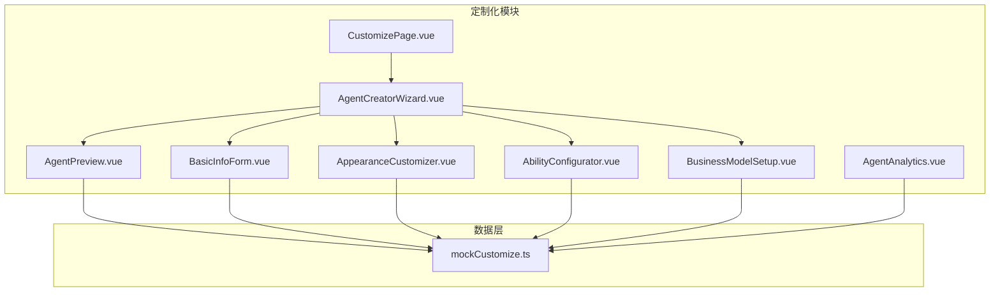
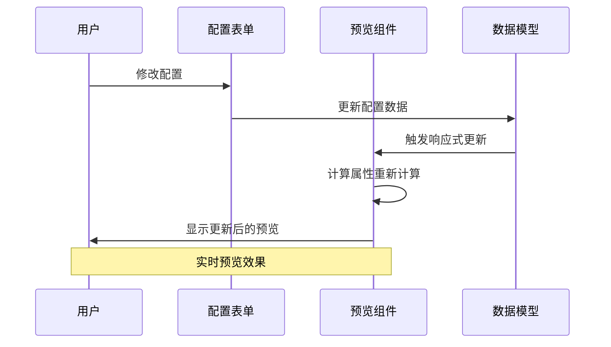
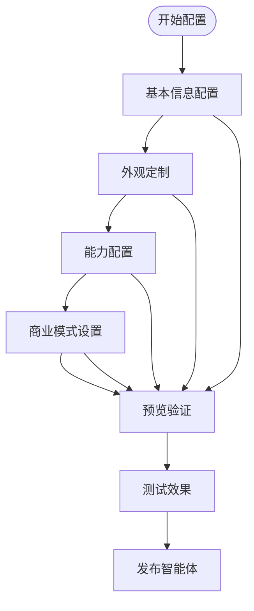
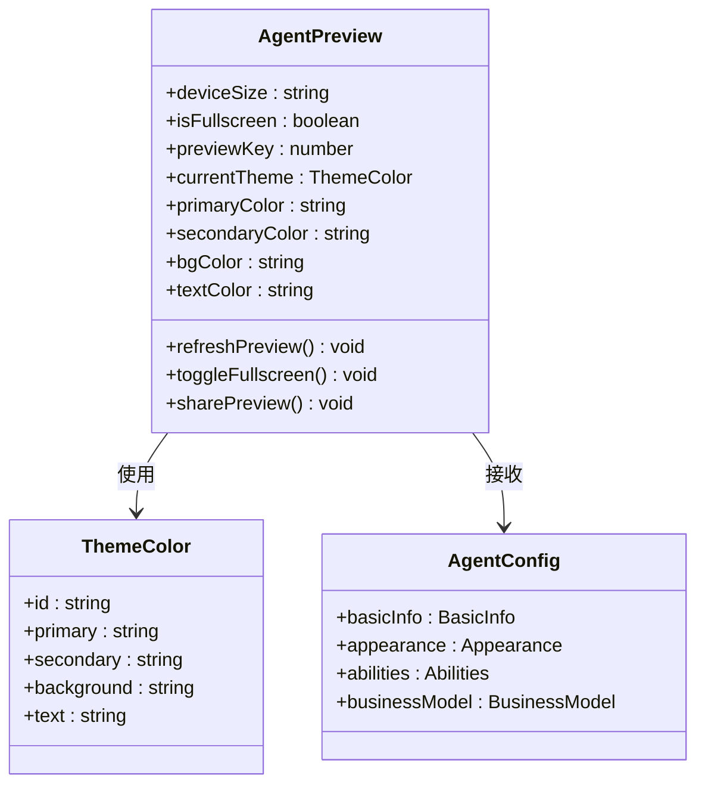
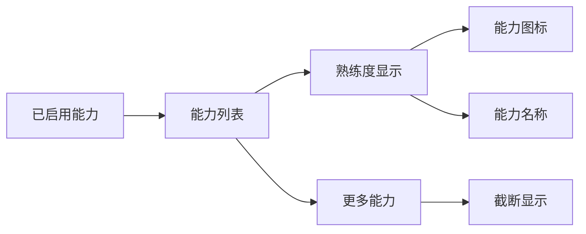
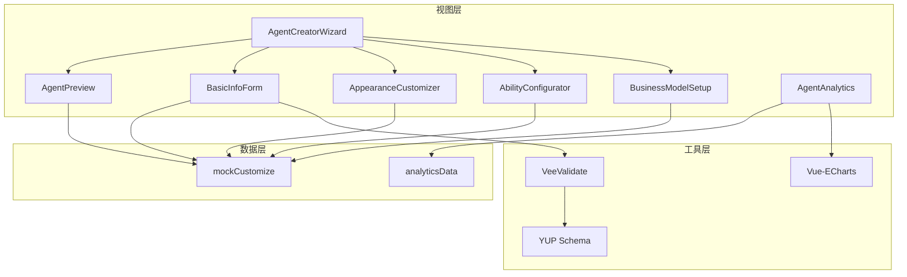
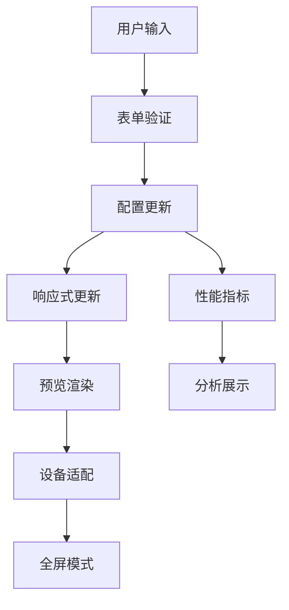

# 智能体预览功能

<cite>
**本文档引用的文件**
- [AgentPreview.vue](file://apps/AgentPit/src/components/customize/AgentPreview.vue)
- [AgentCreatorWizard.vue](file://apps/AgentPit/src/components/customize/AgentCreatorWizard.vue)
- [mockCustomize.ts](file://apps/AgentPit/src/data/mockCustomize.ts)
- [BasicInfoForm.vue](file://apps/AgentPit/src/components/customize/BasicInfoForm.vue)
- [AppearanceCustomizer.vue](file://apps/AgentPit/src/components/customize/AppearanceCustomizer.vue)
- [AbilityConfigurator.vue](file://apps/AgentPit/src/components/customize/AbilityConfigurator.vue)
- [BusinessModelSetup.vue](file://apps/AgentPit/src/components/customize/BusinessModelSetup.vue)
- [AgentAnalytics.vue](file://apps/AgentPit/src/components/customize/AgentAnalytics.vue)
- [CustomizePage.vue](file://apps/AgentPit/src/views/CustomizePage.vue)
</cite>

## 目录
1. [简介](#简介)
2. [项目结构](#项目结构)
3. [核心组件](#核心组件)
4. [架构概览](#架构概览)
5. [详细组件分析](#详细组件分析)
6. [依赖关系分析](#依赖关系分析)
7. [性能考虑](#性能考虑)
8. [故障排除指南](#故障排除指南)
9. [结论](#结论)

## 简介

智能体预览功能是 AgentPit 平台中一个关键的用户体验组件，它允许用户在创建和配置智能体的过程中实时查看和验证智能体的外观效果、行为特征和性能表现。该功能通过实时渲染机制，将用户的配置变更即时反映在预览界面中，为用户提供了一个完整的智能体体验模拟环境。

预览功能不仅展示了智能体的基本外观属性，还包括了能力配置、商业模式设置等多个维度的综合展示。用户可以通过不同的设备尺寸（桌面、平板、移动）来测试智能体在不同屏幕上的显示效果，同时支持全屏预览模式以便更细致地检查设计细节。

## 项目结构

智能体预览功能主要位于 AgentPit 应用的定制化模块中，采用组件化的架构设计：

**图表来源**
- [CustomizePage.vue:1-191](file://apps/AgentPit/src/views/CustomizePage.vue#L1-L191)
- [AgentCreatorWizard.vue:1-300](file://apps/AgentPit/src/components/customize/AgentCreatorWizard.vue#L1-L300)
- [AgentPreview.vue:1-234](file://apps/AgentPit/src/components/customize/AgentPreview.vue#L1-L234)

**章节来源**
- [CustomizePage.vue:1-191](file://apps/AgentPit/src/views/CustomizePage.vue#L1-L191)
- [AgentCreatorWizard.vue:1-300](file://apps/AgentPit/src/components/customize/AgentCreatorWizard.vue#L1-L300)

## 核心组件

### AgentPreview 组件

AgentPreview 是预览功能的核心组件，负责实时渲染智能体的外观效果。该组件接收智能体配置作为属性，并通过计算属性动态生成预览内容。

**主要特性：**
- 实时预览：配置变更立即反映在预览界面
- 设备适配：支持桌面、平板、移动三种设备尺寸
- 全屏模式：提供沉浸式的预览体验
- 分享功能：生成预览链接便于分享

**章节来源**
- [AgentPreview.vue:1-234](file://apps/AgentPit/src/components/customize/AgentPreview.vue#L1-L234)

### 数据模型系统

预览功能依赖于完善的数据模型系统，包括智能体配置、能力定义、外观设置等：

**核心数据结构：**
- AgentConfig：智能体完整配置对象
- AgentConfig.basicInfo：基本信息配置
- AgentConfig.appearance：外观样式配置  
- AgentConfig.abilities：能力配置
- AgentConfig.businessModel：商业模式配置

**章节来源**
- [mockCustomize.ts:39-93](file://apps/AgentPit/src/data/mockCustomize.ts#L39-L93)

## 架构概览

智能体预览功能采用响应式架构，通过 Vue 的响应式系统实现配置与预览的实时同步：

**图表来源**
- [AgentCreatorWizard.vue:32-34](file://apps/AgentPit/src/components/customize/AgentCreatorWizard.vue#L32-L34)
- [AgentPreview.vue:15-33](file://apps/AgentPit/src/components/customize/AgentPreview.vue#L15-L33)

### 组件交互流程

**图表来源**
- [AgentCreatorWizard.vue:24-30](file://apps/AgentPit/src/components/customize/AgentCreatorWizard.vue#L24-L30)
- [AgentCreatorWizard.vue:166-225](file://apps/AgentPit/src/components/customize/AgentCreatorWizard.vue#L166-L225)

## 详细组件分析

### AgentPreview 组件详解

AgentPreview 组件实现了完整的预览渲染机制，包括外观渲染、能力展示、商业模式信息等：

#### 外观渲染机制

组件通过计算属性动态生成预览样式：

**图表来源**
- [AgentPreview.vue:15-23](file://apps/AgentPit/src/components/customize/AgentPreview.vue#L15-L23)
- [mockCustomize.ts:8-17](file://apps/AgentPit/src/data/mockCustomize.ts#L8-L17)

#### 能力展示系统

预览组件能够动态展示已启用的能力及其熟练度：

**图表来源**
- [AgentPreview.vue:161-188](file://apps/AgentPit/src/components/customize/AgentPreview.vue#L161-L188)
- [mockCustomize.ts:311-469](file://apps/AgentPit/src/data/mockCustomize.ts#L311-L469)

**章节来源**
- [AgentPreview.vue:26-33](file://apps/AgentPit/src/components/customize/AgentPreview.vue#L26-L33)

### 配置表单系统

#### 基本信息表单

BasicInfoForm 负责收集智能体的基础信息：

**功能特性：**
- 智能体名称验证（2-50字符）
- 描述信息支持 Markdown 预览
- 头像选择和自定义上传
- 标签管理（最多10个）
- 分类选择

**章节来源**
- [BasicInfoForm.vue:16-22](file://apps/AgentPit/src/components/customize/BasicInfoForm.vue#L16-L22)
- [BasicInfoForm.vue:48-55](file://apps/AgentPit/src/components/customize/BasicInfoForm.vue#L48-L55)

#### 外观定制器

AppearanceCustomizer 提供了丰富的外观定制选项：

**定制维度：**
- 主题颜色选择和自定义
- 字体设置（标题和正文）
- 圆角大小控制
- 阴影强度调节
- 深色模式切换
- 布局风格选择

**章节来源**
- [AppearanceCustomizer.vue:14-30](file://apps/AgentPit/src/components/customize/AppearanceCustomizer.vue#L14-L30)
- [AppearanceCustomizer.vue:52-64](file://apps/AgentPit/src/components/customize/AppearanceCustomizer.vue#L52-L64)

#### 能力配置器

AbilityConfigurator 实现了智能体能力的灵活配置：

**核心功能：**
- 能力分类展示（对话、创作、分析、工具、多模态）
- 能力依赖关系检查
- 熟练度调节
- 参数动态配置
- 预设模板应用

**章节来源**
- [AbilityConfigurator.vue:36-43](file://apps/AgentPit/src/components/customize/AbilityConfigurator.vue#L36-L43)
- [AbilityConfigurator.vue:69-79](file://apps/AgentPit/src/components/customize/AbilityConfigurator.vue#L69-L79)

#### 商业模式设置器

BusinessModelSetup 支持多种商业模式的配置：

**支持模式：**
- 免费模式
- 订阅制
- 按次付费
- 会员等级

**功能特性：**
- 定价策略配置
- 服务范围限制
- 平台抽成设置
- 试用期配置
- 收入预估计算

**章节来源**
- [BusinessModelSetup.vue:29-34](file://apps/AgentPit/src/components/customize/BusinessModelSetup.vue#L29-L34)
- [BusinessModelSetup.vue:36-56](file://apps/AgentPit/src/components/customize/BusinessModelSetup.vue#L36-L56)

### 性能指标展示

AgentAnalytics 组件提供了全面的性能监控和分析功能：

**关键指标：**
- 成功率监控
- 错误率跟踪
- 平均 Token 消耗
- 峰值并发数

**图表展示：**
- 调用量趋势图
- 用户来源分布
- 热门问题分析
- 收入趋势分析

**章节来源**
- [AgentAnalytics.vue:252-278](file://apps/AgentPit/src/components/customize/AgentAnalytics.vue#L252-L278)
- [AgentAnalytics.vue:76-91](file://apps/AgentPit/src/components/customize/AgentAnalytics.vue#L76-L91)

## 依赖关系分析

智能体预览功能的依赖关系体现了清晰的分层架构：

**图表来源**
- [AgentCreatorWizard.vue:3-8](file://apps/AgentPit/src/components/customize/AgentCreatorWizard.vue#L3-L8)
- [AgentAnalytics.vue:3-10](file://apps/AgentPit/src/components/customize/AgentAnalytics.vue#L3-L10)

### 数据流分析

**图表来源**
- [AgentCreatorWizard.vue:100-108](file://apps/AgentPit/src/components/customize/AgentCreatorWizard.vue#L100-L108)
- [AgentPreview.vue:48-54](file://apps/AgentPit/src/components/customize/AgentPreview.vue#L48-L54)

**章节来源**
- [mockCustomize.ts:878-910](file://apps/AgentPit/src/data/mockCustomize.ts#L878-L910)

## 性能考虑

### 渲染优化

预览功能采用了多项性能优化策略：

**响应式更新优化：**
- 使用计算属性缓存复杂计算结果
- 通过 key 值强制组件重新渲染
- 合理的事件监听器管理

**内存管理：**
- 及时清理事件监听器
- 合理的组件生命周期管理
- 图表组件的销毁处理

### 用户体验优化

**交互响应性：**
- 配置变更的即时反馈
- 平滑的过渡动画效果
- 流畅的设备尺寸切换

**视觉优化：**
- 自适应的字体大小
- 灵活的颜色主题
- 优化的布局结构

## 故障排除指南

### 常见问题及解决方案

**预览不更新问题：**
1. 检查配置数据绑定是否正确
2. 确认响应式更新触发机制
3. 验证计算属性的依赖关系

**样式显示异常：**
1. 检查主题颜色配置
2. 验证字体设置的有效性
3. 确认设备尺寸适配

**性能问题：**
1. 优化大数据量的渲染
2. 减少不必要的组件重渲染
3. 合理使用缓存机制

### 调试工具

**开发者工具：**
- Vue DevTools 调试
- 浏览器性能分析
- 控制台错误追踪

**配置验证：**
- 数据模型验证
- 配置参数检查
- 依赖关系验证

**章节来源**
- [AgentPreview.vue:48-61](file://apps/AgentPit/src/components/customize/AgentPreview.vue#L48-L61)
- [AgentCreatorWizard.vue:89-94](file://apps/AgentPit/src/components/customize/AgentCreatorWizard.vue#L89-L94)

## 结论

智能体预览功能通过精心设计的组件架构和响应式渲染机制，为用户提供了完整的智能体创建和验证体验。该功能不仅展示了智能体的外观效果，更重要的是让用户能够在创建过程中实时验证智能体的行为特征和性能表现。

预览功能的成功实施得益于以下关键因素：
- 清晰的组件分层架构
- 完善的数据模型系统  
- 高效的响应式更新机制
- 丰富的配置选项和验证规则
- 优秀的用户体验设计

未来可以进一步优化的方向包括：
- 增加更多的预设场景和测试用例
- 扩展性能基准测试功能
- 提供更详细的调试工具和故障排除指南
- 优化移动端的预览体验

通过持续改进和扩展，智能体预览功能将成为 AgentPit 平台中不可或缺的重要组成部分，为用户创造更好的智能体开发体验。