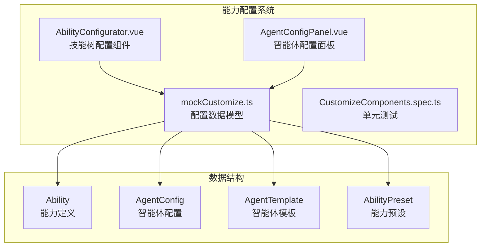
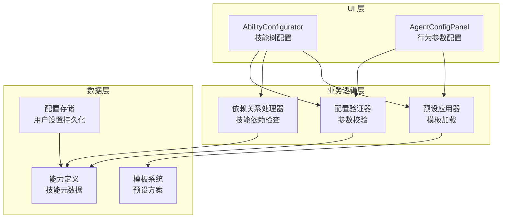
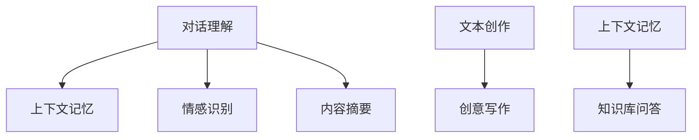
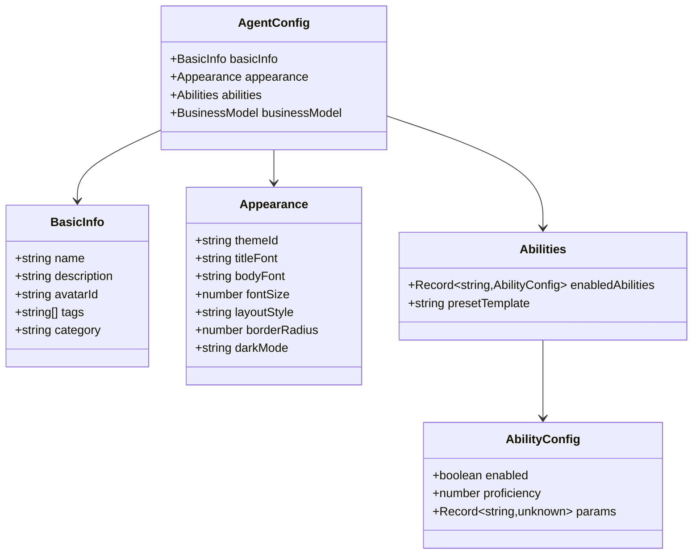
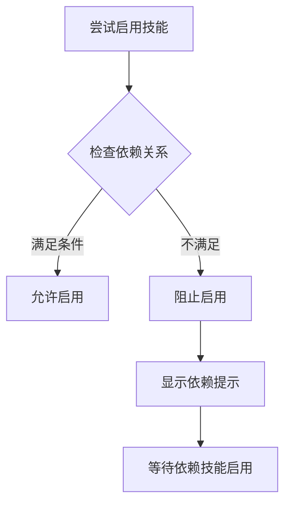
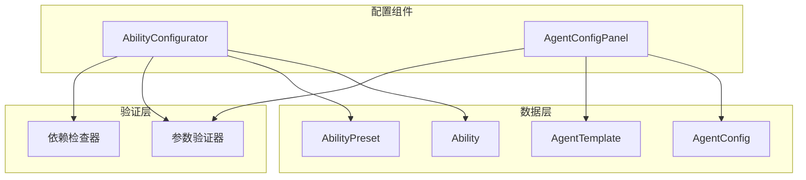

# 能力配置系统

<cite>
**本文档引用的文件**
- [AbilityConfigurator.vue](file://apps/AgentPit/src/components/customize/AbilityConfigurator.vue)
- [mockCustomize.ts](file://apps/AgentPit/src/data/mockCustomize.ts)
- [AgentConfigPanel.vue](file://apps/AgentPit/src/components/collaboration/AgentConfigPanel.vue)
- [CustomizeComponents.spec.ts](file://apps/AgentPit/src/__tests__/components/customize/CustomizeComponents.spec.ts)
</cite>

## 目录
1. [简介](#简介)
2. [项目结构](#项目结构)
3. [核心组件](#核心组件)
4. [架构概览](#架构概览)
5. [详细组件分析](#详细组件分析)
6. [依赖关系分析](#依赖关系分析)
7. [性能考虑](#性能考虑)
8. [故障排除指南](#故障排除指南)
9. [最佳实践指南](#最佳实践指南)
10. [结论](#结论)

## 简介

能力配置系统是 AgentPit 平台的核心功能模块，负责管理智能体的各种能力和行为参数。该系统提供了灵活的能力配置机制，允许用户根据不同的使用场景和需求来定制智能体的行为特征。

系统主要包含两个核心组件：
- **AbilityConfigurator**：用于配置智能体的技能树和能力组合
- **AgentConfigPanel**：用于配置协作场景下的智能体行为参数

这些组件共同构成了一个完整的智能体配置生态系统，支持从基础对话能力到高级分析能力的全方位配置。

## 项目结构

能力配置系统主要分布在以下目录结构中：

**图表来源**
- [AbilityConfigurator.vue:1-358](file://apps/AgentPit/src/components/customize/AbilityConfigurator.vue#L1-L358)
- [mockCustomize.ts:19-93](file://apps/AgentPit/src/data/mockCustomize.ts#L19-L93)

**章节来源**
- [AbilityConfigurator.vue:1-358](file://apps/AgentPit/src/components/customize/AbilityConfigurator.vue#L1-L358)
- [mockCustomize.ts:1-911](file://apps/AgentPit/src/data/mockCustomize.ts#L1-L911)

## 核心组件

### AbilityConfigurator 组件

AbilityConfigurator 是能力配置系统的核心组件，提供了可视化的技能树配置界面。该组件支持以下主要功能：

#### 技能树管理
- **分类显示**：按对话、创作、分析、工具、多模态五个类别组织技能
- **动态展开**：支持按类别展开/折叠技能列表
- **技能切换**：通过开关控制技能的启用/禁用状态

#### 依赖关系管理
- **依赖检测**：自动检测技能间的依赖关系
- **条件启用**：只有满足依赖条件的技能才能被启用
- **依赖提示**：显示未满足的依赖技能

#### 参数配置
- **参数编辑**：支持不同类型的参数（数字、布尔值、文本）
- **熟练度调节**：每个技能都有独立的熟练度设置
- **实时更新**：配置变更即时反映到智能体行为

**章节来源**
- [AbilityConfigurator.vue:36-144](file://apps/AgentPit/src/components/customize/AbilityConfigurator.vue#L36-L144)

### AgentConfigPanel 组件

AgentConfigPanel 专门用于配置协作场景下的智能体行为参数，支持：

#### 通用配置
- **超时设置**：控制请求超时时间（1-300秒）
- **重试机制**：配置重试次数（0-10次）
- **日志级别**：调试、信息、警告、错误四个级别
- **优先级权重**：1-10的优先级范围

#### 行为配置
- **响应风格**：正式、友好、幽默三种风格
- **输出详细程度**：简洁、正常、详细三个级别
- **并发控制**：最大并发任务数设置

#### 工具集成
- **工具启用**：按需启用或禁用特定工具
- **特殊配置**：针对不同智能体类型的专用参数

**章节来源**
- [AgentConfigPanel.vue:13-43](file://apps/AgentPit/src/components/collaboration/AgentConfigPanel.vue#L13-L43)

## 架构概览

能力配置系统采用分层架构设计，确保了良好的可维护性和扩展性：

**图表来源**
- [AbilityConfigurator.vue:69-137](file://apps/AgentPit/src/components/customize/AbilityConfigurator.vue#L69-L137)
- [AgentConfigPanel.vue:110-177](file://apps/AgentPit/src/components/collaboration/AgentConfigPanel.vue#L110-L177)

系统的核心优势在于其模块化设计，每个组件都有明确的职责分工，同时通过统一的数据接口进行通信。

## 详细组件分析

### 技能树配置机制

#### 能力分类体系

系统将所有技能按照功能特性分为五大类别：

| 类别 | 描述 | 示例技能 |
|------|------|----------|
| conversation | 对话能力 | 对话理解、上下文记忆、情感识别 |
| creative | 创作能力 | 文本创作、代码生成、创意写作 |
| analysis | 分析能力 | 数据分析、逻辑推理、内容摘要 |
| tool | 工具调用 | 网络搜索、代码执行、API集成 |
| multimodal | 多模态 | 图像描述、语音输入 |

#### 依赖关系设计

技能之间的依赖关系确保了合理的配置顺序：

**图表来源**
- [mockCustomize.ts:311-469](file://apps/AgentPit/src/data/mockCustomize.ts#L311-L469)

#### 预设模板系统

系统提供了四种预设模板，每种模板都针对特定的使用场景：

| 预设名称 | 适用场景 | 包含技能 |
|----------|----------|----------|
| 通用型 | 大多数基础场景 | 对话理解、上下文记忆、网络搜索、翻译 |
| 专业型 | 专业领域深度应用 | 对话理解、知识库、数据分析、逻辑推理、文件处理 |
| 创意型 | 内容创作场景 | 文本创作、创意写作、翻译、内容摘要 |
| 效率型 | 提升工作效率 | 网络搜索、代码执行、API集成、文件处理、内容摘要 |

**章节来源**
- [mockCustomize.ts:837-866](file://apps/AgentPit/src/data/mockCustomize.ts#L837-L866)

### 配置数据结构

#### AgentConfig 数据模型

AgentConfig 是智能体配置的核心数据结构，包含以下主要部分：

**图表来源**
- [mockCustomize.ts:39-93](file://apps/AgentPit/src/data/mockCustomize.ts#L39-L93)

#### 能力定义结构

每个能力都有详细的元数据定义：

| 字段 | 类型 | 描述 | 示例值 |
|------|------|------|--------|
| id | string | 能力唯一标识符 | "conversation-understanding" |
| name | string | 能力名称 | "对话理解" |
| description | string | 能力描述 | "深度理解用户意图..." |
| category | enum | 能力分类 | "conversation" |
| icon | string | 显示图标 | "💬" |
| isPremium | boolean | 是否为付费功能 | false |
| dependencies | string[] | 依赖的其他能力 | ["conversation-understanding"] |
| defaultParams | Record | 默认参数配置 | {temperature: 0.7, maxTokens: 2048} |

**章节来源**
- [mockCustomize.ts:19-28](file://apps/AgentPit/src/data/mockCustomize.ts#L19-L28)

### 验证与错误处理

系统实现了多层次的验证机制来确保配置的有效性：

#### 参数验证规则

| 参数类型 | 验证规则 | 错误消息 |
|----------|----------|----------|
| 超时时间 | 1000ms ≤ value ≤ 300000ms | "超时时间至少为 1000ms" |
| 重试次数 | 0 ≤ value ≤ 10 | "重试次数不能超过 10 次" |
| 优先级权重 | 1 ≤ value ≤ 10 | "优先级权重必须在 1-10 之间" |
| 数字输入 | 必须为有效数字 | "请输入有效的数字" |

#### 依赖关系验证

系统会自动检测并阻止不合法的配置组合：

**图表来源**
- [AbilityConfigurator.vue:69-79](file://apps/AgentPit/src/components/customize/AbilityConfigurator.vue#L69-L79)

**章节来源**
- [AgentConfigPanel.vue:110-143](file://apps/AgentPit/src/components/collaboration/AgentConfigPanel.vue#L110-L143)

## 依赖关系分析

### 组件间依赖

**图表来源**
- [AbilityConfigurator.vue:1-12](file://apps/AgentPit/src/components/customize/AbilityConfigurator.vue#L1-L12)
- [AgentConfigPanel.vue:1-11](file://apps/AgentPit/src/components/collaboration/AgentConfigPanel.vue#L1-L11)

### 数据流分析

配置系统遵循清晰的数据流向：

1. **用户交互** → **组件状态** → **配置对象** → **持久化存储**
2. **模板加载** → **默认配置** → **用户修改** → **最终配置**
3. **验证检查** → **错误反馈** → **用户修正** → **配置确认**

**章节来源**
- [AbilityConfigurator.vue:139-148](file://apps/AgentPit/src/components/customize/AbilityConfigurator.vue#L139-L148)

## 性能考虑

### 渲染性能优化

系统采用了多项性能优化策略：

#### 计算属性缓存
- 使用 Vue 的计算属性缓存复杂的派生数据
- 避免不必要的重新计算和渲染
- 合理的响应式数据粒度控制

#### 条件渲染
- 折叠/展开的技能列表只渲染可见部分
- 按需加载预设模板和配置详情
- 避免一次性渲染大量 DOM 元素

#### 事件处理优化
- 输入事件防抖处理
- 批量状态更新减少重渲染
- 合理的事件监听器生命周期管理

### 内存管理

#### 数据结构优化
- 使用扁平化的数据结构存储配置
- 避免深层嵌套导致的内存浪费
- 及时清理不再使用的配置快照

#### 存储策略
- 预设配置本地存储优化
- 配置变更增量保存
- 内存中的配置缓存管理

## 故障排除指南

### 常见问题及解决方案

#### 技能无法启用
**症状**：技能开关显示为灰色，无法点击启用
**原因**：未满足依赖关系
**解决方法**：
1. 查看技能下方的依赖提示信息
2. 先启用依赖的前置技能
3. 确认前置技能已成功启用

#### 参数输入无效
**症状**：输入框显示红色边框，无法保存配置
**原因**：参数值超出有效范围
**解决方法**：
1. 检查参数的最小/最大值限制
2. 确保输入的是有效数字
3. 参考错误提示信息修正参数

#### 预设加载失败
**症状**：预设列表为空或加载报错
**原因**：本地存储损坏或浏览器兼容性问题
**解决方法**：
1. 清除浏览器本地存储
2. 检查浏览器 JavaScript 支持
3. 重新创建预设配置

**章节来源**
- [AgentConfigPanel.vue:168-177](file://apps/AgentPit/src/components/collaboration/AgentConfigPanel.vue#L168-L177)

### 调试技巧

#### 开发者工具使用
- 使用 Vue DevTools 监控组件状态变化
- 检查计算属性的重新计算频率
- 分析事件处理函数的调用情况

#### 日志记录
- 在关键配置变更点添加日志
- 记录验证失败的原因和参数
- 跟踪依赖关系检查的结果

## 最佳实践指南

### 能力配置最佳实践

#### 合理的技能组合
- **基础场景**：对话理解 + 上下文记忆 + 网络搜索
- **专业场景**：对话理解 + 知识库 + 数据分析 + 逻辑推理
- **创意场景**：文本创作 + 创意写作 + 翻译 + 内容摘要
- **效率场景**：网络搜索 + 代码执行 + API集成 + 文件处理

#### 参数调优建议

| 参数类型 | 调优原则 | 推荐范围 |
|----------|----------|----------|
| temperature | 控制创造性，数值越低越理性 | 0.1-0.9 |
| maxTokens | 控制输出长度，避免过长影响性能 | 512-4096 |
| contextWindow | 控制上下文长度，平衡性能与效果 | 1024-16384 |
| proficiency | 控制技能强度，避免过度配置 | 60-95 |

#### 依赖关系管理
- **先基础后高级**：先启用基础对话能力，再逐步添加高级功能
- **按需配置**：只启用实际需要的技能，避免冗余配置
- **定期评估**：根据使用效果调整技能组合和参数设置

### 预设模板使用指南

#### 模板选择策略
- **新用户**：从通用型模板开始，逐步调整
- **专业用户**：直接使用专业型或效率型模板
- **特殊场景**：根据具体需求组合多个模板

#### 预设管理
- **命名规范**：使用描述性的预设名称
- **版本控制**：重要配置定期备份
- **团队共享**：建立团队内部的配置标准

### 性能优化建议

#### 配置优化
- **避免过度配置**：技能数量过多会影响响应速度
- **合理参数设置**：避免设置过高的资源消耗参数
- **定期清理**：删除不再使用的配置和预设

#### 监控与调优
- **性能监控**：关注响应时间和资源使用情况
- **A/B 测试**：对比不同配置的效果差异
- **持续改进**：根据使用数据不断优化配置

## 结论

能力配置系统通过其模块化的设计和完善的验证机制，为用户提供了灵活而可靠的智能体配置体验。系统不仅支持基础的技能树配置，还提供了丰富的预设模板和参数调优选项，能够满足从入门用户到专业用户的多样化需求。

系统的架构设计充分考虑了可扩展性和可维护性，为未来的功能扩展和技术升级奠定了坚实的基础。通过遵循最佳实践指南和性能优化建议，用户可以充分发挥系统的潜力，构建出符合自身需求的智能体配置方案。

随着 AI 技术的不断发展，能力配置系统也将持续演进，为用户提供更加智能化和个性化的配置体验。