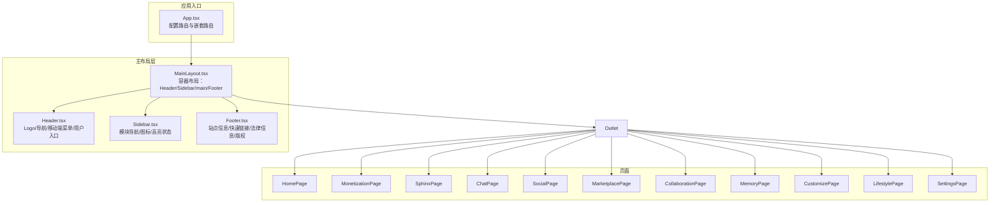
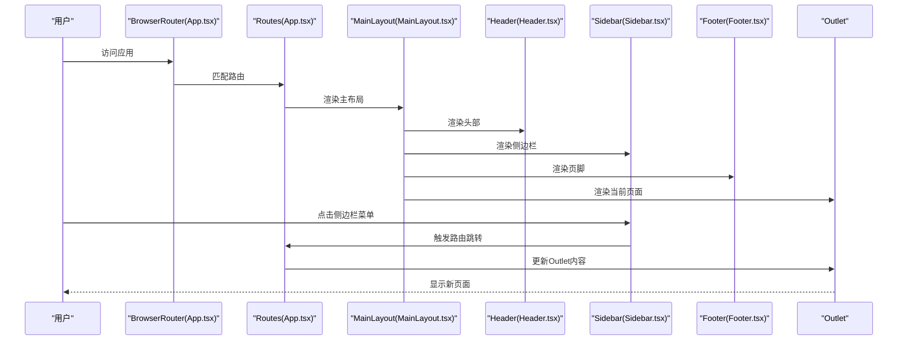
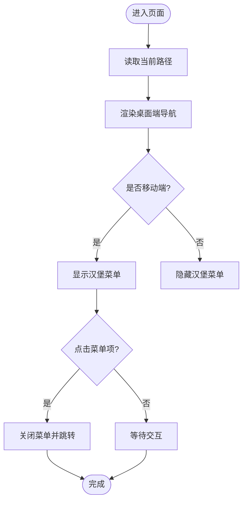
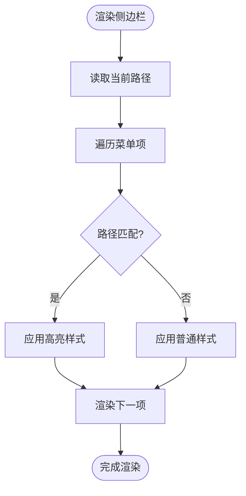
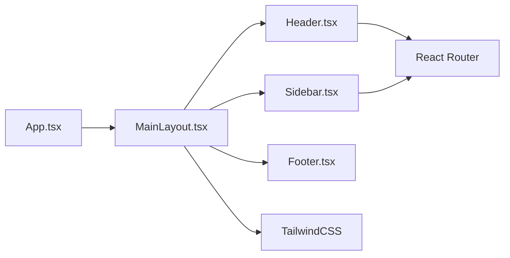

# 用户界面设计与交互

<cite>
**本文引用的文件**
- [MainLayout.tsx](file://apps/AgentPit/src-react-backup-20260410/components/layout/MainLayout.tsx)
- [Header.tsx](file://apps/AgentPit/src-react-backup-20260410/components/layout/Header.tsx)
- [Sidebar.tsx](file://apps/AgentPit/src-react-backup-20260410/components/layout/Sidebar.tsx)
- [Footer.tsx](file://apps/AgentPit/src-react-backup-20260410/components/layout/Footer.tsx)
- [App.tsx](file://apps/AgentPit/src-react-backup-20260410/App.tsx)
- [index.css](file://apps/AgentPit/src-react-backup-20260410/index.css)
- [tailwind.config.ts](file://apps/AgentPit/tailwind.config.ts)
</cite>

## 目录
1. [引言](#引言)
2. [项目结构](#项目结构)
3. [核心组件](#核心组件)
4. [架构总览](#架构总览)
5. [详细组件分析](#详细组件分析)
6. [依赖关系分析](#依赖关系分析)
7. [性能考虑](#性能考虑)
8. [故障排查指南](#故障排查指南)
9. [结论](#结论)
10. [附录](#附录)

## 引言
本文件面向产品与设计团队，系统性阐述 AgentPit 应用的用户界面设计与交互规范。重点覆盖主布局（MainLayout）的设计原则与响应式布局实现；头部导航栏（Header）的功能组件（Logo 展示、移动端菜单、用户入口等）；侧边栏（Sidebar）的菜单结构与导航逻辑；页脚（Footer）的信息展示与版权信息；以及主题与暗色模式支持、自适应设计等用户体验优化策略。同时提供 UI 组件的使用指南与定制化建议，帮助在不破坏一致性前提下进行扩展。

## 项目结构
AgentPit 的前端采用 React + TailwindCSS 架构，页面通过 React Router 管理路由与嵌套路由，主布局负责承载 Header、Sidebar、主内容区与 Footer，并通过 Outlet 渲染当前路由页面。

图表来源
- [App.tsx:15-38](file://apps/AgentPit/src-react-backup-20260410/App.tsx#L15-L38)
- [MainLayout.tsx:6-19](file://apps/AgentPit/src-react-backup-20260410/components/layout/MainLayout.tsx#L6-L19)
- [Header.tsx:4-96](file://apps/AgentPit/src-react-backup-20260410/components/layout/Header.tsx#L4-L96)
- [Sidebar.tsx:3-134](file://apps/AgentPit/src-react-backup-20260410/components/layout/Sidebar.tsx#L3-L134)
- [Footer.tsx:1-42](file://apps/AgentPit/src-react-backup-20260410/components/layout/Footer.tsx#L1-L42)

章节来源
- [App.tsx:1-41](file://apps/AgentPit/src-react-backup-20260410/App.tsx#L1-L41)
- [MainLayout.tsx:1-22](file://apps/AgentPit/src-react-backup-20260410/components/layout/MainLayout.tsx#L1-L22)

## 核心组件
- 主布局（MainLayout）
  - 设计原则：以最小高度约束与 Flex 布局确保内容区自适应滚动，Header 固定顶部，Sidebar 固定左侧，Footer 自动贴底，保证三段式布局稳定。
  - 响应式实现：通过 Tailwind 工具类控制侧边栏在小屏隐藏、移动端菜单弹出，主内容区溢出滚动。
- 头部导航（Header）
  - Logo：左上角品牌标识，点击回到首页。
  - 导航：桌面端横向导航，移动端折叠为汉堡菜单。
  - 用户入口：右侧用户头像占位，预留通知与搜索入口。
- 侧边栏（Sidebar）
  - 菜单项：包含全部业务模块的链接与对应图标。
  - 导航逻辑：基于当前路径高亮选中项，提供过渡动画与悬停态。
  - 权限控制：当前实现未内建权限判断，可在菜单项渲染前按角色过滤。
  - 状态保持：利用路由状态维持选中态，刷新后仍可恢复。
- 页脚（Footer）
  - 信息展示：站点简介、快速链接、法律信息三列布局。
  - 版权信息：居中显示年份与版权归属。

章节来源
- [MainLayout.tsx:6-19](file://apps/AgentPit/src-react-backup-20260410/components/layout/MainLayout.tsx#L6-L19)
- [Header.tsx:4-96](file://apps/AgentPit/src-react-backup-20260410/components/layout/Header.tsx#L4-L96)
- [Sidebar.tsx:3-134](file://apps/AgentPit/src-react-backup-20260410/components/layout/Sidebar.tsx#L3-L134)
- [Footer.tsx:1-42](file://apps/AgentPit/src-react-backup-20260410/components/layout/Footer.tsx#L1-L42)

## 架构总览
下图展示从应用入口到各页面的导航流程，体现主布局对页面的包裹与路由分发。

图表来源
- [App.tsx:15-38](file://apps/AgentPit/src-react-backup-20260410/App.tsx#L15-L38)
- [MainLayout.tsx:6-19](file://apps/AgentPit/src-react-backup-20260410/components/layout/MainLayout.tsx#L6-L19)
- [Sidebar.tsx:3-134](file://apps/AgentPit/src-react-backup-20260410/components/layout/Sidebar.tsx#L3-L134)

## 详细组件分析

### 主布局（MainLayout）
- 结构职责
  - 容器：统一背景色、最小高度、Flex 布局。
  - 分区：Header 固定、Sidebar 固定、main 占满剩余空间、Footer 自动贴底。
  - 内容：通过 Outlet 动态渲染当前路由页面。
- 响应式策略
  - 侧边栏在小屏隐藏，移动端通过 Header 的汉堡菜单展开完整导航。
  - 主内容区设置溢出滚动，避免布局塌陷。
- 可扩展点
  - 可在容器层增加全局加载态、错误兜底、主题切换状态管理。
  - 可引入 Store 统一管理菜单状态与面包屑。

章节来源
- [MainLayout.tsx:6-19](file://apps/AgentPit/src-react-backup-20260410/components/layout/MainLayout.tsx#L6-L19)

### 头部导航（Header）
- Logo 展示
  - 左上角品牌标识，点击返回首页。
- 导航菜单
  - 桌面端：横向展示部分常用模块，点击即跳转。
  - 移动端：汉堡菜单展开完整列表，点击后收起。
- 用户入口
  - 预留通知按钮与用户头像占位，便于接入用户菜单与消息中心。
- 交互细节
  - 当前路径高亮：根据 location.pathname 判断激活项。
  - 过渡动画：悬停态与激活态均使用过渡效果提升反馈。
- 可定制化
  - 可替换 Logo 文案或图片。
  - 可新增搜索框、快捷操作按钮。

图表来源
- [Header.tsx:4-96](file://apps/AgentPit/src-react-backup-20260410/components/layout/Header.tsx#L4-L96)

章节来源
- [Header.tsx:4-96](file://apps/AgentPit/src-react-backup-20260410/components/layout/Header.tsx#L4-L96)

### 侧边栏（Sidebar）
- 菜单结构
  - 模块覆盖：首页、自动变现、Sphinx 建站、智能体对话、社交连接、交易市场、多智能体协作、存储记忆、定制智能体、生活服务、系统设置。
  - 图标：每个菜单项配有简洁 SVG 图标，增强识别度。
- 导航逻辑
  - 高亮：当前路径匹配时显示强调边框与颜色。
  - 悬停：提供悬停态过渡，改善交互反馈。
- 权限控制
  - 当前实现未内置权限判断，建议在渲染前按用户角色过滤菜单项。
- 状态保持
  - 基于路由状态维持选中态，刷新后可恢复。
- 可定制化
  - 可按模块分组添加分隔线或分组标题。
  - 可扩展为可折叠/展开的二级菜单。

图表来源
- [Sidebar.tsx:3-134](file://apps/AgentPit/src-react-backup-20260410/components/layout/Sidebar.tsx#L3-L134)

章节来源
- [Sidebar.tsx:3-134](file://apps/AgentPit/src-react-backup-20260410/components/layout/Sidebar.tsx#L3-L134)

### 页脚（Footer）
- 信息组织
  - 站点简介：简要描述平台定位。
  - 快速链接：关于、文档、API、联系。
  - 法律信息：隐私政策、服务条款、Cookie 政策。
- 版权信息
  - 年份动态更新，版权归属清晰。
- 响应式
  - 小屏时三列布局变为单列堆叠，保证可读性。

章节来源
- [Footer.tsx:1-42](file://apps/AgentPit/src-react-backup-20260410/components/layout/Footer.tsx#L1-L42)

### 主题与暗色模式支持
- 当前状态
  - 使用 Tailwind 的默认浅色主题，主色系通过 tailwind.config.ts 扩展 primary 色阶。
- 暗色模式建议
  - 在 tailwind.config.ts 中启用 darkMode 选项，结合系统偏好或用户开关切换。
  - 为 Header、Sidebar、Footer、卡片等组件分别定义深色态样式。
  - 为图标与边框颜色补充深色版本，确保对比度与可读性。
- 自适应设计
  - 借助 Tailwind 断点（sm/md/lg/xl）控制 Header/Sidebar 的显隐与布局。
  - 为移动端提供更宽的触控目标与更清晰的视觉层级。

章节来源
- [tailwind.config.ts:1-27](file://apps/AgentPit/tailwind.config.ts#L1-L27)
- [index.css:1-18](file://apps/AgentPit/src-react-backup-20260410/index.css#L1-L18)

## 依赖关系分析
- 组件耦合
  - MainLayout 作为容器，聚合 Header、Sidebar、Footer，形成稳定的布局骨架。
  - Header 与 Sidebar 均依赖路由状态（location）进行高亮与交互，耦合度低。
- 外部依赖
  - React Router：负责路由与嵌套路由。
  - TailwindCSS：提供原子化样式与响应式工具类。
- 潜在风险
  - 菜单与路由路径需保持一致，避免高亮失效或跳转失败。
  - 移动端菜单与侧边栏的交互状态需统一管理，避免冲突。

图表来源
- [App.tsx:15-38](file://apps/AgentPit/src-react-backup-20260410/App.tsx#L15-L38)
- [MainLayout.tsx:6-19](file://apps/AgentPit/src-react-backup-20260410/components/layout/MainLayout.tsx#L6-L19)
- [Header.tsx:4-96](file://apps/AgentPit/src-react-backup-20260410/components/layout/Header.tsx#L4-L96)
- [Sidebar.tsx:3-134](file://apps/AgentPit/src-react-backup-20260410/components/layout/Sidebar.tsx#L3-L134)

章节来源
- [App.tsx:1-41](file://apps/AgentPit/src-react-backup-20260410/App.tsx#L1-L41)
- [MainLayout.tsx:1-22](file://apps/AgentPit/src-react-backup-20260410/components/layout/MainLayout.tsx#L1-L22)

## 性能考虑
- 路由懒加载
  - 对大型页面组件采用动态导入，减少首屏包体与首次渲染时间。
- 组件拆分
  - Header/Sidebar/Footer 独立渲染，避免非必要重绘。
- 样式体积
  - Tailwind 按需引入，避免无用类导致体积膨胀。
- 交互反馈
  - 过渡动画尽量使用 GPU 加速属性（如 transform），避免频繁触发回流。

## 故障排查指南
- 问题：侧边栏高亮不生效
  - 检查菜单路径与路由路径是否一致。
  - 确认 location 变化是否触发重新渲染。
- 问题：移动端菜单无法关闭
  - 检查汉堡菜单状态切换逻辑与点击事件绑定。
- 问题：页面空白或布局错乱
  - 检查 MainLayout 的 Flex 布局与 Outlet 是否正确渲染。
  - 确认 Tailwind 基础样式是否正确引入。
- 问题：图标显示异常
  - 检查 SVG 图标的尺寸与 stroke 设置是否一致。

章节来源
- [Header.tsx:4-96](file://apps/AgentPit/src-react-backup-20260410/components/layout/Header.tsx#L4-L96)
- [Sidebar.tsx:3-134](file://apps/AgentPit/src-react-backup-20260410/components/layout/Sidebar.tsx#L3-L134)
- [MainLayout.tsx:6-19](file://apps/AgentPit/src-react-backup-20260410/components/layout/MainLayout.tsx#L6-L19)
- [index.css:1-18](file://apps/AgentPit/src-react-backup-20260410/index.css#L1-L18)

## 结论
AgentPit 的 UI 架构以简洁清晰为主，主布局与响应式设计保证了良好的可用性。头部与侧边栏承担导航职责，页脚提供信息与版权展示。建议后续在权限控制、暗色模式与路由懒加载方面进一步完善，以提升安全性、可访问性与性能表现。

## 附录
- 使用指南
  - 新增页面：在 App.tsx 的 Routes 中注册路由与嵌套页面。
  - 新增菜单：在 Sidebar 的菜单数组中添加新项，确保路径与页面一致。
  - 修改主题：在 tailwind.config.ts 中扩展颜色或启用暗色模式。
- 定制化建议
  - 为 Header 增加搜索框与通知中心入口。
  - 为 Sidebar 添加分组与折叠能力，适配更多模块。
  - 为 Footer 增加社交媒体链接与语言切换。